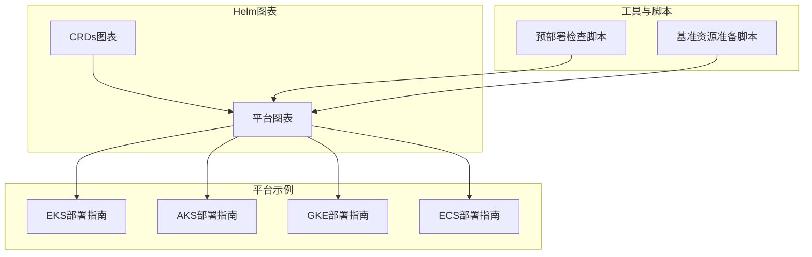
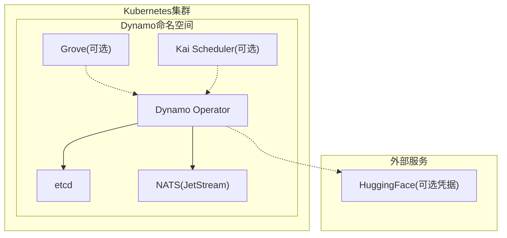
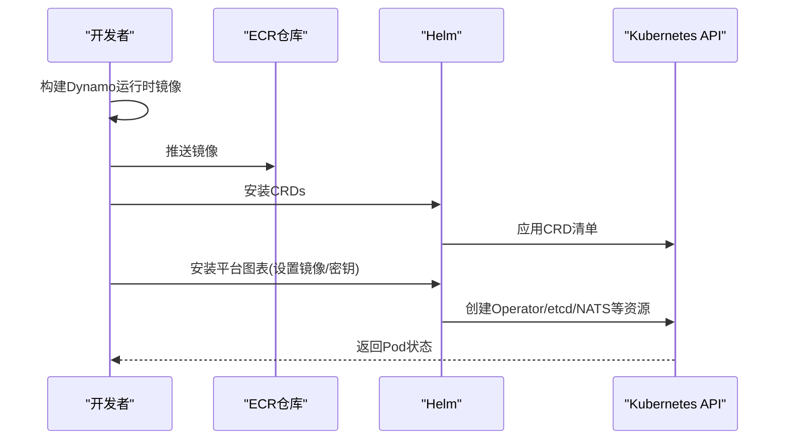
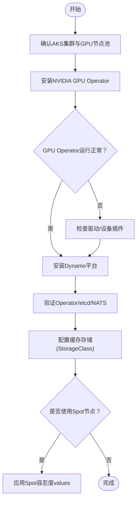
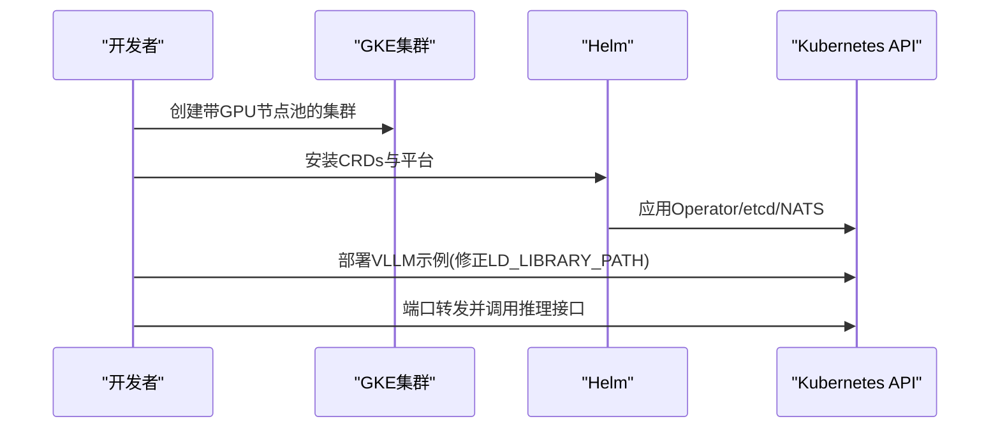
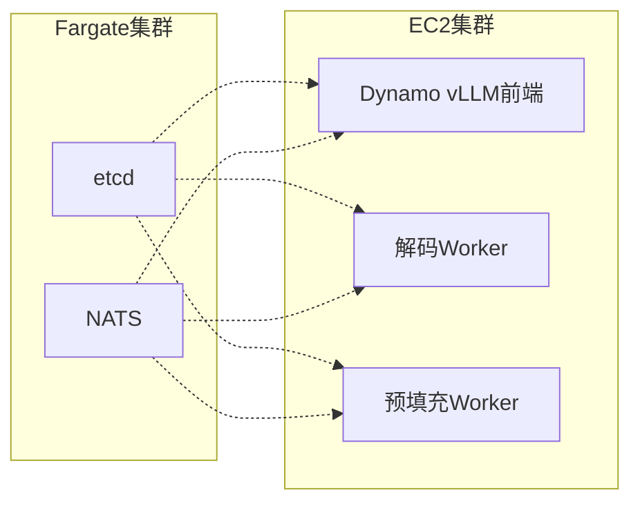
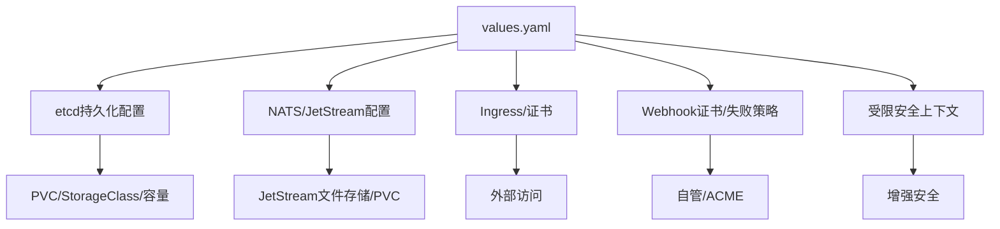
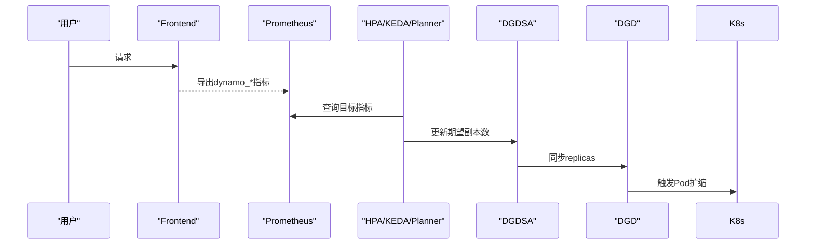
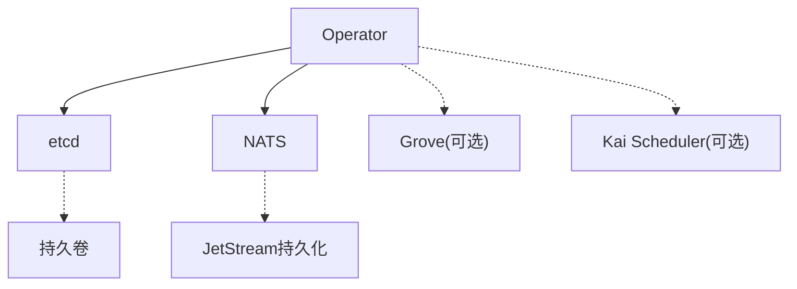

# 云平台部署

<cite>
**本文引用的文件**
- [部署总览](file://deploy/helm/README.md)
- [平台Helm图表说明](file://deploy/helm/charts/platform/README.md)
- [平台Helm默认值](file://deploy/helm/charts/platform/values.yaml)
- [AKS部署指南](file://examples/deployments/AKS/AKS-deployment.md)
- [AKS Spot节点值覆盖](file://examples/deployments/AKS/values-aks-spot.yaml)
- [EKS部署指南（从源码安装）](file://examples/deployments/EKS/Deploy_Dynamo_Kubernetes_Platform.md)
- [GKE部署指南](file://examples/deployments/GKE/README.md)
- [ECS部署指南](file://examples/deployments/ECS/README.md)
- [Kubernetes安装指南](file://docs/pages/kubernetes/installation-guide.md)
- [Kubernetes自动扩缩容指南](file://docs/pages/kubernetes/autoscaling.md)
- [Operator说明](file://deploy/operator/README.md)
- [预部署检查脚本](file://deploy/pre-deployment/pre-deployment-check.sh)
- [基准测试资源准备脚本](file://deploy/utils/setup_benchmarking_resources.sh)
</cite>

## 目录
1. [简介](#简介)
2. [项目结构](#项目结构)
3. [核心组件](#核心组件)
4. [架构总览](#架构总览)
5. [详细组件分析](#详细组件分析)
6. [依赖关系分析](#依赖关系分析)
7. [性能考虑](#性能考虑)
8. [故障排查指南](#故障排查指南)
9. [结论](#结论)
10. [附录](#附录)

## 简介
本指南面向在主流云平台（AWS EKS、Azure AKS、Google GKE、Amazon ECS）上部署Dynamo的工程师与运维人员。内容涵盖各平台前置条件、资源配置、部署步骤、Helm图表配置要点（含存储卷、网络与安全）、高可用与自动扩缩容实践、平台特定优化建议以及常见问题排查。

## 项目结构
围绕Dynamo在Kubernetes上的部署，仓库提供了：
- Helm图表：用于一键安装Dynamo平台组件（Operator、etcd、NATS、可选Grove/Kai）
- 平台部署示例：针对EKS、AKS、GKE的分步指南与最佳实践
- ECS部署示例：基于EC2/Fargate混合集群的vLLM示例
- 自动扩缩容与观测性：HPA/KEDA/Planner集成与指标参考
- 预部署检查与基准资源准备脚本

**图示来源**
- [部署总览](file://deploy/helm/README.md#L18-L23)
- [平台Helm图表说明](file://deploy/helm/charts/platform/README.md)
- [EKS部署指南（从源码安装）](file://examples/deployments/EKS/Deploy_Dynamo_Kubernetes_Platform.md#L1-L97)
- [AKS部署指南](file://examples/deployments/AKS/AKS-deployment.md#L1-L201)
- [GKE部署指南](file://examples/deployments/GKE/README.md#L1-L189)
- [ECS部署指南](file://examples/deployments/ECS/README.md#L1-L129)
- [预部署检查脚本](file://deploy/pre-deployment/pre-deployment-check.sh#L1-L284)
- [基准测试资源准备脚本](file://deploy/utils/setup_benchmarking_resources.sh#L1-L107)

**章节来源**
- [部署总览](file://deploy/helm/README.md#L18-L23)
- [平台Helm图表说明](file://deploy/helm/charts/platform/README.md)

## 核心组件
- Dynamo Kubernetes Operator：管理自定义资源（DGD/DGDR），负责推理图的编排与生命周期
- etcd：分布式键值存储，保存平台状态
- NATS：消息系统，支持JetStream持久化与监控端点
- 可选组件：Grove（多节点编排）、Kai Scheduler（智能调度）
- Helm图表：提供CRDs安装与平台组件一键部署

**章节来源**
- [Kubernetes安装指南](file://docs/pages/kubernetes/installation-guide.md#L6-L42)
- [平台Helm默认值](file://deploy/helm/charts/platform/values.yaml#L19-L114)
- [平台Helm默认值](file://deploy/helm/charts/platform/values.yaml#L279-L334)
- [平台Helm默认值](file://deploy/helm/charts/platform/values.yaml#L335-L483)
- [Operator说明](file://deploy/operator/README.md#L1-L37)

## 架构总览
Dynamo平台通过Helm图表在Kubernetes中安装核心组件，并由Operator根据DGD/DGDR资源进行工作负载编排。NATS提供消息通道，etcd保存状态；可选Grove/Kai增强多节点与调度能力。

**图示来源**
- [平台Helm默认值](file://deploy/helm/charts/platform/values.yaml#L19-L114)
- [平台Helm默认值](file://deploy/helm/charts/platform/values.yaml#L279-L334)
- [平台Helm默认值](file://deploy/helm/charts/platform/values.yaml#L335-L483)
- [平台Helm默认值](file://deploy/helm/charts/platform/values.yaml#L259-L278)
- [平台Helm默认值](file://deploy/helm/charts/platform/values.yaml#L268-L278)

## 详细组件分析

### AWS EKS 部署
- 前置条件
  - 已创建EKS集群与GPU节点池（推荐使用托管节点或托管实例）
  - 安装kubectl、Helm、Docker
  - 准备镜像仓库（如ECR）与拉取密钥
- 镜像构建与推送
  - 使用渲染脚本生成运行时镜像并推送到ECR
- 安装Dynamo平台
  - 先安装CRDs，再安装平台图表；可设置Operator镜像与拉取密钥
- 验证
  - 检查dynamo-system命名空间内Operator、etcd、NATS等Pod状态

**图示来源**
- [EKS部署指南（从源码安装）](file://examples/deployments/EKS/Deploy_Dynamo_Kubernetes_Platform.md#L3-L30)
- [EKS部署指南（从源码安装）](file://examples/deployments/EKS/Deploy_Dynamo_Kubernetes_Platform.md#L57-L85)
- [Kubernetes安装指南](file://docs/pages/kubernetes/installation-guide.md#L121-L137)

**章节来源**
- [EKS部署指南（从源码安装）](file://examples/deployments/EKS/Deploy_Dynamo_Kubernetes_Platform.md#L1-L97)
- [Kubernetes安装指南](file://docs/pages/kubernetes/installation-guide.md#L74-L118)

### Azure AKS 部署
- 前置条件
  - AKS集群已创建且具备GPU节点池（建议跳过节点驱动安装，由GPU Operator接管）
  - 安装kubectl、Helm
- 安装NVIDIA GPU Operator
  - 验证GPU Operator各Pod处于Running状态
- 安装Dynamo平台
  - 参考Kubernetes安装指南，验证Operator、etcd、NATS等Pod
- 存储选项
  - 支持本地CSI（临时盘）、Azure Managed Lustre、Azure Disk、Azure Files、Azure Blob等；按缓存类型选择合适SC
- Spot节点
  - 若使用Spot节点池，需为平台组件添加相应容忍度；仓库提供专用values文件

**图示来源**
- [AKS部署指南](file://examples/deployments/AKS/AKS-deployment.md#L14-L56)
- [AKS部署指南](file://examples/deployments/AKS/AKS-deployment.md#L61-L146)
- [AKS部署指南](file://examples/deployments/AKS/AKS-deployment.md#L147-L182)

**章节来源**
- [AKS部署指南](file://examples/deployments/AKS/AKS-deployment.md#L1-L201)
- [AKS Spot节点值覆盖](file://examples/deployments/AKS/values-aks-spot.yaml#L1-L70)

### Google GKE 部署
- 前置条件
  - 已创建GKE集群与GPU节点池（启用GPU加速器与最新驱动版本）
  - 安装kubectl、Helm
- 安装Dynamo平台
  - 设置命名空间与HuggingFace凭据Secret后，按Kubernetes安装指南安装CRDs与平台
- 模型部署与测试
  - 调整VLLM容器args以正确加载GPU驱动路径；部署后端示例并进行连通性测试

**图示来源**
- [GKE部署指南](file://examples/deployments/GKE/README.md#L8-L70)
- [GKE部署指南](file://examples/deployments/GKE/README.md#L88-L156)

**章节来源**
- [GKE部署指南](file://examples/deployments/GKE/README.md#L1-L189)

### Amazon ECS 部署
- 架构模式
  - EC2集群承载vLLM工作负载（含前端与解码/预填充Worker）
  - Fargate集群承载etcd与NATS服务
- 步骤概览
  - 在EC2集群创建GPU实例并配置安全组与根卷大小
  - 在Fargate集群创建任务定义（etcd/NATS），并创建ecsTaskExecutionRole
  - 在EC2集群创建vLLM任务定义（前端/解码/预填充），设置容器端口与GPU资源
  - 部署并测试端点

**图示来源**
- [ECS部署指南](file://examples/deployments/ECS/README.md#L1-L129)

**章节来源**
- [ECS部署指南](file://examples/deployments/ECS/README.md#L1-L129)

### Helm图表配置要点（存储、网络、安全）
- 存储卷
  - etcd持久化：默认启用持久卷，可指定StorageClass与容量
  - NATS JetStream：可启用文件存储PVC，默认10Gi
  - PVC示例可通过基准资源脚本应用
- 网络策略
  - 默认不创建Ingress；如需外部访问，可启用className与TLS Secret
  - NATS服务端口按需开启（客户端、监控、Profiling等）
- 安全设置
  - Operator Webhook可启用失败策略与证书管理（自管或cert-manager）
  - 受限安全上下文可启用（增强安全性）
  - 外部etcd/NATS地址可配置，避免内置组件

**图示来源**
- [平台Helm默认值](file://deploy/helm/charts/platform/values.yaml#L279-L334)
- [平台Helm默认值](file://deploy/helm/charts/platform/values.yaml#L335-L483)
- [平台Helm默认值](file://deploy/helm/charts/platform/values.yaml#L115-L132)
- [平台Helm默认值](file://deploy/helm/charts/platform/values.yaml#L151-L211)
- [平台Helm默认值](file://deploy/helm/charts/platform/values.yaml#L97-L98)
- [平台Helm默认值](file://deploy/helm/charts/platform/values.yaml#L279-L334)

**章节来源**
- [平台Helm默认值](file://deploy/helm/charts/platform/values.yaml#L19-L114)
- [平台Helm默认值](file://deploy/helm/charts/platform/values.yaml#L279-L334)
- [平台Helm默认值](file://deploy/helm/charts/platform/values.yaml#L335-L483)
- [平台Helm默认值](file://deploy/helm/charts/platform/values.yaml#L115-L132)
- [平台Helm默认值](file://deploy/helm/charts/platform/values.yaml#L151-L211)
- [平台Helm默认值](file://deploy/helm/charts/platform/values.yaml#L97-L98)
- [基准测试资源准备脚本](file://deploy/utils/setup_benchmarking_resources.sh#L68-L87)

### 高可用与自动扩缩容
- 高可用
  - etcd单节点默认；生产建议3+副本并启用PDB
  - NATS可启用集群与JetStream持久化
  - Operator可启用Leader Election与命名空间限制
- 自动扩缩容
  - 通过DynamoGraphDeploymentScalingAdapter（每服务一个）对接HPA/KEDA/Planner
  - HPA：CPU/内存或外部指标（如TTFT p95）
  - KEDA：Prometheus触发器，支持多触发器与零扩缩
  - Planner：基于LLM指标（TTFT/ITL/KV利用率）的SLA感知扩缩容

**图示来源**
- [Kubernetes自动扩缩容指南](file://docs/pages/kubernetes/autoscaling.md#L41-L82)
- [Kubernetes自动扩缩容指南](file://docs/pages/kubernetes/autoscaling.md#L178-L343)
- [Kubernetes自动扩缩容指南](file://docs/pages/kubernetes/autoscaling.md#L388-L538)

**章节来源**
- [Kubernetes自动扩缩容指南](file://docs/pages/kubernetes/autoscaling.md#L1-L743)

## 依赖关系分析
- 组件耦合
  - Operator依赖etcd与NATS；etcd/NATS可替换为外部实例
  - Grove/Kai为可选增强，与Operator存在协作关系
- 外部依赖
  - GPU Operator（AKS/GKE）或节点驱动（EKS）
  - 镜像仓库（ECR/NGC）与拉取密钥
  - 可选：Prometheus/KEDA/Planner

**图示来源**
- [平台Helm默认值](file://deploy/helm/charts/platform/values.yaml#L279-L334)
- [平台Helm默认值](file://deploy/helm/charts/platform/values.yaml#L335-L483)
- [平台Helm默认值](file://deploy/helm/charts/platform/values.yaml#L259-L278)
- [平台Helm默认值](file://deploy/helm/charts/platform/values.yaml#L268-L278)

**章节来源**
- [平台Helm默认值](file://deploy/helm/charts/platform/values.yaml#L279-L334)
- [平台Helm默认值](file://deploy/helm/charts/platform/values.yaml#L335-L483)
- [平台Helm默认值](file://deploy/helm/charts/platform/values.yaml#L259-L278)
- [平台Helm默认值](file://deploy/helm/charts/platform/values.yaml#L268-L278)

## 性能考虑
- 存储
  - 模型缓存：优先共享高吞吐存储（如Azure Managed Lustre或GKE PD SSD）
  - 编译缓存：固定GPU配置下可使用持久磁盘；否则使用本地CSI
  - 性能缓存：使用本地临时存储
- 网络
  - NATS启用JetStream持久化与监控端口；必要时开启TLS
  - Ingress按需启用，确保证书与超时配置合理
- 扩缩容
  - 使用KEDA基于队列深度或TTFT p95触发；为不同服务选择合适策略
  - 合理设置稳定窗口与最小/最大副本，避免抖动

[本节为通用指导，无需“章节来源”]

## 故障排查指南
- 预部署检查
  - 使用脚本验证kubectl连通、默认StorageClass、GPU节点与GPU Operator状态
- 常见问题
  - “无法安装集群级Operator”：在共享集群中需启用命名空间限制
  - CRD已存在：跳过CRD安装步骤
  - etcd镜像“不受支持”：按提示添加兼容参数
  - 清理：先卸载平台，再逐个删除CRD
- 运维建议
  - 为Operator与核心组件配置命名空间限制与Leader Election
  - 为需要访问HF模型的场景创建凭据Secret

**章节来源**
- [预部署检查脚本](file://deploy/pre-deployment/pre-deployment-check.sh#L1-L284)
- [Kubernetes安装指南](file://docs/pages/kubernetes/installation-guide.md#L285-L347)
- [Kubernetes安装指南](file://docs/pages/kubernetes/installation-guide.md#L74-L118)

## 结论
通过Helm图表与平台示例，Dynamo可在EKS、AKS、GKE与ECS上快速落地。结合合适的存储与网络配置、高可用与自动扩缩容策略，可满足生产级推理服务的稳定性与弹性需求。建议在生产环境启用受限安全上下文、外部etcd/NATS、JetStream持久化与SLA感知扩缩容。

[本节为总结，无需“章节来源”]

## 附录
- 快速入口
  - [平台安装指南](file://docs/pages/kubernetes/installation-guide.md#L121-L194)
  - [平台Helm默认值](file://deploy/helm/charts/platform/values.yaml#L1-L778)
  - [预部署检查脚本](file://deploy/pre-deployment/pre-deployment-check.sh#L1-L284)
  - [基准测试资源准备脚本](file://deploy/utils/setup_benchmarking_resources.sh#L1-L107)