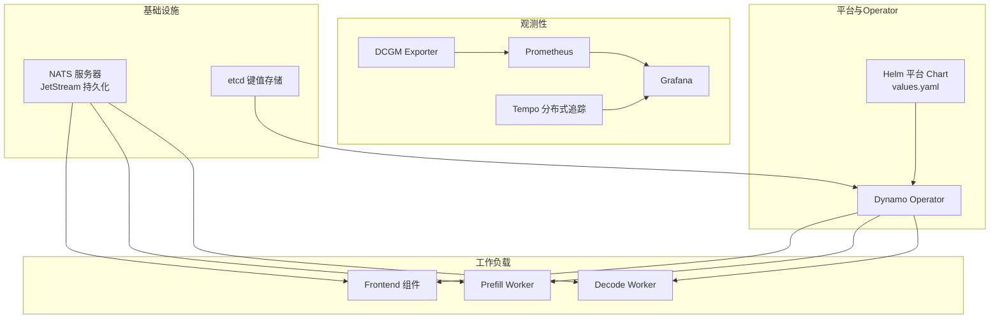
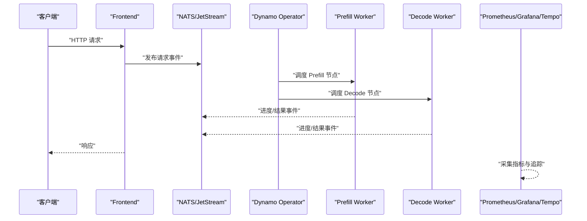
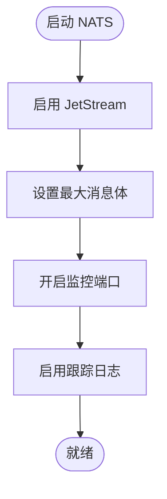
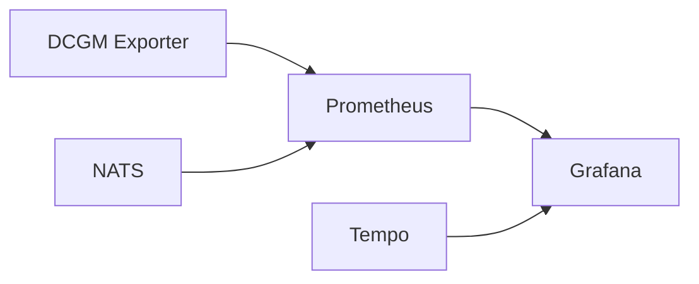
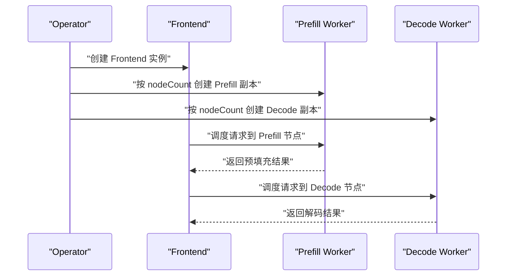
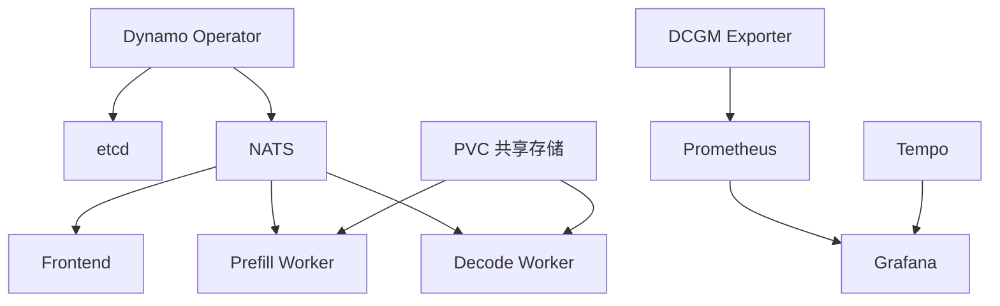

# 多节点集群部署

<cite>
**本文引用的文件**
- [docker-compose.yml](file://deploy/docker-compose.yml)
- [docker-observability.yml](file://deploy/docker-observability.yml)
- [nats-server.conf](file://deploy/nats-server.conf)
- [sanity_check.py](file://deploy/sanity_check.py)
- [pre-deployment-check.sh](file://deploy/pre-deployment/pre-deployment-check.sh)
- [disagg-multinode.yaml（vLLM）](file://examples/backends/vllm/deploy/disagg-multinode.yaml)
- [disagg-multinode.yaml（TensorRT-LLM）](file://examples/backends/trtllm/deploy/disagg-multinode.yaml)
- [disagg-multinode.yaml（SGLang）](file://examples/backends/sglang/deploy/disagg-multinode.yaml)
- [values.yaml（平台 Helm Chart）](file://deploy/helm/charts/platform/values.yaml)
</cite>

## 目录
1. [简介](#简介)
2. [项目结构](#项目结构)
3. [核心组件](#核心组件)
4. [架构总览](#架构总览)
5. [详细组件分析](#详细组件分析)
6. [依赖关系分析](#依赖关系分析)
7. [性能考虑](#性能考虑)
8. [故障排查指南](#故障排查指南)
9. [结论](#结论)
10. [附录](#附录)

## 简介
本指南面向在多节点环境中部署Dynamo的工程团队，围绕跨节点网络拓扑、GPU资源分配与调度、负载均衡与故障转移、集群初始化与配置、节点间通信优化与数据同步、存储策略（共享存储与分布式文件系统）、性能监控与资源调度最佳实践，以及集群扩容与缩容操作进行系统化说明。文档同时结合仓库中的Docker Compose与Helm配置、多后端多节点部署示例与预检工具，帮助读者快速落地生产级部署。

## 项目结构
Dynamo的多节点部署相关能力主要分布在以下区域：
- 部署与编排：Helm Charts（operator、CRDs、平台配置）、Docker Compose（本地/演示）、Observability（Prometheus/Grafana/Tempo）
- 预检与健康检查：sanity_check.py（系统与运行时环境检查）、pre-deployment-check.sh（Kubernetes集群前置条件检查）
- 多后端多节点示例：vLLM、TensorRT-LLM、SGLang的多节点解耦部署YAML
- 基础设施服务：NATS（消息与持久化）、etcd（键值状态存储）

图表来源
- [docker-compose.yml](file://deploy/docker-compose.yml#L11-L36)
- [docker-observability.yml](file://deploy/docker-observability.yml#L24-L137)
- [values.yaml（平台 Helm Chart）](file://deploy/helm/charts/platform/values.yaml#L20-L90)

章节来源
- [docker-compose.yml](file://deploy/docker-compose.yml#L1-L36)
- [docker-observability.yml](file://deploy/docker-observability.yml#L1-L138)
- [values.yaml（平台 Helm Chart）](file://deploy/helm/charts/platform/values.yaml#L1-L778)

## 核心组件
- NATS（消息与事件平面）
  - 用于跨节点组件间的消息传递与持久化（JetStream），支持高吞吐与可观察性导出。
  - 关键参数包括最大消息体大小、JetStream启用、监控端口与跟踪日志。
- etcd（状态平面）
  - 作为Dynamo Operator的状态存储与发现后端，支撑集群协调与一致性。
- Prometheus/Grafana/Tempo（观测性）
  - Prometheus抓取指标，Grafana可视化，Tempo收集分布式追踪；DCGM Exporter采集GPU指标。
- Dynamo Operator（控制平面）
  - 通过Helm Chart安装，管理DynamoGraphDeployment等CRD，负责多节点解耦推理编排与资源分配。
- 多后端多节点工作负载
  - vLLM、TensorRT-LLM、SGLang均提供多节点解耦部署示例，展示如何在多个节点上分配prefill与decode阶段的GPU资源。

章节来源
- [nats-server.conf](file://deploy/nats-server.conf#L1-L14)
- [docker-compose.yml](file://deploy/docker-compose.yml#L12-L36)
- [docker-observability.yml](file://deploy/docker-observability.yml#L24-L137)
- [values.yaml（平台 Helm Chart）](file://deploy/helm/charts/platform/values.yaml#L20-L90)
- [disagg-multinode.yaml（vLLM）](file://examples/backends/vllm/deploy/disagg-multinode.yaml#L1-L69)
- [disagg-multinode.yaml（TensorRT-LLM）](file://examples/backends/trtllm/deploy/disagg-multinode.yaml#L1-L183)
- [disagg-multinode.yaml（SGLang）](file://examples/backends/sglang/deploy/disagg-multinode.yaml#L1-L96)

## 架构总览
下图展示了Dynamo多节点部署的高层交互：前端组件负责接入与路由，prefill/decode工作负载在多节点上并行执行，NATS提供事件与消息通道，etcd承载状态与发现，Operator协调资源与生命周期，观测性栈提供指标与追踪。

图表来源
- [docker-compose.yml](file://deploy/docker-compose.yml#L12-L36)
- [docker-observability.yml](file://deploy/docker-observability.yml#L62-L137)
- [values.yaml（平台 Helm Chart）](file://deploy/helm/charts/platform/values.yaml#L20-L90)
- [disagg-multinode.yaml（vLLM）](file://examples/backends/vllm/deploy/disagg-multinode.yaml#L9-L69)

## 详细组件分析

### 组件A：NATS 与 JetStream（事件与状态通道）
- 功能要点
  - 消息持久化与流式处理，支持跨节点事件分发与恢复。
  - 最大消息体限制与监控端口便于可观测性集成。
- 配置要点
  - 最大消息体大小需覆盖大模型输出（如嵌入向量）与元数据开销。
  - 启用JetStream以满足持久化需求。
  - 监控端口与跟踪日志便于问题定位。
- 与Dynamo的关系
  - Frontend与Worker通过NATS进行事件交换，Operator基于NATS与etcd进行编排。

图表来源
- [nats-server.conf](file://deploy/nats-server.conf#L1-L14)
- [docker-compose.yml](file://deploy/docker-compose.yml#L12-L24)

章节来源
- [nats-server.conf](file://deploy/nats-server.conf#L1-L14)
- [docker-compose.yml](file://deploy/docker-compose.yml#L12-L24)

### 组件B：etcd（状态与发现）
- 功能要点
  - 作为Operator的状态存储与服务发现后端，支撑多节点一致性与重试/迁移场景。
- 配置要点
  - 单节点或HA副本数根据集群规模选择；持久化卷与安全策略按需启用。
- 与Dynamo的关系
  - Operator通过etcd维护部署状态、租约与命名空间范围控制。

章节来源
- [docker-compose.yml](file://deploy/docker-compose.yml#L27-L36)
- [values.yaml（平台 Helm Chart）](file://deploy/helm/charts/platform/values.yaml#L279-L334)

### 组件C：观测性栈（Prometheus/Grafana/Tempo/DCGM）
- 功能要点
  - Prometheus抓取指标，Grafana可视化，Tempo收集分布式追踪；DCGM Exporter采集GPU指标。
- 配置要点
  - DCGM Exporter映射可见GPU设备并暴露指标端口。
  - Prometheus与Grafana端口映射，支持外部访问与仪表盘加载。
  - Tempo接收OTLP gRPC/HTTP，便于链路追踪。
- 与Dynamo的关系
  - 为多节点推理提供端到端性能与健康度视图。

图表来源
- [docker-observability.yml](file://deploy/docker-observability.yml#L24-L137)

章节来源
- [docker-observability.yml](file://deploy/docker-observability.yml#L24-L137)

### 组件D：Dynamo Operator（控制平面）
- 功能要点
  - 通过Helm Chart安装，管理DynamoGraphDeployment等CRD，负责多节点解耦推理编排与资源分配。
  - 支持命名空间范围控制、Leader选举、Webhook校验与证书管理。
- 配置要点
  - 可配置NATS/etcd地址或使用内置实例。
  - 支持Ingress/Istio集成、镜像拉取密钥、MPI Run SSH密钥等。
  - 提供Checkpoint/Restore基础设施对接（需配合chrek Chart）。

章节来源
- [values.yaml（平台 Helm Chart）](file://deploy/helm/charts/platform/values.yaml#L20-L90)
- [values.yaml（平台 Helm Chart）](file://deploy/helm/charts/platform/values.yaml#L151-L211)
- [values.yaml（平台 Helm Chart）](file://deploy/helm/charts/platform/values.yaml#L212-L258)

### 组件E：多后端多节点工作负载（vLLM/TensorRT-LLM/SGLang）
- 功能要点
  - 通过DynamoGraphDeployment定义Frontend与prefill/decode工作负载，指定节点数量与GPU配额。
  - TensorRT-LLM示例中引入ConfigMap与PVC，支持共享模型存储与分布式KV缓存传输。
  - SGLang示例启用NIXL传输后端与引导端口，强调跨节点数据同步与内存占用控制。
- 配置要点
  - nodeCount控制节点数量；resources.limits.gpu控制每副本GPU配额。
  - 多节点场景下需确保网络互通与共享存储可用性。

图表来源
- [disagg-multinode.yaml（vLLM）](file://examples/backends/vllm/deploy/disagg-multinode.yaml#L9-L69)
- [disagg-multinode.yaml（TensorRT-LLM）](file://examples/backends/trtllm/deploy/disagg-multinode.yaml#L76-L183)
- [disagg-multinode.yaml（SGLang）](file://examples/backends/sglang/deploy/disagg-multinode.yaml#L4-L96)

章节来源
- [disagg-multinode.yaml（vLLM）](file://examples/backends/vllm/deploy/disagg-multinode.yaml#L1-L69)
- [disagg-multinode.yaml（TensorRT-LLM）](file://examples/backends/trtllm/deploy/disagg-multinode.yaml#L1-L183)
- [disagg-multinode.yaml（SGLang）](file://examples/backends/sglang/deploy/disagg-multinode.yaml#L1-L96)

## 依赖关系分析
- 控制平面依赖
  - Operator依赖etcd与NATS；NATS可选内置或外部；etcd可选内置或外部。
- 数据平面依赖
  - Frontend与Worker通过NATS/JetStream通信；TensorRT-LLM示例引入PVC共享模型存储。
- 观测性依赖
  - Prometheus抓取NATS与DCGM Exporter指标；Grafana加载仪表盘；Tempo接收链路追踪。

图表来源
- [docker-compose.yml](file://deploy/docker-compose.yml#L12-L36)
- [docker-observability.yml](file://deploy/docker-observability.yml#L24-L137)
- [disagg-multinode.yaml（TensorRT-LLM）](file://examples/backends/trtllm/deploy/disagg-multinode.yaml#L66-L75)

章节来源
- [docker-compose.yml](file://deploy/docker-compose.yml#L12-L36)
- [docker-observability.yml](file://deploy/docker-observability.yml#L24-L137)
- [disagg-multinode.yaml（TensorRT-LLM）](file://examples/backends/trtllm/deploy/disagg-multinode.yaml#L66-L75)

## 性能考虑
- 网络拓扑
  - 跨节点通信建议使用低延迟、高带宽网络；优先同机架内调度以降低跨机架延迟。
  - 对于大模型KV缓存传输，建议启用专用RDMA或高速以太网并启用硬件卸载。
- GPU资源分配
  - 按节点GPU总量与模型并行度（TP/EP）合理分配每副本GPU；避免过度切分导致通信瓶颈。
  - 在TensorRT-LLM示例中，通过ConfigMap与PVC共享模型，减少重复加载与节点间传输。
- 负载均衡与故障转移
  - 使用Operator的多节点调度与Pod亲和/反亲和策略，避免热点节点；结合PDB保障滚动更新期间的服务连续性。
  - 对于NATS/etcd，单节点部署适合开发环境；生产建议HA副本与持久化卷。
- 观测性
  - 启用DCGM Exporter与Prometheus抓取GPU指标；在Grafana中建立端到端面板（请求延迟、GPU利用率、队列长度、错误率）。
  - Tempo采集分布式追踪，定位跨节点调用瓶颈。

## 故障排查指南
- 集群前置条件检查
  - 使用预检脚本验证kubectl连通性、默认StorageClass、GPU节点与GPU Operator状态。
- 运行时环境检查
  - 使用sanity_check.py进行系统与运行时组件检查，重点关注共享内存、容器上下文、CUDA/NVIDIA信息、DYN_*环境变量与HuggingFace缓存。
- 常见问题定位
  - NATS连接失败：检查NATS服务可达性与JetStream配置；确认最大消息体与监控端口。
  - etcd不可用：检查etcd副本状态与持久化卷；必要时启用HA与PDB。
  - 观测性异常：检查Prometheus/Grafana/TLS/网络策略；确认DCGM Exporter可见GPU设备映射。

章节来源
- [pre-deployment-check.sh](file://deploy/pre-deployment/pre-deployment-check.sh#L41-L177)
- [sanity_check.py](file://deploy/sanity_check.py#L5-L149)

## 结论
通过NATS/JetStream构建事件与消息通道、以etcd承载状态与发现、借助Operator实现多节点解耦推理编排，并结合Prometheus/Grafana/Tempo完成端到端观测，Dynamo可在多节点环境下实现高可用、可扩展与可观测的推理服务。TensorRT-LLM示例中的PVC共享模型存储与SGLang示例中的NIXL传输后端，进一步体现了跨节点数据同步与存储策略的重要性。建议在生产部署中配套完善的网络拓扑规划、GPU资源分配策略、负载均衡与故障转移机制，并持续优化观测性与容量规划。

## 附录

### A. 集群初始化脚本与配置清单
- 初始化步骤建议
  - 准备Kubernetes集群：安装GPU Operator、配置默认StorageClass、验证GPU节点标签。
  - 启动基础服务：使用Docker Compose启动NATS与etcd；使用docker-observability.yml启动观测性栈。
  - 安装Dynamo Operator：使用Helm Chart安装平台Chart，配置NATS/etcd地址与Webhook证书。
  - 部署多节点工作负载：应用vLLM/TensorRT-LLM/SGLang的多节点示例，调整nodeCount与GPU配额。
- 参考文件
  - [pre-deployment-check.sh](file://deploy/pre-deployment/pre-deployment-check.sh#L1-L284)
  - [docker-compose.yml](file://deploy/docker-compose.yml#L1-L36)
  - [docker-observability.yml](file://deploy/docker-observability.yml#L1-L138)
  - [values.yaml（平台 Helm Chart）](file://deploy/helm/charts/platform/values.yaml#L1-L778)
  - [disagg-multinode.yaml（vLLM）](file://examples/backends/vllm/deploy/disagg-multinode.yaml#L1-L69)
  - [disagg-multinode.yaml（TensorRT-LLM）](file://examples/backends/trtllm/deploy/disagg-multinode.yaml#L1-L183)
  - [disagg-multinode.yaml（SGLang）](file://examples/backends/sglang/deploy/disagg-multinode.yaml#L1-L96)

### B. 跨节点网络拓扑与GPU资源分配策略
- 网络拓扑
  - 同机架优先：将同一工作负载的Frontend与Worker尽量调度在同一机架内，减少跨机架延迟。
  - RDMA/高速以太：对KV缓存传输与大张量搬运启用RDMA或硬件卸载，降低CPU参与与内存拷贝。
- GPU资源分配
  - TP/EP并行度与节点数平衡：根据节点GPU数量与模型并行度计算每节点GPU配额，避免过度切分。
  - 内存余量：为KV缓存与中间结果预留静态内存比例，参考SGLang示例中的内存占比参数。

### C. 负载均衡与故障转移
- 调度策略
  - 使用Pod亲和/反亲和限制跨节点热点；结合PDB保障滚动更新期间SLA。
- 故障转移
  - Operator基于NATS/etcd进行任务重试与迁移；TensorRT-LLM示例中通过PVC共享模型，缩短恢复时间。

### D. 存储策略（共享存储与分布式文件系统）
- 共享存储
  - TensorRT-LLM示例使用ReadWriteMany PVC挂载模型目录，实现多节点共享访问。
- 分布式文件系统
  - 生产环境可采用Ceph/RBD/GlusterFS等分布式存储，结合CSI插件与StorageClass实现动态供给与高可用。

### E. 性能监控与资源调度最佳实践
- 指标体系
  - 请求延迟、吞吐、GPU利用率、显存占用、队列长度、错误率、NATS/etcd健康度。
- 调度优化
  - 基于Prometheus告警与Grafana仪表盘，动态调整nodeCount与GPU配额；结合Operator的自动扩缩容能力。

### F. 集群扩容与缩容操作指南
- 扩容
  - 增加DynamoGraphDeployment中prefill/decode的replicas或nodeCount，确保StorageClass与GPU节点充足。
- 缩容
  - 逐步减少replicas并等待任务迁移完成；结合PDB与优雅停机窗口，避免影响在线服务。