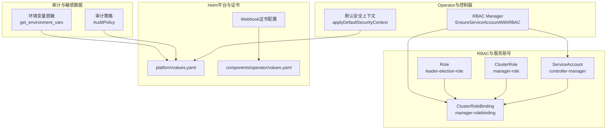
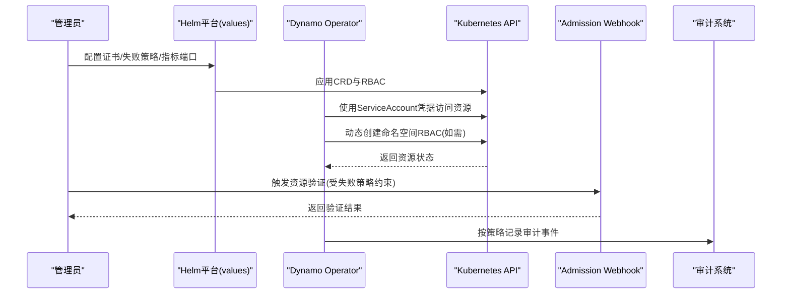
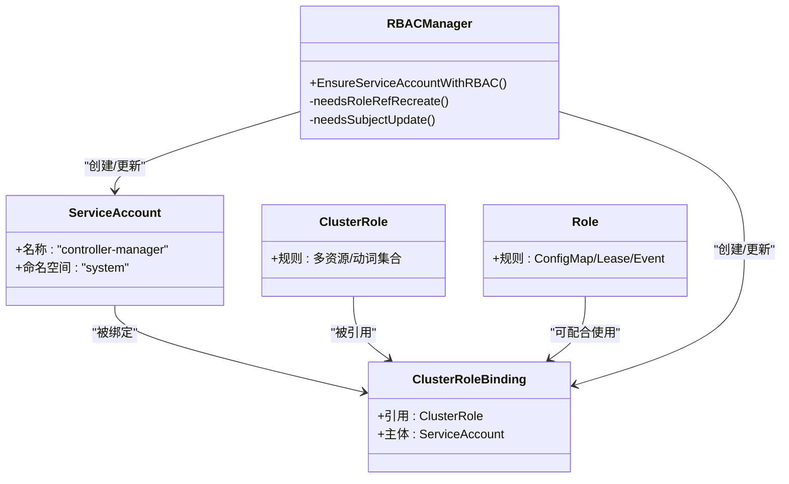
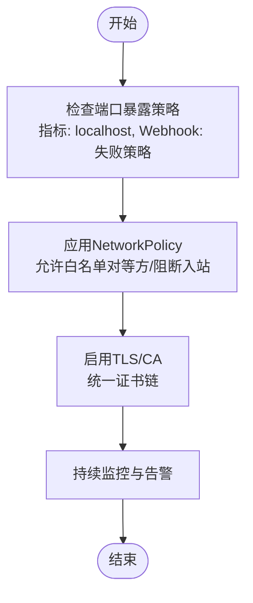
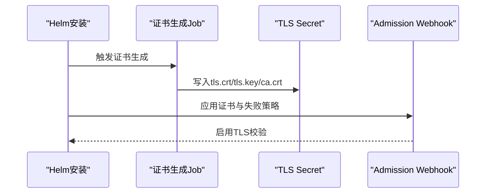
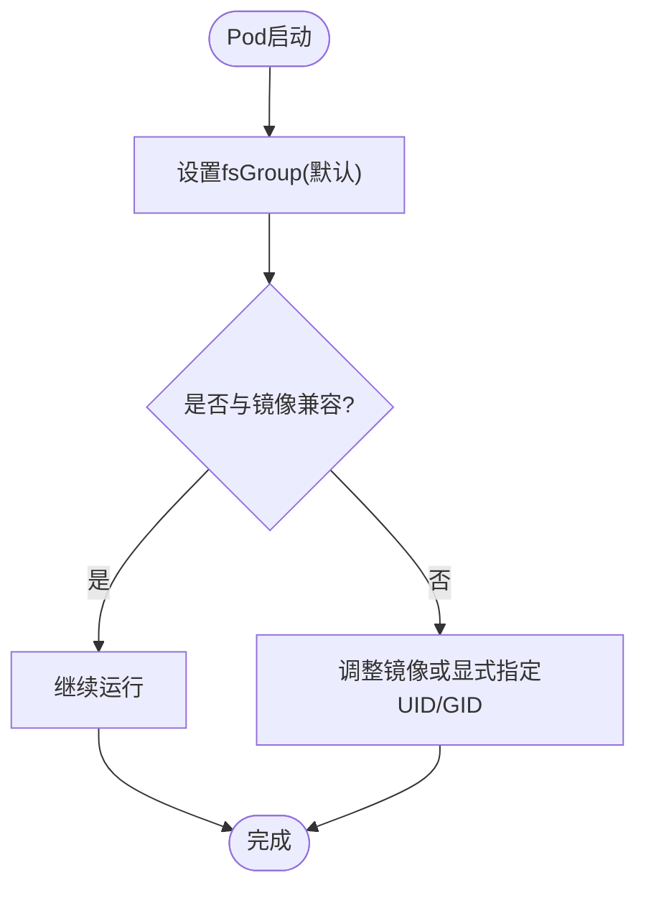
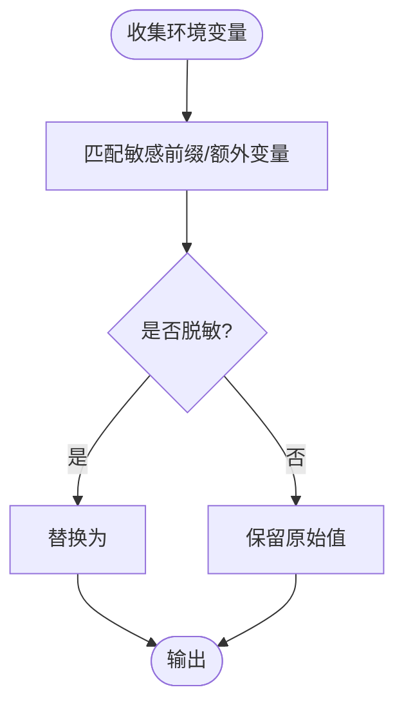
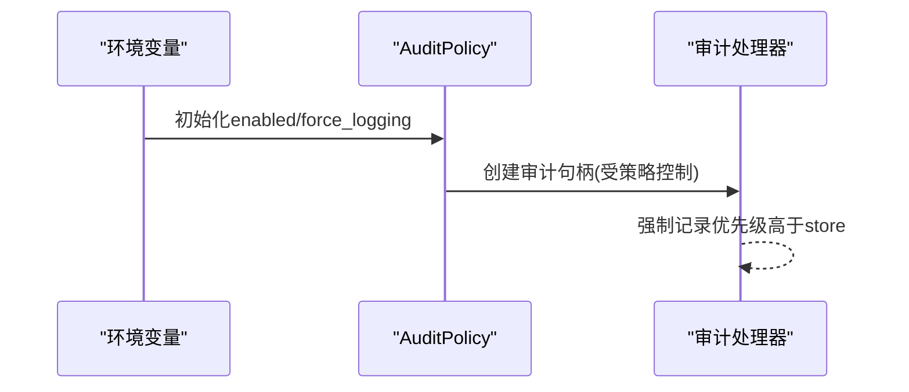
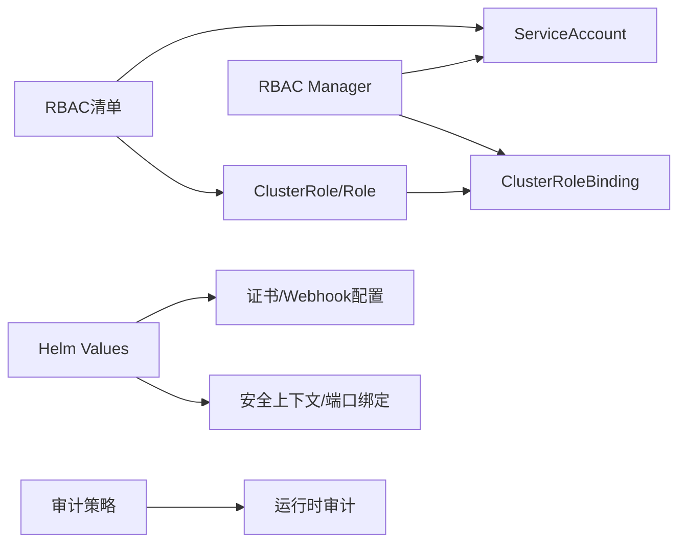

# 安全配置

<cite>
**本文引用的文件**
- [deploy/operator/config/rbac/role.yaml](file://deploy/operator/config/rbac/role.yaml)
- [deploy/operator/config/rbac/leader_election_role.yaml](file://deploy/operator/config/rbac/leader_election_role.yaml)
- [deploy/operator/config/rbac/role_binding.yaml](file://deploy/operator/config/rbac/role_binding.yaml)
- [deploy/operator/config/rbac/service_account.yaml](file://deploy/operator/config/rbac/service_account.yaml)
- [deploy/operator/internal/rbac/manager.go](file://deploy/operator/internal/rbac/manager.go)
- [deploy/helm/charts/platform/values.yaml](file://deploy/helm/charts/platform/values.yaml)
- [deploy/helm/charts/platform/components/operator/values.yaml](file://deploy/helm/charts/platform/components/operator/values.yaml)
- [deploy/helm/charts/crds/templates/nvidia.com_dynamocomponentdeployments.yaml](file://deploy/helm/charts/crds/templates/nvidia.com_dynamocomponentdeployments.yaml)
- [deploy/helm/charts/crds/templates/nvidia.com_dynamographdeployments.yaml](file://deploy/helm/charts/crds/templates/nvidia.com_dynamographdeployments.yaml)
- [deploy/operator/internal/dynamo/graph.go](file://deploy/operator/internal/dynamo/graph.go)
- [lib/llm/src/audit/config.rs](file://lib/llm/src/audit/config.rs)
- [lib/llm/src/audit/handle.rs](file://lib/llm/src/audit/handle.rs)
- [tests/fault_tolerance/hardware/fault_injection_service/api_service/main.py](file://tests/fault_tolerance/hardware/fault_injection_service/api_service/main.py)
- [components/src/dynamo/common/config_dump/environment.py](file://components/src/dynamo/common/config_dump/environment.py)
</cite>

## 目录
1. [简介](#简介)
2. [项目结构](#项目结构)
3. [核心组件](#核心组件)
4. [架构总览](#架构总览)
5. [详细组件分析](#详细组件分析)
6. [依赖关系分析](#依赖关系分析)
7. [性能考量](#性能考量)
8. [故障排查指南](#故障排查指南)
9. [结论](#结论)
10. [附录](#附录)

## 简介
本指南面向Dynamo在生产环境中的安全配置，覆盖以下方面：
- 基于RBAC的权限模型与角色绑定配置
- 网络策略与防火墙规则设置
- TLS证书管理与密钥轮换流程
- Pod安全策略与运行时安全配置
- 敏感数据保护与加密存储方案
- 审计日志与合规性监控
- 安全扫描与漏洞管理最佳实践

本指南以仓库中现有的RBAC、Helm配置、证书管理、审计与安全上下文实现为依据，结合可操作的配置项与流程建议，帮助您构建符合生产标准的安全基线。

## 项目结构
围绕安全配置的关键位置包括：
- 运行时安全上下文与默认策略：operator内部逻辑与CRD注释
- RBAC与服务账号：operator的RBAC清单与动态管理器
- Helm平台与组件值：证书、Webhook、指标端口绑定等
- 审计与敏感变量处理：审计策略与环境变量脱敏

**图示来源**
- [deploy/operator/config/rbac/service_account.yaml](file://deploy/operator/config/rbac/service_account.yaml#L16-L28)
- [deploy/operator/config/rbac/role.yaml](file://deploy/operator/config/rbac/role.yaml#L17-L250)
- [deploy/operator/config/rbac/role_binding.yaml](file://deploy/operator/config/rbac/role_binding.yaml#L16-L35)
- [deploy/operator/config/rbac/leader_election_role.yaml](file://deploy/operator/config/rbac/leader_election_role.yaml#L17-L60)
- [deploy/operator/internal/rbac/manager.go](file://deploy/operator/internal/rbac/manager.go#L28-L35)
- [deploy/operator/internal/dynamo/graph.go](file://deploy/operator/internal/dynamo/graph.go#L888-L905)
- [deploy/helm/charts/platform/values.yaml](file://deploy/helm/charts/platform/values.yaml#L152-L211)
- [deploy/helm/charts/platform/components/operator/values.yaml](file://deploy/helm/charts/platform/components/operator/values.yaml#L208-L283)
- [lib/llm/src/audit/config.rs](file://lib/llm/src/audit/config.rs#L1-L27)
- [components/src/dynamo/common/config_dump/environment.py](file://components/src/dynamo/common/config_dump/environment.py#L59-L106)

**章节来源**
- [deploy/operator/config/rbac/service_account.yaml](file://deploy/operator/config/rbac/service_account.yaml#L16-L28)
- [deploy/operator/config/rbac/role.yaml](file://deploy/operator/config/rbac/role.yaml#L17-L250)
- [deploy/operator/config/rbac/role_binding.yaml](file://deploy/operator/config/rbac/role_binding.yaml#L16-L35)
- [deploy/operator/config/rbac/leader_election_role.yaml](file://deploy/operator/config/rbac/leader_election_role.yaml#L17-L60)
- [deploy/operator/internal/rbac/manager.go](file://deploy/operator/internal/rbac/manager.go#L28-L35)
- [deploy/operator/internal/dynamo/graph.go](file://deploy/operator/internal/dynamo/graph.go#L888-L905)
- [deploy/helm/charts/platform/values.yaml](file://deploy/helm/charts/platform/values.yaml#L152-L211)
- [deploy/helm/charts/platform/components/operator/values.yaml](file://deploy/helm/charts/platform/components/operator/values.yaml#L208-L283)
- [lib/llm/src/audit/config.rs](file://lib/llm/src/audit/config.rs#L1-L27)
- [components/src/dynamo/common/config_dump/environment.py](file://components/src/dynamo/common/config_dump/environment.py#L59-L106)

## 核心组件
- RBAC与服务账号：定义operator所需的最小权限集，并通过ClusterRole/Role与ServiceAccount绑定；支持动态创建命名空间级RBAC资源。
- 默认安全上下文：为Pod设置fsGroup等默认安全参数，避免直接强制UID/GID以保持兼容性。
- Helm平台与Webhook：提供证书管理（含cert-manager集成）、失败策略、超时控制、指标端口本地化等安全相关配置。
- 审计与敏感数据：基于环境变量启用审计策略，支持强制记录与敏感变量脱敏。

**章节来源**
- [deploy/operator/config/rbac/role.yaml](file://deploy/operator/config/rbac/role.yaml#L17-L250)
- [deploy/operator/config/rbac/leader_election_role.yaml](file://deploy/operator/config/rbac/leader_election_role.yaml#L17-L60)
- [deploy/operator/config/rbac/service_account.yaml](file://deploy/operator/config/rbac/service_account.yaml#L16-L28)
- [deploy/operator/internal/rbac/manager.go](file://deploy/operator/internal/rbac/manager.go#L54-L73)
- [deploy/operator/internal/dynamo/graph.go](file://deploy/operator/internal/dynamo/graph.go#L888-L905)
- [deploy/helm/charts/platform/values.yaml](file://deploy/helm/charts/platform/values.yaml#L152-L211)
- [deploy/helm/charts/platform/components/operator/values.yaml](file://deploy/helm/charts/platform/components/operator/values.yaml#L208-L283)
- [lib/llm/src/audit/config.rs](file://lib/llm/src/audit/config.rs#L1-L27)
- [components/src/dynamo/common/config_dump/environment.py](file://components/src/dynamo/common/config_dump/environment.py#L59-L106)

## 架构总览
下图展示了生产环境安全配置的关键交互路径：operator通过RBAC访问集群资源，Helm负责证书与Webhook配置，审计与安全上下文贯穿运行时。

**图示来源**
- [deploy/helm/charts/platform/values.yaml](file://deploy/helm/charts/platform/values.yaml#L152-L211)
- [deploy/helm/charts/platform/components/operator/values.yaml](file://deploy/helm/charts/platform/components/operator/values.yaml#L208-L283)
- [deploy/operator/config/rbac/service_account.yaml](file://deploy/operator/config/rbac/service_account.yaml#L16-L28)
- [deploy/operator/internal/rbac/manager.go](file://deploy/operator/internal/rbac/manager.go#L54-L73)
- [lib/llm/src/audit/config.rs](file://lib/llm/src/audit/config.rs#L1-L27)

## 详细组件分析

### RBAC权限模型与角色绑定
- 权限范围：operator需要对多种核心资源进行CRUD与watch操作，涵盖ConfigMap、Service、Deployment、Job、Lease、Event、Ingress/IngressClass、CRD等。
- 最小权限原则：通过分离“管理角色”和“Leader选举角色”，仅授予必要权限。
- 动态命名空间RBAC：在集群模式下，operator可按需为特定命名空间创建ServiceAccount与RoleBinding，并处理不可变字段变更的重建逻辑。

**图示来源**
- [deploy/operator/config/rbac/service_account.yaml](file://deploy/operator/config/rbac/service_account.yaml#L16-L28)
- [deploy/operator/config/rbac/role.yaml](file://deploy/operator/config/rbac/role.yaml#L17-L250)
- [deploy/operator/config/rbac/role_binding.yaml](file://deploy/operator/config/rbac/role_binding.yaml#L16-L35)
- [deploy/operator/config/rbac/leader_election_role.yaml](file://deploy/operator/config/rbac/leader_election_role.yaml#L17-L60)
- [deploy/operator/internal/rbac/manager.go](file://deploy/operator/internal/rbac/manager.go#L28-L35)

**章节来源**
- [deploy/operator/config/rbac/role.yaml](file://deploy/operator/config/rbac/role.yaml#L17-L250)
- [deploy/operator/config/rbac/leader_election_role.yaml](file://deploy/operator/config/rbac/leader_election_role.yaml#L17-L60)
- [deploy/operator/config/rbac/role_binding.yaml](file://deploy/operator/config/rbac/role_binding.yaml#L16-L35)
- [deploy/operator/config/rbac/service_account.yaml](file://deploy/operator/config/rbac/service_account.yaml#L16-L28)
- [deploy/operator/internal/rbac/manager.go](file://deploy/operator/internal/rbac/manager.go#L54-L73)

### 网络策略与防火墙规则
- 端口暴露策略：指标端口默认仅本地监听，降低外部暴露风险；Webhook失败策略可拒绝不可达请求，确保严格校验。
- 网络策略限制：测试工具展示了如何在Kubernetes中构建允许/阻断出站与入站规则，支持基于对等方的白名单控制；端口级阻断存在限制，建议通过网络插件能力或Ingress/Istio路由实现细粒度控制。
- 出站代理与TLS：NATS与etcd等组件支持TLS与CA配置，建议在生产中开启并统一管理证书链。

**图示来源**
- [deploy/helm/charts/platform/components/operator/values.yaml](file://deploy/helm/charts/platform/components/operator/values.yaml#L50-L72)
- [deploy/helm/charts/platform/values.yaml](file://deploy/helm/charts/platform/values.yaml#L152-L211)
- [tests/fault_tolerance/hardware/fault_injection_service/api_service/main.py](file://tests/fault_tolerance/hardware/fault_injection_service/api_service/main.py#L719-L744)

**章节来源**
- [deploy/helm/charts/platform/components/operator/values.yaml](file://deploy/helm/charts/platform/components/operator/values.yaml#L50-L72)
- [deploy/helm/charts/platform/values.yaml](file://deploy/helm/charts/platform/values.yaml#L152-L211)
- [tests/fault_tolerance/hardware/fault_injection_service/api_service/main.py](file://tests/fault_tolerance/hardware/fault_injection_service/api_service/main.py#L719-L744)

### TLS证书管理与密钥轮换
- 自动证书生成：Helm提供自动证书生成与CA注入作业，支持自定义有效期。
- cert-manager集成：可选启用cert-manager，实现自动化签发、续期与轮换，降低运维负担。
- Webhook失败策略：生产推荐Fail模式，确保在Webhook不可用时拒绝请求，保障准入控制严格性。
- 证书生命周期：根CA与叶子证书分别设定有效期与提前续期阈值，避免大规模重签带来的中断。

**图示来源**
- [deploy/helm/charts/platform/values.yaml](file://deploy/helm/charts/platform/values.yaml#L152-L211)
- [deploy/helm/charts/platform/components/operator/values.yaml](file://deploy/helm/charts/platform/components/operator/values.yaml#L208-L283)

**章节来源**
- [deploy/helm/charts/platform/values.yaml](file://deploy/helm/charts/platform/values.yaml#L152-L211)
- [deploy/helm/charts/platform/components/operator/values.yaml](file://deploy/helm/charts/platform/components/operator/values.yaml#L208-L283)

### Pod安全策略与运行时安全配置
- 默认安全上下文：为Pod设置fsGroup以解决卷权限问题，不强制UID/GID以保持与root/non-root镜像的兼容性。
- 安全上下文字段：CRD注释明确runAsNonRoot、runAsUser等字段说明，建议在生产中启用非root运行。
- 容器安全上下文：operator组件容器禁用提权、丢弃全部能力，提升最小权限与抗攻击面。

**图示来源**
- [deploy/operator/internal/dynamo/graph.go](file://deploy/operator/internal/dynamo/graph.go#L888-L905)
- [deploy/helm/charts/crds/templates/nvidia.com_dynamocomponentdeployments.yaml](file://deploy/helm/charts/crds/templates/nvidia.com_dynamocomponentdeployments.yaml#L7599-L7616)
- [deploy/helm/charts/crds/templates/nvidia.com_dynamographdeployments.yaml](file://deploy/helm/charts/crds/templates/nvidia.com_dynamographdeployments.yaml#L4757-L4773)
- [deploy/helm/charts/platform/components/operator/values.yaml](file://deploy/helm/charts/platform/components/operator/values.yaml#L78-L82)

**章节来源**
- [deploy/operator/internal/dynamo/graph.go](file://deploy/operator/internal/dynamo/graph.go#L888-L905)
- [deploy/helm/charts/crds/templates/nvidia.com_dynamocomponentdeployments.yaml](file://deploy/helm/charts/crds/templates/nvidia.com_dynamocomponentdeployments.yaml#L7599-L7616)
- [deploy/helm/charts/crds/templates/nvidia.com_dynamographdeployments.yaml](file://deploy/helm/charts/crds/templates/nvidia.com_dynamographdeployments.yaml#L4757-L4773)
- [deploy/helm/charts/platform/components/operator/values.yaml](file://deploy/helm/charts/platform/components/operator/values.yaml#L78-L82)

### 敏感数据保护与加密存储
- 审计策略：通过环境变量启用审计，支持强制记录模式，便于合规性审计。
- 环境变量脱敏：对敏感前缀的环境变量值进行脱敏输出，避免在日志或诊断中泄露。
- 加密存储：Helm提供多种存储后端（PVC/S3/OCI），建议结合云原生存储的密钥管理服务进行密钥轮换与访问控制。

**图示来源**
- [lib/llm/src/audit/config.rs](file://lib/llm/src/audit/config.rs#L1-L27)
- [components/src/dynamo/common/config_dump/environment.py](file://components/src/dynamo/common/config_dump/environment.py#L59-L106)

**章节来源**
- [lib/llm/src/audit/config.rs](file://lib/llm/src/audit/config.rs#L1-L27)
- [components/src/dynamo/common/config_dump/environment.py](file://components/src/dynamo/common/config_dump/environment.py#L59-L106)

### 审计日志与合规性监控
- 审计策略初始化：从环境变量读取审计开关与强制记录标志，全局生效。
- 测试用例：验证强制记录可绕过store=false的限制，确保关键事件不会被遗漏。
- 建议：结合Prometheus/Grafana与日志聚合系统，建立审计事件的可视化与告警。

**图示来源**
- [lib/llm/src/audit/config.rs](file://lib/llm/src/audit/config.rs#L15-L27)
- [lib/llm/src/audit/handle.rs](file://lib/llm/src/audit/handle.rs#L93-L114)

**章节来源**
- [lib/llm/src/audit/config.rs](file://lib/llm/src/audit/config.rs#L1-L27)
- [lib/llm/src/audit/handle.rs](file://lib/llm/src/audit/handle.rs#L93-L114)

### 安全扫描与漏洞管理最佳实践
- 镜像与依赖：使用受信任的基础镜像与固定版本，定期更新依赖与运行时组件。
- 扫描与准入：结合CI中的镜像扫描与Kubernetes Admission Webhook，阻止高危镜像进入集群。
- 密钥与证书：通过密钥管理服务与自动化轮换减少泄露风险；证书有效期与续期策略纳入SLA。
- 日志与审计：集中化日志与审计事件留存，满足合规要求并支持取证。

[本节为通用指导，无需具体文件引用]

## 依赖关系分析
- RBAC依赖：operator依赖ServiceAccount与ClusterRole/Role进行资源访问；动态管理器依赖Kubernetes API进行RBAC资源的创建与更新。
- Helm依赖：平台values与组件values共同决定证书、Webhook、指标端口与安全上下文等行为。
- 审计依赖：审计策略由环境变量驱动，影响运行时的审计行为。

**图示来源**
- [deploy/operator/config/rbac/role.yaml](file://deploy/operator/config/rbac/role.yaml#L17-L250)
- [deploy/operator/config/rbac/role_binding.yaml](file://deploy/operator/config/rbac/role_binding.yaml#L16-L35)
- [deploy/operator/internal/rbac/manager.go](file://deploy/operator/internal/rbac/manager.go#L54-L73)
- [deploy/helm/charts/platform/values.yaml](file://deploy/helm/charts/platform/values.yaml#L152-L211)
- [lib/llm/src/audit/config.rs](file://lib/llm/src/audit/config.rs#L1-L27)

**章节来源**
- [deploy/operator/config/rbac/role.yaml](file://deploy/operator/config/rbac/role.yaml#L17-L250)
- [deploy/operator/config/rbac/role_binding.yaml](file://deploy/operator/config/rbac/role_binding.yaml#L16-L35)
- [deploy/operator/internal/rbac/manager.go](file://deploy/operator/internal/rbac/manager.go#L54-L73)
- [deploy/helm/charts/platform/values.yaml](file://deploy/helm/charts/platform/values.yaml#L152-L211)
- [lib/llm/src/audit/config.rs](file://lib/llm/src/audit/config.rs#L1-L27)

## 性能考量
- 指标端口本地化：仅监听127.0.0.1，避免不必要的网络开销与暴露。
- Webhook超时与失败策略：合理设置超时与失败策略，平衡可用性与严格性。
- 安全上下文最小化：默认fsGroup即可满足卷权限，避免过度限制导致调度失败。

[本节为通用指导，无需具体文件引用]

## 故障排查指南
- RBAC问题：确认ServiceAccount与ClusterRole/Role绑定是否存在；若RoleRef变更，需删除并重建RoleBinding。
- 证书问题：检查Webhook证书Secret是否存在且包含必需键；确认失败策略与有效期配置。
- 审计未生效：检查环境变量是否正确设置，强制记录模式是否启用。
- 网络策略：确认NetworkPolicy是否正确配置白名单与阻断规则；注意端口阻断的限制。

**章节来源**
- [deploy/operator/internal/rbac/manager.go](file://deploy/operator/internal/rbac/manager.go#L167-L179)
- [deploy/helm/charts/platform/values.yaml](file://deploy/helm/charts/platform/values.yaml#L152-L211)
- [lib/llm/src/audit/config.rs](file://lib/llm/src/audit/config.rs#L15-L27)
- [tests/fault_tolerance/hardware/fault_injection_service/api_service/main.py](file://tests/fault_tolerance/hardware/fault_injection_service/api_service/main.py#L719-L744)

## 结论
通过结合RBAC最小权限、严格的网络与证书策略、运行时安全上下文、审计与敏感数据保护，以及完善的扫描与轮换流程，Dynamo可在生产环境中构建稳健的安全基线。建议将上述配置固化为Helm值模板与CI流程，确保一致性与可追溯性。

[本节为总结，无需具体文件引用]

## 附录
- 关键配置项速查
  - 指标端口：仅本地监听
  - Webhook失败策略：生产建议Fail
  - 证书有效期与续期：根据业务SLA配置
  - 安全上下文：启用fsGroup，避免强制UID/GID
  - 审计策略：启用并支持强制记录

[本节为补充信息，无需具体文件引用]