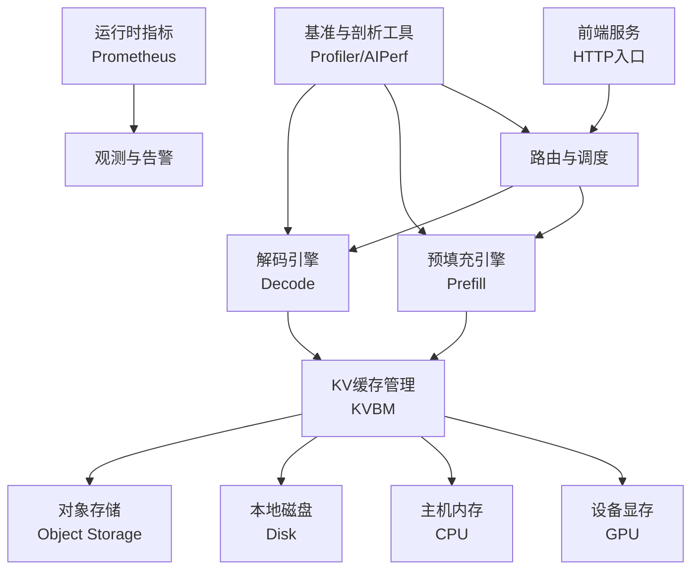
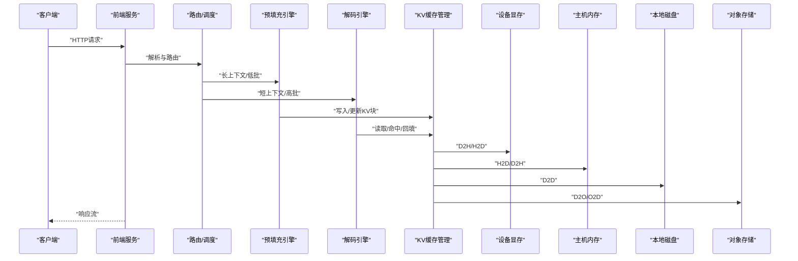
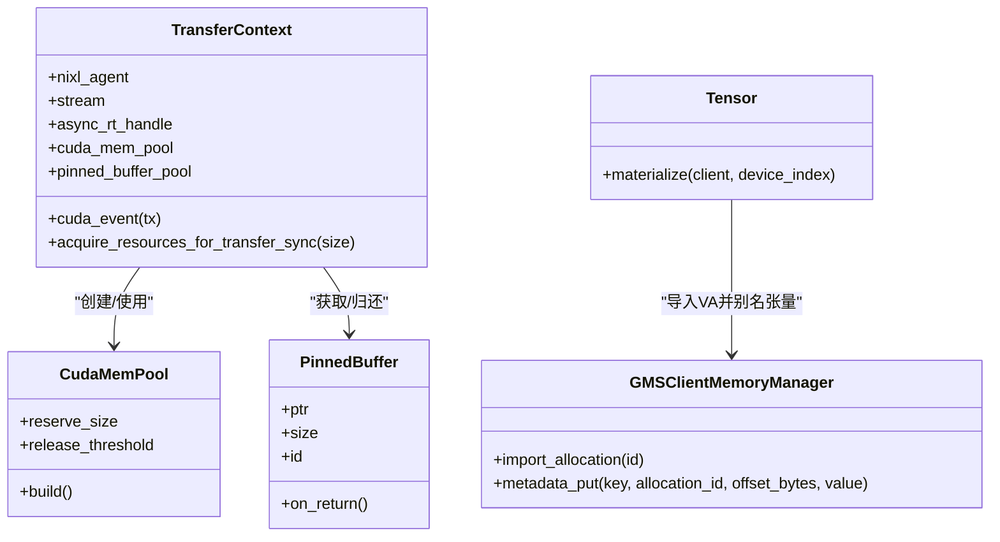
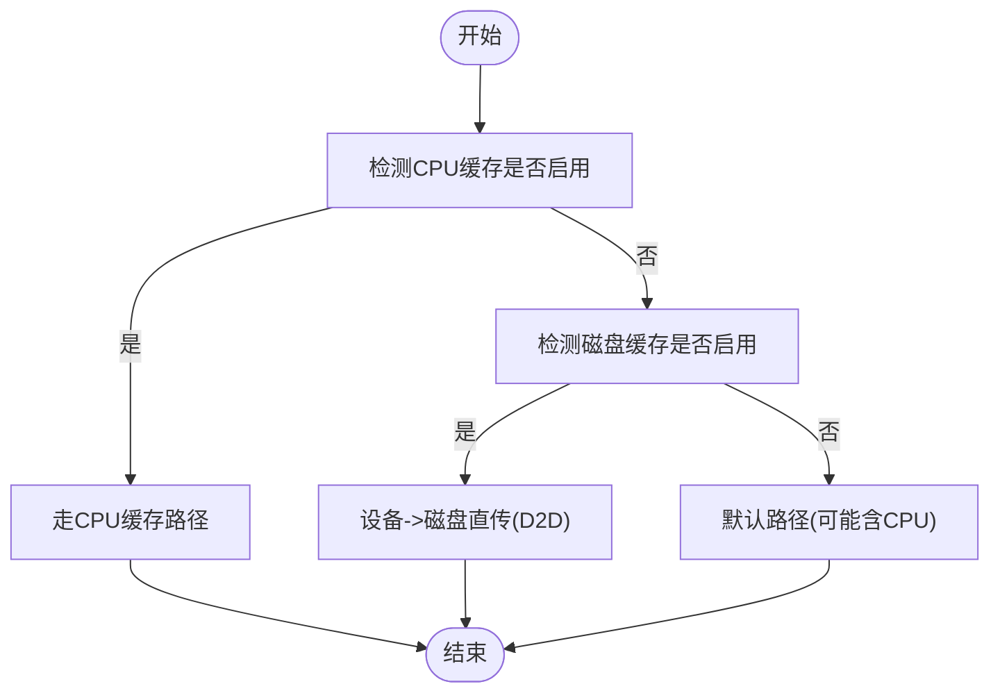
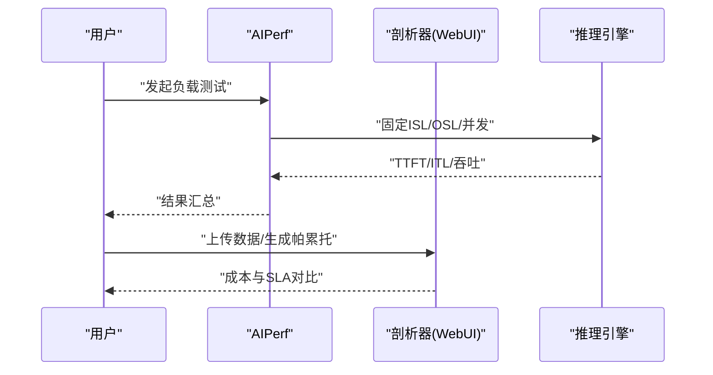
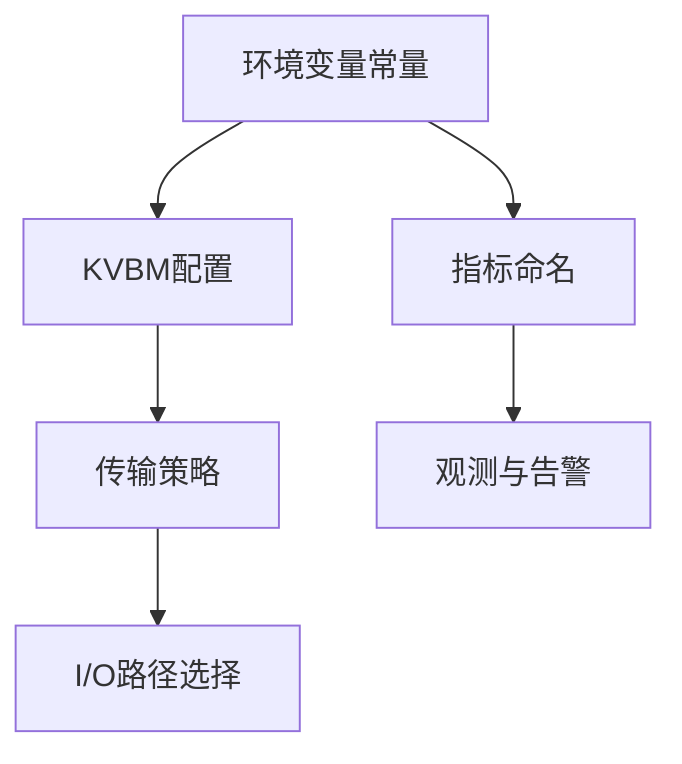

# 性能调优

<cite>
**本文引用的文件**
- [docs/pages/performance/tuning.md](file://docs/pages/performance/tuning.md)
- [lib/llm/src/block_manager/block/transfer/context.rs](file://lib/llm/src/block_manager/block/transfer/context.rs)
- [lib/llm/src/block_manager/config.rs](file://lib/llm/src/block_manager/config.rs)
- [lib/llm/src/block_manager/metrics_kvbm.rs](file://lib/llm/src/block_manager/metrics_kvbm.rs)
- [lib/runtime/src/config/environment_names.rs](file://lib/runtime/src/config/environment_names.rs)
- [lib/runtime/src/metrics/prometheus_names.rs](file://lib/runtime/src/metrics/prometheus_names.rs)
- [benchmarks/profiler/webui/utils.py](file://benchmarks/profiler/webui/utils.py)
- [benchmarks/profiler/utils/plot.py](file://benchmarks/profiler/utils/plot.py)
- [examples/backends/trtllm/performance_sweeps/submit_disagg.sh](file://examples/backends/trtllm/performance_sweeps/submit_disagg.sh)
- [examples/backends/trtllm/performance_sweeps/post_process.py](file://examples/backends/trtllm/performance_sweeps/post_process.py)
- [examples/backends/sglang/slurm_jobs/scripts/vllm/benchmark_serving.py](file://examples/backends/sglang/slurm_jobs/scripts/vllm/benchmark_serving.py)
- [lib/gpu_memory_service/client/torch/tensor.py](file://lib/gpu_memory_service/client/torch/tensor.py)
- [lib/gpu_memory_service/client/torch/module.py](file://lib/gpu_memory_service/client/torch/module.py)
- [lib/llm/src/block_manager/block/transfer/strategy.rs](file://lib/llm/src/block_manager/block/transfer/strategy.rs)
- [tests/kvbm_integration/test_consolidator_router_e2e.py](file://tests/kvbm_integration/test_consolidator_router_e2e.py)
</cite>

## 目录
1. [简介](#简介)
2. [项目结构](#项目结构)
3. [核心组件](#核心组件)
4. [架构总览](#架构总览)
5. [详细组件分析](#详细组件分析)
6. [依赖关系分析](#依赖关系分析)
7. [性能考量](#性能考量)
8. [故障排查指南](#故障排查指南)
9. [结论](#结论)
10. [附录](#附录)

## 简介
本指南面向Dynamo生产环境的性能调优，聚焦以下关键领域：
- GPU资源分配与显存/内存管理
- 网络带宽与延迟优化
- CUDA Graph与混合精度推理配置
- 批处理大小与并发度调优
- 存储I/O与缓存策略
- 性能基准测试与瓶颈分析
- 容量规划与成本优化

内容基于仓库中的文档、实现代码与基准工具，提供可操作的参数建议与实践路径。

## 项目结构
Dynamo在性能调优方面涉及多个层面：
- 引擎与并行化配置：通过并行映射（TP/PP）与引擎数量影响吞吐与延迟
- KV缓存分层与迁移：设备/主机/磁盘/对象存储的多级缓存与传输策略
- 运行时指标与环境变量：统一的指标命名与环境变量常量
- 基准与剖析工具：AIPerf、WebUI剖析器、脚本化的性能扫描



[无图表来源：该图为概念性结构示意，不直接映射具体源码文件]

## 核心组件
- 引擎与并行化配置：决定TP/PP分布、最大批大小、最大token数、块大小等
- KV缓存分层与传输：设备/主机/磁盘/对象存储的写入/读取策略与批量传输
- 运行时指标与环境变量：集中式指标名与环境变量常量，便于统一观测与调参
- 基准与剖析工具：用于生成帕累托前沿、成本分析与SLA评估

章节来源
- file://docs/pages/performance/tuning.md#L1-L137
- file://lib/runtime/src/metrics/prometheus_names.rs#L1-L790
- file://lib/runtime/src/config/environment_names.rs#L1-L507

## 架构总览
下图展示了Dynamo在生产环境中的关键性能路径：请求经由前端进入，路由到预填充或解码引擎；KV缓存管理在多层级存储之间进行数据迁移；运行时指标与基准工具贯穿整个流程以支撑调优闭环。



图表来源
- [lib/llm/src/block_manager/block/transfer/strategy.rs](file://lib/llm/src/block_manager/block/transfer/strategy.rs#L1-L105)
- [lib/llm/src/block_manager/metrics_kvbm.rs](file://lib/llm/src/block_manager/metrics_kvbm.rs#L154-L247)
- [lib/llm/src/block_manager/config.rs](file://lib/llm/src/block_manager/config.rs#L270-L305)

## 详细组件分析

### GPU资源分配与显存/内存管理
- CUDA内存池与流有序分配
  - 在传输上下文中创建CUDA内存池，按配置预热缓冲区，减少频繁分配带来的开销与碎片
  - 通过释放阈值控制大块内存回收至操作系统，平衡内存占用与回收成本
- 显存/主机/页锁定缓冲池
  - 页锁定缓冲池用于地址数组拷贝，避免频繁分配与同步
  - 传输资源在使用前从池中获取，结束后自动归还，降低锁竞争与内存抖动
- GMS（GPU内存服务）张量与模块材料化
  - 通过GMS导入已映射的CUDA内存，创建与之别名的张量，避免重复拷贝
  - 模块材料化时记录元数据，确保参数与动态缓冲区正确映射



图表来源
- [lib/llm/src/block_manager/block/transfer/context.rs](file://lib/llm/src/block_manager/block/transfer/context.rs#L173-L356)
- [lib/gpu_memory_service/client/torch/tensor.py](file://lib/gpu_memory_service/client/torch/tensor.py#L211-L226)
- [lib/gpu_memory_service/client/torch/module.py](file://lib/gpu_memory_service/client/torch/module.py#L133-L162)

章节来源
- file://lib/llm/src/block_manager/block/transfer/context.rs#L211-L246
- file://lib/gpu_memory_service/client/torch/tensor.py#L211-L226
- file://lib/gpu_memory_service/client/torch/module.py#L133-L162

### 网络带宽与延迟优化
- 传输策略选择
  - 针对不同源/目标组合选择最优传输路径：NIXL写/读、memcpy、CUDA阻塞/异步H2D/D2H
  - 通过策略模块化，减少不必要的主机内存中转，提升端到端延迟
- 禁用CPU缓存直连磁盘
  - 当仅配置磁盘缓存且未设置CPU缓存时，允许设备到磁盘直传，绕过主机内存，降低带宽占用与延迟



图表来源
- [lib/llm/src/block_manager/block/transfer/strategy.rs](file://lib/llm/src/block_manager/block/transfer/strategy.rs#L1-L105)
- [lib/llm/src/block_manager/config.rs](file://lib/llm/src/block_manager/config.rs#L270-L305)

章节来源
- file://lib/llm/src/block_manager/block/transfer/strategy.rs#L1-L105
- file://lib/llm/src/block_manager/config.rs#L270-L305

### CUDA Graph与混合精度推理
- CUDA Graph支持
  - 模型配置中包含graphs字段与lower bound定义，用于捕获并复用计算图，减少内核启动开销
  - 图形下界允许在捕获形状范围内的输入变化，避免对所有形状组合重新捕获
- 混合精度与量化
  - 文档示例展示了不同量化方案（如NVFP4）在B200上的KV缓存与吞吐表现，体现混合精度对吞吐与延迟的影响

章节来源
- file://docs/pages/performance/tuning.md#L39-L46
- file://docs/pages/performance/tuning.md#L77-L86

### 批处理大小与并发度调优
- 预填充引擎
  - 以最小批饱和GPU为目标，降低首Token时间（TTFT）
  - 结合最大本地预填充长度，确保预填充阶段充分饱和
- 解码引擎
  - 大批与适中最大token数有助于降低中间张量尺寸，提升吞吐
  - 块大小建议：过小导致内存碎片与P->D传输碎片化，过大降低前缀缓存命中率
- 并行映射
  - 密集模型通常采用节点内TP、跨节点PP的组合，结合具体模型规模与硬件拓扑选择最优TP/PP

章节来源
- file://docs/pages/performance/tuning.md#L75-L98
- file://docs/pages/performance/tuning.md#L19-L62

### 存储I/O与缓存策略
- 缓存层级与命中率
  - 提供主机/磁盘/对象存储的命中率与失败计数指标，便于评估缓存策略有效性
- 传输指标
  - 设备/主机/磁盘/对象存储的上载/下载块数与字节数统计，辅助定位I/O瓶颈
- 环境变量配置
  - 统一的KVBM环境变量常量，包括CPU缓存、磁盘缓存、对象存储开关与桶配置等

```mermaid
graph LR
A["设备显存"] < --> |D2H/H2D| B["主机内存"]
B < --> |H2D/D2H| C["本地磁盘"]
A < --> |D2O/O2D| D["对象存储"]
E["运行时指标"] --> A
E --> B
E --> C
E --> D
```

图表来源
- [lib/runtime/src/metrics/prometheus_names.rs](file://lib/runtime/src/metrics/prometheus_names.rs#L327-L373)
- [lib/runtime/src/config/environment_names.rs](file://lib/runtime/src/config/environment_names.rs#L169-L257)
- [lib/llm/src/block_manager/metrics_kvbm.rs](file://lib/llm/src/block_manager/metrics_kvbm.rs#L154-L247)

章节来源
- file://lib/runtime/src/metrics/prometheus_names.rs#L327-L373
- file://lib/runtime/src/config/environment_names.rs#L169-L257
- file://lib/llm/src/block_manager/metrics_kvbm.rs#L154-L247

### 性能基准测试与瓶颈分析
- AIPerf与剖析器
  - 使用AIPerf进行固定ISL/OSL/并发度测试，结合SLA评估最佳配置
  - WebUI剖析器生成预填充与解码的帕累托前沿，并计算成本（GPU小时/千次请求）
- 脚本化性能扫描
  - TRTLLM示例脚本提供多组TP/MTP/批大小/并发度组合的自动化扫描
  - 后处理脚本对部署配置中的GPU数量等进行安全校验与转换



图表来源
- [docs/pages/performance/tuning.md](file://docs/pages/performance/tuning.md#L47-L52)
- [benchmarks/profiler/webui/utils.py](file://benchmarks/profiler/webui/utils.py#L370-L400)
- [benchmarks/profiler/utils/plot.py](file://benchmarks/profiler/utils/plot.py#L313-L346)
- [examples/backends/trtllm/performance_sweeps/submit_disagg.sh](file://examples/backends/trtllm/performance_sweeps/submit_disagg.sh#L112-L140)
- [examples/backends/trtllm/performance_sweeps/post_process.py](file://examples/backends/trtllm/performance_sweeps/post_process.py#L226-L245)

章节来源
- file://benchmarks/profiler/webui/utils.py#L370-L400
- file://benchmarks/profiler/utils/plot.py#L313-L346
- file://examples/backends/trtllm/performance_sweeps/submit_disagg.sh#L112-L140
- file://examples/backends/trtllm/performance_sweeps/post_process.py#L226-L245

### 容量规划与成本优化
- 成本建模
  - 将预填充与解码阶段的成本分别折算为GPU小时/千次请求，结合SLA绘制成本曲线
- 实战建议
  - 依据帕累托前沿选择满足SLA的最低成本配置
  - 通过减少队列长度与提高GPU利用率，平衡ITL与吞吐

章节来源
- file://benchmarks/profiler/webui/utils.py#L370-L400
- file://benchmarks/profiler/utils/plot.py#L313-L346

## 依赖关系分析
- 指标与环境变量
  - 指标名称与标签规范统一，便于跨组件聚合与查询
  - 环境变量集中管理，确保配置一致性与可追溯性
- KVBM与传输策略
  - 传输策略根据源/目标类型自动选择最优路径
  - 通过环境变量控制缓存层级启用与旁路策略



图表来源
- [lib/runtime/src/config/environment_names.rs](file://lib/runtime/src/config/environment_names.rs#L169-L257)
- [lib/runtime/src/metrics/prometheus_names.rs](file://lib/runtime/src/metrics/prometheus_names.rs#L61-L115)
- [lib/llm/src/block_manager/block/transfer/strategy.rs](file://lib/llm/src/block_manager/block/transfer/strategy.rs#L1-L105)

章节来源
- file://lib/runtime/src/config/environment_names.rs#L169-L257
- file://lib/runtime/src/metrics/prometheus_names.rs#L61-L115
- file://lib/llm/src/block_manager/block/transfer/strategy.rs#L1-L105

## 性能考量
- 吞吐与延迟权衡
  - 预填充阶段追求低TTFT，解码阶段追求高吞吐与低ITL
  - 块大小需兼顾前缀缓存命中率与传输效率
- 内存与I/O
  - 启用CUDA内存池与页锁定缓冲池，减少分配与同步开销
  - 在满足SLA前提下，优先直连磁盘或对象存储，减少主机内存中转
- 并行与拓扑
  - TP/PP映射应匹配模型规模与硬件拓扑，避免通信瓶颈
- 观测与回归
  - 通过统一指标与环境变量常量，建立稳定的观测基线与回归检查

[本节为通用指导，不直接分析具体文件]

## 故障排查指南
- KV缓存命中率异常
  - 检查主机/磁盘/对象存储命中率与失败计数，定位缓存策略问题
- 传输路径异常
  - 核对传输策略与环境变量，确认是否启用旁路磁盘或对象存储
- 指标缺失或命名冲突
  - 使用指标命名规范与环境变量常量，确保命名合规与唯一性

章节来源
- file://lib/llm/src/block_manager/metrics_kvbm.rs#L154-L247
- file://lib/runtime/src/metrics/prometheus_names.rs#L417-L500
- file://lib/runtime/src/config/environment_names.rs#L169-L257

## 结论
通过系统化的参数调优（并行映射、批大小、块大小）、合理的缓存与I/O策略（直连磁盘/对象存储、传输路径选择）、完善的指标与环境变量管理，以及基于AIPerf与剖析器的基准测试与成本分析，Dynamo可在生产环境中实现高吞吐、低延迟与低成本的稳定运行。

[本节为总结性内容，不直接分析具体文件]

## 附录
- 参考示例与脚本
  - TRTLLM性能扫描脚本与后处理逻辑
  - SGLang/VLLM基准脚本中的指标统计方法
- 测试用例参考
  - KVBM整合测试中的缓存层级参数设置与测试参数计算

章节来源
- file://examples/backends/trtllm/performance_sweeps/submit_disagg.sh#L112-L140
- file://examples/backends/trtllm/performance_sweeps/post_process.py#L226-L245
- file://examples/backends/sglang/slurm_jobs/scripts/vllm/benchmark_serving.py#L800-L837
- file://tests/kvbm_integration/test_consolidator_router_e2e.py#L759-L769