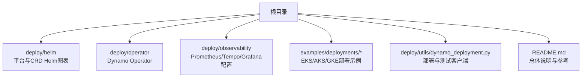
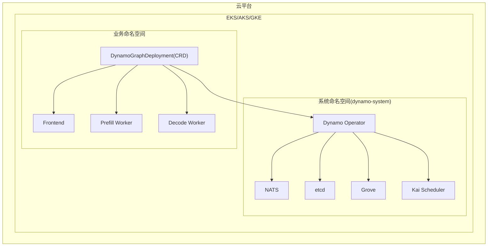
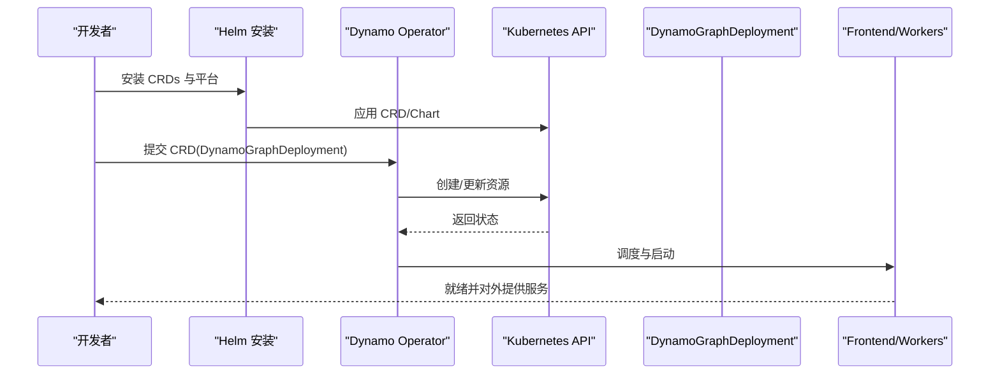
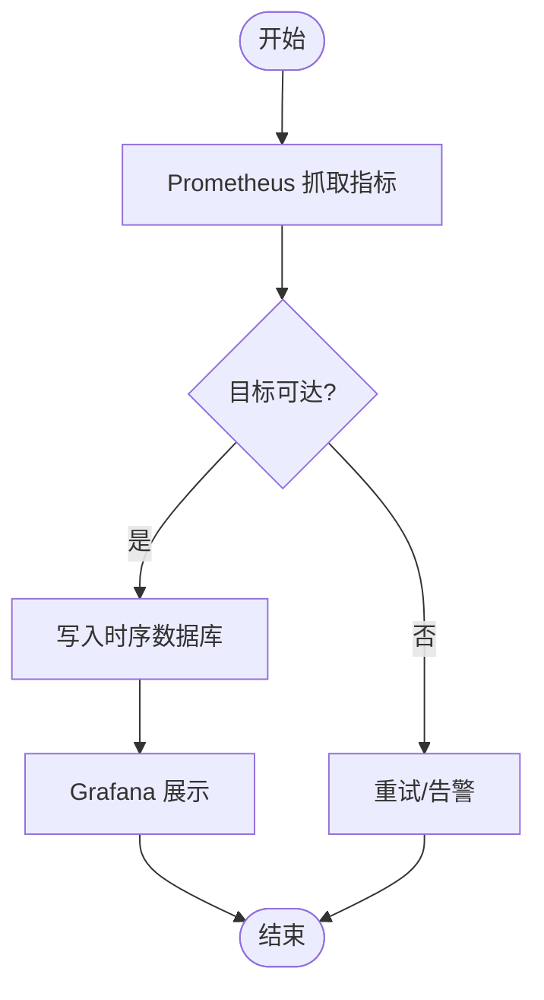
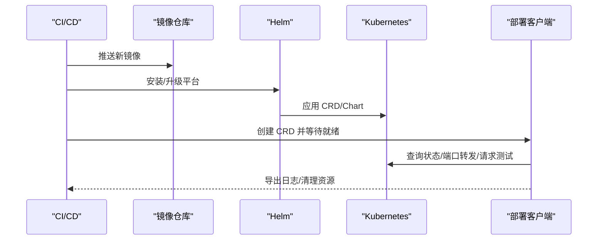
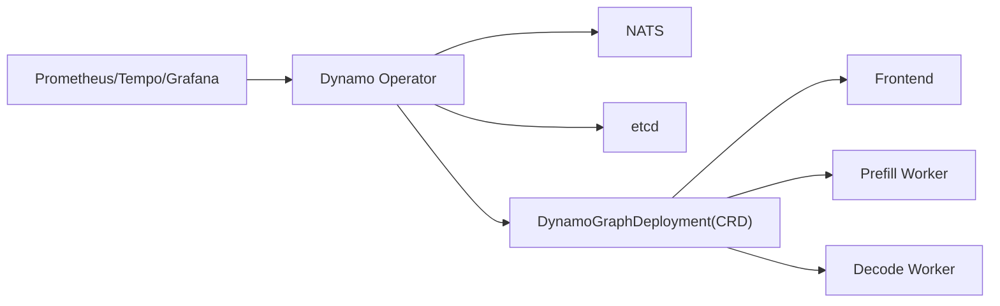

# 生产环境部署示例

<cite>
**本文引用的文件**
- [README.md](file://README.md)
- [EKS 部署平台说明](file://examples/deployments/EKS/Deploy_Dynamo_Kubernetes_Platform.md)
- [EKS 创建 EFS 步骤](file://examples/deployments/EKS/Create_EKS_EFS.md)
- [EKS vLLM 示例部署](file://examples/deployments/EKS/Deploy_VLLM_example.md)
- [AKS 部署指南](file://examples/deployments/AKS/AKS-deployment.md)
- [GKE 部署指南](file://examples/deployments/GKE/README.md)
- [Helm 图表说明](file://deploy/helm/README.md)
- [Operator 说明](file://deploy/operator/README.md)
- [可观测性说明](file://deploy/observability/README.md)
- [Prometheus 配置](file://deploy/observability/prometheus.yml)
- [Tempo 配置](file://deploy/observability/tempo.yaml)
- [Grafana 数据源配置](file://deploy/observability/grafana-datasources.yml)
- [Dynamo 部署客户端](file://deploy/utils/dynamo_deployment.py)
</cite>

## 目录
1. [简介](#简介)
2. [项目结构](#项目结构)
3. [核心组件](#核心组件)
4. [架构总览](#架构总览)
5. [详细组件分析](#详细组件分析)
6. [依赖关系分析](#依赖关系分析)
7. [性能考虑](#性能考虑)
8. [故障排查指南](#故障排查指南)
9. [结论](#结论)
10. [附录](#附录)

## 简介
本文件面向生产环境，提供在 AWS EKS、Azure AKS、Google GKE 三大云平台上部署 Dynamo 的完整示例与最佳实践。内容覆盖高可用部署、负载均衡、自动扩缩容、故障转移、多节点集群配置、安全策略（RBAC、网络策略、密钥管理）、监控与日志、性能调优（GPU 资源分配、内存与网络优化）、灾难恢复与备份、以及 CI/CD 流水线与自动化部署。

## 项目结构
围绕生产部署的关键目录与文件如下：
- 平台安装与 Helm 图表：deploy/helm
- 运维与可观测性：deploy/observability
- Operator 与 CRD：deploy/operator
- 示例部署与平台指南：examples/deployments/*
- 自动化部署工具：deploy/utils/dynamo_deployment.py
- 顶层说明与参考链接：README.md

图示来源
- [Helm 图表说明](file://deploy/helm/README.md#L18-L23)
- [Operator 说明](file://deploy/operator/README.md#L1-L37)
- [EKS 部署平台说明](file://examples/deployments/EKS/Deploy_Dynamo_Kubernetes_Platform.md#L1-L97)
- [AKS 部署指南](file://examples/deployments/AKS/AKS-deployment.md#L1-L201)
- [GKE 部署指南](file://examples/deployments/GKE/README.md#L1-L189)
- [Dynamo 部署客户端](file://deploy/utils/dynamo_deployment.py#L1-L600)

章节来源
- [README.md](file://README.md#L216-L242)
- [Helm 图表说明](file://deploy/helm/README.md#L18-L23)

## 核心组件
- 平台组件
  - Dynamo Operator：通过 CRD 管理推理图生命周期（DynamoGraphDeploymentRequest、DynamoGraphDeployment）
  - NATS/etcd：消息与服务发现基础设施
  - Grove/Kai Scheduler：调度与编排支持
- 可观测性
  - Prometheus：指标采集
  - Tempo：分布式追踪
  - Grafana：仪表盘与可视化
- 部署与运维
  - Helm Chart：平台与 CRD 安装
  - 自动化部署脚本：基于 Kubernetes API 的部署、等待就绪、端口转发、日志导出与清理

章节来源
- [Operator 说明](file://deploy/operator/README.md#L6-L19)
- [Helm 图表说明](file://deploy/helm/README.md#L20-L23)
- [Prometheus 配置](file://deploy/observability/prometheus.yml#L16-L63)
- [Tempo 配置](file://deploy/observability/tempo.yaml#L1-L37)
- [Grafana 数据源配置](file://deploy/observability/grafana-datasources.yml#L16-L24)
- [Dynamo 部署客户端](file://deploy/utils/dynamo_deployment.py#L99-L129)

## 架构总览
Dynamo 在云原生环境中以“平台 + 推理图”方式运行。平台组件（Operator、NATS、etcd、Grove、Kai）通过 Helm 安装到系统命名空间；业务推理图通过 CRD 声明式部署，由 Operator 自动调度与编排。

图示来源
- [Helm 图表说明](file://deploy/helm/README.md#L20-L23)
- [Operator 说明](file://deploy/operator/README.md#L10-L18)
- [EKS 部署平台说明](file://examples/deployments/EKS/Deploy_Dynamo_Kubernetes_Platform.md#L57-L85)

## 详细组件分析

### AWS EKS 部署与高可用
- 集群与节点池
  - 使用托管节点组与 GPU 实例类型，启用 EFA 提升多节点通信性能
  - 控制面与计算节点分离，确保稳定性
- 存储策略
  - 使用 EFS 共享模型缓存与编译产物，提升冷启动与跨节点一致性
  - 通过 StorageClass 暴露共享卷能力，结合 PVC 管理容量与访问模式
- 平台安装
  - 构建并推送 Dynamo Operator 镜像
  - 创建镜像拉取密钥与 HuggingFace Token Secret
  - 安装 CRDs 与平台 Helm Chart，设置镜像仓库与标签
- 高可用与扩缩容
  - 计算节点池启用自动伸缩，按需扩容
  - Pod 亲和/反亲和与 Tolerations 支持跨 AZ 与 Spot 实例
- 负载均衡与入口
  - 使用 ALB Ingress 控制器暴露前端服务
  - 前端使用 Headless Service 或 ClusterIP，后端 Decode/Prefill Worker 通过服务网格或直接服务发现
- 故障转移
  - 多 AZ 部署，Pod 失败时由控制器自动重建
  - etcd/NATS 使用有状态副本，配合持久化存储
- 安全
  - RBAC 最小权限，ServiceAccount 绑定 Role/ClusterRole
  - 网络策略限制入站/出站流量
  - 密钥管理：Secrets 通过镜像拉取密钥与机密注入

图示来源
- [EKS 部署平台说明](file://examples/deployments/EKS/Deploy_Dynamo_Kubernetes_Platform.md#L57-L85)
- [Dynamo 部署客户端](file://deploy/utils/dynamo_deployment.py#L221-L287)

章节来源
- [EKS 部署平台说明](file://examples/deployments/EKS/Deploy_Dynamo_Kubernetes_Platform.md#L1-L97)
- [EKS 创建 EFS 步骤](file://examples/deployments/EKS/Create_EKS_EFS.md#L100-L153)
- [EKS vLLM 示例部署](file://examples/deployments/EKS/Deploy_VLLM_example.md#L1-L48)

### Azure AKS 部署与高可用
- 集群与 GPU
  - 使用 GPU 节点池，跳过节点驱动安装，由 NVIDIA GPU Operator 自动管理
  - 支持 Spot VM 节点池，需添加相应容忍
- 存储策略
  - Azure Managed Lustre：高性能共享缓存
  - Azure Disk/File/Blob：按场景选择持久/共享/冷存储
- 平台安装
  - 安装 Dynamo Operator，验证平台组件就绪
- 高可用与扩缩容
  - GPU 节点池启用自动伸缩
  - Pod 抗均质分布与区域亲和
- 负载均衡与入口
  - 使用 Azure Load Balancer 与 Ingress Controller
- 安全
  - RBAC 与 Pod Security Standards
  - 网络策略与 Azure CNI 网络隔离
  - Secret 管理与密钥轮换

章节来源
- [AKS 部署指南](file://examples/deployments/AKS/AKS-deployment.md#L1-L201)

### Google GKE 部署与高可用
- 集群与 GPU
  - 创建带 GPU 加速器的节点池，启用 GPU 驱动版本自动管理
  - 启用自动扩缩容，设置最小/最大节点数
- 平台安装
  - 设置命名空间与 HuggingFace Token Secret
  - 安装 Dynamo 平台，验证组件就绪
- 高可用与扩缩容
  - GPU 节点池自动扩缩容
  - 前端与工作节点分离，避免资源争用
- 负载均衡与入口
  - 使用标准负载均衡与 Ingress
- 安全
  - RBAC 与最小权限原则
  - 网络策略与 VPC-Native 网络
  - Secret 与 Workload Identity

章节来源
- [GKE 部署指南](file://examples/deployments/GKE/README.md#L1-L189)

### 多节点集群与网络拓扑
- 跨节点通信
  - EKS 启用 EFA，降低延迟与提升吞吐
  - GKE/AKS 使用云厂商推荐的 GPU 网络栈
- 存储拓扑
  - 共享存储用于模型缓存与编译产物
  - 本地临时存储用于性能缓存与中间数据
- 调度与亲和
  - 将前端与 Decode Worker 放置在同一可用区，减少跨区开销
  - Prefill Worker 与 Decode Worker 分离，避免资源竞争

章节来源
- [EKS 创建 EFS 步骤](file://examples/deployments/EKS/Create_EKS_EFS.md#L100-L153)
- [AKS 部署指南](file://examples/deployments/AKS/AKS-deployment.md#L61-L146)
- [GKE 部署指南](file://examples/deployments/GKE/README.md#L32-L46)

### 安全配置（RBAC、网络策略、密钥管理）
- RBAC
  - 为 Operator、Webhook、Job 分别创建 ServiceAccount，并绑定最小权限 Role/ClusterRole
- 网络策略
  - 限制 NATS/etcd 端口访问范围，仅允许平台内部组件
  - 对前端与工作节点划分命名空间隔离
- 密钥管理
  - 使用镜像拉取密钥与机密注入，避免硬编码
  - 通过 Secret 管理 HF Token、证书等敏感信息

章节来源
- [EKS 部署平台说明](file://examples/deployments/EKS/Deploy_Dynamo_Kubernetes_Platform.md#L42-L55)
- [AKS 部署指南](file://examples/deployments/AKS/AKS-deployment.md#L147-L182)

### 监控与日志收集
- 指标采集
  - Prometheus 抓取 NATS、etcd、DCGM、Frontend、Backend 等目标
- 分布式追踪
  - Tempo 接收 OTLP，本地存储块与 WAL
- 可视化
  - Grafana 连接 Prometheus 数据源，加载内置仪表盘
- 日志
  - 结合容器 stdout/stderr 与集中式日志系统（如 Loki/Cloud Logging），采集平台与业务日志

图示来源
- [Prometheus 配置](file://deploy/observability/prometheus.yml#L20-L50)
- [Grafana 数据源配置](file://deploy/observability/grafana-datasources.yml#L18-L24)

章节来源
- [可观测性说明](file://deploy/observability/README.md#L1-L4)
- [Prometheus 配置](file://deploy/observability/prometheus.yml#L16-L63)
- [Tempo 配置](file://deploy/observability/tempo.yaml#L1-L37)
- [Grafana 数据源配置](file://deploy/observability/grafana-datasources.yml#L16-L24)

### 性能调优（GPU、内存、网络）
- GPU 资源分配
  - 明确设置 requests/limits，避免资源抢占
  - 将 Decode/Prefill Worker 按需拆分，提升并发
- 内存管理
  - 合理设置 KV 缓存大小与淘汰策略，避免 OOM
  - 使用本地缓存与共享缓存的混合策略
- 网络优化
  - EKS 启用 EFA，GKE/AKS 使用厂商推荐 GPU 网络
  - 减少跨 AZ 通信，前端与 Decode Worker 同区部署

章节来源
- [EKS 创建 EFS 步骤](file://examples/deployments/EKS/Create_EKS_EFS.md#L100-L153)
- [GKE 部署指南](file://examples/deployments/GKE/README.md#L32-L46)

### 灾难恢复与备份策略
- 数据备份
  - 模型缓存与编译产物使用共享存储（EFS/Azure Managed Lustre/Azure Disk）
  - 定期快照与异地复制
- 配置备份
  - Helm values 与 CRD YAML 版本化管理
- 故障演练
  - 节点故障、网络分区、存储不可用场景下的恢复流程

章节来源
- [EKS 创建 EFS 步骤](file://examples/deployments/EKS/Create_EKS_EFS.md#L110-L153)
- [AKS 部署指南](file://examples/deployments/AKS/AKS-deployment.md#L61-L146)

### CI/CD 流水线与自动化部署
- 构建与镜像
  - 使用渲染脚本构建基础镜像，推送到私有仓库
  - Operator 与平台镜像版本化管理
- 部署与验证
  - 使用 Helm 安装 CRDs 与平台
  - 通过自定义客户端创建 CRD、等待就绪、端口转发测试、导出日志、清理资源
- 回滚与发布
  - 采用蓝绿/金丝雀发布策略，结合 HPA 与扩缩容验证

图示来源
- [EKS 部署平台说明](file://examples/deployments/EKS/Deploy_Dynamo_Kubernetes_Platform.md#L12-L30)
- [Dynamo 部署客户端](file://deploy/utils/dynamo_deployment.py#L221-L444)

章节来源
- [EKS 部署平台说明](file://examples/deployments/EKS/Deploy_Dynamo_Kubernetes_Platform.md#L1-L97)
- [Dynamo 部署客户端](file://deploy/utils/dynamo_deployment.py#L99-L129)

## 依赖关系分析
- 组件耦合
  - Dynamo Operator 依赖 NATS/etcd 提供的服务发现与消息通道
  - 推理图 CRD 通过 Operator 解析并调度前端与工作节点
- 外部依赖
  - 云厂商 GPU 驱动与网络插件（GPU Operator、CNI）
  - Prometheus/Tempo/Grafana 作为可选外部系统

图示来源
- [Operator 说明](file://deploy/operator/README.md#L10-L18)
- [Helm 图表说明](file://deploy/helm/README.md#L20-L23)

章节来源
- [Operator 说明](file://deploy/operator/README.md#L6-L19)
- [Helm 图表说明](file://deploy/helm/README.md#L20-L23)

## 性能考虑
- GPU 利用率
  - 合理划分 Decode/Prefill 负载，避免热点
  - 使用 HPA 与资源配额动态调整
- 内存与缓存
  - 模型缓存与编译缓存分离，优先共享存储
  - 性能缓存使用本地临时存储
- 网络
  - 多节点通信启用硬件加速（EFA），减少跨节点延迟
- I/O
  - 使用高性能共享存储承载大模型与编译产物

## 故障排查指南
- 部署等待超时
  - 使用部署客户端的详细状态输出定位未就绪组件
  - 检查镜像拉取、资源配额、节点亲和/容忍
- 端口转发与连通性
  - 通过客户端进行端口转发与健康检查
  - 核对 Service/Ingress 配置与网络策略
- 日志收集
  - 按组件导出日志，定位异常堆栈与错误码
- 清理与回滚
  - 使用客户端删除 CRD 并清理资源，必要时回滚到上一个版本

章节来源
- [Dynamo 部署客户端](file://deploy/utils/dynamo_deployment.py#L288-L444)

## 结论
通过 Helm 图表与 Operator 的声明式管理，Dynamo 能够在 EKS/AKS/GKE 上实现高可用、可扩展、可观测且安全的生产级推理服务。结合合理的存储与网络策略、完善的监控与日志体系、以及 CI/CD 自动化流水线，可显著降低运维复杂度并提升稳定性与交付效率。

## 附录
- 快速参考
  - 平台安装：Helm 安装 CRDs 与平台 Chart
  - 推理图部署：创建 DynamoGraphDeployment CRD
  - 观测性：Prometheus 抓取指标，Tempo 接收追踪，Grafana 可视化
  - 安全：RBAC、网络策略、密钥管理
  - 性能：GPU/内存/网络优化建议
  - CI/CD：镜像构建、Helm 升级、自动化部署与清理