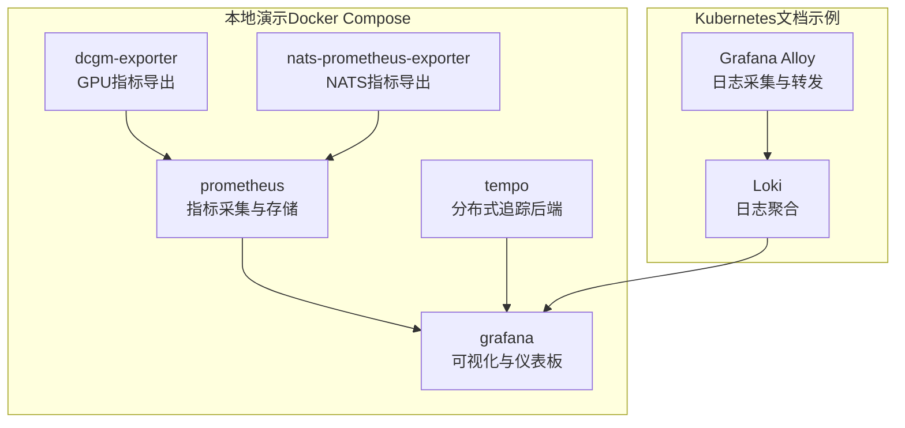
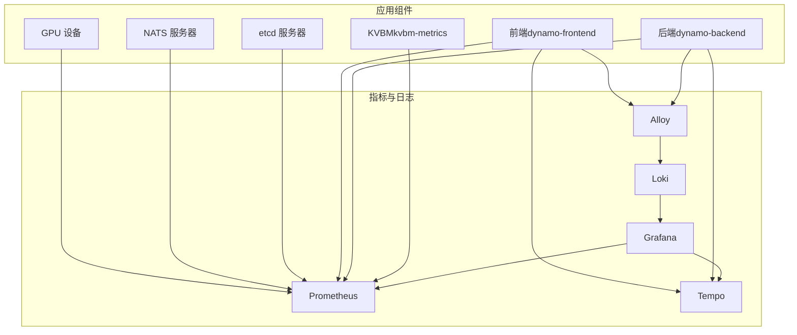
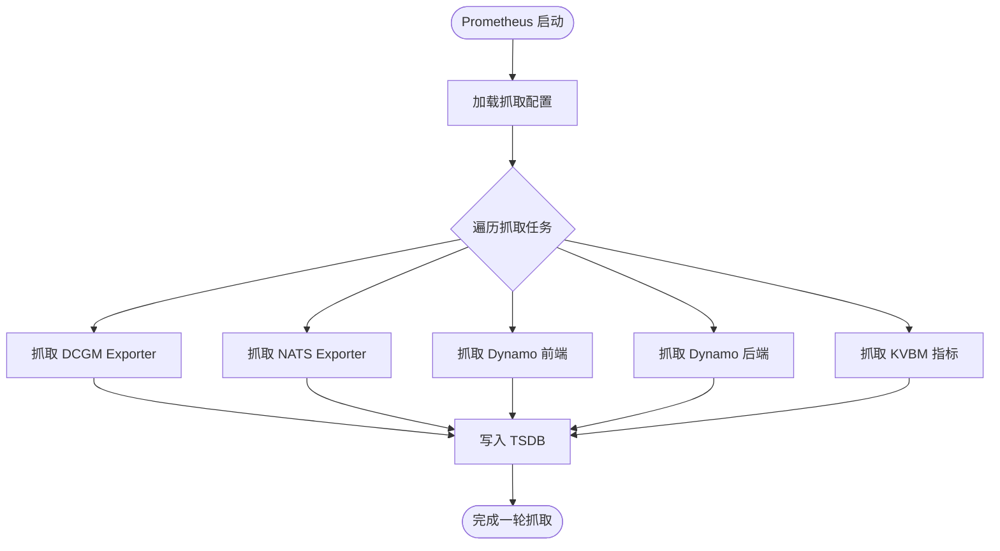
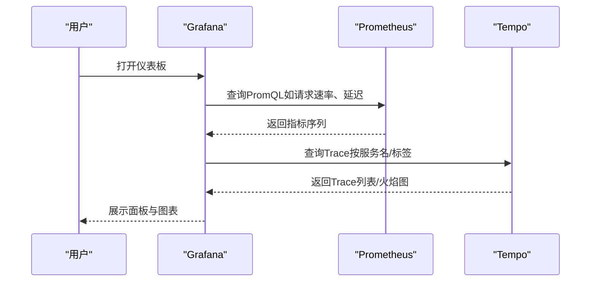
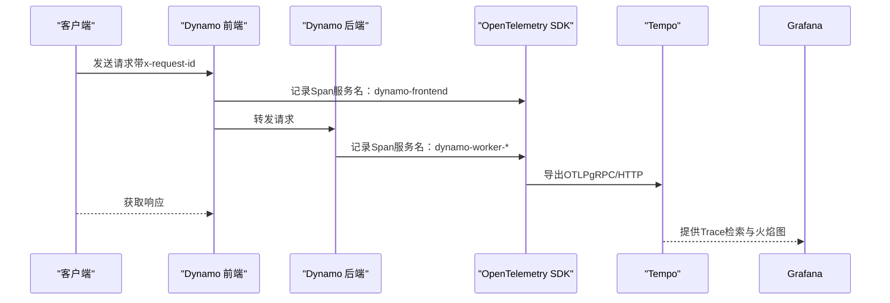
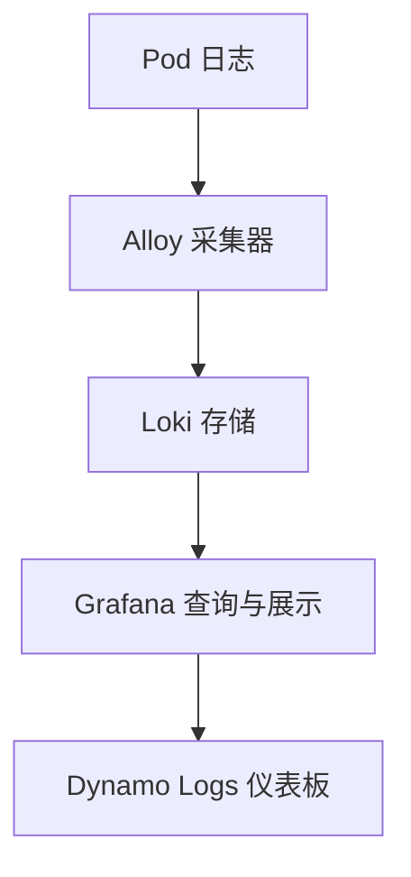
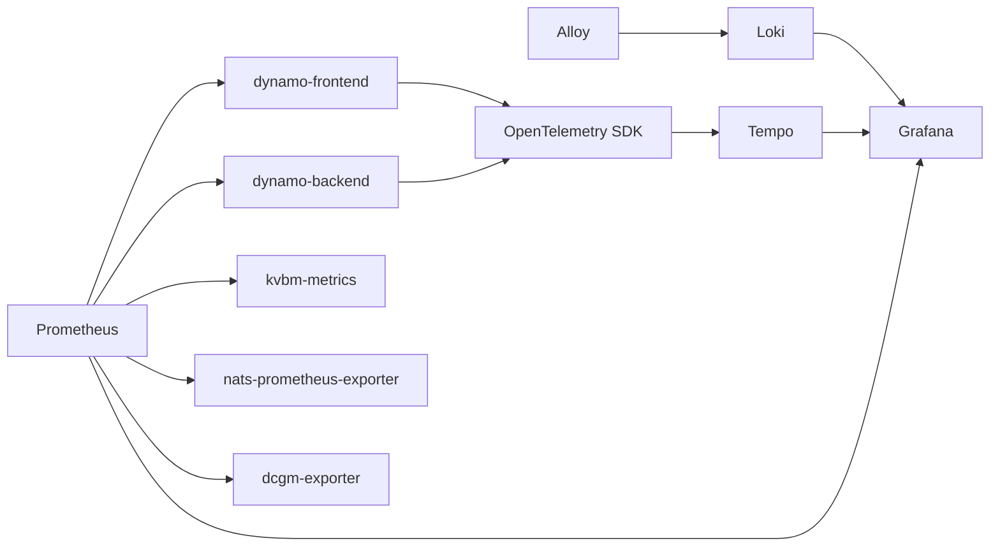

# 监控与日志

<cite>
**本文引用的文件**
- [deploy/docker-observability.yml](file://deploy/docker-observability.yml)
- [deploy/observability/prometheus.yml](file://deploy/observability/prometheus.yml)
- [deploy/observability/grafana-datasources.yml](file://deploy/observability/grafana-datasources.yml)
- [deploy/observability/tempo.yaml](file://deploy/observability/tempo.yaml)
- [deploy/observability/tempo-datasource.yml](file://deploy/observability/tempo-datasource.yml)
- [deploy/observability/grafana_dashboards/dynamo.json](file://deploy/observability/grafana_dashboards/dynamo.json)
- [deploy/observability/grafana_dashboards/kvbm.json](file://deploy/observability/grafana_dashboards/kvbm.json)
- [deploy/observability/grafana_dashboards/dashboard-providers.yml](file://deploy/observability/grafana_dashboards/dashboard-providers.yml)
- [docs/pages/kubernetes/observability/logging.md](file://docs/pages/kubernetes/observability/logging.md)
- [docs/pages/observability/tracing.md](file://docs/pages/observability/tracing.md)
- [lib/runtime/src/metrics/prometheus_names.rs](file://lib/runtime/src/metrics/prometheus_names.rs)
- [lib/runtime/src/logging.rs](file://lib/runtime/src/logging.rs)
- [lib/llm/src/http/service/metrics.rs](file://lib/llm/src/http/service/metrics.rs)
- [components/src/dynamo/planner/utils/prometheus.py](file://components/src/dynamo/planner/utils/prometheus.py)
</cite>

## 目录
1. [简介](#简介)
2. [项目结构](#项目结构)
3. [核心组件](#核心组件)
4. [架构总览](#架构总览)
5. [详细组件分析](#详细组件分析)
6. [依赖关系分析](#依赖关系分析)
7. [性能考量](#性能考量)
8. [故障排查指南](#故障排查指南)
9. [结论](#结论)
10. [附录](#附录)

## 简介
本指南面向Dynamo生产环境，提供从指标采集、可视化到日志聚合与链路追踪的完整配置与实操指引。内容覆盖：
- Prometheus指标采集与Grafana仪表板配置
- ELK/类似日志栈（以Loki为例）的部署与使用
- 关键性能指标的告警规则建议
- 分布式追踪（OpenTelemetry + Tempo）配置与在Grafana中的使用
- 日志聚合与搜索最佳实践
- 容量规划与性能分析方法
- 故障诊断与根因分析工具与流程

## 项目结构
与监控和日志密切相关的目录与文件包括：
- 观测性编排：Docker Compose定义观测栈服务（Prometheus、Grafana、Tempo、DCGM Exporter、NATS Exporter）
- 配置文件：Prometheus抓取配置、Grafana数据源与仪表板提供器、Tempo接收与存储配置
- 文档：Kubernetes下日志（Loki）与Tracing（Tempo）的安装与使用说明
- 运行时与指标：运行时日志与追踪集成、前端指标命名规范、Planner侧Prometheus客户端封装

图表来源
- [deploy/docker-observability.yml](file://deploy/docker-observability.yml#L24-L136)
- [deploy/observability/prometheus.yml](file://deploy/observability/prometheus.yml#L20-L62)
- [docs/pages/kubernetes/observability/logging.md](file://docs/pages/kubernetes/observability/logging.md#L52-L158)

章节来源
- [deploy/docker-observability.yml](file://deploy/docker-observability.yml#L10-L138)
- [deploy/observability/prometheus.yml](file://deploy/observability/prometheus.yml#L16-L62)
- [docs/pages/kubernetes/observability/logging.md](file://docs/pages/kubernetes/observability/logging.md#L1-L158)

## 核心组件
- 指标采集与存储
  - Prometheus：通过静态配置抓取dcgm-exporter、NATS Exporter、Dynamo组件（前端、后端、KVBM）等目标
  - 数据源：Grafana通过Prometheus数据源进行查询
- 可视化与仪表板
  - Grafana：提供Dynamo、KVBM等仪表板；支持Prometheus与Tempo数据源
  - 仪表板提供器：自动加载本地JSON仪表板
- 分布式追踪
  - Tempo：接收OTLP（gRPC/HTTP），提供TraceQL检索与火焰图
  - 运行时：启用JSONL日志与OTEL导出，按服务名区分组件
- 日志聚合（以Loki为例）
  - Grafana Alloy作为采集器，将容器日志转发至Loki
  - Grafana通过Loki数据源与“Dynamo Logs”仪表板查看结构化日志

章节来源
- [deploy/observability/prometheus.yml](file://deploy/observability/prometheus.yml#L20-L62)
- [deploy/observability/grafana-datasources.yml](file://deploy/observability/grafana-datasources.yml#L18-L24)
- [deploy/observability/tempo.yaml](file://deploy/observability/tempo.yaml#L1-L37)
- [docs/pages/kubernetes/observability/logging.md](file://docs/pages/kubernetes/observability/logging.md#L52-L158)
- [docs/pages/observability/tracing.md](file://docs/pages/observability/tracing.md#L18-L26)

## 架构总览
Dynamo生产环境推荐的观测栈由以下模块组成：
- 指标层：Prometheus抓取各组件指标，Grafana展示
- 日志层：Alloy采集容器日志，Loki存储，Grafana检索
- 追踪层：组件导出OTLP到Tempo，Grafana Explore中检索与分析
- 告警层：Prometheus Alertmanager（可选，基于Prometheus规则）

图表来源
- [deploy/docker-observability.yml](file://deploy/docker-observability.yml#L24-L136)
- [deploy/observability/prometheus.yml](file://deploy/observability/prometheus.yml#L20-L62)
- [docs/pages/kubernetes/observability/logging.md](file://docs/pages/kubernetes/observability/logging.md#L52-L158)
- [docs/pages/observability/tracing.md](file://docs/pages/observability/tracing.md#L18-L26)

## 详细组件分析

### Prometheus 指标采集
- 抓取目标
  - DCGM Exporter：GPU利用率、功耗等硬件指标
  - NATS Exporter：NATS连接、订阅、路由等指标
  - Dynamo组件：前端、后端、KVBM等自定义指标
- 抓取间隔与网络
  - 通过静态配置指定抓取间隔与目标地址
  - Docker Compose中通过extra_hosts映射host.docker.internal，便于本地开发环境访问
- 指标命名与前缀
  - 运行时对指标名称进行清洗与前缀规范化，确保Prometheus兼容性

图表来源
- [deploy/observability/prometheus.yml](file://deploy/observability/prometheus.yml#L20-L62)
- [deploy/docker-observability.yml](file://deploy/docker-observability.yml#L80-L84)

章节来源
- [deploy/observability/prometheus.yml](file://deploy/observability/prometheus.yml#L20-L62)
- [lib/runtime/src/metrics/prometheus_names.rs](file://lib/runtime/src/metrics/prometheus_names.rs#L514-L520)
- [lib/llm/src/http/service/metrics.rs](file://lib/llm/src/http/service/metrics.rs#L400-L412)

### Grafana 可视化与仪表板
- 数据源
  - Prometheus数据源指向Prometheus服务
  - Tempo数据源指向Tempo服务
- 仪表板提供器
  - 自动从挂载路径加载仪表板JSON，并按文件夹结构组织
- 关键仪表板
  - Dynamo：前端请求速率、首Token时间、Token间延迟、请求时延、输入/输出序列长度、GPU利用率与功耗等
  - KVBM：主机缓存命中率、磁盘缓存命中率、跨设备/主机/磁盘的块搬移等

图表来源
- [deploy/observability/grafana-datasources.yml](file://deploy/observability/grafana-datasources.yml#L18-L24)
- [deploy/observability/tempo-datasource.yml](file://deploy/observability/tempo-datasource.yml#L6-L28)
- [deploy/observability/grafana_dashboards/dashboard-providers.yml](file://deploy/observability/grafana_dashboards/dashboard-providers.yml#L18-L29)
- [deploy/observability/grafana_dashboards/dynamo.json](file://deploy/observability/grafana_dashboards/dynamo.json#L106-L116)
- [deploy/observability/grafana_dashboards/kvbm.json](file://deploy/observability/grafana_dashboards/kvbm.json#L120-L131)

章节来源
- [deploy/observability/grafana-datasources.yml](file://deploy/observability/grafana-datasources.yml#L18-L24)
- [deploy/observability/tempo-datasource.yml](file://deploy/observability/tempo-datasource.yml#L6-L28)
- [deploy/observability/grafana_dashboards/dashboard-providers.yml](file://deploy/observability/grafana_dashboards/dashboard-providers.yml#L18-L29)
- [deploy/observability/grafana_dashboards/dynamo.json](file://deploy/observability/grafana_dashboards/dynamo.json#L106-L116)
- [deploy/observability/grafana_dashboards/kvbm.json](file://deploy/observability/grafana_dashboards/kvbm.json#L120-L131)

### 分布式追踪（Tempo + OpenTelemetry）
- 运行时集成
  - 启用JSONL日志与OTLP导出，按服务名区分组件（前端、解码/预填充工作节点）
  - 支持OTLP gRPC/HTTP接收端点，便于与Tempo对接
- Grafana使用
  - 在Explore中选择Tempo数据源，使用“Search”按服务名、Span名、标签检索
- Kubernetes部署
  - 通过DynamoGraphDeployment为各组件注入通用环境变量与服务名

图表来源
- [docs/pages/observability/tracing.md](file://docs/pages/observability/tracing.md#L18-L26)
- [docs/pages/observability/tracing.md](file://docs/pages/observability/tracing.md#L113-L141)
- [lib/runtime/src/logging.rs](file://lib/runtime/src/logging.rs#L135-L156)
- [lib/runtime/src/logging.rs](file://lib/runtime/src/logging.rs#L935-L970)

章节来源
- [docs/pages/observability/tracing.md](file://docs/pages/observability/tracing.md#L18-L26)
- [docs/pages/observability/tracing.md](file://docs/pages/observability/tracing.md#L155-L214)
- [lib/runtime/src/logging.rs](file://lib/runtime/src/logging.rs#L135-L156)
- [lib/runtime/src/logging.rs](file://lib/runtime/src/logging.rs#L935-L970)

### 日志聚合（以Loki为例）
- 组件与职责
  - Alloy：采集Kubernetes容器日志，转发至Loki
  - Loki：存储日志并提供查询接口
  - Grafana：通过Loki数据源与“Dynamo Logs”仪表板查看日志
- 环境变量
  - DYN_LOGGING_JSONL：启用JSONL格式（Loki要求）
  - DYN_LOG：按模块设置日志级别
  - DYN_LOG_USE_LOCAL_TZ：使用本地时区
- 部署步骤
  - 安装Loki与Alloy
  - 配置Grafana Loki数据源与“Dynamo Logs”仪表板
  - 部署DynamoGraphDeployment并发送请求生成日志

图表来源
- [docs/pages/kubernetes/observability/logging.md](file://docs/pages/kubernetes/observability/logging.md#L52-L158)

章节来源
- [docs/pages/kubernetes/observability/logging.md](file://docs/pages/kubernetes/observability/logging.md#L29-L49)
- [docs/pages/kubernetes/observability/logging.md](file://docs/pages/kubernetes/observability/logging.md#L52-L158)

### 告警规则建议
- 基于Prometheus规则组（可参考operator侧规则定义结构）
  - 告警组名称、评估间隔、规则表达式、持续时间、注释与标签
- 建议的关键指标阈值（示例，需结合业务与SLA调整）
  - 前端请求失败率、超时率
  - 平均首Token时间、平均Token间延迟、平均请求时延
  - GPU利用率、功耗异常
  - NATS队列积压、连接数异常
  - KVBM缓存命中率骤降、跨介质搬移异常

章节来源
- [deploy/observability/prometheus.yml](file://deploy/observability/prometheus.yml#L16-L18)
- [deploy/observability/grafana_dashboards/dynamo.json](file://deploy/observability/grafana_dashboards/dynamo.json#L106-L116)
- [deploy/observability/grafana_dashboards/kvbm.json](file://deploy/observability/grafana_dashboards/kvbm.json#L120-L131)

## 依赖关系分析
- 组件耦合
  - Prometheus依赖各Exporter与Dynamo组件暴露的指标端点
  - Grafana同时依赖Prometheus与Tempo数据源
  - Loki与Alloy在Kubernetes环境下通过Helm Chart部署
- 外部依赖
  - Docker Compose网络与端口映射
  - Kubernetes命名空间与服务发现

图表来源
- [deploy/docker-observability.yml](file://deploy/docker-observability.yml#L24-L136)
- [deploy/observability/prometheus.yml](file://deploy/observability/prometheus.yml#L20-L62)
- [docs/pages/observability/tracing.md](file://docs/pages/observability/tracing.md#L18-L26)

章节来源
- [deploy/docker-observability.yml](file://deploy/docker-observability.yml#L24-L136)
- [deploy/observability/prometheus.yml](file://deploy/observability/prometheus.yml#L20-L62)

## 性能考量
- 指标抓取频率与存储
  - 合理设置抓取间隔，避免过高的采集频率导致Prometheus压力
  - 对高频计数器使用rate/increase等函数进行平滑处理
- GPU与系统资源
  - 结合DCGM指标观察GPU利用率与功耗，识别瓶颈
- 日志与追踪
  - 控制日志级别，避免过多结构化字段影响性能
  - 追踪仅在必要场景开启，减少OTLP导出开销

## 故障排查指南
- 指标不可见
  - 检查Prometheus抓取配置与目标可达性
  - 确认Dynamo组件已正确暴露指标端口
- 追踪缺失
  - 确认已启用JSONL日志与OTEL导出
  - 校验OTLP端点与服务名
- 日志未显示
  - 确认DYN_LOGGING_JSONL已启用
  - 检查Alloy采集器是否正确转发至Loki
- 根因分析流程
  - 使用Grafana Explore按服务名/标签检索Trace
  - 结合Prometheus面板定位异常时段与指标突变
  - 使用Loki仪表板过滤组件类型与命名空间，定位错误堆栈

章节来源
- [docs/pages/observability/tracing.md](file://docs/pages/observability/tracing.md#L18-L26)
- [docs/pages/kubernetes/observability/logging.md](file://docs/pages/kubernetes/observability/logging.md#L135-L158)

## 结论
通过上述配置与流程，Dynamo可在生产环境中实现：
- 全面的指标观测（系统、模型推理、KV缓存）
- 结构化的日志聚合与检索
- 分布式追踪与可视化
- 可扩展的告警与容量规划基础

建议在上线前完成端到端验证，并根据实际负载调优抓取频率与告警阈值。

## 附录
- 快速启动（Docker Compose）
  - 启动观测栈：docker compose -f deploy/docker-observability.yml up -d
  - 登录Grafana：默认账号密码在编排文件中定义
- Kubernetes（Loki + Alloy）
  - 按文档步骤安装Loki与Alloy，配置Grafana数据源与仪表板
  - 部署DynamoGraphDeployment并启用JSONL日志
- Prometheus客户端封装（Python）
  - 使用planner侧Prometheus封装类进行指标查询与解析

章节来源
- [deploy/docker-observability.yml](file://deploy/docker-observability.yml#L101-L136)
- [docs/pages/kubernetes/observability/logging.md](file://docs/pages/kubernetes/observability/logging.md#L52-L158)
- [components/src/dynamo/planner/utils/prometheus.py](file://components/src/dynamo/planner/utils/prometheus.py#L1-L42)