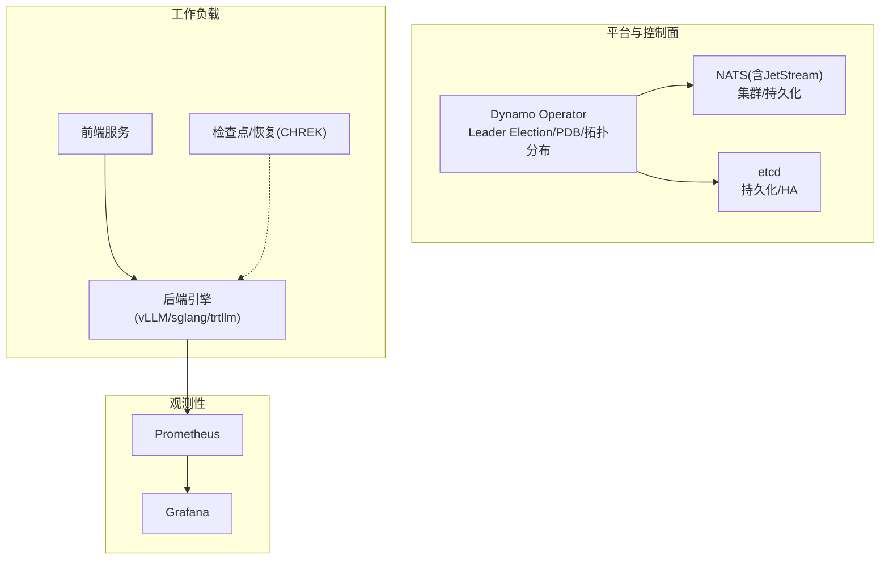
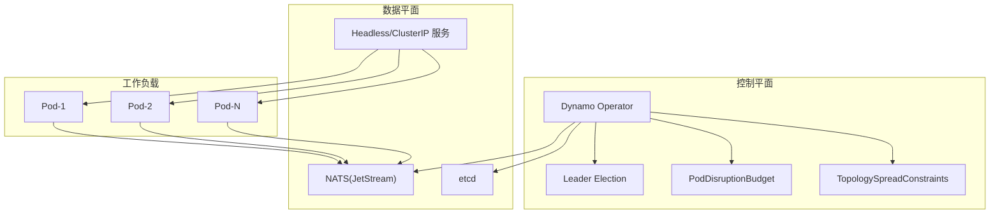
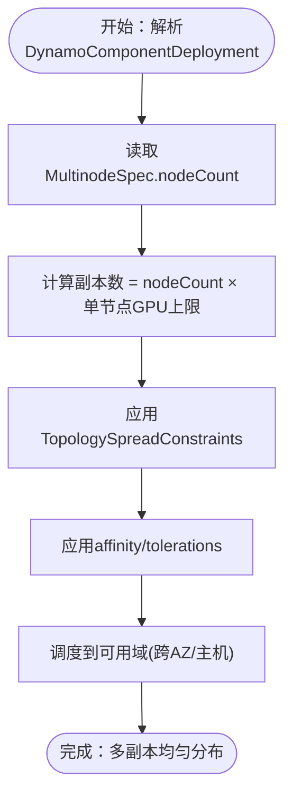
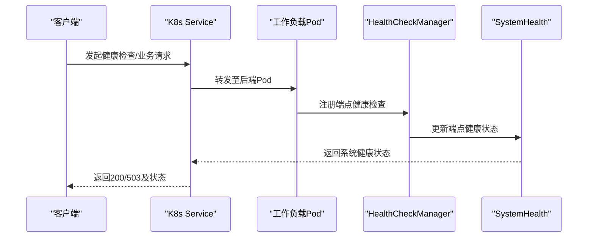
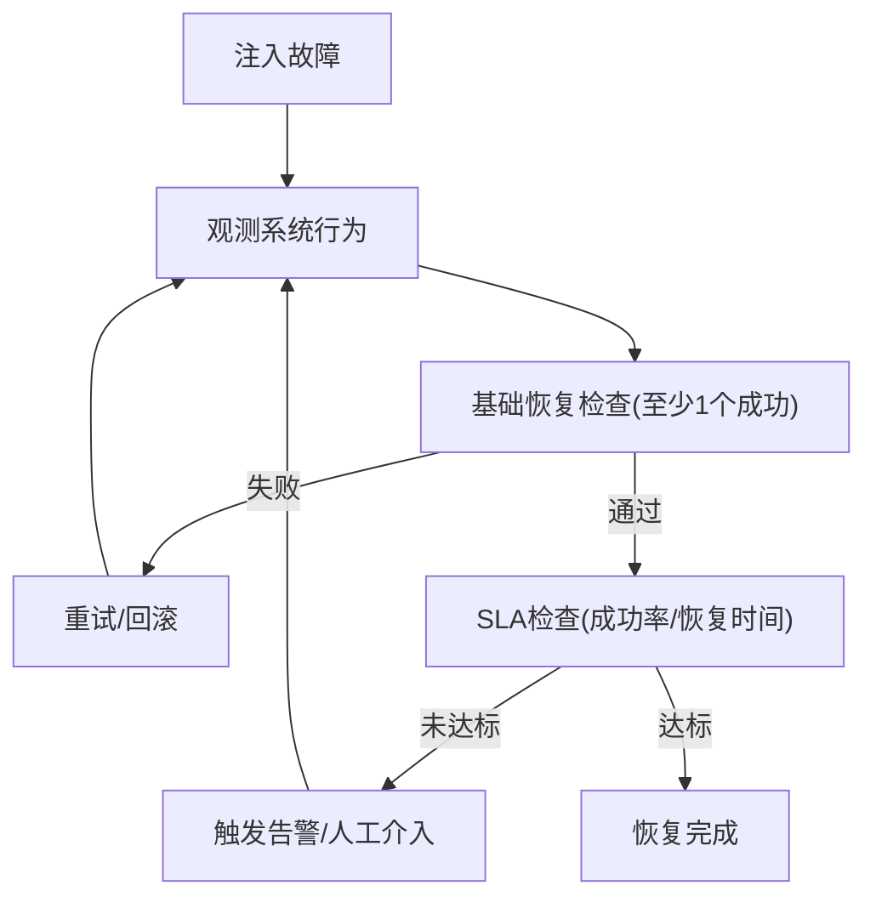
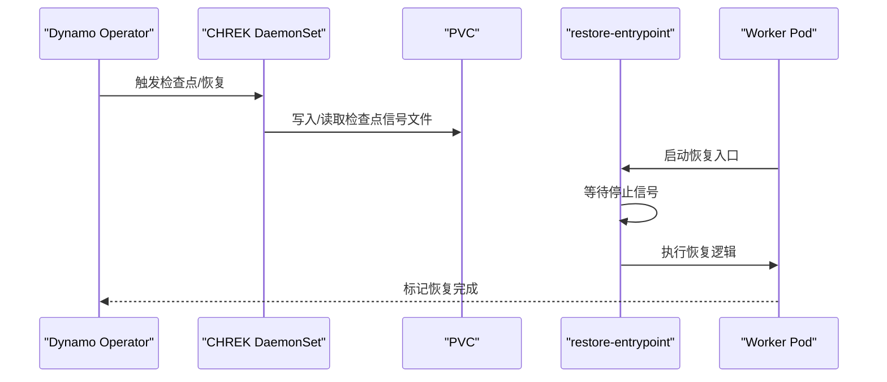
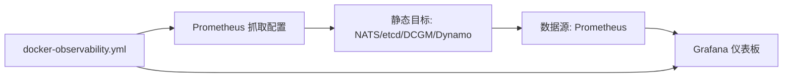
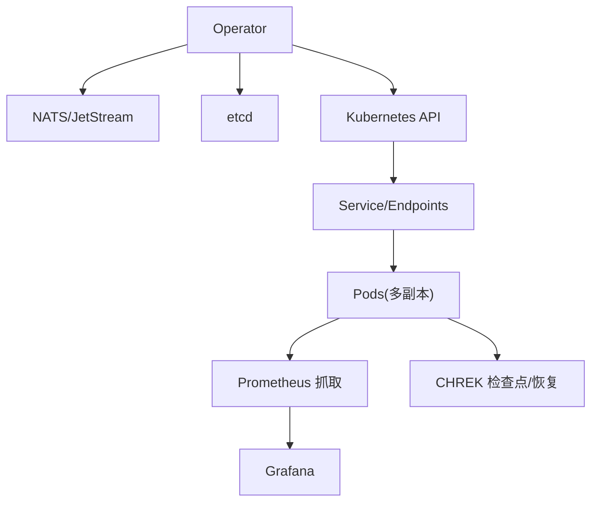

# 高可用性配置

<cite>
**本文引用的文件**
- [deploy/helm/charts/platform/values.yaml](file://deploy/helm/charts/platform/values.yaml)
- [deploy/helm/charts/platform/components/operator/values.yaml](file://deploy/helm/charts/platform/components/operator/values.yaml)
- [deploy/operator/api/v1alpha1/dynamo_model_types.go](file://deploy/operator/api/v1alpha1/dynamo_model_types.go)
- [deploy/operator/api/v1alpha1/dynamocomponentdeployment_types.go](file://deploy/operator/api/v1alpha1/dynamocomponentdeployment_types.go)
- [deploy/operator/config/crd/bases/nvidia.com_dynamographdeployments.yaml](file://deploy/operator/config/crd/bases/nvidia.com_dynamographdeployments.yaml)
- [deploy/operator/config/crd/bases/nvidia.com_dynamocomponentdeployments.yaml](file://deploy/operator/config/crd/bases/nvidia.com_dynamocomponentdeployments.yaml)
- [deploy/helm/charts/crds/templates/nvidia.com_dynamographdeployments.yaml](file://deploy/helm/charts/crds/templates/nvidia.com_dynamographdeployments.yaml)
- [deploy/helm/charts/crds/templates/nvidia.com_dynamocomponentdeployments.yaml](file://deploy/helm/charts/crds/templates/nvidia.com_dynamocomponentdeployments.yaml)
- [lib/runtime/src/system_health.rs](file://lib/runtime/src/system_health.rs)
- [lib/runtime/src/health_check.rs](file://lib/runtime/src/health_check.rs)
- [lib/runtime/src/system_status_server.rs](file://lib/runtime/src/system_status_server.rs)
- [deploy/utils/dynamo_deployment.py](file://deploy/utils/dynamo_deployment.py)
- [deploy/observability/prometheus.yml](file://deploy/observability/prometheus.yml)
- [deploy/observability/grafana-datasources.yml](file://deploy/observability/grafana-datasources.yml)
- [deploy/docker-observability.yml](file://deploy/docker-observability.yml)
- [tests/fault_tolerance/deploy/checkers.py](file://tests/fault_tolerance/deploy/checkers.py)
- [tests/fault_tolerance/deploy/parse_results.py](file://tests/fault_tolerance/deploy/parse_results.py)
- [deploy/helm/charts/chrek/values.yaml](file://deploy/helm/charts/chrek/values.yaml)
- [deploy/operator/config/crd/bases/nvidia.com_dynamocheckpoints.yaml](file://deploy/operator/config/crd/bases/nvidia.com_dynamocheckpoints.yaml)
- [deploy/helm/charts/crds/templates/nvidia.com_dynamocheckpoints.yaml](file://deploy/helm/charts/crds/templates/nvidia.com_dynamocheckpoints.yaml)
- [deploy/chrek/cmd/restore-entrypoint/main.go](file://deploy/chrek/cmd/restore-entrypoint/main.go)
- [examples/deployments/AKS/values-aks-spot.yaml](file://examples/deployments/AKS/values-aks-spot.yaml)
</cite>

## 目录
1. [简介](#简介)
2. [项目结构](#项目结构)
3. [核心组件](#核心组件)
4. [架构总览](#架构总览)
5. [详细组件分析](#详细组件分析)
6. [依赖关系分析](#依赖关系分析)
7. [性能考量](#性能考量)
8. [故障排查指南](#故障排查指南)
9. [结论](#结论)
10. [附录](#附录)

## 简介
本指南面向在Kubernetes上部署Dynamo以实现高可用性的工程团队与平台工程师，覆盖多副本部署策略、Pod亲和性与拓扑分布约束、负载均衡与健康检查、故障转移与自动恢复、持久化与备份、跨区域容灾、监控与告警以及灾难恢复与业务连续性策略。内容基于仓库中的Helm图表、Operator CRD定义、运行时健康检查模块、观测性配置与测试脚本等源码进行系统化整理。

## 项目结构
Dynamo高可用性相关能力主要分布在以下位置：
- 平台级Helm图表：提供Operator、NATS、etcd、Grove、Kai调度器等组件的统一安装与高可用参数（如Leader Election、PDB、拓扑分布等）
- CRD与控制器：定义DynamoGraphDeployment/DynamoComponentDeployment等资源，支持多节点、拓扑分布与亲和性约束
- 运行时健康检查：系统健康状态聚合、端点健康检查任务、HTTP健康接口
- 观测性：Prometheus抓取配置、Grafana数据源与仪表板、本地可观测性Compose
- 故障注入与恢复验证：高可用场景下的成功率、恢复时间阈值校验
- 备份与恢复：基于CRIU的检查点/恢复基础设施（CHREK）

**章节来源**
- [deploy/helm/charts/platform/values.yaml](file://deploy/helm/charts/platform/values.yaml#L1-L778)
- [deploy/helm/charts/platform/components/operator/values.yaml](file://deploy/helm/charts/platform/components/operator/values.yaml#L1-L283)

## 核心组件
- 平台Operator与高可用参数
  - Leader Election：确保集群内仅有一个活跃主实例，避免脑裂
  - PodDisruptionBudget：限制滚动更新/维护期间的可中断Pod数量
  - 拓扑分布约束：通过TopologySpreadConstraints实现跨节点/区域均匀分布
- 资源CRD与多副本
  - DynamoGraphDeployment/DynamoComponentDeployment支持多节点与拓扑分布
  - MultinodeSpec定义节点数，用于计算总GPU数量与副本规模
- 健康检查与系统状态
  - SystemHealth聚合端点健康状态，提供ready/notready判定
  - HealthCheckManager按端点启动独立健康检查任务
  - HTTP健康接口返回整体健康状态
- 观测性
  - Prometheus静态抓取目标（NATS、etcd、DCGM、Dynamo组件）
  - Grafana数据源与仪表板
- 备份与恢复
  - CHREK检查点/恢复基础设施（PVC/外部对象存储），配合restore-entrypoint实现快速恢复

**章节来源**
- [deploy/operator/api/v1alpha1/dynamo_model_types.go](file://deploy/operator/api/v1alpha1/dynamo_model_types.go#L1-L173)
- [deploy/operator/api/v1alpha1/dynamocomponentdeployment_types.go](file://deploy/operator/api/v1alpha1/dynamocomponentdeployment_types.go#L140-L152)
- [lib/runtime/src/system_health.rs](file://lib/runtime/src/system_health.rs#L36-L148)
- [lib/runtime/src/health_check.rs](file://lib/runtime/src/health_check.rs#L116-L141)
- [lib/runtime/src/system_status_server.rs](file://lib/runtime/src/system_status_server.rs#L1156-L1196)
- [deploy/observability/prometheus.yml](file://deploy/observability/prometheus.yml#L20-L63)
- [deploy/observability/grafana-datasources.yml](file://deploy/observability/grafana-datasources.yml#L18-L24)

## 架构总览
下图展示了高可用部署的关键交互：Operator协调资源、NATS/etcd提供可靠通信与状态存储、工作负载通过拓扑分布与亲和性实现跨节点/区域容灾、健康检查保障服务可用性、观测性支撑监控与告警。

**图表来源**
- [deploy/helm/charts/platform/values.yaml](file://deploy/helm/charts/platform/values.yaml#L60-L90)
- [deploy/helm/charts/platform/values.yaml](file://deploy/helm/charts/platform/values.yaml#L323-L334)
- [deploy/helm/charts/platform/values.yaml](file://deploy/helm/charts/platform/values.yaml#L639-L656)

## 详细组件分析

### 多副本与拓扑分布配置
- 多节点与副本规模
  - MultinodeSpec.nodeCount用于指示多节点组件的节点数量，总GPU数为节点数乘以单节点GPU上限
- 拓扑分布约束
  - 支持maxSkew、minDomains、nodeAffinityPolicy等字段，确保跨zone均匀分布
  - 当可用域数量小于minDomains时，采用“全局最小值为0”的策略，防止过度倾斜
- 亲和性与容忍度
  - 通过affinity与tolerations控制Pod调度到特定节点或容忍污点
- 示例路径
  - 平台values中Leader Election、PDB、拓扑分布与亲和性参数
  - CRD注释说明了拓扑分布约束的行为

**章节来源**
- [deploy/operator/api/v1alpha1/dynamocomponentdeployment_types.go](file://deploy/operator/api/v1alpha1/dynamocomponentdeployment_types.go#L140-L152)
- [deploy/operator/config/crd/bases/nvidia.com_dynamocomponentdeployments.yaml](file://deploy/operator/config/crd/bases/nvidia.com_dynamocomponentdeployments.yaml#L8681-L8702)
- [deploy/helm/charts/crds/templates/nvidia.com_dynamocomponentdeployments.yaml](file://deploy/helm/charts/crds/templates/nvidia.com_dynamocomponentdeployments.yaml#L8681-L8702)
- [deploy/helm/charts/platform/values.yaml](file://deploy/helm/charts/platform/values.yaml#L639-L656)

### 负载均衡与健康检查
- 服务发现与负载分发
  - 使用Headless Service与ClusterIP Service组合，结合拓扑分布实现跨节点流量分摊
- 健康检查
  - SystemHealth聚合端点健康状态，支持“全部就绪”才视为系统健康
  - HealthCheckManager为每个端点启动独立任务，使用通道避免注册竞态
  - 提供HTTP健康接口，初始默认notready，响应后变为ready
- 验证流程
  - 通过dynamo_deployment.py等待CR状态Ready且state为successful
  - 可选地进行聊天补全请求验证

**章节来源**
- [lib/runtime/src/system_health.rs](file://lib/runtime/src/system_health.rs#L98-L148)
- [lib/runtime/src/health_check.rs](file://lib/runtime/src/health_check.rs#L116-L141)
- [lib/runtime/src/system_status_server.rs](file://lib/runtime/src/system_status_server.rs#L1156-L1196)
- [deploy/utils/dynamo_deployment.py](file://deploy/utils/dynamo_deployment.py#L288-L416)

### 故障转移与自动恢复
- 自动恢复指标
  - 成功率达到≥90%，恢复时间≤60秒作为高可用场景的验收标准
- 恢复验证流程
  - 先验证至少有请求成功（BasicRecoveryChecker）
  - 再验证成功率与恢复时间阈值（HighAvailabilityResultsChecker）
- 结合Operator与NATS/etcd的HA特性，确保控制面不单点

**章节来源**
- [tests/fault_tolerance/deploy/checkers.py](file://tests/fault_tolerance/deploy/checkers.py#L382-L444)
- [tests/fault_tolerance/deploy/parse_results.py](file://tests/fault_tolerance/deploy/parse_results.py#L741-L763)

### 持久化存储与数据备份
- CHREK检查点/恢复
  - 支持PVC、S3、OCI三种存储后端
  - 通过DaemonSet与PVC提供信号文件通信，restore-entrypoint负责恢复入口
- 存储配置要点
  - PVC名称与基路径需与chrek chart一致
  - S3/OCI需提供凭据密文引用
- 恢复入口
  - 接收SIGTERM/SIGINT优雅退出，执行restore.Run并记录错误

**章节来源**
- [deploy/helm/charts/chrek/values.yaml](file://deploy/helm/charts/chrek/values.yaml)
- [deploy/operator/config/crd/bases/nvidia.com_dynamocheckpoints.yaml](file://deploy/operator/config/crd/bases/nvidia.com_dynamocheckpoints.yaml#L6280-L6287)
- [deploy/helm/charts/crds/templates/nvidia.com_dynamocheckpoints.yaml](file://deploy/helm/charts/crds/templates/nvidia.com_dynamocheckpoints.yaml#L6280-L6287)
- [deploy/chrek/cmd/restore-entrypoint/main.go](file://deploy/chrek/cmd/restore-entrypoint/main.go#L93-L107)

### 网络高可用与跨区域容灾
- 多区域部署建议
  - 在不同可用区部署Pod，利用拓扑分布约束maxSkew与minDomains
  - 使用affinity限制调度到指定区域，结合tolerations应对区域故障
- 跨区域容灾
  - 通过多区域部署与Headless Service实现跨区域流量分发
  - 控制面组件（NATS/etcd）也应跨区域部署并启用持久化
- 示例参考
  - AKS示例values展示了节点类型与区域选择策略

**章节来源**
- [deploy/helm/charts/platform/values.yaml](file://deploy/helm/charts/platform/values.yaml#L639-L656)
- [deploy/helm/charts/platform/values.yaml](file://deploy/helm/charts/platform/values.yaml#L323-L334)
- [examples/deployments/AKS/values-aks-spot.yaml](file://examples/deployments/AKS/values-aks-spot.yaml)

### 监控与告警配置
- Prometheus抓取
  - 静态配置抓取NATS、etcd、DCGM、Dynamo前后端指标
  - 可根据需要调整抓取间隔与目标
- Grafana可视化
  - 配置Prometheus为默认数据源
  - 提供Dynamo/Grove/KVBM等仪表板
- 本地可观测性
  - docker-observability.yml一键拉起Prometheus/Grafana/Tempo
  - 默认账号密码与端口映射便于快速验证

**章节来源**
- [deploy/observability/prometheus.yml](file://deploy/observability/prometheus.yml#L20-L63)
- [deploy/observability/grafana-datasources.yml](file://deploy/observability/grafana-datasources.yml#L18-L24)
- [deploy/docker-observability.yml](file://deploy/docker-observability.yml#L101-L136)

## 依赖关系分析
- 控制面依赖
  - Operator依赖NATS/JetStream进行消息传递，依赖etcd进行状态持久化
  - Leader Election与PDB确保控制面高可用与可控变更
- 数据平面依赖
  - 工作负载通过Headless Service与ClusterIP Service进行服务发现与负载分发
  - 拓扑分布与亲和性约束保证跨区域/跨节点均匀分布
- 观测性依赖
  - Prometheus抓取各组件指标，Grafana渲染仪表板
  - CHREK检查点/恢复依赖PVC/外部对象存储

**图表来源**
- [deploy/helm/charts/platform/values.yaml](file://deploy/helm/charts/platform/values.yaml#L336-L520)
- [deploy/helm/charts/platform/values.yaml](file://deploy/helm/charts/platform/values.yaml#L279-L334)
- [deploy/observability/prometheus.yml](file://deploy/observability/prometheus.yml#L20-L63)

## 性能考量
- 拓扑分布与亲和性
  - 合理设置maxSkew与minDomains，避免过度倾斜导致热点
  - 使用nodeAffinityPolicy控制是否考虑节点亲和性参与分布计算
- 健康检查频率
  - HealthCheckManager按端点独立任务执行，避免集中式健康检查成为瓶颈
- 观测性开销
  - Prometheus抓取间隔应平衡实时性与资源消耗
- 恢复性能
  - CHREK检查点/恢复减少冷启动时间，提升故障恢复速度

[本节为通用指导，无需具体文件分析]

## 故障排查指南
- 部署等待与状态
  - 使用dynamo_deployment.py等待Ready且state为successful，关注not ready组件列表
- 健康检查问题
  - 初始健康状态应为notready，响应后变为ready；若长期notready，检查端点注册与任务启动
- 观测性验证
  - 确认Prometheus能抓取到目标，Grafana数据源配置正确
- 恢复流程
  - 检查restore-entrypoint是否收到信号并执行恢复逻辑
- 高可用验证
  - 使用HighAvailabilityResultsChecker评估成功率与恢复时间是否达标

**章节来源**
- [deploy/utils/dynamo_deployment.py](file://deploy/utils/dynamo_deployment.py#L288-L416)
- [lib/runtime/src/system_status_server.rs](file://lib/runtime/src/system_status_server.rs#L1156-L1196)
- [tests/fault_tolerance/deploy/checkers.py](file://tests/fault_tolerance/deploy/checkers.py#L409-L444)
- [deploy/chrek/cmd/restore-entrypoint/main.go](file://deploy/chrek/cmd/restore-entrypoint/main.go#L93-L107)

## 结论
通过平台Helm图表提供的Leader Election、PDB与拓扑分布参数，结合CRD对多节点与亲和性的支持，Dynamo可在Kubernetes上实现多副本与跨区域容灾。运行时健康检查与HTTP健康接口确保服务可用性，Prometheus/Grafana提供完善的可观测性。CHREK检查点/恢复进一步缩短故障恢复时间。配合故障注入与恢复验证，可形成闭环的高可用保障体系。

[本节为总结，无需具体文件分析]

## 附录
- 快速检查清单
  - 控制面：Leader Election开启、PDB配置、拓扑分布约束合理
  - 工作负载：多副本、亲和性/容忍度、健康检查任务正常
  - 观测性：Prometheus抓取目标完整、Grafana数据源可用
  - 备份：CHREK存储后端配置正确、restore-entrypoint可用
  - 测试：高可用场景成功率与恢复时间达标

[本节为通用指导，无需具体文件分析]