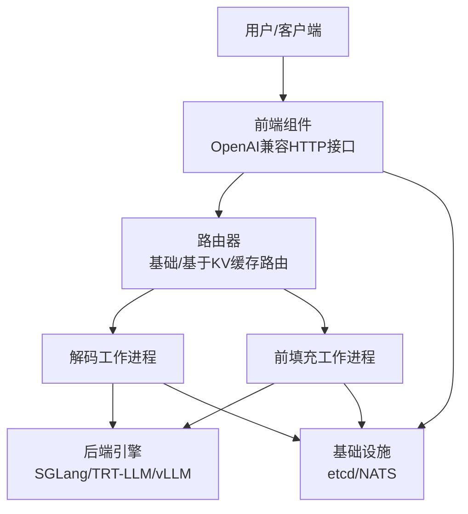
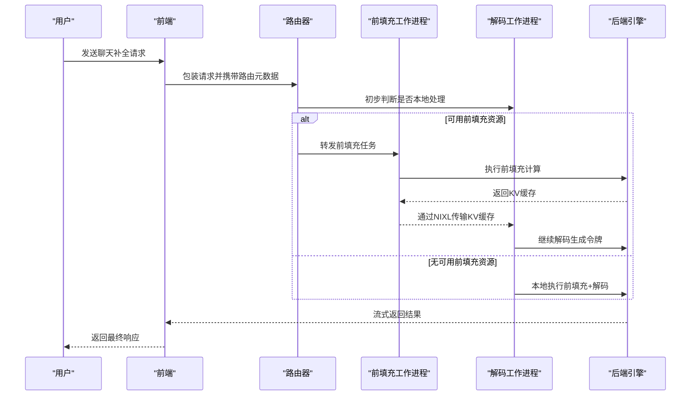
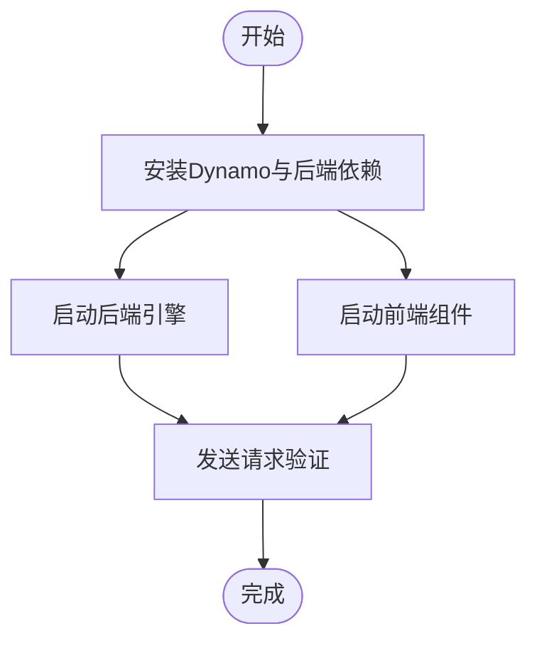
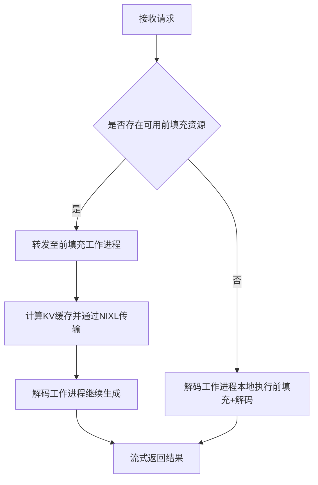
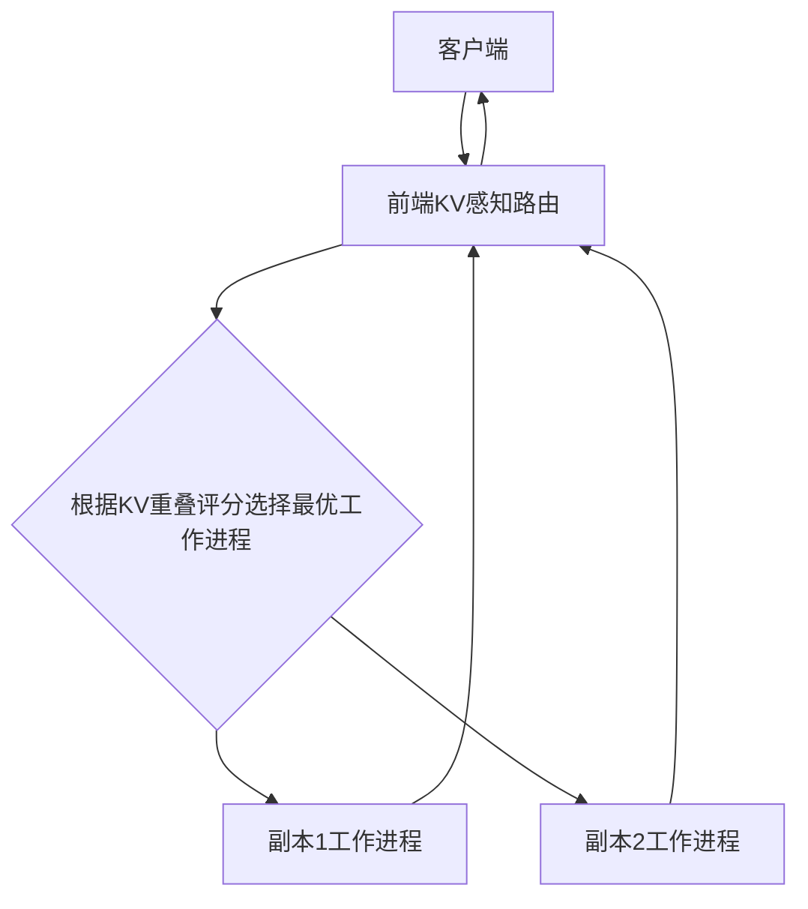
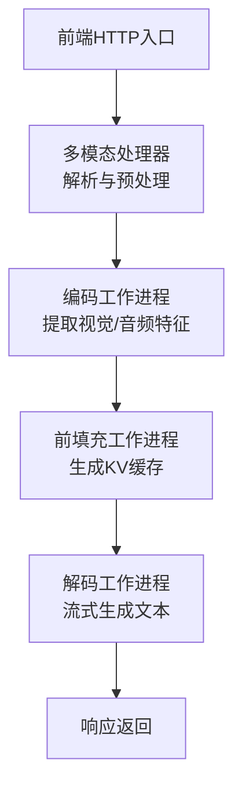
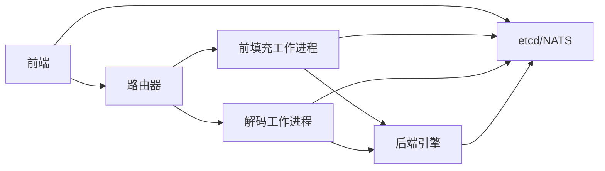

# 示例与教程

<cite>
**本文引用的文件**
- [README.md](file://README.md)
- [examples/README.md](file://examples/README.md)
- [docs/pages/getting-started/examples.md](file://docs/pages/getting-started/examples.md)
- [docs/pages/getting-started/quickstart.md](file://docs/pages/getting-started/quickstart.md)
- [examples/basics/quickstart/README.md](file://examples/basics/quickstart/README.md)
- [examples/basics/disaggregated_serving/README.md](file://examples/basics/disaggregated_serving/README.md)
- [examples/basics/multinode/README.md](file://examples/basics/multinode/README.md)
- [examples/custom_backend/hello_world/README.md](file://examples/custom_backend/hello_world/README.md)
- [examples/multimodal/launch/audio_agg.sh](file://examples/multimodal/launch/audio_agg.sh)
- [examples/multimodal/launch/video_agg.sh](file://examples/multimodal/launch/video_agg.sh)
- [examples/multimodal/utils/chat_processor.py](file://examples/multimodal/utils/chat_processor.py)
- [examples/multimodal/utils/model.py](file://examples/multimodal/utils/model.py)
- [docs/pages/performance/tuning.md](file://docs/pages/performance/tuning.md)
</cite>

## 目录
1. [简介](#简介)
2. [项目结构](#项目结构)
3. [核心组件](#核心组件)
4. [架构总览](#架构总览)
5. [详细组件分析](#详细组件分析)
6. [依赖关系分析](#依赖关系分析)
7. [性能考虑](#性能考虑)
8. [故障排查指南](#故障排查指南)
9. [结论](#结论)
10. [附录](#附录)

## 简介
本教程集合面向希望从零开始掌握Dynamo分布式推理框架的用户，覆盖从本地快速上手、多模态处理、性能优化到生产级部署与运维的完整学习路径。内容以仓库中的示例与文档为基础，提供可操作的步骤、流程图与参考路径，帮助读者在不同后端（SGLang、TensorRT-LLM、vLLM）与部署形态（单机、多节点、Kubernetes）下快速落地。

## 项目结构
- 快速开始与安装：通过容器或PyPI安装，启动前端与后端工作进程，并进行基础请求验证。
- 基础示例：聚合服务、解耦前填充/解码、多节点KV感知路由等。
- 多模态示例：音频、视频与图像的预处理、编码与推理流水线。
- 自定义后端：最小化“Hello World”服务，演示端点与分布式运行时的基本用法。
- 性能调优：针对解耦架构与路由器的关键参数进行系统性调优。
- 部署与运维：Kubernetes平台安装、观测性配置与生产级部署要点。

**图表来源**
- [examples/basics/disaggregated_serving/README.md](file://examples/basics/disaggregated_serving/README.md#L43-L57)
- [examples/basics/quickstart/README.md](file://examples/basics/quickstart/README.md#L23-L34)

**章节来源**
- [README.md](file://README.md#L87-L215)
- [docs/pages/getting-started/quickstart.md](file://docs/pages/getting-started/quickstart.md#L90-L151)

## 核心组件
- 前端组件：提供OpenAI兼容HTTP接口，负责请求预处理、路由与响应回传。
- 路由器：支持基础轮询与KV感知路由，依据缓存重用度智能分配请求。
- 工作进程：分为前填充（prefill）与解码（decode）两类，实现解耦以提升吞吐与延迟权衡。
- 后端引擎：支持SGLang、TensorRT-LLM、vLLM，按需选择以满足性能与特性需求。
- 基础设施：etcd用于服务发现与元数据存储；NATS用于组件间消息传递；可选NIXL加速KV缓存跨GPU传输。

**章节来源**
- [examples/basics/quickstart/README.md](file://examples/basics/quickstart/README.md#L18-L34)
- [examples/basics/disaggregated_serving/README.md](file://examples/basics/disaggregated_serving/README.md#L37-L57)
- [examples/basics/multinode/README.md](file://examples/basics/multinode/README.md#L10-L51)

## 架构总览
Dynamo采用“前端-路由器-工作进程-后端引擎”的分层设计，结合etcd/NATS实现去中心化的服务发现与消息编排。解耦的前填充/解码工作进程通过NIXL高效搬运KV缓存，显著降低长输入前填充对在线解码的阻塞。

**图表来源**
- [examples/basics/disaggregated_serving/README.md](file://examples/basics/disaggregated_serving/README.md#L183-L203)

**章节来源**
- [examples/basics/disaggregated_serving/README.md](file://examples/basics/disaggregated_serving/README.md#L143-L223)

## 详细组件分析

### 基础使用：快速上手
- 安装方式：推荐使用容器镜像，避免环境依赖；也可通过PyPI安装并配置系统依赖。
- 启动顺序：先启动后端引擎，再启动前端；如需本地开发，可使用文件型KV存储避免外部依赖。
- 请求测试：使用curl或OpenAI兼容客户端发送聊天补全请求，验证端到端链路。

**图表来源**
- [docs/pages/getting-started/quickstart.md](file://docs/pages/getting-started/quickstart.md#L90-L151)

**章节来源**
- [README.md](file://README.md#L155-L215)
- [docs/pages/getting-started/quickstart.md](file://docs/pages/getting-started/quickstart.md#L90-L151)

### 解耦前填充/解码：提升吞吐与延迟
- 架构优势：分离前填充（计算密集）与解码（内存密集），消除长输入阻塞在线解码。
- 关键参数：前填充工作进程通常小批量高并发，解码工作进程大批量低延迟；块大小（block size）影响缓存命中与传输效率。
- 运行要点：设置CUDA可见设备区分GPU；启用NIXL进行GPU直连传输；观察日志了解路由决策。

**图表来源**
- [examples/basics/disaggregated_serving/README.md](file://examples/basics/disaggregated_serving/README.md#L183-L203)

**章节来源**
- [examples/basics/disaggregated_serving/README.md](file://examples/basics/disaggregated_serving/README.md#L59-L223)

### 多节点KV感知路由：高可用与负载均衡
- 场景价值：在多个副本之间基于KV缓存重用度智能路由，提升共享前缀与多轮对话的效率。
- 网络要求：确保etcd/NATS端口可达；跨节点NIXL需要高速互连（如InfiniBand/RoCE）。
- 调试方法：开启调试日志查看重叠分数与选择决策；使用健康检查确认工作进程状态。

**图表来源**
- [examples/basics/multinode/README.md](file://examples/basics/multinode/README.md#L18-L51)

**章节来源**
- [examples/basics/multinode/README.md](file://examples/basics/multinode/README.md#L70-L406)

### 多模态处理：音频/视频/图像流水线
- 音频：脚本自动检测并安装vLLM音频依赖，启动前端、处理器与编码/前填充工作进程。
- 视频：指定模型与帧采样策略，启动前端、处理器与视频编码/前填充工作进程。
- 图像/文本：通过统一的聊天处理器与模型工具类构造多模态输入，适配不同模型的嵌入格式。

**图表来源**
- [examples/multimodal/launch/audio_agg.sh](file://examples/multimodal/launch/audio_agg.sh#L86-L97)
- [examples/multimodal/launch/video_agg.sh](file://examples/multimodal/launch/video_agg.sh#L12-L23)

**章节来源**
- [examples/multimodal/launch/audio_agg.sh](file://examples/multimodal/launch/audio_agg.sh#L1-L98)
- [examples/multimodal/launch/video_agg.sh](file://examples/multimodal/launch/video_agg.sh#L1-L24)
- [examples/multimodal/utils/chat_processor.py](file://examples/multimodal/utils/chat_processor.py#L128-L348)
- [examples/multimodal/utils/model.py](file://examples/multimodal/utils/model.py#L25-L92)

### 自定义后端：最小化“Hello World”
- 目标：演示如何使用分布式运行时装饰器创建端点与工作进程，展示服务注册、发现与流式响应。
- 运行方式：设置KV存储为文件模式，分别启动后端服务与客户端，观察流式输出。
- 部署提示：该示例为简化演示，不包含标准的前端-后端部署形态。

**章节来源**
- [examples/custom_backend/hello_world/README.md](file://examples/custom_backend/hello_world/README.md#L18-L114)

## 依赖关系分析
- 组件耦合：前端与路由器通过etcd/NATS进行松耦合通信；工作进程独立于前端，便于横向扩展。
- 外部依赖：etcd用于服务发现与租约管理；NATS用于事件与消息分发；NIXL用于高性能KV缓存传输。
- 后端差异：不同后端在参数命名与能力上存在差异，需参考对应后端文档进行配置。

**图表来源**
- [examples/basics/quickstart/README.md](file://examples/basics/quickstart/README.md#L114-L161)

**章节来源**
- [examples/basics/quickstart/README.md](file://examples/basics/quickstart/README.md#L114-L161)

## 性能考虑
- 引擎配置：优先考虑节点内张量并行（TP）与节点间流水并行（PP）组合；根据显存与通信瓶颈确定GPU数量。
- 批大小与最大生成长度：前填充引擎倾向小批大Token，解码引擎倾向大批中小Token；块大小影响缓存命中与传输效率。
- 路由器策略：在中低负载下，解耦架构可兼顾首Token时间（TTFT）与迭代令牌间隔（ITL）；高负载下需平衡KV缓存总量与利用率。
- 实践建议：使用AIPerf进行固定ISL/OSL/并发下的对比实验，结合SLA目标选择最优配置。

**章节来源**
- [docs/pages/performance/tuning.md](file://docs/pages/performance/tuning.md#L6-L137)

## 故障排查指南
- 服务发现问题
  - 检查etcd端点连通性与健康状态。
  - 确认工作进程已正确注册并持有租约。
- 消息传递问题
  - NATS连接状态检查；JetStream启用与队列消费正常。
  - KV事件发布与订阅是否生效（KV感知路由依赖）。
- 跨节点传输问题
  - NIXL依赖GPU间通信（NVLink/IB/RDMA）；确认驱动与网络配置。
  - CUDA IPC启用与高带宽互连（如InfiniBand/RoCE）。
- 日志与可观测性
  - 增加日志级别观察路由决策与缓存重叠分数。
  - 使用健康检查端点确认前端与工作进程状态。

**章节来源**
- [examples/basics/multinode/README.md](file://examples/basics/multinode/README.md#L437-L465)

## 结论
通过本教程集合，您可以在本地与生产环境中快速掌握Dynamo的使用方式，涵盖基础部署、解耦架构、多模态流水线与性能调优。建议从“快速上手”开始，逐步过渡到“解耦前填充/解码”与“多节点KV感知路由”，并在实际业务中结合AIPerf与观测性工具持续优化。

## 附录
- 快速开始参考路径
  - [安装与运行（容器/PyPI）](file://README.md#L92-L215)
  - [本地快速上手（CLI）](file://docs/pages/getting-started/quickstart.md#L90-L151)
- 基础示例参考路径
  - [快速开始（聚合服务）](file://examples/basics/quickstart/README.md#L36-L162)
  - [解耦前填充/解码](file://examples/basics/disaggregated_serving/README.md#L59-L223)
  - [多节点KV感知路由](file://examples/basics/multinode/README.md#L116-L515)
- 多模态参考路径
  - [音频聚合脚本](file://examples/multimodal/launch/audio_agg.sh#L1-L98)
  - [视频聚合脚本](file://examples/multimodal/launch/video_agg.sh#L1-L24)
  - [聊天处理器与模型工具](file://examples/multimodal/utils/chat_processor.py#L128-L348)
  - [多模态数据构造](file://examples/multimodal/utils/model.py#L44-L92)
- 自定义后端参考路径
  - [Hello World示例](file://examples/custom_backend/hello_world/README.md#L55-L114)
- 性能调优参考路径
  - [解耦与调优指南](file://docs/pages/performance/tuning.md#L6-L137)