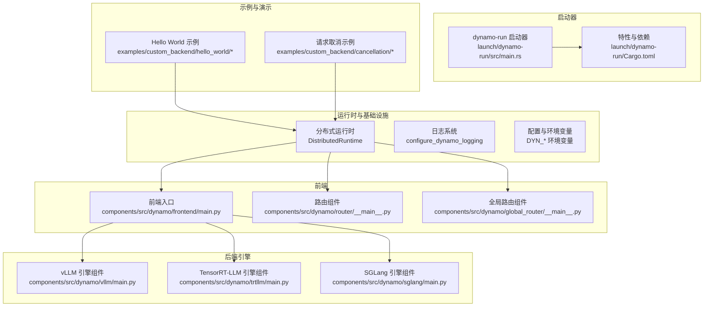
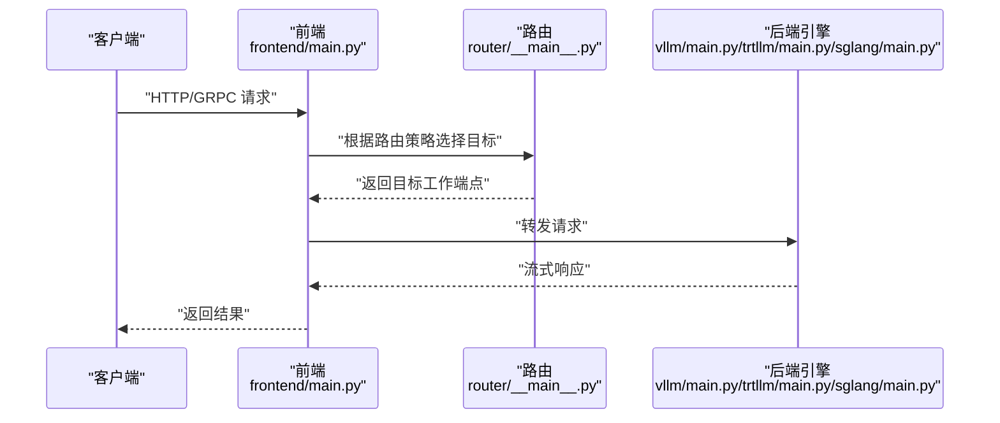
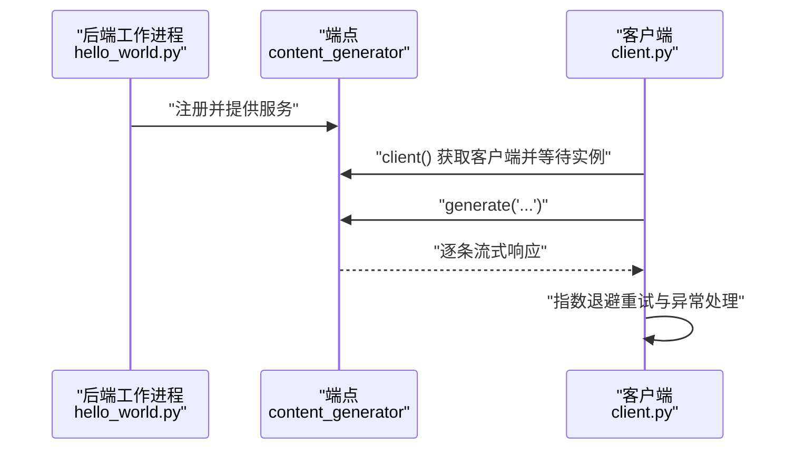
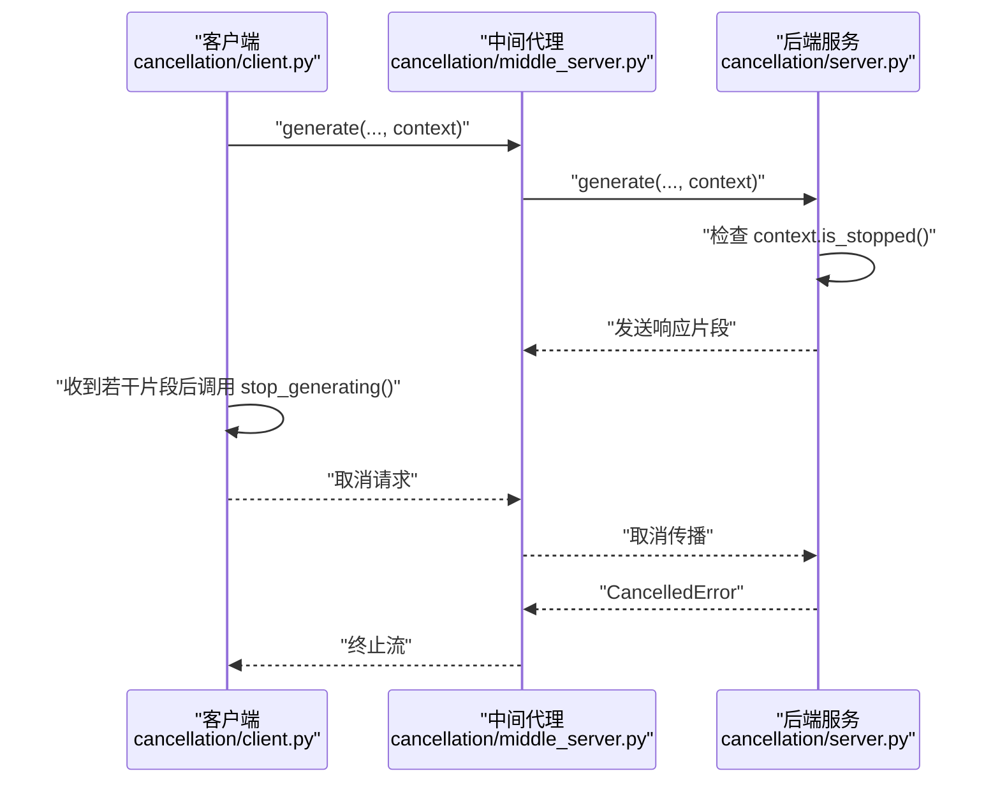
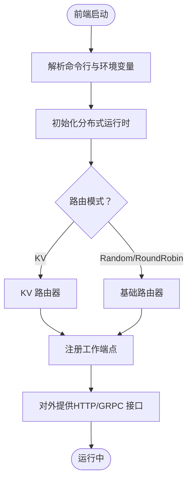
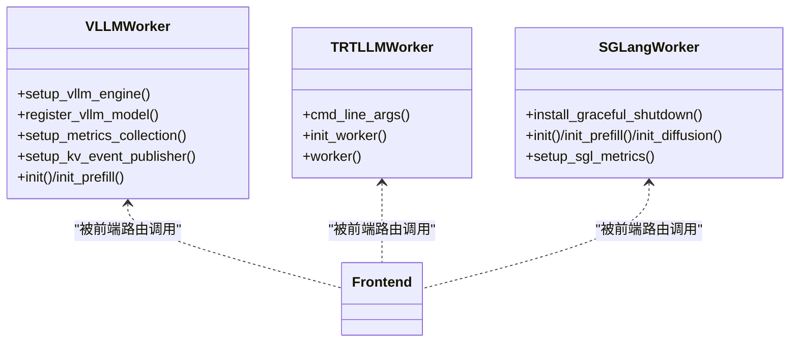
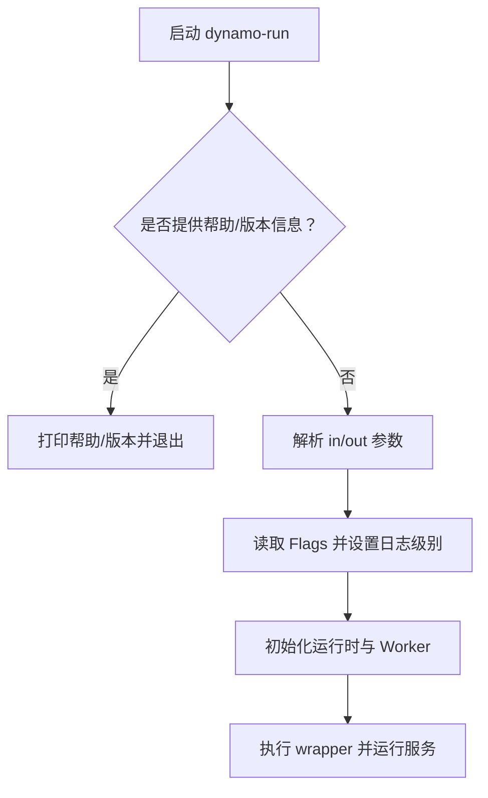
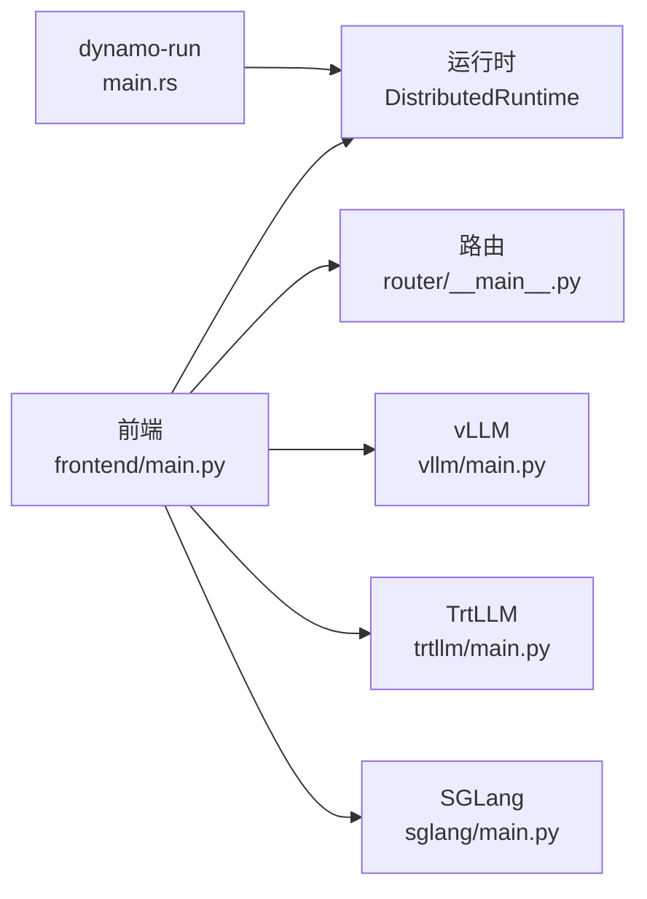

# 自定义开发示例

<cite>
**本文引用的文件**
- [Cargo.toml](file://launch/dynamo-run/Cargo.toml)
- [main.rs](file://launch/dynamo-run/src/main.rs)
- [hello_world.py](file://examples/custom_backend/hello_world/hello_world.py)
- [client.py](file://examples/custom_backend/hello_world/client.py)
- [server.py](file://examples/custom_backend/cancellation/server.py)
- [middle_server.py](file://examples/custom_backend/cancellation/middle_server.py)
- [client.py](file://examples/custom_backend/cancellation/client.py)
- [__init__.py](file://components/src/dynamo/common/__init__.py)
- [main.py](file://components/src/dynamo/frontend/main.py)
- [__main__.py](file://components/src/dynamo/router/__main__.py)
- [__main__.py](file://components/src/dynamo/global_router/__main__.py)
- [main.py](file://components/src/dynamo/vllm/main.py)
- [main.py](file://components/src/dynamo/trtllm/main.py)
- [main.py](file://components/src/dynamo/sglang/main.py)
</cite>

## 目录
1. [简介](#简介)
2. [项目结构](#项目结构)
3. [核心组件](#核心组件)
4. [架构总览](#架构总览)
5. [详细组件分析](#详细组件分析)
6. [依赖关系分析](#依赖关系分析)
7. [性能考虑](#性能考虑)
8. [故障排查指南](#故障排查指南)
9. [结论](#结论)
10. [附录](#附录)

## 简介
本文件面向希望在Dynamo平台上进行“自定义开发”的工程师与架构师，提供从零到一的完整实践指南。内容覆盖：
- 如何开发自定义后端组件：接口实现、配置管理、部署流程
- 完整的Hello World后端示例：从简单回显到复杂推理
- 请求取消、迁移与错误处理
- 集成第三方服务与API：认证、限流与超时
- 启动器（dynamo-run）使用与自定义配置
- 扩展前端API：新增端点与功能
- 测试策略与单元测试示例
- 调试技巧与故障排查
- 自定义路由器、规划器与监控组件的实现思路

## 项目结构
Dynamo采用多组件分层设计，核心由“运行时”“前端”“后端引擎”“路由/全局路由/规划器”等模块组成。下图展示了关键模块之间的关系与职责边界。

**图表来源**
- [main.py](file://components/src/dynamo/frontend/main.py#L368-L518)
- [__main__.py](file://components/src/dynamo/router/__main__.py#L1-L359)
- [__main__.py](file://components/src/dynamo/global_router/__main__.py#L1-L180)
- [main.py](file://components/src/dynamo/vllm/main.py#L1-L800)
- [main.py](file://components/src/dynamo/trtllm/main.py#L1-L51)
- [main.py](file://components/src/dynamo/sglang/main.py#L1-L888)
- [main.rs](file://launch/dynamo-run/src/main.rs#L1-L136)
- [Cargo.toml](file://launch/dynamo-run/Cargo.toml#L1-L54)
- [hello_world.py](file://examples/custom_backend/hello_world/hello_world.py#L1-L43)
- [server.py](file://examples/custom_backend/cancellation/server.py#L1-L53)
- [middle_server.py](file://examples/custom_backend/cancellation/middle_server.py#L1-L75)
- [client.py](file://examples/custom_backend/cancellation/client.py#L1-L78)

**章节来源**
- [main.py](file://components/src/dynamo/frontend/main.py#L1-L518)
- [__main__.py](file://components/src/dynamo/router/__main__.py#L1-L359)
- [__main__.py](file://components/src/dynamo/global_router/__main__.py#L1-L180)
- [main.py](file://components/src/dynamo/vllm/main.py#L1-L800)
- [main.py](file://components/src/dynamo/trtllm/main.py#L1-L51)
- [main.py](file://components/src/dynamo/sglang/main.py#L1-L888)
- [main.rs](file://launch/dynamo-run/src/main.rs#L1-L136)
- [Cargo.toml](file://launch/dynamo-run/Cargo.toml#L1-L54)
- [hello_world.py](file://examples/custom_backend/hello_world/hello_world.py#L1-L43)
- [server.py](file://examples/custom_backend/cancellation/server.py#L1-L53)
- [middle_server.py](file://examples/custom_backend/cancellation/middle_server.py#L1-L75)
- [client.py](file://examples/custom_backend/cancellation/client.py#L1-L78)

## 核心组件
- 运行时与日志
  - 分布式运行时负责命名空间、组件、端点的注册与发现，以及请求平面与事件平面的连接。
  - 日志系统通过统一的配置函数初始化，支持按级别输出。
- 前端
  - 提供HTTP/gRPC/交互模式，内置预处理器与路由选择器，支持KV感知路由与多种负载均衡策略。
- 后端引擎
  - vLLM/TrtLLM/SGLang分别封装各自引擎的初始化、注册、健康检查与指标采集。
- 路由与全局路由
  - 独立KV路由组件可对任意工作端点进行智能路由；全局路由用于多池/多命名空间的层次化调度。
- 启动器
  - dynamo-run提供单二进制快速启动能力，支持输入/输出类型、模型路径、路由参数等配置。

**章节来源**
- [__init__.py](file://components/src/dynamo/common/__init__.py#L1-L28)
- [main.py](file://components/src/dynamo/frontend/main.py#L1-L518)
- [__main__.py](file://components/src/dynamo/router/__main__.py#L1-L359)
- [__main__.py](file://components/src/dynamo/global_router/__main__.py#L1-L180)
- [main.py](file://components/src/dynamo/vllm/main.py#L1-L800)
- [main.py](file://components/src/dynamo/trtllm/main.py#L1-L51)
- [main.py](file://components/src/dynamo/sglang/main.py#L1-L888)
- [main.rs](file://launch/dynamo-run/src/main.rs#L1-L136)

## 架构总览
Dynamo采用“前端-路由-后端引擎”的三层架构，结合KV缓存状态感知与事件平面，实现高吞吐、低延迟的异构推理服务。

**图表来源**
- [main.py](file://components/src/dynamo/frontend/main.py#L368-L518)
- [__main__.py](file://components/src/dynamo/router/__main__.py#L80-L154)
- [main.py](file://components/src/dynamo/vllm/main.py#L535-L674)
- [main.py](file://components/src/dynamo/trtllm/main.py#L29-L43)
- [main.py](file://components/src/dynamo/sglang/main.py#L191-L234)

## 详细组件分析

### Hello World 后端组件
该示例展示了如何创建一个简单的回显服务，并通过客户端持续消费流式响应。要点：
- 使用装饰器声明端点类型与参数
- 在工作进程中创建命名空间/组件/端点并提供服务
- 客户端通过等待实例可用后发起请求，循环处理流式响应

**图表来源**
- [hello_world.py](file://examples/custom_backend/hello_world/hello_world.py#L16-L38)
- [client.py](file://examples/custom_backend/hello_world/client.py#L23-L66)

**章节来源**
- [hello_world.py](file://examples/custom_backend/hello_world/hello_world.py#L1-L43)
- [client.py](file://examples/custom_backend/hello_world/client.py#L1-L66)

### 请求取消与中间代理
演示了如何在链路中传递取消上下文，使上游请求能够优雅中断下游处理：
- 服务端在每次生成前检查取消状态，触发取消错误
- 中间代理使用轮询策略转发请求并将取消上下文透传
- 客户端在达到阈值后主动停止生成

**图表来源**
- [server.py](file://examples/custom_backend/cancellation/server.py#L16-L28)
- [middle_server.py](file://examples/custom_backend/cancellation/middle_server.py#L31-L47)
- [client.py](file://examples/custom_backend/cancellation/client.py#L14-L36)

**章节来源**
- [server.py](file://examples/custom_backend/cancellation/server.py#L1-L53)
- [middle_server.py](file://examples/custom_backend/cancellation/middle_server.py#L1-L75)
- [client.py](file://examples/custom_backend/cancellation/client.py#L1-L78)

### 前端与路由组件
- 前端支持HTTP/交互/GRPC等多种接入方式，具备路由模式切换（轮询、随机、KV）、TLS、指标前缀等配置项
- 独立KV路由组件可对任意工作端点进行KV感知路由，支持事件同步与树索引优化
- 全局路由组件实现跨命名空间的层次化调度，基于SLA与特征选择池

**图表来源**
- [main.py](file://components/src/dynamo/frontend/main.py#L82-L366)
- [__main__.py](file://components/src/dynamo/router/__main__.py#L156-L267)
- [__main__.py](file://components/src/dynamo/global_router/__main__.py#L39-L88)

**章节来源**
- [main.py](file://components/src/dynamo/frontend/main.py#L1-L518)
- [__main__.py](file://components/src/dynamo/router/__main__.py#L1-L359)
- [__main__.py](file://components/src/dynamo/global_router/__main__.py#L1-L180)

### 后端引擎组件（vLLM/TrtLLM/SGLang）
- vLLM：支持前处理/后处理、KV事件发布、指标回调、多进程Prometheus、睡眠/唤醒路由等
- TrtLLM：通过命令行参数解析与运行时创建，初始化工作节点
- SGLang：支持解码/预填充/扩散/嵌入/多模态编码器等不同角色，具备信号链式优雅关闭

**图表来源**
- [main.py](file://components/src/dynamo/vllm/main.py#L361-L458)
- [main.py](file://components/src/dynamo/vllm/main.py#L460-L533)
- [main.py](file://components/src/dynamo/vllm/main.py#L535-L674)
- [main.py](file://components/src/dynamo/trtllm/main.py#L29-L43)
- [main.py](file://components/src/dynamo/sglang/main.py#L92-L189)
- [main.py](file://components/src/dynamo/sglang/main.py#L191-L407)

**章节来源**
- [main.py](file://components/src/dynamo/vllm/main.py#L1-L800)
- [main.py](file://components/src/dynamo/trtllm/main.py#L1-L51)
- [main.py](file://components/src/dynamo/sglang/main.py#L1-L888)

### 启动器（dynamo-run）
- 支持多种输入/输出组合（HTTP/文本/网络），自动推断可用引擎列表
- 通过标志位控制日志级别、路由模式、KV重叠权重、温度、KV事件等
- 将命令行参数与环境变量融合，统一初始化运行时与工作进程

**图表来源**
- [main.rs](file://launch/dynamo-run/src/main.rs#L31-L136)
- [Cargo.toml](file://launch/dynamo-run/Cargo.toml#L15-L24)

**章节来源**
- [main.rs](file://launch/dynamo-run/src/main.rs#L1-L136)
- [Cargo.toml](file://launch/dynamo-run/Cargo.toml#L1-L54)

## 依赖关系分析
- 启动器依赖运行时与LLM入口，通过特性开关启用不同引擎
- 前端依赖运行时与路由配置，按需启用KV事件与多线程事件处理
- 后端引擎各自封装引擎初始化、注册与健康检查，统一通过运行时暴露端点

**图表来源**
- [main.rs](file://launch/dynamo-run/src/main.rs#L31-L136)
- [main.py](file://components/src/dynamo/frontend/main.py#L420-L489)
- [__main__.py](file://components/src/dynamo/router/__main__.py#L270-L350)
- [main.py](file://components/src/dynamo/vllm/main.py#L676-L800)
- [main.py](file://components/src/dynamo/trtllm/main.py#L29-L43)
- [main.py](file://components/src/dynamo/sglang/main.py#L191-L234)

**章节来源**
- [main.rs](file://launch/dynamo-run/src/main.rs#L1-L136)
- [main.py](file://components/src/dynamo/frontend/main.py#L1-L518)
- [__main__.py](file://components/src/dynamo/router/__main__.py#L1-L359)
- [main.py](file://components/src/dynamo/vllm/main.py#L1-L800)
- [main.py](file://components/src/dynamo/trtllm/main.py#L1-L51)
- [main.py](file://components/src/dynamo/sglang/main.py#L1-L888)

## 性能考虑
- 路由策略
  - 轮询/随机适合均匀分布；KV路由在存在KV缓存复用场景下可显著降低TTFT与ITL
  - 可通过温度参数引入采样随机性，或禁用以获得确定性
- KV事件与树索引
  - 启用KV事件可提升一致性与准确性；在不支持持久化JetStream时可通过TTL/修剪策略维持一致性
- 指标与多进程
  - vLLM/TrtLLM/SGLang均提供指标回调与多进程Prometheus支持，建议在容器/集群环境中开启
- 健康检查与就绪门
  - 引擎侧提供健康检查载荷，前端/路由可据此判断可用性，避免向不可用节点转发

[本节为通用指导，无需列出具体文件来源]

## 故障排查指南
- 日志级别
  - 通过启动器或运行时配置调整日志级别，必要时开启trace级别定位问题
- 命名空间与端点
  - 确认命名空间、组件与端点名称一致，客户端需等待实例可用后再发起请求
- 取消与迁移
  - 检查取消上下文是否正确透传；迁移限制需与后端引擎能力匹配
- 健康检查
  - 若端点长时间无响应，检查健康检查载荷与引擎初始化耗时
- 多进程指标冲突
  - vLLM场景下若出现重复时间序列，需分离多进程收集器或使用单独注册表

**章节来源**
- [main.rs](file://launch/dynamo-run/src/main.rs#L31-L61)
- [main.py](file://components/src/dynamo/frontend/main.py#L380-L400)
- [__main__.py](file://components/src/dynamo/router/__main__.py#L48-L79)
- [main.py](file://components/src/dynamo/vllm/main.py#L213-L281)

## 结论
通过上述组件与示例，Dynamo为自定义后端开发提供了清晰的框架与最佳实践。开发者可从Hello World起步，逐步引入请求取消、KV感知路由、多引擎集成与可观测性，最终构建高可用、高性能的推理平台。

[本节为总结性内容，无需列出具体文件来源]

## 附录

### 启动器（dynamo-run）使用指南
- 基本用法
  - 支持 in/out 组合与多种标志位，如HTTP端口、模型路径、路由模式、KV事件等
  - 版本与帮助信息可通过特定参数查看
- 特性开关
  - 通过特性启用CUDA/Metal等后端加速
- 运行时配置
  - 从设置中读取最大工作线程数与阻塞线程数，便于在容器/集群中调优

**章节来源**
- [main.rs](file://launch/dynamo-run/src/main.rs#L13-L136)
- [Cargo.toml](file://launch/dynamo-run/Cargo.toml#L15-L24)

### 配置管理与环境变量
- 前端常用环境变量
  - DYN_HTTP_HOST/DYN_HTTP_PORT、DYN_ROUTER_MODE、DYN_KV_CACHE_BLOCK_SIZE、DYN_METRICS_PREFIX、DYN_STORE_KV、DYN_REQUEST_PLANE、DYN_EVENT_PLANE 等
- KV路由相关
  - overlap_score_weight、router_temperature、use_kv_events、router_replica_sync、router_ttl_secs、router_max_tree_size、router_prune_target_ratio、router_event_threads 等
- 运行时与日志
  - DYN_LOG 控制日志级别；DYN_NAMESPACE 限定发现范围

**章节来源**
- [main.py](file://components/src/dynamo/frontend/main.py#L118-L366)
- [__main__.py](file://components/src/dynamo/router/__main__.py#L156-L267)

### 集成第三方服务与API
- 认证
  - 建议在前端/路由层实现鉴权中间件，或通过网关/反向代理完成
- 限流与超时
  - 在路由层设置请求迁移上限与超时策略；后端引擎提供健康检查与就绪门，避免过载
- 流式与取消
  - 保持流式协议一致性，确保取消上下文贯穿请求链路

[本节为通用指导，无需列出具体文件来源]

### 扩展前端API与端点
- 新增端点
  - 在组件内创建新端点并注册处理函数；注意与现有路由/健康检查/指标体系协同
- 端口与TLS
  - 通过命令行与环境变量配置端口与证书；确保与现有安全策略一致
- 多模态与编解码
  - 参考现有多模态组件的端点组织方式，确保编码/解码/处理器的职责分离

**章节来源**
- [main.py](file://components/src/dynamo/frontend/main.py#L482-L498)
- [__main__.py](file://components/src/dynamo/router/__main__.py#L325-L344)

### 测试策略与单元测试示例
- 单元测试
  - 建议针对端点处理函数与路由决策逻辑编写独立测试，模拟流式响应与取消
- 集成测试
  - 使用示例中的客户端/服务端模式，验证端到端链路与错误恢复
- 性能测试
  - 利用基准工具与负载生成脚本评估不同路由策略与后端引擎的性能表现

[本节为通用指导，无需列出具体文件来源]