# DeepSeek-R1模型配方

<cite>
**本文档引用的文件**
- [recipes/deepseek-r1/README.md](file://recipes/deepseek-r1/README.md)
- [recipes/deepseek-r1/sglang/README.md](file://recipes/deepseek-r1/sglang/README.md)
- [recipes/deepseek-r1/sglang/deepep.json](file://recipes/deepseek-r1/sglang/deepep.json)
- [recipes/deepseek-r1/model-cache/model-cache.yaml](file://recipes/deepseek-r1/model-cache/model-cache.yaml)
- [recipes/deepseek-r1/model-cache/model-download.yaml](file://recipes/deepseek-r1/model-cache/model-download.yaml)
- [recipes/deepseek-r1/sglang/disagg-8gpu/deploy.yaml](file://recipes/deepseek-r1/sglang/disagg-8gpu/deploy.yaml)
- [recipes/deepseek-r1/sglang/disagg-16gpu/deploy.yaml](file://recipes/deepseek-r1/sglang/disagg-16gpu/deploy.yaml)
- [recipes/deepseek-r1/trtllm/disagg/wide_ep/gb200/deploy.yaml](file://recipes/deepseek-r1/trtllm/disagg/wide_ep/gb200/deploy.yaml)
- [recipes/deepseek-r1/trtllm/disagg/wide_ep/gb200/perf.yaml](file://recipes/deepseek-r1/trtllm/disagg/wide_ep/gb200/perf.yaml)
- [recipes/deepseek-r1/vllm/disagg/deploy_hopper_16gpu.yaml](file://recipes/deepseek-r1/vllm/disagg/deploy_hopper_16gpu.yaml)
- [benchmarks/llm/perf.sh](file://benchmarks/llm/perf.sh)
- [deploy/observability/prometheus.yml](file://deploy/observability/prometheus.yml)
- [deploy/observability/grafana-datasources.yml](file://deploy/observability/grafana-datasources.yml)
</cite>

## 目录
1. [简介](#简介)
2. [项目结构](#项目结构)
3. [核心组件](#核心组件)
4. [架构概览](#架构概览)
5. [详细组件分析](#详细组件分析)
6. [依赖关系分析](#依赖关系分析)
7. [性能考虑](#性能考虑)
8. [故障排除指南](#故障排除指南)
9. [结论](#结论)
10. [附录](#附录)

## 简介

DeepSeek-R1是参数量达671B的Mixture-of-Experts (MoE)模型，本文档提供了针对该模型的综合性部署配方，涵盖VLLM、SGLang和TensorRT-LLM三种引擎在不同GPU配置下的优化设置。文档详细说明了8GPU和16GPU两种部署模式的Wide EP（专家分布）架构配置，并提供了完整的性能基准测试方案。

该配方支持多种硬件环境，包括H200和GB200 GPU，提供了从单节点到多节点的完整部署解决方案。所有配置均基于生产环境验证，确保在不同硬件条件下都能获得最佳性能表现。

## 项目结构

项目采用模块化组织方式，主要包含以下关键目录：

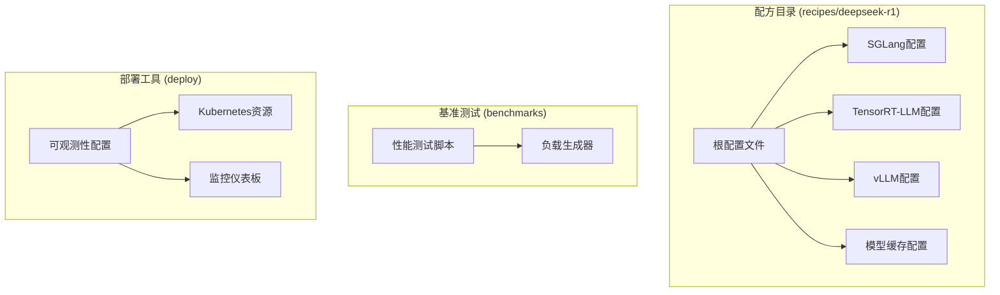

**图表来源**
- [recipes/deepseek-r1/README.md](file://recipes/deepseek-r1/README.md#L1-L104)
- [benchmarks/llm/perf.sh](file://benchmarks/llm/perf.sh#L1-L271)
- [deploy/observability/prometheus.yml](file://deploy/observability/prometheus.yml#L1-L63)

**章节来源**
- [recipes/deepseek-r1/README.md](file://recipes/deepseek-r1/README.md#L1-L104)

## 核心组件

### 模型缓存系统

模型缓存系统是DeepSeek-R1部署的核心基础设施，提供了高可用的模型存储解决方案：

| 组件 | 功能描述 | 存储容量 | 访问模式 |
|------|----------|----------|----------|
| PersistentVolumeClaim | Kubernetes持久卷声明 | 1500Gi | ReadWriteMany |
| 模型下载作业 | 自动化模型下载流程 | 1.3TB模型 | 单次执行 |
| 缓存策略 | 多副本冗余存储 | 高可用 | 并行访问 |

### 引擎适配层

三种推理引擎通过统一的适配层实现无缝集成：

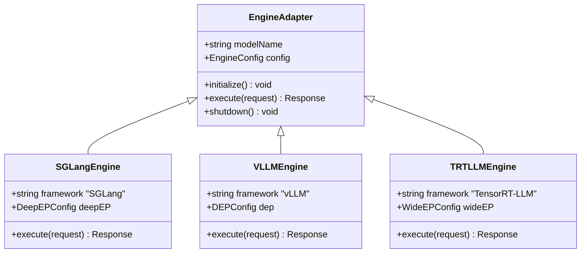

**图表来源**
- [recipes/deepseek-r1/sglang/deepep.json](file://recipes/deepseek-r1/sglang/deepep.json#L1-L16)
- [recipes/deepseek-r1/sglang/disagg-8gpu/deploy.yaml](file://recipes/deepseek-r1/sglang/disagg-8gpu/deploy.yaml#L1-L110)

**章节来源**
- [recipes/deepseek-r1/model-cache/model-cache.yaml](file://recipes/deepseek-r1/model-cache/model-cache.yaml#L1-L13)
- [recipes/deepseek-r1/model-cache/model-download.yaml](file://recipes/deepseek-r1/model-cache/model-download.yaml#L1-L37)

## 架构概览

DeepSeek-R1采用分布式专家并行架构，通过三个核心组件实现高效推理：

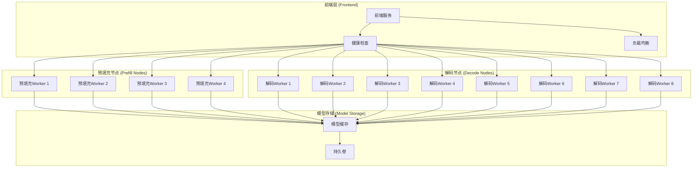

**图表来源**
- [recipes/deepseek-r1/trtllm/disagg/wide_ep/gb200/deploy.yaml](file://recipes/deepseek-r1/trtllm/disagg/wide_ep/gb200/deploy.yaml#L101-L251)
- [recipes/deepseek-r1/vllm/disagg/deploy_hopper_16gpu.yaml](file://recipes/deepseek-r1/vllm/disagg/deploy_hopper_16gpu.yaml#L1-L167)

### 硬件配置矩阵

| 配置类型 | GPU数量 | GPU型号 | 总显存 | 推荐用途 |
|----------|---------|---------|--------|----------|
| SGLang 8GPU | 16x | H200 | 2.2TB | 单节点部署 |
| SGLang 16GPU | 32x | H200 | 4.4TB | 多节点部署 |
| TensorRT-LLM | 36x | GB200 | ~2.5TB | 高吞吐量场景 |
| vLLM 16GPU | 32x | H200 | 4.4TB | 低延迟场景 |

**章节来源**
- [recipes/deepseek-r1/README.md](file://recipes/deepseek-r1/README.md#L74-L89)

## 详细组件分析

### SGLang Wide EP架构

SGLang引擎采用Wide Expert Parallel (WideEP)架构，专为MoE模型优化：

#### 8GPU配置详解

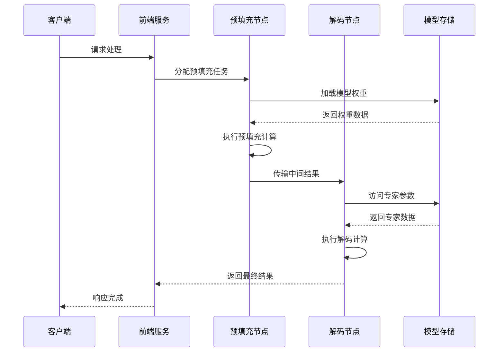

**图表来源**
- [recipes/deepseek-r1/sglang/disagg-8gpu/deploy.yaml](file://recipes/deepseek-r1/sglang/disagg-8gpu/deploy.yaml#L25-L110)

#### 16GPU配置详解

多节点扩展配置支持更大规模的部署需求：

| 参数 | 8GPU配置 | 16GPU配置 | 差异说明 |
|------|----------|-----------|----------|
| TP大小 | 8 | 16 | 张量并行规模翻倍 |
| DP大小 | 8 | 16 | 数据并行规模翻倍 |
| EP大小 | 8 | 16 | 专家并行规模翻倍 |
| 节点数 | 1 | 2 | 多节点部署 |
| 共享内存 | 80Gi | 80Gi | 内存配置保持一致 |

**章节来源**
- [recipes/deepseek-r1/sglang/disagg-8gpu/deploy.yaml](file://recipes/deepseek-r1/sglang/disagg-8gpu/deploy.yaml#L1-L110)
- [recipes/deepseek-r1/sglang/disagg-16gpu/deploy.yaml](file://recipes/deepseek-r1/sglang/disagg-16gpu/deploy.yaml#L1-L116)

### TensorRT-LLM Wide EP架构

TensorRT-LLM采用专门的Wide EP优化，针对GB200硬件进行深度优化：

#### 性能配置分析

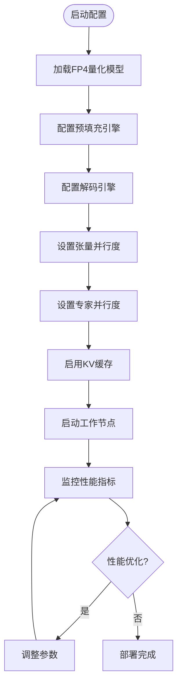

**图表来源**
- [recipes/deepseek-r1/trtllm/disagg/wide_ep/gb200/deploy.yaml](file://recipes/deepseek-r1/trtllm/disagg/wide_ep/gb200/deploy.yaml#L49-L84)

#### 关键配置参数

| 配置项 | 预填充节点 | 解码节点 | 说明 |
|--------|------------|----------|------|
| 张量并行度 | 4 | 32 | GPU分配策略 |
| 专家并行度 | 4 | 32 | MoE专家分布 |
| 最大批大小 | 4 | 32 | 吞吐量控制 |
| 序列长度 | 1227 | 2251 | 输入限制 |
| KV缓存类型 | FP8 | FP8 | 精度选择 |
| 缓存复用 | 禁用 | 禁用 | 内存管理策略 |

**章节来源**
- [recipes/deepseek-r1/trtllm/disagg/wide_ep/gb200/deploy.yaml](file://recipes/deepseek-r1/trtllm/disagg/wide_ep/gb200/deploy.yaml#L1-L251)

### vLLM DEP架构

vLLM采用Data-Expert Parallel (DEP)混合负载均衡架构：

#### 16GPU配置详解

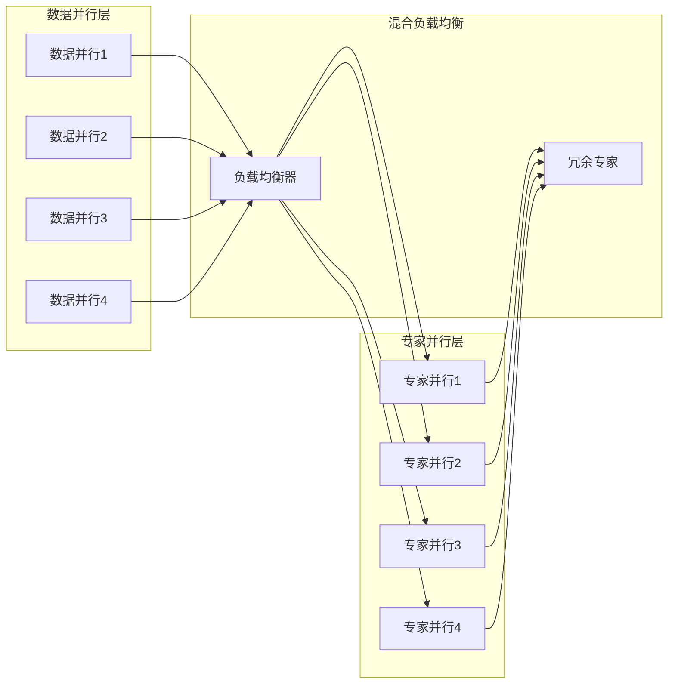

**图表来源**
- [recipes/deepseek-r1/vllm/disagg/deploy_hopper_16gpu.yaml](file://recipes/deepseek-r1/vllm/disagg/deploy_hopper_16gpu.yaml#L80-L96)

#### 性能优化参数

| 参数名称 | 值 | 作用 |
|----------|----|------|
| VLLM_MOE_DP_CHUNK_SIZE | 384 | 数据并行分块大小 |
| 编译配置 | FULL_DECODE_ONLY | 图编译模式 |
| EPLB窗口大小 | 1000 | 负载均衡窗口 |
| 冗余专家数 | 32 | 性能冗余 |
| 最大序列数 | 512 | 并发控制 |

**章节来源**
- [recipes/deepseek-r1/vllm/disagg/deploy_hopper_16gpu.yaml](file://recipes/deepseek-r1/vllm/disagg/deploy_hopper_16gpu.yaml#L1-L167)

## 依赖关系分析

### 系统依赖图

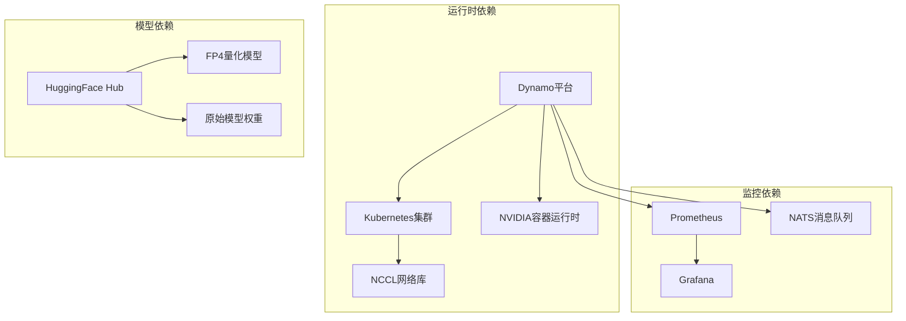

**图表来源**
- [recipes/deepseek-r1/README.md](file://recipes/deepseek-r1/README.md#L14-L20)
- [deploy/observability/prometheus.yml](file://deploy/observability/prometheus.yml#L20-L50)

### 部署依赖链

每个部署配置都遵循相同的依赖关系模式：

1. **基础设施准备**: Kubernetes集群和网络配置
2. **模型准备**: 模型缓存和下载作业
3. **引擎部署**: 前端和工作节点部署
4. **监控配置**: 指标收集和可视化设置

**章节来源**
- [recipes/deepseek-r1/README.md](file://recipes/deepseek-r1/README.md#L21-L50)

## 性能考虑

### 基准测试框架

提供了完整的性能测试套件，支持多种测试场景：

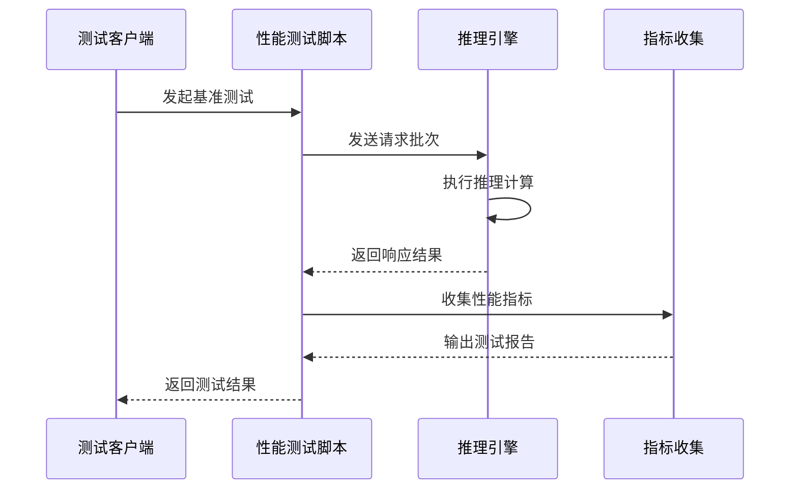

**图表来源**
- [benchmarks/llm/perf.sh](file://benchmarks/llm/perf.sh#L215-L242)

### 性能调优建议

#### 内存优化策略

| 优化方向 | 参数调整 | 预期效果 |
|----------|----------|----------|
| KV缓存管理 | 调整free_gpu_memory_fraction | 减少内存占用 |
| 批处理大小 | 优化max_batch_size | 提高吞吐量 |
| 图编译 | 启用cuda_graph_config | 降低延迟 |
| 内存碎片 | 调整mem-fraction-static | 减少OOM风险 |

#### 网络优化策略

| 优化方向 | 参数调整 | 预期效果 |
|----------|----------|----------|
| RDMA支持 | 启用custom: rdma/ib | 提高网络带宽 |
| NCCL配置 | 调整通信后端 | 优化节点间通信 |
| 缓存传输 | 优化cache_transceiver_config | 减少网络延迟 |

**章节来源**
- [benchmarks/llm/perf.sh](file://benchmarks/llm/perf.sh#L1-L271)

## 故障排除指南

### 常见问题诊断

#### NCCL错误处理

NCCL相关错误通常指示内存不足问题：

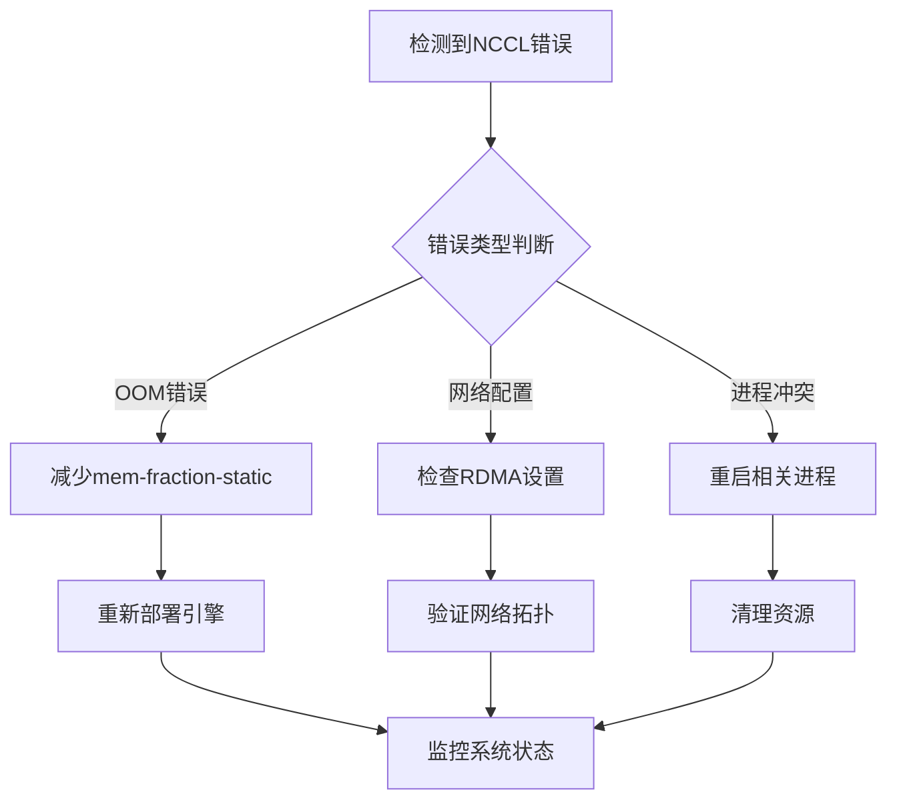

#### 模型加载问题

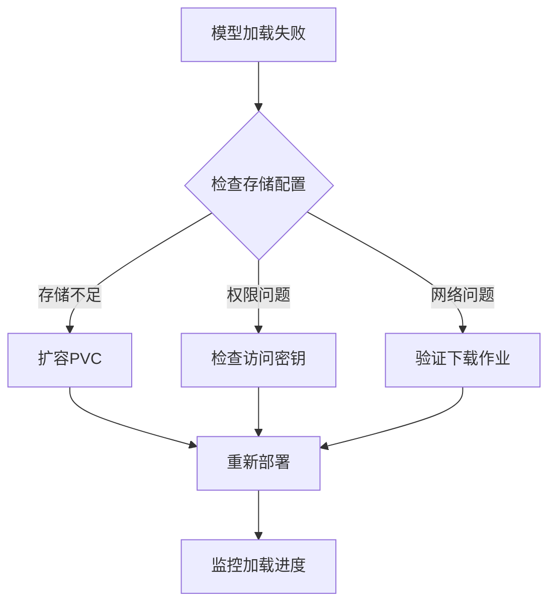

**章节来源**
- [recipes/deepseek-r1/README.md](file://recipes/deepseek-r1/README.md#L84-L90)

### 监控和调试

#### Prometheus监控配置

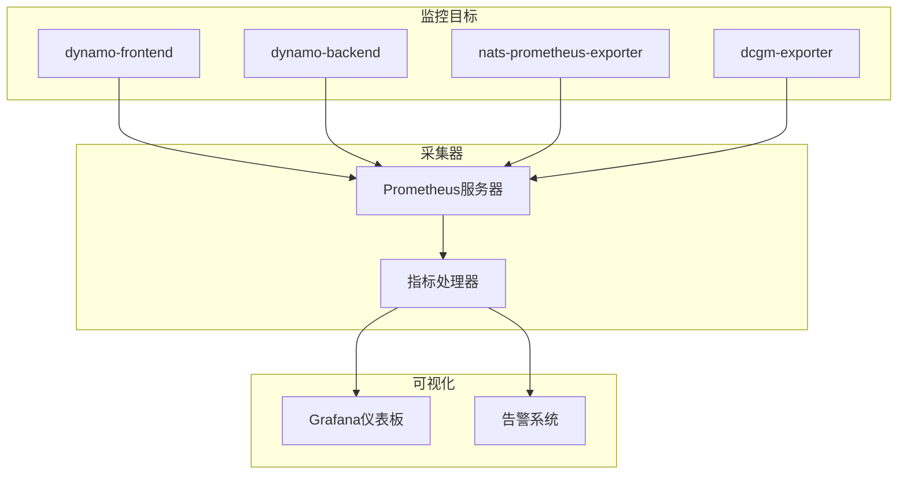

**图表来源**
- [deploy/observability/prometheus.yml](file://deploy/observability/prometheus.yml#L20-L57)
- [deploy/observability/grafana-datasources.yml](file://deploy/observability/grafana-datasources.yml#L18-L24)

**章节来源**
- [deploy/observability/prometheus.yml](file://deploy/observability/prometheus.yml#L1-L63)
- [deploy/observability/grafana-datasources.yml](file://deploy/observability/grafana-datasources.yml#L1-L24)

## 结论

DeepSeek-R1模型配方提供了完整的生产级部署解决方案，涵盖了三种主流推理引擎的优化配置。通过Wide EP架构和专业的性能调优，该配方能够在不同硬件环境下实现最佳的推理性能。

关键优势包括：
- **多引擎支持**: VLLM、SGLang、TensorRT-LLM三种引擎的统一配置
- **灵活的硬件适配**: 支持8GPU和16GPU的不同部署需求
- **完善的监控体系**: 全面的指标收集和可视化支持
- **生产就绪**: 经过验证的配置参数和故障排除方案

建议根据具体的硬件条件和性能需求选择合适的部署方案，并结合监控系统持续优化系统性能。

## 附录

### 快速部署步骤

1. **环境准备**
   ```bash
   export NAMESPACE=dynamo-demo
   kubectl create namespace ${NAMESPACE}
   ```

2. **创建HuggingFace令牌**
   ```bash
   kubectl create secret generic hf-token-secret \
     --from-literal=HF_TOKEN="your-token-here" \
     -n ${NAMESPACE}
   ```

3. **部署模型缓存**
   ```bash
   kubectl apply -f model-cache.yaml -n ${NAMESPACE}
   kubectl apply -f model-download.yaml -n ${NAMESPACE}
   ```

4. **启动推理服务**
   ```bash
   kubectl apply -f sglang/disagg-8gpu/deploy.yaml -n ${NAMESPACE}
   ```

### 性能测试命令

```bash
# 基准测试脚本使用
./perf.sh \
  --model deepseek-ai/DeepSeek-R1 \
  --input-sequence-length 1024 \
  --output-sequence-length 1024 \
  --concurrency 32,64,128 \
  --url http://localhost:8000

# 直接使用aiperf进行测试
aiperf profile \
  --model deepseek-ai/DeepSeek-R1 \
  --endpoint /v1/chat/completions \
  --concurrency 64 \
  --url http://localhost:8000
```