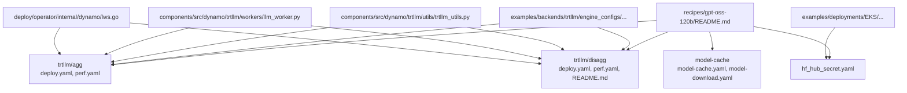
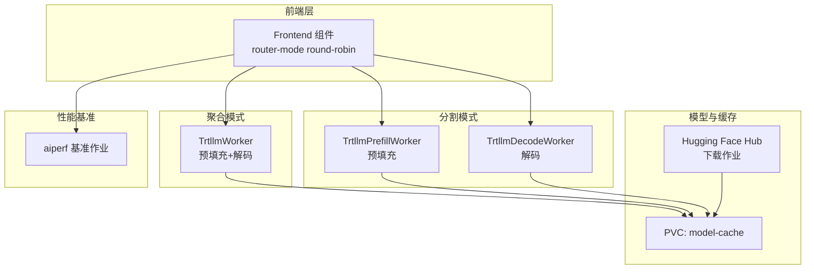
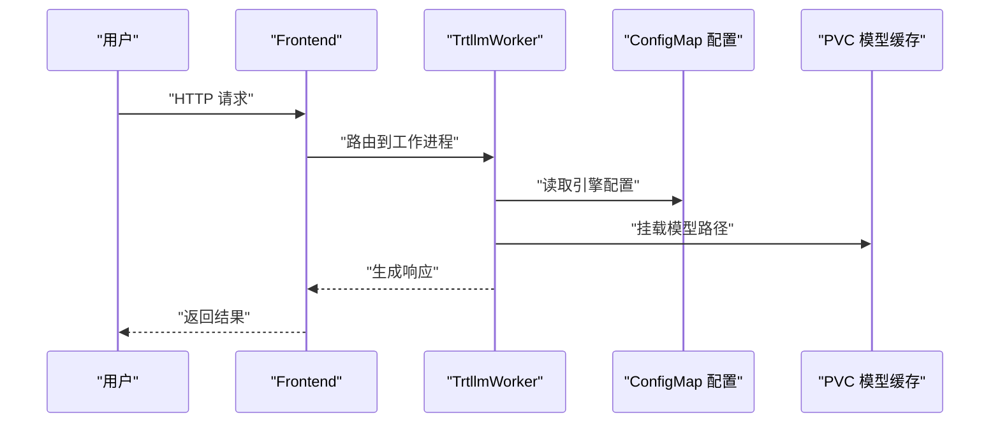
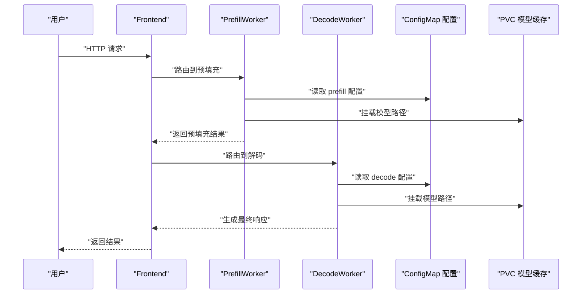
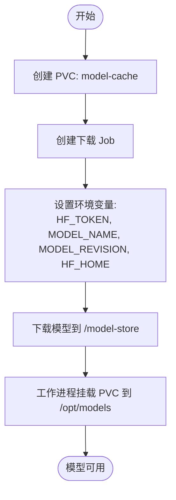
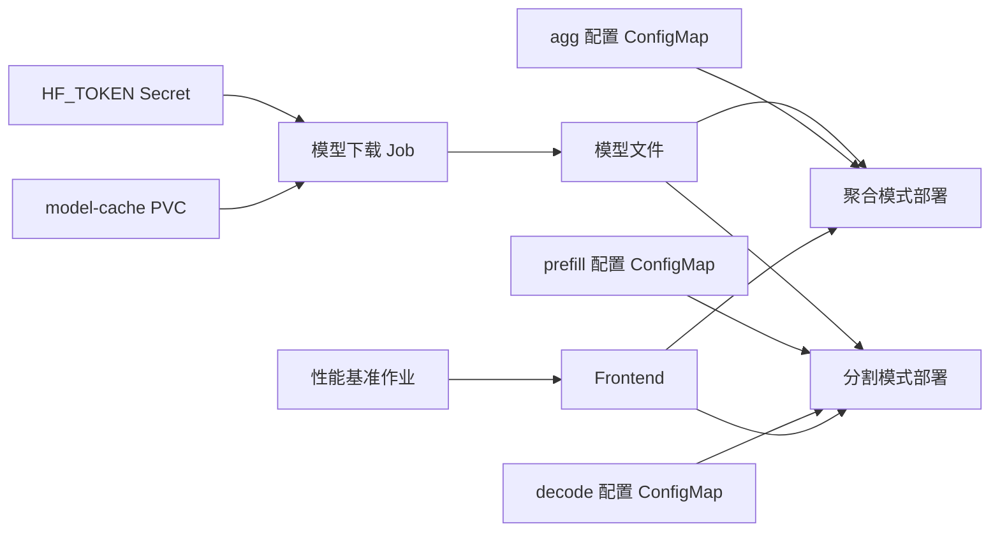

# GPT-OSS模型配方

<cite>
**本文引用的文件**
- [recipes/gpt-oss-120b/README.md](file://recipes/gpt-oss-120b/README.md)
- [recipes/gpt-oss-120b/model-cache/model-cache.yaml](file://recipes/gpt-oss-120b/model-cache/model-cache.yaml)
- [recipes/gpt-oss-120b/model-cache/model-download.yaml](file://recipes/gpt-oss-120b/model-cache/model-download.yaml)
- [recipes/gpt-oss-120b/trtllm/agg/deploy.yaml](file://recipes/gpt-oss-120b/trtllm/agg/deploy.yaml)
- [recipes/gpt-oss-120b/trtllm/agg/perf.yaml](file://recipes/gpt-oss-120b/trtllm/agg/perf.yaml)
- [recipes/gpt-oss-120b/trtllm/disagg/deploy.yaml](file://recipes/gpt-oss-120b/trtllm/disagg/deploy.yaml)
- [recipes/gpt-oss-120b/trtllm/disagg/perf.yaml](file://recipes/gpt-oss-120b/trtllm/disagg/perf.yaml)
- [recipes/gpt-oss-120b/trtllm/disagg/README.md](file://recipes/gpt-oss-120b/trtllm/disagg/README.md)
- [recipes/hf_hub_secret/hf_hub_secret.yaml](file://recipes/hf_hub_secret/hf_hub_secret.yaml)
- [examples/deployments/EKS/Deploy_Dynamo_Kubernetes_Platform.md](file://examples/deployments/EKS/Deploy_Dynamo_Kubernetes_Platform.md)
- [examples/backends/trtllm/engine_configs/README.md](file://examples/backends/trtllm/engine_configs/README.md)
- [components/src/dynamo/trtllm/utils/trtllm_utils.py](file://components/src/dynamo/trtllm/utils/trtllm_utils.py)
- [components/src/dynamo/trtllm/workers/llm_worker.py](file://components/src/dynamo/trtllm/workers/llm_worker.py)
- [deploy/operator/internal/dynamo/lws.go](file://deploy/operator/internal/dynamo/lws.go)
</cite>

## 目录
1. [简介](#简介)
2. [项目结构](#项目结构)
3. [核心组件](#核心组件)
4. [架构总览](#架构总览)
5. [详细组件分析](#详细组件分析)
6. [依赖关系分析](#依赖关系分析)
7. [性能考量](#性能考量)
8. [故障排查指南](#故障排查指南)
9. [结论](#结论)
10. [附录](#附录)

## 简介
本配方面向在多节点环境中稳定、高性能地部署 GPT-OSS-120B 模型，重点覆盖以下方面：
- TensorRT-LLM 引擎的聚合与分割式部署配置
- 多节点环境下的性能优化策略（并行度、KV 缓存、调度与通信）
- 模型缓存与下载的完整配置流程（含 Hugging Face Hub 密钥与安全设置）
- 大规模部署的硬件要求、网络拓扑与性能基准测试方法
- 实际部署脚本、配置文件与监控设置指引

## 项目结构
围绕 GPT-OSS-120B 的部署，关键目录与文件如下：
- recipes/gpt-oss-120b：配方入口与部署清单
  - model-cache：模型缓存 PVC 与下载 Job
  - trtllm/agg：聚合模式部署与性能基准
  - trtllm/disagg：分割模式部署与性能基准
- recipes/hf_hub_secret：Hugging Face 访问令牌 Secret
- examples/deployments/EKS：Kubernetes 平台安装与密钥创建示例
- examples/backends/trtllm/engine_configs：TRT-LLM 引擎配置使用说明
- components/src/dynamo/trtllm：TRT-LLM 后端实现与运行时参数
- deploy/operator/internal/dynamo：多节点部署器（如 LWS）实现

**图示来源**
- [recipes/gpt-oss-120b/README.md](file://recipes/gpt-oss-120b/README.md#L1-L52)
- [recipes/gpt-oss-120b/model-cache/model-cache.yaml](file://recipes/gpt-oss-120b/model-cache/model-cache.yaml#L1-L13)
- [recipes/gpt-oss-120b/model-cache/model-download.yaml](file://recipes/gpt-oss-120b/model-cache/model-download.yaml#L1-L44)
- [recipes/gpt-oss-120b/trtllm/agg/deploy.yaml](file://recipes/gpt-oss-120b/trtllm/agg/deploy.yaml#L1-L110)
- [recipes/gpt-oss-120b/trtllm/agg/perf.yaml](file://recipes/gpt-oss-120b/trtllm/agg/perf.yaml#L1-L154)
- [recipes/gpt-oss-120b/trtllm/disagg/deploy.yaml](file://recipes/gpt-oss-120b/trtllm/disagg/deploy.yaml#L1-L224)
- [recipes/gpt-oss-120b/trtllm/disagg/perf.yaml](file://recipes/gpt-oss-120b/trtllm/disagg/perf.yaml#L1-L154)
- [recipes/gpt-oss-120b/trtllm/disagg/README.md](file://recipes/gpt-oss-120b/trtllm/disagg/README.md#L1-L26)
- [examples/deployments/EKS/Deploy_Dynamo_Kubernetes_Platform.md](file://examples/deployments/EKS/Deploy_Dynamo_Kubernetes_Platform.md#L1-L97)
- [examples/backends/trtllm/engine_configs/README.md](file://examples/backends/trtllm/engine_configs/README.md#L1-L44)

**章节来源**
- [recipes/gpt-oss-120b/README.md](file://recipes/gpt-oss-120b/README.md#L1-L52)

## 核心组件
- 聚合模式（Aggregated）：单个节点内同时承载预填充与解码阶段，适合高吞吐与低延迟场景；通过 ConfigMap 注入引擎配置，使用共享内存与卷挂载提供模型权重与缓存。
- 分割模式（Disaggregated）：将预填充与解码阶段拆分到不同节点或容器中，提升资源利用率与扩展性；通过独立的 prefill.yaml/decode.yaml 配置分别驱动两个工作进程。
- 模型缓存与下载：通过 PVC 提供共享存储，Job 使用 Hugging Face Hub 客户端下载指定版本模型，并排除冗余文件以节省空间。
- Hugging Face Hub 密钥管理：通过 Kubernetes Secret 注入 HF_TOKEN，供下载 Job 与运行中的引擎容器使用。
- 性能基准：基于 aiperf 的 Job，支持并发、输入/输出长度等参数化测试，输出指标与可视化结果。

**章节来源**
- [recipes/gpt-oss-120b/trtllm/agg/deploy.yaml](file://recipes/gpt-oss-120b/trtllm/agg/deploy.yaml#L1-L110)
- [recipes/gpt-oss-120b/trtllm/disagg/deploy.yaml](file://recipes/gpt-oss-120b/trtllm/disagg/deploy.yaml#L1-L224)
- [recipes/gpt-oss-120b/model-cache/model-cache.yaml](file://recipes/gpt-oss-120b/model-cache/model-cache.yaml#L1-L13)
- [recipes/gpt-oss-120b/model-cache/model-download.yaml](file://recipes/gpt-oss-120b/model-cache/model-download.yaml#L1-L44)
- [recipes/hf_hub_secret/hf_hub_secret.yaml](file://recipes/hf_hub_secret/hf_hub_secret.yaml#L1-L9)
- [recipes/gpt-oss-120b/trtllm/agg/perf.yaml](file://recipes/gpt-oss-120b/trtllm/agg/perf.yaml#L1-L154)
- [recipes/gpt-oss-120b/trtllm/disagg/perf.yaml](file://recipes/gpt-oss-120b/trtllm/disagg/perf.yaml#L1-L154)

## 架构总览
下图展示了聚合与分割模式的系统交互：前端负责路由与协议处理，后端由 TRT-LLM 工作进程执行推理，模型通过 PVC 与 HF Hub 下载作业提供，性能基准作业对服务进行压测。

**图示来源**
- [recipes/gpt-oss-120b/trtllm/agg/deploy.yaml](file://recipes/gpt-oss-120b/trtllm/agg/deploy.yaml#L29-L110)
- [recipes/gpt-oss-120b/trtllm/disagg/deploy.yaml](file://recipes/gpt-oss-120b/trtllm/disagg/deploy.yaml#L73-L224)
- [recipes/gpt-oss-120b/model-cache/model-download.yaml](file://recipes/gpt-oss-120b/model-cache/model-download.yaml#L1-L44)
- [recipes/gpt-oss-120b/trtllm/agg/perf.yaml](file://recipes/gpt-oss-120b/trtllm/agg/perf.yaml#L1-L154)
- [recipes/gpt-oss-120b/trtllm/disagg/perf.yaml](file://recipes/gpt-oss-120b/trtllm/disagg/perf.yaml#L1-L154)

## 详细组件分析

### 聚合模式部署与配置
- 关键点
  - 使用 ConfigMap 注入引擎配置（如 CUDA Graph、注意力并行、KV 缓存等），并通过环境变量传递给 TRT-LLM 进程。
  - 共享内存与卷挂载用于大模型权重与缓存，限制与请求的 GPU 数量明确。
  - 前端采用轮询路由模式，便于横向扩展。
- 参数要点（来自部署清单）
  - 并行度：张量并行与专家并行大小
  - 批处理：最大批大小、序列长度上限
  - 内存：GPU 空闲内存占比用于 KV 缓存
  - 通信：启用 PDL、禁用并行加载权重等
- 性能基准
  - 通过 aiperf 对聊天接口进行流式压测，支持并发、输入/输出长度、温度等参数化配置。

**图示来源**
- [recipes/gpt-oss-120b/trtllm/agg/deploy.yaml](file://recipes/gpt-oss-120b/trtllm/agg/deploy.yaml#L4-L110)

**章节来源**
- [recipes/gpt-oss-120b/trtllm/agg/deploy.yaml](file://recipes/gpt-oss-120b/trtllm/agg/deploy.yaml#L1-L110)
- [recipes/gpt-oss-120b/trtllm/agg/perf.yaml](file://recipes/gpt-oss-120b/trtllm/agg/perf.yaml#L1-L154)

### 分割模式部署与配置
- 关键点
  - 预填充与解码分别作为独立组件运行，可针对不同负载特性进行独立调优。
  - 通过 UCX 缓存收发器与 CUDA Graph 等配置提升吞吐与稳定性。
  - 专家并行与注意力并行策略在两份配置中可差异化设置。
- 参数要点（来自部署清单）
  - 预填充：较小批大小、较低序列长度上限，强调预填充阶段的吞吐
  - 解码：较大批大小、更高序列长度上限，强调解码阶段的并发
  - KV 缓存：fp8 类型与内存占比，平衡精度与显存占用
- 当前状态
  - 该目录包含引擎配置文件，但缺少完整的 Kubernetes 部署清单与基准作业，建议参考聚合模式补齐。

**图示来源**
- [recipes/gpt-oss-120b/trtllm/disagg/deploy.yaml](file://recipes/gpt-oss-120b/trtllm/disagg/deploy.yaml#L63-L224)

**章节来源**
- [recipes/gpt-oss-120b/trtllm/disagg/deploy.yaml](file://recipes/gpt-oss-120b/trtllm/disagg/deploy.yaml#L1-L224)
- [recipes/gpt-oss-120b/trtllm/disagg/README.md](file://recipes/gpt-oss-120b/trtllm/disagg/README.md#L1-L26)
- [recipes/gpt-oss-120b/trtllm/disagg/perf.yaml](file://recipes/gpt-oss-120b/trtllm/disagg/perf.yaml#L1-L154)

### 模型缓存与下载流程
- PVC：定义共享存储与访问模式，供多个工作进程复用模型。
- 下载作业：使用 Python 基础镜像，通过环境变量注入 HF_TOKEN，调用 Hugging Face Hub 客户端下载指定模型与版本，排除原始与金属文件以减少体积。
- 安全与权限：Secret 仅包含 HF_TOKEN，避免硬编码在清单中；下载完成后模型位于 PVC 中，后续工作进程以只读方式挂载。

**图示来源**
- [recipes/gpt-oss-120b/model-cache/model-cache.yaml](file://recipes/gpt-oss-120b/model-cache/model-cache.yaml#L1-L13)
- [recipes/gpt-oss-120b/model-cache/model-download.yaml](file://recipes/gpt-oss-120b/model-cache/model-download.yaml#L1-L44)

**章节来源**
- [recipes/gpt-oss-120b/model-cache/model-cache.yaml](file://recipes/gpt-oss-120b/model-cache/model-cache.yaml#L1-L13)
- [recipes/gpt-oss-120b/model-cache/model-download.yaml](file://recipes/gpt-oss-120b/model-cache/model-download.yaml#L1-L44)
- [recipes/hf_hub_secret/hf_hub_secret.yaml](file://recipes/hf_hub_secret/hf_hub_secret.yaml#L1-L9)

### Hugging Face Hub 密钥管理与安全
- Secret 创建：在目标命名空间创建包含 HF_TOKEN 的 Secret，供下载作业与引擎容器引用。
- 安全建议：仅授予访问所需模型的最小权限；定期轮换令牌；避免将令牌写入日志或公开仓库。
- 平台安装示例：提供在 EKS 上创建命名空间、镜像拉取密钥与 HF_TOKEN Secret 的步骤。

**章节来源**
- [recipes/hf_hub_secret/hf_hub_secret.yaml](file://recipes/hf_hub_secret/hf_hub_secret.yaml#L1-L9)
- [examples/deployments/EKS/Deploy_Dynamo_Kubernetes_Platform.md](file://examples/deployments/EKS/Deploy_Dynamo_Kubernetes_Platform.md#L42-L55)

### TRT-LLM 引擎参数与运行时
- 关键参数
  - 并行度：张量并行、专家并行、流水线并行
  - 内存：KV 缓存数据类型与空闲内存占比
  - 批处理：最大批大小、最大批内令牌数、序列长度上限
  - 调度：CUDA Graph、是否禁用重叠调度器
- 运行时统计
  - 从引擎获取统计信息，动态设置 KV 块数量、最大序列数与批内令牌数，便于运行时优化。

**章节来源**
- [examples/backends/trtllm/engine_configs/README.md](file://examples/backends/trtllm/engine_configs/README.md#L32-L42)
- [components/src/dynamo/trtllm/utils/trtllm_utils.py](file://components/src/dynamo/trtllm/utils/trtllm_utils.py#L197-L238)
- [components/src/dynamo/trtllm/workers/llm_worker.py](file://components/src/dynamo/trtllm/workers/llm_worker.py#L70-L92)

### 多节点部署器（LWS）与网络拓扑
- LWS 部署器
  - 提供领导者主机名、节点序号解析与 DNS 等待逻辑，适用于大规模分布式部署。
  - 通过环境变量推导工作节点地址，确保各节点间可达。
- 网络拓扑建议
  - 在多节点环境中，优先使用 RDMA 或 UCX 等低延迟通信后端，结合节点亲和与反亲和策略提升稳定性。
  - 将前端与后端分离部署，避免跨节点高延迟带来的尾延迟放大。

**章节来源**
- [deploy/operator/internal/dynamo/lws.go](file://deploy/operator/internal/dynamo/lws.go#L1-L37)

## 依赖关系分析
- 聚合与分割模式均依赖于相同的模型缓存 PVC 与 HF_TOKEN Secret。
- 引擎配置通过 ConfigMap 注入，不同模式使用不同的配置文件（agg 使用单一配置，disagg 使用 prefill/decode 两套配置）。
- 基准作业依赖前端服务可达性与模型就绪状态，通过健康检查与等待逻辑保证测试一致性。

**图示来源**
- [recipes/gpt-oss-120b/model-cache/model-download.yaml](file://recipes/gpt-oss-120b/model-cache/model-download.yaml#L1-L44)
- [recipes/gpt-oss-120b/trtllm/agg/deploy.yaml](file://recipes/gpt-oss-120b/trtllm/agg/deploy.yaml#L4-L110)
- [recipes/gpt-oss-120b/trtllm/disagg/deploy.yaml](file://recipes/gpt-oss-120b/trtllm/disagg/deploy.yaml#L4-L224)
- [recipes/gpt-oss-120b/trtllm/agg/perf.yaml](file://recipes/gpt-oss-120b/trtllm/agg/perf.yaml#L1-L154)
- [recipes/gpt-oss-120b/trtllm/disagg/perf.yaml](file://recipes/gpt-oss-120b/trtllm/disagg/perf.yaml#L1-L154)

## 性能考量
- 并行度与批大小
  - 聚合模式：张量并行与专家并行大小较高，批大小更大，适合高吞吐场景。
  - 分割模式：预填充与解码分别优化，预填充侧重吞吐，解码侧重并发。
- KV 缓存策略
  - 使用 fp8 类型降低显存占用；合理设置空闲内存占比以平衡吞吐与稳定性。
- 通信与调度
  - 启用 CUDA Graph 与合适的调度器配置，减少启动开销与调度抖动。
- 基准测试
  - 使用 aiperf 的并发、输入/输出长度与温度等参数组合，记录端到端指标与可视化结果，形成可重复的性能报告。

**章节来源**
- [recipes/gpt-oss-120b/trtllm/agg/deploy.yaml](file://recipes/gpt-oss-120b/trtllm/agg/deploy.yaml#L83-L110)
- [recipes/gpt-oss-120b/trtllm/disagg/deploy.yaml](file://recipes/gpt-oss-120b/trtllm/disagg/deploy.yaml#L8-L61)
- [recipes/gpt-oss-120b/trtllm/agg/perf.yaml](file://recipes/gpt-oss-120b/trtllm/agg/perf.yaml#L49-L109)
- [recipes/gpt-oss-120b/trtllm/disagg/perf.yaml](file://recipes/gpt-oss-120b/trtllm/disagg/perf.yaml#L49-L109)

## 故障排查指南
- 模型未就绪
  - 基准作业包含健康检查逻辑，等待模型注册完成后再执行压测；若失败，检查前端服务与引擎容器日志。
- 下载失败
  - 确认 Secret 中 HF_TOKEN 正确且有访问权限；检查 PVC 可用容量与访问模式。
- 并发与资源不足
  - 调整每 GPU 并发与总并发，核对 GPU 请求/限制与节点可用资源；必要时增加副本数或调整批大小。
- 分割模式不完整
  - 该目录当前缺少部署清单与基准作业，建议参考聚合模式补齐；关注预填充与解码配置的一致性（如 KV 缓存数据类型）。

**章节来源**
- [recipes/gpt-oss-120b/trtllm/agg/perf.yaml](file://recipes/gpt-oss-120b/trtllm/agg/perf.yaml#L39-L48)
- [recipes/gpt-oss-120b/trtllm/disagg/README.md](file://recipes/gpt-oss-120b/trtllm/disagg/README.md#L11-L16)

## 结论
本配方提供了 GPT-OSS-120B 在多节点环境下的聚合与分割式部署方案，涵盖模型缓存与下载、密钥管理、性能基准与运行时优化。建议在生产环境中：
- 使用聚合模式快速上线，再根据资源与延迟需求评估分割模式
- 严格管理 HF_TOKEN 与 PVC 权限，确保安全与合规
- 基于 aiperf 的参数化测试持续迭代配置，形成性能基线
- 结合 LWS 等多节点部署器，完善网络拓扑与扩缩容策略

## 附录
- 快速开始命令与步骤可参考配方根目录的说明文件与 TRT-LLM 聚合/分割部署清单。
- 引擎配置使用说明可参考 TRT-LLM 引擎配置目录，了解参数含义与最佳实践。

**章节来源**
- [recipes/gpt-oss-120b/README.md](file://recipes/gpt-oss-120b/README.md#L9-L32)
- [examples/backends/trtllm/engine_configs/README.md](file://examples/backends/trtllm/engine_configs/README.md#L6-L16)