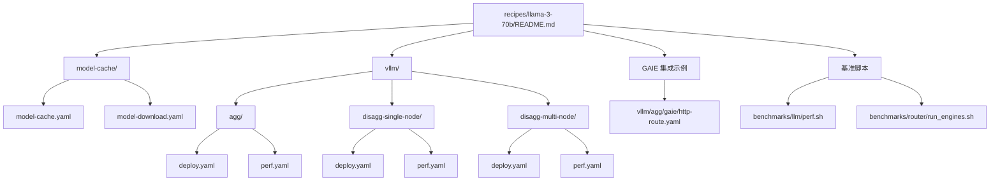
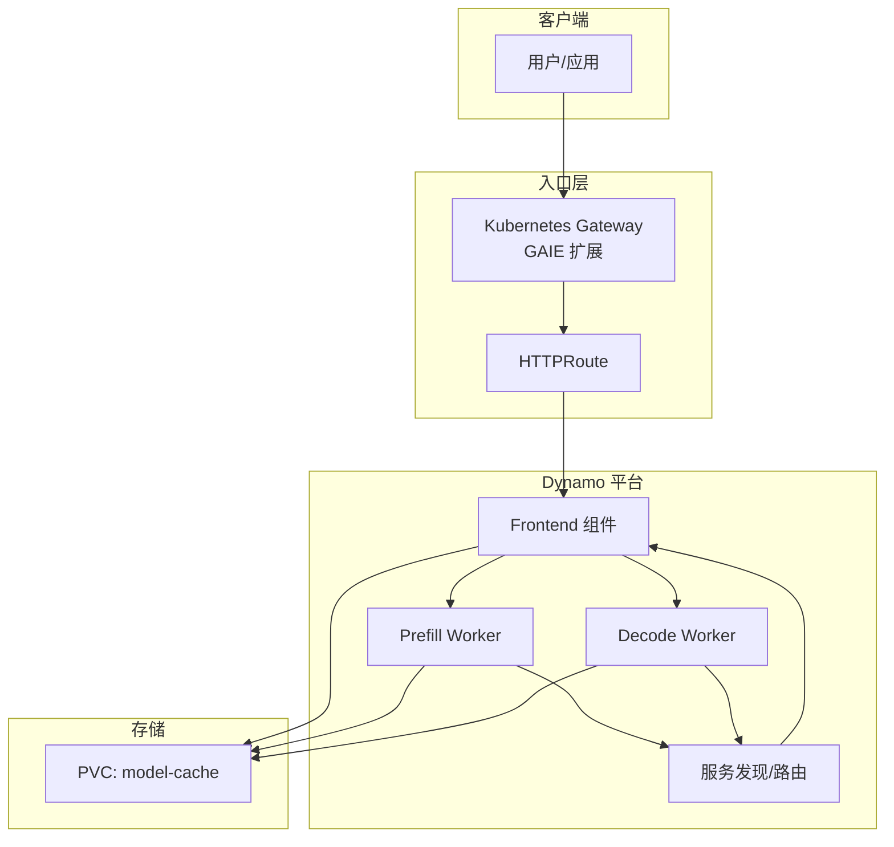
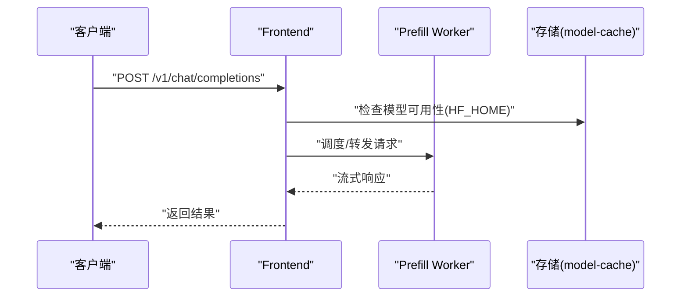
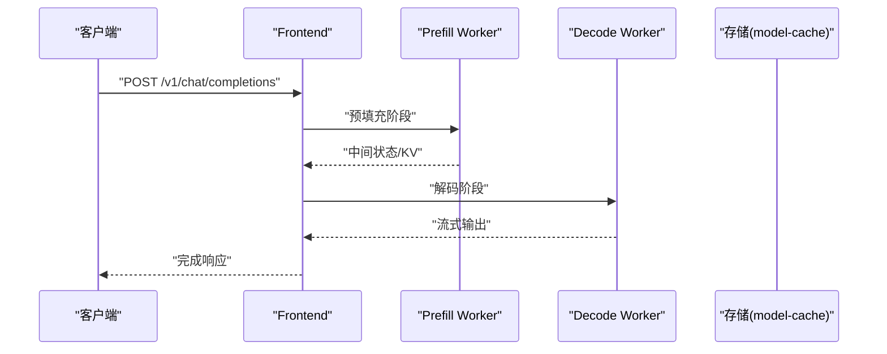
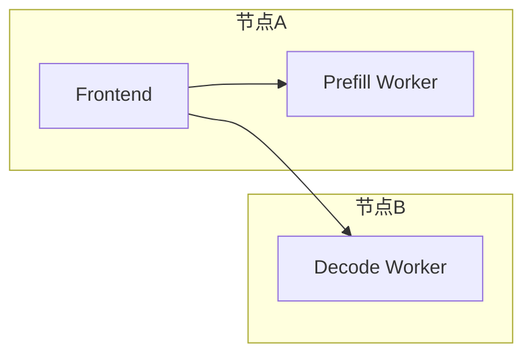
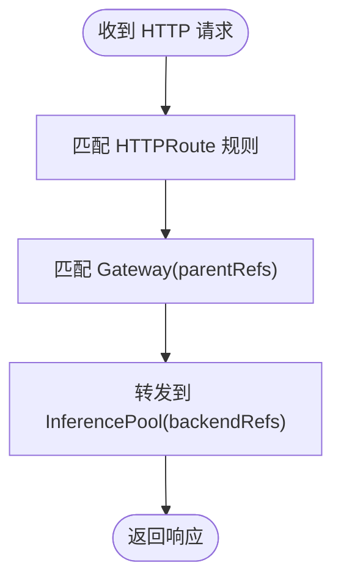
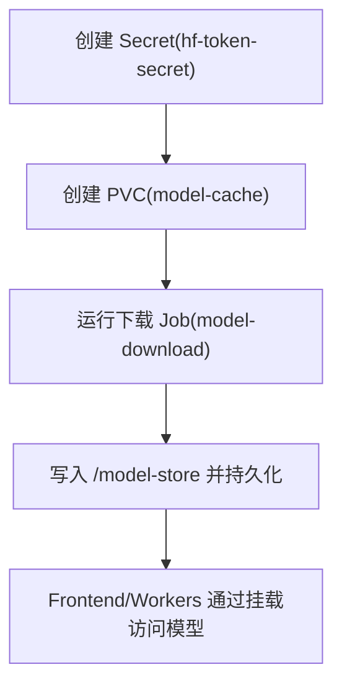
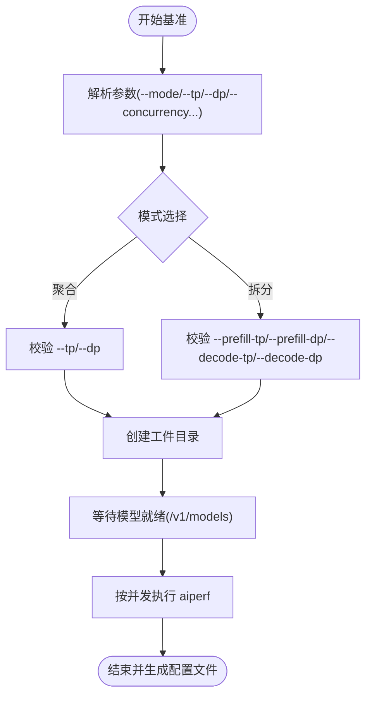
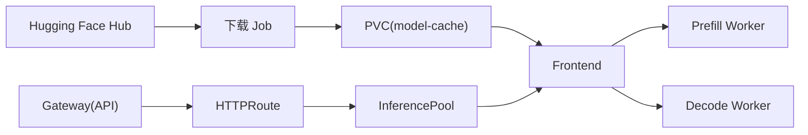

# LLaMA模型配方

<cite>
**本文引用的文件**
- [recipes/llama-3-70b/README.md](file://recipes/llama-3-70b/README.md)
- [recipes/llama-3-70b/model-cache/model-cache.yaml](file://recipes/llama-3-70b/model-cache/model-cache.yaml)
- [recipes/llama-3-70b/model-cache/model-download.yaml](file://recipes/llama-3-70b/model-cache/model-download.yaml)
- [recipes/llama-3-70b/vllm/agg/deploy.yaml](file://recipes/llama-3-70b/vllm/agg/deploy.yaml)
- [recipes/llama-3-70b/vllm/agg/gaie/http-route.yaml](file://recipes/llama-3-70b/vllm/agg/gaie/http-route.yaml)
- [recipes/llama-3-70b/vllm/disagg-single-node/deploy.yaml](file://recipes/llama-3-70b/vllm/disagg-single-node/deploy.yaml)
- [recipes/llama-3-70b/vllm/disagg-multi-node/deploy.yaml](file://recipes/lllama-3-70b/vllm/disagg-multi-node/deploy.yaml)
- [recipes/llama-3-70b/vllm/agg/perf.yaml](file://recipes/llama-3-70b/vllm/agg/perf.yaml)
- [recipes/llama-3-70b/vllm/disagg-single-node/perf.yaml](file://recipes/llama-3-70b/vllm/disagg-single-node/perf.yaml)
- [recipes/llama-3-70b/vllm/disagg-multi-node/perf.yaml](file://recipes/llama-3-70b/vllm/disagg-multi-node/perf.yaml)
- [benchmarks/llm/perf.sh](file://benchmarks/llm/perf.sh)
- [benchmarks/router/run_engines.sh](file://benchmarks/router/run_engines.sh)
- [deploy/inference-gateway/standalone/vllm_agg_qwen.yaml](file://deploy/inference-gateway/standalone/vllm_agg_qwen.yaml)
</cite>

## 目录
1. [简介](#简介)
2. [项目结构](#项目结构)
3. [核心组件](#核心组件)
4. [架构总览](#架构总览)
5. [详细组件分析](#详细组件分析)
6. [依赖关系分析](#依赖关系分析)
7. [性能考量](#性能考量)
8. [故障排查指南](#故障排查指南)
9. [结论](#结论)
10. [附录](#附录)

## 简介
本配方面向 Llama-3.3-70B-Instruct（FP8 动态量化）在生产环境中的部署与验证，覆盖单节点聚合部署、单节点拆分式部署（预填充/解码分离）、以及多节点拆分式部署三种模式；同时提供与 GAIE（Gateway API Inference Extension）的 HTTP 路由集成示例、模型缓存与下载配置（含 Hugging Face Hub 认证）、以及可复现实验的性能基准脚本与 YAML 配置。文档旨在帮助读者在 Kubernetes 环境中快速、一致地完成从模型准备到服务上线与性能评估的全流程。

## 项目结构
围绕 LLaMA-3-70B 的配方位于 recipes/llama-3-70b 目录下，按部署模式组织子目录，并配套性能基准脚本与 GAIE 路由配置示例。

图示来源
- [recipes/llama-3-70b/README.md](file://recipes/llama-3-70b/README.md#L1-L68)
- [recipes/llama-3-70b/model-cache/model-cache.yaml](file://recipes/llama-3-70b/model-cache/model-cache.yaml#L1-L13)
- [recipes/llama-3-70b/model-cache/model-download.yaml](file://recipes/llama-3-70b/model-cache/model-download.yaml#L1-L44)
- [recipes/llama-3-70b/vllm/agg/deploy.yaml](file://recipes/llama-3-70b/vllm/agg/deploy.yaml#L1-L55)
- [recipes/llama-3-70b/vllm/agg/perf.yaml](file://recipes/llama-3-70b/vllm/agg/perf.yaml#L1-L146)
- [recipes/llama-3-70b/vllm/disagg-single-node/deploy.yaml](file://recipes/llama-3-70b/vllm/disagg-single-node/deploy.yaml#L1-L111)
- [recipes/llama-3-70b/vllm/disagg-single-node/perf.yaml](file://recipes/llama-3-70b/vllm/disagg-single-node/perf.yaml#L1-L146)
- [recipes/llama-3-70b/vllm/disagg-multi-node/deploy.yaml](file://recipes/llama-3-70b/vllm/disagg-multi-node/deploy.yaml#L1-L87)
- [recipes/llama-3-70b/vllm/disagg-multi-node/perf.yaml](file://recipes/llama-3-70b/vllm/disagg-multi-node/perf.yaml#L1-L146)
- [recipes/llama-3-70b/vllm/agg/gaie/http-route.yaml](file://recipes/llama-3-70b/vllm/agg/gaie/http-route.yaml#L1-L41)
- [benchmarks/llm/perf.sh](file://benchmarks/llm/perf.sh#L1-L271)
- [benchmarks/router/run_engines.sh](file://benchmarks/router/run_engines.sh#L1-L273)

章节来源
- [recipes/llama-3-70b/README.md](file://recipes/llama-3-70b/README.md#L1-L68)

## 核心组件
- 模型缓存与下载：通过 PVC 声明与下载 Job 实现模型持久化与加速拉取，支持 Hugging Face Hub 认证与 hf_transfer 加速。
- VLLM 引擎组件：前端（Frontend）与工作进程（Prefill/Decode Worker），分别承担请求接入与推理执行。
- GAIE 集成：通过 HTTPRoute 将网关流量路由至后端 InferencePool，实现基于 Gateway API 的推理扩展。
- 性能基准：提供统一的 Bash 脚本与 K8s Job 配置，支持并发、序列长度、并行度等参数化测试。

章节来源
- [recipes/llama-3-70b/model-cache/model-cache.yaml](file://recipes/llama-3-70b/model-cache/model-cache.yaml#L1-L13)
- [recipes/llama-3-70b/model-cache/model-download.yaml](file://recipes/llama-3-70b/model-cache/model-download.yaml#L1-L44)
- [recipes/llama-3-70b/vllm/agg/deploy.yaml](file://recipes/llama-3-70b/vllm/agg/deploy.yaml#L1-L55)
- [recipes/llama-3-70b/vllm/disagg-single-node/deploy.yaml](file://recipes/llama-3-70b/vllm/disagg-single-node/deploy.yaml#L1-L111)
- [recipes/llama-3-70b/vllm/disagg-multi-node/deploy.yaml](file://recipes/llama-3-70b/vllm/disagg-multi-node/deploy.yaml#L1-L87)
- [recipes/llama-3-70b/vllm/agg/gaie/http-route.yaml](file://recipes/llama-3-70b/vllm/agg/gaie/http-route.yaml#L1-L41)
- [benchmarks/llm/perf.sh](file://benchmarks/llm/perf.sh#L1-L271)
- [benchmarks/router/run_engines.sh](file://benchmarks/router/run_engines.sh#L1-L273)

## 架构总览
下图展示了三种部署模式的系统交互：前端负责接收请求与模型就绪探测，工作进程执行推理；GAIE 通过 HTTPRoute 将外部流量转发至 InferencePool。

图示来源
- [recipes/llama-3-70b/vllm/agg/deploy.yaml](file://recipes/llama-3-70b/vllm/agg/deploy.yaml#L1-L55)
- [recipes/llama-3-70b/vllm/disagg-single-node/deploy.yaml](file://recipes/llama-3-70b/vllm/disagg-single-node/deploy.yaml#L1-L111)
- [recipes/llama-3-70b/vllm/disagg-multi-node/deploy.yaml](file://recipes/llama-3-70b/vllm/disagg-multi-node/deploy.yaml#L1-L87)
- [recipes/llama-3-70b/vllm/agg/gaie/http-route.yaml](file://recipes/llama-3-70b/vllm/agg/gaie/http-route.yaml#L1-L41)
- [recipes/llama-3-70b/model-cache/model-cache.yaml](file://recipes/llama-3-70b/model-cache/model-cache.yaml#L1-L13)

## 详细组件分析

### 单节点聚合部署（Aggregated）
- 组件构成：Frontend + 1 个 VLLM Prefill Worker（TP=4），共享内存与模型挂载点。
- 关键参数：张量并行大小、GPU 内存利用率、块大小、禁用前缀缓存等。
- 测试方式：K8s Job 运行 aiperf，按每 GPU 并发数与总 GPU 数计算总并发，记录指标与工件。

图示来源
- [recipes/llama-3-70b/vllm/agg/deploy.yaml](file://recipes/llama-3-70b/vllm/agg/deploy.yaml#L1-L55)
- [recipes/llama-3-70b/vllm/agg/perf.yaml](file://recipes/llama-3-70b/vllm/agg/perf.yaml#L1-L146)

章节来源
- [recipes/llama-3-70b/vllm/agg/deploy.yaml](file://recipes/llama-3-70b/vllm/agg/deploy.yaml#L1-L55)
- [recipes/llama-3-70b/vllm/agg/perf.yaml](file://recipes/llama-3-70b/vllm/agg/perf.yaml#L1-L146)

### 单节点拆分式部署（Disaggregated, 单机）
- 组件构成：Frontend + 多个 Prefill Worker（TP=2, DP=1）+ 1 个 Decode Worker（TP=4, DP=1），强调跨组件亲和与共享内存。
- 关键参数：Prefill/Decode 分离、拓扑亲和、块大小、禁用前缀缓存。
- 测试方式：K8s Job 运行 aiperf，总并发 = 每 GPU 并发 × GPU 总数（8）。

图示来源
- [recipes/llama-3-70b/vllm/disagg-single-node/deploy.yaml](file://recipes/llama-3-70b/vllm/disagg-single-node/deploy.yaml#L1-L111)
- [recipes/llama-3-70b/vllm/disagg-single-node/perf.yaml](file://recipes/llama-3-70b/vllm/disagg-single-node/perf.yaml#L1-L146)

章节来源
- [recipes/llama-3-70b/vllm/disagg-single-node/deploy.yaml](file://recipes/llama-3-70b/vllm/disagg-single-node/deploy.yaml#L1-L111)
- [recipes/llama-3-70b/vllm/disagg-single-node/perf.yaml](file://recipes/llama-3-70b/vllm/disagg-single-node/perf.yaml#L1-L146)

### 多节点拆分式部署（Disaggregated, 多机）
- 组件构成：Frontend + 1 个 Prefill Worker（TP=8, DP=1）+ 1 个 Decode Worker（TP=8, DP=1），跨节点分布。
- 关键参数：跨节点 GPU 利用、块大小、禁用前缀缓存。
- 测试方式：K8s Job 运行 aiperf，总并发 = 每 GPU 并发 × GPU 总数（16）。

图示来源
- [recipes/llama-3-70b/vllm/disagg-multi-node/deploy.yaml](file://recipes/llama-3-70b/vllm/disagg-multi-node/deploy.yaml#L1-L87)
- [recipes/llama-3-70b/vllm/disagg-multi-node/perf.yaml](file://recipes/llama-3-70b/vllm/disagg-multi-node/perf.yaml#L1-L146)

章节来源
- [recipes/llama-3-70b/vllm/disagg-multi-node/deploy.yaml](file://recipes/llama-3-70b/vllm/disagg-multi-node/deploy.yaml#L1-L87)
- [recipes/llama-3-70b/vllm/disagg-multi-node/perf.yaml](file://recipes/llama-3-70b/vllm/disagg-multi-node/perf.yaml#L1-L146)

### GAIE 集成与 HTTP 路由
- 通过 HTTPRoute 将网关流量转发至 InferencePool，parentRefs 指向 Gateway，backendRefs 指向对应池。
- 支持超时控制与路径前缀匹配，便于多模型/多版本共存场景。

图示来源
- [recipes/llama-3-70b/vllm/agg/gaie/http-route.yaml](file://recipes/llama-3-70b/vllm/agg/gaie/http-route.yaml#L1-L41)

章节来源
- [recipes/llama-3-70b/vllm/agg/gaie/http-route.yaml](file://recipes/llama-3-70b/vllm/agg/gaie/http-route.yaml#L1-L41)
- [deploy/inference-gateway/standalone/vllm_agg_qwen.yaml](file://deploy/inference-gateway/standalone/vllm_agg_qwen.yaml#L1-L18)

### 模型缓存与下载配置
- PVC：声明 ReadWriteMany 存储，容量与存储类需根据集群能力调整。
- 下载 Job：使用 Python 基础镜像，安装 huggingface_hub 与 hf_transfer，通过 Secret 注入 HF_TOKEN，下载指定模型与版本到 /model-store 并持久化到 PVC。

图示来源
- [recipes/llama-3-70b/model-cache/model-cache.yaml](file://recipes/llama-3-70b/model-cache/model-cache.yaml#L1-L13)
- [recipes/llama-3-70b/model-cache/model-download.yaml](file://recipes/llama-3-70b/model-cache/model-download.yaml#L1-L44)

章节来源
- [recipes/llama-3-70b/model-cache/model-cache.yaml](file://recipes/llama-3-70b/model-cache/model-cache.yaml#L1-L13)
- [recipes/llama-3-70b/model-cache/model-download.yaml](file://recipes/llama-3-70b/model-cache/model-download.yaml#L1-L44)

### 性能基准测试
- 统一脚本：支持聚合与拆分两种模式，参数化张量/数据并行度、输入/输出序列长度、并发列表、目标 URL、部署类型标签等。
- Job 配置：内置 aiperf 安装与系统调优（端口范围、连接限制），等待模型就绪后按总并发执行评测，生成工件目录与输入配置 JSON。

图示来源
- [benchmarks/llm/perf.sh](file://benchmarks/llm/perf.sh#L1-L271)
- [benchmarks/router/run_engines.sh](file://benchmarks/router/run_engines.sh#L1-L273)
- [recipes/llama-3-70b/vllm/agg/perf.yaml](file://recipes/llama-3-70b/vllm/agg/perf.yaml#L1-L146)
- [recipes/llama-3-70b/vllm/disagg-single-node/perf.yaml](file://recipes/llama-3-70b/vllm/disagg-single-node/perf.yaml#L1-L146)
- [recipes/llama-3-70b/vllm/disagg-multi-node/perf.yaml](file://recipes/llama-3-70b/vllm/disagg-multi-node/perf.yaml#L1-L146)

章节来源
- [benchmarks/llm/perf.sh](file://benchmarks/llm/perf.sh#L1-L271)
- [benchmarks/router/run_engines.sh](file://benchmarks/router/run_engines.sh#L1-L273)
- [recipes/llama-3-70b/vllm/agg/perf.yaml](file://recipes/llama-3-70b/vllm/agg/perf.yaml#L1-L146)
- [recipes/llama-3-70b/vllm/disagg-single-node/perf.yaml](file://recipes/llama-3-70b/vllm/disagg-single-node/perf.yaml#L1-L146)
- [recipes/llama-3-70b/vllm/disagg-multi-node/perf.yaml](file://recipes/llama-3-70b/vllm/disagg-multi-node/perf.yaml#L1-L146)

## 依赖关系分析
- 组件耦合：Frontend 与 Worker 之间通过内部通信与共享内存协同；GAIE 作为入口层，依赖 InferencePool 与平台路由。
- 外部依赖：Hugging Face Hub（认证与加速传输）、Kubernetes CRD（DynamoGraphDeployment）、Gateway API（HTTPRoute）。
- 潜在环路：当前配置以声明式为主，未见直接循环依赖；注意 PVC 与 Job 的生命周期顺序。

图示来源
- [recipes/llama-3-70b/model-cache/model-download.yaml](file://recipes/llama-3-70b/model-cache/model-download.yaml#L1-L44)
- [recipes/llama-3-70b/model-cache/model-cache.yaml](file://recipes/llama-3-70b/model-cache/model-cache.yaml#L1-L13)
- [recipes/llama-3-70b/vllm/agg/deploy.yaml](file://recipes/llama-3-70b/vllm/agg/deploy.yaml#L1-L55)
- [recipes/llama-3-70b/vllm/disagg-single-node/deploy.yaml](file://recipes/llama-3-70b/vllm/disagg-single-node/deploy.yaml#L1-L111)
- [recipes/llama-3-70b/vllm/disagg-multi-node/deploy.yaml](file://recipes/llama-3-70b/vllm/disagg-multi-node/deploy.yaml#L1-L87)
- [recipes/llama-3-70b/vllm/agg/gaie/http-route.yaml](file://recipes/llama-3-70b/vllm/agg/gaie/http-route.yaml#L1-L41)

章节来源
- [recipes/llama-3-70b/model-cache/model-download.yaml](file://recipes/llama-3-70b/model-cache/model-download.yaml#L1-L44)
- [recipes/llama-3-70b/model-cache/model-cache.yaml](file://recipes/llama-3-70b/model-cache/model-cache.yaml#L1-L13)
- [recipes/llama-3-70b/vllm/agg/deploy.yaml](file://recipes/llama-3-70b/vllm/agg/deploy.yaml#L1-L55)
- [recipes/llama-3-70b/vllm/disagg-single-node/deploy.yaml](file://recipes/llama-3-70b/vllm/disagg-single-node/deploy.yaml#L1-L111)
- [recipes/llama-3-70b/vllm/disagg-multi-node/deploy.yaml](file://recipes/llama-3-70b/vllm/disagg-multi-node/deploy.yaml#L1-L87)
- [recipes/llama-3-70b/vllm/agg/gaie/http-route.yaml](file://recipes/llama-3-70b/vllm/agg/gaie/http-route.yaml#L1-L41)

## 性能考量
- 并发与吞吐：Job 配置中以“每 GPU 并发数 × GPU 总数”计算总并发，建议结合网络栈与连接上限进行调优。
- 序列长度：ISL/OSL 对吞吐与延迟影响显著，脚本默认值适用于聊天场景，可根据业务调整。
- 并行度：聚合模式建议优先在单机内核数与显存允许范围内提升 TP；拆分模式建议保持 Prefill/Decode 的 TP 匹配与拓扑亲和。
- I/O 与缓存：禁用前缀缓存可简化一致性，但可能降低长上下文场景的重复利用效率；PVC 读写性能直接影响冷启动与热身时间。
- 端口与连接：脚本与 Job 中对本地端口范围与 HTTP 连接上限进行了设定，避免资源耗尽导致的排队与失败。

章节来源
- [benchmarks/llm/perf.sh](file://benchmarks/llm/perf.sh#L1-L271)
- [recipes/llama-3-70b/vllm/agg/perf.yaml](file://recipes/llama-3-70b/vllm/agg/perf.yaml#L1-L146)
- [recipes/llama-3-70b/vllm/disagg-single-node/perf.yaml](file://recipes/llama-3-70b/vllm/disagg-single-node/perf.yaml#L1-L146)
- [recipes/llama-3-70b/vllm/disagg-multi-node/perf.yaml](file://recipes/llama-3-70b/vllm/disagg-multi-node/perf.yaml#L1-L146)

## 故障排查指南
- 模型未就绪：Frontend 在启动后会轮询 /v1/models，若长时间不可用，请检查 PVC 是否正确挂载、下载 Job 是否完成、HF_TOKEN 是否注入成功。
- 认证失败：确认 Secret 名称与键名一致，且下载 Job 与引擎容器均可见该 Secret。
- 端口冲突或连接不足：参考脚本与 Job 中的端口范围与连接上限设置，必要时增大系统级限制。
- 拆分式部署亲和问题：单机拆分模式通过主机亲和减少跨 NIC 通信；多机拆分模式需确保网络连通与拓扑亲和策略生效。
- GAIE 路由不生效：检查 HTTPRoute 的 parentRefs 与 backendRefs 是否指向正确的 Gateway 与 InferencePool。

章节来源
- [recipes/llama-3-70b/model-cache/model-download.yaml](file://recipes/llama-3-70b/model-cache/model-download.yaml#L1-L44)
- [recipes/llama-3-70b/vllm/agg/deploy.yaml](file://recipes/llama-3-70b/vllm/agg/deploy.yaml#L1-L55)
- [recipes/llama-3-70b/vllm/disagg-single-node/deploy.yaml](file://recipes/llama-3-70b/vllm/disagg-single-node/deploy.yaml#L1-L111)
- [recipes/llama-3-70b/vllm/disagg-multi-node/deploy.yaml](file://recipes/llama-3-70b/vllm/disagg-multi-node/deploy.yaml#L1-L87)
- [recipes/llama-3-70b/vllm/agg/gaie/http-route.yaml](file://recipes/llama-3-70b/vllm/agg/gaie/http-route.yaml#L1-L41)

## 结论
本配方提供了 Llama-3.3-70B 在 Kubernetes 上的完整落地路径：从模型缓存与认证、到聚合与拆分式部署、再到 GAIE 路由与性能基准，形成可复现、可扩展的流水线。建议在生产环境中结合硬件规格与业务负载，对并行度、序列长度与网络参数进行迭代优化，并持续通过基准脚本与工件对比评估不同模式的性价比。

## 附录
- 快速开始命令与测试请求示例可参考配方根目录的 README。
- GAIE 示例中，HTTPRoute 的 parentRefs 与 backendRefs 字段需与集群实际资源一致。
- 基准脚本支持多种模式与参数组合，便于横向对比不同部署形态的性能表现。

章节来源
- [recipes/llama-3-70b/README.md](file://recipes/llama-3-70b/README.md#L19-L55)
- [recipes/llama-3-70b/vllm/agg/gaie/http-route.yaml](file://recipes/llama-3-70b/vllm/agg/gaie/http-route.yaml#L23-L34)