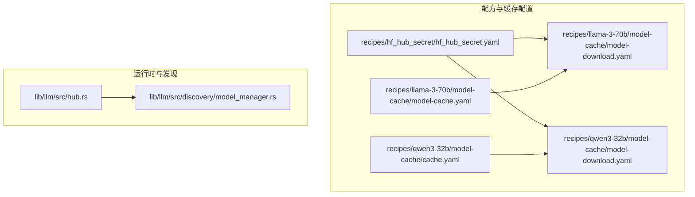
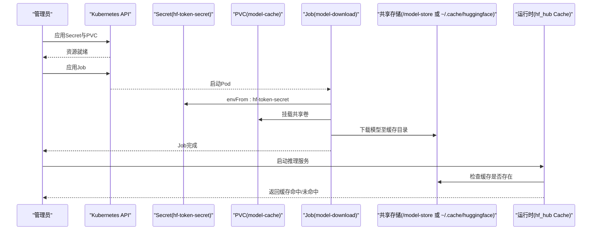
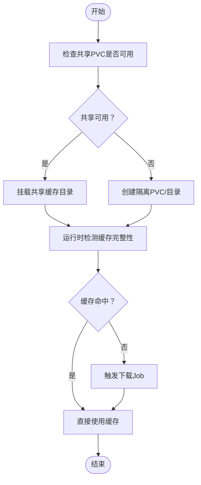
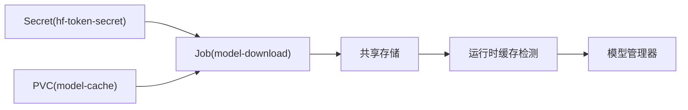

# 模型缓存管理

<cite>
**本文引用的文件**
- [recipes/hf_hub_secret/hf_hub_secret.yaml](file://recipes/hf_hub_secret/hf_hub_secret.yaml)
- [recipes/llama-3-70b/model-cache/model-cache.yaml](file://recipes/llama-3-70b/model-cache/model-cache.yaml)
- [recipes/llama-3-70b/model-cache/model-download.yaml](file://recipes/llama-3-70b/model-cache/model-download.yaml)
- [recipes/qwen3-32b/model-cache/model-download.yaml](file://recipes/qwen3-32b/model-cache/model-download.yaml)
- [recipes/qwen3-32b/model-cache/cache.yaml](file://recipes/qwen3-32b/model-cache/cache.yaml)
- [lib/llm/src/hub.rs](file://lib/llm/src/hub.rs)
- [lib/llm/src/discovery/model_manager.rs](file://lib/llm/src/discovery/model_manager.rs)
</cite>

## 目录
1. [简介](#简介)
2. [项目结构](#项目结构)
3. [核心组件](#核心组件)
4. [架构总览](#架构总览)
5. [详细组件分析](#详细组件分析)
6. [依赖关系分析](#依赖关系分析)
7. [性能考量](#性能考量)
8. [故障排查指南](#故障排查指南)
9. [结论](#结论)
10. [附录](#附录)

## 简介
本文件面向Dynamo平台的模型缓存管理，聚焦以下目标：
- Hugging Face Hub密钥的安全管理与挂载（Secret资源）
- 不同模型的缓存策略：模型下载、缓存路径、清理机制
- 多模型环境下的缓存共享与隔离策略
- 基于Kubernetes的配置示例与自动化脚本思路，保障模型缓存的高效管理与安全访问

## 项目结构
围绕模型缓存管理的关键文件主要分布在以下位置：
- recipes/<model>/model-cache：各模型的PVC与Job配置
- recipes/hf_hub_secret：Hugging Face Token的Secret定义
- lib/llm/src：模型缓存与发现逻辑（Rust实现）

图表来源
- [recipes/hf_hub_secret/hf_hub_secret.yaml](file://recipes/hf_hub_secret/hf_hub_secret.yaml#L1-L9)
- [recipes/llama-3-70b/model-cache/model-cache.yaml](file://recipes/llama-3-70b/model-cache/model-cache.yaml#L1-L13)
- [recipes/llama-3-70b/model-cache/model-download.yaml](file://recipes/llama-3-70b/model-cache/model-download.yaml#L1-L44)
- [recipes/qwen3-32b/model-cache/model-download.yaml](file://recipes/qwen3-32b/model-cache/model-download.yaml#L1-L45)
- [recipes/qwen3-32b/model-cache/cache.yaml](file://recipes/qwen3-32b/model-cache/cache.yaml#L1-L38)
- [lib/llm/src/hub.rs](file://lib/llm/src/hub.rs#L1-L34)
- [lib/llm/src/discovery/model_manager.rs](file://lib/llm/src/discovery/model_manager.rs#L74-L685)

章节来源
- [recipes/hf_hub_secret/hf_hub_secret.yaml](file://recipes/hf_hub_secret/hf_hub_secret.yaml#L1-L9)
- [recipes/llama-3-70b/model-cache/model-cache.yaml](file://recipes/llama-3-70b/model-cache/model-cache.yaml#L1-L13)
- [recipes/llama-3-70b/model-cache/model-download.yaml](file://recipes/llama-3-70b/model-cache/model-download.yaml#L1-L44)
- [recipes/qwen3-32b/model-cache/model-download.yaml](file://recipes/qwen3-32b/model-cache/model-download.yaml#L1-L45)
- [recipes/qwen3-32b/model-cache/cache.yaml](file://recipes/qwen3-32b/model-cache/cache.yaml#L1-L38)
- [lib/llm/src/hub.rs](file://lib/llm/src/hub.rs#L1-L34)
- [lib/llm/src/discovery/model_manager.rs](file://lib/llm/src/discovery/model_manager.rs#L74-L685)

## 核心组件
- Hugging Face Hub密钥管理
  - 使用Kubernetes Secret资源存储HF_TOKEN，并在下载Job中通过envFrom注入
- 模型缓存持久化
  - 通过ReadWriteMany的PVC提供共享存储，支持多副本/多节点复用缓存
- 模型下载与预热
  - 使用batch/v1 Job执行模型下载命令，挂载共享PVC作为缓存目录
- 运行时缓存检测
  - Rust侧使用hf_hub的Cache API检查本地缓存是否满足需求（权重/分词器文件）
- 模型发现与管理
  - 模型管理器维护引擎注册、校验和等信息，支撑多模型并行场景

章节来源
- [recipes/hf_hub_secret/hf_hub_secret.yaml](file://recipes/hf_hub_secret/hf_hub_secret.yaml#L1-L9)
- [recipes/llama-3-70b/model-cache/model-cache.yaml](file://recipes/llama-3-70b/model-cache/model-cache.yaml#L1-L13)
- [recipes/llama-3-70b/model-cache/model-download.yaml](file://recipes/llama-3-70b/model-cache/model-download.yaml#L1-L44)
- [recipes/qwen3-32b/model-cache/model-download.yaml](file://recipes/qwen3-32b/model-cache/model-download.yaml#L1-L45)
- [lib/llm/src/hub.rs](file://lib/llm/src/hub.rs#L1-L34)
- [lib/llm/src/discovery/model_manager.rs](file://lib/llm/src/discovery/model_manager.rs#L74-L685)

## 架构总览
下图展示了从Secret到PVC再到下载Job与运行时缓存检测的整体流程。

图表来源
- [recipes/hf_hub_secret/hf_hub_secret.yaml](file://recipes/hf_hub_secret/hf_hub_secret.yaml#L1-L9)
- [recipes/llama-3-70b/model-cache/model-cache.yaml](file://recipes/llama-3-70b/model-cache/model-cache.yaml#L1-L13)
- [recipes/llama-3-70b/model-cache/model-download.yaml](file://recipes/llama-3-70b/model-cache/model-download.yaml#L1-L44)
- [recipes/qwen3-32b/model-cache/model-download.yaml](file://recipes/qwen3-32b/model-cache/model-download.yaml#L1-L45)
- [lib/llm/src/hub.rs](file://lib/llm/src/hub.rs#L1-L34)

## 详细组件分析

### Hugging Face Hub密钥管理（Secret）
- Secret资源用于安全存放HF_TOKEN，避免硬编码在镜像或配置中
- 在下载Job中通过envFrom直接注入，供下载工具使用
- 建议：
  - 将Secret与PVC置于同一命名空间
  - 限制RBAC权限，仅授予必要的读取权限
  - 定期轮换Token并更新Secret

章节来源
- [recipes/hf_hub_secret/hf_hub_secret.yaml](file://recipes/hf_hub_secret/hf_hub_secret.yaml#L1-L9)

### 模型缓存持久化（PVC）
- 使用ReadWriteMany访问模式，允许多Pod同时读取
- 需要根据模型规模设置合适的存储容量与storageClassName
- 建议：
  - 为不同模型族/集群规划独立的PVC名称与命名空间隔离
  - 结合快照/备份策略，保障缓存数据可恢复

章节来源
- [recipes/llama-3-70b/model-cache/model-cache.yaml](file://recipes/llama-3-70b/model-cache/model-cache.yaml#L1-L13)
- [recipes/qwen3-32b/model-cache/cache.yaml](file://recipes/qwen3-32b/model-cache/cache.yaml#L1-L38)

### 模型下载与预热（Job）
- 通过batch/v1 Job拉起一次性任务，安装下载工具后执行下载命令
- 支持指定MODEL_NAME、MODEL_REVISION与HF_HOME等环境变量
- 缓存目录挂载至共享PVC，便于后续推理引擎复用
- 建议：
  - 设置合理的backoffLimit与重试策略
  - 对大模型采用并行传输优化参数
  - 下游引擎容器以只读方式挂载共享缓存目录，降低写放大风险

章节来源
- [recipes/llama-3-70b/model-cache/model-download.yaml](file://recipes/llama-3-70b/model-cache/model-download.yaml#L1-L44)
- [recipes/qwen3-32b/model-cache/model-download.yaml](file://recipes/qwen3-32b/model-cache/model-download.yaml#L1-L45)

### 运行时缓存检测（Rust）
- 使用hf_hub的Cache API检查缓存完整性（如config.json、tokenizer文件）
- 可区分仅分词器与完整权重两种场景，提升启动效率
- 建议：
  - 在启动阶段先进行缓存探测，避免重复下载
  - 对多版本模型，结合MODEL_REVISION进行精确匹配

章节来源
- [lib/llm/src/hub.rs](file://lib/llm/src/hub.rs#L1-L34)

### 模型发现与管理（Rust）
- 维护多种引擎类型与运行时配置，支持按模型名索引与校验和管理
- 为多模型并行与弹性扩缩容提供基础能力
- 建议：
  - 与缓存策略联动，确保引擎加载前缓存已就绪
  - 在多副本场景下，统一缓存路径与访问协议

章节来源
- [lib/llm/src/discovery/model_manager.rs](file://lib/llm/src/discovery/model_manager.rs#L74-L685)

### 多模型环境下的缓存共享与隔离
- 共享策略
  - 通过同一PVC挂载到不同容器，实现跨进程/跨Pod共享
  - 运行时缓存检测减少重复下载
- 隔离策略
  - 不同命名空间/租户使用独立PVC或子目录
  - 通过MODEL_NAME/MODEL_REVISION严格限定缓存版本
  - 为不同后端（如vLLM、TensorRT-LLM）准备独立缓存目录

图表来源
- [recipes/llama-3-70b/model-cache/model-cache.yaml](file://recipes/llama-3-70b/model-cache/model-cache.yaml#L1-L13)
- [recipes/llama-3-70b/model-cache/model-download.yaml](file://recipes/llama-3-70b/model-cache/model-download.yaml#L1-L44)
- [lib/llm/src/hub.rs](file://lib/llm/src/hub.rs#L1-L34)

## 依赖关系分析
- Secret与Job之间通过envFrom建立依赖，确保下载阶段具备认证凭据
- PVC与Job之间通过volumeMount建立依赖，确保下载结果持久化
- 运行时缓存检测依赖共享存储中的实际文件存在性
- 模型管理器依赖缓存一致性与版本控制

图表来源
- [recipes/hf_hub_secret/hf_hub_secret.yaml](file://recipes/hf_hub_secret/hf_hub_secret.yaml#L1-L9)
- [recipes/llama-3-70b/model-cache/model-cache.yaml](file://recipes/llama-3-70b/model-cache/model-cache.yaml#L1-L13)
- [recipes/llama-3-70b/model-cache/model-download.yaml](file://recipes/llama-3-70b/model-cache/model-download.yaml#L1-L44)
- [lib/llm/src/hub.rs](file://lib/llm/src/hub.rs#L1-L34)
- [lib/llm/src/discovery/model_manager.rs](file://lib/llm/src/discovery/model_manager.rs#L74-L685)

## 性能考量
- 传输优化
  - 启用并行传输工具以加速大模型下载
- 存储选择
  - 使用高性能ReadWriteMany存储类，缩短I/O瓶颈
- 缓存命中率
  - 通过运行时检测与固定MODEL_REVISION提升命中率
- 并发与隔离
  - 共享PVC提高利用率；隔离PVC降低争用与冲突

## 故障排查指南
- 认证失败
  - 检查Secret中的HF_TOKEN是否正确
  - 确认Job中envFrom是否引用了正确的Secret名称
- 缓存未命中
  - 确认共享PVC已成功挂载且路径一致
  - 检查运行时缓存检测逻辑是否能找到必需文件
- 下载失败
  - 查看Job日志与重试次数
  - 核对MODEL_NAME与MODEL_REVISION是否匹配
- 权限问题
  - 确保Pod对PVC具有正确的读写权限
  - 若为只读场景，确认挂载选项与访问模式匹配

章节来源
- [recipes/hf_hub_secret/hf_hub_secret.yaml](file://recipes/hf_hub_secret/hf_hub_secret.yaml#L1-L9)
- [recipes/llama-3-70b/model-cache/model-download.yaml](file://recipes/llama-3-70b/model-cache/model-download.yaml#L1-L44)
- [lib/llm/src/hub.rs](file://lib/llm/src/hub.rs#L1-L34)

## 结论
通过Secret+PVC+Job的组合，Dynamo实现了安全、可复用、可扩展的模型缓存体系。结合运行时缓存检测与模型管理器，可在多模型环境下实现高效的缓存共享与严格的版本隔离，满足生产级部署对性能与安全的要求。

## 附录
- 实际应用建议
  - 在部署前更新storageClassName并评估容量
  - 为不同模型族/集群规划独立的命名空间与PVC
  - 将下载Job纳入CI/CD流水线，实现缓存预热自动化
  - 对关键模型启用快照与备份策略，保障可回滚性