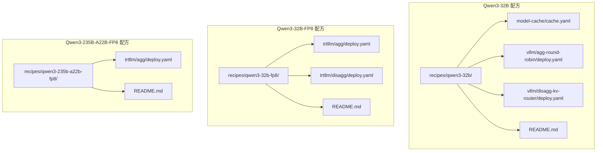
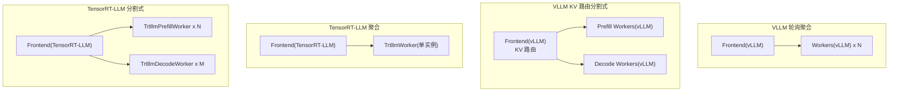
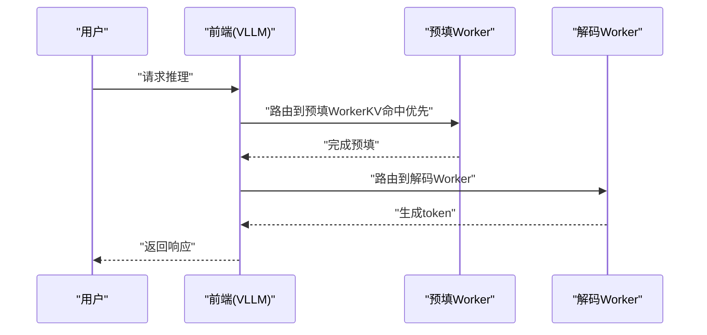
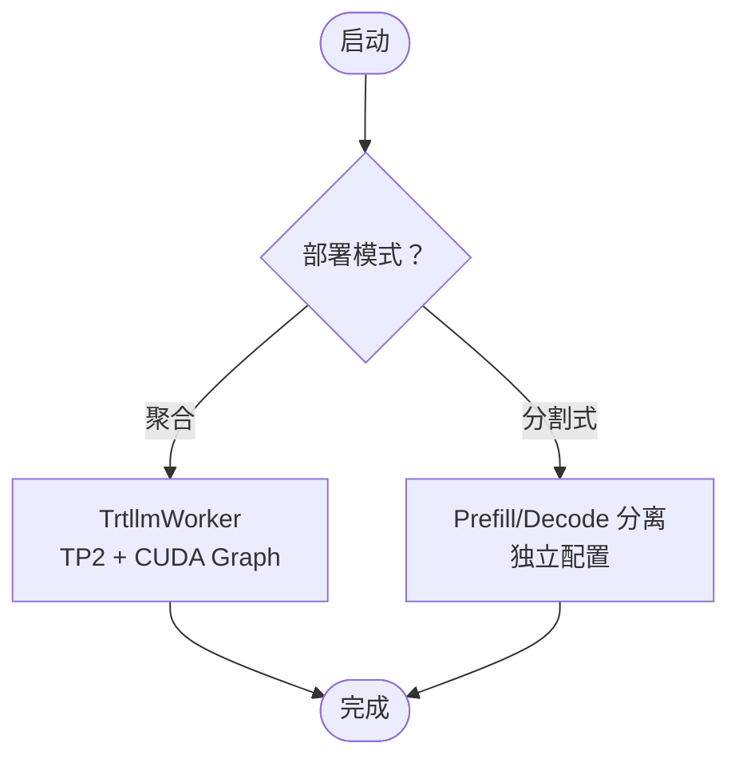
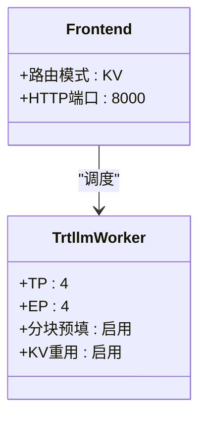
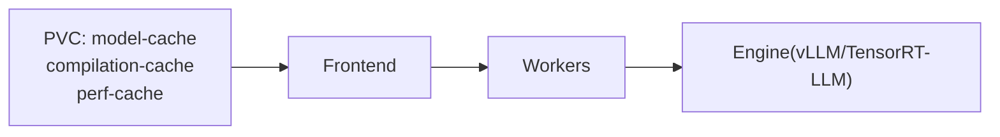
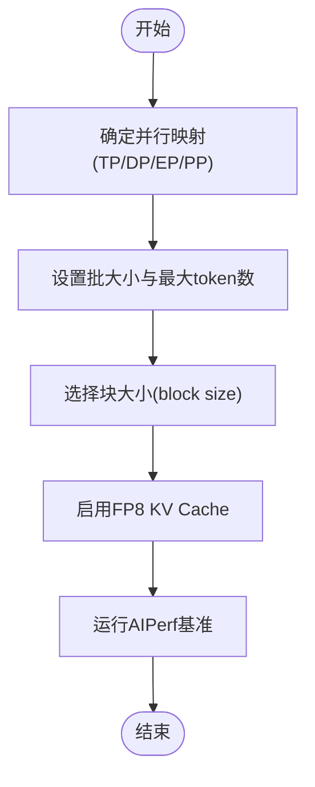

# 通义千问模型配方

<cite>
**本文引用的文件**
- [recipes/qwen3-32b/README.md](file://recipes/qwen3-32b/README.md)
- [recipes/qwen3-32b/model-cache/cache.yaml](file://recipes/qwen3-32b/model-cache/cache.yaml)
- [recipes/qwen3-32b/vllm/disagg-kv-router/deploy.yaml](file://recipes/qwen3-32b/vllm/disagg-kv-router/deploy.yaml)
- [recipes/qwen3-32b/vllm/agg-round-robin/deploy.yaml](file://recipes/qwen3-32b/vllm/agg-round-robin/deploy.yaml)
- [recipes/qwen3-32b-fp8/README.md](file://recipes/qwen3-32b-fp8/README.md)
- [recipes/qwen3-32b-fp8/trtllm/agg/deploy.yaml](file://recipes/qwen3-32b-fp8/trtllm/agg/deploy.yaml)
- [recipes/qwen3-32b-fp8/trtllm/disagg/deploy.yaml](file://recipes/qwen3-32b-fp8/trtllm/disagg/deploy.yaml)
- [recipes/qwen3-235b-a22b-fp8/README.md](file://recipes/qwen3-235b-a22b-fp8/README.md)
- [recipes/qwen3-235b-a22b-fp8/trtllm/agg/deploy.yaml](file://recipes/qwen3-235b-a22b-fp8/trtllm/agg/deploy.yaml)
- [benchmarks/llm/perf.sh](file://benchmarks/llm/perf.sh)
- [benchmarks/router/run_engines.sh](file://benchmarks/router/run_engines.sh)
- [docs/pages/performance/tuning.md](file://docs/pages/performance/tuning.md)
- [docs/pages/reference/support-matrix.md](file://docs/pages/reference/support-matrix.md)
- [examples/deployments/EKS/Deploy_VLLM_example.md](file://examples/deployments/EKS/Deploy_VLLM_example.md)
- [examples/backends/trtllm/engine_configs/README.md](file://examples/backends/trtllm/engine_configs/README.md)
</cite>

## 目录
1. [简介](#简介)
2. [项目结构](#项目结构)
3. [核心组件](#核心组件)
4. [架构总览](#架构总览)
5. [详细组件分析](#详细组件分析)
6. [依赖关系分析](#依赖关系分析)
7. [性能考量](#性能考量)
8. [故障排查指南](#故障排查指南)
9. [结论](#结论)
10. [附录](#附录)

## 简介
本配方面向通义千问系列模型（Qwen3-32B、Qwen3-32B-FP8、Qwen3-235B-A22B-FP8），提供基于 Dynamo 平台的部署与性能优化方案。内容覆盖：
- VLLM 与 TensorRT-LLM 引擎的部署选项：轮询聚合与 KV 路由器分割式部署
- 模型缓存策略与多精度格式（FP8）配置示例
- 不同部署模式下的性能基准测试方法与硬件要求
- 实际部署配置文件路径与性能优化建议，帮助用户选择最优部署方案

## 项目结构
本配方围绕 recipes 目录中的各模型配方展开，每个配方包含：
- 模型缓存 PVC 配置
- 前端与工作节点的 Kubernetes 部署清单
- 可选的性能基准脚本与测试流程

**图表来源**
- [recipes/qwen3-32b/README.md](file://recipes/qwen3-32b/README.md#L1-L157)
- [recipes/qwen3-32b/model-cache/cache.yaml](file://recipes/qwen3-32b/model-cache/cache.yaml#L1-L38)
- [recipes/qwen3-32b/vllm/agg-round-robin/deploy.yaml](file://recipes/qwen3-32b/vllm/agg-round-robin/deploy.yaml#L1-L82)
- [recipes/qwen3-32b/vllm/disagg-kv-router/deploy.yaml](file://recipes/qwen3-32b/vllm/disagg-kv-router/deploy.yaml#L1-L137)
- [recipes/qwen3-32b-fp8/README.md](file://recipes/qwen3-32b-fp8/README.md#L1-L67)
- [recipes/qwen3-32b-fp8/trtllm/agg/deploy.yaml](file://recipes/qwen3-32b-fp8/trtllm/agg/deploy.yaml#L1-L124)
- [recipes/qwen3-32b-fp8/trtllm/disagg/deploy.yaml](file://recipes/qwen3-32b-fp8/trtllm/disagg/deploy.yaml#L1-L343)
- [recipes/qwen3-235b-a22b-fp8/README.md](file://recipes/qwen3-235b-a22b-fp8/README.md#L1-L78)
- [recipes/qwen3-235b-a22b-fp8/trtllm/agg/deploy.yaml](file://recipes/qwen3-235b-a22b-fp8/trtllm/agg/deploy.yaml#L1-L114)

**章节来源**
- [recipes/qwen3-32b/README.md](file://recipes/qwen3-32b/README.md#L1-L157)
- [recipes/qwen3-32b-fp8/README.md](file://recipes/qwen3-32b-fp8/README.md#L1-L67)
- [recipes/qwen3-235b-a22b-fp8/README.md](file://recipes/qwen3-235b-a22b-fp8/README.md#L1-L78)

## 核心组件
- 模型缓存与编译缓存：通过 PVC 提供模型权重与编译产物共享存储，支持并发读取与复用，降低重复下载与编译开销。
- 前端服务：统一入口，负责路由与健康检查；在 VLLM 配置中可启用 KV 路由或轮询路由模式。
- 工作节点（Worker）：
  - VLLM：支持预填（prefill）与解码（decode）分离的分布式部署，以及轮询聚合部署。
  - TensorRT-LLM：支持聚合与分割式部署，分别针对预填与解码进行独立参数调优。

**章节来源**
- [recipes/qwen3-32b/model-cache/cache.yaml](file://recipes/qwen3-32b/model-cache/cache.yaml#L1-L38)
- [recipes/qwen3-32b/vllm/disagg-kv-router/deploy.yaml](file://recipes/qwen3-32b/vllm/disagg-kv-router/deploy.yaml#L14-L137)
- [recipes/qwen3-32b/vllm/agg-round-robin/deploy.yaml](file://recipes/qwen3-32b/vllm/agg-round-robin/deploy.yaml#L14-L82)
- [recipes/qwen3-32b-fp8/trtllm/agg/deploy.yaml](file://recipes/qwen3-32b-fp8/trtllm/agg/deploy.yaml#L35-L124)
- [recipes/qwen3-32b-fp8/trtllm/disagg/deploy.yaml](file://recipes/qwen3-32b-fp8/trtllm/disagg/deploy.yaml#L192-L343)
- [recipes/qwen3-235b-a22b-fp8/trtllm/agg/deploy.yaml](file://recipes/qwen3-235b-a22b-fp8/trtllm/agg/deploy.yaml#L28-L114)

## 架构总览
下图展示了三种典型部署模式的组件交互与数据流：

**图表来源**
- [recipes/qwen3-32b/vllm/agg-round-robin/deploy.yaml](file://recipes/qwen3-32b/vllm/agg-round-robin/deploy.yaml#L14-L82)
- [recipes/qwen3-32b/vllm/disagg-kv-router/deploy.yaml](file://recipes/qwen3-32b/vllm/disagg-kv-router/deploy.yaml#L14-L137)
- [recipes/qwen3-32b-fp8/trtllm/agg/deploy.yaml](file://recipes/qwen3-32b-fp8/trtllm/agg/deploy.yaml#L35-L124)
- [recipes/qwen3-32b-fp8/trtllm/disagg/deploy.yaml](file://recipes/qwen3-32b-fp8/trtllm/disagg/deploy.yaml#L192-L343)

## 详细组件分析

### Qwen3-32B：VLLM 轮询聚合 vs KV 路由分割式
- 轮询聚合（Round-Robin）
  - 组件：前端 + 多个解码 Worker（TP2）
  - 特点：简单易部署，适合通用场景
- KV 路由分割式（Prefill/Decode 分离 + KV 路由）
  - 组件：前端（KV 路由模式）+ 多个预填 Worker + 多个解码 Worker
  - 特点：利用长输入前缀共享，提升 TTFT 与 ITL 性能

**图表来源**
- [recipes/qwen3-32b/vllm/disagg-kv-router/deploy.yaml](file://recipes/qwen3-32b/vllm/disagg-kv-router/deploy.yaml#L14-L137)

**章节来源**
- [recipes/qwen3-32b/README.md](file://recipes/qwen3-32b/README.md#L10-L157)
- [recipes/qwen3-32b/vllm/agg-round-robin/deploy.yaml](file://recipes/qwen3-32b/vllm/agg-round-robin/deploy.yaml#L1-L82)
- [recipes/qwen3-32b/vllm/disagg-kv-router/deploy.yaml](file://recipes/qwen3-32b/vllm/disagg-kv-router/deploy.yaml#L1-L137)

### Qwen3-32B-FP8：TensorRT-LLM 聚合与分割式
- 聚合（Aggregated）
  - 组件：前端 + 单实例 TrtllmWorker（TP2）
  - 特点：CUDA Graph 加速，KV Cache 使用 FP8
- 分割式（Disaggregated）
  - 组件：前端 + 多实例 TrtllmPrefillWorker + 多实例 TrtllmDecodeWorker
  - 特点：预填与解码分离，独立参数调优

**图表来源**
- [recipes/qwen3-32b-fp8/trtllm/agg/deploy.yaml](file://recipes/qwen3-32b-fp8/trtllm/agg/deploy.yaml#L35-L124)
- [recipes/qwen3-32b-fp8/trtllm/disagg/deploy.yaml](file://recipes/qwen3-32b-fp8/trtllm/disagg/deploy.yaml#L192-L343)

**章节来源**
- [recipes/qwen3-32b-fp8/README.md](file://recipes/qwen3-32b-fp8/README.md#L1-L67)
- [recipes/qwen3-32b-fp8/trtllm/agg/deploy.yaml](file://recipes/qwen3-32b-fp8/trtllm/agg/deploy.yaml#L1-L124)
- [recipes/qwen3-32b-fp8/trtllm/disagg/deploy.yaml](file://recipes/qwen3-32b-fp8/trtllm/disagg/deploy.yaml#L1-L343)

### Qwen3-235B-A22B-FP8：TensorRT-LLM 聚合
- 聚合（Aggregated）
  - 组件：前端 + 多实例 TrtllmWorker（TP4×EP4，专家并行）
  - 特点：支持 MoE（22B 激活参数），启用分块预填与 KV 块重用

**图表来源**
- [recipes/qwen3-235b-a22b-fp8/trtllm/agg/deploy.yaml](file://recipes/qwen3-235b-a22b-fp8/trtllm/agg/deploy.yaml#L28-L114)

**章节来源**
- [recipes/qwen3-235b-a22b-fp8/README.md](file://recipes/qwen3-235b-a22b-fp8/README.md#L1-L78)
- [recipes/qwen3-235b-a22b-fp8/trtllm/agg/deploy.yaml](file://recipes/qwen3-235b-a22b-fp8/trtllm/agg/deploy.yaml#L1-L114)

## 依赖关系分析
- 存储依赖：所有配方均依赖 PVC（模型缓存、编译缓存、性能结果缓存），需根据集群环境调整 storageClassName。
- 引擎依赖：VLLM 与 TensorRT-LLM 的版本与 CUDA 兼容性由平台支持矩阵定义。
- 路由依赖：KV 路由需要前端与后端协同，确保 KV 块命中与状态管理一致。

**图表来源**
- [recipes/qwen3-32b/model-cache/cache.yaml](file://recipes/qwen3-32b/model-cache/cache.yaml#L1-L38)
- [recipes/qwen3-32b/vllm/disagg-kv-router/deploy.yaml](file://recipes/qwen3-32b/vllm/disagg-kv-router/deploy.yaml#L8-L137)
- [recipes/qwen3-32b-fp8/trtllm/agg/deploy.yaml](file://recipes/qwen3-32b-fp8/trtllm/agg/deploy.yaml#L41-L124)

**章节来源**
- [docs/pages/reference/support-matrix.md](file://docs/pages/reference/support-matrix.md#L1-L178)

## 性能考量
- 引擎配置与调优
  - 并行映射：密集模型通常采用“节点内 TP、跨节点 PP”组合；MoE 模型采用 TP×EP×(可选 PP)。
  - 批大小与最大 token 数：预填引擎偏好小批量大 max_num_tokens；解码引擎偏好大批量中等 max_num_tokens。
  - 块大小（block size）：适中块大小有利于前缀缓存命中与内存碎片控制。
- 分割式路由
  - 预填引擎：以最小饱和批大小运行，降低 TTFT。
  - 解码引擎：通过最大批大小与最大 token 控制中间张量尺寸与 ITL。
- 缓存策略
  - FP8 KV Cache：在保证精度的前提下显著降低显存占用。
  - 分块预填：在支持的框架中提升吞吐与延迟权衡。
- 基准测试
  - 使用 AIPerf 在固定 ISL/OSL/并发条件下对比聚合与分割式部署的 TTFT、ITL、总延迟等指标。

**图表来源**
- [docs/pages/performance/tuning.md](file://docs/pages/performance/tuning.md#L19-L137)
- [benchmarks/llm/perf.sh](file://benchmarks/llm/perf.sh#L1-L271)

**章节来源**
- [docs/pages/performance/tuning.md](file://docs/pages/performance/tuning.md#L1-L137)
- [benchmarks/llm/perf.sh](file://benchmarks/llm/perf.sh#L1-L271)

## 故障排查指南
- 命名空间与 Secret
  - 确保已创建命名空间与 HuggingFace 访问令牌 Secret，并在部署清单中正确引用。
- PVC 与存储类
  - 更新 model-cache.yaml 中的 storageClassName，使其匹配集群可用的存储类。
- 健康检查与日志
  - 前端与工作节点可通过日志与健康检查接口定位问题；必要时开启更详细的日志级别。
- 基准测试执行
  - 使用 run_engines.sh 或 perf.sh 进行本地或集群内基准测试，记录部署配置与结果以便复现与对比。

**章节来源**
- [recipes/qwen3-32b/README.md](file://recipes/qwen3-32b/README.md#L41-L157)
- [benchmarks/router/run_engines.sh](file://benchmarks/router/run_engines.sh#L1-L273)
- [benchmarks/llm/perf.sh](file://benchmarks/llm/perf.sh#L1-L271)

## 结论
- 对于 Qwen3-32B：若存在大量长输入前缀共享，推荐使用 KV 路由分割式部署以获得更低 TTFT 与 ITL；若追求部署简化，轮询聚合亦可满足通用需求。
- 对于 Qwen3-32B-FP8：聚合部署可借助 CUDA Graph 与 FP8 KV Cache 获得良好吞吐；分割式部署则提供更精细的资源隔离与调度灵活性。
- 对于 Qwen3-235B-A22B-FP8：作为 MoE 大模型，建议采用聚合部署并启用分块预填与 KV 重用，以平衡吞吐与显存占用。

## 附录
- 快速开始参考
  - VLLM 示例部署与测试：参见 EKS 示例文档。
  - TensorRT-LLM 引擎配置说明：参见引擎配置目录说明。
- 硬件与软件兼容性
  - 请参考平台支持矩阵，确认后端版本、CUDA 与驱动要求、GPU 架构支持情况。

**章节来源**
- [examples/deployments/EKS/Deploy_VLLM_example.md](file://examples/deployments/EKS/Deploy_VLLM_example.md#L1-L48)
- [examples/backends/trtllm/engine_configs/README.md](file://examples/backends/trtllm/engine_configs/README.md#L1-L44)
- [docs/pages/reference/support-matrix.md](file://docs/pages/reference/support-matrix.md#L1-L178)