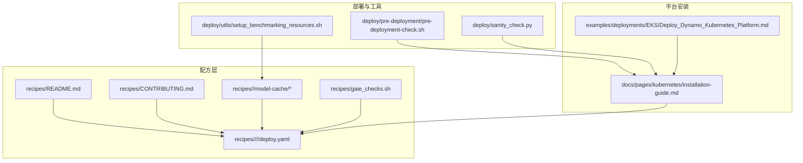
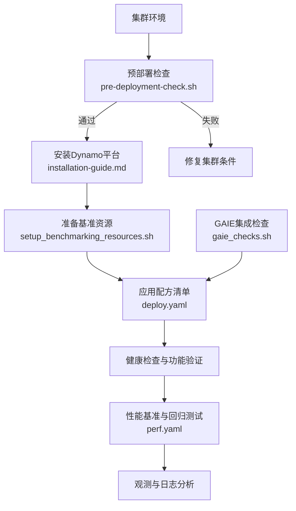
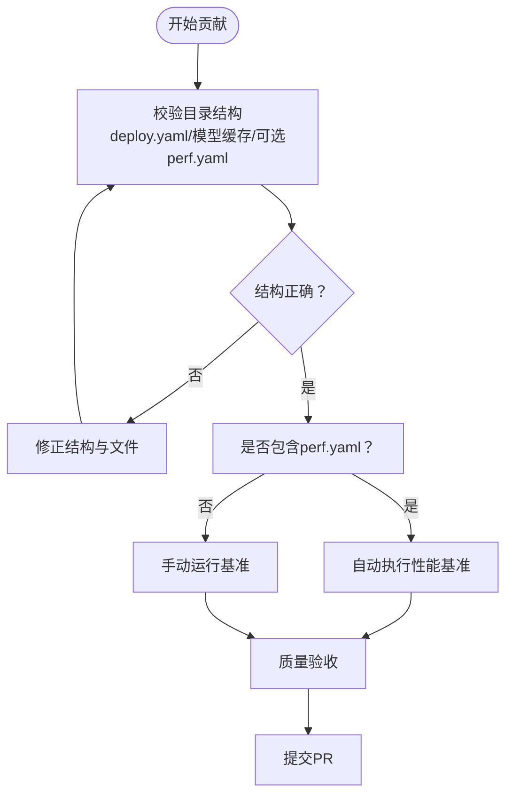
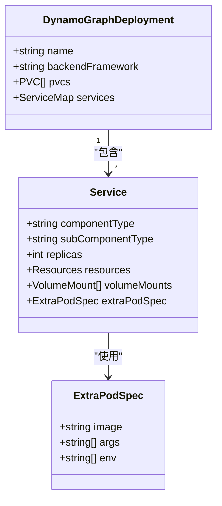
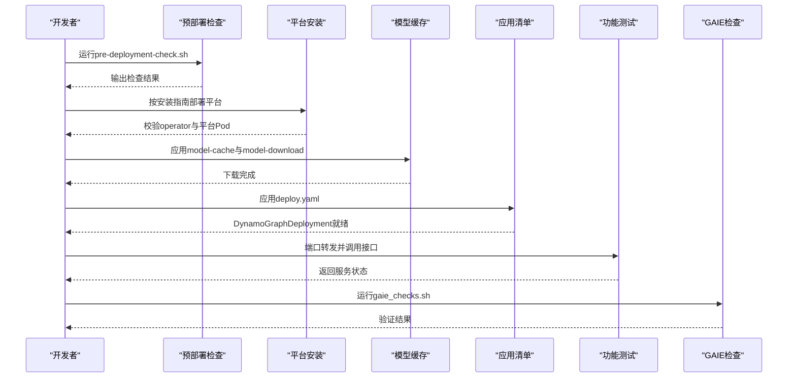
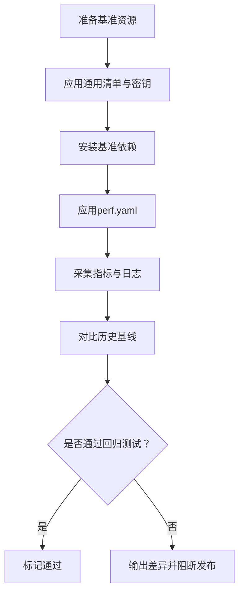

# 部署自动化

<cite>
**本文引用的文件**
- [recipes/README.md](file://recipes/README.md)
- [recipes/CONTRIBUTING.md](file://recipes/CONTRIBUTING.md)
- [recipes/gaie_checks.sh](file://recipes/gaie_checks.sh)
- [recipes/llama-3-70b/README.md](file://recipes/llama-3-70b/README.md)
- [recipes/llama-3-70b/vllm/agg/deploy.yaml](file://recipes/llama-3-70b/vllm/agg/deploy.yaml)
- [recipes/llama-3-70b/model-cache/model-cache.yaml](file://recipes/llama-3-70b/model-cache/model-cache.yaml)
- [recipes/deepseek-r1/sglang/disagg-16gpu/deploy.yaml](file://recipes/deepseek-r1/sglang/disagg-16gpu/deploy.yaml)
- [recipes/qwen3-32b/vllm/disagg-kv-router/deploy.yaml](file://recipes/qwen3-32b/vllm/disagg-kv-router/deploy.yaml)
- [deploy/sanity_check.py](file://deploy/sanity_check.py)
- [deploy/pre-deployment/pre-deployment-check.sh](file://deploy/pre-deployment/pre-deployment-check.sh)
- [deploy/utils/setup_benchmarking_resources.sh](file://deploy/utils/setup_benchmarking_resources.sh)
- [examples/deployments/EKS/Deploy_Dynamo_Kubernetes_Platform.md](file://examples/deployments/EKS/Deploy_Dynamo_Kubernetes_Platform.md)
- [docs/pages/kubernetes/installation-guide.md](file://docs/pages/kubernetes/installation-guide.md)
</cite>

## 目录
1. [简介](#简介)
2. [项目结构](#项目结构)
3. [核心组件](#核心组件)
4. [架构总览](#架构总览)
5. [详细组件分析](#详细组件分析)
6. [依赖关系分析](#依赖关系分析)
7. [性能与兼容性检查](#性能与兼容性检查)
8. [故障排查指南](#故障排查指南)
9. [结论](#结论)
10. [附录](#附录)

## 简介
本指南面向Dynamo配方的部署自动化，覆盖从配方贡献、质量检查到部署验证、性能回归与兼容性检查的全流程。内容包括：
- 配方贡献流程与质量标准
- 配方模板与命名规范
- 新配方创建与现有配方更新最佳实践
- 部署验证流程与自动化脚本
- 性能回归测试与兼容性检查自动化
- 版本管理与发布流程

## 项目结构
Dynamo的配方与部署自动化主要分布在以下目录：
- recipes：生产就绪的配方集合，包含模型缓存、后端框架、部署模式与可选性能基准
- deploy：平台安装、预部署检查、基准资源准备与诊断工具
- examples：示例部署与平台安装步骤
- docs：官方安装与运维文档

**图表来源**
- [recipes/README.md](file://recipes/README.md#L1-L321)
- [recipes/CONTRIBUTING.md](file://recipes/CONTRIBUTING.md#L1-L23)
- [recipes/gaie_checks.sh](file://recipes/gaie_checks.sh#L1-L88)
- [deploy/pre-deployment/pre-deployment-check.sh](file://deploy/pre-deployment/pre-deployment-check.sh#L1-L284)
- [deploy/sanity_check.py](file://deploy/sanity_check.py#L1-L3447)
- [deploy/utils/setup_benchmarking_resources.sh](file://deploy/utils/setup_benchmarking_resources.sh#L1-L107)
- [docs/pages/kubernetes/installation-guide.md](file://docs/pages/kubernetes/installation-guide.md#L1-L374)
- [examples/deployments/EKS/Deploy_Dynamo_Kubernetes_Platform.md](file://examples/deployments/EKS/Deploy_Dynamo_Kubernetes_Platform.md#L1-L97)

**章节来源**
- [recipes/README.md](file://recipes/README.md#L1-L321)
- [deploy/pre-deployment/pre-deployment-check.sh](file://deploy/pre-deployment/pre-deployment-check.sh#L1-L284)
- [docs/pages/kubernetes/installation-guide.md](file://docs/pages/kubernetes/installation-guide.md#L1-L374)

## 核心组件
- 配方模板与结构
  - 每个配方遵循统一目录结构：模型根目录下包含model-cache（模型缓存PVC与下载Job）、后端框架子目录（vllm/sglang/trtllm），以及部署模式子目录（agg/disagg等），内含deploy.yaml与可选perf.yaml。
  - 参考路径：[recipes/CONTRIBUTING.md](file://recipes/CONTRIBUTING.md#L3-L14)、[recipes/README.md](file://recipes/README.md#L46-L61)
- 预部署检查
  - 验证kubectl连通性、默认存储类、GPU节点与GPU Operator状态，确保集群满足Dynamo平台安装前提。
  - 参考脚本：[deploy/pre-deployment/pre-deployment-check.sh](file://deploy/pre-deployment/pre-deployment-check.sh#L1-L284)
- 平台安装与验证
  - 提供从源码构建与NGC制品两种安装路径，包含CRD安装、平台安装与验证步骤。
  - 参考文档：[docs/pages/kubernetes/installation-guide.md](file://docs/pages/kubernetes/installation-guide.md#L1-L374)、[examples/deployments/EKS/Deploy_Dynamo_Kubernetes_Platform.md](file://examples/deployments/EKS/Deploy_Dynamo_Kubernetes_Platform.md#L1-L97)
- 基准资源准备
  - 在目标命名空间中应用通用清单、创建HuggingFace令牌密钥、安装基准依赖，便于后续性能测试。
  - 参考脚本：[deploy/utils/setup_benchmarking_resources.sh](file://deploy/utils/setup_benchmarking_resources.sh#L1-L107)
- 部署诊断
  - 独立于Dynamo运行时的系统信息检查工具，用于预部署验证与问题定位。
  - 参考脚本：[deploy/sanity_check.py](file://deploy/sanity_check.py#L1-L3447)
- GAIE集成检查
  - 验证Gateway API CRD、GAIE CRD、Kgateway控制器状态与网关存在性，确保Inference Gateway集成可用。
  - 参考脚本：[recipes/gaie_checks.sh](file://recipes/gaie_checks.sh#L1-L88)

**章节来源**
- [recipes/CONTRIBUTING.md](file://recipes/CONTRIBUTING.md#L1-L23)
- [recipes/README.md](file://recipes/README.md#L46-L61)
- [deploy/pre-deployment/pre-deployment-check.sh](file://deploy/pre-deployment/pre-deployment-check.sh#L1-L284)
- [docs/pages/kubernetes/installation-guide.md](file://docs/pages/kubernetes/installation-guide.md#L1-L374)
- [examples/deployments/EKS/Deploy_Dynamo_Kubernetes_Platform.md](file://examples/deployments/EKS/Deploy_Dynamo_Kubernetes_Platform.md#L1-L97)
- [deploy/utils/setup_benchmarking_resources.sh](file://deploy/utils/setup_benchmarking_resources.sh#L1-L107)
- [deploy/sanity_check.py](file://deploy/sanity_check.py#L1-L3447)
- [recipes/gaie_checks.sh](file://recipes/gaie_checks.sh#L1-L88)

## 架构总览
Dynamo部署自动化由“平台安装—配方准备—部署执行—验证与基准—监控观测”构成闭环。

**图表来源**
- [deploy/pre-deployment/pre-deployment-check.sh](file://deploy/pre-deployment/pre-deployment-check.sh#L1-L284)
- [docs/pages/kubernetes/installation-guide.md](file://docs/pages/kubernetes/installation-guide.md#L1-L374)
- [deploy/utils/setup_benchmarking_resources.sh](file://deploy/utils/setup_benchmarking_resources.sh#L1-L107)
- [recipes/gaie_checks.sh](file://recipes/gaie_checks.sh#L1-L88)

## 详细组件分析

### 配方贡献流程与质量标准
- 贡献流程
  - 新增配方需遵循标准目录结构；脚本会校验目录与文件是否存在，缺失则报错。
  - 参考：[recipes/CONTRIBUTING.md](file://recipes/CONTRIBUTING.md#L16-L23)
- 质量标准
  - 必备项：完整的DynamoGraphDeployment清单、模型缓存PVC与下载Job、性能基准（perf.yaml）。
  - 参考：[recipes/README.md](file://recipes/README.md#L313-L321)

**图表来源**
- [recipes/CONTRIBUTING.md](file://recipes/CONTRIBUTING.md#L16-L23)
- [recipes/README.md](file://recipes/README.md#L313-L321)

**章节来源**
- [recipes/CONTRIBUTING.md](file://recipes/CONTRIBUTING.md#L1-L23)
- [recipes/README.md](file://recipes/README.md#L313-L321)

### 配方模板与命名规范
- 目录与文件规范
  - 模型根目录：<model>/
  - 模型缓存：model-cache/ 下的model-cache.yaml与model-download.yaml
  - 后端框架：vllm/、sglang/、trtllm/
  - 部署模式：agg、disagg、disagg-single-node、disagg-multi-node、disagg-kv-router等
  - 清单文件：deploy.yaml；可选性能基准：perf.yaml
  - 参考：[recipes/README.md](file://recipes/README.md#L46-L61)
- 示例清单字段要点
  - DynamoGraphDeployment元数据与后端类型
  - PVC挂载与镜像版本
  - Worker副本数与GPU资源限制
  - 参考示例：
    - [llama-3-70b/vllm/agg/deploy.yaml](file://recipes/llama-3-70b/vllm/agg/deploy.yaml#L1-L55)
    - [deepseek-r1/sglang/disagg-16gpu/deploy.yaml](file://recipes/deepseek-r1/sglang/disagg-16gpu/deploy.yaml#L1-L116)
    - [qwen3-32b/vllm/disagg-kv-router/deploy.yaml](file://recipes/qwen3-32b/vllm/disagg-kv-router/deploy.yaml#L1-L137)

**图表来源**
- [recipes/llama-3-70b/vllm/agg/deploy.yaml](file://recipes/llama-3-70b/vllm/agg/deploy.yaml#L1-L55)
- [recipes/deepseek-r1/sglang/disagg-16gpu/deploy.yaml](file://recipes/deepseek-r1/sglang/disagg-16gpu/deploy.yaml#L1-L116)
- [recipes/qwen3-32b/vllm/disagg-kv-router/deploy.yaml](file://recipes/qwen3-32b/vllm/disagg-kv-router/deploy.yaml#L1-L137)

**章节来源**
- [recipes/README.md](file://recipes/README.md#L46-L61)
- [recipes/llama-3-70b/vllm/agg/deploy.yaml](file://recipes/llama-3-70b/vllm/agg/deploy.yaml#L1-L55)
- [recipes/deepseek-r1/sglang/disagg-16gpu/deploy.yaml](file://recipes/deepseek-r1/sglang/disagg-16gpu/deploy.yaml#L1-L116)
- [recipes/qwen3-32b/vllm/disagg-kv-router/deploy.yaml](file://recipes/qwen3-32b/vllm/disagg-kv-router/deploy.yaml#L1-L137)

### 创建新配方与更新现有配方最佳实践
- 新建配方
  - 复制现有配方结构，按需调整后端与部署模式
  - 更新模型缓存PVC的storageClassName以匹配集群
  - 在deploy.yaml中设置镜像版本与资源配额
  - 如需性能基准，新增perf.yaml并纳入自动化执行
  - 参考：[recipes/README.md](file://recipes/README.md#L107-L174)
- 更新现有配方
  - 保持目录结构不变，仅修改deploy.yaml中的镜像标签、副本数或资源请求
  - 若涉及模型缓存策略变更，同步更新model-cache.yaml与model-download.yaml
  - 参考示例：
    - [llama-3-70b/README.md](file://recipes/llama-3-70b/README.md#L1-L68)
    - [llama-3-70b/model-cache/model-cache.yaml](file://recipes/llama-3-70b/model-cache/model-cache.yaml#L1-L13)

**章节来源**
- [recipes/README.md](file://recipes/README.md#L107-L174)
- [recipes/llama-3-70b/README.md](file://recipes/llama-3-70b/README.md#L1-L68)
- [recipes/llama-3-70b/model-cache/model-cache.yaml](file://recipes/llama-3-70b/model-cache/model-cache.yaml#L1-L13)

### 部署验证流程
- 平台安装与验证
  - 使用官方安装指南完成CRD与平台安装，并验证operator与基础组件状态
  - 参考：[docs/pages/kubernetes/installation-guide.md](file://docs/pages/kubernetes/installation-guide.md#L253-L262)
- 配置与部署
  - 准备模型缓存PVC与下载Job，等待下载完成
  - 应用deploy.yaml，等待DynamoGraphDeployment与相关Pod就绪
  - 参考：[recipes/README.md](file://recipes/README.md#L107-L141)
- 功能测试
  - 通过端口转发访问前端服务，调用/v1/models与/v1/chat/completions进行基本验证
  - 参考：[recipes/README.md](file://recipes/README.md#L143-L160)
- GAIE集成验证
  - 使用gaie_checks.sh检查Gateway API与GAIE CRD、Kgateway控制器状态及网关存在性
  - 参考：[recipes/gaie_checks.sh](file://recipes/gaie_checks.sh#L1-L88)

**图表来源**
- [deploy/pre-deployment/pre-deployment-check.sh](file://deploy/pre-deployment/pre-deployment-check.sh#L1-L284)
- [docs/pages/kubernetes/installation-guide.md](file://docs/pages/kubernetes/installation-guide.md#L253-L262)
- [recipes/README.md](file://recipes/README.md#L107-L160)
- [recipes/gaie_checks.sh](file://recipes/gaie_checks.sh#L1-L88)

**章节来源**
- [docs/pages/kubernetes/installation-guide.md](file://docs/pages/kubernetes/installation-guide.md#L253-L262)
- [recipes/README.md](file://recipes/README.md#L107-L160)
- [recipes/gaie_checks.sh](file://recipes/gaie_checks.sh#L1-L88)

### 性能回归测试与兼容性检查自动化
- 基准资源准备
  - 在目标命名空间中应用通用清单、创建HuggingFace令牌密钥、安装基准依赖
  - 参考：[deploy/utils/setup_benchmarking_resources.sh](file://deploy/utils/setup_benchmarking_resources.sh#L1-L107)
- 性能基准执行
  - 在配方目录中提供perf.yaml时，脚本会自动执行；否则需手动应用并观察日志
  - 参考：[recipes/README.md](file://recipes/README.md#L162-L173)
- 兼容性检查
  - 使用sanity_check.py在部署前进行系统与运行时组件的兼容性检查
  - 参考：[deploy/sanity_check.py](file://deploy/sanity_check.py#L1-L3447)

**图表来源**
- [deploy/utils/setup_benchmarking_resources.sh](file://deploy/utils/setup_benchmarking_resources.sh#L1-L107)
- [recipes/README.md](file://recipes/README.md#L162-L173)
- [deploy/sanity_check.py](file://deploy/sanity_check.py#L1-L3447)

**章节来源**
- [deploy/utils/setup_benchmarking_resources.sh](file://deploy/utils/setup_benchmarking_resources.sh#L1-L107)
- [recipes/README.md](file://recipes/README.md#L162-L173)
- [deploy/sanity_check.py](file://deploy/sanity_check.py#L1-L3447)

### 版本管理与发布流程
- 平台安装路径
  - 生产路径：使用NGC发布的Helm Chart，快速安装与升级
  - 自定义路径：从源码构建operator镜像并安装，适合开发与定制场景
  - 参考：[docs/pages/kubernetes/installation-guide.md](file://docs/pages/kubernetes/installation-guide.md#L121-L251)、[examples/deployments/EKS/Deploy_Dynamo_Kubernetes_Platform.md](file://examples/deployments/EKS/Deploy_Dynamo_Kubernetes_Platform.md#L1-L97)
- 发布建议
  - 使用稳定的Release版本进行生产部署
  - 开发分支采用自定义构建，配合严格的回归测试与兼容性检查
  - 参考：[docs/pages/kubernetes/installation-guide.md](file://docs/pages/kubernetes/installation-guide.md#L121-L195)

**章节来源**
- [docs/pages/kubernetes/installation-guide.md](file://docs/pages/kubernetes/installation-guide.md#L121-L195)
- [examples/deployments/EKS/Deploy_Dynamo_Kubernetes_Platform.md](file://examples/deployments/EKS/Deploy_Dynamo_Kubernetes_Platform.md#L1-L97)

## 依赖关系分析
- 组件耦合
  - 配方清单依赖Dynamo平台CRD与operator；平台安装依赖集群具备默认StorageClass与GPU Operator
  - 基准资源准备依赖已存在的Dynamo命名空间与平台组件
- 关键依赖链
  - 预部署检查 → 平台安装 → 基准资源准备 → 配方部署 → 功能与性能验证 → 观测与日志

**图表来源**
- [deploy/pre-deployment/pre-deployment-check.sh](file://deploy/pre-deployment/pre-deployment-check.sh#L1-L284)
- [docs/pages/kubernetes/installation-guide.md](file://docs/pages/kubernetes/installation-guide.md#L1-L374)
- [deploy/utils/setup_benchmarking_resources.sh](file://deploy/utils/setup_benchmarking_resources.sh#L1-L107)
- [recipes/README.md](file://recipes/README.md#L1-L321)

**章节来源**
- [deploy/pre-deployment/pre-deployment-check.sh](file://deploy/pre-deployment/pre-deployment-check.sh#L1-L284)
- [docs/pages/kubernetes/installation-guide.md](file://docs/pages/kubernetes/installation-guide.md#L1-L374)
- [deploy/utils/setup_benchmarking_resources.sh](file://deploy/utils/setup_benchmarking_resources.sh#L1-L107)
- [recipes/README.md](file://recipes/README.md#L1-L321)

## 性能与兼容性检查
- 性能回归
  - 使用perf.yaml与基准资源脚本自动化执行AIPerf基准，输出结果并对比历史基线
  - 参考：[recipes/README.md](file://recipes/README.md#L162-L173)、[deploy/utils/setup_benchmarking_resources.sh](file://deploy/utils/setup_benchmarking_resources.sh#L1-L107)
- 兼容性检查
  - 使用sanity_check.py进行系统与运行时组件的预部署验证，避免部署后出现环境不一致问题
  - 参考：[deploy/sanity_check.py](file://deploy/sanity_check.py#L1-L3447)

**章节来源**
- [recipes/README.md](file://recipes/README.md#L162-L173)
- [deploy/utils/setup_benchmarking_resources.sh](file://deploy/utils/setup_benchmarking_resources.sh#L1-L107)
- [deploy/sanity_check.py](file://deploy/sanity_check.py#L1-L3447)

## 故障排查指南
- 预部署常见问题
  - 缺少默认StorageClass或多默认类冲突：参考脚本输出提示配置或清理多余默认类
  - 无GPU节点或GPU Operator未运行：检查节点标签与Operator状态
  - 参考：[deploy/pre-deployment/pre-deployment-check.sh](file://deploy/pre-deployment/pre-deployment-check.sh#L61-L120)、[deploy/pre-deployment/pre-deployment-check.sh](file://deploy/pre-deployment/pre-deployment-check.sh#L143-L177)
- 平台安装问题
  - CRD已存在或命名空间受限：根据安装指南跳过CRD安装或添加命名空间限制标志
  - 参考：[docs/pages/kubernetes/installation-guide.md](file://docs/pages/kubernetes/installation-guide.md#L303-L320)
- 配置与部署问题
  - PVC未就绪或模型下载失败：确认storageClassName与HuggingFace令牌
  - 参考：[recipes/README.md](file://recipes/README.md#L107-L124)、[recipes/llama-3-70b/model-cache/model-cache.yaml](file://recipes/llama-3-70b/model-cache/model-cache.yaml#L1-L13)
- GAIE集成问题
  - CRD缺失或控制器未就绪：使用gaie_checks.sh逐项核对
  - 参考：[recipes/gaie_checks.sh](file://recipes/gaie_checks.sh#L41-L81)

**章节来源**
- [deploy/pre-deployment/pre-deployment-check.sh](file://deploy/pre-deployment/pre-deployment-check.sh#L61-L120)
- [deploy/pre-deployment/pre-deployment-check.sh](file://deploy/pre-deployment/pre-deployment-check.sh#L143-L177)
- [docs/pages/kubernetes/installation-guide.md](file://docs/pages/kubernetes/installation-guide.md#L303-L320)
- [recipes/README.md](file://recipes/README.md#L107-L124)
- [recipes/llama-3-70b/model-cache/model-cache.yaml](file://recipes/llama-3-70b/model-cache/model-cache.yaml#L1-L13)
- [recipes/gaie_checks.sh](file://recipes/gaie_checks.sh#L41-L81)

## 结论
通过标准化的配方结构、严格的预部署检查、完善的基准与兼容性验证，以及清晰的版本与发布流程，Dynamo配方的部署自动化实现了从贡献到上线的全链路可追溯与可复现。建议在团队内固化上述流程与脚本，结合CI/CD实现自动化触发与阻断，进一步提升交付效率与质量。

## 附录
- 快速参考
  - 预部署检查：[deploy/pre-deployment/pre-deployment-check.sh](file://deploy/pre-deployment/pre-deployment-check.sh#L1-L284)
  - 平台安装：[docs/pages/kubernetes/installation-guide.md](file://docs/pages/kubernetes/installation-guide.md#L1-L374)
  - 基准资源准备：[deploy/utils/setup_benchmarking_resources.sh](file://deploy/utils/setup_benchmarking_resources.sh#L1-L107)
  - 配方清单示例：
    - [llama-3-70b/vllm/agg/deploy.yaml](file://recipes/llama-3-70b/vllm/agg/deploy.yaml#L1-L55)
    - [deepseek-r1/sglang/disagg-16gpu/deploy.yaml](file://recipes/deepseek-r1/sglang/disagg-16gpu/deploy.yaml#L1-L116)
    - [qwen3-32b/vllm/disagg-kv-router/deploy.yaml](file://recipes/qwen3-32b/vllm/disagg-kv-router/deploy.yaml#L1-L137)
  - GAIE检查：[recipes/gaie_checks.sh](file://recipes/gaie_checks.sh#L1-L88)