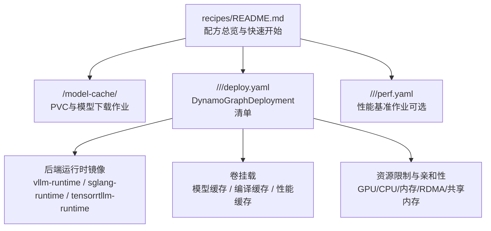
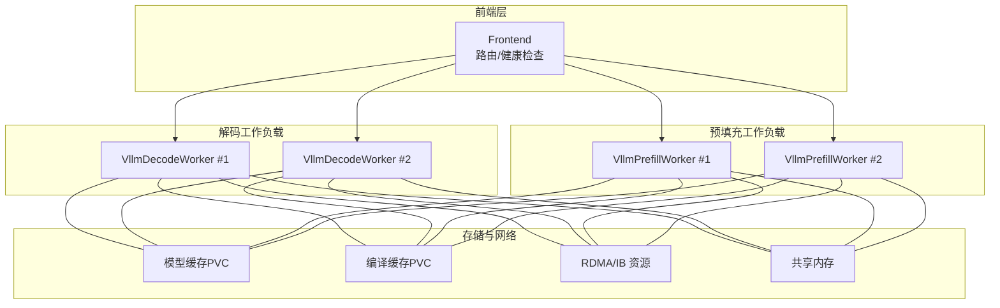
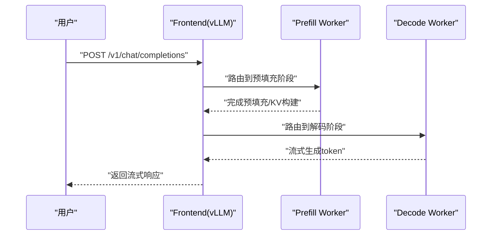
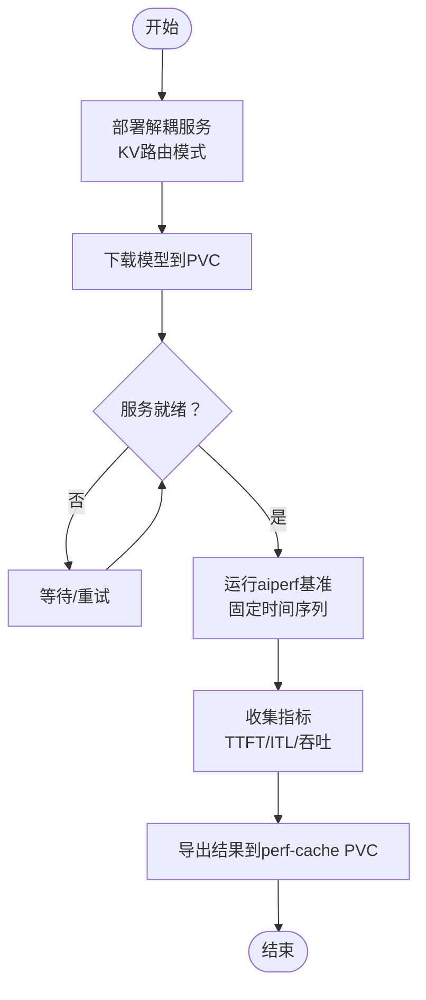
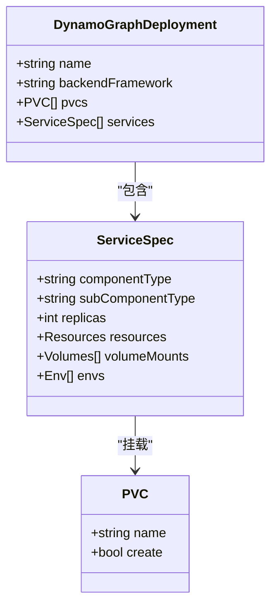
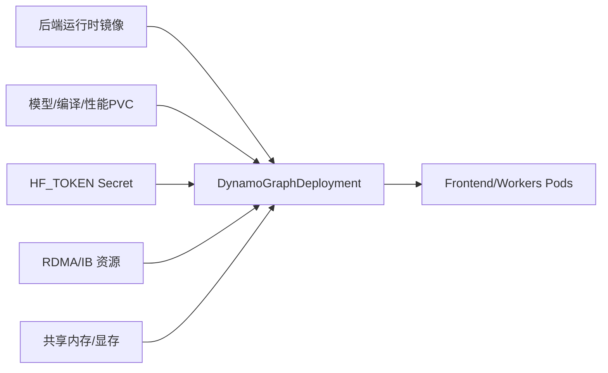

# 配方集合

<cite>
**本文引用的文件**
- [recipes/README.md](file://recipes/README.md)
- [recipes/CONTRIBUTING.md](file://recipes/CONTRIBUTING.md)
- [recipes/llama-3-70b/README.md](file://recipes/llama-3-70b/README.md)
- [recipes/qwen3-32b/README.md](file://recipes/qwen3-32b/README.md)
- [recipes/gpt-oss-120b/README.md](file://recipes/gpt-oss-120b/README.md)
- [recipes/deepseek-r1/README.md](file://recipes/deepseek-r1/README.md)
- [recipes/llama-3-70b/vllm/agg/deploy.yaml](file://recipes/llama-3-70b/vllm/agg/deploy.yaml)
- [recipes/qwen3-32b/vllm/disagg-kv-router/deploy.yaml](file://recipes/qwen3-32b/vllm/disagg-kv-router/deploy.yaml)
- [recipes/gpt-oss-120b/trtllm/agg/deploy.yaml](file://recipes/gpt-oss-120b/trtllm/agg/deploy.yaml)
- [recipes/deepseek-r1/trtllm/disagg/wide_ep/gb200/deploy.yaml](file://recipes/deepseek-r1/trtllm/disagg/wide_ep/gb200/deploy.yaml)
- [recipes/llama-3-70b/model-cache/model-cache.yaml](file://recipes/llama-3-70b/model-cache/model-cache.yaml)
- [recipes/qwen3-32b/model-cache/cache.yaml](file://recipes/qwen3-32b/model-cache/cache.yaml)
- [recipes/llama-3-70b/vllm/agg/perf.yaml](file://recipes/llama-3-70b/vllm/agg/perf.yaml)
- [recipes/qwen3-32b/vllm/disagg-kv-router/perf.yaml](file://recipes/qwen3-32b/vllm/disagg-kv-router/perf.yaml)
- [recipes/deepseek-r1/sglang/disagg-16gpu/deploy.yaml](file://recipes/deepseek-r1/sglang/disagg-16gpu/deploy.yaml)
- [recipes/qwen3-235b-a22b-fp8/trtllm/agg/deploy.yaml](file://recipes/qwen3-235b-a22b-fp8/trtllm/agg/deploy.yaml)
</cite>

## 目录
1. [简介](#简介)
2. [项目结构](#项目结构)
3. [核心组件](#核心组件)
4. [架构总览](#架构总览)
5. [详细组件分析](#详细组件分析)
6. [依赖关系分析](#依赖关系分析)
7. [性能与资源规划](#性能与资源规划)
8. [故障排查指南](#故障排查指南)
9. [结论](#结论)
10. [附录](#附录)

## 简介
本参考文档面向使用Dynamo平台进行大模型推理部署的工程团队，系统性整理了仓库中的“配方集合”，覆盖LLaMA、Qwen、GPT-OSS、DeepSeek等主流模型在vLLM、SGLang、TensorRT-LLM后端上的生产级部署配方。内容包括：
- 不同模型与场景的完整部署配方（聚合与解耦）
- 硬件与资源配置建议与预期性能
- 多规模模型的部署策略（中小规模到超大规模）
- 成本优化与资源利用率提升实践
- 多语言模型支持与本地化部署方法
- 基于业务需求的部署模式与参数选择指南
- 配方版本管理与升级路径
- 可复现的部署脚本与配置模板

## 项目结构
配方集合位于recipes目录，每个模型配方遵循统一结构：模型缓存PVC与下载作业、后端子目录（vllm/sglang/trtllm）、部署模式子目录（agg/disagg等），以及可选的性能基准作业。

图表来源
- [recipes/README.md](file://recipes/README.md#L46-L61)
- [recipes/llama-3-70b/vllm/agg/deploy.yaml](file://recipes/llama-3-70b/vllm/agg/deploy.yaml#L1-L55)
- [recipes/qwen3-32b/vllm/disagg-kv-router/deploy.yaml](file://recipes/qwen3-32b/vllm/disagg-kv-router/deploy.yaml#L1-L137)

章节来源
- [recipes/README.md](file://recipes/README.md#L46-L61)

## 核心组件
- DynamoGraphDeployment：定义前端、预填充/解码工作负载、卷与资源配额的Kubernetes自定义资源。
- 后端运行时容器镜像：vLLM/SGLang/TensorRT-LLM的Dynamo封装镜像，承载推理引擎与路由逻辑。
- 模型缓存与编译缓存：通过ReadWriteMany PVC持久化模型权重与编译产物，加速启动与降低重复计算。
- 性能基准作业：基于aiperf的自动化压测，输出吞吐、首Token时间、交互延迟等指标。

章节来源
- [recipes/llama-3-70b/vllm/agg/deploy.yaml](file://recipes/llama-3-70b/vllm/agg/deploy.yaml#L1-L55)
- [recipes/qwen3-32b/vllm/disagg-kv-router/deploy.yaml](file://recipes/qwen3-32b/vllm/disagg-kv-router/deploy.yaml#L1-L137)
- [recipes/llama-3-70b/vllm/agg/perf.yaml](file://recipes/llama-3-70b/vllm/agg/perf.yaml#L1-L146)
- [recipes/qwen3-32b/vllm/disagg-kv-router/perf.yaml](file://recipes/qwen3-32b/vllm/disagg-kv-router/perf.yaml#L1-L79)

## 架构总览
下图展示了典型vLLM聚合与解耦部署的组件交互：前端负责路由与健康检查；预填充/解码工作负载分离以降低长上下文干扰；模型与编译缓存通过PVC提供共享存储；RDMA/共享内存用于跨节点通信与高吞吐。

图表来源
- [recipes/qwen3-32b/vllm/disagg-kv-router/deploy.yaml](file://recipes/qwen3-32b/vllm/disagg-kv-router/deploy.yaml#L14-L137)

## 详细组件分析

### LLaMA-3-70B（vLLM 聚合）
- 部署形态：单节点聚合，TP4，FP8动态量化。
- 关键参数：张量并行大小、显存利用率、块大小、禁用前缀缓存等。
- 存储：模型缓存PVC，HF缓存目录映射。
- 测试：通过curl访问/v1/chat/completions进行连通性验证。

图表来源
- [recipes/llama-3-70b/vllm/agg/deploy.yaml](file://recipes/llama-3-70b/vllm/agg/deploy.yaml#L13-L55)

章节来源
- [recipes/llama-3-70b/README.md](file://recipes/llama-3-70b/README.md#L1-L68)
- [recipes/llama-3-70b/vllm/agg/deploy.yaml](file://recipes/llama-3-70b/vllm/agg/deploy.yaml#L1-L55)

### Qwen3-32B（vLLM 解耦 + KV感知路由）
- 部署形态：2节点，6个预填充+2个解码，KV感知路由，使用真实对话追踪数据进行对比实验。
- 关键参数：KV路由模式、异步调度、块大小、RoPE缩放参数、最大上下文长度。
- 存储：模型缓存与编译缓存双PVC，性能结果落盘至perf-cache PVC。
- 基准：tmux会话中运行aiperf，固定时间序列回放，关注TTFT、ITL与总请求延迟。

图表来源
- [recipes/qwen3-32b/vllm/disagg-kv-router/deploy.yaml](file://recipes/qwen3-32b/vllm/disagg-kv-router/deploy.yaml#L14-L137)
- [recipes/qwen3-32b/vllm/disagg-kv-router/perf.yaml](file://recipes/qwen3-32b/vllm/disagg-kv-router/perf.yaml#L1-L79)

章节来源
- [recipes/qwen3-32b/README.md](file://recipes/qwen3-32b/README.md#L1-L157)
- [recipes/qwen3-32b/vllm/disagg-kv-router/deploy.yaml](file://recipes/qwen3-32b/vllm/disagg-kv-router/deploy.yaml#L1-L137)
- [recipes/qwen3-32b/vllm/disagg-kv-router/perf.yaml](file://recipes/qwen3-32b/vllm/disagg-kv-router/perf.yaml#L1-L79)

### GPT-OSS-120B（TensorRT-LLM 聚合）
- 部署形态：Blackwell专用WideEP配置，TP4×EP4，MoE后端。
- 关键参数：注意力数据并行、CUDA图、KV缓存配置、PDL开关、权重加载策略。
- 存储：模型缓存PVC，HF缓存目录映射。
- 注意事项：容器镜像版本随Dynamo版本演进，需按发布说明更新。

章节来源
- [recipes/gpt-oss-120b/README.md](file://recipes/gpt-oss-120b/README.md#L1-L52)
- [recipes/gpt-oss-120b/trtllm/agg/deploy.yaml](file://recipes/gpt-oss-120b/trtllm/agg/deploy.yaml#L1-L110)

### DeepSeek-R1（多后端/多硬件）
- 配置矩阵：SGLang WideEP（单/多节点，TP=8/16）、TRT-LLM WideEP（GB200，8解码+1预填充）、vLLM DEP16（多节点）。
- 关键参数：MoE专家并行、WIDEEP/DEP混合并行、RDMA/共享内存、NCCL相关环境变量。
- 存储：SGLang使用model-download-sglang作业，其他后端使用通用model-download作业。
- 硬件：H200（141GB SXM）或GB200（NVL72）满足大显存需求。

图表来源
- [recipes/deepseek-r1/trtllm/disagg/wide_ep/gb200/deploy.yaml](file://recipes/deepseek-r1/trtllm/disagg/wide_ep/gb200/deploy.yaml#L101-L251)

章节来源
- [recipes/deepseek-r1/README.md](file://recipes/deepseek-r1/README.md#L1-L104)
- [recipes/deepseek-r1/sglang/disagg-16gpu/deploy.yaml](file://recipes/deepseek-r1/sglang/disagg-16gpu/deploy.yaml#L1-L116)
- [recipes/deepseek-r1/trtllm/disagg/wide_ep/gb200/deploy.yaml](file://recipes/deepseek-r1/trtllm/disagg/wide_ep/gb200/deploy.yaml#L1-L251)

## 依赖关系分析
- 镜像版本：各后端运行时镜像版本需与Dynamo平台版本兼容，升级时应核对镜像标签与平台发布说明。
- 存储类：PVC的storageClassName需与集群可用的存储类一致，否则Pod会处于Pending状态。
- 网络与资源：多节点部署需要RDMA/IB资源与高带宽网络；大模型需要充足的共享内存与GPU显存。
- 认证与缓存：HuggingFace令牌用于拉取私有/受限模型；HF缓存与编译缓存PVC提升启动速度与复用率。

图表来源
- [recipes/llama-3-70b/vllm/agg/deploy.yaml](file://recipes/llama-3-70b/vllm/agg/deploy.yaml#L1-L55)
- [recipes/qwen3-32b/vllm/disagg-kv-router/deploy.yaml](file://recipes/qwen3-32b/vllm/disagg-kv-router/deploy.yaml#L1-L137)

章节来源
- [recipes/llama-3-70b/model-cache/model-cache.yaml](file://recipes/llama-3-70b/model-cache/model-cache.yaml#L1-L13)
- [recipes/qwen3-32b/model-cache/cache.yaml](file://recipes/qwen3-32b/model-cache/cache.yaml#L1-L38)

## 性能与资源规划
- 小规模（单机/单节点）：优先聚合部署，简化拓扑；如需KV感知路由，可采用单节点解耦。
- 中规模（多节点单机架）：解耦部署，分离预填充与解码；启用KV感知路由；配置RDMA/共享内存。
- 超大规模（多机架/多节点）：使用MoE专家并行（WIDEEP/DEP），跨节点高带宽网络；合理设置NCCL参数与PVC启动探测阈值。
- 成本优化：通过KV缓存复用减少冗余预填充；利用编译缓存避免重复编译；按并发与GPU数动态扩缩容；选择合适量化（FP8）降低显存占用。
- 性能预期：KV感知路由显著降低TTFT；解耦部署隔离长上下文干扰，改善ITL；MoE模型需平衡TP/EP以获得最佳吞吐。

章节来源
- [recipes/qwen3-32b/README.md](file://recipes/qwen3-32b/README.md#L126-L141)
- [recipes/deepseek-r1/README.md](file://recipes/deepseek-r1/README.md#L74-L89)

## 故障排查指南
- Pod长时间Pending：检查GPU节点可用性、存储类是否存在、资源请求是否超过节点上限。
- 模型下载失败：确认HF_TOKEN正确、网络可达、Job日志无权限错误。
- 工作负载启动失败：核对驱动/CUDA版本、容器镜像标签、私有仓库拉取密钥；查看Pod事件与日志。
- NCCL/内存问题（尤其MoE）：适当降低静态内存占比、减少批大小或并行度；检查RDMA/共享内存配置。

章节来源
- [recipes/README.md](file://recipes/README.md#L272-L294)

## 结论
配方集合提供了从中小规模到超大规模的可复用部署蓝图，结合KV感知路由、解耦架构与MoE并行技术，可在保证低延迟的同时最大化资源利用率。建议在生产环境中：
- 先以聚合部署验证链路，再按场景切换解耦与KV路由；
- 使用编译缓存与模型缓存降低冷启动与IO开销；
- 依据业务流量特征（并发、输入长度、输出长度）选择合适的并行策略与量化方案；
- 严格遵循镜像版本与平台版本的兼容性要求，定期评估升级路径。

## 附录

### 快速开始（通用流程）
- 创建命名空间与HF_TOKEN Secret
- 更新模型缓存PVC的storageClassName
- 应用模型缓存与下载作业
- 应用后端部署清单
- 端口转发或通过网关访问服务
- 可选：应用性能基准作业并收集结果

章节来源
- [recipes/README.md](file://recipes/README.md#L107-L174)

### 配方质量标准与贡献指南
- 每个配方需包含：完整的DynamoGraphDeployment清单、模型缓存PVC与下载作业、可选的性能基准作业、目标硬件验证、GPU要求说明。
- 提交新配方需遵循标准目录结构，并通过运行脚本的结构校验。

章节来源
- [recipes/CONTRIBUTING.md](file://recipes/CONTRIBUTING.md#L1-L23)
- [recipes/README.md](file://recipes/README.md#L313-L321)

### 版本管理与升级指南
- 容器镜像版本：随Dynamo版本发布更新，升级前请核对后端运行时镜像标签与平台发布说明。
- 配置迁移：注意后端参数变更（如KV缓存、编译缓存、RDMA资源），必要时调整PVC与资源声明。
- 回滚策略：保留上一版deploy.yaml与perf.yaml，以便快速回退。

章节来源
- [recipes/gpt-oss-120b/README.md](file://recipes/gpt-oss-120b/README.md#L34-L47)