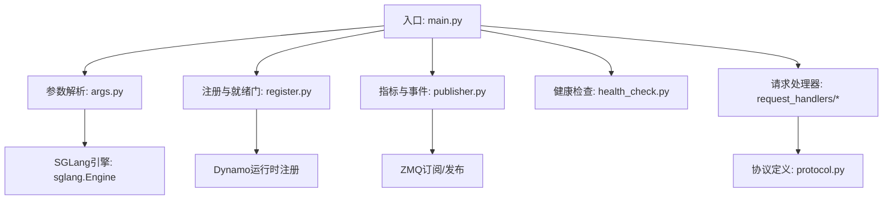
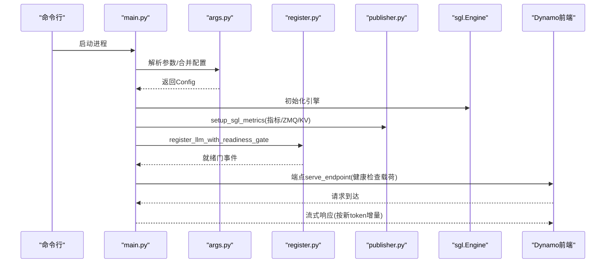
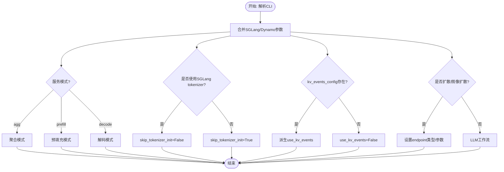
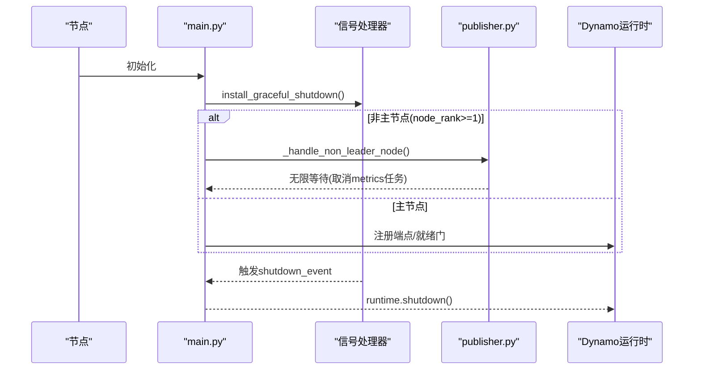
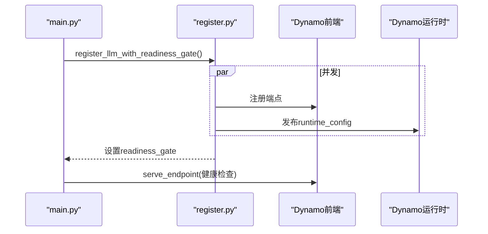
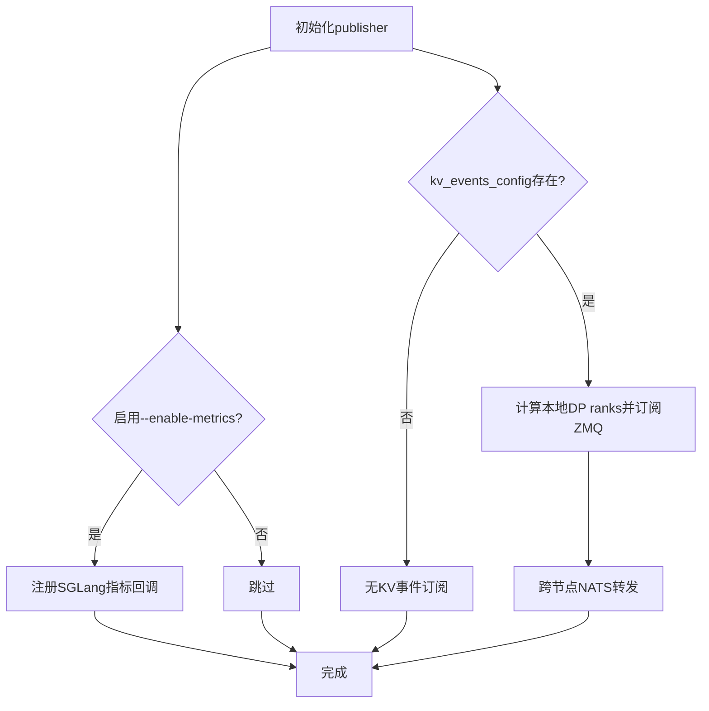
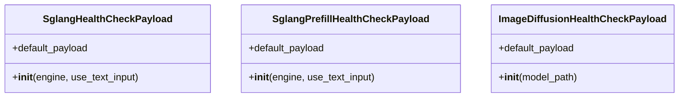
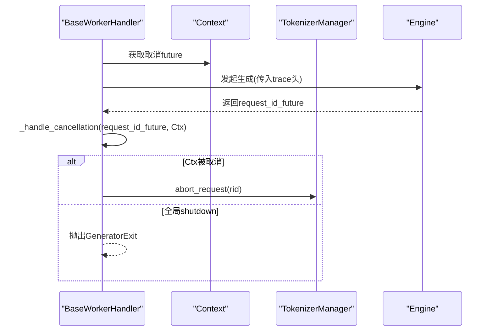
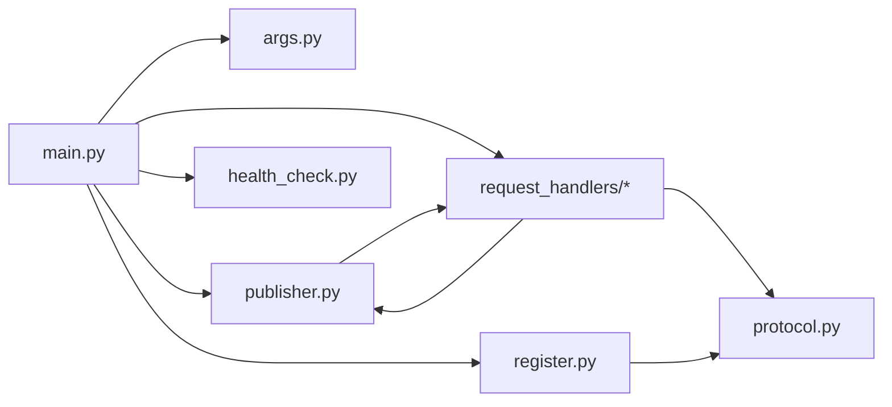

# SGLang后端引擎

<cite>
**本文档引用的文件**
- [components/src/dynamo/sglang/__init__.py](file://components/src/dynamo/sglang/__init__.py)
- [components/src/dynamo/sglang/main.py](file://components/src/dynamo/sglang/main.py)
- [components/src/dynamo/sglang/args.py](file://components/src/dynamo/sglang/args.py)
- [components/src/dynamo/sglang/protocol.py](file://components/src/dynamo/sglang/protocol.py)
- [components/src/dynamo/sglang/publisher.py](file://components/src/dynamo/sglang/publisher.py)
- [components/src/dynamo/sglang/register.py](file://components/src/dynamo/sglang/register.py)
- [components/src/dynamo/sglang/health_check.py](file://components/src/dynamo/sglang/health_check.py)
- [components/src/dynamo/sglang/request_handlers/__init__.py](file://components/src/dynamo/sglang/request_handlers/__init__.py)
- [components/src/dynamo/sglang/request_handlers/handler_base.py](file://components/src/dynamo/sglang/request_handlers/handler_base.py)
- [container/templates/sglang_runtime.Dockerfile](file://container/templates/sglang_runtime.Dockerfile)
</cite>

## 目录
1. [简介](#简介)
2. [项目结构](#项目结构)
3. [核心组件](#核心组件)
4. [架构总览](#架构总览)
5. [详细组件分析](#详细组件分析)
6. [依赖关系分析](#依赖关系分析)
7. [性能考虑](#性能考虑)
8. [故障排查指南](#故障排查指南)
9. [结论](#结论)
10. [附录](#附录)

## 简介
本文件系统化阐述SGLang作为Dynamo多后端之一的实现与使用方法，覆盖其在分布式推理中的定位、集成方式、参数配置、tokenizer行为、请求取消机制，以及在专家分布（EPLB）、图像扩散、条件分割等高级能力上的支持现状。同时提供安装、快速开始、部署选项与单节点/多节点示例，并解释SGLang特定参数处理机制与Dynamo兼容性，帮助用户从基础使用到高级配置完成全栈掌握。

## 项目结构
SGLang后端引擎位于components/src/dynamo/sglang目录下，采用“按功能域分层”的组织方式：
- 入口与运行时：main.py负责解析参数、初始化运行时、注册信号处理器、选择工作流（解码/预填充/扩散/嵌入/多模态）并启动服务。
- 参数解析：args.py定义Dynamo与SGLang参数合并策略、默认值、校验规则与自动推断逻辑。
- 协议与数据模型：protocol.py定义标准LLM协议、多模态协议与图像扩散协议类型。
- 指标与事件发布：publisher.py封装SGLang指标收集、ZMQ订阅、KV事件发布与跨节点传播。
- 注册与就绪门：register.py负责向Dynamo注册模型、生成运行时配置、设置就绪门以排队等待。
- 健康检查：health_check.py提供针对不同工作模式的健康检查载荷。
- 请求处理器：request_handlers子模块提供统一基类与具体处理器（解码、预填充、扩散、嵌入、多模态等）。
- 容器镜像：sglang_runtime.Dockerfile定义运行时镜像构建流程与依赖安装。

图表来源
- [components/src/dynamo/sglang/main.py](file://components/src/dynamo/sglang/main.py#L191-L233)
- [components/src/dynamo/sglang/args.py](file://components/src/dynamo/sglang/args.py#L308-L605)
- [components/src/dynamo/sglang/register.py](file://components/src/dynamo/sglang/register.py#L18-L67)
- [components/src/dynamo/sglang/publisher.py](file://components/src/dynamo/sglang/publisher.py#L332-L388)
- [components/src/dynamo/sglang/health_check.py](file://components/src/dynamo/sglang/health_check.py#L50-L146)
- [components/src/dynamo/sglang/request_handlers/__init__.py](file://components/src/dynamo/sglang/request_handlers/__init__.py#L1-L42)
- [components/src/dynamo/sglang/protocol.py](file://components/src/dynamo/sglang/protocol.py#L1-L177)

章节来源
- [components/src/dynamo/sglang/main.py](file://components/src/dynamo/sglang/main.py#L191-L233)
- [components/src/dynamo/sglang/args.py](file://components/src/dynamo/sglang/args.py#L308-L605)

## 核心组件
- 配置容器与参数解析
  - Config组合ServerArgs与DynamoArgs，自动推断服务模式（聚合/预填充/解码），并处理SGLang与Dynamo参数冲突与兼容。
  - 支持从嵌套YAML提取子段落、自动下载模型、强制启用SGLang的流式输出、根据是否使用SGLang tokenizer决定skip_tokenizer_init。
- 运行时初始化与多节点支持
  - worker()根据参数选择工作流，非主节点通过环境变量禁用阻塞，仅运行调度器与事件发布。
  - 提供优雅停机链路，捕获SIGTERM/SIGINT并串行执行延迟回调。
- 注册与就绪门
  - register_llm_with_readiness_gate并发启动端点与注册，使用readiness_gate协调队列与后续处理。
  - 对扩散模型提供专门注册流程。
- 指标与事件发布
  - setup_sgl_metrics创建指标发布端点、初始化组件级指标、启动ZMQ订阅与KV事件发布任务。
  - 多节点场景下仅订阅本地DP rank，跨节点由NATS转发。
- 健康检查
  - 提供解码、预填充、图像扩散三类健康检查载荷，自动从模型tokenizer提取BOS token ID。
- 请求处理器
  - BaseGenerativeHandler/BaseWorkerHandler提供通用基础设施（指标、KV发布、追踪头、内存占用释放/恢复、权重热更新、引擎路由注册）。
  - 具体处理器覆盖LLM解码/预填充、扩散、嵌入、多模态编码/解码/处理器等。

章节来源
- [components/src/dynamo/sglang/args.py](file://components/src/dynamo/sglang/args.py#L201-L232)
- [components/src/dynamo/sglang/main.py](file://components/src/dynamo/sglang/main.py#L235-L328)
- [components/src/dynamo/sglang/register.py](file://components/src/dynamo/sglang/register.py#L18-L67)
- [components/src/dynamo/sglang/publisher.py](file://components/src/dynamo/sglang/publisher.py#L332-L388)
- [components/src/dynamo/sglang/health_check.py](file://components/src/dynamo/sglang/health_check.py#L50-L146)
- [components/src/dynamo/sglang/request_handlers/handler_base.py](file://components/src/dynamo/sglang/request_handlers/handler_base.py#L21-L72)

## 架构总览
SGLang后端在Dynamo中扮演“分布式推理引擎”角色，通过以下关键路径实现：
- 参数解析与模型准备：args.py负责SGLang与Dynamo参数合并、模板与tokenizer策略、模型下载与服务模式推断。
- 引擎初始化与就绪门：main.py创建sgl.Engine，setup_sgl_metrics建立指标/ZMQ/KV事件通道，register_llm_with_readiness_gate注册模型并开启端点。
- 多节点与DP注意力：publisher.py在多节点下仅订阅本地DP rank，结合NATS实现跨节点事件转发；非主节点仅运行调度器与事件发布。
- 请求生命周期：BaseWorkerHandler在生成过程中注入追踪头、管理内存占用、响应权重热更新、通过Cancellation Monitor处理请求取消与优雅停机。

图表来源
- [components/src/dynamo/sglang/main.py](file://components/src/dynamo/sglang/main.py#L235-L328)
- [components/src/dynamo/sglang/args.py](file://components/src/dynamo/sglang/args.py#L308-L605)
- [components/src/dynamo/sglang/register.py](file://components/src/dynamo/sglang/register.py#L234-L275)
- [components/src/dynamo/sglang/publisher.py](file://components/src/dynamo/sglang/publisher.py#L332-L388)

## 详细组件分析

### 参数解析与配置容器
- 关键特性
  - 自动推断服务模式：根据SGLang的disaggregation_mode映射到AGG/PREFILL/DECODE。
  - tokenizer策略：--use-sglang-tokenizer与Dynamo预处理器互斥；强制启用SGLang流式输出。
  - 端点自动推断：根据工作模式与组件类型自动选择默认端点（backend/generate、prefill/generate、processor/generate等）。
  - 扩散语言模型（DLLM）与图像扩散：检测dllm_algorithm与--image-diffusion-worker，自动调整ServerArgs与端点类型。
  - KV事件与本地索引器：从kv_events_config派生use_kv_events，并据此控制enable_local_indexer。
- 兼容性要点
  - 与SGLang版本差异：通过ConfigArgumentMerger适配不同版本的API签名。
  - 模型下载：若model_path不存在，调用fetch_llm进行下载（注意路径一致性与共享存储）。

图表来源
- [components/src/dynamo/sglang/args.py](file://components/src/dynamo/sglang/args.py#L308-L605)

章节来源
- [components/src/dynamo/sglang/args.py](file://components/src/dynamo/sglang/args.py#L308-L605)

### 运行时初始化与多节点支持
- 非主节点处理
  - 设置SGLANG_BLOCK_NONZERO_RANK_CHILDREN=0，避免阻塞；仅运行metrics与KV事件发布，不直接处理请求。
- 优雅停机
  - install_graceful_shutdown捕获SIGTERM/SIGINT，链式执行延迟回调，确保runtime.shutdown()与资源清理。
- 预填充预热
  - 领导节点在预填充工作流中执行dummy warmup以避免首次TTFT。

图表来源
- [components/src/dynamo/sglang/main.py](file://components/src/dynamo/sglang/main.py#L53-L87)
- [components/src/dynamo/sglang/main.py](file://components/src/dynamo/sglang/main.py#L92-L188)

章节来源
- [components/src/dynamo/sglang/main.py](file://components/src/dynamo/sglang/main.py#L53-L87)
- [components/src/dynamo/sglang/main.py](file://components/src/dynamo/sglang/main.py#L92-L188)

### 注册与就绪门
- LLM注册
  - _register_llm_with_runtime_config根据tokenizer策略调整输入/输出类型；可选自定义Jinja模板路径。
  - _get_runtime_config提取推理配置（推理器/批处理限制、KV块数、本地索引器开关、Bootstrap端点等）。
- 扩散模型注册
  - register_image_diffusion_model针对文本输入与图像输出进行注册。
- 就绪门
  - register_llm_with_readiness_gate并发启动端点与注册，成功后设置readiness_gate，允许处理排队请求。

图表来源
- [components/src/dynamo/sglang/register.py](file://components/src/dynamo/sglang/register.py#L18-L67)
- [components/src/dynamo/sglang/register.py](file://components/src/dynamo/sglang/register.py#L234-L275)

章节来源
- [components/src/dynamo/sglang/register.py](file://components/src/dynamo/sglang/register.py#L18-L67)
- [components/src/dynamo/sglang/register.py](file://components/src/dynamo/sglang/register.py#L146-L232)
- [components/src/dynamo/sglang/register.py](file://components/src/dynamo/sglang/register.py#L277-L315)

### 指标与事件发布
- 指标收集
  - setup_prometheus_registry在启用--enable-metrics时注册SGLang指标回调，使用专用registry隔离组件级指标。
- ZMQ订阅与KV事件
  - init_kv_event_publish根据DP注意力与多节点拓扑计算本地订阅范围，格式化ZMQ端点并创建KvEventPublisher。
  - 非主节点不接收调度器指标，仅发布KV事件；主节点接收并转换为组件级指标。
- 跨节点传播
  - 通过Dynamo的事件平面（默认NATS）转发本地节点的KV事件，保证多副本路由器一致性。

图表来源
- [components/src/dynamo/sglang/publisher.py](file://components/src/dynamo/sglang/publisher.py#L332-L388)
- [components/src/dynamo/sglang/publisher.py](file://components/src/dynamo/sglang/publisher.py#L199-L282)

章节来源
- [components/src/dynamo/sglang/publisher.py](file://components/src/dynamo/sglang/publisher.py#L332-L388)
- [components/src/dynamo/sglang/publisher.py](file://components/src/dynamo/sglang/publisher.py#L199-L282)

### 健康检查
- 解码/预填充健康检查
  - 自动从tokenizer提取BOS token ID，构造最小化采样参数与停止条件，确保快速验证。
- 图像扩散健康检查
  - 使用极小资源（低步数、小尺寸）发送最小生成请求，验证模型加载与响应能力。

图表来源
- [components/src/dynamo/sglang/health_check.py](file://components/src/dynamo/sglang/health_check.py#L50-L146)

章节来源
- [components/src/dynamo/sglang/health_check.py](file://components/src/dynamo/sglang/health_check.py#L50-L146)

### 请求处理器与取消机制
- 基类能力
  - BaseGenerativeHandler：提供组件/配置管理、指标/KV发布、追踪头注入。
  - BaseWorkerHandler：扩展LLM能力，包括InputParamManager、内存占用释放/恢复、权重热更新、引擎路由注册。
- 取消与优雅停机
  - _cancellation_monitor在收到请求ID后监控上下文取消或全局shutdown_event，必要时调用SGLang的abort_request。
  - 释放/恢复内存时先注销发现、暂停生成、再安全地释放/恢复GPU占用，最后重新注册。

图表来源
- [components/src/dynamo/sglang/request_handlers/handler_base.py](file://components/src/dynamo/sglang/request_handlers/handler_base.py#L439-L525)

章节来源
- [components/src/dynamo/sglang/request_handlers/handler_base.py](file://components/src/dynamo/sglang/request_handlers/handler_base.py#L21-L72)
- [components/src/dynamo/sglang/request_handlers/handler_base.py](file://components/src/dynamo/sglang/request_handlers/handler_base.py#L439-L525)

### 协议与数据模型
- 标准LLM协议
  - StopConditions、SamplingOptions、PreprocessedRequest、EmbeddingRequest等，统一Dynamo内部处理。
- 分布式推理协议
  - DisaggPreprocessedRequest、DisaggSglangMultimodalRequest，承载采样参数与数据并行rank。
- 多模态协议
  - TextContent/ImageContent/VideoContent、MultiModalRequest、SglangMultimodalRequest，支持文本/图像/视频混合输入。
- 图像扩散协议
  - CreateImageRequest、ImageData、ImagesResponse，兼容OpenAI风格的/v1/images/generations接口。

章节来源
- [components/src/dynamo/sglang/protocol.py](file://components/src/dynamo/sglang/protocol.py#L19-L177)

### 高级功能支持现状
- 专家分布（EPLB）
  - 通过register_llm_with_readiness_gate与runtime_config的enable_local_indexer/data_parallel_size等字段，支持多副本路由器一致性与DP注意力下的per-(worker_id, dp_rank)跟踪。
- 图像扩散
  - 通过--image-diffusion-worker与DiffGenerator实现，支持自定义fs_url与base_url重写响应URL。
- 条件分割
  - 未在当前代码中发现专门的“条件分割”实现；如需该能力，可在多模态处理器或自定义请求处理器中扩展。

章节来源
- [components/src/dynamo/sglang/register.py](file://components/src/dynamo/sglang/register.py#L146-L232)
- [components/src/dynamo/sglang/main.py](file://components/src/dynamo/sglang/main.py#L562-L643)

## 依赖关系分析
- 组件耦合
  - main.py对args.py、register.py、publisher.py、health_check.py、request_handlers/*强依赖。
  - request_handlers依赖publisher与protocol，以实现指标/KV发布与协议转换。
  - publisher依赖Dynamo的KvEventPublisher与WorkerMetricsPublisher，实现跨节点事件传播。
- 外部依赖
  - SGLang引擎与tokenizer_manager；Prometheus multiprocess；ZMQ；NATS/JetStream（可选）。
- 循环依赖
  - 未发现循环导入；模块职责清晰，通过函数/类边界解耦。

图表来源
- [components/src/dynamo/sglang/main.py](file://components/src/dynamo/sglang/main.py#L191-L233)
- [components/src/dynamo/sglang/request_handlers/__init__.py](file://components/src/dynamo/sglang/request_handlers/__init__.py#L1-L42)

章节来源
- [components/src/dynamo/sglang/main.py](file://components/src/dynamo/sglang/main.py#L191-L233)
- [components/src/dynamo/sglang/request_handlers/__init__.py](file://components/src/dynamo/sglang/request_handlers/__init__.py#L1-L42)

## 性能考虑
- 流式输出
  - 强制启用SGLang的stream_output=True，确保Dynamo的流式处理器接收“自上次输出以来的新token片段”，降低端到端延迟。
- 指标与事件
  - 在启用--enable-metrics时，使用multiprocess Collector与专用registry，避免单进程模式导致的TTFT/ITL等指标异常。
- 预填充预热
  - 预填充工作流在领导节点执行dummy warmup，减少首次TTFT影响。
- 多节点与DP注意力
  - 仅订阅本地DP ranks，减少跨节点ZMQ开销；通过NATS实现跨节点事件转发，保持一致性。

## 故障排查指南
- 健康检查失败
  - 检查BOS token提取是否成功；确认stop_conditions与采样参数合理；对于图像扩散，确认模型路径与fs_url正确。
- 注册失败
  - 查看register日志，确认输入/输出类型与tokenizer策略匹配；核对runtime_config字段（最大批大小、KV块数、本地索引器）。
- 指标缺失
  - 确认已传递--enable-metrics且PROMETHEUS_MULTIPROC_DIR已设置；检查setup_prometheus_registry是否被调用。
- 取消无效
  - 确保Context具备取消future；检查_request_id_future是否在生成开始前完成；查看_abort_request调用是否成功。
- 多节点事件丢失
  - 核对kv_events_config与本地IP格式；确认非主节点仅订阅本地DP ranks；检查NATS连接与JetStream配置（如启用durable KV事件）。

章节来源
- [components/src/dynamo/sglang/health_check.py](file://components/src/dynamo/sglang/health_check.py#L50-L146)
- [components/src/dynamo/sglang/register.py](file://components/src/dynamo/sglang/register.py#L18-L67)
- [components/src/dynamo/sglang/publisher.py](file://components/src/dynamo/sglang/publisher.py#L285-L329)
- [components/src/dynamo/sglang/request_handlers/handler_base.py](file://components/src/dynamo/sglang/request_handlers/handler_base.py#L439-L525)

## 结论
SGLang后端在Dynamo中提供了完善的分布式推理能力：从参数解析、引擎初始化、就绪门注册到指标与事件发布、请求取消与优雅停机，均实现了与Dynamo的深度集成。其在多节点与DP注意力场景下的事件订阅策略、流式输出优化与健康检查机制，使其适用于大规模在线服务。对于专家分布（EPLB）、图像扩散等高级能力，当前代码已提供明确支持路径；条件分割等定制需求可通过扩展多模态处理器或自定义请求处理器实现。

## 附录

### 安装与运行时镜像
- 运行时镜像构建要点
  - 安装NATS/ETCD二进制与Python包；复制wheelhouse中的ai_dynamo与nixl轮子；根据CUDA版本安装NCCL/CuDNN/CUTLASS。
  - 支持可选启用GPU内存服务（GMS）；设置SGLANG_FORCE_SHUTDOWN=1以支持强制关闭。
- 版本与依赖
  - SGLang版本由RUNTIME_IMAGE_TAG提取；确保与上游运行时镜像一致。

章节来源
- [container/templates/sglang_runtime.Dockerfile](file://container/templates/sglang_runtime.Dockerfile#L64-L114)

### 快速开始与部署选项
- 单节点部署
  - 使用默认端点（backend.generate）与聚合模式，确保--model-path有效或通过fetch_llm自动下载。
- 多节点部署
  - 非主节点设置SGLANG_BLOCK_NONZERO_RANK_CHILDREN=0；启用--enable-metrics并在NATS上启用JetStream以获得持久KV事件。
- 扩散/图像扩散
  - 使用--image-diffusion-worker与--image-diffusion-fs-url；可选--image-diffusion-base-url重写响应URL。

章节来源
- [components/src/dynamo/sglang/main.py](file://components/src/dynamo/sglang/main.py#L240-L269)
- [components/src/dynamo/sglang/main.py](file://components/src/dynamo/sglang/main.py#L562-L643)
- [components/src/dynamo/sglang/args.py](file://components/src/dynamo/sglang/args.py#L128-L148)

### 与Dynamo其他组件的集成细节
- 与前端/路由器
  - 通过Dynamo的端点注册与就绪门机制，实现请求排队与动态发现；健康检查payload由各工作流提供。
- 与KV事件/本地索引器
  - 通过publisher的init_kv_event_publish与Dynamo的KvEventPublisher实现跨节点事件传播与一致性保障。
- 与运行时配置
  - register_llm_with_readiness_gate发布runtime_config，包含推理限制、KV块数、本地索引器开关与Bootstrap端点，供路由器与调度器使用。

章节来源
- [components/src/dynamo/sglang/register.py](file://components/src/dynamo/sglang/register.py#L146-L232)
- [components/src/dynamo/sglang/publisher.py](file://components/src/dynamo/sglang/publisher.py#L199-L282)