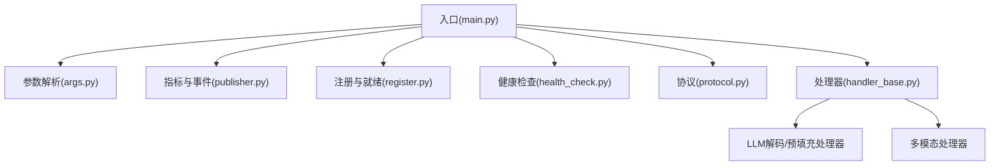
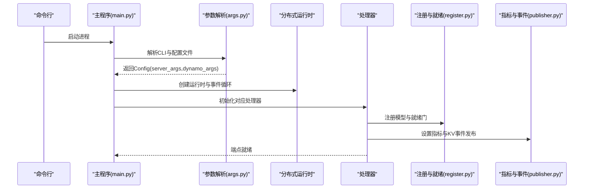
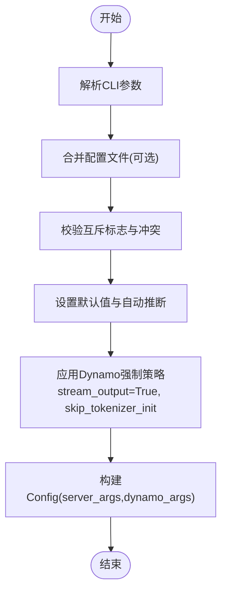
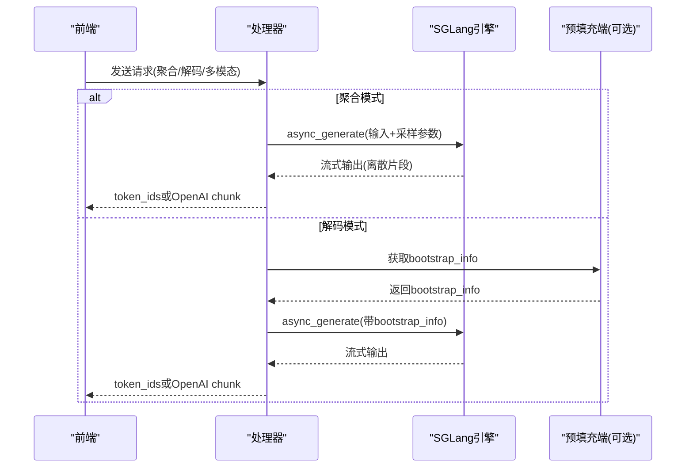
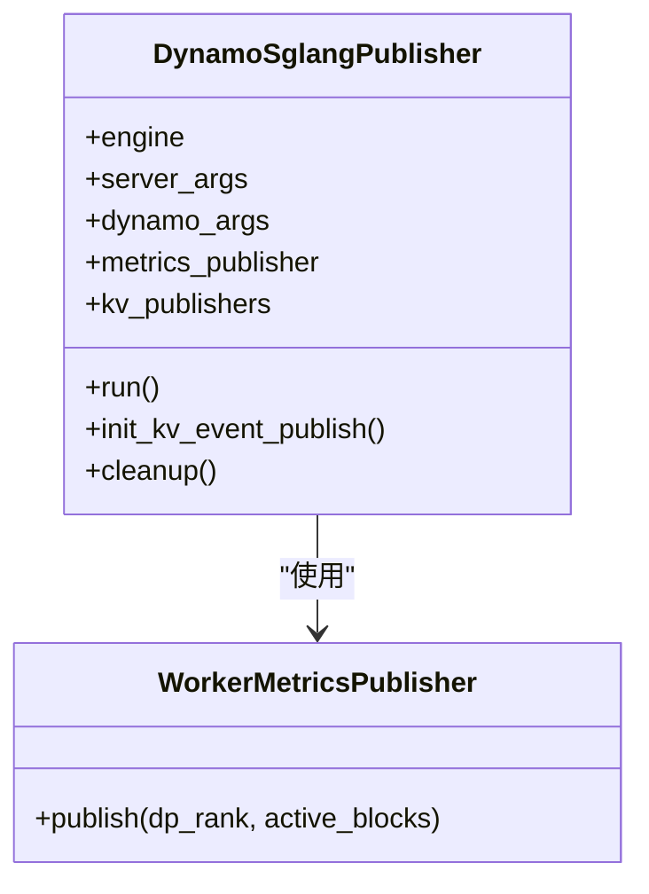
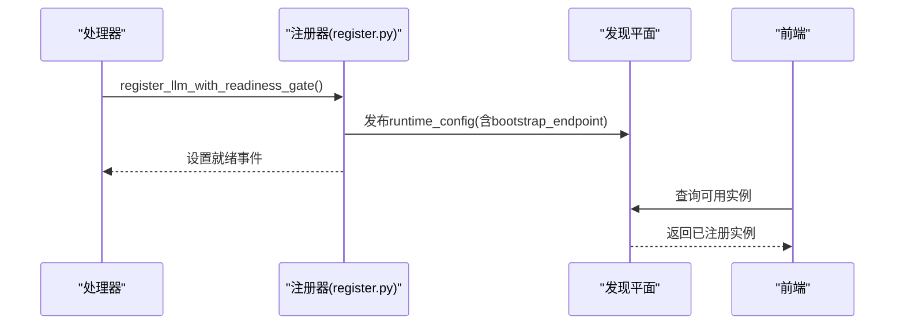
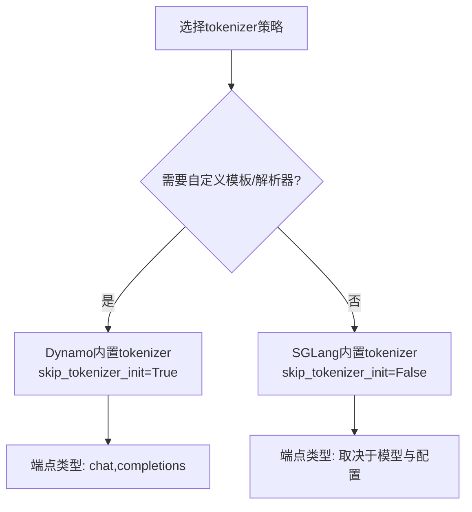
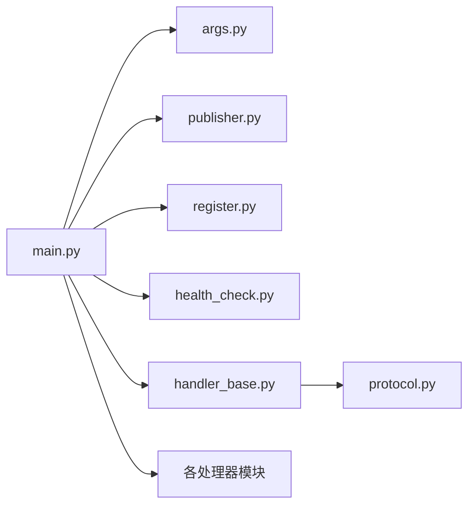

# SGLang集成概览

<cite>
**本文档引用的文件**
- [components/src/dynamo/sglang/main.py](file://components/src/dynamo/sglang/main.py)
- [components/src/dynamo/sglang/args.py](file://components/src/dynamo/sglang/args.py)
- [components/src/dynamo/sglang/publisher.py](file://components/src/dynamo/sglang/publisher.py)
- [components/src/dynamo/sglang/register.py](file://components/src/dynamo/sglang/register.py)
- [components/src/dynamo/sglang/health_check.py](file://components/src/dynamo/sglang/health_check.py)
- [components/src/dynamo/sglang/protocol.py](file://components/src/dynamo/sglang/protocol.py)
- [components/src/dynamo/sglang/request_handlers/handler_base.py](file://components/src/dynamo/sglang/request_handlers/handler_base.py)
- [components/src/dynamo/sglang/request_handlers/llm/decode_handler.py](file://components/src/dynamo/sglang/request_handlers/llm/decode_handler.py)
- [components/src/dynamo/sglang/request_handlers/llm/prefill_handler.py](file://components/src/dynamo/sglang/request_handlers/llm/prefill_handler.py)
- [components/src/dynamo/sglang/request_handlers/multimodal/worker_handler.py](file://components/src/dynamo/sglang/request_handlers/multimodal/worker_handler.py)
</cite>

## 目录
1. [简介](#简介)
2. [项目结构](#项目结构)
3. [核心组件](#核心组件)
4. [架构总览](#架构总览)
5. [详细组件分析](#详细组件分析)
6. [依赖关系分析](#依赖关系分析)
7. [性能考虑](#性能考虑)
8. [故障排除指南](#故障排除指南)
9. [结论](#结论)
10. [附录：参数配置指南](#附录参数配置指南)

## 简介
本文件面向SGLang在Dynamo平台中的集成与使用，系统性阐述其架构设计、参数处理机制、与Dynamo其他组件的交互方式，并重点说明SGLang原生参数解析器的工作原理、Dynamo特定参数的作用与优先级、tokenizer行为差异及其适用场景。文档还提供完整的参数配置指南、常见问题排查方法与最佳实践建议。

## 项目结构
SGLang集成位于Dynamo组件目录下，主要由以下模块构成：
- 入口与运行时：main.py负责启动流程、信号处理、多节点调度与端点注册
- 参数解析：args.py定义SGLang与Dynamo的联合参数体系，含SGLang原生参数与Dynamo扩展参数
- 指标与事件发布：publisher.py负责Prometheus指标与KV事件发布
- 注册与就绪门：register.py负责模型注册、运行时配置与就绪信号
- 健康检查：health_check.py提供针对不同后端类型的健康检查载荷
- 协议定义：protocol.py统一请求/响应数据结构
- 请求处理器：按功能划分的多个处理器，覆盖LLM解码/预填充、多模态等

图表来源
- [components/src/dynamo/sglang/main.py](file://components/src/dynamo/sglang/main.py#L1-L888)
- [components/src/dynamo/sglang/args.py](file://components/src/dynamo/sglang/args.py#L1-L635)
- [components/src/dynamo/sglang/publisher.py](file://components/src/dynamo/sglang/publisher.py#L1-L389)
- [components/src/dynamo/sglang/register.py](file://components/src/dynamo/sglang/register.py#L1-L315)
- [components/src/dynamo/sglang/health_check.py](file://components/src/dynamo/sglang/health_check.py#L1-L147)
- [components/src/dynamo/sglang/protocol.py](file://components/src/dynamo/sglang/protocol.py#L1-L177)
- [components/src/dynamo/sglang/request_handlers/handler_base.py](file://components/src/dynamo/sglang/request_handlers/handler_base.py#L1-L574)

章节来源
- [components/src/dynamo/sglang/main.py](file://components/src/dynamo/sglang/main.py#L1-L888)
- [components/src/dynamo/sglang/args.py](file://components/src/dynamo/sglang/args.py#L1-L635)

## 核心组件
- 配置容器与参数解析
  - Config：封装ServerArgs与DynamoArgs，并推导服务模式（聚合/预填充/解码）
  - DynamoArgs：Dynamo侧参数集合，涵盖端点、令牌化策略、多模态、扩散、KV事件、存储与平面选择等
  - SGLang参数：通过ServerArgs.from_cli_args解析，Dynamo在必要时强制stream_output=True并设置skip_tokenizer_init
- 运行时初始化
  - worker()：解析参数、创建分布式运行时、安装优雅关闭钩子、按模式初始化对应组件
  - init/init_prefill/init_diffusion/init_embedding/init_image_diffusion/init_multimodal系列：分别针对不同后端与模式进行端点注册、就绪门、指标与KV事件发布
- 处理器基类与具体实现
  - BaseWorkerHandler：统一输入参数管理、取消监控、内存占用释放/恢复、权重热更新、引擎路由注册
  - DecodeWorkerHandler/PrefillWorkerHandler：分别处理解码与预填充阶段的请求
  - MultimodalWorkerHandler/MultimodalPrefillWorkerHandler：支持多模态输入的聚合/解码模式
- 指标与事件发布
  - DynamoSglangPublisher：接收SGLang调度器指标并通过WorkerMetricsPublisher发布；根据KV事件配置初始化ZMQ订阅者
  - setup_sgl_metrics：注册Dynamo组件指标回调与SGLang多进程指标回调
- 注册与就绪门
  - register_llm_with_readiness_gate：注册模型到Dynamo运行时，同时发布运行时配置（如本地索引器开关、数据并行规模、聚合端点等）
- 健康检查
  - SglangHealthCheckPayload/SglangPrefillHealthCheckPayload/ImageDiffusionHealthCheckPayload：为不同后端生成最小化健康检查载荷

章节来源
- [components/src/dynamo/sglang/args.py](file://components/src/dynamo/sglang/args.py#L201-L605)
- [components/src/dynamo/sglang/main.py](file://components/src/dynamo/sglang/main.py#L191-L800)
- [components/src/dynamo/sglang/request_handlers/handler_base.py](file://components/src/dynamo/sglang/request_handlers/handler_base.py#L89-L574)
- [components/src/dynamo/sglang/publisher.py](file://components/src/dynamo/sglang/publisher.py#L65-L389)
- [components/src/dynamo/sglang/register.py](file://components/src/dynamo/sglang/register.py#L18-L315)
- [components/src/dynamo/sglang/health_check.py](file://components/src/dynamo/sglang/health_check.py#L50-L147)

## 架构总览
SGLang在Dynamo中的集成采用“参数解析—运行时初始化—处理器—注册与发布”的分层架构。Dynamo通过统一的Config对象协调SGLang原生参数与自定义参数，确保在不同服务模式（聚合/预填充/解码）下正确初始化端点、发布指标与KV事件，并通过就绪门保障前端路由的可用性。

图表来源
- [components/src/dynamo/sglang/main.py](file://components/src/dynamo/sglang/main.py#L191-L328)
- [components/src/dynamo/sglang/args.py](file://components/src/dynamo/sglang/args.py#L308-L605)
- [components/src/dynamo/sglang/register.py](file://components/src/dynamo/sglang/register.py#L234-L275)
- [components/src/dynamo/sglang/publisher.py](file://components/src/dynamo/sglang/publisher.py#L332-L389)

## 详细组件分析

### 参数解析器与优先级
- SGLang原生参数
  - 通过ServerArgs.from_cli_args解析，支持从配置文件合并、自动分配聚合端口等
  - Dynamo在解析后强制stream_output=True，确保SGLang输出离散片段（仅新token），便于Dynamo直接透传
- Dynamo特定参数
  - 定义于DYNAMO_ARGS字典，涵盖端点、工具/推理解析器、端点类型、tokenizer策略、多模态/嵌入/扩散选项、KV事件与存储平面等
  - 与SGLang参数冲突时的校验：如--custom-jinja-template与--use-sglang-tokenizer互斥；--tool-call-parser与--dyn-tool-call-parser不可同时设置
- 优先级规则
  - CLI参数 > 配置文件 > 环境变量
  - Dynamo参数对SGLang参数的覆盖：如skip_tokenizer_init、stream_output、endpoint类型推断、KV事件开关等
  - 端点字符串默认值按模式自动推断（后端/预填充/处理器/编码器）

图表来源
- [components/src/dynamo/sglang/args.py](file://components/src/dynamo/sglang/args.py#L308-L605)

章节来源
- [components/src/dynamo/sglang/args.py](file://components/src/dynamo/sglang/args.py#L33-L148)
- [components/src/dynamo/sglang/args.py](file://components/src/dynamo/sglang/args.py#L235-L482)
- [components/src/dynamo/sglang/args.py](file://components/src/dynamo/sglang/args.py#L548-L560)

### 处理器与请求流
- BaseWorkerHandler
  - 统一管理输入参数、跟踪请求ID、取消监控、内存占用控制、权重热更新、引擎路由注册
  - 支持trace头传递与dp_rank路由信息
- DecodeWorkerHandler
  - 聚合模式：直接调用engine.async_generate，支持图像URL注入
  - 解码模式：从请求中获取bootstrap_info（主机、端口、房间号），连接预填充端点完成解码
  - 输出格式：token_ids或OpenAI兼容chunk
- PrefillWorkerHandler
  - 生成bootstrap_info并立即返回给路由器，随后消费并丢弃结果（不向客户端返回文本）
- MultimodalWorkerHandler
  - 聚合模式：从编码器获取预计算嵌入，构造多模态项并调用engine.async_generate
  - 解码模式：从预填充端获取bootstrap_info，再调用engine.async_generate
  - 错误处理：对形状不匹配等关键错误进行诊断与标准化输出

图表来源
- [components/src/dynamo/sglang/request_handlers/llm/decode_handler.py](file://components/src/dynamo/sglang/request_handlers/llm/decode_handler.py#L93-L191)
- [components/src/dynamo/sglang/request_handlers/llm/prefill_handler.py](file://components/src/dynamo/sglang/request_handlers/llm/prefill_handler.py#L60-L139)
- [components/src/dynamo/sglang/request_handlers/multimodal/worker_handler.py](file://components/src/dynamo/sglang/request_handlers/multimodal/worker_handler.py#L288-L374)

章节来源
- [components/src/dynamo/sglang/request_handlers/handler_base.py](file://components/src/dynamo/sglang/request_handlers/handler_base.py#L89-L574)
- [components/src/dynamo/sglang/request_handlers/llm/decode_handler.py](file://components/src/dynamo/sglang/request_handlers/llm/decode_handler.py#L18-L320)
- [components/src/dynamo/sglang/request_handlers/llm/prefill_handler.py](file://components/src/dynamo/sglang/request_handlers/llm/prefill_handler.py#L16-L165)
- [components/src/dynamo/sglang/request_handlers/multimodal/worker_handler.py](file://components/src/dynamo/sglang/request_handlers/multimodal/worker_handler.py#L242-L543)

### 指标与KV事件发布
- Prometheus指标
  - 仅当SGLang启用--enable-metrics时才注册SGLang多进程指标回调；Dynamo组件指标始终注册
  - 通过register_engine_metrics_callback注入层次标签（namespace/component/endpoint/model）
- KV事件
  - 根据server_args.kv_events_config动态决定publisher是否启用
  - DP注意力模式下，按本地DP rank范围建立ZMQ订阅，跨节点通过NATS转发
  - 非领导者节点（node_rank>=1）不接收调度器指标，但继续发布KV事件

图表来源
- [components/src/dynamo/sglang/publisher.py](file://components/src/dynamo/sglang/publisher.py#L65-L282)

章节来源
- [components/src/dynamo/sglang/publisher.py](file://components/src/dynamo/sglang/publisher.py#L332-L389)
- [components/src/dynamo/sglang/publisher.py](file://components/src/dynamo/sglang/publisher.py#L199-L282)

### 注册与就绪门
- register_llm_with_readiness_gate
  - 将Dynamo解析的reasoning_parser/tool_call_parser写入ModelRuntimeConfig
  - 根据disaggregation_mode决定是否启用本地索引器
  - 发布disaggregated_endpoint（预填充端）供发现平面使用
  - 通过asyncio.Event实现就绪信号，前端路由在注册完成后开始分发请求

图表来源
- [components/src/dynamo/sglang/register.py](file://components/src/dynamo/sglang/register.py#L234-L275)

章节来源
- [components/src/dynamo/sglang/register.py](file://components/src/dynamo/sglang/register.py#L18-L315)

### tokenizer行为差异与选择
- Dynamo内置tokenizer/ detokenizer
  - 通过skip_tokenizer_init=True禁用SGLang内置tokenizer，使用Dynamo预处理器与后处理器
  - 优势：可应用自定义Jinja模板、统一的工具/推理解析器、更灵活的输入预处理
  - 限制：仅v1/chat/completions可用（取决于端点类型）
- SGLang内置tokenizer
  - 通过skip_tokenizer_init=False启用SGLang tokenizer/detokenizer
  - 优势：与SGLang生态完全一致，OpenAI兼容度高
  - 限制：无法使用Dynamo预处理器（如自定义模板）

图表来源
- [components/src/dynamo/sglang/args.py](file://components/src/dynamo/sglang/args.py#L550-L560)
- [components/src/dynamo/sglang/register.py](file://components/src/dynamo/sglang/register.py#L42-L50)

章节来源
- [components/src/dynamo/sglang/args.py](file://components/src/dynamo/sglang/args.py#L53-L70)
- [components/src/dynamo/sglang/register.py](file://components/src/dynamo/sglang/register.py#L42-L50)

## 依赖关系分析
- 组件耦合
  - main.py依赖args.py（参数）、publisher.py（指标/KV）、register.py（注册）、health_check.py（健康检查）、各处理器模块
  - 处理器依赖handler_base.py（通用能力）、protocol.py（数据结构）、publisher.py（指标/KV）
- 外部依赖
  - SGLang引擎与ServerArgs
  - Prometheus多进程收集器
  - ZMQ用于KV事件订阅
  - NATS用于跨节点事件转发（通过Dynamo运行时抽象）

图表来源
- [components/src/dynamo/sglang/main.py](file://components/src/dynamo/sglang/main.py#L23-L46)
- [components/src/dynamo/sglang/request_handlers/handler_base.py](file://components/src/dynamo/sglang/request_handlers/handler_base.py#L1-L574)

章节来源
- [components/src/dynamo/sglang/main.py](file://components/src/dynamo/sglang/main.py#L23-L46)

## 性能考虑
- 流式输出优化
  - 强制stream_output=True，使SGLang发送离散片段，Dynamo直接透传，降低缓冲与转换开销
- 指标与事件
  - 在启用--enable-metrics时注册SGLang多进程指标，避免未设置PROMETHEUS_MULTIPROC_DIR导致崩溃
  - KV事件订阅按本地DP rank范围建立，减少跨节点通信开销
- 内存与权重管理
  - 提供release_memory_occupation/resume_memory_occupation接口，支持在不重启情况下释放/恢复显存占用
  - 支持多种权重热更新路径（磁盘、张量、分布式、IPC），满足在线训练/微调需求

## 故障排除指南
- 健康检查失败
  - 使用SglangHealthCheckPayload/SglangPrefillHealthCheckPayload/ImageDiffusionHealthCheckPayload生成最小化请求验证后端状态
- 端点未注册
  - 检查register_llm_with_readiness_gate是否成功，确认就绪事件是否被触发
- 多模态形状不匹配
  - 检查编码器输出的embeddings_shape与输入token数量是否一致
- KV事件异常
  - 检查kv_events_config与publisher配置，确认本地索引器开关与DP注意力模式设置
- 优雅关闭
  - 确认install_graceful_shutdown已安装信号处理器，RUN_DEFERRED_HANDLERS在退出时被调用

章节来源
- [components/src/dynamo/sglang/health_check.py](file://components/src/dynamo/sglang/health_check.py#L50-L147)
- [components/src/dynamo/sglang/register.py](file://components/src/dynamo/sglang/register.py#L234-L275)
- [components/src/dynamo/sglang/request_handlers/multimodal/worker_handler.py](file://components/src/dynamo/sglang/request_handlers/multimodal/worker_handler.py#L376-L392)
- [components/src/dynamo/sglang/publisher.py](file://components/src/dynamo/sglang/publisher.py#L199-L282)
- [components/src/dynamo/sglang/main.py](file://components/src/dynamo/sglang/main.py#L92-L188)

## 结论
SGLang在Dynamo中的集成通过统一的参数解析与运行时初始化，实现了与Dynamo生态的深度协同。Dynamo在保持SGLang原生能力的同时，提供了更强的可配置性、可观测性与运维能力。合理选择tokenizer策略、正确配置端点与KV事件、利用就绪门与健康检查，是稳定部署的关键。

## 附录：参数配置指南

### 常用参数
- 端点与平面
  - --endpoint：目标端点（dyn://命名空间.组件.端点），未指定时按模式自动推断
  - --store-kv：键值存储后端（etcd/mem/file）
  - --request-plane：请求分发平面（nats/http/tcp）
  - --event-plane：事件发布平面（nats/zmq）
  - --durable-kv-events：启用NATS JetStream持久化KV事件
- tokenizer与预处理
  - --use-sglang-tokenizer：使用SGLang内置tokenizer（与Dynamo预处理器互斥）
  - --custom-jinja-template：自定义Jinja模板（需配合Dynamo预处理器）
  - --dyn-endpoint-types：启用的端点类型（chat,completions）
- 多模态与嵌入
  - --multimodal-processor/--multimodal-encode-worker/--multimodal-worker：多模态组件模式
  - --embedding-worker：嵌入模式（同时设置SGLang的--is-embedding）
- 扩散语言模型
  - --image-diffusion-worker：图像扩散模式
  - --image-diffusion-fs-url：生成图像存储的fsspec URL
  - --image-diffusion-base-url：重写响应中的图像URL基础地址

章节来源
- [components/src/dynamo/sglang/args.py](file://components/src/dynamo/sglang/args.py#L33-L148)

### 高级参数
- SGLang原生参数
  - 通过ServerArgs.from_cli_args解析，Dynamo在解析后强制stream_output=True
  - 支持从配置文件合并（ConfigArgumentMerger），并自动分配聚合端口
- 运行时配置
  - 通过register_llm_with_readiness_gate发布runtime_config，包含reasoning_parser/tool_call_parser、enable_local_indexer、data_parallel_size、disaggregated_endpoint等

章节来源
- [components/src/dynamo/sglang/args.py](file://components/src/dynamo/sglang/args.py#L355-L406)
- [components/src/dynamo/sglang/register.py](file://components/src/dynamo/sglang/register.py#L146-L232)

### 调试参数
- --dump-config-to：将完整配置转储至文件或标准输出
- --enable-metrics：启用SGLang指标（需设置PROMETHEUS_MULTIPROC_DIR）
- 健康检查载荷：根据后端类型选择SglangHealthCheckPayload/SglangPrefillHealthCheckPayload/ImageDiffusionHealthCheckPayload

章节来源
- [components/src/dynamo/sglang/args.py](file://components/src/dynamo/sglang/args.py#L95-L100)
- [components/src/dynamo/sglang/health_check.py](file://components/src/dynamo/sglang/health_check.py#L50-L147)

### 实际配置示例与最佳实践
- 使用Dynamo预处理器与自定义模板
  - 选择--custom-jinja-template并保持--use-sglang-tokenizer=false
  - 确保--dyn-endpoint-types包含chat/completions
- 使用SGLang内置tokenizer
  - 选择--use-sglang-tokenizer，此时仅v1/chat/completions可用
  - 如需工具/推理解析器，请使用--dyn-tool-call-parser/--dyn-reasoning-parser
- 多模态聚合模式
  - 使用--multimodal-worker，确保编码器与后端组件正确部署
  - 预填充阶段由编码器提供预计算嵌入
- 多模态解码模式
  - 使用--multimodal-worker且disaggregation-mode=decode，预填充端负责生成bootstrap_info
- 扩散语言模型
  - 使用--image-diffusion-worker，配置--image-diffusion-fs-url与--image-diffusion-base-url
  - 健康检查使用ImageDiffusionHealthCheckPayload

最佳实践建议
- 在生产环境启用--durable-kv-events以保证多副本一致性
- 对于大规模部署，优先使用--request-plane=tcp以获得更低延迟
- 使用--enable-metrics并配置合适的PROMETHEUS_MULTIPROC_DIR以启用SGLang多进程指标
- 对于解码阶段的低延迟需求，确保预填充端与解码端在同一节点或网络拓扑优化的环境中