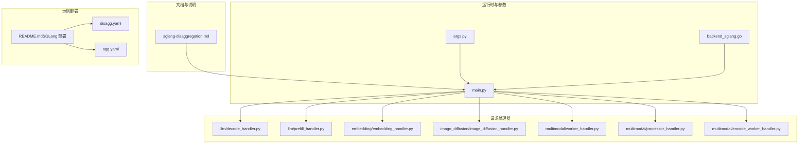
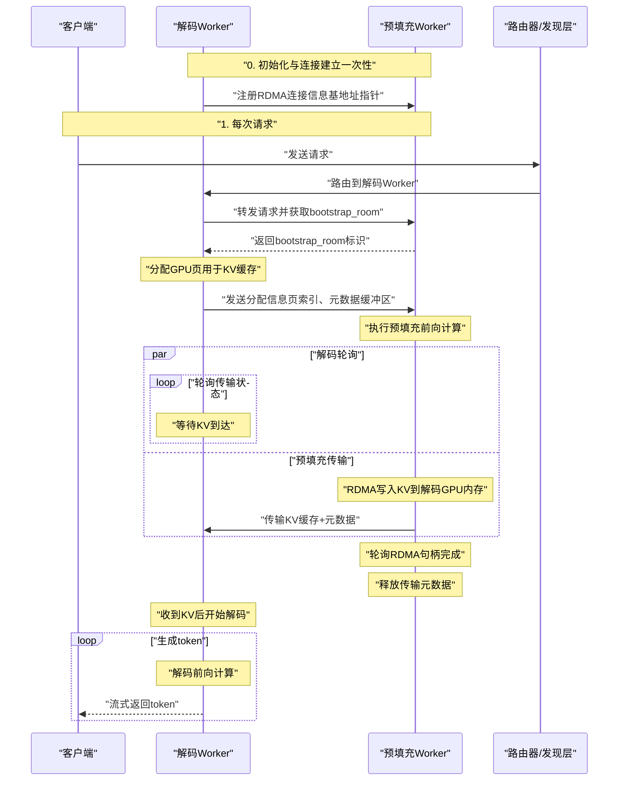
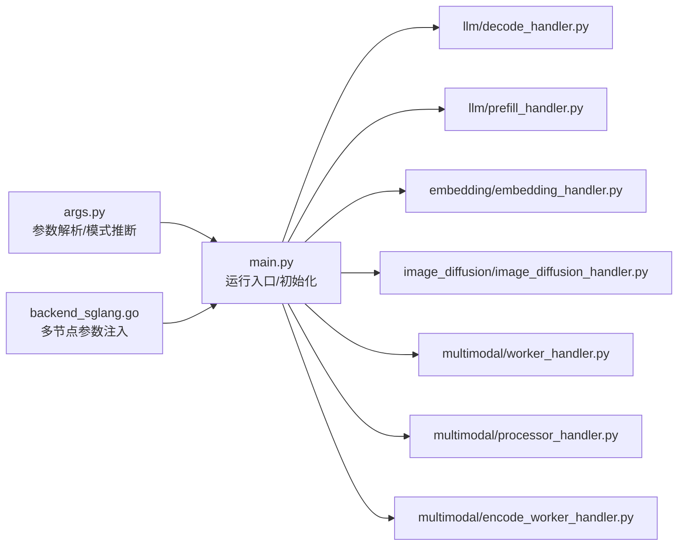

# 分割式服务配置

<cite>
**本文引用的文件**
- [sglang-disaggregation.md](file://docs/pages/backends/sglang/sglang-disaggregation.md)
- [args.py](file://components/src/dynamo/sglang/args.py)
- [main.py](file://components/src/dynamo/sglang/main.py)
- [disagg.yaml](file://examples/backends/sglang/deploy/disagg.yaml)
- [agg.yaml](file://examples/backends/sglang/deploy/agg.yaml)
- [README.md（SGLang 部署）](file://examples/backends/sglang/deploy/README.md)
- [backend_sglang.go](file://deploy/operator/internal/dynamo/backend_sglang.go)
- [__init__.py（请求处理器导出）](file://components/src/dynamo/sglang/request_handlers/__init__.py)
- [decode_handler.py](file://components/src/dynamo/sglang/request_handlers/llm/decode_handler.py)
- [prefill_handler.py](file://components/src/dynamo/sglang/request_handlers/llm/prefill_handler.py)
- [embedding_handler.py](file://components/src/dynamo/sglang/request_handlers/embedding/embedding_handler.py)
- [image_diffusion_handler.py](file://components/src/dynamo/sglang/request_handlers/image_diffusion/image_diffusion_handler.py)
- [worker_handler.py（多模态）](file://components/src/dynamo/sglang/request_handlers/multimodal/worker_handler.py)
- [processor_handler.py](file://components/src/dynamo/sglang/request_handlers/multimodal/processor_handler.py)
- [encode_worker_handler.py](file://components/src/dynamo/sglang/request_handlers/multimodal/encode_worker_handler.py)
- [test_sla_planner_scaling.py](file://tests/planner/unit/test_sla_planner_scaling.py)
</cite>

## 目录
1. [简介](#简介)
2. [项目结构](#项目结构)
3. [核心组件](#核心组件)
4. [架构总览](#架构总览)
5. [详细组件分析](#详细组件分析)
6. [依赖关系分析](#依赖关系分析)
7. [性能考量](#性能考量)
8. [故障排除指南](#故障排除指南)
9. [结论](#结论)
10. [附录](#附录)

## 简介
本文件面向在Dynamo平台中使用SGLang进行“分割式服务”（Prefill与Decode分离）的工程师与运维人员，系统性阐述以下内容：
- SGLang在Dynamo中的分割式预填充与解码架构
- Prefill Worker与Decode Worker的角色分工与协作流程
- 数据传输机制（基于NIXL/Mooncake的GPU直连与RDMA）
- 性能优化策略与资源规划
- 聚合式与分割式的对比及适用场景
- 完整配置示例：基础分割式部署、带KV感知路由的分割式部署、MoE模型的分割式部署
- 故障排除与性能调优建议

## 项目结构
围绕SGLang分割式服务，相关代码与配置主要分布在如下位置：
- 文档与流程说明：docs/pages/backends/sglang/sglang-disaggregation.md
- 运行入口与多节点支持：components/src/dynamo/sglang/main.py、deploy/operator/internal/dynamo/backend_sglang.go
- 参数解析与运行模式：components/src/dynamo/sglang/args.py
- 请求处理器（Decode/Prefill/Embedding/Diffusion/多模态）：components/src/dynamo/sglang/request_handlers/*
- 示例部署模板：examples/backends/sglang/deploy/*.yaml
- 配置修改器与基准测试：benchmarks/profiler/utils/config_modifiers/sglang.py、tests/planner/unit/test_sla_planner_scaling.py

图表来源
- [sglang-disaggregation.md](file://docs/pages/backends/sglang/sglang-disaggregation.md#L1-L89)
- [args.py](file://components/src/dynamo/sglang/args.py#L308-L605)
- [main.py](file://components/src/dynamo/sglang/main.py#L191-L233)
- [backend_sglang.go](file://deploy/operator/internal/dynamo/backend_sglang.go#L65-L85)
- [disagg.yaml](file://examples/backends/sglang/deploy/disagg.yaml#L1-L85)
- [agg.yaml](file://examples/backends/sglang/deploy/agg.yaml#L1-L43)

章节来源
- [sglang-disaggregation.md](file://docs/pages/backends/sglang/sglang-disaggregation.md#L1-L89)
- [args.py](file://components/src/dynamo/sglang/args.py#L308-L605)
- [main.py](file://components/src/dynamo/sglang/main.py#L191-L233)
- [backend_sglang.go](file://deploy/operator/internal/dynamo/backend_sglang.go#L65-L85)
- [disagg.yaml](file://examples/backends/sglang/deploy/disagg.yaml#L1-L85)
- [agg.yaml](file://examples/backends/sglang/deploy/agg.yaml#L1-L43)

## 核心组件
- 配置与运行模式
  - 解析SGLang与Dynamo参数，推导服务模式（聚合/仅Prefill/仅Decode），并自动设置端点与流式输出等关键行为。
- 多节点支持
  - 在多节点场景下注入分布式启动参数，并对非主节点进行探针与命令行标志处理。
- 请求处理器
  - DecodeWorkerHandler：面向解码阶段的生成与健康检查
  - PrefillWorkerHandler：面向预填充阶段的生成与注册
  - 其他处理器：Embedding、Diffusion、多模态Encode/Worker/Processor等
- 示例部署
  - 提供聚合式与分割式两种模板，展示如何通过disaggregation-mode与transfer-backend进行配置。

章节来源
- [args.py](file://components/src/dynamo/sglang/args.py#L195-L232)
- [args.py](file://components/src/dynamo/sglang/args.py#L308-L605)
- [backend_sglang.go](file://deploy/operator/internal/dynamo/backend_sglang.go#L65-L85)
- [__init__.py（请求处理器导出）](file://components/src/dynamo/sglang/request_handlers/__init__.py#L14-L41)
- [README.md（SGLang 部署）](file://examples/backends/sglang/deploy/README.md#L1-L122)

## 架构总览
下图展示了Dynamo中SGLang分割式服务的端到端工作流，涵盖初始化、连接建立、请求分发、KV缓存传输与解码生成等关键步骤。

图表来源
- [sglang-disaggregation.md](file://docs/pages/backends/sglang/sglang-disaggregation.md#L35-L67)
- [main.py](file://components/src/dynamo/sglang/main.py#L240-L272)
- [main.py](file://components/src/dynamo/sglang/main.py#L330-L407)

章节来源
- [sglang-disaggregation.md](file://docs/pages/backends/sglang/sglang-disaggregation.md#L33-L89)
- [main.py](file://components/src/dynamo/sglang/main.py#L240-L272)
- [main.py](file://components/src/dynamo/sglang/main.py#L330-L407)

## 详细组件分析

### 配置与运行模式（args.py）
- 关键职责
  - 合并SGLang与Dynamo参数，推导服务模式（聚合/仅Prefill/仅Decode）
  - 自动选择端点（根据组件类型与模式）
  - 强制启用流式输出以提升吞吐
  - 解析KV事件配置，决定是否启用本地索引或JetStream持久化
- 重要行为
  - 当未显式指定disaggregation-bootstrap-port时，自动预留一个端口用于引导
  - 对于图像扩散类工作负载，构造专用ServerArgs并禁用某些字段

章节来源
- [args.py](file://components/src/dynamo/sglang/args.py#L195-L232)
- [args.py](file://components/src/dynamo/sglang/args.py#L308-L605)

### 运行入口与多节点支持（main.py、backend_sglang.go）
- 运行入口（main.py）
  - 解析参数、创建分布式运行时、安装优雅关闭信号链
  - 根据服务模式选择初始化路径：普通Decode、仅Prefill、多模态等
  - 非主节点（多节点）仅运行调度与KV事件发布，不直接处理请求
- 多节点支持（backend_sglang.go）
  - 注入分布式启动地址、节点总数与节点序号
  - 非主节点移除健康探针，避免误判

章节来源
- [main.py](file://components/src/dynamo/sglang/main.py#L191-L233)
- [main.py](file://components/src/dynamo/sglang/main.py#L240-L272)
- [main.py](file://components/src/dynamo/sglang/main.py#L330-L407)
- [backend_sglang.go](file://deploy/operator/internal/dynamo/backend_sglang.go#L65-L85)

### 请求处理器（Decode/Prefill/Embedding/Diffusion/多模态）
- DecodeWorkerHandler
  - 注册生成端点、健康检查与就绪门，面向解码阶段
- PrefillWorkerHandler
  - 注册生成端点、健康检查与就绪门；在主节点上进行预热以避免首次TTFT
- Embedding/Diffusion
  - 面向嵌入与扩散任务的专用处理器
- 多模态
  - Encode Worker：上游编码组件
  - Worker：多模态LLM推理（可选连接Prefill客户端）
  - Processor：多模态请求处理器，协调Encode与Worker

章节来源
- [__init__.py（请求处理器导出）](file://components/src/dynamo/sglang/request_handlers/__init__.py#L14-L41)
- [decode_handler.py](file://components/src/dynamo/sglang/request_handlers/llm/decode_handler.py)
- [prefill_handler.py](file://components/src/dynamo/sglang/request_handlers/llm/prefill_handler.py)
- [embedding_handler.py](file://components/src/dynamo/sglang/request_handlers/embedding/embedding_handler.py)
- [image_diffusion_handler.py](file://components/src/dynamo/sglang/request_handlers/image_diffusion/image_diffusion_handler.py)
- [worker_handler.py（多模态）](file://components/src/dynamo/sglang/request_handlers/multimodal/worker_handler.py)
- [processor_handler.py](file://components/src/dynamo/sglang/request_handlers/multimodal/processor_handler.py)
- [encode_worker_handler.py](file://components/src/dynamo/sglang/request_handlers/multimodal/encode_worker_handler.py)

### 示例部署模板
- 聚合式（agg.yaml）
  - 单一Decode Worker承载预填充与解码
- 分割式（disagg.yaml）
  - 明确区分Decode与Prefill Worker
  - 使用NIXL传输后端与引导端口
  - 可按需调整TP、页大小、GPU配额等

章节来源
- [README.md（SGLang 部署）](file://examples/backends/sglang/deploy/README.md#L1-L122)
- [disagg.yaml](file://examples/backends/sglang/deploy/disagg.yaml#L1-L85)
- [agg.yaml](file://examples/backends/sglang/deploy/agg.yaml#L1-L43)

## 依赖关系分析
- 组件耦合与职责
  - main.py作为统一入口，依赖args.py进行参数解析与模式推断
  - 不同处理器模块分别负责不同子系统的生成与注册
  - backend_sglang.go在多节点场景下为进程注入分布式参数
- 外部集成点
  - NIXL/Mooncake用于GPU直连与RDMA传输
  - 健康检查与就绪门保障服务可用性
  - Prometheus指标与KV事件发布用于可观测性

图表来源
- [args.py](file://components/src/dynamo/sglang/args.py#L308-L605)
- [main.py](file://components/src/dynamo/sglang/main.py#L191-L233)
- [backend_sglang.go](file://deploy/operator/internal/dynamo/backend_sglang.go#L65-L85)
- [__init__.py（请求处理器导出）](file://components/src/dynamo/sglang/request_handlers/__init__.py#L14-L41)

章节来源
- [args.py](file://components/src/dynamo/sglang/args.py#L308-L605)
- [main.py](file://components/src/dynamo/sglang/main.py#L191-L233)
- [backend_sglang.go](file://deploy/operator/internal/dynamo/backend_sglang.go#L65-L85)
- [__init__.py（请求处理器导出）](file://components/src/dynamo/sglang/request_handlers/__init__.py#L14-L41)

## 性能考量
- RDMA传输特性
  - GPU直连零拷贝，CPU参与度低，适合大块KV缓存的快速搬运
  - 解码侧轮询传输状态，预填充侧并发传输，提升并行度
- 资源与拓扑
  - 预填充阶段通常计算密集，解码阶段内存/带宽敏感
  - 分离后可独立扩展两阶段资源，提高整体利用率
- 流式输出
  - 强制开启流式输出，减少累积token带来的开销，提升端到端延迟体验
- 多节点与并行
  - 非主节点仅运行调度与事件发布，降低主节点压力
  - 通过引导端口与NATS/JetStream配合，确保跨节点一致性与可观测性

章节来源
- [sglang-disaggregation.md](file://docs/pages/backends/sglang/sglang-disaggregation.md#L85-L89)
- [args.py](file://components/src/dynamo/sglang/args.py#L544-L548)
- [main.py](file://components/src/dynamo/sglang/main.py#L240-L272)
- [backend_sglang.go](file://deploy/operator/internal/dynamo/backend_sglang.go#L65-L85)

## 故障排除指南
- 健康检查与就绪门
  - 若Decode/Prefill端点长时间不可用，检查健康检查负载与就绪门注册逻辑
- 多节点问题
  - 非主节点应无健康探针，确认已正确注入分布式参数
- 传输失败
  - 检查引导端口是否开放、NIXL/Mooncake配置是否一致
  - 确认RDMA句柄轮询与元数据释放流程正常
- 模板与参数
  - 确保disaggregation-mode与transfer-backend与部署模板匹配
  - 检查GPU配额、TP设置与页大小是否合理

章节来源
- [main.py](file://components/src/dynamo/sglang/main.py#L271-L324)
- [main.py](file://components/src/dynamo/sglang/main.py#L370-L406)
- [backend_sglang.go](file://deploy/operator/internal/dynamo/backend_sglang.go#L65-L85)
- [disagg.yaml](file://examples/backends/sglang/deploy/disagg.yaml#L43-L83)

## 结论
SGLang在Dynamo中的分割式服务通过“预填充—解码”分离与GPU直连传输，实现了更高效的资源利用与更低的端到端延迟。结合多节点参数注入、健康检查与就绪门机制，可在生产环境中稳定运行。针对不同场景（聚合/分割/KV感知路由/MoE），可按本文提供的模板与参数进行快速落地与调优。

## 附录

### 聚合式 vs 分割式对比与适用场景
- 聚合式（单Decode Worker）
  - 优点：部署简单、运维成本低
  - 适用：小规模、开发/测试环境
- 分割式（Prefill/Decode分离）
  - 优点：独立扩展、资源利用率高、端到端延迟低
  - 适用：生产环境、高并发、大模型推理

章节来源
- [README.md（SGLang 部署）](file://examples/backends/sglang/deploy/README.md#L7-L29)

### 配置示例与最佳实践

- 基础分割式部署（disagg.yaml）
  - 关键参数
    - disaggregation-mode: decode / prefill
    - disaggregation-transfer-backend: nixl
    - disaggregation-bootstrap-port: 自动预留或手动指定
    - page-size、tp、gpu limits
  - 参考路径
    - [disagg.yaml](file://examples/backends/sglang/deploy/disagg.yaml#L43-L83)

- 带KV感知路由的分割式部署
  - 在前端启用KV路由模式，结合Dynamo的路由器能力进行请求分发
  - 参考路径
    - [README.md（SGLang 部署）](file://examples/backends/sglang/deploy/README.md#L14-L20)

- MoE模型的分割式部署
  - 保持与常规分割式相同的拓扑，注意MoE模型的TP/DP配置与显存占用
  - 参考路径
    - [disagg.yaml](file://examples/backends/sglang/deploy/disagg.yaml#L67-L83)

- 资源规划与性能表现
  - 预填充阶段：提升GPU数量与TP，缩短TTFT
  - 解码阶段：关注页大小与并发，平衡内存占用与吞吐
  - 参考路径
    - [test_sla_planner_scaling.py](file://tests/planner/unit/test_sla_planner_scaling.py#L142-L173)

- 多节点与分布式参数
  - 注入分布式启动地址、节点总数与节点序号
  - 参考路径
    - [backend_sglang.go](file://deploy/operator/internal/dynamo/backend_sglang.go#L65-L85)

- 健康检查与就绪门
  - 确保端点注册与健康检查负载正确
  - 参考路径
    - [main.py](file://components/src/dynamo/sglang/main.py#L271-L324)
    - [main.py](file://components/src/dynamo/sglang/main.py#L370-L406)

- 数据传输机制（RDMA/NIXL）
  - 一次连接复用、零拷贝传输、解码轮询与预填充并发传输
  - 参考路径
    - [sglang-disaggregation.md](file://docs/pages/backends/sglang/sglang-disaggregation.md#L35-L67)