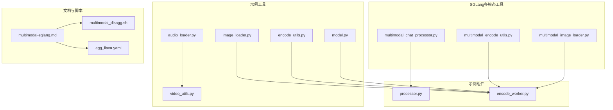
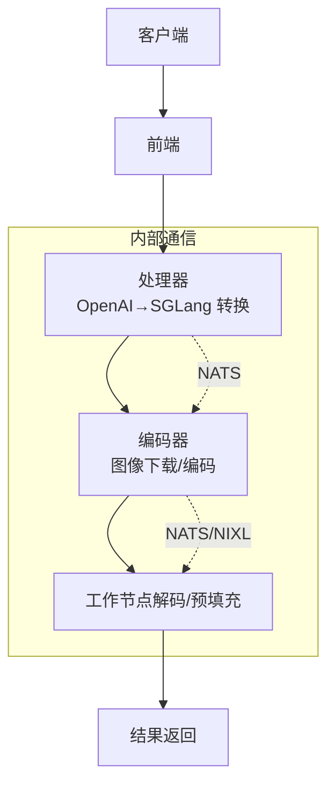
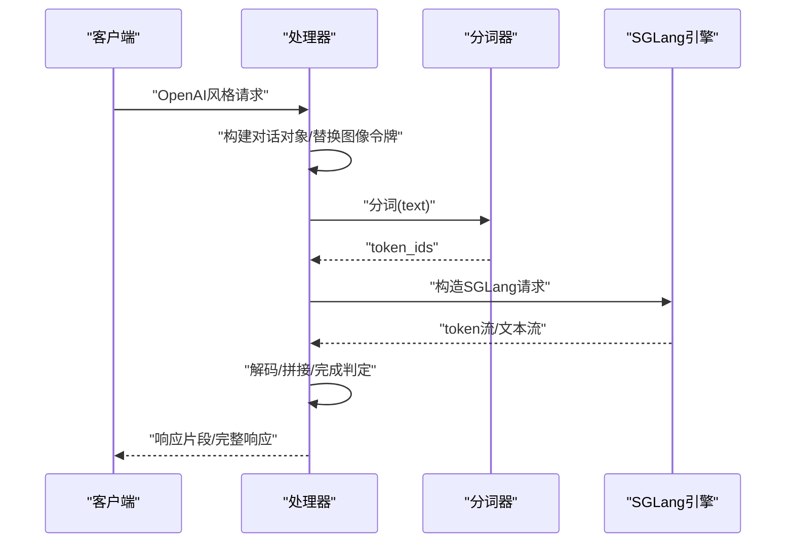
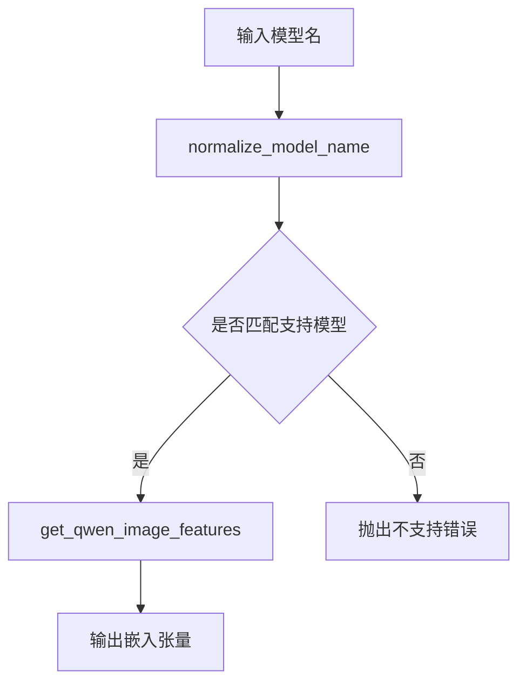
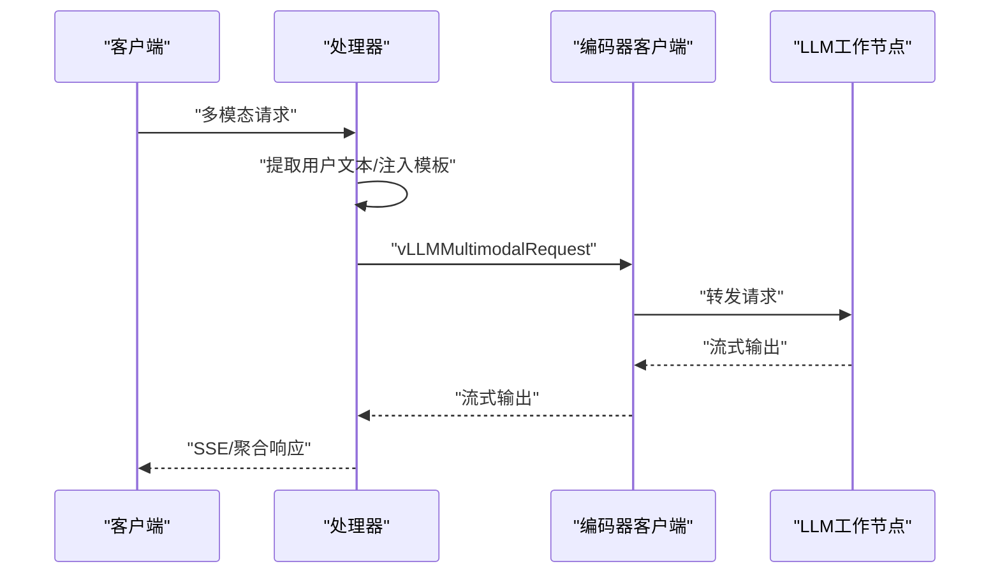
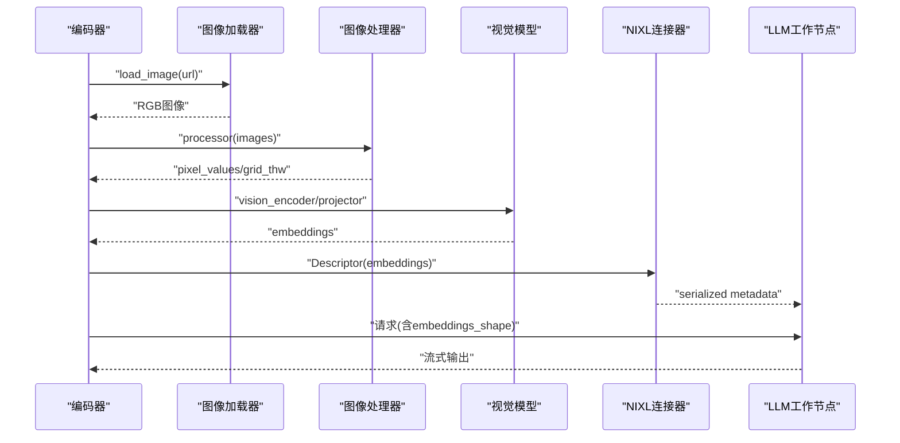
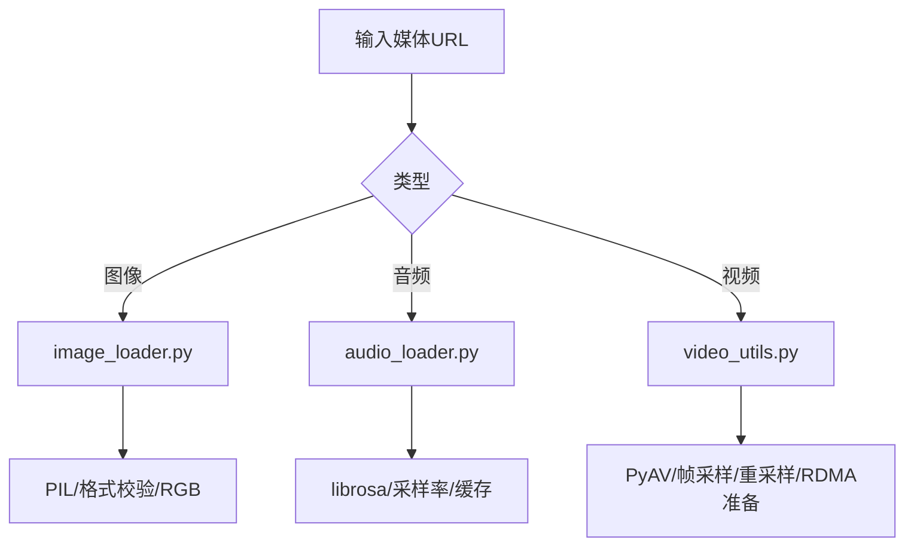
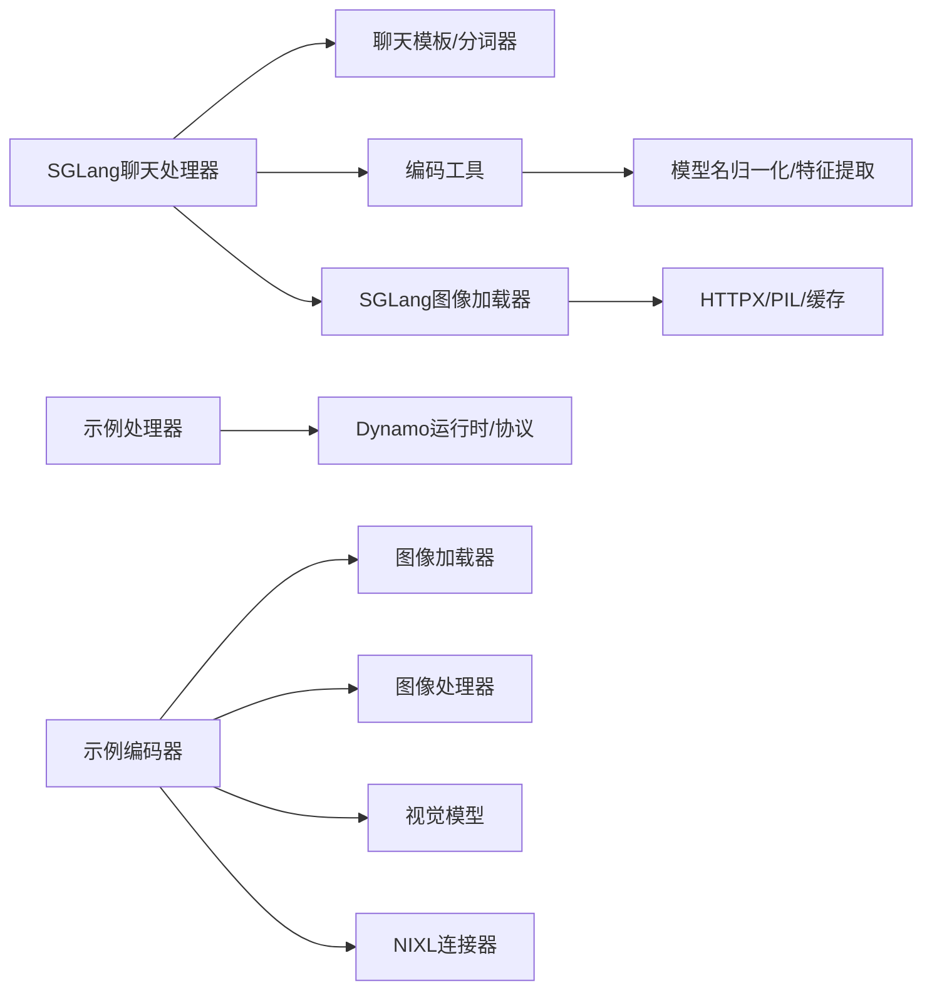

# 多模态功能支持

<cite>
**本文引用的文件**
- [multimodal_chat_processor.py](file://components/src/dynamo/sglang/multimodal_utils/multimodal_chat_processor.py)
- [multimodal_encode_utils.py](file://components/src/dynamo/sglang/multimodal_utils/multimodal_encode_utils.py)
- [multimodal_image_loader.py](file://components/src/dynamo/sglang/multimodal_utils/multimodal_image_loader.py)
- [multimodal-sglang.md](file://docs/pages/features/multimodal/multimodal-sglang.md)
- [multimodal_disagg.sh](file://examples/backends/sglang/launch/multimodal_disagg.sh)
- [encode_worker.py](file://examples/multimodal/components/encode_worker.py)
- [processor.py](file://examples/multimodal/components/processor.py)
- [image_loader.py](file://examples/multimodal/utils/image_loader.py)
- [audio_loader.py](file://examples/multimodal/utils/audio_loader.py)
- [video_utils.py](file://examples/multimodal/utils/video_utils.py)
- [encode_utils.py](file://examples/multimodal/utils/encode_utils.py)
- [model.py](file://examples/multimodal/utils/model.py)
- [agg_llava.yaml](file://examples/multimodal/deploy/agg_llava.yaml)
</cite>

## 目录
1. [简介](#简介)
2. [项目结构](#项目结构)
3. [核心组件](#核心组件)
4. [架构总览](#架构总览)
5. [详细组件分析](#详细组件分析)
6. [依赖关系分析](#依赖关系分析)
7. [性能考虑](#性能考虑)
8. [故障排除指南](#故障排除指南)
9. [结论](#结论)
10. [附录](#附录)

## 简介
本文件系统性阐述SGLang在Dynamo中对多模态输入（图像、视频、音频）的支持能力与实现细节，覆盖数据预处理、编码器集成、处理器实现、传输机制与内存管理策略，并提供端到端部署示例与优化建议。重点面向希望在Dynamo中使用SGLang后端进行多模态推理的工程师与运维人员。

## 项目结构
围绕SGLang多模态能力的关键目录与文件如下：
- SGLang侧多模态工具与处理器：components/src/dynamo/sglang/multimodal_utils
- 文档与部署脚本：docs/pages/features/multimodal 与 examples/backends/sglang/launch
- 示例多模态组件与工具：examples/multimodal/components 与 examples/multimodal/utils
- 部署清单示例：examples/multimodal/deploy



**图表来源**
- [multimodal_chat_processor.py](file://components/src/dynamo/sglang/multimodal_utils/multimodal_chat_processor.py#L1-L163)
- [multimodal_encode_utils.py](file://components/src/dynamo/sglang/multimodal_utils/multimodal_encode_utils.py#L1-L171)
- [multimodal_image_loader.py](file://components/src/dynamo/sglang/multimodal_utils/multimodal_image_loader.py#L1-L124)
- [processor.py](file://examples/multimodal/components/processor.py#L1-L348)
- [encode_worker.py](file://examples/multimodal/components/encode_worker.py#L1-L265)
- [image_loader.py](file://examples/multimodal/utils/image_loader.py#L1-L111)
- [audio_loader.py](file://examples/multimodal/utils/audio_loader.py#L1-L81)
- [video_utils.py](file://examples/multimodal/utils/video_utils.py#L1-L415)
- [encode_utils.py](file://examples/multimodal/utils/encode_utils.py#L1-L133)
- [model.py](file://examples/multimodal/utils/model.py#L1-L92)
- [multimodal-sglang.md](file://docs/pages/features/multimodal/multimodal-sglang.md#L1-L422)
- [multimodal_disagg.sh](file://examples/backends/sglang/launch/multimodal_disagg.sh#L1-L106)
- [agg_llava.yaml](file://examples/multimodal/deploy/agg_llava.yaml#L1-L64)

**章节来源**
- [multimodal-sglang.md](file://docs/pages/features/multimodal/multimodal-sglang.md#L1-L422)
- [multimodal_disagg.sh](file://examples/backends/sglang/launch/multimodal_disagg.sh#L1-L106)
- [agg_llava.yaml](file://examples/multimodal/deploy/agg_llava.yaml#L1-L64)

## 核心组件
- 多模态聊天处理器（SGLang）：负责将OpenAI风格的消息转换为SGLang对话格式，执行分词并构建请求字典；支持流式与非流式响应的解码与拼接。
- 多模态编码工具（SGLang）：提供模型名归一化、支持模型识别、Qwen风格图像特征提取与嵌入编码。
- 图像加载器（SGLang）：支持HTTP(S)/data URL加载，具备线程池与缓存机制，限制图片格式以提升安全性。
- 示例处理器（vLLM示例）：演示如何在Dynamo中通过“处理器-编码器-下游LLM”链路组织多模态请求。
- 示例编码器（vLLM示例）：演示图像下载、预处理、编码、NIXL描述符生成与RDMA传输。
- 示例工具：图像/音频/视频加载与编码工具，支撑多模态数据准备与传输。

**章节来源**
- [multimodal_chat_processor.py](file://components/src/dynamo/sglang/multimodal_utils/multimodal_chat_processor.py#L11-L48)
- [multimodal_encode_utils.py](file://components/src/dynamo/sglang/multimodal_utils/multimodal_encode_utils.py#L13-L171)
- [multimodal_image_loader.py](file://components/src/dynamo/sglang/multimodal_utils/multimodal_image_loader.py#L44-L124)
- [processor.py](file://examples/multimodal/components/processor.py#L48-L348)
- [encode_worker.py](file://examples/multimodal/components/encode_worker.py#L47-L265)
- [image_loader.py](file://examples/multimodal/utils/image_loader.py#L31-L111)
- [audio_loader.py](file://examples/multimodal/utils/audio_loader.py#L30-L81)
- [video_utils.py](file://examples/multimodal/utils/video_utils.py#L37-L415)
- [encode_utils.py](file://examples/multimodal/utils/encode_utils.py#L58-L133)
- [model.py](file://examples/multimodal/utils/model.py#L25-L92)

## 架构总览
SGLang多模态在Dynamo中支持EPD、E/PD、E/P/D三种模式，结合NIXL实现零拷贝张量传输（仅用于嵌入）。处理器负责OpenAI→SGLang转换与聊天模板处理；编码器负责图像下载与编码；工作节点负责预填充与解码，或通过引导机制在解码/预填充之间传递KV缓存。



**图表来源**
- [multimodal-sglang.md](file://docs/pages/features/multimodal/multimodal-sglang.md#L268-L317)
- [multimodal_disagg.sh](file://examples/backends/sglang/launch/multimodal_disagg.sh#L64-L102)

**章节来源**
- [multimodal-sglang.md](file://docs/pages/features/multimodal/multimodal-sglang.md#L25-L422)
- [multimodal_disagg.sh](file://examples/backends/sglang/launch/multimodal_disagg.sh#L1-L106)

## 详细组件分析

### 组件A：SGLang多模态聊天处理器
- 功能要点
  - 将消息列表转换为SGLang对话对象，替换图像占位符为模型特定的图像令牌。
  - 使用指定聊天模板对文本进行分词，生成token_ids。
  - 构建SGLang请求字典，包含采样参数、停止条件、EOS等。
  - 支持响应解码与流式处理，累积增量文本并判断完成状态。
- 关键路径
  - 请求转换：multimodal_request_to_sglang
  - 解码：detokenize_sglang_response
  - 流式处理：process_sglang_stream_response



**图表来源**
- [multimodal_chat_processor.py](file://components/src/dynamo/sglang/multimodal_utils/multimodal_chat_processor.py#L11-L48)
- [multimodal_chat_processor.py](file://components/src/dynamo/sglang/multimodal_utils/multimodal_chat_processor.py#L51-L163)

**章节来源**
- [multimodal_chat_processor.py](file://components/src/dynamo/sglang/multimodal_utils/multimodal_chat_processor.py#L11-L163)

### 组件B：SGLang多模态编码工具
- 功能要点
  - 模型名归一化与匹配，支持本地路径、HF缓存路径与简单名称。
  - Qwen风格图像特征提取，支持grid_thw信息传入。
  - 统一编码入口，按模型类型路由至对应编码逻辑。
- 关键路径
  - 归一化：normalize_model_name
  - 匹配：is_model_supported
  - 编码：encode_image_embeddings
  - 特征提取：get_qwen_image_features



**图表来源**
- [multimodal_encode_utils.py](file://components/src/dynamo/sglang/multimodal_utils/multimodal_encode_utils.py#L19-L96)
- [multimodal_encode_utils.py](file://components/src/dynamo/sglang/multimodal_utils/multimodal_encode_utils.py#L99-L171)

**章节来源**
- [multimodal_encode_utils.py](file://components/src/dynamo/sglang/multimodal_utils/multimodal_encode_utils.py#L13-L171)

### 组件C：SGLang图像加载器
- 功能要点
  - 支持HTTP(S)/data URL；data URL要求image类型且base64编码。
  - 使用线程池避免阻塞事件循环；限制图片格式（JPEG/PNG/WEBP）。
  - 基于URL的小型LRU缓存，按队列淘汰最旧条目。
- 关键路径
  - 获取共享HTTP客户端：get_http_client
  - 加载图像：load_image

```mermaid
flowchart TD
A["输入URL"] --> B{"scheme类型"}
B --> |data| C["解析base64数据"]
B --> |http(s)| D["HTTP客户端获取"]
C --> E["PIL打开/校验格式/转RGB"]
D --> E
E --> F{"是否HTTP(S)URL"}
F --> |是| G["写入缓存/队列入队"]
F --> |否| H["直接返回"]
G --> H
```

**图表来源**
- [multimodal_image_loader.py](file://components/src/dynamo/sglang/multimodal_utils/multimodal_image_loader.py#L54-L124)

**章节来源**
- [multimodal_image_loader.py](file://components/src/dynamo/sglang/multimodal_utils/multimodal_image_loader.py#L44-L124)

### 组件D：示例处理器（vLLM示例）
- 功能要点
  - 解析原始请求，构造OpenAI风格的聊天请求。
  - 提取用户文本，注入提示模板占位符，设置stream=True。
  - 将多模态输入（图像/视频/音频URL）映射到MultiModalInput。
  - 通过Dynamo客户端轮询发送至编码器，再由编码器转发至下游LLM。
- 关键路径
  - 生成流程：generate/_generate/_generate_responses
  - 协议与消息：MultiModalRequest/MultiModalInput



**图表来源**
- [processor.py](file://examples/multimodal/components/processor.py#L196-L263)
- [processor.py](file://examples/multimodal/components/processor.py#L127-L194)

**章节来源**
- [processor.py](file://examples/multimodal/components/processor.py#L48-L348)

### 组件E：示例编码器（vLLM示例）
- 功能要点
  - 加载图像处理器与视觉模型，初始化NIXL连接器。
  - 下载并处理图像，调用encode_image_embeddings生成嵌入。
  - 通过Descriptor与NIXL元数据将嵌入传输给下游LLM工作节点。
  - 记录像素统计与网格信息，便于后续处理。
- 关键路径
  - 初始化：VllmEncodeWorker.__init__
  - 生成流程：generate
  - 编码：encode_image_embeddings/get_encoder_components



**图表来源**
- [encode_worker.py](file://examples/multimodal/components/encode_worker.py#L73-L155)
- [encode_worker.py](file://examples/multimodal/components/encode_worker.py#L47-L72)

**章节来源**
- [encode_worker.py](file://examples/multimodal/components/encode_worker.py#L47-L265)
- [encode_utils.py](file://examples/multimodal/utils/encode_utils.py#L58-L133)
- [model.py](file://examples/multimodal/utils/model.py#L25-L92)

### 组件F：示例工具（图像/音频/视频）
- 图像加载器（vLLM示例）：与SGLang版本类似，支持HTTP(S)/data URL，线程池+缓存。
- 音频加载器：基于librosa加载音频，同步函数加LRU缓存，异步调用避免阻塞。
- 视频工具：支持data URL/HTTP(S)/file，PyAV解封装，帧索引采样，尺寸重采样，RDMA准备。



**图表来源**
- [image_loader.py](file://examples/multimodal/utils/image_loader.py#L41-L111)
- [audio_loader.py](file://examples/multimodal/utils/audio_loader.py#L61-L81)
- [video_utils.py](file://examples/multimodal/utils/video_utils.py#L37-L415)

**章节来源**
- [image_loader.py](file://examples/multimodal/utils/image_loader.py#L31-L111)
- [audio_loader.py](file://examples/multimodal/utils/audio_loader.py#L30-L81)
- [video_utils.py](file://examples/multimodal/utils/video_utils.py#L37-L415)

## 依赖关系分析
- SGLang侧
  - 多模态聊天处理器依赖SGLang聊天模板与分词器。
  - 编码工具依赖模型名归一化与Qwen特征提取。
  - 图像加载器依赖HTTPX与PIL，具备线程池与缓存。
- 示例侧
  - 处理器依赖Dynamo运行时、协议与聊天处理器。
  - 编码器依赖图像加载器、图像处理器、视觉模型与NIXL连接器。
  - 工具模块提供通用的图像/音频/视频加载与编码能力。



**图表来源**
- [multimodal_chat_processor.py](file://components/src/dynamo/sglang/multimodal_utils/multimodal_chat_processor.py#L11-L48)
- [multimodal_encode_utils.py](file://components/src/dynamo/sglang/multimodal_utils/multimodal_encode_utils.py#L19-L96)
- [multimodal_image_loader.py](file://components/src/dynamo/sglang/multimodal_utils/multimodal_image_loader.py#L44-L124)
- [processor.py](file://examples/multimodal/components/processor.py#L23-L37)
- [encode_worker.py](file://examples/multimodal/components/encode_worker.py#L47-L72)

**章节来源**
- [multimodal_chat_processor.py](file://components/src/dynamo/sglang/multimodal_utils/multimodal_chat_processor.py#L1-L163)
- [multimodal_encode_utils.py](file://components/src/dynamo/sglang/multimodal_utils/multimodal_encode_utils.py#L1-L171)
- [multimodal_image_loader.py](file://components/src/dynamo/sglang/multimodal_utils/multimodal_image_loader.py#L1-L124)
- [processor.py](file://examples/multimodal/components/processor.py#L1-L348)
- [encode_worker.py](file://examples/multimodal/components/encode_worker.py#L1-L265)

## 性能考虑
- I/O与并发
  - 使用共享HTTP客户端与线程池避免阻塞事件循环；合理设置超时与连接限制。
  - 图像/音频/视频加载采用缓存与LRU策略，减少重复下载与解码开销。
- 张量传输
  - SGLang在E/PD/E/P/D模式下通过NIXL进行嵌入零拷贝传输；注意仅嵌入使用NIXL，KV缓存通过SGLang内部引导机制传递。
- 内存管理
  - 在编码器侧确保张量设备与dtype一致（如float16），并在RDMA前做contiguous与CPU转移。
  - 对视频帧进行重采样与尺寸调整，控制显存占用。
- 模板与令牌扩展
  - 使用模型特定聊天模板与图像令牌，减少不必要的token膨胀；仅在必要时扩展图像token序列。

[本节为通用指导，无需列出具体文件来源]

## 故障排除指南
- 图像加载失败
  - 检查URL scheme是否为http/https/data；data URL需image类型且base64编码。
  - 确认PIL支持的格式（JPEG/PNG/WEBP），避免不受支持的格式导致解析异常。
- HTTP错误
  - 查看HTTP状态码与响应体长度；空内容或网络错误会触发异常。
- 模型不支持
  - 确认模型名归一化与匹配逻辑；仅支持已声明的模型标识。
- 嵌入形状与网格信息
  - Qwen模型必须提供image_grid_thw；缺失将抛出异常。
- NIXL/RDMA问题
  - 确保Descriptor元数据正确序列化与反序列化；检查embeddings_shape与设备一致性。
- SGLang模式限制
  - 当前SGLang多模态不支持data URL、预计算嵌入文件、视频/音频编码；请使用HTTP(S)远程资源。

**章节来源**
- [multimodal_image_loader.py](file://components/src/dynamo/sglang/multimodal_utils/multimodal_image_loader.py#L118-L124)
- [multimodal_encode_utils.py](file://components/src/dynamo/sglang/multimodal_utils/multimodal_encode_utils.py#L115-L128)
- [encode_worker.py](file://examples/multimodal/components/encode_worker.py#L152-L154)
- [multimodal-sglang.md](file://docs/pages/features/multimodal/multimodal-sglang.md#L393-L401)

## 结论
SGLang在Dynamo中的多模态能力以“处理器-编码器-工作节点”的清晰边界实现：处理器负责OpenAI→SGLang转换与聊天模板处理，编码器负责图像下载与嵌入生成并通过NIXL传输，工作节点负责预填充与解码。该设计既保证了灵活性（支持多种部署模式），又兼顾了性能（零拷贝嵌入传输）。对于图像、视频与音频，当前SGLang主要聚焦图像输入，视频/音频可参考示例工具在其他后端（如vLLM示例）中实现。

[本节为总结性内容，无需列出具体文件来源]

## 附录

### 完整部署示例（SGLang E/P/D）
- 启动前端与各组件
  - 前端：python3 -m dynamo.frontend
  - 处理器：python3 -m dynamo.sglang --multimodal-processor ...
  - 编码器：CUDA_VISIBLE_DEVICES=0 python3 -m dynamo.sglang --multimodal-encode-worker ...
  - 预填充工作节点：CUDA_VISIBLE_DEVICES=1 python3 -m dynamo.sglang ... --disaggregation-mode prefill ...
  - 解码工作节点：CUDA_VISIBLE_DEVICES=2 python3 -m dynamo.sglang ... --disaggregation-mode decode ...
- 参考脚本
  - examples/backends/sglang/launch/multimodal_disagg.sh

**章节来源**
- [multimodal_disagg.sh](file://examples/backends/sglang/launch/multimodal_disagg.sh#L64-L102)

### 多模态数据传输与内存管理
- 传输机制
  - 嵌入：NIXL Descriptor元数据 + RDMA零拷贝
  - KV缓存：SGLang内部引导机制（非NIXL）
- 内存管理
  - 设备与dtype：统一为float16/uint8，CPU contiguous
  - 缓存：图像/音频LRU缓存，视频内容BytesIO缓存

**章节来源**
- [multimodal-sglang.md](file://docs/pages/features/multimodal/multimodal-sglang.md#L318-L336)
- [encode_worker.py](file://examples/multimodal/components/encode_worker.py#L126-L139)
- [video_utils.py](file://examples/multimodal/utils/video_utils.py#L390-L415)

### 典型场景与配置要点
- 场景一：EPD（简单聚合）
  - 处理器内部完成编码与推理，无需外部编码器。
- 场景二：E/PD（分离编码）
  - 编码器独立部署，嵌入经NIXL传输。
- 场景三：E/P/D（完全解耦）
  - 解码/预填充分别部署，通过引导机制协调KV缓存。

**章节来源**
- [multimodal-sglang.md](file://docs/pages/features/multimodal/multimodal-sglang.md#L25-L422)