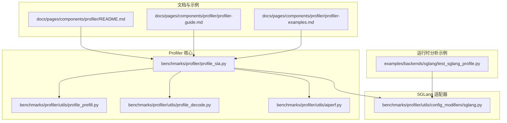
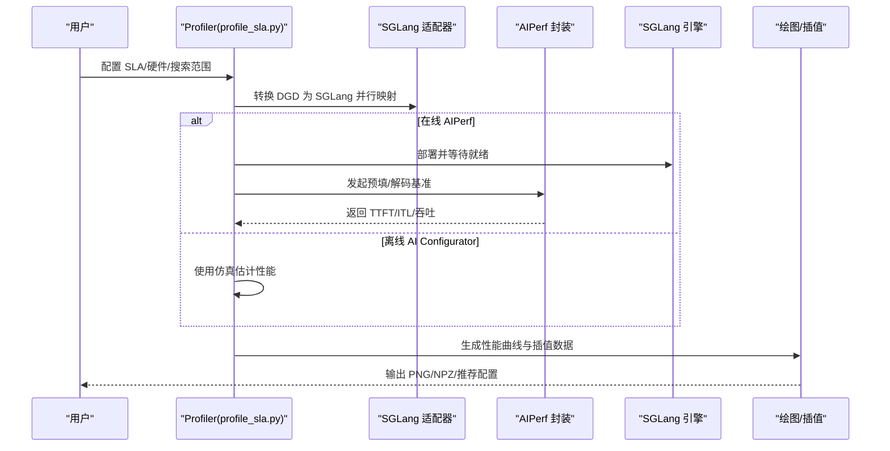
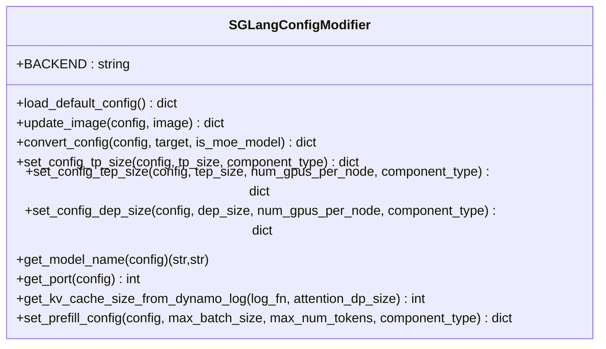
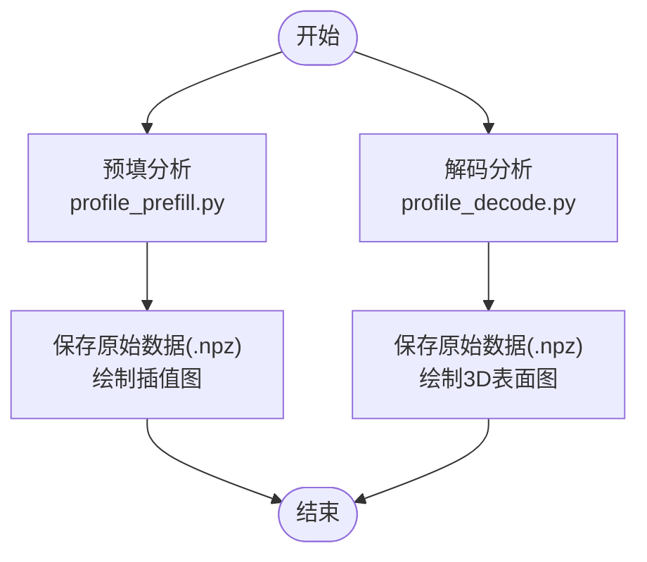
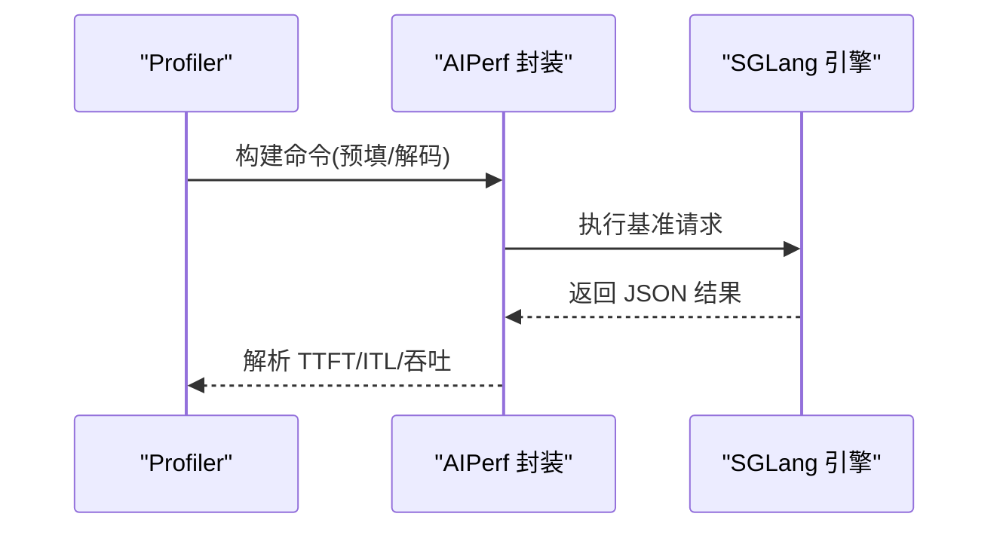
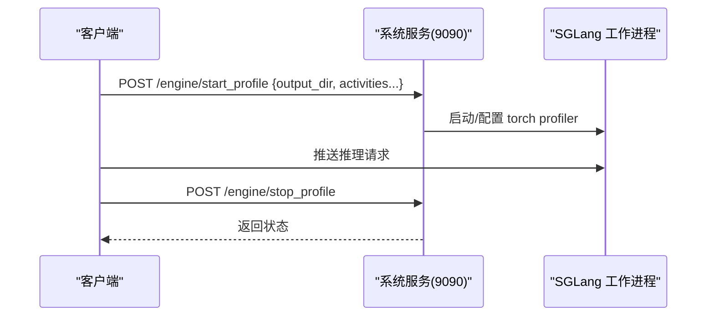
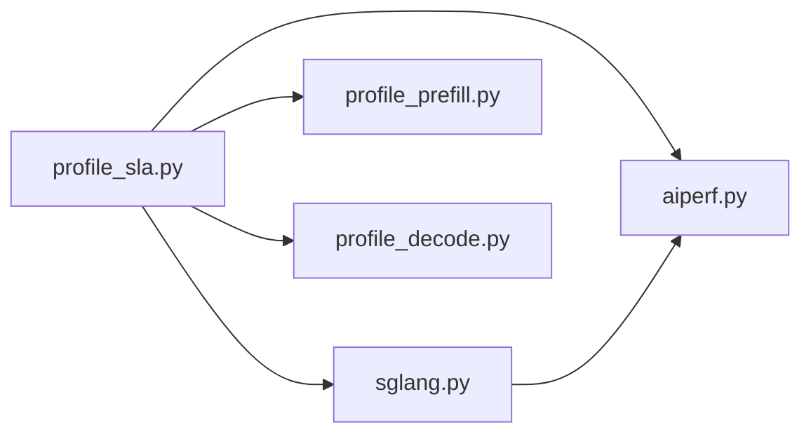

# 性能分析与调优

<cite>
**本文引用的文件**
- [benchmarks/profiler/README.md](file://benchmarks/profiler/README.md)
- [docs/pages/components/profiler/README.md](file://docs/pages/components/profiler/README.md)
- [docs/pages/components/profiler/profiler-guide.md](file://docs/pages/components/profiler/profiler-guide.md)
- [docs/pages/components/profiler/profiler-examples.md](file://docs/pages/components/profiler/profiler-examples.md)
- [benchmarks/profiler/profile_sla.py](file://benchmarks/profiler/profile_sla.py)
- [benchmarks/profiler/utils/profile_prefill.py](file://benchmarks/profiler/utils/profile_prefill.py)
- [benchmarks/profiler/utils/profile_decode.py](file://benchmarks/profiler/utils/profile_decode.py)
- [benchmarks/profiler/utils/aiperf.py](file://benchmarks/profiler/utils/aiperf.py)
- [benchmarks/profiler/utils/config_modifiers/sglang.py](file://benchmarks/profiler/utils/config_modifiers/sglang.py)
- [examples/backends/sglang/test_sglang_profile.py](file://examples/backends/sglang/test_sglang_profile.py)
</cite>

## 目录
1. [简介](#简介)
2. [项目结构](#项目结构)
3. [核心组件](#核心组件)
4. [架构总览](#架构总览)
5. [详细组件分析](#详细组件分析)
6. [依赖关系分析](#依赖关系分析)
7. [性能考量](#性能考量)
8. [故障排查指南](#故障排查指南)
9. [结论](#结论)
10. [附录](#附录)

## 简介
本文件面向使用 Dynamo 平台的 SGLang 后端性能分析与调优，系统性介绍如何利用 Dynamo Profiler 对 SGLang 进行性能评估与优化。内容覆盖关键性能指标（TTFT、ITL、吞吐）、基准测试方法（AIPerf 在线测量与 AI Configurator 离线仿真）、运行时分析（SGLang 工作进程 HTTP 端点）以及针对 SGLang 的调优策略（参数、资源配置、架构优化）。文末提供基于仓库中现有脚本与示例的实操案例与对比分析思路。

## 项目结构
围绕 SGLang 性能分析与调优，相关代码主要分布在以下区域：
- 文档与示例：docs/pages/components/profiler/* 提供概览、指南、示例与故障排查
- Profiler 核心：benchmarks/profiler/* 实现在线/离线性能扫描、插值与推荐
- SGLang 配置适配器：benchmarks/profiler/utils/config_modifiers/sglang.py 将 DGD 配置转换为 SGLang 可用的并行映射
- 基准测试工具：benchmarks/profiler/utils/aiperf.py 封装 AIPerf 命令与结果解析
- 运行时分析示例：examples/backends/sglang/test_sglang_profile.py 展示 SGLang 工作进程的运行时性能分析端点

图表来源
- [docs/pages/components/profiler/README.md](file://docs/pages/components/profiler/README.md#L1-L129)
- [docs/pages/components/profiler/profiler-guide.md](file://docs/pages/components/profiler/profiler-guide.md#L1-L648)
- [benchmarks/profiler/profile_sla.py](file://benchmarks/profiler/profile_sla.py#L1-L869)
- [benchmarks/profiler/utils/profile_prefill.py](file://benchmarks/profiler/utils/profile_prefill.py#L1-L140)
- [benchmarks/profiler/utils/profile_decode.py](file://benchmarks/profiler/utils/profile_decode.py#L1-L169)
- [benchmarks/profiler/utils/aiperf.py](file://benchmarks/profiler/utils/aiperf.py#L1-L374)
- [benchmarks/profiler/utils/config_modifiers/sglang.py](file://benchmarks/profiler/utils/config_modifiers/sglang.py#L1-L363)
- [examples/backends/sglang/test_sglang_profile.py](file://examples/backends/sglang/test_sglang_profile.py#L1-L297)

章节来源
- [benchmarks/profiler/README.md](file://benchmarks/profiler/README.md#L1-L14)
- [docs/pages/components/profiler/README.md](file://docs/pages/components/profiler/README.md#L1-L129)

## 核心组件
- Dynamo Profiler：自动化性能分析工具，支持 vLLM、SGLang、TensorRT-LLM，提供在线（AIPerf）与离线（AI Configurator）两种方法，生成预填（prefill）与解码（decode）插值数据，驱动 SLA 规划器自动扩缩容。
- SGLang 配置修改器：将通用 DGD 配置转换为 SGLang 的并行映射（TP/TEP/DEP），并在聚合模式下调整工作进程参数（如禁用/启用 radix cache、设置负载均衡方法等）。
- AIPerf 封装：统一构建 AIPerf 命令，执行预填与解码基准，解析输出 JSON，提取 TTFT、ITL、吞吐等指标。
- 运行时分析端点：SGLang 工作进程通过 /engine/start_profile 与 /engine/stop_profile 暴露运行时性能分析能力，结合环境变量控制输出目录与采集活动。

章节来源
- [docs/pages/components/profiler/README.md](file://docs/pages/components/profiler/README.md#L8-L20)
- [docs/pages/components/profiler/profiler-guide.md](file://docs/pages/components/profiler/profiler-guide.md#L161-L181)
- [benchmarks/profiler/utils/config_modifiers/sglang.py](file://benchmarks/profiler/utils/config_modifiers/sglang.py#L40-L158)
- [benchmarks/profiler/utils/aiperf.py](file://benchmarks/profiler/utils/aiperf.py#L40-L154)
- [examples/backends/sglang/test_sglang_profile.py](file://examples/backends/sglang/test_sglang_profile.py#L148-L224)

## 架构总览
下图展示从用户请求到性能数据产出与可视化的主要流程，涵盖在线与离线两种路径，并突出 SGLang 的配置转换与运行时分析。

图表来源
- [benchmarks/profiler/profile_sla.py](file://benchmarks/profiler/profile_sla.py#L139-L800)
- [benchmarks/profiler/utils/aiperf.py](file://benchmarks/profiler/utils/aiperf.py#L170-L374)
- [benchmarks/profiler/utils/config_modifiers/sglang.py](file://benchmarks/profiler/utils/config_modifiers/sglang.py#L54-L158)

## 详细组件分析

### 组件一：SGLang 配置修改器（SGlangConfigModifier）
该组件负责将通用 DGD 配置转换为 SGLang 可用的引擎配置，支持：
- 预填/解码阶段的并行映射设置（TP/TEP/DEP）
- 资源与参数注入（--tp/--ep/--dp 等）
- 聚合模式下的工作进程参数调整（radix cache、round_robin 路由）

图表来源
- [benchmarks/profiler/utils/config_modifiers/sglang.py](file://benchmarks/profiler/utils/config_modifiers/sglang.py#L40-L363)

章节来源
- [benchmarks/profiler/utils/config_modifiers/sglang.py](file://benchmarks/profiler/utils/config_modifiers/sglang.py#L54-L158)

### 组件二：预填与解码性能分析（profile_prefill/profile_decode）
- 预填：在不同输入序列长度（ISL）下测量 TTFT 与每 GPU 吞吐，保存原始数据并绘制插值曲线。
- 解码：在不同并发数与 KV 使用率下测量 ITL 与每 GPU 吞吐，生成三维表面图与插值数据。

图表来源
- [benchmarks/profiler/utils/profile_prefill.py](file://benchmarks/profiler/utils/profile_prefill.py#L24-L81)
- [benchmarks/profiler/utils/profile_decode.py](file://benchmarks/profiler/utils/profile_decode.py#L40-L101)

章节来源
- [benchmarks/profiler/utils/profile_prefill.py](file://benchmarks/profiler/utils/profile_prefill.py#L84-L140)
- [benchmarks/profiler/utils/profile_decode.py](file://benchmarks/profiler/utils/profile_decode.py#L104-L169)

### 组件三：AIPerf 封装（aiperf.py）
- 统一封装 AIPerf 命令构建与执行，支持预填与解码两类场景
- 针对 DEP（数据并行注意力）预填，采用“波次”并发与归一化 TTFT 的策略
- 解码阶段先进行预热以跳过预填，再测量 ITL 与吞吐

图表来源
- [benchmarks/profiler/utils/aiperf.py](file://benchmarks/profiler/utils/aiperf.py#L170-L374)

章节来源
- [benchmarks/profiler/utils/aiperf.py](file://benchmarks/profiler/utils/aiperf.py#L211-L274)
- [benchmarks/profiler/utils/aiperf.py](file://benchmarks/profiler/utils/aiperf.py#L276-L311)

### 组件四：运行时性能分析（SGLang 工作进程端点）
- 通过 /engine/start_profile 与 /engine/stop_profile 控制 torch profiler 采集
- 支持 activities、with_stack、record_shapes 等参数
- 输出目录由环境变量 SGLANG_TORCH_PROFILER_DIR 指定，系统服务端口由 DYN_SYSTEM_PORT 指定

图表来源
- [examples/backends/sglang/test_sglang_profile.py](file://examples/backends/sglang/test_sglang_profile.py#L148-L224)

章节来源
- [examples/backends/sglang/test_sglang_profile.py](file://examples/backends/sglang/test_sglang_profile.py#L88-L145)
- [examples/backends/sglang/test_sglang_profile.py](file://examples/backends/sglang/test_sglang_profile.py#L156-L224)

## 依赖关系分析
- profile_sla.py 作为入口，协调配置修改器、AIPerf 封装与绘图/插值模块，完成预填/解码两阶段扫描与推荐
- SGLangConfigModifier 依赖通用配置协议与资源设置工具，实现 TP/TEP/DEP 参数注入
- AIPerf 封装依赖外部可执行程序 aiperf，负责真实引擎上的性能测量

图表来源
- [benchmarks/profiler/profile_sla.py](file://benchmarks/profiler/profile_sla.py#L25-L62)
- [benchmarks/profiler/utils/config_modifiers/sglang.py](file://benchmarks/profiler/utils/config_modifiers/sglang.py#L10-L24)
- [benchmarks/profiler/utils/aiperf.py](file://benchmarks/profiler/utils/aiperf.py#L16-L27)

章节来源
- [benchmarks/profiler/profile_sla.py](file://benchmarks/profiler/profile_sla.py#L1-L137)

## 性能考量
- 关键指标
  - TTFT（首 token 时间）：影响预填阶段 SLA，受输入长度、并行映射与注意力并行方式影响
  - ITL（相邻 token 间隔）：影响解码阶段 SLA，受并发、KV 缓存占用与上下文长度影响
  - 吞吐（tokens/s/GPU）：衡量资源利用率，用于 Pareto 最优选择
- 基准测试方法
  - 在线 AIPerf：在真实 GPU 上测量，精度最高，耗时较长（2-4 小时）
  - 离线 AI Configurator：快速估算（约 20-30 秒），适用于 TensorRT-LLM；SGLang 当前不支持
- 插值与推荐
  - 预填：按 ISL 插值 TTFT 与吞吐，生成推荐 TP
  - 解码：按 KV 使用率与上下文长度插值 ITL 与吞吐，生成推荐 TP
- SGLang 特定优化
  - 聚合模式下禁用/启用 radix cache 以平衡预填与解码
  - MoE 模型建议使用 round_robin 路由以提升 KV 复用与解码效率
  - DEP（数据并行注意力）预填需考虑波次并发与 TTFT 归一化

章节来源
- [docs/pages/components/profiler/profiler-guide.md](file://docs/pages/components/profiler/profiler-guide.md#L161-L181)
- [docs/pages/components/profiler/profiler-guide.md](file://docs/pages/components/profiler/profiler-guide.md#L420-L436)
- [benchmarks/profiler/utils/config_modifiers/sglang.py](file://benchmarks/profiler/utils/config_modifiers/sglang.py#L106-L148)
- [benchmarks/profiler/utils/aiperf.py](file://benchmarks/profiler/utils/aiperf.py#L226-L274)

## 故障排查指南
- 在线 AIPerf 耗时过长
  - 方案：降低搜索空间（min/max GPUs）、减少插值粒度
- SLA 无法满足
  - 方案：放宽 TTFT/ITL 目标、增加 GPU 资源、更换后端或模型
- AI Configurator 注意力头约束错误
  - 现象：断言失败，提示注意力头数需满足 ≥4 头/GPU
  - 方案：限制最大 TP（maxNumGpusPerEngine），或改用在线 AIPerf
- 镜像拉取失败
  - 方案：配置镜像拉取密钥（NVCR）
- 分析期间显存不足
  - 方案：降低 GPU 内存利用率、缩短最大上下文、跳过更大 TP 配置
- 后端不支持的并行映射
  - 方案：联系后端升级或约束搜索范围

章节来源
- [docs/pages/components/profiler/profiler-guide.md](file://docs/pages/components/profiler/profiler-guide.md#L558-L647)

## 结论
通过 Dynamo Profiler 与 SGLang 配置修改器，可以系统地完成 SGLang 的性能评估与优化。建议优先使用在线 AIPerf 获取真实性能数据，结合插值与推荐生成最优并行映射；在运行时使用 /engine/start_profile 端点进行细粒度分析。针对 SGLang 的特性（聚合模式、MoE 路由、KV 复用），应合理设置 radix cache、路由策略与并行映射，以获得更优的 TTFT 与 ITL 表现。

## 附录

### 实战案例与对比分析思路
- 案例一：SGLang 在线 AIPerf 预填/解码扫描
  - 步骤：准备 DGD 配置（参考 SGLang 示例部署文件），运行 profile_sla.py，观察预填/解码性能图与推荐配置
  - 对比：对比不同 TP/TEP/DEP 设置下的 TTFT 与 ITL，选择满足 SLA 且吞吐最高的组合
- 案例二：SGLang 运行时分析
  - 步骤：启动前端与 SGLang 后端，设置 SGLANG_TORCH_PROFILER_DIR 与 DYN_SYSTEM_PORT，调用 /engine/start_profile 与 /engine/stop_profile，导出 traces 并在 Perfetto/TensorBoard 查看
  - 对比：对比开启/关闭 radix cache、不同并发下的 CPU/GPU 利用情况与关键算子耗时

章节来源
- [docs/pages/components/profiler/profiler-examples.md](file://docs/pages/components/profiler/profiler-examples.md#L222-L284)
- [examples/backends/sglang/test_sglang_profile.py](file://examples/backends/sglang/test_sglang_profile.py#L148-L224)