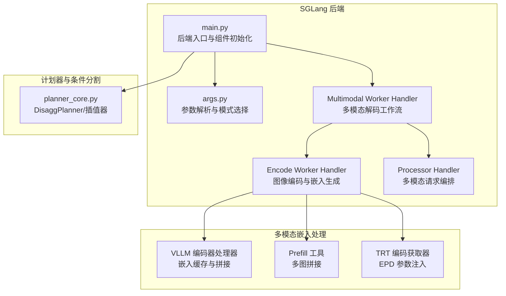
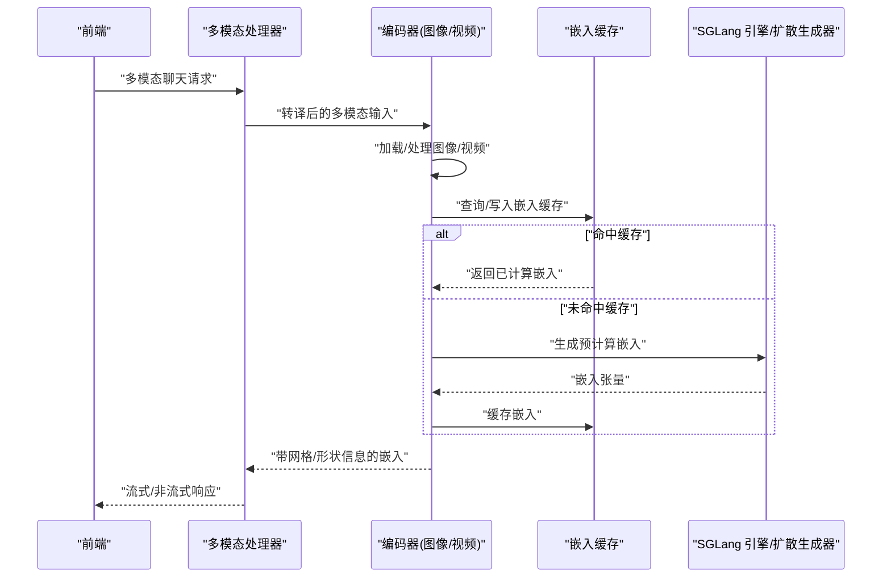
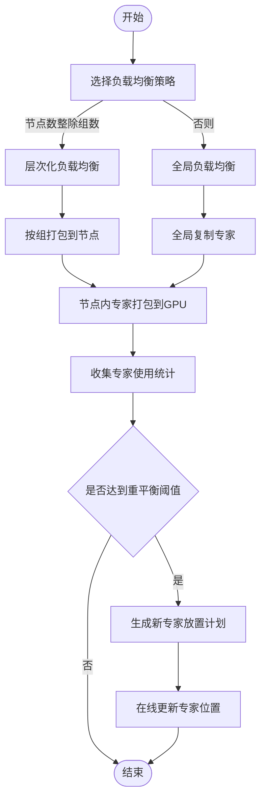
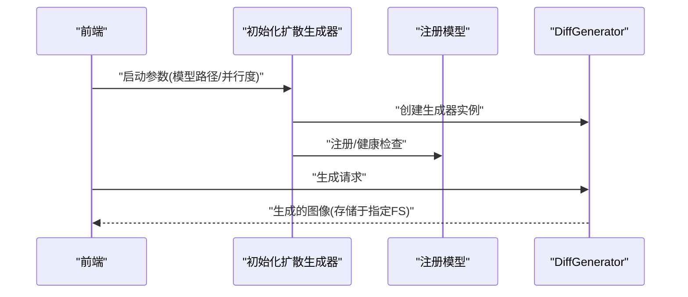
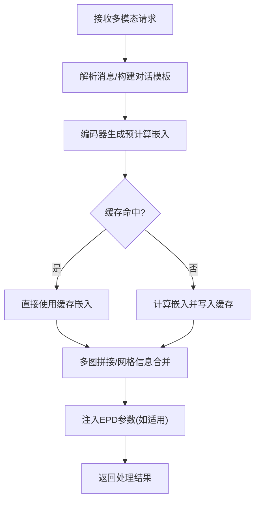
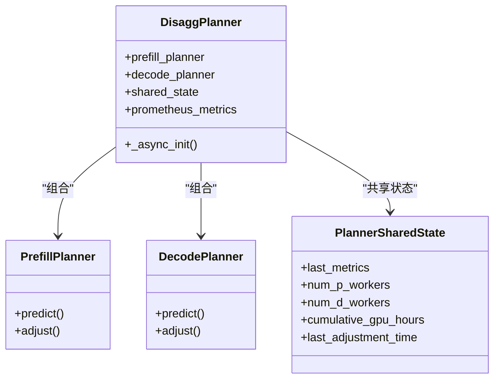
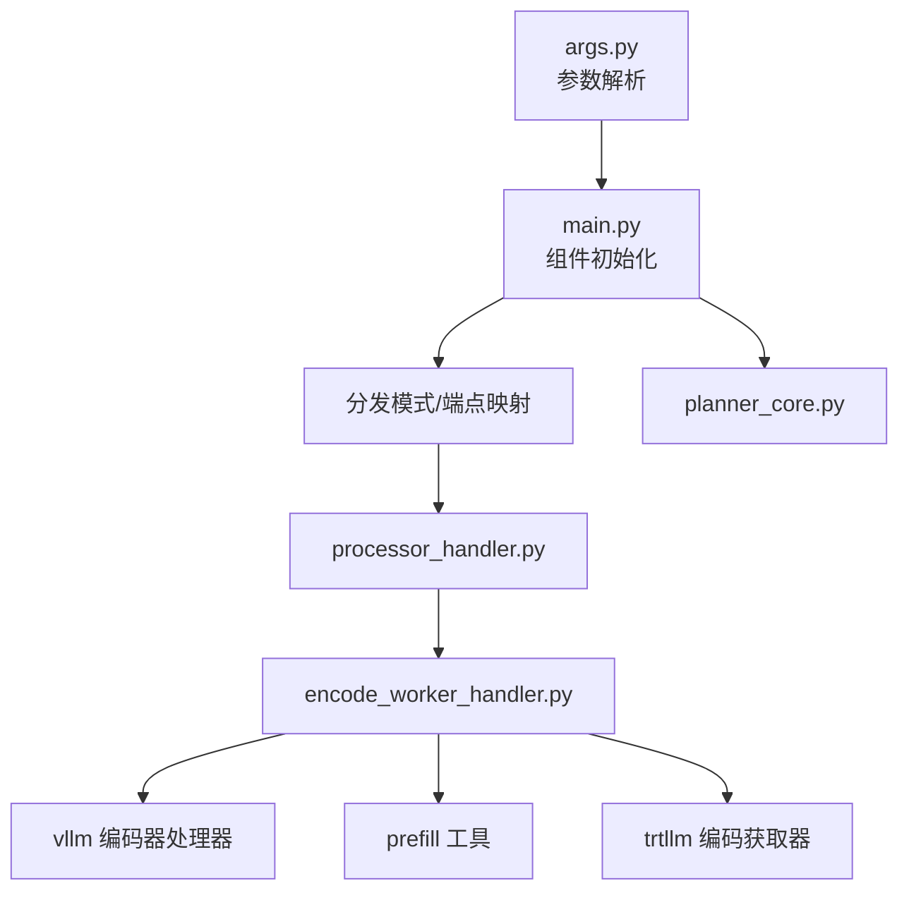

# 高级功能特性

<cite>
**本文引用的文件**
- [components/src/dynamo/sglang/main.py](file://components/src/dynamo/sglang/main.py)
- [components/src/dynamo/sglang/args.py](file://components/src/dynamo/sglang/args.py)
- [components/src/dynamo/sglang/request_handlers/multimodal/worker_handler.py](file://components/src/dynamo/sglang/request_handlers/multimodal/worker_handler.py)
- [components/src/dynamo/sglang/request_handlers/multimodal/encode_worker_handler.py](file://components/src/dynamo/sglang/request_handlers/multimodal/encode_worker_handler.py)
- [components/src/dynamo/sglang/request_handlers/multimodal/processor_handler.py](file://components/src/dynamo/sglang/request_handlers/multimodal/processor_handler.py)
- [components/src/dynamo/vllm/multimodal_handlers/encode_worker_handler.py](file://components/src/dynamo/vllm/multimodal_handlers/encode_worker_handler.py)
- [components/src/dynamo/vllm/multimodal_utils/prefill_worker_utils.py](file://components/src/dynamo/vllm/multimodal_utils/prefill_worker_utils.py)
- [components/src/dynamo/trtllm/multimodal/embedding_fetcher.py](file://components/src/dynamo/trtllm/multimodal/embedding_fetcher.py)
- [components/src/dynamo/planner/utils/planner_core.py](file://components/src/dynamo/planner/utils/planner_core.py)
- [docs/pages/backends/sglang/expert-distribution-eplb.md](file://docs/pages/backends/sglang/expert-distribution-eplb.md)
- [docs/pages/features/multimodal/multimodal-sglang.md](file://docs/pages/features/multimodal/multimodal-sglang.md)
- [examples/backends/sglang/deploy/README.md](file://examples/backends/sglang/deploy/README.md)
- [lib/llm/src/preprocessor.rs](file://lib/llm/src/preprocessor.rs)
</cite>

## 目录
1. [简介](#简介)
2. [项目结构](#项目结构)
3. [核心组件](#核心组件)
4. [架构总览](#架构总览)
5. [详细组件分析](#详细组件分析)
6. [依赖关系分析](#依赖关系分析)
7. [性能考量](#性能考量)
8. [故障排除指南](#故障排除指南)
9. [结论](#结论)
10. [附录](#附录)

## 简介
本文件系统化梳理 SGLang 在 Dynamo 中支持的高级功能特性，重点覆盖以下方面：
- 专家分布与 EPLB（Expert Parallelism Load Balancer）
- 图像扩散模型支持与实现要点
- 嵌入向量生成的特殊处理机制
- 条件分割（Conditional Disaggregation）的实现原理与使用场景
- 配置示例、性能收益与最佳实践

目标是帮助读者快速理解这些能力的工作原理、适用场景与落地方法，并提供排障与优化建议。

## 项目结构
围绕高级功能，相关代码主要分布在如下模块：
- 后端入口与多模态链路：SGLang 主进程、参数解析、多模态处理器与编码器
- 多模态嵌入缓存与预处理：VLLM/TensorRT LLM 的嵌入缓存与拼接逻辑
- 计划器与条件分割：规划器对预填/解码阶段的资源分配与调度
- 文档与部署：专家分布与 EPLB 的设计文档、多模态工作流文档、Kubernetes 部署模板

**图表来源**
- [components/src/dynamo/sglang/main.py](file://components/src/dynamo/sglang/main.py#L191-L233)
- [components/src/dynamo/sglang/args.py](file://components/src/dynamo/sglang/args.py#L308-L605)
- [components/src/dynamo/sglang/request_handlers/multimodal/worker_handler.py](file://components/src/dynamo/sglang/request_handlers/multimodal/worker_handler.py#L258-L286)
- [components/src/dynamo/sglang/request_handlers/multimodal/encode_worker_handler.py](file://components/src/dynamo/sglang/request_handlers/multimodal/encode_worker_handler.py#L82-L146)
- [components/src/dynamo/vllm/multimodal_handlers/encode_worker_handler.py](file://components/src/dynamo/vllm/multimodal_handlers/encode_worker_handler.py#L137-L240)
- [components/src/dynamo/vllm/multimodal_utils/prefill_worker_utils.py](file://components/src/dynamo/vllm/multimodal_utils/prefill_worker_utils.py#L90-L117)
- [components/src/dynamo/trtllm/multimodal/embedding_fetcher.py](file://components/src/dynamo/trtllm/multimodal/embedding_fetcher.py#L83-L121)
- [components/src/dynamo/planner/utils/planner_core.py](file://components/src/dynamo/planner/utils/planner_core.py#L859-L888)

**章节来源**
- [components/src/dynamo/sglang/main.py](file://components/src/dynamo/sglang/main.py#L191-L233)
- [components/src/dynamo/sglang/args.py](file://components/src/dynamo/sglang/args.py#L308-L605)

## 核心组件
- 后端入口与组件初始化：根据运行模式（聚合/预填/解码）与组件类型（多模态/嵌入/扩散等）选择对应的初始化流程，统一注册健康检查与指标发布。
- 参数解析与模式选择：解析 SGLang 与 Dynamo 双侧参数，自动推断服务端点、分发模式与令牌化策略。
- 多模态工作流：多模态处理器负责将用户消息转换为 SGLang 对话格式；编码器负责图像/视频嵌入生成与缓存；解码工作流将嵌入传递给下游引擎。
- 计划器与条件分割：DisaggPlanner 在预填/解码阶段分别进行资源预测与调整，结合插值器与 GPU 预算约束，动态决定副本数与负载分配。

**章节来源**
- [components/src/dynamo/sglang/main.py](file://components/src/dynamo/sglang/main.py#L235-L407)
- [components/src/dynamo/sglang/args.py](file://components/src/dynamo/sglang/args.py#L195-L218)
- [components/src/dynamo/planner/utils/planner_core.py](file://components/src/dynamo/planner/utils/planner_core.py#L859-L888)

## 架构总览
下图展示 SGLang 在 Dynamo 中的高级功能交互路径：从前端到多模态编码器，再到嵌入缓存与预处理，最终进入解码或扩散生成。

**图表来源**
- [components/src/dynamo/sglang/request_handlers/multimodal/processor_handler.py](file://components/src/dynamo/sglang/request_handlers/multimodal/processor_handler.py#L84-L119)
- [components/src/dynamo/sglang/request_handlers/multimodal/encode_worker_handler.py](file://components/src/dynamo/sglang/request_handlers/multimodal/encode_worker_handler.py#L82-L146)
- [components/src/dynamo/vllm/multimodal_handlers/encode_worker_handler.py](file://components/src/dynamo/vllm/multimodal_handlers/encode_worker_handler.py#L137-L240)

## 详细组件分析

### 专家分布与 EPLB（Expert Parallelism Load Balancer）
- 背景与动机：MoE 模型通过专家并行将专家分布到多个 GPU，但不同专家的负载差异会导致瓶颈与资源浪费。EPLB 通过冗余专家与组受限路由，动态重平衡专家位置。
- 关键概念
  - 冗余专家：为高负载专家创建副本，扩大可调度池。
  - 组受限路由：利用专家分组特性，尽量同组专家落在同一节点，降低跨节点流量。
  - 两种策略：层次化负载均衡（节点数整除专家组时）与全局负载均衡（其他情况）。
- 实现要点
  - 动态重平衡：通过开关启用后台管理器，按迭代次数周期性触发。
  - 使用记录：通过记录器收集专家使用统计，支持 per_token/per_pass/stat/stat_approx 等模式。
  - 初始化布局：支持从外部文件或 JSON 字符串加载初始专家布局，否则采用顺序布局。
- 适用场景
  - 预填阶段：专家并行较小，优先使用层次化策略。
  - 解码阶段：专家并行较大，优先使用全局策略。
- 性能收益
  - 平衡 GPU 利用率，减少等待时间，提升吞吐与尾延迟表现。
  - 降低内存占用与无效计算，提高整体资源效率。

**图表来源**
- [docs/pages/backends/sglang/expert-distribution-eplb.md](file://docs/pages/backends/sglang/expert-distribution-eplb.md#L12-L52)

**章节来源**
- [docs/pages/backends/sglang/expert-distribution-eplb.md](file://docs/pages/backends/sglang/expert-distribution-eplb.md#L6-L62)

### 图像扩散模型支持
- 支持方式：SGLang 提供独立的扩散生成器（DiffGenerator），不依赖传统 Transformer 引擎，直接用于图像生成任务。
- 关键流程
  - 初始化扩散生成器，设置张量并行/数据并行规模与分布式超时。
  - 注册模型并提供健康检查载荷，支持文件系统存储生成图像。
- 适用场景
  - 需要高性能图像生成的推理服务，支持多 GPU 并行与分布式部署。
- 配置要点
  - 必须提供模型路径与文件系统 URL。
  - 可配置并行度与分布式参数以适配硬件拓扑。

**图表来源**
- [components/src/dynamo/sglang/main.py](file://components/src/dynamo/sglang/main.py#L562-L644)

**章节来源**
- [components/src/dynamo/sglang/main.py](file://components/src/dynamo/sglang/main.py#L562-L644)

### 嵌入向量生成的特殊处理机制
- 文本嵌入预处理：针对 OpenAI 兼容接口的嵌入请求，统一进行文本/批量文本/整数数组/整数数组列表的预处理，必要时调用分词器。
- 多模态嵌入缓存与复用：编码器在本地缓存图像嵌入，命中则直接复用，未命中则计算并写回缓存，显著降低重复计算开销。
- 多图拼接：在预填阶段，将多张图片的嵌入与网格信息拼接到一起，便于后续统一处理。
- EPD 参数注入：在 TRT 后端，从编码器响应中提取专家分布相关参数，注入到解码请求，支撑条件分割与专家并行。

**图表来源**
- [components/src/dynamo/sglang/request_handlers/multimodal/processor_handler.py](file://components/src/dynamo/sglang/request_handlers/multimodal/processor_handler.py#L84-L119)
- [components/src/dynamo/vllm/multimodal_handlers/encode_worker_handler.py](file://components/src/dynamo/vllm/multimodal_handlers/encode_worker_handler.py#L137-L240)
- [components/src/dynamo/vllm/multimodal_utils/prefill_worker_utils.py](file://components/src/dynamo/vllm/multimodal_utils/prefill_worker_utils.py#L90-L117)
- [components/src/dynamo/trtllm/multimodal/embedding_fetcher.py](file://components/src/dynamo/trtllm/multimodal/embedding_fetcher.py#L83-L121)

**章节来源**
- [lib/llm/src/preprocessor.rs](file://lib/llm/src/preprocessor.rs#L543-L577)
- [components/src/dynamo/vllm/multimodal_handlers/encode_worker_handler.py](file://components/src/dynamo/vllm/multimodal_handlers/encode_worker_handler.py#L137-L240)
- [components/src/dynamo/vllm/multimodal_utils/prefill_worker_utils.py](file://components/src/dynamo/vllm/multimodal_utils/prefill_worker_utils.py#L90-L117)
- [components/src/dynamo/trtllm/multimodal/embedding_fetcher.py](file://components/src/dynamo/trtllm/multimodal/embedding_fetcher.py#L83-L121)

### 条件分割（Conditional Disaggregation）实现原理与使用场景
- 原理概述：条件分割在预填与解码阶段分别进行资源规划与调度，依据当前负载与性能指标，动态调整预填/解码副本数，以最小化端到端延迟并最大化吞吐。
- 关键组件
  - DisaggPlanner：封装预填/解码规划器，共享状态与连接器，统一进行资源预测与调整。
  - 插值器：基于历史观测（ISL/OSL、TTFT/ITL）进行性能插值，预测不同副本数下的指标。
  - GPU 预算约束：在总 GPU 数受限时，按比例缩放并保留最小端点副本数。
- 使用场景
  - 高并发、长尾延迟敏感的服务，需要在预填与解码之间动态分配资源。
  - 多模型/多端点共享集群，需在预算约束下进行公平与高效分配。

**图表来源**
- [components/src/dynamo/planner/utils/planner_core.py](file://components/src/dynamo/planner/utils/planner_core.py#L859-L888)

**章节来源**
- [components/src/dynamo/planner/utils/planner_core.py](file://components/src/dynamo/planner/utils/planner_core.py#L859-L888)

## 依赖关系分析
- 运行模式与端点绑定：根据分发模式（聚合/预填/解码）与组件类型（多模态/嵌入/扩散），自动选择默认端点与健康检查载荷。
- 多模态链路依赖：处理器依赖编码器客户端；编码器依赖视觉模型与分词器；解码工作流依赖引擎或扩散生成器。
- 计划器依赖：DisaggPlanner 依赖 Prometheus 客户端与连接器，共享状态在预填/解码间复用。

**图表来源**
- [components/src/dynamo/sglang/args.py](file://components/src/dynamo/sglang/args.py#L431-L453)
- [components/src/dynamo/sglang/main.py](file://components/src/dynamo/sglang/main.py#L229-L233)
- [components/src/dynamo/planner/utils/planner_core.py](file://components/src/dynamo/planner/utils/planner_core.py#L859-L888)

**章节来源**
- [components/src/dynamo/sglang/args.py](file://components/src/dynamo/sglang/args.py#L431-L453)
- [components/src/dynamo/sglang/main.py](file://components/src/dynamo/sglang/main.py#L229-L233)

## 性能考量
- 专家分布与 EPLB
  - 选择合适的记录模式：小批量/低延迟场景优先 stat_approx；稳定批大小场景可用 stat。
  - 合理设置重平衡频率：避免过于频繁导致额外开销，同时保证及时收敛。
  - 初始布局：若已有代表性负载分析，建议使用初始化布局以缩短收敛时间。
- 多模态嵌入缓存
  - 缓存键一致性：确保输入 URL 一致时命中缓存，避免重复计算。
  - 批量拼接：在预填阶段合并多图嵌入，减少跨组件传输与处理开销。
- 条件分割
  - 观测指标质量：TTFT/ITL/ISL/OSL 的稳定性直接影响预测精度。
  - GPU 预算与最小副本：在预算紧张时，优先保障最小端点副本数，再按比例缩放。

[本节为通用指导，无需特定文件引用]

## 故障排除指南
- 多模态请求无图像/视频输入
  - 现象：处理器抛出“缺少图像/视频 URL”的错误。
  - 排查：确认请求消息中至少包含一个图像或视频 URL。
- 编码器未就绪
  - 现象：处理器等待编码器实例超时。
  - 排查：确认编码器组件已启动且可被发现；检查命名空间与端点配置。
- 健康检查失败
  - 现象：前端健康检查返回异常。
  - 排查：查看模型加载日志、并行度配置与 GPU 资源；适当增加初始延迟。
- EPLB 未生效
  - 现象：专家负载不均衡，延迟上升。
  - 排查：确认已启用动态重平衡与使用记录器；检查记录模式与缓冲区大小；验证初始布局是否合理。
- Kubernetes 部署问题
  - 现象：Pod 启动失败、GPU 分配异常。
  - 排查：检查镜像仓库访问、HuggingFace 密钥 Secret、GPU 节点与资源限制。

**章节来源**
- [components/src/dynamo/sglang/request_handlers/multimodal/processor_handler.py](file://components/src/dynamo/sglang/request_handlers/multimodal/processor_handler.py#L84-L91)
- [components/src/dynamo/sglang/request_handlers/multimodal/worker_handler.py](file://components/src/dynamo/sglang/request_handlers/multimodal/worker_handler.py#L266-L271)
- [examples/backends/sglang/deploy/README.md](file://examples/backends/sglang/deploy/README.md#L153-L163)

## 结论
SGLang 在 Dynamo 中通过专家分布与 EPLB、图像扩散支持、多模态嵌入缓存与拼接、以及条件分割等高级能力，实现了高吞吐、低延迟与资源高效的推理服务。结合合理的配置与监控，可在复杂生产环境中获得稳定的性能收益。

[本节为总结性内容，无需特定文件引用]

## 附录
- 快速参考
  - 多模态工作流文档：[多模态 SGLang 工作流](file://docs/pages/features/multimodal/multimodal-sglang.md#L71-L115)
  - 专家分布与 EPLB 设计文档：[专家分布与 EPLB](file://docs/pages/backends/sglang/expert-distribution-eplb.md#L6-L62)
  - SGLang 部署模板：[Kubernetes 部署说明](file://examples/backends/sglang/deploy/README.md#L1-L163)

[本节为补充材料，无需特定文件引用]