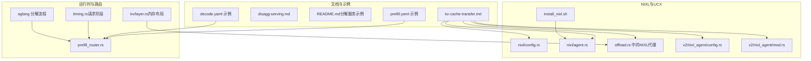
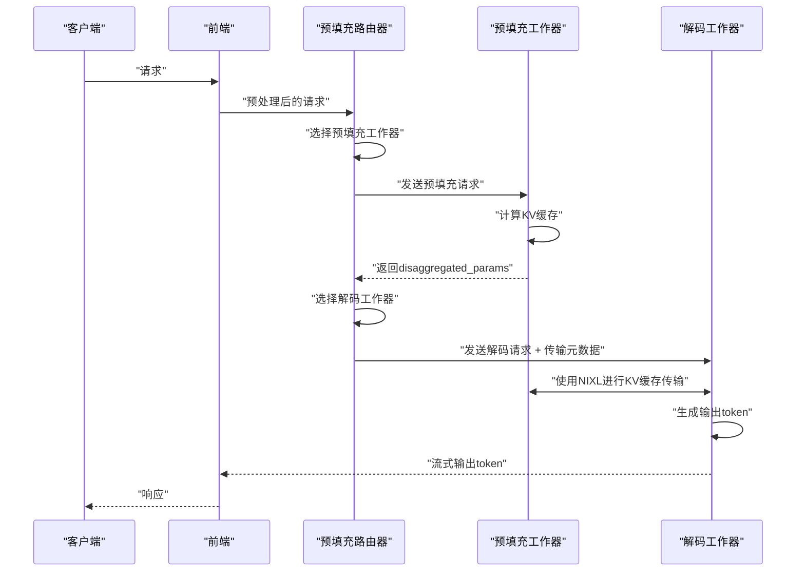
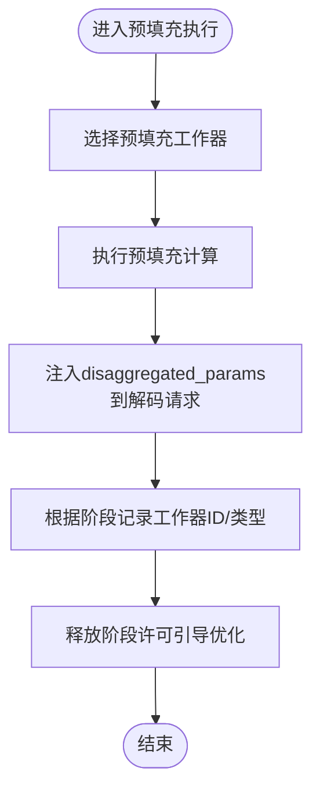
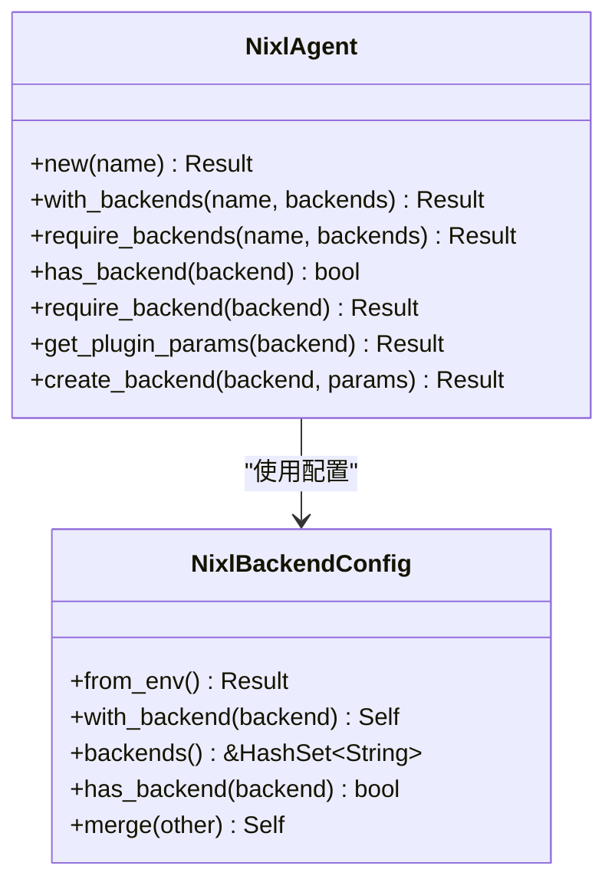
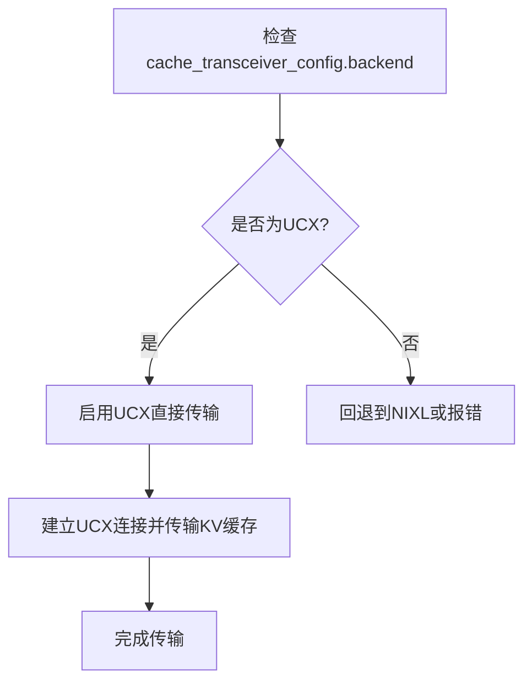
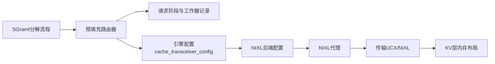

# KV缓存传输机制

<cite>
**本文引用的文件**
- [kv-cache-transfer.md](file://docs/pages/backends/trtllm/kv-cache-transfer.md)
- [disagg-serving.md](file://docs/pages/design-docs/disagg-serving.md)
- [README.md（分解服务示例）](file://examples/basics/disaggregated_serving/README.md)
- [prefill.yaml（示例）](file://examples/backends/trtllm/engine_configs/deepseek-r1/disagg/simple/prefill.yaml)
- [decode.yaml（示例）](file://examples/backends/trtllm/engine_configs/deepseek-r1/disagg/simple/decode.yaml)
- [tuning.md](file://docs/pages/performance/tuning.md)
- [config.rs（NIXL后端配置）](file://lib/memory/src/nixl/config.rs)
- [agent.rs（NIXL代理）](file://lib/memory/src/nixl/agent.rs)
- [offload.rs（离线管理器中的NIXL代理）](file://lib/llm/src/block_manager/offload.rs)
- [config.rs（新版本NIXL后端配置）](file://lib/llm/src/block_manager/v2/physical/transfer/nixl_agent/config.rs)
- [mod.rs（新版本NIXL代理模块）](file://lib/llm/src/block_manager/v2/physical/transfer/nixl_agent/mod.rs)
- [install_nixl.sh](file://container/deps/trtllm/install_nixl.sh)
- [timing.rs（请求阶段与工作器记录）](file://lib/llm/src/protocols/common/timing.rs)
- [prefill_router.rs（预填充路由器）](file://lib/llm/src/kv_router/prefill_router.rs)
- [layer.rs（KV层内存布局）](file://lib/llm/src/kv/layer.rs)
- [README.md（SGlang分解）](file://docs/pages/backends/sglang/sglang-disaggregation.md)
</cite>

## 目录
1. [引言](#引言)
2. [项目结构](#项目结构)
3. [核心组件](#核心组件)
4. [架构总览](#架构总览)
5. [详细组件分析](#详细组件分析)
6. [依赖关系分析](#依赖关系分析)
7. [性能考量](#性能考量)
8. [故障排查指南](#故障排查指南)
9. [结论](#结论)
10. [附录](#附录)

## 引言
本文件围绕TensorRT-LLM在分割式服务中的KV缓存传输机制展开，重点说明预填充（Prefill）与解码（Decode）阶段之间的高效数据搬运路径。文档将系统性解析NIXL与UCX两种传输方法的技术原理、性能特征与配置要点，对比其在延迟、带宽与稳定性上的差异，并给出可操作的配置指南、网络拓扑优化建议、故障恢复策略、性能测试方法与调优建议。最终帮助用户基于自身硬件与负载特征，做出正确的传输方案选择并实施落地。

## 项目结构
围绕KV缓存传输的关键目录与文件如下：
- 文档与设计：docs/pages/backends/trtllm/kv-cache-transfer.md、docs/pages/design-docs/disagg-serving.md、examples/basics/disaggregated_serving/README.md
- 配置与引擎：examples/backends/trtllm/engine_configs/deepseek-r1/disagg/simple/{prefill.yaml, decode.yaml}
- 性能与调优：docs/pages/performance/tuning.md
- NIXL后端配置与代理：lib/memory/src/nixl/config.rs、lib/memory/src/nixl/agent.rs、lib/llm/src/block_manager/offload.rs、lib/llm/src/block_manager/v2/physical/transfer/nixl_agent/{config.rs, mod.rs}
- 安装脚本：container/deps/trtllm/install_nixl.sh
- 关键运行时：lib/llm/src/protocols/common/timing.rs、lib/llm/src/kv_router/prefill_router.rs、lib/llm/src/kv/layer.rs
- SGraml分解流程参考：docs/pages/backends/sglang/sglang-disaggregation.md

**图表来源**
- [kv-cache-transfer.md](file://docs/pages/backends/trtllm/kv-cache-transfer.md#L1-L27)
- [disagg-serving.md](file://docs/pages/design-docs/disagg-serving.md#L21-L53)
- [prefill.yaml](file://examples/backends/trtllm/engine_configs/deepseek-r1/disagg/simple/prefill.yaml#L38-L40)
- [decode.yaml](file://examples/backends/trtllm/engine_configs/deepseek-r1/disagg/simple/decode.yaml#L59-L61)
- [config.rs（NIXL后端配置）](file://lib/memory/src/nixl/config.rs#L1-L147)
- [agent.rs（NIXL代理）](file://lib/memory/src/nixl/agent.rs#L176-L203)
- [offload.rs（离线管理器中的NIXL代理）](file://lib/llm/src/block_manager/offload.rs#L748-L759)
- [config.rs（新版本NIXL后端配置）](file://lib/llm/src/block_manager/v2/physical/transfer/nixl_agent/config.rs#L1-L158)
- [mod.rs（新版本NIXL代理模块）](file://lib/llm/src/block_manager/v2/physical/transfer/nixl_agent/mod.rs#L236-L258)
- [install_nixl.sh](file://container/deps/trtllm/install_nixl.sh#L32-L80)
- [timing.rs（请求阶段与工作器记录）](file://lib/llm/src/protocols/common/timing.rs#L36-L58)
- [prefill_router.rs（预填充路由器）](file://lib/llm/src/kv_router/prefill_router.rs#L94-L109)
- [layer.rs（KV层内存布局）](file://lib/llm/src/kv/layer.rs#L1-L33)
- [README.md（SGraml分解）](file://docs/pages/backends/sglang/sglang-disaggregation.md#L33-L73)

**章节来源**
- [kv-cache-transfer.md](file://docs/pages/backends/trtllm/kv-cache-transfer.md#L1-L27)
- [disagg-serving.md](file://docs/pages/design-docs/disagg-serving.md#L21-L53)
- [README.md（分解服务示例）](file://examples/basics/disaggregated_serving/README.md#L149-L179)
- [prefill.yaml](file://examples/backends/trtllm/engine_configs/deepseek-r1/disagg/simple/prefill.yaml#L38-L40)
- [decode.yaml](file://examples/backends/trtllm/engine_configs/deepseek-r1/disagg/simple/decode.yaml#L59-L61)
- [tuning.md](file://docs/pages/performance/tuning.md#L1-L137)
- [config.rs（NIXL后端配置）](file://lib/memory/src/nixl/config.rs#L1-L147)
- [agent.rs（NIXL代理）](file://lib/memory/src/nixl/agent.rs#L176-L203)
- [offload.rs（离线管理器中的NIXL代理）](file://lib/llm/src/block_manager/offload.rs#L748-L759)
- [config.rs（新版本NIXL后端配置）](file://lib/llm/src/block_manager/v2/physical/transfer/nixl_agent/config.rs#L1-L158)
- [mod.rs（新版本NIXL代理模块）](file://lib/llm/src/block_manager/v2/physical/transfer/nixl_agent/mod.rs#L236-L258)
- [install_nixl.sh](file://container/deps/trtllm/install_nixl.sh#L32-L80)
- [timing.rs（请求阶段与工作器记录）](file://lib/llm/src/protocols/common/timing.rs#L36-L58)
- [prefill_router.rs（预填充路由器）](file://lib/llm/src/kv_router/prefill_router.rs#L94-L109)
- [layer.rs（KV层内存布局）](file://lib/llm/src/kv/layer.rs#L1-L33)
- [README.md（SGraml分解）](file://docs/pages/backends/sglang/sglang-disaggregation.md#L33-L73)

## 核心组件
- 预填充路由器（PrefillRouter）：负责在预填充阶段选择目标工作器、执行预填充计算并将disaggregated_params注入到解码请求中，同时记录当前阶段的工作器信息。
- 解码阶段与阶段切换：通过请求阶段（Prefill/Decode/Aggregated）决定记录哪个工作器ID字段，确保路由与统计正确。
- NIXL后端配置与代理：从环境变量提取后端配置，支持默认启用UCX，提供严格后端校验与插件参数获取能力。
- 离线管理器中的NIXL代理：在运行时初始化并创建UCX/GDS/POSIX后端，用于跨进程/跨设备的KV缓存传输。
- 引擎配置：通过cache_transceiver_config.backend控制传输后端（DEFAULT/UCX），并结合块大小、批大小等参数影响传输效率与稳定性。

**章节来源**
- [prefill_router.rs（预填充路由器）](file://lib/llm/src/kv_router/prefill_router.rs#L94-L109)
- [timing.rs（请求阶段与工作器记录）](file://lib/llm/src/protocols/common/timing.rs#L36-L58)
- [config.rs（NIXL后端配置）](file://lib/memory/src/nixl/config.rs#L1-L147)
- [agent.rs（NIXL代理）](file://lib/memory/src/nixl/agent.rs#L176-L203)
- [offload.rs（离线管理器中的NIXL代理）](file://lib/llm/src/block_manager/offload.rs#L748-L759)
- [prefill.yaml](file://examples/backends/trtllm/engine_configs/deepseek-r1/disagg/simple/prefill.yaml#L38-L40)
- [decode.yaml](file://examples/backends/trtllm/engine_configs/deepseek-r1/disagg/simple/decode.yaml#L59-L61)

## 架构总览
下图展示了TensorRT-LLM在分割式服务中的KV缓存传输总体流程，强调预填充与解码阶段之间的数据搬运与阶段切换：

**图表来源**
- [disagg-serving.md](file://docs/pages/design-docs/disagg-serving.md#L21-L53)
- [kv-cache-transfer.md](file://docs/pages/backends/trtllm/kv-cache-transfer.md#L10-L26)
- [prefill_router.rs（预填充路由器）](file://lib/llm/src/kv_router/prefill_router.rs#L345-L368)

## 详细组件分析

### 组件A：预填充路由器与阶段切换
- 职责：在预填充阶段选择工作器、执行预填充并注入disaggregated_params；在阶段切换时记录当前阶段的工作器ID与类型，确保后续路由与统计准确。
- 关键点：
  - 在非KV模式的引导优化路径中，先完成一次输出以释放阶段许可，再允许后续阶段变更。
  - 记录工作器ID与类型依赖于当前请求阶段（Prefill/Decode/Aggregated）。

**图表来源**
- [prefill_router.rs（预填充路由器）](file://lib/llm/src/kv_router/prefill_router.rs#L345-L368)
- [timing.rs（请求阶段与工作器记录）](file://lib/llm/src/protocols/common/timing.rs#L320-L347)

**章节来源**
- [prefill_router.rs（预填充路由器）](file://lib/llm/src/kv_router/prefill_router.rs#L94-L109)
- [prefill_router.rs（预填充路由器）](file://lib/llm/src/kv_router/prefill_router.rs#L345-L368)
- [timing.rs（请求阶段与工作器记录）](file://lib/llm/src/protocols/common/timing.rs#L320-L347)

### 组件B：NIXL后端配置与代理
- 技术原理：NIXL是NVIDIA面向分布式GPU环境的高性能通信库，支持UCX/Libfabric等后端。默认启用UCX，可通过环境变量或配置显式指定后端。
- 配置要点：
  - 从环境变量提取后端配置，支持大小写不敏感的后端名与布尔值解析。
  - 默认后端为UCX，若未显式配置。
  - 提供严格后端校验接口，确保所需后端可用。
- 运行时集成：
  - 离线管理器在运行时创建UCX/GDS/POSIX后端，用于跨进程/跨设备的KV缓存传输。
  - 新版本NIXL代理模块提供相同的配置与校验能力。

**图表来源**
- [config.rs（NIXL后端配置）](file://lib/memory/src/nixl/config.rs#L1-L147)
- [agent.rs（NIXL代理）](file://lib/memory/src/nixl/agent.rs#L176-L203)
- [offload.rs（离线管理器中的NIXL代理）](file://lib/llm/src/block_manager/offload.rs#L748-L759)
- [config.rs（新版本NIXL后端配置）](file://lib/llm/src/block_manager/v2/physical/transfer/nixl_agent/config.rs#L1-L158)
- [mod.rs（新版本NIXL代理模块）](file://lib/llm/src/block_manager/v2/physical/transfer/nixl_agent/mod.rs#L236-L258)

**章节来源**
- [config.rs（NIXL后端配置）](file://lib/memory/src/nixl/config.rs#L1-L147)
- [agent.rs（NIXL代理）](file://lib/memory/src/nixl/agent.rs#L176-L203)
- [offload.rs（离线管理器中的NIXL代理）](file://lib/llm/src/block_manager/offload.rs#L748-L759)
- [config.rs（新版本NIXL后端配置）](file://lib/llm/src/block_manager/v2/physical/transfer/nixl_agent/config.rs#L1-L158)
- [mod.rs（新版本NIXL代理模块）](file://lib/llm/src/block_manager/v2/physical/transfer/nixl_agent/mod.rs#L236-L258)

### 组件C：UCX直接传输（替代方案）
- 技术原理：UCX作为统一通信框架，可直接用于KV缓存传输，无需额外封装。需在引擎配置中明确设置cache_transceiver_config.backend为UCX。
- 注意事项：仅当配置为UCX时才启用，环境变量TRTLLM_USE_UCX_KVCACHE=1且backend为DEFAULT不会生效。

**图表来源**
- [kv-cache-transfer.md](file://docs/pages/backends/trtllm/kv-cache-transfer.md#L21-L26)

**章节来源**
- [kv-cache-transfer.md](file://docs/pages/backends/trtllm/kv-cache-transfer.md#L21-L26)

### 组件D：KV层内存布局与传输效率
- 内存布局建议：鼓励使用大块固定页内存或设备内存，以减少RDMA传输层的注册区域数量，降低开销并提升性能。
- 布局映射：按层数分配单个大张量或每层一个张量，有效映射到NIXL数据平面。

**章节来源**
- [layer.rs（KV层内存布局）](file://lib/llm/src/kv/layer.rs#L1-L33)

## 依赖关系分析
- 预填充路由器依赖请求阶段信息与工作器记录逻辑，确保在不同阶段正确选择与记录目标工作器。
- NIXL后端配置与代理贯穿安装、配置与运行时初始化，为KV缓存传输提供基础能力。
- 引擎配置（cache_transceiver_config.backend）直接影响传输后端选择与行为。
- SGraml分解流程提供了RDMA直连与轮询传输的参考实现，便于理解端到端KV传输链路。

**图表来源**
- [prefill_router.rs（预填充路由器）](file://lib/llm/src/kv_router/prefill_router.rs#L94-L109)
- [timing.rs（请求阶段与工作器记录）](file://lib/llm/src/protocols/common/timing.rs#L36-L58)
- [kv-cache-transfer.md](file://docs/pages/backends/trtllm/kv-cache-transfer.md#L10-L26)
- [config.rs（NIXL后端配置）](file://lib/memory/src/nixl/config.rs#L1-L147)
- [agent.rs（NIXL代理）](file://lib/memory/src/nixl/agent.rs#L176-L203)
- [layer.rs（KV层内存布局）](file://lib/llm/src/kv/layer.rs#L1-L33)
- [README.md（SGraml分解）](file://docs/pages/backends/sglang/sglang-disaggregation.md#L33-L73)

**章节来源**
- [prefill_router.rs（预填充路由器）](file://lib/llm/src/kv_router/prefill_router.rs#L94-L109)
- [timing.rs（请求阶段与工作器记录）](file://lib/llm/src/protocols/common/timing.rs#L36-L58)
- [kv-cache-transfer.md](file://docs/pages/backends/trtllm/kv-cache-transfer.md#L10-L26)
- [config.rs（NIXL后端配置）](file://lib/memory/src/nixl/config.rs#L1-L147)
- [agent.rs（NIXL代理）](file://lib/memory/src/nixl/agent.rs#L176-L203)
- [layer.rs（KV层内存布局）](file://lib/llm/src/kv/layer.rs#L1-L33)
- [README.md（SGraml分解）](file://docs/pages/backends/sglang/sglang-disaggregation.md#L33-L73)

## 性能考量
- 传输方法对比
  - NIXL（默认）：自动选择最优传输（NVLink/InfiniBand等），适合多节点/多GPU场景，具备零拷贝与GPU直传特性。
  - UCX（替代）：直接使用UCX进行传输，需在配置中显式开启，适合特定网络拓扑或已有UCX生态。
- 延迟与带宽
  - NIXL通常在多节点/高带宽网络下表现更佳，自动选择最佳路径。
  - UCX在单机/同机箱内具有较低启动开销，但在跨节点时可能不如NIXL灵活。
- 稳定性
  - NIXL在复杂拓扑下具备更强的自适应能力，错误恢复与重试策略更完善。
  - UCX稳定性依赖底层网络栈与驱动，需确保UCX版本与内核模块匹配。
- 参数与配置
  - 块大小（block size）：过小导致碎片化与频繁小块传输，过大降低前缀缓存命中率。建议从128开始评估。
  - 批大小与最大令牌数：预填充引擎偏好小批大令牌，解码引擎偏好大批小令牌；结合最大本地预填充长度与最大令牌数平衡ITL与TTFT。
  - 预填充引擎数量：在当前实现下，为最大化解码引擎KV缓存容量，建议尽量减少预填充引擎数量，并通过增大max-local-prefill-length将更多预填充请求“拼接”到解码阶段。

**章节来源**
- [kv-cache-transfer.md](file://docs/pages/backends/trtllm/kv-cache-transfer.md#L10-L26)
- [tuning.md](file://docs/pages/performance/tuning.md#L58-L97)
- [tuning.md](file://docs/pages/performance/tuning.md#L134-L137)

## 故障排查指南
- 后端不可用
  - 现象：NIXL代理要求后端失败或无法创建后端。
  - 处理：确认已安装并加载UCX，检查环境变量与构建脚本输出；必要时使用严格后端校验接口定位缺失后端。
- 传输失败或超时
  - 现象：解码阶段等待KV到达超时。
  - 处理：检查预填充工作器与解码工作器间的RDMA/UCX连接信息注册情况；确认NIXL代理已创建对应后端；核查网络拓扑与防火墙策略。
- 内存与块大小问题
  - 现象：传输性能低或内存碎片化严重。
  - 处理：调整块大小至128左右，确保KV层内存布局采用大块连续内存；避免过多小块注册。
- 阶段切换异常
  - 现象：工作器ID记录错误或路由异常。
  - 处理：确认请求阶段（Prefill/Decode/Aggregated）设置正确，检查阶段许可释放时机与记录逻辑。

**章节来源**
- [agent.rs（NIXL代理）](file://lib/memory/src/nixl/agent.rs#L176-L203)
- [offload.rs（离线管理器中的NIXL代理）](file://lib/llm/src/block_manager/offload.rs#L748-L759)
- [layer.rs（KV层内存布局）](file://lib/llm/src/kv/layer.rs#L1-L33)
- [timing.rs（请求阶段与工作器记录）](file://lib/llm/src/protocols/common/timing.rs#L320-L347)

## 结论
在TensorRT-LLM的分割式服务中，KV缓存传输是影响TTFT与ITL的关键环节。NIXL作为默认方案，在多节点与复杂拓扑下具备更强的自适应能力与性能优势；UCX则适合单机/同机箱场景，具备更低的启动开销。通过合理配置cache_transceiver_config.backend、优化块大小与批处理参数、并结合网络拓扑与故障恢复策略，可在保证稳定性的前提下显著提升吞吐与降低延迟。建议在生产环境中优先采用NIXL，并在特定场景下评估UCX的适用性。

## 附录

### A. 配置指南（KV缓存传输）
- 选择传输后端
  - 使用NIXL（默认）：保持cache_transceiver_config.backend为DEFAULT（或省略显式设置）。
  - 使用UCX（替代）：在引擎配置中设置cache_transceiver_config.backend为UCX。
- 环境变量与安装
  - 确保UCX已正确安装并加入动态链接库路径；安装脚本会自动构建并安装UCX与NIXL静态插件。
- 运行时后端校验
  - 使用NIXL代理的严格后端校验接口，确保所需后端可用后再启动传输。
- 内存与块大小
  - 采用大块连续内存布局，块大小建议从128开始评估；避免过多小块注册以减少传输开销。
- 阶段与路由
  - 正确设置请求阶段（Prefill/Decode/Aggregated），确保工作器ID记录与阶段切换逻辑一致。

**章节来源**
- [kv-cache-transfer.md](file://docs/pages/backends/trtllm/kv-cache-transfer.md#L10-L26)
- [prefill.yaml](file://examples/backends/trtllm/engine_configs/deepseek-r1/disagg/simple/prefill.yaml#L38-L40)
- [decode.yaml](file://examples/backends/trtllm/engine_configs/deepseek-r1/disagg/simple/decode.yaml#L59-L61)
- [install_nixl.sh](file://container/deps/trtllm/install_nixl.sh#L32-L80)
- [config.rs（NIXL后端配置）](file://lib/memory/src/nixl/config.rs#L1-L147)
- [agent.rs（NIXL代理）](file://lib/memory/src/nixl/agent.rs#L176-L203)
- [layer.rs（KV层内存布局）](file://lib/llm/src/kv/layer.rs#L1-L33)
- [timing.rs（请求阶段与工作器记录）](file://lib/llm/src/protocols/common/timing.rs#L36-L58)

### B. 实际性能测试与调优建议
- 测试工具
  - 使用AIPerf在容器内进行ISL/OSL/并发下的性能测试，结合SLA评估不同配置组合。
- 调优策略
  - 预填充引擎：追求最小饱和批大小以降低TTFT。
  - 解码引擎：平衡批大小与最大令牌数，控制ITL；结合max-local-prefill-length将更多预填充拼接到解码阶段。
  - 后端选择：NIXL适合多节点/高带宽；UCX适合单机/同机箱。
- 参考资源
  - 性能调优文档与预填充时间曲线图，指导参数选择。

**章节来源**
- [tuning.md](file://docs/pages/performance/tuning.md#L1-L137)