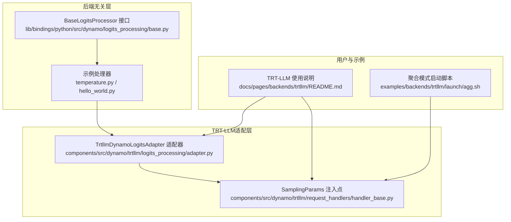
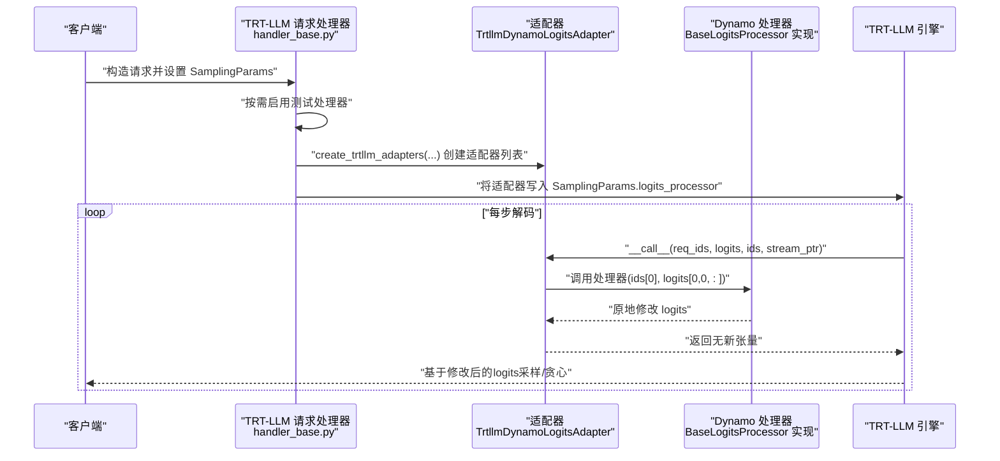
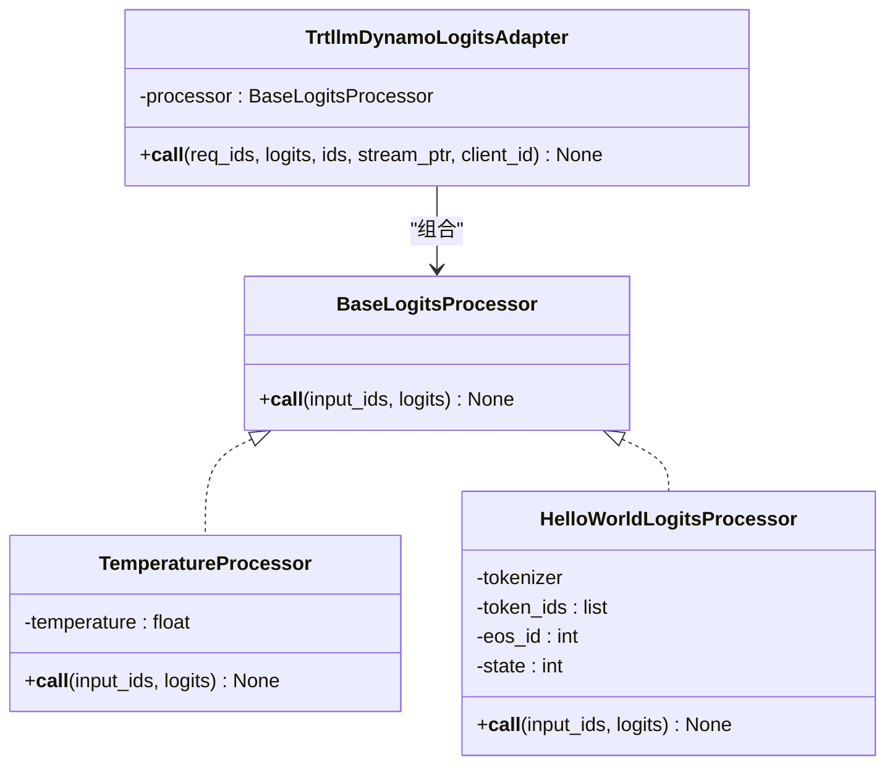
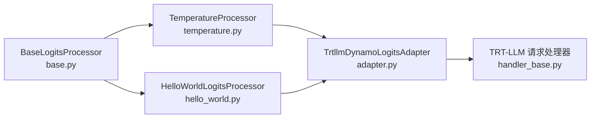

# Logits处理

<cite>
**本文引用的文件**
- [lib/bindings/python/src/dynamo/logits_processing/base.py](file://lib/bindings/python/src/dynamo/logits_processing/base.py)
- [lib/bindings/python/src/dynamo/logits_processing/__init__.py](file://lib/bindings/python/src/dynamo/logits_processing/__init__.py)
- [lib/bindings/python/src/dynamo/logits_processing/examples/__init__.py](file://lib/bindings/python/src/dynamo/logits_processing/examples/__init__.py)
- [lib/bindings/python/src/dynamo/logits_processing/examples/temperature.py](file://lib/bindings/python/src/dynamo/logits_processing/examples/temperature.py)
- [lib/bindings/python/src/dynamo/logits_processing/examples/hello_world.py](file://lib/bindings/python/src/dynamo/logits_processing/examples/hello_world.py)
- [components/src/dynamo/trtllm/logits_processing/adapter.py](file://components/src/dynamo/trtllm/logits_processing/adapter.py)
- [components/src/dynamo/trtllm/request_handlers/handler_base.py](file://components/src/dynamo/trtllm/request_handlers/handler_base.py)
- [docs/pages/backends/trtllm/README.md](file://docs/pages/backends/trtllm/README.md)
- [examples/backends/trtllm/launch/agg.sh](file://examples/backends/trtllm/launch/agg.sh)
</cite>

## 目录
1. [简介](#简介)
2. [项目结构](#项目结构)
3. [核心组件](#核心组件)
4. [架构总览](#架构总览)
5. [组件详解](#组件详解)
6. [依赖关系分析](#依赖关系分析)
7. [性能考量与限制](#性能考量与限制)
8. [故障排查指南](#故障排查指南)
9. [结论](#结论)
10. [附录：开发与测试实践](#附录开发与测试实践)

## 简介
本章节面向希望在解码过程中对下一个token的logits进行自定义修改（如温度缩放、top-p采样、停用词过滤、格式引导等）的开发者，系统性介绍Dynamo的“后端无关”Logits处理接口设计与TensorRT-LLM适配器的实现机制。文档提供从接口实现到TRT-LLM集成、从常见策略示例到性能与限制说明的完整技术方案，并给出可直接定位到源码路径的参考位置，便于快速上手与扩展。

## 项目结构
围绕Logits处理的相关代码主要分布在以下区域：
- 后端无关接口与示例处理器：位于Python绑定库中，定义统一协议并提供示例实现
- TRT-LLM适配器：将Dynamo处理器桥接到TRT-LLM的LogitsProcessor接口
- TRT-LLM请求处理：在请求构建阶段注入Logits处理器
- 文档与示例脚本：提供使用说明、示例与启动方式

图表来源
- [lib/bindings/python/src/dynamo/logits_processing/base.py](file://lib/bindings/python/src/dynamo/logits_processing/base.py#L16-L39)
- [lib/bindings/python/src/dynamo/logits_processing/examples/temperature.py](file://lib/bindings/python/src/dynamo/logits_processing/examples/temperature.py#L11-L41)
- [lib/bindings/python/src/dynamo/logits_processing/examples/hello_world.py](file://lib/bindings/python/src/dynamo/logits_processing/examples/hello_world.py#L14-L42)
- [components/src/dynamo/trtllm/logits_processing/adapter.py](file://components/src/dynamo/trtllm/logits_processing/adapter.py#L15-L88)
- [components/src/dynamo/trtllm/request_handlers/handler_base.py](file://components/src/dynamo/trtllm/request_handlers/handler_base.py#L671-L691)
- [docs/pages/backends/trtllm/README.md](file://docs/pages/backends/trtllm/README.md#L280-L326)
- [examples/backends/trtllm/launch/agg.sh](file://examples/backends/trtllm/launch/agg.sh#L55-L70)

章节来源
- [lib/bindings/python/src/dynamo/logits_processing/base.py](file://lib/bindings/python/src/dynamo/logits_processing/base.py#L1-L39)
- [components/src/dynamo/trtllm/logits_processing/adapter.py](file://components/src/dynamo/trtllm/logits_processing/adapter.py#L1-L88)
- [docs/pages/backends/trtllm/README.md](file://docs/pages/backends/trtllm/README.md#L280-L326)

## 核心组件
- BaseLogitsProcessor：定义所有后端无关处理器必须实现的协议，要求在__call__中对logits进行原地(in-place)修改
- 示例处理器：
  - TemperatureProcessor：温度缩放示例
  - HelloWorldLogitsProcessor：强制输出固定文本序列的示例
- TrtllmDynamoLogitsAdapter：将Dynamo处理器适配为TRT-LLM的LogitsProcessor，负责跨后端接口转换与CUDA流管理
- create_trtllm_adapters：批量创建适配器并挂载到TRT-LLM的SamplingParams.logits_processor

章节来源
- [lib/bindings/python/src/dynamo/logits_processing/base.py](file://lib/bindings/python/src/dynamo/logits_processing/base.py#L16-L39)
- [lib/bindings/python/src/dynamo/logits_processing/examples/temperature.py](file://lib/bindings/python/src/dynamo/logits_processing/examples/temperature.py#L11-L41)
- [lib/bindings/python/src/dynamo/logits_processing/examples/hello_world.py](file://lib/bindings/python/src/dynamo/logits_processing/examples/hello_world.py#L14-L42)
- [components/src/dynamo/trtllm/logits_processing/adapter.py](file://components/src/dynamo/trtllm/logits_processing/adapter.py#L15-L88)

## 架构总览
下图展示了从请求进入、处理器适配到TRT-LLM执行的关键流程：

图表来源
- [components/src/dynamo/trtllm/request_handlers/handler_base.py](file://components/src/dynamo/trtllm/request_handlers/handler_base.py#L671-L691)
- [components/src/dynamo/trtllm/logits_processing/adapter.py](file://components/src/dynamo/trtllm/logits_processing/adapter.py#L29-L69)
- [lib/bindings/python/src/dynamo/logits_processing/base.py](file://lib/bindings/python/src/dynamo/logits_processing/base.py#L25-L38)

## 组件详解

### BaseLogitsProcessor 接口与实现要点
- 协议签名：接收input_ids（已生成token序列）与logits（形状为(vocab_size,)），并在__call__中对logits进行原地修改
- 设计原则：统一接口确保同一套逻辑可在TRT-LLM、vLLM、SGLang等后端复用
- 原地修改：严禁返回新张量；所有改动必须直接作用于传入的logits

章节来源
- [lib/bindings/python/src/dynamo/logits_processing/base.py](file://lib/bindings/python/src/dynamo/logits_processing/base.py#L16-L39)
- [lib/bindings/python/src/dynamo/logits_processing/__init__.py](file://lib/bindings/python/src/dynamo/logits_processing/__init__.py#L4-L13)

### TRT-LLM 适配器：TrtllmDynamoLogitsAdapter
- 职责：继承TRT-LLM的LogitsProcessor，封装Dynamo处理器，完成接口形态转换与CUDA流切换
- 关键行为：
  - 校验输入logits的batch与beam维度（当前仅支持单请求、beam宽度为1）
  - 将ids[0]与logits[0,0,:]传给Dynamo处理器
  - 在外部CUDA流上下文中执行，保证与引擎解码流隔离
  - 捕获异常，避免错误传播导致logits被错误修改
- 工具函数：create_trtllm_adapters将多个Dynamo处理器批量包装为TRT-LLM可用的适配器列表

图表来源
- [lib/bindings/python/src/dynamo/logits_processing/base.py](file://lib/bindings/python/src/dynamo/logits_processing/base.py#L16-L39)
- [components/src/dynamo/trtllm/logits_processing/adapter.py](file://components/src/dynamo/trtllm/logits_processing/adapter.py#L15-L88)
- [lib/bindings/python/src/dynamo/logits_processing/examples/temperature.py](file://lib/bindings/python/src/dynamo/logits_processing/examples/temperature.py#L11-L41)
- [lib/bindings/python/src/dynamo/logits_processing/examples/hello_world.py](file://lib/bindings/python/src/dynamo/logits_processing/examples/hello_world.py#L14-L42)

章节来源
- [components/src/dynamo/trtllm/logits_processing/adapter.py](file://components/src/dynamo/trtllm/logits_processing/adapter.py#L15-L88)

### 示例处理器：温度缩放与HelloWorld
- TemperatureProcessor：对logits进行除法缩放（原地修改），温度越低分布越集中，越高越均匀
- HelloWorldLogitsProcessor：通过全负掩码与单个位置置零的方式，强制按顺序输出指定文本，最后EOS结束

章节来源
- [lib/bindings/python/src/dynamo/logits_processing/examples/temperature.py](file://lib/bindings/python/src/dynamo/logits_processing/examples/temperature.py#L11-L41)
- [lib/bindings/python/src/dynamo/logits_processing/examples/hello_world.py](file://lib/bindings/python/src/dynamo/logits_processing/examples/hello_world.py#L14-L42)

### TRT-LLM 集成与注入点
- 在请求处理器中，可按需启用测试处理器（通过环境变量开启），并将适配器写入SamplingParams.logits_processor
- 该注入发生在预填/解码阶段的参数构建环节

章节来源
- [components/src/dynamo/trtllm/request_handlers/handler_base.py](file://components/src/dynamo/trtllm/request_handlers/handler_base.py#L671-L691)

### 常见处理策略与实现思路
- 温度缩放：对logits进行标量缩放（已在示例中展示）
- Top-p采样：先对logits做softmax得到概率分布，累积概率达到阈值p即截断，其余置零，再进行归一化（建议在__call__中原地修改）
- 停用词/禁止词：将对应词汇索引的logits置为负无穷或极小值（保持原地修改）
- 格式引导（JSON/Regex/Choice/Grammar）：结合分词器编码目标片段，逐步允许特定token序列，最后强制EOS（类似HelloWorld思路）

说明：以上策略为通用实现思路，具体实现请参考示例处理器的原地修改范式与接口约束。

## 依赖关系分析
- BaseLogitsProcessor是所有处理器的共同契约，不依赖任何后端
- 示例处理器依赖BaseLogitsProcessor
- TrtllmDynamoLogitsAdapter依赖TRT-LLM的LogitsProcessor基类与Dynamo处理器
- 请求处理器在运行时根据配置将适配器注入到TRT-LLM的SamplingParams

图表来源
- [lib/bindings/python/src/dynamo/logits_processing/base.py](file://lib/bindings/python/src/dynamo/logits_processing/base.py#L16-L39)
- [lib/bindings/python/src/dynamo/logits_processing/examples/temperature.py](file://lib/bindings/python/src/dynamo/logits_processing/examples/temperature.py#L11-L41)
- [lib/bindings/python/src/dynamo/logits_processing/examples/hello_world.py](file://lib/bindings/python/src/dynamo/logits_processing/examples/hello_world.py#L14-L42)
- [components/src/dynamo/trtllm/logits_processing/adapter.py](file://components/src/dynamo/trtllm/logits_processing/adapter.py#L15-L88)
- [components/src/dynamo/trtllm/request_handlers/handler_base.py](file://components/src/dynamo/trtllm/request_handlers/handler_base.py#L671-L691)

章节来源
- [lib/bindings/python/src/dynamo/logits_processing/examples/__init__.py](file://lib/bindings/python/src/dynamo/logits_processing/examples/__init__.py#L1-L7)
- [lib/bindings/python/src/dynamo/logits_processing/__init__.py](file://lib/bindings/python/src/dynamo/logits_processing/__init__.py#L1-L13)

## 性能考量与限制
- 单请求与beam宽度限制：当前适配器仅支持batch=1且beam宽度=1的场景
- 原地修改：处理器必须在原张量上修改，避免额外内存分配与拷贝
- CUDA流隔离：适配器在外部CUDA流中执行，减少与主解码流的同步开销
- 错误处理：异常时不修改logits，避免错误状态影响后续生成
- 可观测性：可通过环境变量启用测试处理器验证链路（仅用于验证，不建议在生产中长期开启）

章节来源
- [components/src/dynamo/trtllm/logits_processing/adapter.py](file://components/src/dynamo/trtllm/logits_processing/adapter.py#L50-L69)
- [docs/pages/backends/trtllm/README.md](file://docs/pages/backends/trtllm/README.md#L328-L332)

## 故障排查指南
- 症状：解码卡住或报错
  - 可能原因：beam宽度>1或batch>1导致不支持
  - 处理：确认仅使用batch=1、beam=1的配置
- 症状：日志出现处理器错误
  - 可能原因：处理器内部异常
  - 处理：检查处理器实现是否正确进行原地修改；适配器会记录错误但不修改logits
- 症状：输出不符合预期
  - 可能原因：温度设置不当、掩码未正确置零或索引错误
  - 处理：对照示例处理器的原地修改范式逐项核对

章节来源
- [components/src/dynamo/trtllm/logits_processing/adapter.py](file://components/src/dynamo/trtllm/logits_processing/adapter.py#L53-L67)
- [lib/bindings/python/src/dynamo/logits_processing/examples/temperature.py](file://lib/bindings/python/src/dynamo/logits_processing/examples/temperature.py#L25-L27)
- [lib/bindings/python/src/dynamo/logits_processing/examples/hello_world.py](file://lib/bindings/python/src/dynamo/logits_processing/examples/hello_world.py#L20-L28)

## 结论
Dynamo通过统一的BaseLogitsProcessor协议与TRT-LLM适配器，实现了“一次编写、多后端复用”的解码期logits处理能力。借助示例处理器与适配器，用户可以快速实现温度缩放、强制输出等常见策略，并在TRT-LLM上获得稳定的性能表现。受限于当前实现的batch与beam限制，复杂场景建议在请求侧进行预处理或在其他后端（如vLLM）实现相应策略。

## 附录：开发与测试实践
- 快速验证链路
  - 启用测试处理器：设置环境变量后启动聚合模式服务，验证输出是否符合预期
  - 启动命令参考：前端与工作进程分别启动
- 自定义处理器开发步骤
  - 实现BaseLogitsProcessor接口，确保在__call__中对logits进行原地修改
  - 使用create_trtllm_adapters将处理器包装为TRT-LLM可用的适配器
  - 将适配器列表赋值给SamplingParams.logits_processor
- 常见策略实现参考
  - 温度缩放：参考温度处理器的原地缩放实现
  - 固定输出：参考HelloWorld处理器的掩码与EOS控制
- 测试方法
  - 使用聚合模式启动脚本进行端到端验证
  - 对比不同温度/策略下的输出稳定性与质量

章节来源
- [docs/pages/backends/trtllm/README.md](file://docs/pages/backends/trtllm/README.md#L285-L326)
- [examples/backends/trtllm/launch/agg.sh](file://examples/backends/trtllm/launch/agg.sh#L55-L70)
- [lib/bindings/python/src/dynamo/logits_processing/examples/temperature.py](file://lib/bindings/python/src/dynamo/logits_processing/examples/temperature.py#L11-L41)
- [lib/bindings/python/src/dynamo/logits_processing/examples/hello_world.py](file://lib/bindings/python/src/dynamo/logits_processing/examples/hello_world.py#L14-L42)