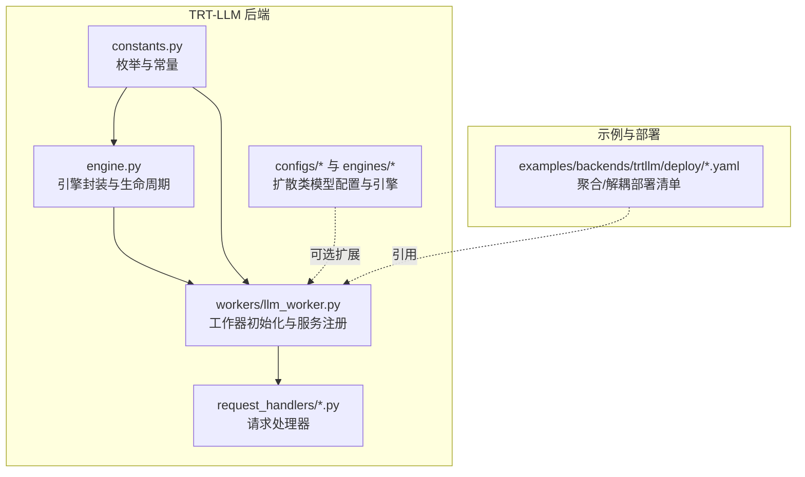
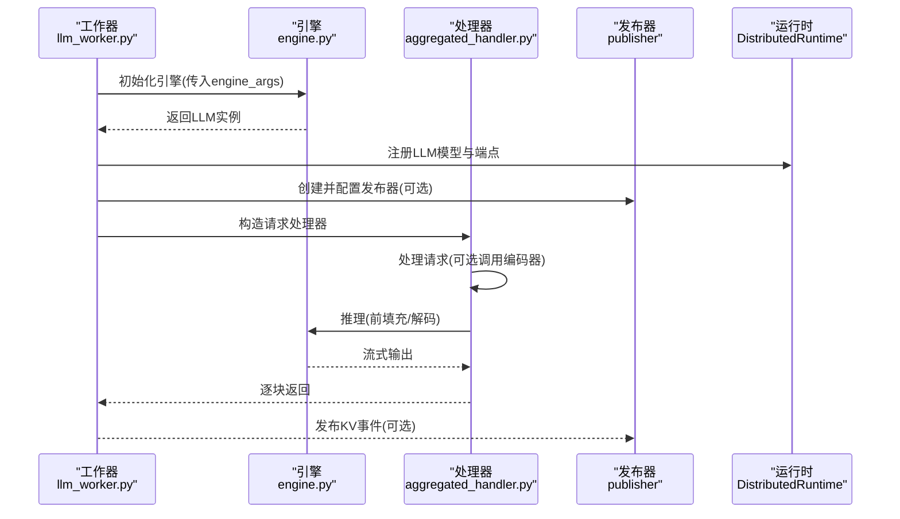
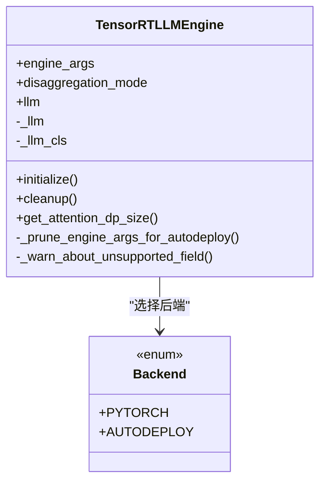
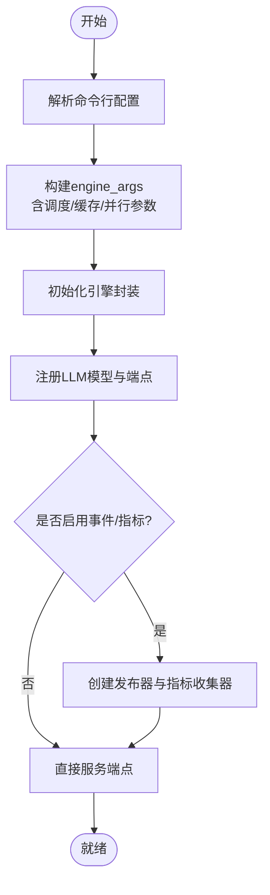
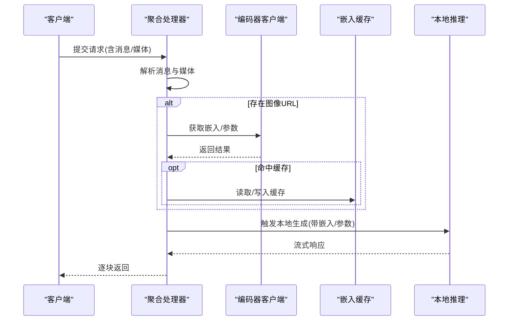
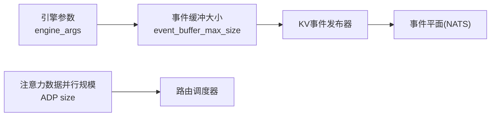
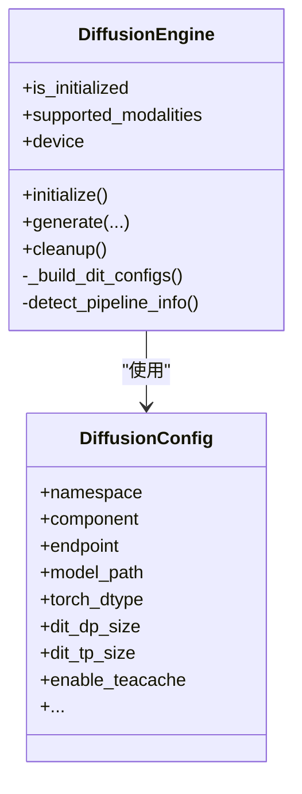
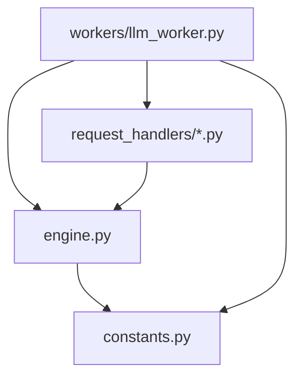

# TensorRT-LLM后端引擎

<cite>
**本文引用的文件**
- [components/src/dynamo/trtllm/engine.py](file://components/src/dynamo/trtllm/engine.py)
- [components/src/dynamo/trtllm/main.py](file://components/src/dynamo/trtllm/main.py)
- [components/src/dynamo/trtllm/constants.py](file://components/src/dynamo/trtllm/constants.py)
- [components/src/dynamo/trtllm/workers/llm_worker.py](file://components/src/dynamo/trtllm/workers/llm_worker.py)
- [components/src/dynamo/trtllm/request_handlers/aggregated_handler.py](file://components/src/dynamo/trtllm/request_handlers/aggregated_handler.py)
- [components/src/dynamo/trtllm/configs/diffusion_config.py](file://components/src/dynamo/trtllm/configs/diffusion_config.py)
- [components/src/dynamo/trtllm/engines/diffusion_engine.py](file://components/src/dynamo/trtllm/engines/diffusion_engine.py)
- [examples/backends/trtllm/deploy/agg.yaml](file://examples/backends/trtllm/deploy/agg.yaml)
- [examples/backends/trtllm/deploy/disagg.yaml](file://examples/backends/trtllm/deploy/disagg.yaml)
</cite>

## 目录
1. [简介](#简介)
2. [项目结构](#项目结构)
3. [核心组件](#核心组件)
4. [架构总览](#架构总览)
5. [组件详解](#组件详解)
6. [依赖关系分析](#依赖关系分析)
7. [性能与调优](#性能与调优)
8. [故障排查指南](#故障排查指南)
9. [结论](#结论)
10. [附录：部署与配置示例](#附录部署与配置示例)

## 简介
本文件系统性阐述Dynamo中TensorRT-LLM后端引擎的设计与实现，重点覆盖以下方面：
- 在Dynamo中的集成路径与运行时生命周期管理
- 高性能推理的关键机制：KV缓存事件传播、动态批调度、注意力数据并行（ADP）
- 多模态与编码器解耦（EPD）能力
- 多节点部署模式与配置要点
- CUDA与内存优化策略、Prometheus指标采集与可观测性
- 与Dynamo其他组件（路由、事件平面、指标体系）的协同机制
- 实战部署示例与最佳实践

## 项目结构
围绕TensorRT-LLM后端的核心目录与职责如下：
- engine：封装LLM实例化、生命周期与参数裁剪逻辑
- workers：LLM工作器初始化、请求处理、KV事件发布与指标注册
- request_handlers：按聚合/预填充/解码/编码等模式分发请求
- configs/engines：扩散类模型（视频/图像生成）的配置与引擎封装
- examples/backends/trtllm/deploy：聚合与解耦部署样例

**图示来源**
- [components/src/dynamo/trtllm/engine.py](file://components/src/dynamo/trtllm/engine.py#L25-L171)
- [components/src/dynamo/trtllm/workers/llm_worker.py](file://components/src/dynamo/trtllm/workers/llm_worker.py#L111-L520)
- [components/src/dynamo/trtllm/constants.py](file://components/src/dynamo/trtllm/constants.py#L12-L58)
- [examples/backends/trtllm/deploy/agg.yaml](file://examples/backends/trtllm/deploy/agg.yaml#L1-L38)
- [examples/backends/trtllm/deploy/disagg.yaml](file://examples/backends/trtllm/deploy/disagg.yaml#L1-L66)

**章节来源**
- [components/src/dynamo/trtllm/engine.py](file://components/src/dynamo/trtllm/engine.py#L1-L171)
- [components/src/dynamo/trtllm/workers/llm_worker.py](file://components/src/dynamo/trtllm/workers/llm_worker.py#L1-L520)
- [components/src/dynamo/trtllm/constants.py](file://components/src/dynamo/trtllm/constants.py#L1-L58)
- [examples/backends/trtllm/deploy/agg.yaml](file://examples/backends/trtllm/deploy/agg.yaml#L1-L38)
- [examples/backends/trtllm/deploy/disagg.yaml](file://examples/backends/trtllm/deploy/disagg.yaml#L1-L66)

## 核心组件
- 引擎封装与生命周期
  - 支持PyTorch后端与自动部署后端；根据模式选择MultimodalEncoder或标准LLM实例化；提供加载时间度量与清理
- 工作器初始化
  - 构建KvCacheConfig、DynamicBatchConfig、SchedulerConfig；可选启用KV事件缓冲与指标采集；注册LLM模型与健康检查负载
- 请求处理器
  - 聚合模式支持可选的编码器解耦（EPD），从编码器获取嵌入或参数
- 扩散类引擎（可选）
  - 基于模型索引自动识别管线类型，延迟导入视觉生成管线，统一视频/图像生成接口

**章节来源**
- [components/src/dynamo/trtllm/engine.py](file://components/src/dynamo/trtllm/engine.py#L25-L171)
- [components/src/dynamo/trtllm/workers/llm_worker.py](file://components/src/dynamo/trtllm/workers/llm_worker.py#L111-L520)
- [components/src/dynamo/trtllm/request_handlers/aggregated_handler.py](file://components/src/dynamo/trtllm/request_handlers/aggregated_handler.py#L20-L66)
- [components/src/dynamo/trtllm/engines/diffusion_engine.py](file://components/src/dynamo/trtllm/engines/diffusion_engine.py#L52-L359)

## 架构总览
下图展示Dynamo中TRT-LLM后端的端到端流程：工作器启动、引擎初始化、请求进入、处理器分发、KV事件发布与指标上报。

**图示来源**
- [components/src/dynamo/trtllm/workers/llm_worker.py](file://components/src/dynamo/trtllm/workers/llm_worker.py#L336-L520)
- [components/src/dynamo/trtllm/engine.py](file://components/src/dynamo/trtllm/engine.py#L55-L92)
- [components/src/dynamo/trtllm/request_handlers/aggregated_handler.py](file://components/src/dynamo/trtllm/request_handlers/aggregated_handler.py#L36-L66)

## 组件详解

### 引擎封装与生命周期（TensorRT-LLM）
- 支持后端类型：PyTorch与自动部署；自动部署模式会裁剪不支持的参数
- 按解耦模式选择实例化路径：编码器模式使用MultimodalEncoder，否则使用标准LLM
- 提供加载耗时度量与清理逻辑，避免资源泄漏

**图示来源**
- [components/src/dynamo/trtllm/engine.py](file://components/src/dynamo/trtllm/engine.py#L25-L137)

**章节来源**
- [components/src/dynamo/trtllm/engine.py](file://components/src/dynamo/trtllm/engine.py#L25-L171)

### 工作器初始化与运行时配置
- 动态批调度与容量策略、GPU显存占用比例控制、KV缓存连接器配置
- 可选启用KV事件缓冲与指标采集；注册Dynamo指标回调与TRT-LLM原生指标
- 根据解耦模式设置模型类型与本地索引器开关；计算注意力数据并行规模用于路由调度

**图示来源**
- [components/src/dynamo/trtllm/workers/llm_worker.py](file://components/src/dynamo/trtllm/workers/llm_worker.py#L111-L520)

**章节来源**
- [components/src/dynamo/trtllm/workers/llm_worker.py](file://components/src/dynamo/trtllm/workers/llm_worker.py#L111-L520)

### 请求处理器（聚合模式与编码器解耦）
- 聚合处理器支持可选的编码器客户端与嵌入缓存；当存在图像URL时，优先从编码器获取嵌入或参数
- 将多模态提取、编码器交互与本地推理流水线化

**图示来源**
- [components/src/dynamo/trtllm/request_handlers/aggregated_handler.py](file://components/src/dynamo/trtllm/request_handlers/aggregated_handler.py#L36-L66)

**章节来源**
- [components/src/dynamo/trtllm/request_handlers/aggregated_handler.py](file://components/src/dynamo/trtllm/request_handlers/aggregated_handler.py#L20-L66)

### KV缓存事件传播与路由感知
- 当启用事件/指标发布时，工作器为引擎注入事件缓冲大小，并仅支持PyTorch后端进行事件发布
- 注意力数据并行（ADP）规模通过引擎参数推导，用于路由调度器正确遍历所有数据并行rank
- 可选启用KV事件合并器（Consolidator）并通过ZMQ订阅/转发至NATS

**图示来源**
- [components/src/dynamo/trtllm/workers/llm_worker.py](file://components/src/dynamo/trtllm/workers/llm_worker.py#L203-L229)
- [components/src/dynamo/trtllm/workers/llm_worker.py](file://components/src/dynamo/trtllm/workers/llm_worker.py#L368-L373)

**章节来源**
- [components/src/dynamo/trtllm/workers/llm_worker.py](file://components/src/dynamo/trtllm/workers/llm_worker.py#L203-L229)
- [components/src/dynamo/trtllm/workers/llm_worker.py](file://components/src/dynamo/trtllm/workers/llm_worker.py#L368-L373)

### 扩散类引擎（视频/图像生成，可选）
- 基于模型索引自动识别管线类型，延迟导入视觉生成管线模块
- 统一生成接口，支持CFG、分辨率、帧数、步数等参数；支持CPU异步卸载与TeaCache优化

**图示来源**
- [components/src/dynamo/trtllm/configs/diffusion_config.py](file://components/src/dynamo/trtllm/configs/diffusion_config.py#L20-L99)
- [components/src/dynamo/trtllm/engines/diffusion_engine.py](file://components/src/dynamo/trtllm/engines/diffusion_engine.py#L52-L359)

**章节来源**
- [components/src/dynamo/trtllm/configs/diffusion_config.py](file://components/src/dynamo/trtllm/configs/diffusion_config.py#L1-L99)
- [components/src/dynamo/trtllm/engines/diffusion_engine.py](file://components/src/dynamo/trtllm/engines/diffusion_engine.py#L52-L359)

## 依赖关系分析
- 引擎封装依赖TRT-LLM LLM/MultimodalEncoder与Dynamo常量（解耦模式）
- 工作者依赖引擎封装、TRT-LLM llmapi（KvCacheConfig、SchedulerConfig等）、Dynamo运行时与发布器
- 请求处理器依赖多模态处理与编码器客户端（可选）

**图示来源**
- [components/src/dynamo/trtllm/engine.py](file://components/src/dynamo/trtllm/engine.py#L13-L14)
- [components/src/dynamo/trtllm/workers/llm_worker.py](file://components/src/dynamo/trtllm/workers/llm_worker.py#L49-L57)
- [components/src/dynamo/trtllm/request_handlers/aggregated_handler.py](file://components/src/dynamo/trtllm/request_handlers/aggregated_handler.py#L10-L17)

**章节来源**
- [components/src/dynamo/trtllm/engine.py](file://components/src/dynamo/trtllm/engine.py#L1-L171)
- [components/src/dynamo/trtllm/workers/llm_worker.py](file://components/src/dynamo/trtllm/workers/llm_worker.py#L1-L520)
- [components/src/dynamo/trtllm/request_handlers/aggregated_handler.py](file://components/src/dynamo/trtllm/request_handlers/aggregated_handler.py#L1-L66)

## 性能与调优
- 动态批调度与容量策略
  - 使用动态批配置与容量调度策略，结合移动平均窗口提升吞吐稳定性
- KV缓存与事件缓冲
  - 启用事件缓冲大小以支撑KV事件发布；在特定连接器模式下禁用部分重用以保证一致性
- 并行与拓扑
  - 通过张量/流水线/专家/注意力数据并行参数控制并行度；注意力数据并行规模影响路由调度
- 指标与可观测性
  - 注册Dynamo与TRT-LLM原生指标，便于端到端性能观测与瓶颈定位
- CUDA与内存
  - 控制GPU显存占用比例；在需要时启用CPU异步卸载（扩散类引擎）；及时释放缓存

**章节来源**
- [components/src/dynamo/trtllm/workers/llm_worker.py](file://components/src/dynamo/trtllm/workers/llm_worker.py#L158-L167)
- [components/src/dynamo/trtllm/workers/llm_worker.py](file://components/src/dynamo/trtllm/workers/llm_worker.py#L155-L157)
- [components/src/dynamo/trtllm/workers/llm_worker.py](file://components/src/dynamo/trtllm/workers/llm_worker.py#L203-L229)
- [components/src/dynamo/trtllm/engines/diffusion_engine.py](file://components/src/dynamo/trtllm/engines/diffusion_engine.py#L331-L339)

## 故障排查指南
- 日志级别映射
  - 通过环境变量映射Dynamo日志级别到TRT-LLM日志级别，便于统一日志输出
- 健康检查
  - 工作者端构造健康检查负载，便于平台探测与编排
- 清理与异常
  - 引擎封装提供清理逻辑；工作器在异常时记录错误并退出

**章节来源**
- [components/src/dynamo/trtllm/main.py](file://components/src/dynamo/trtllm/main.py#L8-L26)
- [components/src/dynamo/trtllm/workers/llm_worker.py](file://components/src/dynamo/trtllm/workers/llm_worker.py#L452-L454)
- [components/src/dynamo/trtllm/engine.py](file://components/src/dynamo/trtllm/engine.py#L79-L87)

## 结论
Dynamo中的TensorRT-LLM后端通过清晰的引擎封装、灵活的工作器初始化与请求处理器，实现了高性能、可观测且可扩展的推理服务。其关键优势包括：
- 解耦模式下的多模态与编码器协作（EPD）
- KV事件传播与路由感知（ADP规模）
- 动态批调度与容量策略
- 丰富的并行与拓扑参数
- 完整的指标与日志体系

这些特性共同支撑了从单机到多节点的弹性部署，并为大规模推理场景提供了坚实基础。

## 附录：部署与配置示例

### 聚合模式部署
- 使用示例清单定义前端与TRT-LLM工作器，指定模型路径与引擎配置文件

**章节来源**
- [examples/backends/trtllm/deploy/agg.yaml](file://examples/backends/trtllm/deploy/agg.yaml#L1-L38)

### 解耦模式部署
- 分别定义预填充与解码工作器，分别加载不同的引擎配置文件，并设置解耦模式

**章节来源**
- [examples/backends/trtllm/deploy/disagg.yaml](file://examples/backends/trtllm/deploy/disagg.yaml#L1-L66)

### 关键配置要点（基于源码行为）
- 引擎参数
  - 模型路径、并行度（张量/流水线/专家/注意力数据并行）、最大批大小、最大序列长度、最大beam宽度、最大令牌数
  - KV缓存配置（显存占用比例）、动态批配置、调度策略
  - 可选启用事件缓冲大小、指标采集、KV连接器（如KVBM）
- 运行时参数
  - 命名空间、组件名、端点名、编码器端点、多模态处理参数、本地媒体路径、自定义Jinja模板
- 扩散类引擎（可选）
  - 模型路径、dtype、默认生成参数、并行维度、TeaCache开关与阈值、CPU异步卸载

**章节来源**
- [components/src/dynamo/trtllm/workers/llm_worker.py](file://components/src/dynamo/trtllm/workers/llm_worker.py#L170-L202)
- [components/src/dynamo/trtllm/workers/llm_worker.py](file://components/src/dynamo/trtllm/workers/llm_worker.py#L235-L262)
- [components/src/dynamo/trtllm/configs/diffusion_config.py](file://components/src/dynamo/trtllm/configs/diffusion_config.py#L20-L99)