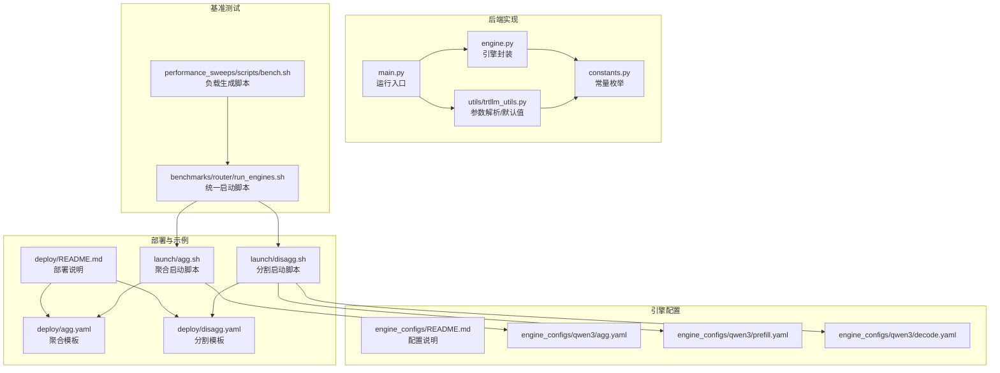
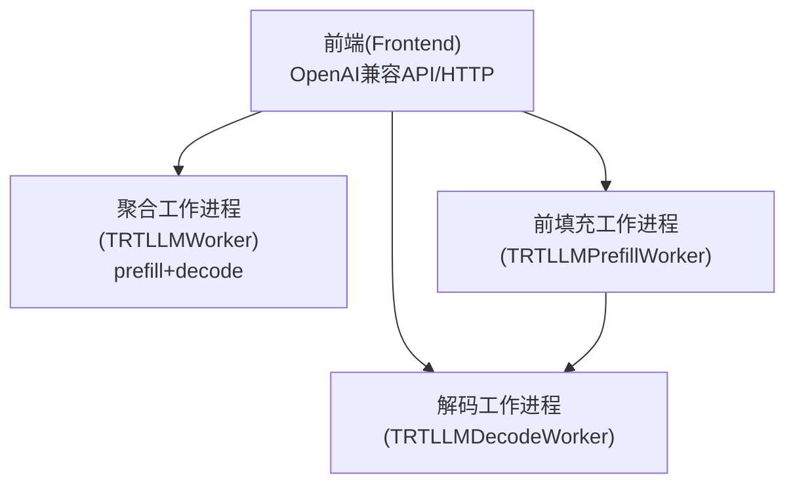
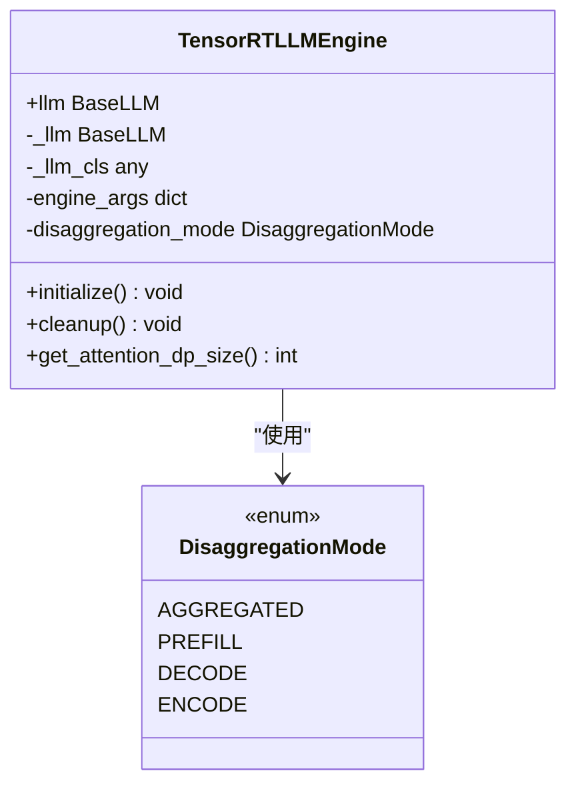
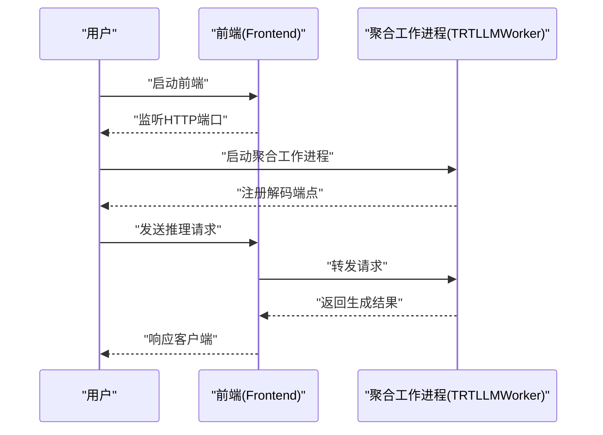
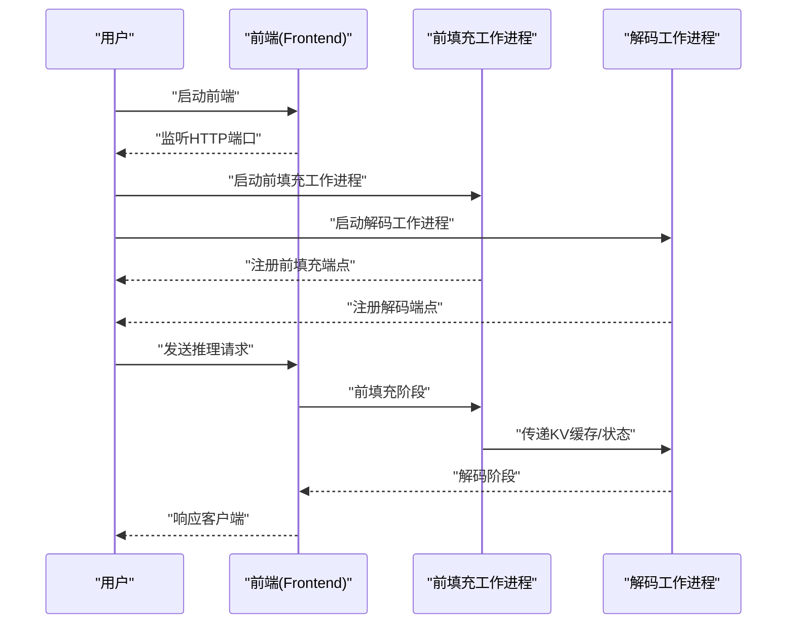
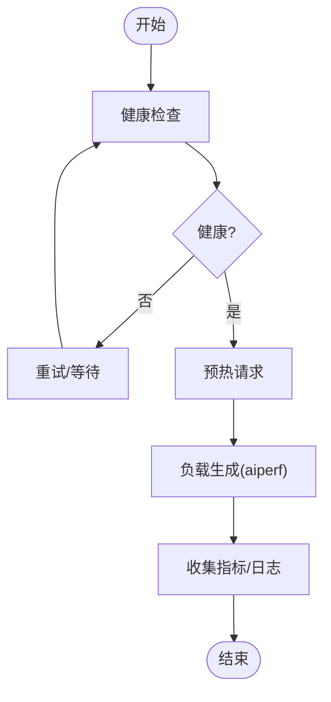
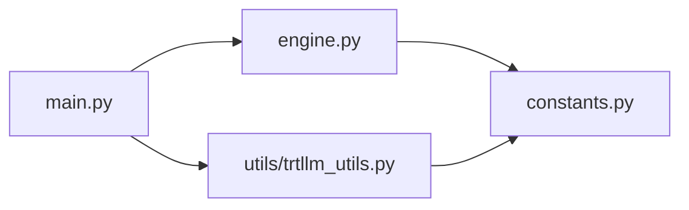

# TensorRT-LLM基础集成

<cite>
**本文引用的文件**
- [components/src/dynamo/trtllm/main.py](file://components/src/dynamo/trtllm/main.py)
- [components/src/dynamo/trtllm/engine.py](file://components/src/dynamo/trtllm/engine.py)
- [components/src/dynamo/trtllm/constants.py](file://components/src/dynamo/trtllm/constants.py)
- [components/src/dynamo/trtllm/utils/trtllm_utils.py](file://components/src/dynamo/trtllm/utils/trtllm_utils.py)
- [examples/backends/trtllm/deploy/README.md](file://examples/backends/trtllm/deploy/README.md)
- [examples/backends/trtllm/deploy/agg.yaml](file://examples/backends/trtllm/deploy/agg.yaml)
- [examples/backends/trtllm/deploy/disagg.yaml](file://examples/backends/trtllm/deploy/disagg.yaml)
- [examples/backends/trtllm/launch/agg.sh](file://examples/backends/trtllm/launch/agg.sh)
- [examples/backends/trtllm/launch/disagg.sh](file://examples/backends/trtllm/launch/disagg.sh)
- [examples/backends/trtllm/engine_configs/README.md](file://examples/backends/trtllm/engine_configs/README.md)
- [examples/backends/trtllm/engine_configs/qwen3/agg.yaml](file://examples/backends/trtllm/engine_configs/qwen3/agg.yaml)
- [examples/backends/trtllm/engine_configs/qwen3/prefill.yaml](file://examples/backends/trtllm/engine_configs/qwen3/prefill.yaml)
- [examples/backends/trtllm/engine_configs/qwen3/decode.yaml](file://examples/backends/trtllm/engine_configs/qwen3/decode.yaml)
- [benchmarks/router/run_engines.sh](file://benchmarks/router/run_engines.sh)
- [examples/backends/trtllm/performance_sweeps/scripts/bench.sh](file://examples/backends/trtllm/performance_sweeps/scripts/bench.sh)
</cite>

## 目录
1. [简介](#简介)
2. [项目结构](#项目结构)
3. [核心组件](#核心组件)
4. [架构总览](#架构总览)
5. [详细组件分析](#详细组件分析)
6. [依赖关系分析](#依赖关系分析)
7. [性能考虑](#性能考虑)
8. [故障排查指南](#故障排查指南)
9. [结论](#结论)
10. [附录](#附录)

## 简介
本指南面向希望在Dynamo中完成TensorRT-LLM基础集成与部署的用户，覆盖以下目标：
- 在Dynamo框架下完成TensorRT-LLM的单节点与多节点部署
- 深入理解聚合式（Aggregated）与分割式（Disaggregated）两种部署架构的工作原理与适用场景
- 提供从零开始的部署脚本使用指南：预热请求、性能基准测试与负载生成器配置
- 解析TensorRT-LLM引擎核心参数配置，如张量并行大小、注意力并行设置等
- 给出完整部署命令示例与常见问题解决方案

## 项目结构
围绕TensorRT-LLM的基础集成，本仓库的关键目录与文件如下：
- 后端实现与工具
  - 运行入口与初始化：components/src/dynamo/trtllm/main.py
  - 引擎封装与生命周期管理：components/src/dynamo/trtllm/engine.py
  - 常量定义（拆分模式、模态类型）：components/src/dynamo/trtllm/constants.py
  - 命令行参数解析与默认值：components/src/dynamo/trtllm/utils/trtllm_utils.py
- 部署模板与示例
  - 部署说明与模式概览：examples/backends/trtllm/deploy/README.md
  - 聚合/分割部署模板：examples/backends/trtllm/deploy/agg.yaml、examples/backends/trtllm/deploy/disagg.yaml
  - 单机启动脚本：examples/backends/trtllm/launch/agg.sh、examples/backends/trtllm/launch/disagg.sh
- 引擎配置
  - 配置说明与参数清单：examples/backends/trtllm/engine_configs/README.md
  - 示例配置：examples/backends/trtllm/engine_configs/qwen3/agg.yaml、prefill.yaml、decode.yaml
- 基准测试与自动化
  - 多后端统一启动脚本：benchmarks/router/run_engines.sh
  - 性能扫描与负载生成脚本：examples/backends/trtllm/performance_sweeps/scripts/bench.sh

图表来源
- [components/src/dynamo/trtllm/main.py](file://components/src/dynamo/trtllm/main.py#L1-L51)
- [components/src/dynamo/trtllm/engine.py](file://components/src/dynamo/trtllm/engine.py#L1-L171)
- [components/src/dynamo/trtllm/constants.py](file://components/src/dynamo/trtllm/constants.py#L1-L58)
- [components/src/dynamo/trtllm/utils/trtllm_utils.py](file://components/src/dynamo/trtllm/utils/trtllm_utils.py#L1-L613)
- [examples/backends/trtllm/deploy/README.md](file://examples/backends/trtllm/deploy/README.md#L1-L38)
- [examples/backends/trtllm/deploy/agg.yaml](file://examples/backends/trtllm/deploy/agg.yaml#L1-L38)
- [examples/backends/trtllm/deploy/disagg.yaml](file://examples/backends/trtllm/deploy/disagg.yaml#L1-L66)
- [examples/backends/trtllm/launch/agg.sh](file://examples/backends/trtllm/launch/agg.sh#L1-L71)
- [examples/backends/trtllm/launch/disagg.sh](file://examples/backends/trtllm/launch/disagg.sh#L1-L82)
- [examples/backends/trtllm/engine_configs/README.md](file://examples/backends/trtllm/engine_configs/README.md#L1-L44)
- [examples/backends/trtllm/engine_configs/qwen3/agg.yaml](file://examples/backends/trtllm/engine_configs/qwen3/agg.yaml#L1-L34)
- [examples/backends/trtllm/engine_configs/qwen3/prefill.yaml](file://examples/backends/trtllm/engine_configs/qwen3/prefill.yaml#L1-L30)
- [examples/backends/trtllm/engine_configs/qwen3/decode.yaml](file://examples/backends/trtllm/engine_configs/qwen3/decode.yaml#L1-L32)
- [benchmarks/router/run_engines.sh](file://benchmarks/router/run_engines.sh#L1-L273)
- [examples/backends/trtllm/performance_sweeps/scripts/bench.sh](file://examples/backends/trtllm/performance_sweeps/scripts/bench.sh#L1-L189)

章节来源
- [components/src/dynamo/trtllm/main.py](file://components/src/dynamo/trtllm/main.py#L1-L51)
- [components/src/dynamo/trtllm/engine.py](file://components/src/dynamo/trtllm/engine.py#L1-L171)
- [components/src/dynamo/trtllm/constants.py](file://components/src/dynamo/trtllm/constants.py#L1-L58)
- [components/src/dynamo/trtllm/utils/trtllm_utils.py](file://components/src/dynamo/trtllm/utils/trtllm_utils.py#L1-L613)
- [examples/backends/trtllm/deploy/README.md](file://examples/backends/trtllm/deploy/README.md#L1-L38)
- [examples/backends/trtllm/deploy/agg.yaml](file://examples/backends/trtllm/deploy/agg.yaml#L1-L38)
- [examples/backends/trtllm/deploy/disagg.yaml](file://examples/backends/trtllm/deploy/disagg.yaml#L1-L66)
- [examples/backends/trtllm/launch/agg.sh](file://examples/backends/trtllm/launch/agg.sh#L1-L71)
- [examples/backends/trtllm/launch/disagg.sh](file://examples/backends/trtllm/launch/disagg.sh#L1-L82)
- [examples/backends/trtllm/engine_configs/README.md](file://examples/backends/trtllm/engine_configs/README.md#L1-L44)
- [examples/backends/trtllm/engine_configs/qwen3/agg.yaml](file://examples/backends/trtllm/engine_configs/qwen3/agg.yaml#L1-L34)
- [examples/backends/trtllm/engine_configs/qwen3/prefill.yaml](file://examples/backends/trtllm/engine_configs/qwen3/prefill.yaml#L1-L30)
- [examples/backends/trtllm/engine_configs/qwen3/decode.yaml](file://examples/backends/trtllm/engine_configs/qwen3/decode.yaml#L1-L32)
- [benchmarks/router/run_engines.sh](file://benchmarks/router/run_engines.sh#L1-L273)
- [examples/backends/trtllm/performance_sweeps/scripts/bench.sh](file://examples/backends/trtllm/performance_sweeps/scripts/bench.sh#L1-L189)

## 核心组件
- 运行入口与初始化
  - main.py负责读取命令行参数、创建Dynamo运行时、初始化工作进程，并在uvloop事件循环中运行。
- 引擎封装与生命周期
  - engine.py提供TensorRTLLMEngine类，支持标准LLM与自动部署后端；负责引擎初始化、清理与注意力并行大小查询；通过上下文管理器控制生命周期。
- 常量定义
  - constants.py定义拆分模式（聚合/前填充/解码/编码）与模态类型（文本/多模态/视频扩散），用于不同组件的路由与处理。
- 参数解析与默认值
  - trtllm_utils.py解析命令行参数，设置默认端点、并行度、KV缓存、事件发布、模态等；支持从YAML加载额外引擎参数与覆盖字典。

章节来源
- [components/src/dynamo/trtllm/main.py](file://components/src/dynamo/trtllm/main.py#L1-L51)
- [components/src/dynamo/trtllm/engine.py](file://components/src/dynamo/trtllm/engine.py#L1-L171)
- [components/src/dynamo/trtllm/constants.py](file://components/src/dynamo/trtllm/constants.py#L1-L58)
- [components/src/dynamo/trtllm/utils/trtllm_utils.py](file://components/src/dynamo/trtllm/utils/trtllm_utils.py#L1-L613)

## 架构总览
Dynamo中的TensorRT-LLM后端采用“前端-工作进程”模型，支持单机与多机部署。根据拆分模式分为两类：
- 聚合式（Aggregated）：前端与单一工作进程协同，工作进程同时承担前填充与解码。
- 分割式（Disaggregated）：前端协调前填充与解码两个独立工作进程，提升吞吐与资源利用。

图表来源
- [examples/backends/trtllm/deploy/README.md](file://examples/backends/trtllm/deploy/README.md#L1-L38)
- [examples/backends/trtllm/deploy/agg.yaml](file://examples/backends/trtllm/deploy/agg.yaml#L1-L38)
- [examples/backends/trtllm/deploy/disagg.yaml](file://examples/backends/trtllm/deploy/disagg.yaml#L1-L66)

## 详细组件分析

### 引擎封装与拆分模式
- TensorRTLLMEngine
  - 支持后端类型：PyTorch与自动部署；对自动部署后端剔除不支持的参数项。
  - 初始化流程：根据拆分模式选择MultimodalEncoder或标准LLM构造；支持注意力数据并行开关与计算。
  - 生命周期：上下文管理器内测量加载时间并记录指标，异常时记录错误并在finally中清理。
- 拆分模式
  - AGGREGATED/PREFILL/DECODE/ENCODE四种模式，分别对应不同组件职责与端点命名。

图表来源
- [components/src/dynamo/trtllm/engine.py](file://components/src/dynamo/trtllm/engine.py#L25-L171)
- [components/src/dynamo/trtllm/constants.py](file://components/src/dynamo/trtllm/constants.py#L12-L19)

章节来源
- [components/src/dynamo/trtllm/engine.py](file://components/src/dynamo/trtllm/engine.py#L1-L171)
- [components/src/dynamo/trtllm/constants.py](file://components/src/dynamo/trtllm/constants.py#L1-L58)

### 命令行参数与默认行为
- 关键参数
  - 并行度：tensor_parallel_size、pipeline_parallel_size、expert_parallel_size、enable_attention_dp
  - KV缓存：kv_block_size、free_gpu_memory_fraction
  - 批处理：max_batch_size、max_num_tokens、max_seq_len、max_beam_width
  - 引擎参数：extra_engine_args（YAML路径）、override_engine_args（JSON字符串）
  - 拆分模式：disaggregation_mode（prefill/decode/encode/prefill_and_decode）
  - 事件与指标：publish_events_and_metrics、use_kv_events、durable_kv_events
  - 模态：modality（text/multimodal/video_diffusion）
- 默认端点
  - 解码/聚合：dyn://namespace.tensorrt_llm.generate
  - 前填充：dyn://namespace.prefill.generate
  - 编码：dyn://namespace.tensorrt_llm_encode.generate

章节来源
- [components/src/dynamo/trtllm/utils/trtllm_utils.py](file://components/src/dynamo/trtllm/utils/trtllm_utils.py#L146-L598)

### 聚合式部署（单节点）
- 部署模板
  - 使用DynamoGraphDeployment，包含Frontend与TRTLLMWorker，Worker副本数可按需扩展。
- 启动脚本
  - 聚合启动脚本会先启动前端，再启动聚合工作进程，支持可选的OpenTelemetry追踪参数注入。
- 引擎配置
  - 通过--extra-engine-args指定聚合配置文件，如qwen3/agg.yaml，其中包含张量并行、批大小、KV缓存与CUDA图等关键参数。

图表来源
- [examples/backends/trtllm/launch/agg.sh](file://examples/backends/trtllm/launch/agg.sh#L55-L71)
- [examples/backends/trtllm/deploy/agg.yaml](file://examples/backends/trtllm/deploy/agg.yaml#L1-L38)
- [examples/backends/trtllm/engine_configs/qwen3/agg.yaml](file://examples/backends/trtllm/engine_configs/qwen3/agg.yaml#L1-L34)

章节来源
- [examples/backends/trtllm/deploy/README.md](file://examples/backends/trtllm/deploy/README.md#L1-L38)
- [examples/backends/trtllm/deploy/agg.yaml](file://examples/backends/trtllm/deploy/agg.yaml#L1-L38)
- [examples/backends/trtllm/launch/agg.sh](file://examples/backends/trtllm/launch/agg.sh#L1-L71)
- [examples/backends/trtllm/engine_configs/README.md](file://examples/backends/trtllm/engine_configs/README.md#L1-L44)
- [examples/backends/trtllm/engine_configs/qwen3/agg.yaml](file://examples/backends/trtllm/engine_configs/qwen3/agg.yaml#L1-L34)

### 分割式部署（单节点/多节点）
- 部署模板
  - 使用DynamoGraphDeployment，包含Frontend、TRTLLMPrefillWorker与TRTLLMDecodeWorker，可分别设置副本数与资源限制。
- 启动脚本
  - 分割启动脚本分别启动前填充与解码工作进程，支持通过CUDA_VISIBLE_DEVICES将不同进程绑定到不同GPU。
- 引擎配置
  - 前填充与解码分别使用独立配置文件，注意KV缓存dtype一致性与cache_transceiver_config设置。

图表来源
- [examples/backends/trtllm/launch/disagg.sh](file://examples/backends/trtllm/launch/disagg.sh#L64-L82)
- [examples/backends/trtllm/deploy/disagg.yaml](file://examples/backends/trtllm/deploy/disagg.yaml#L1-L66)
- [examples/backends/trtllm/engine_configs/qwen3/prefill.yaml](file://examples/backends/trtllm/engine_configs/qwen3/prefill.yaml#L1-L30)
- [examples/backends/trtllm/engine_configs/qwen3/decode.yaml](file://examples/backends/trtllm/engine_configs/qwen3/decode.yaml#L1-L32)

章节来源
- [examples/backends/trtllm/deploy/README.md](file://examples/backends/trtllm/deploy/README.md#L1-L38)
- [examples/backends/trtllm/deploy/disagg.yaml](file://examples/backends/trtllm/deploy/disagg.yaml#L1-L66)
- [examples/backends/trtllm/launch/disagg.sh](file://examples/backends/trtllm/launch/disagg.sh#L1-L82)
- [examples/backends/trtllm/engine_configs/README.md](file://examples/backends/trtllm/engine_configs/README.md#L1-L44)
- [examples/backends/trtllm/engine_configs/qwen3/prefill.yaml](file://examples/backends/trtllm/engine_configs/qwen3/prefill.yaml#L1-L30)
- [examples/backends/trtllm/engine_configs/qwen3/decode.yaml](file://examples/backends/trtllm/engine_configs/qwen3/decode.yaml#L1-L32)

### 引擎参数与调优要点
- 并行度
  - tensor_parallel_size：张量并行大小
  - pipeline_parallel_size：流水线并行大小
  - expert_parallel_size：专家并行大小
  - enable_attention_dp：启用注意力数据并行（影响注意力并行大小计算）
- KV缓存
  - kv_block_size：块大小
  - free_gpu_memory_fraction：保留用于KV缓存的显存比例
- 批处理与调度
  - max_batch_size、max_num_tokens、max_seq_len、max_beam_width
  - disable_overlap_scheduler（前填充专用）
  - cuda_graph_config：CUDA图最大批大小
- 其他
  - trust_remote_code、backend（pytorch/_autodeploy）
  - cache_transceiver_config（分割式必需）

章节来源
- [examples/backends/trtllm/engine_configs/README.md](file://examples/backends/trtllm/engine_configs/README.md#L32-L43)
- [examples/backends/trtllm/engine_configs/qwen3/agg.yaml](file://examples/backends/trtllm/engine_configs/qwen3/agg.yaml#L15-L34)
- [examples/backends/trtllm/engine_configs/qwen3/prefill.yaml](file://examples/backends/trtllm/engine_configs/qwen3/prefill.yaml#L15-L30)
- [examples/backends/trtllm/engine_configs/qwen3/decode.yaml](file://examples/backends/trtllm/engine_configs/qwen3/decode.yaml#L15-L32)
- [components/src/dynamo/trtllm/engine.py](file://components/src/dynamo/trtllm/engine.py#L94-L102)

### 预热请求与健康检查
- 健康检查
  - 通过curl访问/frontend健康端点，确认端点列表包含目标生成端点；分割式需包含prefill端点。
- 预热请求
  - 发送一次短对话请求以触发模型加载与KV缓存初始化，减少首次延迟。

章节来源
- [examples/backends/trtllm/performance_sweeps/scripts/bench.sh](file://examples/backends/trtllm/performance_sweeps/scripts/bench.sh#L101-L134)
- [examples/backends/trtllm/performance_sweeps/scripts/bench.sh](file://examples/backends/trtllm/performance_sweeps/scripts/bench.sh#L135-L148)

### 性能基准测试与负载生成
- 统一启动脚本
  - run_engines.sh支持聚合/前填充/解码三种模式，自动计算GPU需求并按序启动多个工作进程；可切换至Mocker或TensorRT-LLM后端。
- 负载生成脚本
  - bench.sh等待服务健康后进行预热，随后使用aiperf按并发级别执行基准测试，支持流式输出与日志采集。

图表来源
- [benchmarks/router/run_engines.sh](file://benchmarks/router/run_engines.sh#L1-L273)
- [examples/backends/trtllm/performance_sweeps/scripts/bench.sh](file://examples/backends/trtllm/performance_sweeps/scripts/bench.sh#L1-L189)

章节来源
- [benchmarks/router/run_engines.sh](file://benchmarks/router/run_engines.sh#L1-L273)
- [examples/backends/trtllm/performance_sweeps/scripts/bench.sh](file://examples/backends/trtllm/performance_sweeps/scripts/bench.sh#L1-L189)

## 依赖关系分析
- 组件耦合
  - main.py依赖utils解析参数与runtime初始化，再委托engine初始化具体工作进程。
  - engine.py依赖constants中的拆分模式枚举，依据模式选择不同初始化路径。
- 外部依赖
  - TensorRT-LLM LLM/MultimodalEncoder接口
  - Dynamo运行时（请求平面、事件平面、KV存储）
- 可能的循环依赖
  - 当前模块间无直接循环导入；参数解析与引擎封装通过函数与类边界清晰分离。

图表来源
- [components/src/dynamo/trtllm/main.py](file://components/src/dynamo/trtllm/main.py#L21-L46)
- [components/src/dynamo/trtllm/utils/trtllm_utils.py](file://components/src/dynamo/trtllm/utils/trtllm_utils.py#L146-L598)
- [components/src/dynamo/trtllm/engine.py](file://components/src/dynamo/trtllm/engine.py#L25-L171)
- [components/src/dynamo/trtllm/constants.py](file://components/src/dynamo/trtllm/constants.py#L12-L19)

章节来源
- [components/src/dynamo/trtllm/main.py](file://components/src/dynamo/trtllm/main.py#L1-L51)
- [components/src/dynamo/trtllm/utils/trtllm_utils.py](file://components/src/dynamo/trtllm/utils/trtllm_utils.py#L1-L613)
- [components/src/dynamo/trtllm/engine.py](file://components/src/dynamo/trtllm/engine.py#L1-L171)
- [components/src/dynamo/trtllm/constants.py](file://components/src/dynamo/trtllm/constants.py#L1-L58)

## 性能考虑
- 并行度设置
  - 张量并行与专家并行应与可用GPU数量匹配；注意力数据并行开启时会影响路由目标数量。
- KV缓存
  - 合理设置free_gpu_memory_fraction以平衡显存占用与吞吐；块大小与批大小需与模型配置一致。
- CUDA图与调度
  - 启用CUDA图可降低调度开销；前填充专用禁用重叠调度以避免冲突。
- 多节点部署
  - 分割式部署在多节点场景下可提升扩展性；需保证跨节点通信稳定与KV传输一致性。

## 故障排查指南
- 健康检查失败
  - 确认前端已启动且端口可达；检查目标端点是否出现在健康响应中；分割式需包含prefill端点。
- 模型加载失败
  - 检查--model-path与--served-model-name；确认extra_engine_args路径正确且参数合法。
- 并行度不匹配
  - 根据GPU数量调整tensor_parallel_size与data_parallel_size；注意注意力数据并行的影响。
- 显存不足
  - 降低max_batch_size、max_num_tokens或提高free_gpu_memory_fraction；检查KV缓存dtype一致性。
- 多节点通信问题
  - 分割式部署需确保前填充与解码进程可见性与网络连通；核对cache_transceiver_config。

章节来源
- [examples/backends/trtllm/performance_sweeps/scripts/bench.sh](file://examples/backends/trtllm/performance_sweeps/scripts/bench.sh#L101-L134)
- [examples/backends/trtllm/engine_configs/README.md](file://examples/backends/trtllm/engine_configs/README.md#L39-L43)

## 结论
通过本指南，您可以在Dynamo中完成TensorRT-LLM的聚合式与分割式部署，掌握关键参数配置与性能优化策略，并借助提供的脚本快速完成预热、基准测试与负载生成。建议从聚合式单机部署入手，逐步过渡到分割式与多节点场景，结合健康检查与日志分析持续优化系统表现。

## 附录
- 快速开始步骤（聚合式）
  - 启动前端：参考聚合启动脚本
  - 启动聚合工作进程：指定--extra-engine-args指向聚合配置文件
  - 健康检查与预热：使用curl访问健康端点并发送一次请求
- 快速开始步骤（分割式）
  - 启动前端
  - 启动前填充工作进程：--disaggregation-mode prefill
  - 启动解码工作进程：--disaggregation-mode decode
  - 健康检查：确认包含prefill端点
- 常用参数参考
  - 并行度：--tensor-parallel-size、--pipeline-parallel-size、--expert-parallel-size、--enable-attention-dp
  - KV缓存：--kv-block-size、--free-gpu-memory-fraction
  - 批处理：--max-batch-size、--max-num-tokens、--max-seq-len、--max-beam-width
  - 引擎参数：--extra-engine-args、--override-engine-args
  - 拆分模式：--disaggregation-mode
  - 事件与指标：--publish-events-and-metrics、--durable-kv-events
  - 模态：--modality

章节来源
- [examples/backends/trtllm/launch/agg.sh](file://examples/backends/trtllm/launch/agg.sh#L55-L71)
- [examples/backends/trtllm/launch/disagg.sh](file://examples/backends/trtllm/launch/disagg.sh#L64-L82)
- [examples/backends/trtllm/engine_configs/README.md](file://examples/backends/trtllm/engine_configs/README.md#L32-L43)
- [examples/backends/trtllm/engine_configs/qwen3/agg.yaml](file://examples/backends/trtllm/engine_configs/qwen3/agg.yaml#L15-L34)
- [examples/backends/trtllm/engine_configs/qwen3/prefill.yaml](file://examples/backends/trtllm/engine_configs/qwen3/prefill.yaml#L15-L30)
- [examples/backends/trtllm/engine_configs/qwen3/decode.yaml](file://examples/backends/trtllm/engine_configs/qwen3/decode.yaml#L15-L32)