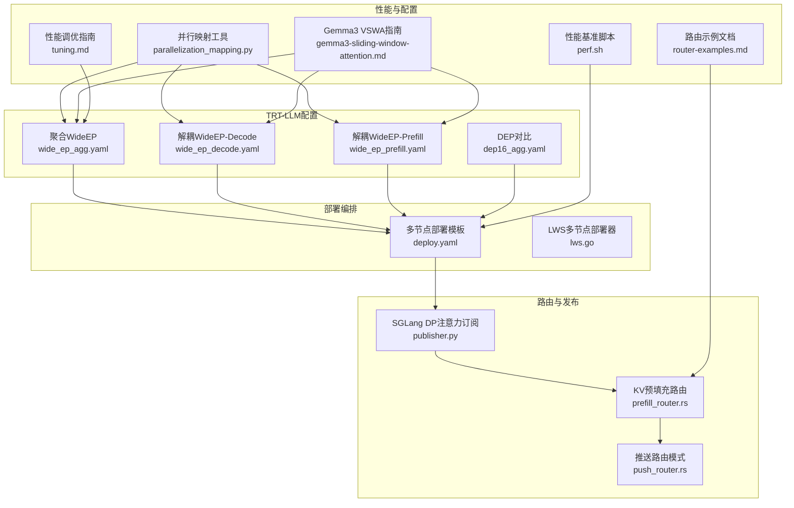
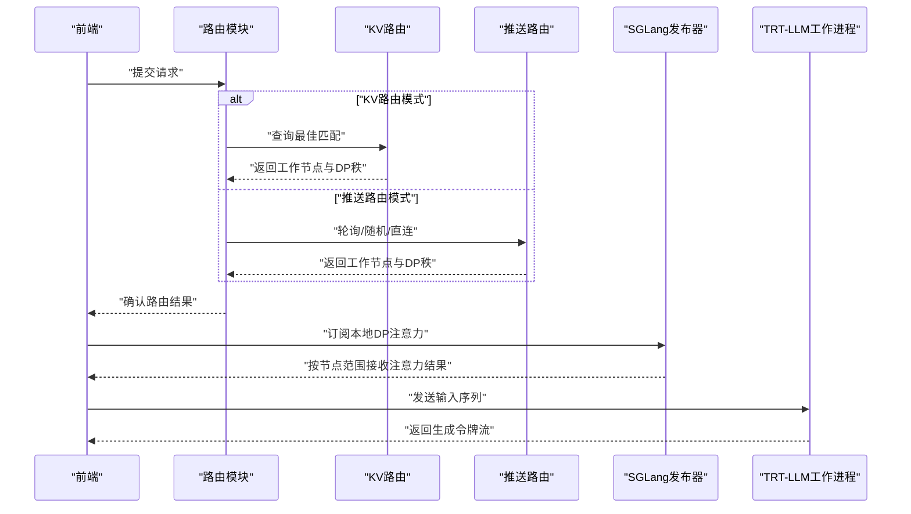
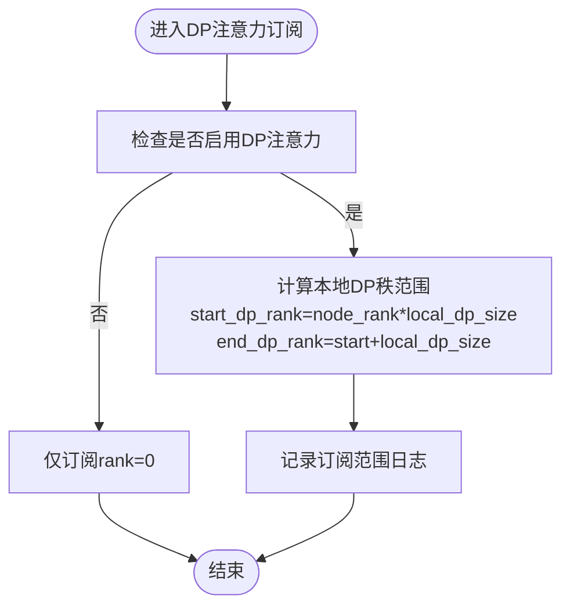
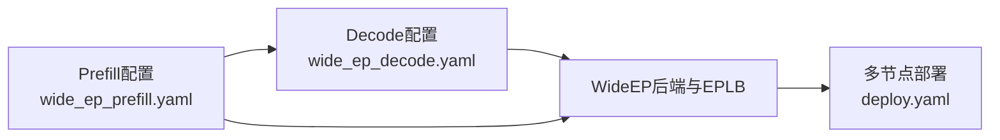
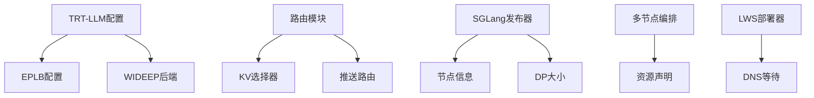

# WideEP和DP路由

<cite>
**本文引用的文件**
- [wide_ep_agg.yaml](file://examples/backends/trtllm/engine_configs/deepseek-r1/agg/wide_ep/wide_ep_agg.yaml)
- [dep16_agg.yaml](file://examples/backends/trtllm/engine_configs/deepseek-r1/agg/wide_ep/dep16_agg.yaml)
- [wide_ep_decode.yaml](file://examples/backends/trtllm/engine_configs/deepseek-r1/disagg/wide_ep/wide_ep_decode.yaml)
- [wide_ep_prefill.yaml](file://examples/backends/trtllm/engine_configs/deepseek-r1/disagg/wide_ep/wide_ep_prefill.yaml)
- [deploy.yaml](file://recipes/deepseek-r1/trtllm/disagg/wide_ep/gb200/deploy.yaml)
- [publisher.py](file://components/src/dynamo/sglang/publisher.py)
- [parallelization_mapping.py](file://benchmarks/profiler/utils/config_modifiers/parallelization_mapping.py)
- [perf.sh](file://benchmarks/llm/perf.sh)
- [gemma3-sliding-window-attention.md](file://docs/pages/backends/trtllm/gemma3-sliding-window-attention.md)
- [router-examples.md](file://docs/pages/components/router/router-examples.md)
- [prefill_router.rs](file://lib/llm/src/kv_router/prefill_router.rs)
- [push_router.rs](file://lib/runtime/src/pipeline/network/egress/push_router.rs)
- [lws.go](file://deploy/operator/internal/dynamo/lws.go)
- [tuning.md](file://docs/pages/performance/tuning.md)
</cite>

## 目录
1. [引言](#引言)
2. [项目结构](#项目结构)
3. [核心组件](#核心组件)
4. [架构总览](#架构总览)
5. [详细组件分析](#详细组件分析)
6. [依赖关系分析](#依赖关系分析)
7. [性能考量](#性能考量)
8. [故障排查指南](#故障排查指南)
9. [结论](#结论)
10. [附录](#附录)

## 引言
本文件围绕TensorRT-LLM在Dynamo平台中的WideEP（宽并行）与数据并行（DP）注意力路由能力，提供从设计理念、实现原理到部署与性能调优的完整技术方案。重点涵盖：
- WideEP架构如何通过专家并行（EP）与负载均衡（EPLB）实现大规模MoE模型的水平扩展；
- 注意力数据并行（DP）路由机制及多注意力并行秩的管理；
- 配置指南：张量并行大小、注意力并行配置、路由算法选择；
- 先进特性集成：Gemma3可变滑动窗口注意力（VSWA）；
- 多节点部署步骤与性能调优建议；
- 不同路由策略对系统性能的影响与选择标准；
- 实际部署案例与性能基准参考。

## 项目结构
本仓库中与WideEP和DP路由直接相关的关键位置如下：
- TRT-LLM示例配置：聚合与解耦场景下的WideEP配置文件，以及DEP对比配置；
- 多节点部署编排：基于ComputeDomain与资源声明的部署模板；
- 路由与发布器：SGLang侧DP注意力订阅逻辑、KV路由与推送路由；
- 性能剖析与并行映射：并行化策略映射与引擎参数修改工具；
- 文档与脚本：Gemma3 VSWA部署指南、路由示例与性能调优建议。

图表来源
- [wide_ep_agg.yaml](file://examples/backends/trtllm/engine_configs/deepseek-r1/agg/wide_ep/wide_ep_agg.yaml#L1-L39)
- [wide_ep_decode.yaml](file://examples/backends/trtllm/engine_configs/deepseek-r1/disagg/wide_ep/wide_ep_decode.yaml#L1-L67)
- [wide_ep_prefill.yaml](file://examples/backends/trtllm/engine_configs/deepseek-r1/disagg/wide_ep/wide_ep_prefill.yaml#L1-L45)
- [dep16_agg.yaml](file://examples/backends/trtllm/engine_configs/deepseek-r1/agg/wide_ep/dep16_agg.yaml#L1-L30)
- [deploy.yaml](file://recipes/deepseek-r1/trtllm/disagg/wide_ep/gb200/deploy.yaml#L1-L251)
- [lws.go](file://deploy/operator/internal/dynamo/lws.go#L1-L37)
- [publisher.py](file://components/src/dynamo/sglang/publisher.py#L226-L248)
- [prefill_router.rs](file://lib/llm/src/kv_router/prefill_router.rs#L278-L313)
- [push_router.rs](file://lib/runtime/src/pipeline/network/egress/push_router.rs#L411-L428)
- [parallelization_mapping.py](file://benchmarks/profiler/utils/config_modifiers/parallelization_mapping.py#L41-L250)
- [perf.sh](file://benchmarks/llm/perf.sh#L141-L166)
- [gemma3-sliding-window-attention.md](file://docs/pages/backends/trtllm/gemma3-sliding-window-attention.md#L1-L53)
- [router-examples.md](file://docs/pages/components/router/router-examples.md#L190-L216)
- [tuning.md](file://docs/pages/performance/tuning.md#L19-L34)

章节来源
- [wide_ep_agg.yaml](file://examples/backends/trtllm/engine_configs/deepseek-r1/agg/wide_ep/wide_ep_agg.yaml#L1-L39)
- [wide_ep_decode.yaml](file://examples/backends/trtllm/engine_configs/deepseek-r1/disagg/wide_ep/wide_ep_decode.yaml#L1-L67)
- [wide_ep_prefill.yaml](file://examples/backends/trtllm/engine_configs/deepseek-r1/disagg/wide_ep/wide_ep_prefill.yaml#L1-L45)
- [dep16_agg.yaml](file://examples/backends/trtllm/engine_configs/deepseek-r1/agg/wide_ep/dep16_agg.yaml#L1-L30)
- [deploy.yaml](file://recipes/deepseek-r1/trtllm/disagg/wide_ep/gb200/deploy.yaml#L1-L251)
- [lws.go](file://deploy/operator/internal/dynamo/lws.go#L1-L37)
- [publisher.py](file://components/src/dynamo/sglang/publisher.py#L226-L248)
- [prefill_router.rs](file://lib/llm/src/kv_router/prefill_router.rs#L278-L313)
- [push_router.rs](file://lib/runtime/src/pipeline/network/egress/push_router.rs#L411-L428)
- [parallelization_mapping.py](file://benchmarks/profiler/utils/config_modifiers/parallelization_mapping.py#L41-L250)
- [perf.sh](file://benchmarks/llm/perf.sh#L141-L166)
- [gemma3-sliding-window-attention.md](file://docs/pages/backends/trtllm/gemma3-sliding-window-attention.md#L1-L53)
- [router-examples.md](file://docs/pages/components/router/router-examples.md#L190-L216)
- [tuning.md](file://docs/pages/performance/tuning.md#L19-L34)

## 核心组件
- WideEP与EPLB：通过专家并行（moe_expert_parallel_size）与在线专家负载均衡（num_slots、layer_updates_per_iter）实现跨节点的专家分片与动态重平衡。
- 注意力数据并行（DP）：通过enable_attention_dp启用，结合DP秩范围计算，使注意力计算在多个本地DP副本间分布，降低跨节点通信压力。
- TRT-LLM解耦部署：Prefill与Decode分别以不同并行度与缓存策略运行，支持WideEP与EPLB。
- 路由与发布：SGLang侧按节点维度订阅本地DP注意力结果；KV路由与推送路由在请求阶段进行工作节点选择与流量调度。
- 并行映射与引擎参数：统一的并行策略映射工具将TP/TEP/DEP映射到具体引擎参数，确保配置一致性与可验证性。

章节来源
- [wide_ep_agg.yaml](file://examples/backends/trtllm/engine_configs/deepseek-r1/agg/wide_ep/wide_ep_agg.yaml#L6-L21)
- [wide_ep_decode.yaml](file://examples/backends/trtllm/engine_configs/deepseek-r1/disagg/wide_ep/wide_ep_decode.yaml#L18-L26)
- [wide_ep_prefill.yaml](file://examples/backends/trtllm/engine_configs/deepseek-r1/disagg/wide_ep/wide_ep_prefill.yaml#L18-L26)
- [publisher.py](file://components/src/dynamo/sglang/publisher.py#L226-L248)
- [parallelization_mapping.py](file://benchmarks/profiler/utils/config_modifiers/parallelization_mapping.py#L41-L105)

## 架构总览
下图展示WideEP与DP注意力路由在Dynamo中的端到端交互：前端接收请求，路由模块根据策略选择工作节点，TRT-LLM工作进程执行前向计算，SGLang侧按节点订阅本地DP注意力结果，最终返回生成流。

图表来源
- [prefill_router.rs](file://lib/llm/src/kv_router/prefill_router.rs#L278-L313)
- [push_router.rs](file://lib/runtime/src/pipeline/network/egress/push_router.rs#L411-L428)
- [publisher.py](file://components/src/dynamo/sglang/publisher.py#L226-L248)

## 详细组件分析

### WideEP与EPLB设计与实现
- 设计理念
  - 将MoE专家按组切分并限制路由在组内，优先在同一节点内完成专家计算，减少跨节点数据移动。
  - 在预填充阶段采用分层负载均衡（按专家组打包），在解码阶段采用全局负载均衡（无组限制）。
- 实现要点
  - 在TRT-LLM配置中启用WIDEEP后端与EPLB配置文件，设置专家并行大小与槽位数、层更新频率等参数。
  - 通过并行映射工具将DEP映射为专家并行，确保KV头分割与专家分片一致。
- 关键配置项
  - moe_config.backend=WIDEEP
  - moe_config.load_balancer=EPLB配置路径
  - moe_expert_parallel_size
  - num_slots、layer_updates_per_iter

章节来源
- [wide_ep_agg.yaml](file://examples/backends/trtllm/engine_configs/deepseek-r1/agg/wide_ep/wide_ep_agg.yaml#L6-L14)
- [wide_ep_decode.yaml](file://examples/backends/trtllm/engine_configs/deepseek-r1/disagg/wide_ep/wide_ep_decode.yaml#L18-L21)
- [wide_ep_prefill.yaml](file://examples/backends/trtllm/engine_configs/deepseek-r1/disagg/wide_ep/wide_ep_prefill.yaml#L18-L21)
- [parallelization_mapping.py](file://benchmarks/profiler/utils/config_modifiers/parallelization_mapping.py#L65-L88)

### 注意力数据并行（DP）路由机制
- DP注意力启用
  - 通过enable_attention_dp开启注意力阶段的数据并行，结合dp_size与节点数计算每个节点的本地DP秩范围。
- 节点维度订阅
  - SGLang发布器根据node_rank与dp_size计算本地DP秩区间，仅订阅该区间的注意力通道，避免跨节点冗余处理。
- 请求路由策略
  - 预填充阶段：优先KV路由或状态感知路由；解码阶段：可采用轮询、随机或直连策略，必要时进行负载探测与自定义评分。

图表来源
- [publisher.py](file://components/src/dynamo/sglang/publisher.py#L226-L248)

章节来源
- [publisher.py](file://components/src/dynamo/sglang/publisher.py#L226-L248)
- [prefill_router.rs](file://lib/llm/src/kv_router/prefill_router.rs#L278-L313)
- [push_router.rs](file://lib/runtime/src/pipeline/network/egress/push_router.rs#L411-L428)
- [router-examples.md](file://docs/pages/components/router/router-examples.md#L190-L216)

### TRT-LLM解耦部署与WideEP配置
- 解耦优势
  - Prefill与Decode使用不同并行度与缓存策略，最大化吞吐与延迟权衡。
- WideEP配置要点
  - Prefill：高max_num_tokens、较小max_batch_size、禁用overlap_scheduler以稳定长上下文。
  - Decode：高tensor_parallel_size与moe_expert_parallel_size、启用cuda图批尺寸覆盖大并发。
- 多节点部署
  - 使用ComputeDomain与资源声明，将Prefill与Decode分布在不同节点上，满足GB200等硬件资源约束。

图表来源
- [wide_ep_prefill.yaml](file://examples/backends/trtllm/engine_configs/deepseek-r1/disagg/wide_ep/wide_ep_prefill.yaml#L1-L45)
- [wide_ep_decode.yaml](file://examples/backends/trtllm/engine_configs/deepseek-r1/disagg/wide_ep/wide_ep_decode.yaml#L1-L67)
- [deploy.yaml](file://recipes/deepseek-r1/trtllm/disagg/wide_ep/gb200/deploy.yaml#L1-L251)

章节来源
- [wide_ep_prefill.yaml](file://examples/backends/trtllm/engine_configs/deepseek-r1/disagg/wide_ep/wide_ep_prefill.yaml#L28-L41)
- [wide_ep_decode.yaml](file://examples/backends/trtllm/engine_configs/deepseek-r1/disagg/wide_ep/wide_ep_decode.yaml#L28-L46)
- [deploy.yaml](file://recipes/deepseek-r1/trtllm/disagg/wide_ep/gb200/deploy.yaml#L136-L250)

### Gemma3可变滑动窗口注意力（VSWA）集成
- 特性概述
  - 模型层交替使用全局注意力与滑动窗口注意力，适合长序列建模。
- 部署要点
  - 使用指定版本的Dynamo运行时镜像以规避VSWA回归问题；
  - 聚合与解耦部署均可启用VSWA，注意FP8 dtype一致性与缓存配置。
- 参考命令与配置路径见文档。

章节来源
- [gemma3-sliding-window-attention.md](file://docs/pages/backends/trtllm/gemma3-sliding-window-attention.md#L1-L53)

### 并行映射与配置应用
- 并行策略映射
  - 支持TP、TEP、DEP三种策略，自动推导KV头拆分与专家拆分大小；
  - DEP用于注意力阶段的数据并行，TP/TEP不在此阶段使用DP。
- 配置应用流程
  - 基于最佳映射对引擎配置进行参数注入，区分聚合与解耦场景。

章节来源
- [parallelization_mapping.py](file://benchmarks/profiler/utils/config_modifiers/parallelization_mapping.py#L41-L105)
- [parallelization_mapping.py](file://benchmarks/profiler/utils/config_modifiers/parallelization_mapping.py#L224-L250)

### 路由策略与性能影响
- 策略类型
  - 随机、轮询、直连：适用于简单均匀负载场景；
  - KV路由：基于上下文重叠与LoRA标签选择最优工作节点；
  - 自定义负载路由：通过潜在负载评估实现最小TTFT等目标。
- 选择标准
  - 预填充阶段更关注吞吐与KV缓存占用；
  - 解码阶段更关注延迟与节点间负载均衡。

章节来源
- [push_router.rs](file://lib/runtime/src/pipeline/network/egress/push_router.rs#L411-L428)
- [prefill_router.rs](file://lib/llm/src/kv_router/prefill_router.rs#L278-L313)
- [router-examples.md](file://docs/pages/components/router/router-examples.md#L190-L216)

## 依赖关系分析
- 组件耦合
  - TRT-LLM配置依赖EPLB与WIDEEP后端；
  - 路由模块依赖KV选择器与推送路由实现；
  - 发布器依赖节点信息与DP大小计算本地订阅范围。
- 外部依赖
  - 多节点编排依赖ComputeDomain与资源声明；
  - LWS部署器提供主机名派生与DNS等待策略。

图表来源
- [wide_ep_agg.yaml](file://examples/backends/trtllm/engine_configs/deepseek-r1/agg/wide_ep/wide_ep_agg.yaml#L6-L14)
- [prefill_router.rs](file://lib/llm/src/kv_router/prefill_router.rs#L278-L313)
- [push_router.rs](file://lib/runtime/src/pipeline/network/egress/push_router.rs#L411-L428)
- [publisher.py](file://components/src/dynamo/sglang/publisher.py#L226-L248)
- [deploy.yaml](file://recipes/deepseek-r1/trtllm/disagg/wide_ep/gb200/deploy.yaml#L90-L250)
- [lws.go](file://deploy/operator/internal/dynamo/lws.go#L18-L37)

章节来源
- [wide_ep_agg.yaml](file://examples/backends/trtllm/engine_configs/deepseek-r1/agg/wide_ep/wide_ep_agg.yaml#L6-L14)
- [prefill_router.rs](file://lib/llm/src/kv_router/prefill_router.rs#L278-L313)
- [push_router.rs](file://lib/runtime/src/pipeline/network/egress/push_router.rs#L411-L428)
- [publisher.py](file://components/src/dynamo/sglang/publisher.py#L226-L248)
- [deploy.yaml](file://recipes/deepseek-r1/trtllm/disagg/wide_ep/gb200/deploy.yaml#L90-L250)
- [lws.go](file://deploy/operator/internal/dynamo/lws.go#L18-L37)

## 性能考量
- 并行映射优先级
  - 密集模型通常采用“节点内TP、跨节点PP”的组合；DEP在注意力阶段提供DP能力，需与EP协同。
- GPU数量与吞吐/延迟权衡
  - GPU数量与性能呈非线性关系，需在KV缓存充足与通信开销之间取得平衡。
- 缓存与dtype
  - FP8与合适的free_gpu_memory_fraction有助于在高并发下维持长上下文。
- 基准脚本
  - 支持聚合与解耦模式的TP/DP参数校验与打印，便于快速定位配置问题。

章节来源
- [tuning.md](file://docs/pages/performance/tuning.md#L19-L34)
- [perf.sh](file://benchmarks/llm/perf.sh#L141-L166)
- [wide_ep_decode.yaml](file://examples/backends/trtllm/engine_configs/deepseek-r1/disagg/wide_ep/wide_ep_decode.yaml#L33-L39)
- [wide_ep_prefill.yaml](file://examples/backends/trtllm/engine_configs/deepseek-r1/disagg/wide_ep/wide_ep_prefill.yaml#L32-L34)

## 故障排查指南
- DP注意力订阅异常
  - 检查enable_dp_attention与dp_size、nnodes、node_rank配置是否正确，确认本地DP秩范围日志输出。
- 路由选择失败
  - 预填充阶段若KV路由不可用，回退至状态感知路由；解码阶段可尝试随机/轮询或自定义负载路由。
- 多节点启动问题
  - LWS需要DNS等待，确保Pod同时启动时网络可用；核对ComputeDomain与资源声明。
- VSWA功能异常
  - 使用推荐版本的Dynamo运行时镜像，确保FP8 dtype一致且缓存配置合理。

章节来源
- [publisher.py](file://components/src/dynamo/sglang/publisher.py#L226-L248)
- [prefill_router.rs](file://lib/llm/src/kv_router/prefill_router.rs#L278-L313)
- [lws.go](file://deploy/operator/internal/dynamo/lws.go#L18-L37)
- [gemma3-sliding-window-attention.md](file://docs/pages/backends/trtllm/gemma3-sliding-window-attention.md#L11-L14)

## 结论
WideEP与DP注意力路由为大规模MoE模型提供了高效的水平扩展路径。通过专家并行与EPLB实现跨节点专家负载均衡，结合注意力阶段的数据并行与节点维度订阅，显著降低了跨节点通信成本。配合TRT-LLM解耦部署、KV路由与推送路由策略，可在多节点环境下实现高吞吐与低延迟的推理服务。建议在实际部署中优先验证并行映射与缓存配置，结合性能基准脚本进行迭代优化。

## 附录
- 配置清单与建议
  - 启用WIDEEP与EPLB：在TRT-LLM配置中设置moe_config.backend与load_balancer。
  - 设置moe_expert_parallel_size与tensor_parallel_size相等，确保EP与TP对齐。
  - 启用enable_attention_dp并在SGLang发布器中按节点计算本地DP秩范围。
  - 预填充使用高max_num_tokens与禁用overlap_scheduler，解码启用cuda图与较大batch_sizes。
  - 多节点部署使用ComputeDomain与资源声明，LWS部署器启用DNS等待。
- 实战案例
  - 参考GB200多节点部署模板，结合WideEP与EPLB配置，实现Prefill与Decode的解耦部署。
  - 使用性能基准脚本验证聚合与解耦模式下的TP/DP组合效果。

章节来源
- [wide_ep_agg.yaml](file://examples/backends/trtllm/engine_configs/deepseek-r1/agg/wide_ep/wide_ep_agg.yaml#L6-L21)
- [wide_ep_decode.yaml](file://examples/backends/trtllm/engine_configs/deepseek-r1/disagg/wide_ep/wide_ep_decode.yaml#L22-L56)
- [wide_ep_prefill.yaml](file://examples/backends/trtllm/engine_configs/deepseek-r1/disagg/wide_ep/wide_ep_prefill.yaml#L22-L41)
- [deploy.yaml](file://recipes/deepseek-r1/trtllm/disagg/wide_ep/gb200/deploy.yaml#L136-L250)
- [perf.sh](file://benchmarks/llm/perf.sh#L141-L166)