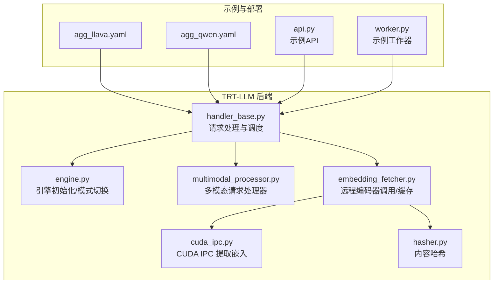
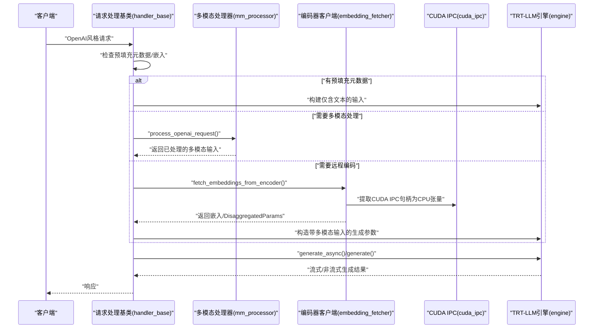
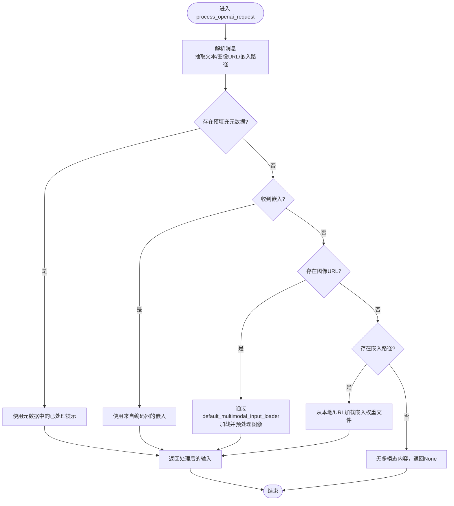
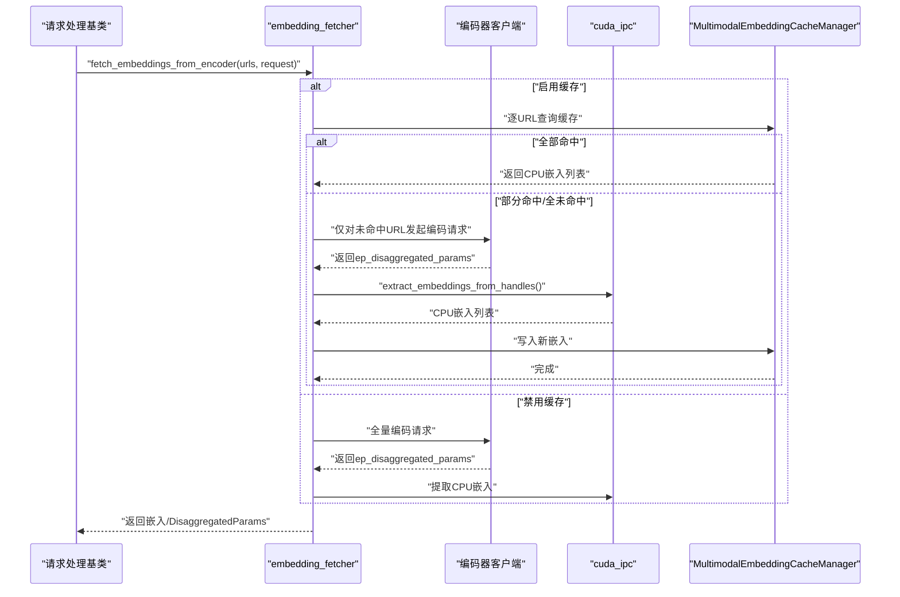
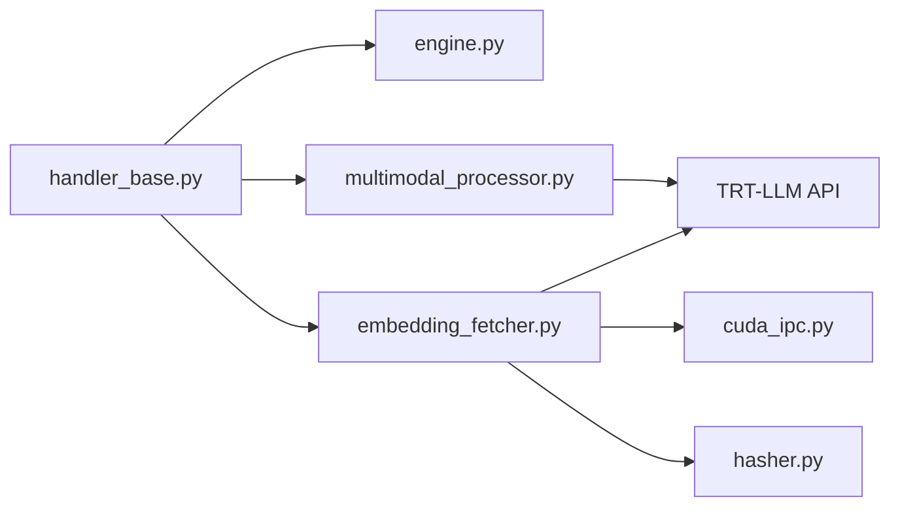

# 多模态支持

<cite>
**本文引用的文件**
- [multimodal_processor.py](file://components/src/dynamo/trtllm/multimodal_processor.py)
- [embedding_fetcher.py](file://components/src/dynamo/trtllm/multimodal/embedding_fetcher.py)
- [cuda_ipc.py](file://components/src/dynamo/trtllm/multimodal/cuda_ipc.py)
- [hasher.py](file://components/src/dynamo/trtllm/multimodal/hasher.py)
- [handler_base.py](file://components/src/dynamo/trtllm/request_handlers/handler_base.py)
- [engine.py](file://components/src/dynamo/trtllm/engine.py)
- [trtllm_utils.py](file://components/src/dynamo/trtllm/utils/trtllm_utils.py)
- [agg_llava.yaml](file://examples/multimodal/deploy/agg_llava.yaml)
- [agg_qwen.yaml](file://examples/multimodal/deploy/agg_qwen.yaml)
- [encode_helper.py](file://components/src/dynamo/trtllm/encode_helper.py)
- [api.py](file://examples/deployments/router_standalone_trtllm/api.py)
- [worker.py](file://examples/deployments/router_standalone_trtllm/worker.py)
- [test_multimodal_embedding_cache_manager.py](file://components/src/dynamo/common/tests/memory/test_multimodal_embedding_cache_manager.py)
- [test_async_encoder_cache.py](file://components/src/dynamo/common/tests/multimodal/test_async_encoder_cache.py)
</cite>

## 目录
1. [简介](#简介)
2. [项目结构](#项目结构)
3. [核心组件](#核心组件)
4. [架构总览](#架构总览)
5. [详细组件分析](#详细组件分析)
6. [依赖关系分析](#依赖关系分析)
7. [性能考量](#性能考量)
8. [故障排查指南](#故障排查指南)
9. [结论](#结论)
10. [附录](#附录)

## 简介
本章节面向希望在Dynamo框架下使用TensorRT-LLM进行多模态（文本、图像等）推理的工程师与架构师。文档系统性阐述以下内容：
- 多模态编码器工作原理：视觉特征提取、文本编码与跨模态融合
- 多模态请求处理链路：从输入预处理到输出生成的端到端流程
- 多模态模型配置指南：不同模型架构的支持情况与关键参数
- 多模态API使用示例与请求格式规范
- 多模态缓存管理策略与性能优化技巧
- 部署最佳实践与常见问题解决方案

## 项目结构
围绕TRT-LLM后端的多模态能力，相关代码主要分布在以下模块：
- 请求处理与调度：request_handlers
- 引擎初始化与模式切换：engine
- 多模态请求处理器：multimodal_processor
- 编码器与缓存：multimodal/embedding_fetcher、cuda_ipc、hasher
- 命令行与运行时参数：trtllm_utils
- 示例部署清单：examples/multimodal/deploy/*.yaml
- 示例API与工作器：examples/deployments/router_standalone_trtllm

图表来源
- [handler_base.py](file://components/src/dynamo/trtllm/request_handlers/handler_base.py#L77-L104)
- [engine.py](file://components/src/dynamo/trtllm/engine.py#L55-L77)
- [multimodal_processor.py](file://components/src/dynamo/trtllm/multimodal_processor.py#L46-L71)
- [embedding_fetcher.py](file://components/src/dynamo/trtllm/multimodal/embedding_fetcher.py#L26-L67)
- [cuda_ipc.py](file://components/src/dynamo/trtllm/multimodal/cuda_ipc.py#L14-L43)
- [hasher.py](file://components/src/dynamo/trtllm/multimodal/hasher.py#L21-L49)
- [agg_llava.yaml](file://examples/multimodal/deploy/agg_llava.yaml#L1-L64)
- [agg_qwen.yaml](file://examples/multimodal/deploy/agg_qwen.yaml#L1-L65)
- [api.py](file://examples/deployments/router_standalone_trtllm/api.py#L290-L322)
- [worker.py](file://examples/deployments/router_standalone_trtllm/worker.py#L525-L559)

章节来源
- [handler_base.py](file://components/src/dynamo/trtllm/request_handlers/handler_base.py#L77-L104)
- [engine.py](file://components/src/dynamo/trtllm/engine.py#L55-L77)
- [multimodal_processor.py](file://components/src/dynamo/trtllm/multimodal_processor.py#L46-L71)
- [embedding_fetcher.py](file://components/src/dynamo/trtllm/multimodal/embedding_fetcher.py#L26-L67)
- [cuda_ipc.py](file://components/src/dynamo/trtllm/multimodal/cuda_ipc.py#L14-L43)
- [hasher.py](file://components/src/dynamo/trtllm/multimodal/hasher.py#L21-L49)
- [agg_llava.yaml](file://examples/multimodal/deploy/agg_llava.yaml#L1-L64)
- [agg_qwen.yaml](file://examples/multimodal/deploy/agg_qwen.yaml#L1-L65)
- [api.py](file://examples/deployments/router_standalone_trtllm/api.py#L290-L322)
- [worker.py](file://examples/deployments/router_standalone_trtllm/worker.py#L525-L559)

## 核心组件
- 多模态请求处理器：负责解析OpenAI风格消息、抽取文本提示与媒体、加载嵌入或下载图像、调用TRT-LLM默认多模态输入加载器，返回可被引擎消费的输入结构。
- 远程编码器与缓存：封装对编码器工作器的调用，支持按URL粒度的缓存与部分重编码；通过CUDA IPC句柄在GPU间传递嵌入，并异步提取到CPU。
- 引擎与模式：根据拆分/聚合/编码模式初始化不同类型的引擎实例（标准LLM或MultimodalEncoder），并在解码阶段复用预填充元数据以避免重复处理多媒体。
- 请求处理基类：统一将OpenAI风格请求转换为TRT-LLM内部格式，协调多模态路径与文本路径。

章节来源
- [multimodal_processor.py](file://components/src/dynamo/trtllm/multimodal_processor.py#L168-L235)
- [embedding_fetcher.py](file://components/src/dynamo/trtllm/multimodal/embedding_fetcher.py#L26-L67)
- [engine.py](file://components/src/dynamo/trtllm/engine.py#L55-L77)
- [handler_base.py](file://components/src/dynamo/trtllm/request_handlers/handler_base.py#L515-L524)

## 架构总览
下图展示Dynamo中TRT-LLM多模态请求的关键交互：前端/路由器将OpenAI风格请求交给请求处理基类，后者根据是否具备预填充元数据或嵌入选择不同路径；若需要远程编码，则通过编码器客户端调用编码器工作器，获取CUDA IPC句柄并提取嵌入，随后进入生成阶段。

图表来源
- [handler_base.py](file://components/src/dynamo/trtllm/request_handlers/handler_base.py#L444-L536)
- [multimodal_processor.py](file://components/src/dynamo/trtllm/multimodal_processor.py#L168-L235)
- [embedding_fetcher.py](file://components/src/dynamo/trtllm/multimodal/embedding_fetcher.py#L26-L67)
- [cuda_ipc.py](file://components/src/dynamo/trtllm/multimodal/cuda_ipc.py#L14-L43)
- [engine.py](file://components/src/dynamo/trtllm/engine.py#L55-L77)

## 详细组件分析

### 多模态请求处理器（MultimodalRequestProcessor）
职责与流程：
- 解析消息，抽取文本与媒体（图像URL或嵌入权重文件路径）
- 根据是否存在预填充元数据、嵌入或图像URL选择不同路径
- 使用TRT-LLM默认多模态输入加载器同步执行图像下载与预处理（通过异步线程池并发化）
- 返回可直接用于生成的输入字典或原始token_ids

图表来源
- [multimodal_processor.py](file://components/src/dynamo/trtllm/multimodal_processor.py#L168-L235)

章节来源
- [multimodal_processor.py](file://components/src/dynamo/trtllm/multimodal_processor.py#L141-L235)

### 远程编码器与缓存（embedding_fetcher + cuda_ipc + hasher）
- 远程编码：通过轮询客户端调用编码器工作器，获取包含CUDA IPC句柄的DisaggregatedParams
- 缓存策略：按URL计算BLAKE3哈希，命中则直接复用CPU张量；未命中则仅对缺失URL发起一次编码请求，批量提取嵌入并写回缓存
- CUDA IPC提取：在工作线程中重建SharedTensorContainer，将GPU张量安全地移动到CPU，避免事件循环阻塞

图表来源
- [embedding_fetcher.py](file://components/src/dynamo/trtllm/multimodal/embedding_fetcher.py#L26-L204)
- [cuda_ipc.py](file://components/src/dynamo/trtllm/multimodal/cuda_ipc.py#L14-L62)
- [hasher.py](file://components/src/dynamo/trtllm/multimodal/hasher.py#L21-L49)

章节来源
- [embedding_fetcher.py](file://components/src/dynamo/trtllm/multimodal/embedding_fetcher.py#L26-L204)
- [cuda_ipc.py](file://components/src/dynamo/trtllm/multimodal/cuda_ipc.py#L14-L62)
- [hasher.py](file://components/src/dynamo/trtllm/multimodal/hasher.py#L21-L49)

### 引擎初始化与模式切换（engine）
- 拆分/编码模式：初始化MultimodalEncoder，专注图像嵌入生成
- 预填充/解码模式：初始化标准TRT-LLM LLM，承载后续生成任务
- 通过engine_args传递模型路径、批大小、KV缓存等参数

章节来源
- [engine.py](file://components/src/dynamo/trtllm/engine.py#L55-L77)

### 请求处理基类（handler_base）
- 解码阶段复用预填充元数据，避免重复处理图像
- 文本-only回退路径：直接使用token_ids
- 将OpenAI风格采样参数映射到TRT-LLM内部格式

章节来源
- [handler_base.py](file://components/src/dynamo/trtllm/request_handlers/handler_base.py#L444-L536)

### 示例API与工作器（router_standalone_trtllm）
- 示例API演示如何替换图像占位符、计算多模态哈希
- 示例工作器展示如何调用TRT-LLM生成接口并格式化输出

章节来源
- [api.py](file://examples/deployments/router_standalone_trtllm/api.py#L290-L322)
- [worker.py](file://examples/deployments/router_standalone_trtllm/worker.py#L525-L559)

## 依赖关系分析
- 组件耦合
  - 请求处理基类依赖引擎、多模态处理器、编码器客户端与分布式运行时
  - 多模态处理器依赖TRT-LLM默认多模态输入加载器与分词器工厂
  - 编码器客户端依赖CUDA IPC工具与缓存管理器
- 外部依赖
  - TRT-LLM引擎与API（MultimodalEncoder、default_multimodal_input_loader、DisaggregatedParams）
  - PyTorch SharedTensorContainer用于CUDA IPC重建
  - BLAKE3用于内容哈希

图表来源
- [handler_base.py](file://components/src/dynamo/trtllm/request_handlers/handler_base.py#L77-L104)
- [engine.py](file://components/src/dynamo/trtllm/engine.py#L55-L77)
- [multimodal_processor.py](file://components/src/dynamo/trtllm/multimodal_processor.py#L25-L27)
- [embedding_fetcher.py](file://components/src/dynamo/trtllm/multimodal/embedding_fetcher.py#L15-L21)
- [cuda_ipc.py](file://components/src/dynamo/trtllm/multimodal/cuda_ipc.py#L8-L9)
- [hasher.py](file://components/src/dynamo/trtllm/multimodal/hasher.py#L18-L18)

## 性能考量
- 并发与吞吐
  - 多模态输入加载器默认同步执行，通过异步线程池并发化，提升高并发下的图像下载与预处理吞吐
- 缓存策略
  - 按URL粒度缓存嵌入，命中即返回CPU张量，避免重复编码与GPU→CPU传输
  - 支持部分重编码：仅对未命中URL发起一次编码请求，减少网络与计算开销
- CUDA IPC与内存
  - 在工作线程中执行GPU→CPU张量提取，避免事件循环阻塞
  - 建议确保“一个生产者对应一个消费者”，以正确释放GPU内存
- 参数与模式
  - 合理设置最大批大小与KV缓存配置，平衡延迟与吞吐
  - 解码阶段优先复用预填充元数据，避免重复处理多媒体

章节来源
- [multimodal_processor.py](file://components/src/dynamo/trtllm/multimodal_processor.py#L215-L229)
- [embedding_fetcher.py](file://components/src/dynamo/trtllm/multimodal/embedding_fetcher.py#L114-L204)
- [cuda_ipc.py](file://components/src/dynamo/trtllm/multimodal/cuda_ipc.py#L14-L43)
- [engine.py](file://components/src/dynamo/trtllm/engine.py#L63-L73)

## 故障排查指南
- 图像加载失败
  - 检查URL可达性与文件大小限制；确认允许的本地媒体目录配置
- CUDA IPC提取错误
  - 确认句柄字段完整且有效；避免在函数外复用句柄；确保生产者-消费者一一对应
- 缓存未命中
  - 核对URL哈希是否一致；确认缓存容量与LRU淘汰策略；检查写入是否成功
- 预填充元数据缺失
  - 确保编码器返回processed_prompt与prompt_token_ids；解码阶段将自动复用

章节来源
- [multimodal_processor.py](file://components/src/dynamo/trtllm/multimodal_processor.py#L80-L139)
- [cuda_ipc.py](file://components/src/dynamo/trtllm/multimodal/cuda_ipc.py#L39-L62)
- [embedding_fetcher.py](file://components/src/dynamo/trtllm/multimodal/embedding_fetcher.py#L114-L204)
- [handler_base.py](file://components/src/dynamo/trtllm/request_handlers/handler_base.py#L480-L513)

## 结论
Dynamo在TRT-LLM后端提供了完善的多模态推理能力：通过可插拔的多模态处理器、灵活的远程编码与缓存机制、以及高效的CUDA IPC传输，实现了从文本到图像的跨模态融合与低延迟生成。结合合理的参数配置与缓存策略，可在多种部署场景中获得稳定且高性能的体验。

## 附录

### 多模态模型配置指南
- 支持的模型类型
  - LLaVA系列：需提供视觉编码器与投影模块
  - Qwen-VL系列：使用内置图像特征提取逻辑
- 关键参数
  - 模型路径与批大小：由engine_args传入
  - 分词器与模型目录：用于应用聊天模板与占位符替换
  - 缓存容量：控制嵌入缓存上限（GB）
- 示例部署清单
  - LLaVA：包含前端、编码器与VLM工作器的聚合部署
  - Qwen-VL：包含前端、编码器与处理器的聚合部署

章节来源
- [trtllm_utils.py](file://components/src/dynamo/trtllm/utils/trtllm_utils.py#L240-L277)
- [agg_llava.yaml](file://examples/multimodal/deploy/agg_llava.yaml#L1-L64)
- [agg_qwen.yaml](file://examples/multimodal/deploy/agg_qwen.yaml#L1-L65)

### 多模态请求处理流程（从输入到输出）
- 输入预处理
  - 解析OpenAI消息，抽取文本与媒体
  - 若存在预填充元数据，直接复用已处理提示与token_ids
  - 否则根据是否有嵌入或图像URL选择相应路径
- 编码与缓存
  - 远程编码器按URL粒度缓存嵌入；未命中时批量重编码并提取CPU张量
- 生成
  - 构造带多模态输入的生成参数，调用TRT-LLM引擎生成
- 输出
  - 格式化为标准响应结构，支持流式增量输出

章节来源
- [handler_base.py](file://components/src/dynamo/trtllm/request_handlers/handler_base.py#L444-L536)
- [multimodal_processor.py](file://components/src/dynamo/trtllm/multimodal_processor.py#L168-L235)
- [embedding_fetcher.py](file://components/src/dynamo/trtllm/multimodal/embedding_fetcher.py#L26-L204)
- [worker.py](file://examples/deployments/router_standalone_trtllm/worker.py#L525-L559)

### 实际API使用示例与请求格式规范
- 替换图像占位符
  - 将连续的图像token替换为占位符ID，并记录每张图像的区间位置
- 计算多模态哈希
  - 对每张图像计算BLAKE3哈希，用于缓存键与一致性校验
- 示例API
  - 展示如何在路由层进行图像占位符替换与哈希计算

章节来源
- [api.py](file://examples/deployments/router_standalone_trtllm/api.py#L290-L322)

### 多模态缓存管理策略与测试参考
- 缓存管理器
  - LRU淘汰、命中/未命中统计、利用率计算
- 异步编码缓存
  - 请求去重与并发合并，避免重复计算
- 单元测试
  - 覆盖基本操作、LRU淘汰、尺寸跟踪、统计指标与连续张量要求

章节来源
- [test_multimodal_embedding_cache_manager.py](file://components/src/dynamo/common/tests/memory/test_multimodal_embedding_cache_manager.py#L14-L224)
- [test_async_encoder_cache.py](file://components/src/dynamo/common/tests/multimodal/test_async_encoder_cache.py#L17-L88)