# 推测式解码

<cite>
**本文引用的文件**
- [推测式解码总览](file://docs/pages/features/speculative-decoding/README.md)
- [vLLM 推测式解码指南](file://docs/pages/features/speculative-decoding/speculative-decoding-vllm.md)
- [Llama4+Maverick+Eagle 部署指南（TRT-LLM）](file://docs/pages/backends/trtllm/llama4-plus-eagle.md)
- [TRT-LLM 预填充引擎配置（Eagle）](file://examples/backends/trtllm/engine_configs/llama4/eagle/eagle_prefill.yaml)
- [TRT-LLM 解码引擎配置（Eagle）](file://examples/backends/trtllm/engine_configs/llama4/eagle/eagle_decode.yaml)
- [TRT-LLM 聚合引擎配置（Eagle）](file://examples/backends/trtllm/engine_configs/llama4/eagle/eagle_agg.yml)
- [KV 缓存槽位与推测式解码分配（测试用例）](file://lib/bindings/kvbm/src/block_manager/vllm/slot.rs)
- [请求路由：从预填充到解码阶段切换](file://lib/llm/src/kv_router/prefill_router.rs)
- [TRT-LLM 引擎初始化（多模态编码器/标准 LLM）](file://components/src/dynamo/trtllm/engine.py)
- [vLLM 处理器（LoRA 回滚逻辑）](file://components/src/dynamo/vllm/handlers.py)
</cite>

## 目录
1. [引言](#引言)
2. [项目结构](#项目结构)
3. [核心组件](#核心组件)
4. [架构总览](#架构总览)
5. [详细组件分析](#详细组件分析)
6. [依赖关系分析](#依赖关系分析)
7. [性能考量](#性能考量)
8. [故障排除指南](#故障排除指南)
9. [结论](#结论)
10. [附录](#附录)

## 引言
本指南聚焦于 TensorRT-LLM 的推测式解码能力，系统讲解 Llama4+Maverick 与 Eagle 推测式解码的技术原理与实现要点，覆盖主模型（Maverick）与推测模型（Eagle）的协作机制（token 预测、验证与回滚）、配置方法、参数调优、性能监控、适用场景与限制，并提供部署示例与排障建议。当前仓库中 TRT-LLM 的推测式解码以 Eagle 作为“草稿”模型，通过在预填充与解码阶段启用 speculative_config 来开启。

## 项目结构
围绕推测式解码的关键文件与路径如下：
- 文档与部署指南
  - 推测式解码总览与后端支持矩阵
  - vLLM 推测式解码快速开始
  - TRT-LLM Llama4+Maverick+Eagle 部署指南
- 引擎配置
  - TRT-LLM 预填充/解码/聚合配置（含 speculative_config）
- 运行时与测试
  - KV 缓存槽位与推测式解码容量分配（测试）
  - 请求路由阶段切换（预填充→解码）
  - TRT-LLM 引擎初始化（含多模态编码器）
  - vLLM 处理器中的回滚逻辑（参考）

**图表来源**
- [推测式解码总览](file://docs/pages/features/speculative-decoding/README.md#L1-L59)
- [vLLM 推测式解码指南](file://docs/pages/features/speculative-decoding/speculative-decoding-vllm.md#L1-L121)
- [Llama4+Maverick+Eagle 部署指南（TRT-LLM）](file://docs/pages/backends/trtllm/llama4-plus-eagle.md#L1-L74)
- [TRT-LLM 预填充引擎配置（Eagle）](file://examples/backends/trtllm/engine_configs/llama4/eagle/eagle_prefill.yaml#L1-L38)
- [TRT-LLM 解码引擎配置（Eagle）](file://examples/backends/trtllm/engine_configs/llama4/eagle/eagle_decode.yaml#L1-L53)
- [TRT-LLM 聚合引擎配置（Eagle）](file://examples/backends/trtllm/engine_configs/llama4/eagle/eagle_agg.yml#L1-L40)
- [KV 缓存槽位与推测式解码分配（测试用例）](file://lib/bindings/kvbm/src/block_manager/vllm/slot.rs#L1506-L1532)
- [请求路由：从预填充到解码阶段切换](file://lib/llm/src/kv_router/prefill_router.rs#L593-L623)
- [TRT-LLM 引擎初始化（多模态编码器/标准 LLM）](file://components/src/dynamo/trtllm/engine.py#L53-L77)
- [vLLM 处理器（LoRA 回滚逻辑）](file://components/src/dynamo/vllm/handlers.py#L591-L730)

**章节来源**
- [推测式解码总览](file://docs/pages/features/speculative-decoding/README.md#L1-L59)
- [vLLM 推测式解码指南](file://docs/pages/features/speculative-decoding/speculative-decoding-vllm.md#L1-L121)
- [Llama4+Maverick+Eagle 部署指南（TRT-LLM）](file://docs/pages/backends/trtllm/llama4-plus-eagle.md#L1-L74)

## 核心组件
- 推测式解码配置项
  - decoding_type: Eagle
  - max_draft_len: 草稿模型一次性生成的最大候选 token 数
  - speculative_model_dir: 草稿模型目录或名称
  - eagle3_one_model: 是否采用 Eagle3 的单模型模式
- TRT-LLM 引擎配置要点
  - 预填充/解码/聚合三类配置均包含 speculative_config 字段
  - 可结合 kv_cache_config、cuda_graph_config、print_iter_log 等进行性能优化
- 运行时行为
  - 预填充完成后进入解码阶段，请求跟踪器会更新阶段状态
  - KV 缓存槽位可按“推测式解码容量”进行分配与回收，支持部分使用场景

**章节来源**
- [TRT-LLM 预填充引擎配置（Eagle）](file://examples/backends/trtllm/engine_configs/llama4/eagle/eagle_prefill.yaml#L25-L30)
- [TRT-LLM 解码引擎配置（Eagle）](file://examples/backends/trtllm/engine_configs/llama4/eagle/eagle_decode.yaml#L25-L30)
- [TRT-LLM 聚合引擎配置（Eagle）](file://examples/backends/trtllm/engine_configs/llama4/eagle/eagle_agg.yml#L23-L28)
- [请求路由：从预填充到解码阶段切换](file://lib/llm/src/kv_router/prefill_router.rs#L607-L623)
- [KV 缓存槽位与推测式解码分配（测试用例）](file://lib/bindings/kvbm/src/block_manager/vllm/slot.rs#L1506-L1532)

## 架构总览
下图展示了 TRT-LLM 中“主模型（Maverick）+ 草稿模型（Eagle）”的协作流程：预填充阶段完成上下文编码；随后在解码阶段，Eagle 并行生成候选 token，由主模型进行一次性验证，接受匹配的 token，拒绝不匹配的部分并回滚至最近一致状态。

```mermaid
sequenceDiagram
participant Client as "客户端"
participant Router as "请求路由器"
participant Prefill as "预填充引擎"
participant Decode as "解码引擎"
participant Eagle as "草稿模型(Eagle)"
participant Main as "主模型(Maverick)"
Client->>Router : "提交聊天补全请求"
Router->>Prefill : "预填充阶段处理"
Prefill-->>Router : "返回预填充结果"
Router->>Decode : "切换到解码阶段"
loop "解码循环"
Decode->>Eagle : "生成候选 token(k)"
Eagle-->>Decode : "返回候选序列"
Decode->>Main : "一次性验证候选序列"
alt "全部匹配"
Main-->>Decode : "接受全部候选"
Decode-->>Client : "输出接受的 token"
else "部分匹配/不匹配"
Main-->>Decode : "返回第一个不匹配位置"
Decode->>Decode : "回滚到最近一致状态"
Decode-->>Client : "继续生成剩余 token"
end
end
Decode-->>Client : "完成生成"
```

**图表来源**
- [Llama4+Maverick+Eagle 部署指南（TRT-LLM）](file://docs/pages/backends/trtllm/llama4-plus-eagle.md#L1-L74)
- [TRT-LLM 预填充引擎配置（Eagle）](file://examples/backends/trtllm/engine_configs/llama4/eagle/eagle_prefill.yaml#L25-L30)
- [TRT-LLM 解码引擎配置（Eagle）](file://examples/backends/trtllm/engine_configs/llama4/eagle/eagle_decode.yaml#L25-L30)
- [请求路由：从预填充到解码阶段切换](file://lib/llm/src/kv_router/prefill_router.rs#L607-L623)

## 详细组件分析

### 组件A：TRT-LLM 推测式解码配置
- 配置入口
  - 预填充/解码/聚合三类 YAML 文件均包含 speculative_config 字段
- 关键参数
  - decoding_type: Eagle
  - max_draft_len: 控制一次最多生成的候选 token 数
  - speculative_model_dir: 指向 Eagle 模型资源
  - eagle3_one_model: 启用 Eagle3 单模型模式
- 性能相关
  - kv_cache_config.free_gpu_memory_fraction 可用于控制显存占用
  - cuda_graph_config.enable_padding 与批量尺寸列表有助于提升吞吐
  - print_iter_log 便于观测迭代耗时

**图表来源**
- [TRT-LLM 预填充引擎配置（Eagle）](file://examples/backends/trtllm/engine_configs/llama4/eagle/eagle_prefill.yaml#L25-L30)
- [TRT-LLM 解码引擎配置（Eagle）](file://examples/backends/trtllm/engine_configs/llama4/eagle/eagle_decode.yaml#L25-L30)
- [TRT-LLM 聚合引擎配置（Eagle）](file://examples/backends/trtllm/engine_configs/llama4/eagle/eagle_agg.yml#L23-L28)

**章节来源**
- [TRT-LLM 预填充引擎配置（Eagle）](file://examples/backends/trtllm/engine_configs/llama4/eagle/eagle_prefill.yaml#L1-L38)
- [TRT-LLM 解码引擎配置（Eagle）](file://examples/backends/trtllm/engine_configs/llama4/eagle/eagle_decode.yaml#L1-L53)
- [TRT-LLM 聚合引擎配置（Eagle）](file://examples/backends/trtllm/engine_configs/llama4/eagle/eagle_agg.yml#L1-L40)

### 组件B：请求阶段切换与路由
- 预填充完成后，请求跟踪器将阶段设置为 Decode，确保后续路由正确
- 在解码阶段，请求会携带预填充结果，以便进行连续生成

**图表来源**
- [请求路由：从预填充到解码阶段切换](file://lib/llm/src/kv_router/prefill_router.rs#L607-L623)

**章节来源**
- [请求路由：从预填充到解码阶段切换](file://lib/llm/src/kv_router/prefill_router.rs#L593-L623)

### 组件C：KV 缓存与推测式解码容量分配
- 测试用例展示了为推测式解码预先分配容量的行为，即使最终只使用了部分容量，也能成功应用
- 这体现了 KV 缓存槽位对“推测式解码容量”的预留与回收机制

**图表来源**
- [KV 缓存槽位与推测式解码分配（测试用例）](file://lib/bindings/kvbm/src/block_manager/vllm/slot.rs#L1506-L1532)

**章节来源**
- [KV 缓存槽位与推测式解码分配（测试用例）](file://lib/bindings/kvbm/src/block_manager/vllm/slot.rs#L1506-L1532)

### 组件D：TRT-LLM 引擎初始化与多模态支持
- 当处于 ENCODE（多模态编码）模式时，初始化 MultimodalEncoder
- 其他模式下初始化标准 TRT-LLM LLM
- 该差异不影响推测式解码配置，但影响底层模型实例化

**图表来源**
- [TRT-LLM 引擎初始化（多模态编码器/标准 LLM）](file://components/src/dynamo/trtllm/engine.py#L53-L77)

**章节来源**
- [TRT-LLM 引擎初始化（多模态编码器/标准 LLM）](file://components/src/dynamo/trtllm/engine.py#L53-L77)

### 组件E：回滚策略（参考：vLLM LoRA 回滚）
- vLLM 处理器中存在 LoRA 回滚逻辑，体现了一致性维护与错误恢复思路
- 推测式解码中的回滚应遵循相同原则：当验证失败时，回退到最近一致状态，保证 KV 缓存与内部状态一致

**章节来源**
- [vLLM 处理器（LoRA 回滚逻辑）](file://components/src/dynamo/vllm/handlers.py#L591-L730)

## 依赖关系分析
- 配置依赖
  - speculative_config 是启用推测式解码的核心开关
  - max_draft_len 决定草稿模型的并行候选数量
  - eagle3_one_model 影响草稿模型的加载方式
- 运行时依赖
  - 预填充完成后进入解码阶段
  - KV 缓存槽位需为推测式解码预留容量
- 外部依赖
  - 模型仓库（如 nvidia/Llama-4-Maverick-17B-128E-Eagle3）
  - TRT-LLM 运行时与 CUDA 图、KV 缓存管理

**图表来源**
- [TRT-LLM 预填充引擎配置（Eagle）](file://examples/backends/trtllm/engine_configs/llama4/eagle/eagle_prefill.yaml#L25-L30)
- [TRT-LLM 解码引擎配置（Eagle）](file://examples/backends/trtllm/engine_configs/llama4/eagle/eagle_decode.yaml#L25-L30)
- [TRT-LLM 聚合引擎配置（Eagle）](file://examples/backends/trtllm/engine_configs/llama4/eagle/eagle_agg.yml#L23-L28)
- [请求路由：从预填充到解码阶段切换](file://lib/llm/src/kv_router/prefill_router.rs#L607-L623)

**章节来源**
- [TRT-LLM 预填充引擎配置（Eagle）](file://examples/backends/trtllm/engine_configs/llama4/eagle/eagle_prefill.yaml#L25-L30)
- [TRT-LLM 解码引擎配置（Eagle）](file://examples/backends/trtllm/engine_configs/llama4/eagle/eagle_decode.yaml#L25-L30)
- [TRT-LLM 聚合引擎配置（Eagle）](file://examples/backends/trtllm/engine_configs/llama4/eagle/eagle_agg.yml#L23-L28)
- [请求路由：从预填充到解码阶段切换](file://lib/llm/src/kv_router/prefill_router.rs#L607-L623)

## 性能考量
- 延迟与吞吐权衡
  - 推测式解码通过“草稿模型并行生成 + 主模型一次性验证”的方式，减少主模型的前向次数，从而降低端到端延迟
  - 合理设置 max_draft_len 可提升吞吐，但过长可能导致验证失败率上升，引发回滚与重算
- 显存与批大小
  - kv_cache_config.free_gpu_memory_fraction 控制显存占用，避免 OOM
  - cuda_graph_config.enable_padding 与合适的 batch_sizes 列表可提升吞吐稳定性
- 日志与可观测性
  - print_iter_log 打印迭代信息，便于定位瓶颈
  - 结合部署环境的日志与指标采集，持续监控推理延迟与 GPU 利用率

**章节来源**
- [TRT-LLM 解码引擎配置（Eagle）](file://examples/backends/trtllm/engine_configs/llama4/eagle/eagle_decode.yaml#L32-L47)
- [TRT-LLM 聚合引擎配置（Eagle）](file://examples/backends/trtllm/engine_configs/llama4/eagle/eagle_agg.yml#L30-L36)
- [推测式解码总览](file://docs/pages/features/speculative-decoding/README.md#L8-L26)

## 故障排除指南
- 验证失败导致的回滚
  - 当验证阶段发现不匹配时，应回滚到最近一致状态，保持 KV 缓存一致性
  - 参考 vLLM 中 LoRA 回滚的错误处理思路，确保异常路径的一致性维护
- 预填充/解码阶段切换异常
  - 确认预填充完成后请求跟踪器已切换到 Decode 阶段
  - 检查预填充结果是否正确传递给解码阶段
- KV 缓存容量不足
  - 提高 free_gpu_memory_fraction 或降低 max_draft_len
  - 使用测试用例中的“超配额再回收”思路验证槽位分配与回收逻辑
- 日志与诊断
  - 开启 print_iter_log 观察每轮迭代耗时
  - 结合部署环境的日志与指标，定位瓶颈（GPU 利用率、队列等待、显存占用）

**章节来源**
- [vLLM 处理器（LoRA 回滚逻辑）](file://components/src/dynamo/vllm/handlers.py#L591-L730)
- [请求路由：从预填充到解码阶段切换](file://lib/llm/src/kv_router/prefill_router.rs#L607-L623)
- [KV 缓存槽位与推测式解码分配（测试用例）](file://lib/bindings/kvbm/src/block_manager/vllm/slot.rs#L1506-L1532)
- [TRT-LLM 解码引擎配置（Eagle）](file://examples/backends/trtllm/engine_configs/llama4/eagle/eagle_decode.yaml#L32-L34)

## 结论
本指南基于仓库中的 TRT-LLM 配置与文档，系统阐述了 Llama4+Maverick+Eagle 推测式解码的原理与实践：通过在预填充与解码阶段启用 speculative_config，配合合理的 max_draft_len、显存与批大小配置，可在显著降低端到端延迟的同时提升吞吐。实践中应重视验证失败后的回滚与 KV 缓存一致性，并通过日志与指标持续优化。

## 附录
- 快速开始（TRT-LLM）
  - 聚合部署：设置 ENGINE_CONFIG 指向 eagle_agg.yml，启动服务
  - 分离部署：分别设置预填充与解码引擎配置，按节点规模启动
- 快速开始（vLLM）
  - 参考推测式解码 vLLM 指南，使用 Eagle3 草稿模型进行部署与测试

**章节来源**
- [Llama4+Maverick+Eagle 部署指南（TRT-LLM）](file://docs/pages/backends/trtllm/llama4-plus-eagle.md#L40-L55)
- [vLLM 推测式解码指南](file://docs/pages/features/speculative-decoding/speculative-decoding-vllm.md#L18-L59)