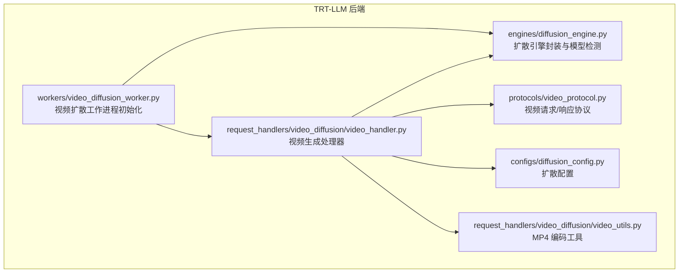
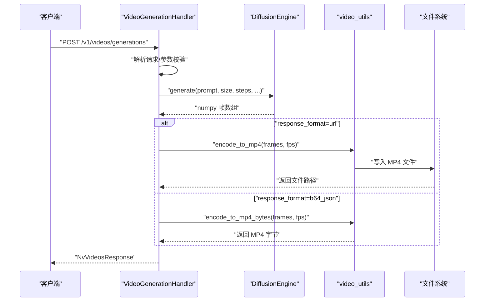
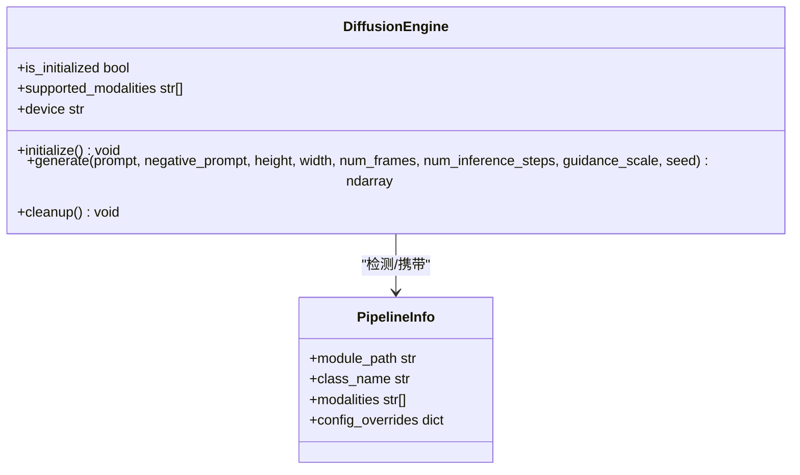
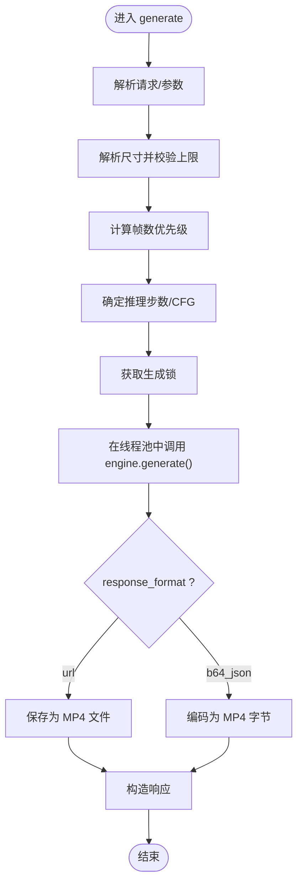
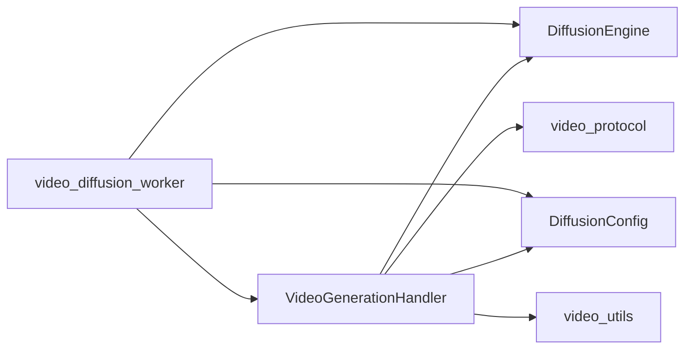

# 视频扩散支持

<cite>
**本文引用的文件**
- [docs/pages/backends/trtllm/README.md](file://docs/pages/backends/trtllm/README.md)
- [components/src/dynamo/trtllm/engines/diffusion_engine.py](file://components/src/dynamo/trtllm/engines/diffusion_engine.py)
- [components/src/dynamo/trtllm/request_handlers/video_diffusion/video_handler.py](file://components/src/dynamo/trtllm/request_handlers/video_diffusion/video_handler.py)
- [components/src/dynamo/trtllm/protocols/video_protocol.py](file://components/src/dynamo/trtllm/protocols/video_protocol.py)
- [components/src/dynamo/trtllm/configs/diffusion_config.py](file://components/src/dynamo/trtllm/configs/diffusion_config.py)
- [components/src/dynamo/trtllm/request_handlers/video_diffusion/video_utils.py](file://components/src/dynamo/trtllm/request_handlers/video_diffusion/video_utils.py)
- [components/src/dynamo/trtllm/workers/video_diffusion_worker.py](file://components/src/dynamo/trtllm/workers/video_diffusion_worker.py)
- [components/src/dynamo/trtllm/tests/test_trtllm_video_diffusion.py](file://components/src/dynamo/trtllm/tests/test_trtllm_video_diffusion.py)
- [examples/multimodal/launch/video_agg.sh](file://examples/multimodal/launch/video_agg.sh)
- [examples/multimodal/launch/video_disagg.sh](file://examples/multimodal/launch/video_disagg.sh)
</cite>

## 目录
1. [简介](#简介)
2. [项目结构](#项目结构)
3. [核心组件](#核心组件)
4. [架构总览](#架构总览)
5. [详细组件分析](#详细组件分析)
6. [依赖关系分析](#依赖关系分析)
7. [性能考量](#性能考量)
8. [故障排查指南](#故障排查指南)
9. [结论](#结论)
10. [附录：API 使用与部署示例](#附录api-使用与部署示例)

## 简介
本文件面向希望在 Dynamo 平台上使用 TensorRT-LLM 的视频扩散（文本到视频）能力的用户。文档覆盖以下主题：
- 实验性视频生成流程与技术实现
- 支持的扩散模型类型（如 WanPipeline）与配置要点
- 完整的视频生成 API 使用指南（请求格式、参数设置、输出处理）
- 硬件要求与性能注意事项
- 部署示例与生成质量评估方法
- 当前限制、未来方向与调试优化技巧

## 项目结构
视频扩散支持位于 Dynamo 的 TRT-LLM 后端中，主要涉及以下模块：
- 引擎层：统一的扩散引擎封装与模型自动检测
- 请求处理层：视频生成请求解析、并发控制与结果编码
- 协议层：OpenAI 兼容的视频生成请求/响应模型
- 配置层：默认参数、并行与优化开关
- 工作进程层：根据模态选择专用工作进程
- 测试与示例：单元测试、并发安全验证与部署脚本

图表来源
- [components/src/dynamo/trtllm/workers/video_diffusion_worker.py](file://components/src/dynamo/trtllm/workers/video_diffusion_worker.py#L18-L36)
- [components/src/dynamo/trtllm/engines/diffusion_engine.py](file://components/src/dynamo/trtllm/engines/diffusion_engine.py#L52-L134)
- [components/src/dynamo/trtllm/request_handlers/video_diffusion/video_handler.py](file://components/src/dynamo/trtllm/request_handlers/video_diffusion/video_handler.py#L33-L64)
- [components/src/dynamo/trtllm/protocols/video_protocol.py](file://components/src/dynamo/trtllm/protocols/video_protocol.py#L15-L108)
- [components/src/dynamo/trtllm/configs/diffusion_config.py](file://components/src/dynamo/trtllm/configs/diffusion_config.py#L21-L99)
- [components/src/dynamo/trtllm/request_handlers/video_diffusion/video_utils.py](file://components/src/dynamo/trtllm/request_handlers/video_diffusion/video_utils.py#L18-L77)

章节来源
- [components/src/dynamo/trtllm/workers/video_diffusion_worker.py](file://components/src/dynamo/trtllm/workers/video_diffusion_worker.py#L18-L36)
- [components/src/dynamo/trtllm/engines/diffusion_engine.py](file://components/src/dynamo/trtllm/engines/diffusion_engine.py#L52-L134)
- [components/src/dynamo/trtllm/request_handlers/video_diffusion/video_handler.py](file://components/src/dynamo/trtllm/request_handlers/video_diffusion/video_handler.py#L33-L64)
- [components/src/dynamo/trtllm/protocols/video_protocol.py](file://components/src/dynamo/trtllm/protocols/video_protocol.py#L15-L108)
- [components/src/dynamo/trtllm/configs/diffusion_config.py](file://components/src/dynamo/trtllm/configs/diffusion_config.py#L21-L99)
- [components/src/dynamo/trtllm/request_handlers/video_diffusion/video_utils.py](file://components/src/dynamo/trtllm/request_handlers/video_diffusion/video_utils.py#L18-L77)

## 核心组件
- 扩散引擎（DiffusionEngine）
  - 自动从模型索引文件检测管道类型，避免手动指定模型类型
  - 统一加载与推理接口，支持多并行配置与优化选项
- 视频生成处理器（VideoGenerationHandler）
  - 解析请求参数（尺寸、帧数、步数、CFG 等），执行线程池中的阻塞生成
  - 提供并发串行化保护，确保非线程安全的底层管线稳定
  - 输出支持保存为本地 MP4 或返回 base64 字符串
- 协议定义（NvCreateVideoRequest / NvVideosResponse）
  - 与前端兼容的 OpenAI 风格请求/响应结构
- 配置（DiffusionConfig）
  - 默认尺寸、帧数、步数、CFG、输出目录、并行与优化开关等
- 编码工具（video_utils）
  - 将 numpy 帧数组编码为 MP4 文件或字节流

章节来源
- [components/src/dynamo/trtllm/engines/diffusion_engine.py](file://components/src/dynamo/trtllm/engines/diffusion_engine.py#L52-L134)
- [components/src/dynamo/trtllm/request_handlers/video_diffusion/video_handler.py](file://components/src/dynamo/trtllm/request_handlers/video_diffusion/video_handler.py#L33-L64)
- [components/src/dynamo/trtllm/protocols/video_protocol.py](file://components/src/dynamo/trtllm/protocols/video_protocol.py#L15-L108)
- [components/src/dynamo/trtllm/configs/diffusion_config.py](file://components/src/dynamo/trtllm/configs/diffusion_config.py#L21-L99)
- [components/src/dynamo/trtllm/request_handlers/video_diffusion/video_utils.py](file://components/src/dynamo/trtllm/request_handlers/video_diffusion/video_utils.py#L18-L77)

## 架构总览
下图展示从 HTTP 请求到视频生成与输出的整体流程。

图表来源
- [components/src/dynamo/trtllm/request_handlers/video_diffusion/video_handler.py](file://components/src/dynamo/trtllm/request_handlers/video_diffusion/video_handler.py#L156-L254)
- [components/src/dynamo/trtllm/engines/diffusion_engine.py](file://components/src/dynamo/trtllm/engines/diffusion_engine.py#L264-L329)
- [components/src/dynamo/trtllm/request_handlers/video_diffusion/video_utils.py](file://components/src/dynamo/trtllm/request_handlers/video_diffusion/video_utils.py#L18-L77)
- [components/src/dynamo/trtllm/protocols/video_protocol.py](file://components/src/dynamo/trtllm/protocols/video_protocol.py#L15-L108)

## 详细组件分析

### 扩散引擎（DiffusionEngine）
- 模型自动检测
  - 通过模型索引文件识别管道类名，映射到具体实现
  - 动态推导需要编译的子模块列表
- 初始化与加载
  - 在启动时调用全局配置初始化，随后按需加载模型并移动至 GPU
- 推理接口
  - 提供同步阻塞的生成接口，应在线程池中调用以避免事件循环阻塞
  - 返回 numpy 帧数组，便于后续编码与输出

图表来源
- [components/src/dynamo/trtllm/engines/diffusion_engine.py](file://components/src/dynamo/trtllm/engines/diffusion_engine.py#L52-L134)
- [components/src/dynamo/trtllm/engines/diffusion_engine.py](file://components/src/dynamo/trtllm/engines/diffusion_engine.py#L217-L262)

章节来源
- [components/src/dynamo/trtllm/engines/diffusion_engine.py](file://components/src/dynamo/trtllm/engines/diffusion_engine.py#L52-L134)
- [components/src/dynamo/trtllm/engines/diffusion_engine.py](file://components/src/dynamo/trtllm/engines/diffusion_engine.py#L217-L262)

### 视频生成处理器（VideoGenerationHandler）
- 参数解析与校验
  - 尺寸解析与上限校验，防止显存溢出
  - 帧数计算优先级：显式 num_frames > seconds×fps > 默认值
- 并发控制
  - 使用异步锁串行化对底层管线的访问，避免非线程安全的全局状态被并发破坏
- 输出策略
  - 支持返回文件 URL 或 base64 字符串；编码由工具模块完成

图表来源
- [components/src/dynamo/trtllm/request_handlers/video_diffusion/video_handler.py](file://components/src/dynamo/trtllm/request_handlers/video_diffusion/video_handler.py#L156-L254)

章节来源
- [components/src/dynamo/trtllm/request_handlers/video_diffusion/video_handler.py](file://components/src/dynamo/trtllm/request_handlers/video_diffusion/video_handler.py#L66-L155)
- [components/src/dynamo/trtllm/request_handlers/video_diffusion/video_handler.py](file://components/src/dynamo/trtllm/request_handlers/video_diffusion/video_handler.py#L156-L254)

### 协议与数据模型（NvCreateVideoRequest / NvVideosResponse）
- 请求字段
  - 必填：prompt、model
  - 可选：seconds、fps、num_frames、size、num_inference_steps、guidance_scale、negative_prompt、seed、user、response_format
- 响应字段
  - 包含 id、object、model、status、progress、created、data（url 或 b64_json）、错误信息与推理耗时

章节来源
- [components/src/dynamo/trtllm/protocols/video_protocol.py](file://components/src/dynamo/trtllm/protocols/video_protocol.py#L15-L108)

### 配置（DiffusionConfig）
- 运行时与模型参数
  - 输出目录、默认尺寸、默认帧数、默认步数、默认 CFG、默认 FPS、默认秒数
- 优化与并行
  - TeaCache 开关与阈值、注意力/线性算子类型、是否禁用 torch.compile、编译模式
  - DiT 并行维度（dp/tp/ulysses/ring/cfg/fsdp）
- CPU 降级
  - 是否启用异步 CPU 降级与步长

章节来源
- [components/src/dynamo/trtllm/configs/diffusion_config.py](file://components/src/dynamo/trtllm/configs/diffusion_config.py#L21-L99)

### 编码工具（video_utils）
- 文件编码：将帧数组写入 MP4 文件
- 内存编码：将帧数组编码为 MP4 字节流，便于 base64 返回
- 依赖：imageio（可选 ffmpeg）

章节来源
- [components/src/dynamo/trtllm/request_handlers/video_diffusion/video_utils.py](file://components/src/dynamo/trtllm/request_handlers/video_diffusion/video_utils.py#L18-L77)
- [components/src/dynamo/trtllm/request_handlers/video_diffusion/video_utils.py](file://components/src/dynamo/trtllm/request_handlers/video_diffusion/video_utils.py#L79-L136)

### 工作进程（video_diffusion_worker）
- 根据模态选择专用工作进程初始化
- 加载扩散配置、引擎与视频生成处理器

章节来源
- [components/src/dynamo/trtllm/workers/video_diffusion_worker.py](file://components/src/dynamo/trtllm/workers/video_diffusion_worker.py#L18-L36)

## 依赖关系分析
- 处理器依赖引擎与配置，同时通过协议定义输入输出
- 编码工具独立于引擎，仅依赖 numpy 与 imageio
- 工作进程负责装配三者并按模态路由

图表来源
- [components/src/dynamo/trtllm/request_handlers/video_diffusion/video_handler.py](file://components/src/dynamo/trtllm/request_handlers/video_diffusion/video_handler.py#L33-L64)
- [components/src/dynamo/trtllm/engines/diffusion_engine.py](file://components/src/dynamo/trtllm/engines/diffusion_engine.py#L52-L134)
- [components/src/dynamo/trtllm/configs/diffusion_config.py](file://components/src/dynamo/trtllm/configs/diffusion_config.py#L21-L99)
- [components/src/dynamo/trtllm/protocols/video_protocol.py](file://components/src/dynamo/trtllm/protocols/video_protocol.py#L15-L108)
- [components/src/dynamo/trtllm/request_handlers/video_diffusion/video_utils.py](file://components/src/dynamo/trtllm/request_handlers/video_diffusion/video_utils.py#L18-L77)
- [components/src/dynamo/trtllm/workers/video_diffusion_worker.py](file://components/src/dynamo/trtllm/workers/video_diffusion_worker.py#L18-L36)

## 性能考量
- 显存与尺寸
  - 提供最大宽高限制以避免 OOM；可通过增大限制提升分辨率但需更高显存
- 帧数与时长
  - 帧数优先级：显式 num_frames > seconds×fps > 默认值；合理设置以平衡质量与时延
- 推理步数与 CFG
  - 步数越多质量越高但耗时越长；CFG 控制提示遵循度
- 并行与优化
  - 支持多种并行维度配置；可开启/关闭 torch.compile 与 TeaCache
- 编码开销
  - MP4 编码为 CPU 密集操作；建议在专用存储上写入并使用 url 返回以降低内存占用

章节来源
- [components/src/dynamo/trtllm/request_handlers/video_diffusion/video_handler.py](file://components/src/dynamo/trtllm/request_handlers/video_diffusion/video_handler.py#L96-L155)
- [components/src/dynamo/trtllm/configs/diffusion_config.py](file://components/src/dynamo/trtllm/configs/diffusion_config.py#L47-L78)
- [components/src/dynamo/trtllm/engines/diffusion_engine.py](file://components/src/dynamo/trtllm/engines/diffusion_engine.py#L217-L262)

## 故障排查指南
- 并发问题
  - 若未串行化访问底层管线，可能出现状态污染或死锁；请确认处理器持有生成锁
- 尺寸过大导致 OOM
  - 调整最大宽高限制或降低分辨率/帧数
- 编码失败
  - 确认已安装 imageio 且具备 ffmpeg 支持；检查输出目录权限
- 模型加载失败
  - 确认模型索引文件存在且包含受支持的管道类名；确保已安装 visual_gen 并满足运行时版本要求

章节来源
- [components/src/dynamo/trtllm/tests/test_trtllm_video_diffusion.py](file://components/src/dynamo/trtllm/tests/test_trtllm_video_diffusion.py#L545-L631)
- [components/src/dynamo/trtllm/request_handlers/video_diffusion/video_handler.py](file://components/src/dynamo/trtllm/request_handlers/video_diffusion/video_handler.py#L96-L119)
- [components/src/dynamo/trtllm/request_handlers/video_diffusion/video_utils.py](file://components/src/dynamo/trtllm/request_handlers/video_diffusion/video_utils.py#L40-L77)
- [docs/pages/backends/trtllm/README.md](file://docs/pages/backends/trtllm/README.md#L216-L224)

## 结论
Dynamo 的 TRT-LLM 视频扩散支持提供了实验性的文本到视频能力，具备自动模型检测、参数解析与并发安全控制。当前以 WanPipeline 为主，未来将扩展更多扩散模型家族。建议在具备充足显存与合适并发配置的环境中进行部署与调优，并结合质量评估与性能监控持续迭代。

## 附录：API 使用与部署示例

### 支持的模型与要求
- 模型类型：WanPipeline（文本到视频）
- 安装要求：visual_gen（feat/visual_gen 分支）与兼容的 Dynamo 运行时

章节来源
- [docs/pages/backends/trtllm/README.md](file://docs/pages/backends/trtllm/README.md#L212-L232)

### API 端点与请求格式
- 端点：/v1/videos/generations
- 请求字段（示例）
  - prompt：必填，文本提示
  - model：必填，模型标识
  - size：可选，格式为 "WxH"，默认 "832x480"
  - seconds：可选，默认 4
  - fps：可选，默认 24
  - num_frames：可选，显式设置帧数
  - num_inference_steps：可选，默认 50
  - guidance_scale：可选，默认 5.0
  - negative_prompt：可选
  - seed：可选
  - user：可选
  - response_format：可选，"url" 或 "b64_json"，默认 "url"

章节来源
- [docs/pages/backends/trtllm/README.md](file://docs/pages/backends/trtllm/README.md#L243-L257)
- [components/src/dynamo/trtllm/protocols/video_protocol.py](file://components/src/dynamo/trtllm/protocols/video_protocol.py#L15-L61)

### 响应格式
- 字段：id、object（固定为 "video"）、model、status（默认 "completed"）、progress（默认 100）、created、data（包含 url 或 b64_json）、error（失败时）、inference_time_s

章节来源
- [components/src/dynamo/trtllm/protocols/video_protocol.py](file://components/src/dynamo/trtllm/protocols/video_protocol.py#L76-L108)

### 配置选项（部分）
- 输出目录：--output-dir
- 默认尺寸：--default-height、--default-width
- 默认帧数：--default-num-frames
- TeaCache：--enable-teacache
- 关闭 torch.compile：--disable-torch-compile

章节来源
- [docs/pages/backends/trtllm/README.md](file://docs/pages/backends/trtllm/README.md#L259-L269)
- [components/src/dynamo/trtllm/configs/diffusion_config.py](file://components/src/dynamo/trtllm/configs/diffusion_config.py#L44-L78)

### 快速开始与部署
- 快速启动示例命令（文本到视频）
- 聚合与非聚合部署脚本（视频多模态示例）

章节来源
- [docs/pages/backends/trtllm/README.md](file://docs/pages/backends/trtllm/README.md#L234-L241)
- [examples/multimodal/launch/video_agg.sh](file://examples/multimodal/launch/video_agg.sh#L1-L24)
- [examples/multimodal/launch/video_disagg.sh](file://examples/multimodal/launch/video_disagg.sh#L1-L26)

### 生成质量评估方法
- 主观评估：对比不同步数、CFG、帧数与时长下的视觉一致性与流畅度
- 客观指标：可结合帧间 PSNR/SSIM（需自行实现）或下游任务效果
- 一致性：固定 seed 以复现实验

章节来源
- [components/src/dynamo/trtllm/request_handlers/video_diffusion/video_handler.py](file://components/src/dynamo/trtllm/request_handlers/video_diffusion/video_handler.py#L208-L215)
- [components/src/dynamo/trtllm/configs/diffusion_config.py](file://components/src/dynamo/trtllm/configs/diffusion_config.py#L56-L57)

### 当前限制与未来方向
- 限制
  - 实验性功能，不建议生产使用
  - 仅支持文本到视频（图像到视频计划中）
  - 需要足够显存
- 未来方向
  - 扩展更多扩散模型（如 Flux、Cosmos 等）
  - 支持图像到视频与更多模态组合
  - 优化并发与吞吐，引入取消与进度回调

章节来源
- [docs/pages/backends/trtllm/README.md](file://docs/pages/backends/trtllm/README.md#L270-L275)

### 调试与优化技巧
- 并发安全
  - 确保处理器持有生成锁；避免多个线程同时进入底层管线
- 尺寸与帧数
  - 从小尺寸/短时长起步，逐步扩大以定位 OOM
- 编码策略
  - 大体积视频优先返回 url，减少内存峰值
- 日志与计时
  - 关注推理耗时与编码耗时，定位瓶颈

章节来源
- [components/src/dynamo/trtllm/tests/test_trtllm_video_diffusion.py](file://components/src/dynamo/trtllm/tests/test_trtllm_video_diffusion.py#L545-L631)
- [components/src/dynamo/trtllm/request_handlers/video_diffusion/video_handler.py](file://components/src/dynamo/trtllm/request_handlers/video_diffusion/video_handler.py#L198-L216)
- [components/src/dynamo/trtllm/request_handlers/video_diffusion/video_utils.py](file://components/src/dynamo/trtllm/request_handlers/video_diffusion/video_utils.py#L18-L77)