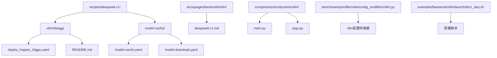
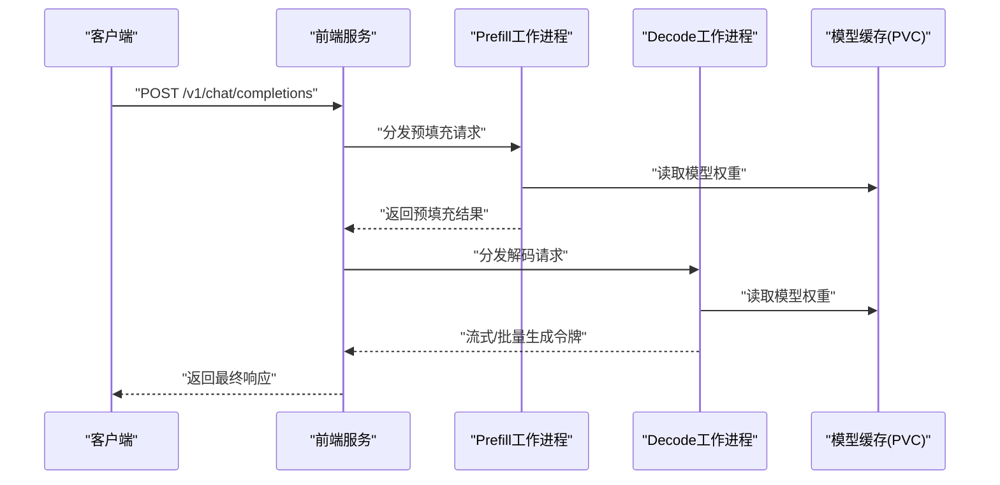
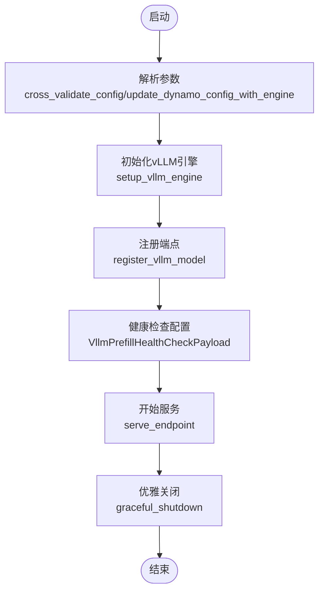
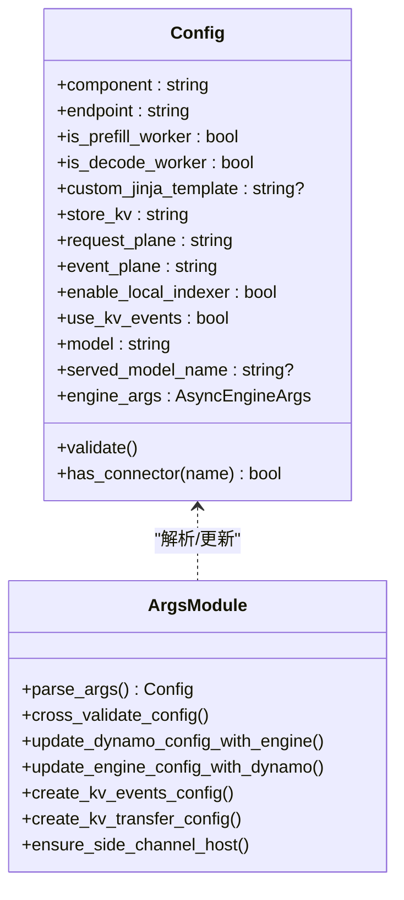
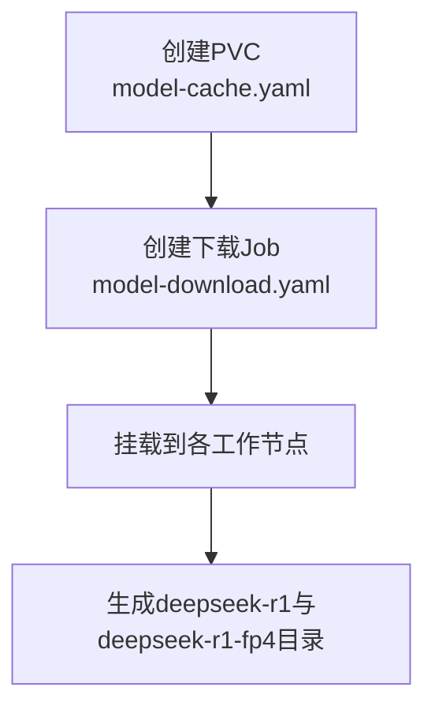
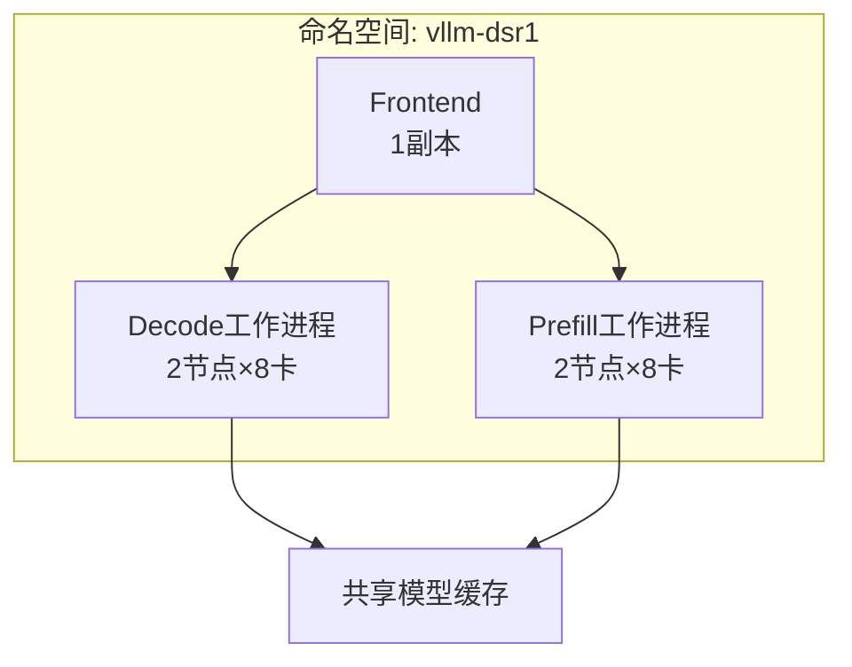

# DeepSeek-R1模型支持

<cite>
**本文档引用的文件**
- [recipes/deepseek-r1/README.md](file://recipes/deepseek-r1/README.md)
- [recipes/deepseek-r1/vllm/disagg/README.md](file://recipes/deepseek-r1/vllm/disagg/README.md)
- [recipes/deepseek-r1/vllm/disagg/deploy_hopper_16gpu.yaml](file://recipes/deepseek-r1/vllm/disagg/deploy_hopper_16gpu.yaml)
- [recipes/deepseek-r1/model-cache/model-cache.yaml](file://recipes/deepseek-r1/model-cache/model-cache.yaml)
- [recipes/deepseek-r1/model-cache/model-download.yaml](file://recipes/deepseek-r1/model-cache/model-download.yaml)
- [docs/pages/backends/vllm/deepseek-r1.md](file://docs/pages/backends/vllm/deepseek-r1.md)
- [docs/pages/performance/tuning.md](file://docs/pages/performance/tuning.md)
- [benchmarks/profiler/utils/config_modifiers/vllm.py](file://benchmarks/profiler/utils/config_modifiers/vllm.py)
- [components/src/dynamo/vllm/main.py](file://components/src/dynamo/vllm/main.py)
- [components/src/dynamo/vllm/args.py](file://components/src/dynamo/vllm/args.py)
- [examples/backends/vllm/launch/dsr1_dep.sh](file://examples/backends/vllm/launch/dsr1_dep.sh)
</cite>

## 目录
1. [简介](#简介)
2. [项目结构](#项目结构)
3. [核心组件](#核心组件)
4. [架构概览](#架构概览)
5. [详细组件分析](#详细组件分析)
6. [依赖关系分析](#依赖关系分析)
7. [性能考虑](#性能考虑)
8. [故障排除指南](#故障排除指南)
9. [结论](#结论)
10. [附录](#附录)

## 简介
本文件面向在Dynamo平台中部署DeepSeek-R1（671B参数MoE模型）的工程师与运维人员，系统性阐述DeepSeek-R1在vLLM后端的部署方案、配置要点、性能优化与资源管理策略。文档基于仓库中的recipe与实现代码，提供从硬件准备到生产部署的完整指导，并包含针对不同场景的调优建议与故障排除方法。

## 项目结构
围绕DeepSeek-R1在vLLM中的支持，仓库提供了以下关键目录与文件：
- recipes/deepseek-r1：包含DeepSeek-R1的多后端部署配方与模型缓存下载作业
- docs/pages/backends/vllm：vLLM后端的使用说明与测试流程
- components/src/dynamo/vllm：Dynamo对vLLM的封装实现（启动、参数解析、指标与事件发布）
- benchmarks/profiler：性能剖析工具链，支持vLLM配置转换与并行化映射调优
- examples：示例脚本与部署命令

**图表来源**
- [recipes/deepseek-r1/vllm/disagg/deploy_hopper_16gpu.yaml](file://recipes/deepseek-r1/vllm/disagg/deploy_hopper_16gpu.yaml#L1-L167)
- [recipes/deepseek-r1/model-cache/model-cache.yaml](file://recipes/deepseek-r1/model-cache/model-cache.yaml#L1-L13)
- [recipes/deepseek-r1/model-cache/model-download.yaml](file://recipes/deepseek-r1/model-cache/model-download.yaml#L1-L37)
- [docs/pages/backends/vllm/deepseek-r1.md](file://docs/pages/backends/vllm/deepseek-r1.md#L1-L43)
- [components/src/dynamo/vllm/main.py](file://components/src/dynamo/vllm/main.py#L1-L800)
- [components/src/dynamo/vllm/args.py](file://components/src/dynamo/vllm/args.py#L1-L437)
- [benchmarks/profiler/utils/config_modifiers/vllm.py](file://benchmarks/profiler/utils/config_modifiers/vllm.py#L44-L190)
- [examples/backends/vllm/launch/dsr1_dep.sh](file://examples/backends/vllm/launch/dsr1_dep.sh)

**章节来源**
- [recipes/deepseek-r1/README.md](file://recipes/deepseek-r1/README.md#L1-L104)
- [recipes/deepseek-r1/vllm/disagg/README.md](file://recipes/deepseek-r1/vllm/disagg/README.md#L1-L99)

## 核心组件
- vLLM后端封装：负责解析命令行参数、初始化引擎、注册端点、处理KV事件与指标收集、以及多节点数据并行（DP）场景下的非领导者节点处理。
- 配置系统：统一管理Dynamo运行时参数与vLLM引擎参数，自动交叉校验与默认值注入，支持连接器（如KVBM/LMCache/NIXL）与KV事件发布。
- 模型缓存与下载：通过Kubernetes Job将DeepSeek-R1权重下载至共享存储，支持FP8与原始权重两种路径。
- 性能剖析与调优：提供vLLM配置转换器，支持将通用配置转换为vLLM可用格式，并进行TP/DEP/TEP等并行化映射调优。

**章节来源**
- [components/src/dynamo/vllm/main.py](file://components/src/dynamo/vllm/main.py#L1-L800)
- [components/src/dynamo/vllm/args.py](file://components/src/dynamo/vllm/args.py#L1-L437)
- [benchmarks/profiler/utils/config_modifiers/vllm.py](file://benchmarks/profiler/utils/config_modifiers/vllm.py#L44-L190)

## 架构概览
DeepSeek-R1在Dynamo中的部署采用vLLM的解耦（Disaggregated）模式，将Prefill与Decode阶段分别部署在独立的节点上，通过共享模型缓存与RDMA/IB网络进行高效通信。下图展示了从请求到响应的关键路径：

**图表来源**
- [recipes/deepseek-r1/vllm/disagg/deploy_hopper_16gpu.yaml](file://recipes/deepseek-r1/vllm/disagg/deploy_hopper_16gpu.yaml#L14-L167)
- [docs/pages/backends/vllm/deepseek-r1.md](file://docs/pages/backends/vllm/deepseek-r1.md#L24-L43)

## 详细组件分析

### vLLM后端入口与生命周期
- 参数解析：统一解析Dynamo运行时参数与vLLM引擎参数，自动设置默认值（如前缀缓存启用、块大小、Runner名称等），并根据连接器类型调整执行后端。
- 引擎初始化：按需创建AsyncLLM引擎，记录模型加载耗时；支持检查点模式与睡眠/唤醒路由。
- 端点注册：根据组件类型（Prefill/Decode/Backend/Processor等）注册对应端点，处理健康检查与清理逻辑。
- 多节点处理：非领导者节点（DP rank>0）仅运行工作进程，不暴露外部端点，避免重复服务。

**图表来源**
- [components/src/dynamo/vllm/main.py](file://components/src/dynamo/vllm/main.py#L99-L191)
- [components/src/dynamo/vllm/main.py](file://components/src/dynamo/vllm/main.py#L361-L457)
- [components/src/dynamo/vllm/main.py](file://components/src/dynamo/vllm/main.py#L535-L674)
- [components/src/dynamo/vllm/main.py](file://components/src/dynamo/vllm/main.py#L676-L800)

**章节来源**
- [components/src/dynamo/vllm/main.py](file://components/src/dynamo/vllm/main.py#L99-L191)
- [components/src/dynamo/vllm/main.py](file://components/src/dynamo/vllm/main.py#L361-L457)
- [components/src/dynamo/vllm/main.py](file://components/src/dynamo/vllm/main.py#L535-L674)
- [components/src/dynamo/vllm/main.py](file://components/src/dynamo/vllm/main.py#L676-L800)

### 参数解析与配置系统
- 统一配置类：Config继承Dynamo运行时配置与vLLM配置，提供验证与连接器检测能力。
- 默认值注入：自动设置Runner名称、跳过tokenizer初始化、启用前缀缓存、块大小等；当使用NIXL连接器且TP=1时强制使用多进程执行后端以避免GIL竞争。
- KV事件与传输配置：根据连接器列表或用户提供的KV传输配置，动态生成KVEventsConfig与KVTransferConfig，支持单/多连接器组合。

**图表来源**
- [components/src/dynamo/vllm/args.py](file://components/src/dynamo/vllm/args.py#L34-L128)
- [components/src/dynamo/vllm/args.py](file://components/src/dynamo/vllm/args.py#L220-L302)
- [components/src/dynamo/vllm/args.py](file://components/src/dynamo/vllm/args.py#L304-L393)

**章节来源**
- [components/src/dynamo/vllm/args.py](file://components/src/dynamo/vllm/args.py#L34-L128)
- [components/src/dynamo/vllm/args.py](file://components/src/dynamo/vllm/args.py#L220-L302)
- [components/src/dynamo/vllm/args.py](file://components/src/dynamo/vllm/args.py#L304-L393)

### 模型缓存与下载
- PVC定义：声明共享存储（ReadWriteMany），容量满足DeepSeek-R1权重与FP8权重的总需求。
- 下载作业：通过Kubernetes Job使用hf_transfer加速下载，同时下载FP8与原始权重版本，挂载到共享PVC。

**图表来源**
- [recipes/deepseek-r1/model-cache/model-cache.yaml](file://recipes/deepseek-r1/model-cache/model-cache.yaml#L1-L13)
- [recipes/deepseek-r1/model-cache/model-download.yaml](file://recipes/deepseek-r1/model-cache/model-download.yaml#L1-L37)

**章节来源**
- [recipes/deepseek-r1/model-cache/model-cache.yaml](file://recipes/deepseek-r1/model-cache/model-cache.yaml#L1-L13)
- [recipes/deepseek-r1/model-cache/model-download.yaml](file://recipes/deepseek-r1/model-cache/model-download.yaml#L1-L37)

### vLLM部署清单与环境变量
- 前端：单副本，挂载模型缓存，使用健康探针，镜像为vllm-runtime。
- Decode/Prefill工作进程：多节点部署，每节点8张GPU，RDMA/IB接口配置，共享内存设置，镜像为vllm-runtime。
- 关键环境变量：启用DeepGEMM、专家并行低延迟后端、异步调度、EPLB（专家并行负载均衡）等。
- 关键参数：启用专家并行、数据并行大小16、最大上下文长度、启用DBo（动态批处理）等。

**图表来源**
- [recipes/deepseek-r1/vllm/disagg/deploy_hopper_16gpu.yaml](file://recipes/deepseek-r1/vllm/disagg/deploy_hopper_16gpu.yaml#L14-L167)

**章节来源**
- [recipes/deepseek-r1/vllm/disagg/deploy_hopper_16gpu.yaml](file://recipes/deepseek-r1/vllm/disagg/deploy_hopper_16gpu.yaml#L1-L167)

### 测试与验证
- 使用curl向前端服务发送OpenAI兼容的聊天补全请求，验证部署是否正常。
- 可通过端口转发本地访问前端服务，或在多节点环境中在前端所在节点进行测试。

**章节来源**
- [docs/pages/backends/vllm/deepseek-r1.md](file://docs/pages/backends/vllm/deepseek-r1.md#L24-L43)

## 依赖关系分析
- vLLM配置转换：在剖析工具中，vLLM配置转换器会根据目标引擎类型与是否MoE模型，自动设置DEP/TEP参数，并禁用规划器组件，确保Agg模式下的正确性。
- 运行时集成：Dynamo vLLM模块通过统一的配置类与参数解析函数，将Dynamo运行时与vLLM引擎参数桥接，保证端点注册、指标收集与KV事件发布的连贯性。

**图表来源**
- [benchmarks/profiler/utils/config_modifiers/vllm.py](file://benchmarks/profiler/utils/config_modifiers/vllm.py#L55-L149)

**章节来源**
- [benchmarks/profiler/utils/config_modifiers/vllm.py](file://benchmarks/profiler/utils/config_modifiers/vllm.py#L55-L149)

## 性能考虑
- 并行化映射：对于DeepSeek-R1这类MoE模型，推荐使用数据并行（DP）与专家并行（EP）结合的方式；在vLLM中可通过DEP（Data-Expert Parallel）与EPLB（专家并行负载均衡）提升吞吐。
- 批大小与上下文长度：Prefill阶段偏好小批量与大max_num_tokens，Decode阶段偏好大批量与适中max_num_tokens；结合AIPerf进行固定ISL/OSL/并发度测试，确定最优GPU数量。
- 资源分配：根据硬件类型（H100/H200或GB200）选择合适的量化（FP8/FP4）与块大小，平衡显存占用与吞吐。
- 网络与RDMA：多节点部署需启用InfiniBand/IBGDA，确保跨节点通信带宽与延迟满足MoE推理需求。

**章节来源**
- [docs/pages/performance/tuning.md](file://docs/pages/performance/tuning.md#L19-L56)
- [recipes/deepseek-r1/vllm/disagg/README.md](file://recipes/deepseek-r1/vllm/disagg/README.md#L91-L99)

## 故障排除指南
- NCCL错误：通常指示显存不足（OOM）。建议降低静态内存比例参数，或减少每rank并发。
- 多节点网络：若遇到网络问题，确认IBGDA已启用且网络接口配置正确；必要时参考vLLM专家并行部署文档中的系统配置脚本。
- 存储类：确保PVC使用的storageClassName与集群可用的StorageClass一致，否则下载作业无法成功。
- 模型下载时间长：DeepSeek-R1权重较大，下载可能需要1-2小时；可预先下载至共享存储以缩短部署时间。
- 健康检查失败：检查前端与工作进程的startupProbe配置，适当延长超时与重试阈值。

**章节来源**
- [recipes/deepseek-r1/README.md](file://recipes/deepseek-r1/README.md#L84-L90)
- [recipes/deepseek-r1/vllm/disagg/README.md](file://recipes/deepseek-r1/vllm/disagg/README.md#L91-L99)

## 结论
通过Dynamo平台与vLLM的深度集成，DeepSeek-R1可在多节点环境下实现高效的解耦部署。借助共享模型缓存、RDMA/IB网络与专家并行技术，系统能够在保证高吞吐的同时，灵活调节资源与并发度以适应不同业务场景。配合仓库提供的配置模板、剖析工具与故障排除指南，可以快速完成从开发到生产的全流程部署。

## 附录

### 快速开始步骤
- 设置命名空间并创建HuggingFace密钥
- 准备模型缓存PVC并下载DeepSeek-R1权重
- 应用vLLM解耦部署清单
- 本地端口转发并发送测试请求

**章节来源**
- [recipes/deepseek-r1/README.md](file://recipes/deepseek-r1/README.md#L21-L65)

### 部署脚本示例
- 提供了多节点部署脚本，可在两个节点上分别启动不同角色的工作进程，便于快速验证端到端流程。

**章节来源**
- [examples/backends/vllm/launch/dsr1_dep.sh](file://examples/backends/vllm/launch/dsr1_dep.sh)