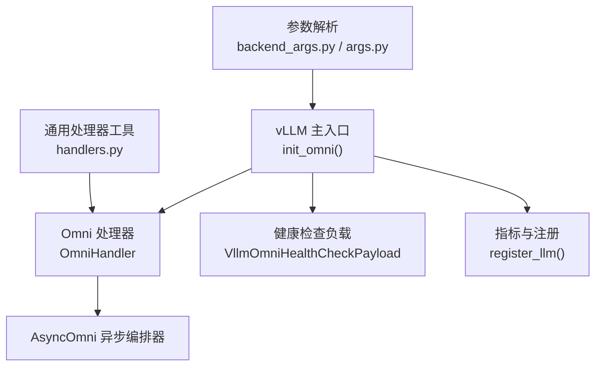
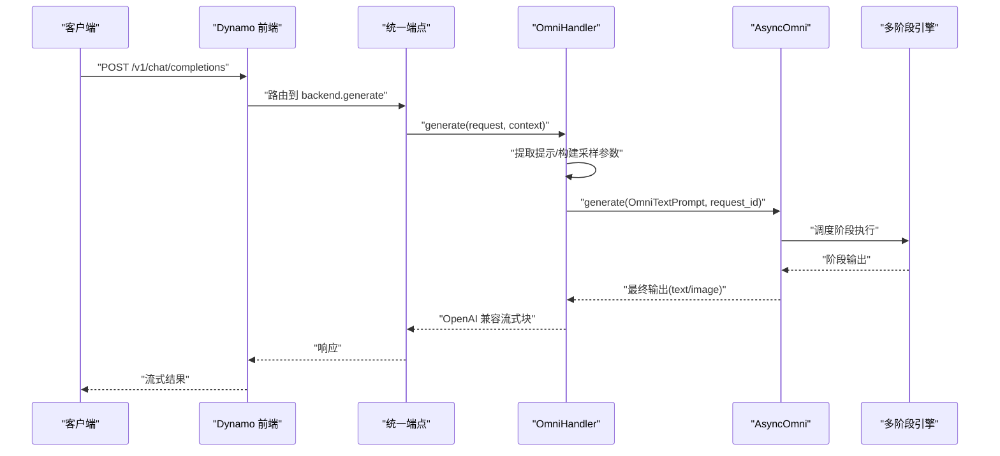
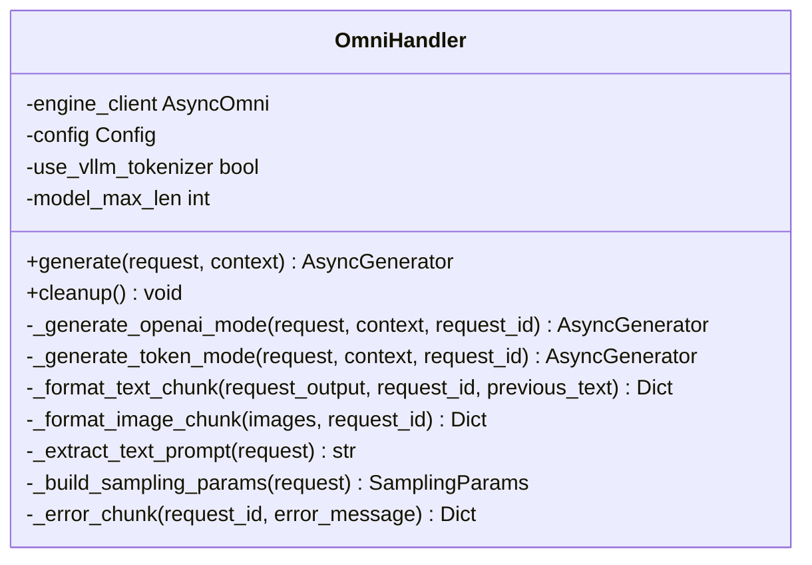
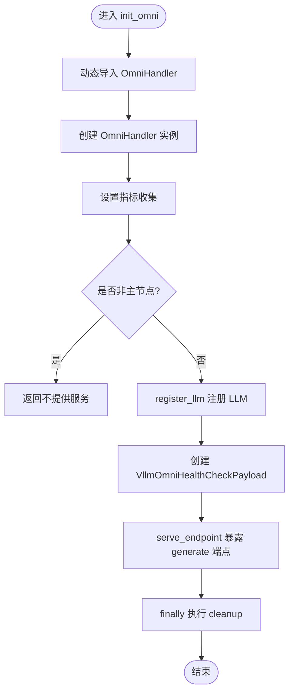
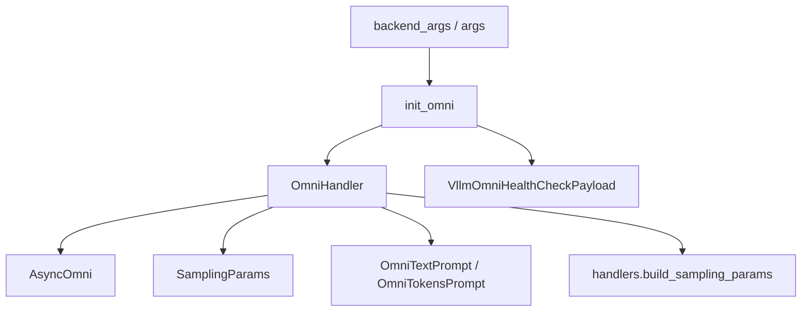

# Omni架构设计

<cite>
**本文档引用的文件**
- [components/src/dynamo/vllm/omni/omni_handler.py](file://components/src/dynamo/vllm/omni/omni_handler.py)
- [components/src/dynamo/vllm/main.py](file://components/src/dynamo/vllm/main.py)
- [components/src/dynamo/vllm/backend_args.py](file://components/src/dynamo/vllm/backend_args.py)
- [components/src/dynamo/vllm/args.py](file://components/src/dynamo/vllm/args.py)
- [components/src/dynamo/vllm/health_check.py](file://components/src/dynamo/vllm/health_check.py)
- [components/src/dynamo/vllm/handlers.py](file://components/src/dynamo/vllm/handlers.py)
- [docs/pages/backends/vllm/vllm-omni.md](file://docs/pages/backends/vllm/vllm-omni.md)
- [examples/backends/vllm/launch/agg_omni.sh](file://examples/backends/vllm/launch/agg_omni.sh)
- [examples/backends/vllm/launch/stage_configs/single_stage_llm.yaml](file://examples/backends/vllm/launch/stage_configs/single_stage_llm.yaml)
- [docs/pages/design-docs/architecture.md](file://docs/pages/design-docs/architecture.md)
</cite>

## 目录
1. [简介](#简介)
2. [项目结构](#项目结构)
3. [核心组件](#核心组件)
4. [架构总览](#架构总览)
5. [详细组件分析](#详细组件分析)
6. [依赖关系分析](#依赖关系分析)
7. [性能考虑](#性能考虑)
8. [故障排除指南](#故障排除指南)
9. [结论](#结论)
10. [附录](#附录)

## 简介
本文件系统性阐述 vLLM Omni 架构在 Dynamo 中的设计与实现，重点覆盖以下方面：
- Omni 架构设计理念：通过 vLLM-Omni 的多阶段流水线（如文本到文本、文本到图像）统一推理接口，兼容 OpenAI 风格 API。
- 技术实现路径：Omni 处理器（OmniHandler）如何对接 AsyncOmni 异步编排器、如何生成流式响应、如何适配 Dynamo 的统一端点与健康检查。
- 应用场景：单阶段与多阶段推理、前端解码与 KV 缓存策略选择、多模型与多部署模式支持。
- 配置与运行：命令行参数、阶段配置文件、示例脚本与测试方法。
- 优化与运维：性能调优要点、常见问题定位与修复。

## 项目结构
围绕 Omni 的关键代码位于 vLLM 后端组件中，主要文件如下：
- Omni 处理器：OmniHandler 实现推理逻辑与输出格式化
- 入口初始化：init_omni 负责注册端点、设置指标、启动服务
- 参数解析：backend_args 与 args 提供 Omni 相关标志与配置校验
- 健康检查：VllmOmniHealthCheckPayload 适配 AsyncOmni 的异步分词器
- 通用处理器：handlers 提供采样参数构建等通用能力
- 文档与示例：vllm-omni 文档、聚合启动脚本、阶段配置示例

图表来源
- [components/src/dynamo/vllm/main.py](file://components/src/dynamo/vllm/main.py#L1293-L1372)
- [components/src/dynamo/vllm/omni/omni_handler.py](file://components/src/dynamo/vllm/omni/omni_handler.py#L17-L52)
- [components/src/dynamo/vllm/health_check.py](file://components/src/dynamo/vllm/health_check.py#L153-L196)
- [components/src/dynamo/vllm/backend_args.py](file://components/src/dynamo/vllm/backend_args.py#L176-L191)
- [components/src/dynamo/vllm/args.py](file://components/src/dynamo/vllm/args.py#L176-L191)

章节来源
- [components/src/dynamo/vllm/main.py](file://components/src/dynamo/vllm/main.py#L1293-L1372)
- [components/src/dynamo/vllm/backend_args.py](file://components/src/dynamo/vllm/backend_args.py#L176-L191)
- [components/src/dynamo/vllm/args.py](file://components/src/dynamo/vllm/args.py#L176-L191)

## 核心组件
- OmniHandler：面向 vLLM-Omni 的多阶段流水线处理类，负责：
  - 初始化 AsyncOmni 客户端（模型、信任远程代码、阶段配置路径）
  - 接收请求并根据是否使用 vLLM 分词器切换两种模式：
    - OpenAI 模式：从消息结构提取文本提示，返回 OpenAI 兼容的流式块（文本或图像数据 URL）
    - Token 模式：直接返回 token-id 流与完成状态
  - 统一错误处理与资源清理
- init_omni：Omni 工作进程初始化流程：
  - 解析配置、按需注册 LLM、设置指标标签、构造健康检查负载、启动端点服务
  - 支持非主节点（数据并行 rank 非 0）仅初始化不对外提供服务
- 健康检查 Payload：VllmOmniHealthCheckPayload 通过 AsyncOmni 获取 BOS token，确保健康检查与模型分词器一致
- 参数与配置：
  - backend_args 提供 --omni、--stage-configs-path 等标志
  - args 提供 Config 类与交叉校验逻辑，确保 Omni 使用场景下的参数一致性

章节来源
- [components/src/dynamo/vllm/omni/omni_handler.py](file://components/src/dynamo/vllm/omni/omni_handler.py#L17-L52)
- [components/src/dynamo/vllm/omni/omni_handler.py](file://components/src/dynamo/vllm/omni/omni_handler.py#L54-L70)
- [components/src/dynamo/vllm/omni/omni_handler.py](file://components/src/dynamo/vllm/omni/omni_handler.py#L128-L188)
- [components/src/dynamo/vllm/main.py](file://components/src/dynamo/vllm/main.py#L1293-L1372)
- [components/src/dynamo/vllm/health_check.py](file://components/src/dynamo/vllm/health_check.py#L153-L196)
- [components/src/dynamo/vllm/backend_args.py](file://components/src/dynamo/vllm/backend_args.py#L176-L191)
- [components/src/dynamo/vllm/args.py](file://components/src/dynamo/vllm/args.py#L176-L191)

## 架构总览
下图展示 Omni 在 Dynamo 中的整体工作流：前端接收 OpenAI 风格请求，经由统一端点路由至 Omni 工作进程；OmniHandler 将请求转换为 AsyncOmni 可理解的提示，驱动多阶段引擎生成文本或图像，并以 OpenAI 兼容格式回传。

图表来源
- [components/src/dynamo/vllm/main.py](file://components/src/dynamo/vllm/main.py#L1344-L1358)
- [components/src/dynamo/vllm/omni/omni_handler.py](file://components/src/dynamo/vllm/omni/omni_handler.py#L54-L70)
- [components/src/dynamo/vllm/omni/omni_handler.py](file://components/src/dynamo/vllm/omni/omni_handler.py#L128-L188)

章节来源
- [components/src/dynamo/vllm/main.py](file://components/src/dynamo/vllm/main.py#L1344-L1358)
- [components/src/dynamo/vllm/omni/omni_handler.py](file://components/src/dynamo/vllm/omni/omni_handler.py#L54-L70)

## 详细组件分析

### OmniHandler 类设计与职责
- 关键字段与初始化
  - engine_client：AsyncOmni 实例，承载模型、远程代码信任与阶段配置
  - default_sampling_params、model_max_len、use_vllm_tokenizer 等来自配置
- 请求处理
  - OpenAI 模式：从 messages 中提取用户内容，封装为 OmniTextPrompt，逐阶段迭代输出，格式化为 OpenAI chat.completion.chunk
  - Token 模式：输入 token_ids，输出增量 token 列表与完成原因
- 输出与错误
  - 文本输出：计算 delta 文本，附加 finish_reason 与 usage
  - 图像输出：将 PIL 图像转为 base64 数据 URL，嵌入 OpenAI 内容数组
  - 错误：统一以 OpenAI 错误块返回
- 清理：关闭 AsyncOmni 客户端

图表来源
- [components/src/dynamo/vllm/omni/omni_handler.py](file://components/src/dynamo/vllm/omni/omni_handler.py#L17-L52)
- [components/src/dynamo/vllm/omni/omni_handler.py](file://components/src/dynamo/vllm/omni/omni_handler.py#L54-L70)
- [components/src/dynamo/vllm/omni/omni_handler.py](file://components/src/dynamo/vllm/omni/omni_handler.py#L128-L188)
- [components/src/dynamo/vllm/omni/omni_handler.py](file://components/src/dynamo/vllm/omni/omni_handler.py#L190-L275)
- [components/src/dynamo/vllm/omni/omni_handler.py](file://components/src/dynamo/vllm/omni/omni_handler.py#L294-L320)

章节来源
- [components/src/dynamo/vllm/omni/omni_handler.py](file://components/src/dynamo/vllm/omni/omni_handler.py#L17-L52)
- [components/src/dynamo/vllm/omni/omni_handler.py](file://components/src/dynamo/vllm/omni/omni_handler.py#L54-L70)
- [components/src/dynamo/vllm/omni/omni_handler.py](file://components/src/dynamo/vllm/omni/omni_handler.py#L128-L188)
- [components/src/dynamo/vllm/omni/omni_handler.py](file://components/src/dynamo/vllm/omni/omni_handler.py#L190-L275)
- [components/src/dynamo/vllm/omni/omni_handler.py](file://components/src/dynamo/vllm/omni/omni_handler.py#L294-L320)

### 初始化流程与端点服务
- init_omni 负责：
  - 动态导入 OmniHandler 并实例化
  - 设置指标收集、注册 LLM（文本与图像输入）、健康检查负载
  - 非主节点（数据并行 rank 非 0）仅初始化不提供服务
  - 通过 generate_endpoint.serve_endpoint 暴露统一端点，支持优雅停机与指标标签

图表来源
- [components/src/dynamo/vllm/main.py](file://components/src/dynamo/vllm/main.py#L1293-L1372)
- [components/src/dynamo/vllm/health_check.py](file://components/src/dynamo/vllm/health_check.py#L184-L196)

章节来源
- [components/src/dynamo/vllm/main.py](file://components/src/dynamo/vllm/main.py#L1293-L1372)
- [components/src/dynamo/vllm/health_check.py](file://components/src/dynamo/vllm/health_check.py#L184-L196)

### 健康检查与 BOS Token 获取
- VllmOmniHealthCheckPayload 通过异步方式从 AsyncOmni 获取分词器的 BOS token，若失败则回退为默认值
- 该负载用于端点健康检查，确保 Omni 工作者可用且与模型分词器一致

章节来源
- [components/src/dynamo/vllm/health_check.py](file://components/src/dynamo/vllm/health_check.py#L124-L150)
- [components/src/dynamo/vllm/health_check.py](file://components/src/dynamo/vllm/health_check.py#L153-L196)

### 配置与参数
- 启用 Omni 的关键标志：
  - --omni：启用 vLLM-Omni 编排器
  - --stage-configs-path：阶段配置文件路径（可选，Omni 默认加载模型内置配置）
  - --connector none：推荐禁用 KV 连接器（Omni 当前不发布 KV 事件）
- 参数校验：
  - 若指定 --stage-configs-path，则必须同时启用 --omni
  - Omni 模式下不支持多模态输入（当前限制）

章节来源
- [components/src/dynamo/vllm/backend_args.py](file://components/src/dynamo/vllm/backend_args.py#L176-L191)
- [components/src/dynamo/vllm/backend_args.py](file://components/src/dynamo/vllm/backend_args.py#L282-L288)
- [docs/pages/backends/vllm/vllm-omni.md](file://docs/pages/backends/vllm/vllm-omni.md#L84-L105)

### 示例与部署
- 快速开始（文本到文本）：使用聚合脚本启动前端与 Omni 工作进程，指定模型与单阶段配置
- 文本到图像：省略自定义阶段配置，Omni 加载模型默认多阶段管线
- 阶段配置示例：single_stage_llm.yaml 展示了单阶段 LLM 的最小配置

章节来源
- [docs/pages/backends/vllm/vllm-omni.md](file://docs/pages/backends/vllm/vllm-omni.md#L14-L82)
- [examples/backends/vllm/launch/agg_omni.sh](file://examples/backends/vllm/launch/agg_omni.sh#L1-L54)
- [examples/backends/vllm/launch/stage_configs/single_stage_llm.yaml](file://examples/backends/vllm/launch/stage_configs/single_stage_llm.yaml#L1-L42)

## 依赖关系分析
- OmniHandler 依赖 vLLM 采样参数与 AsyncOmni 输入类型（OmniTextPrompt、OmniTokensPrompt）
- init_omni 依赖 Dynamo 的统一端点服务与健康检查负载
- handlers 提供通用采样参数构建与通用工具，OmniHandler 复用其能力
- 参数模块负责 Omni 相关标志与配置校验

图表来源
- [components/src/dynamo/vllm/omni/omni_handler.py](file://components/src/dynamo/vllm/omni/omni_handler.py#L8-L12)
- [components/src/dynamo/vllm/main.py](file://components/src/dynamo/vllm/main.py#L1293-L1372)
- [components/src/dynamo/vllm/backend_args.py](file://components/src/dynamo/vllm/backend_args.py#L176-L191)
- [components/src/dynamo/vllm/args.py](file://components/src/dynamo/vllm/args.py#L176-L191)

章节来源
- [components/src/dynamo/vllm/omni/omni_handler.py](file://components/src/dynamo/vllm/omni/omni_handler.py#L8-L12)
- [components/src/dynamo/vllm/main.py](file://components/src/dynamo/vllm/main.py#L1293-L1372)
- [components/src/dynamo/vllm/backend_args.py](file://components/src/dynamo/vllm/backend_args.py#L176-L191)
- [components/src/dynamo/vllm/args.py](file://components/src/dynamo/vllm/args.py#L176-L191)

## 性能考虑
- 采样参数与动态默认值：handlers 中对 max_tokens 等参数进行动态推断，避免过长或过短的生成长度导致吞吐下降
- 健康检查与端点稳定性：通过 VllmOmniHealthCheckPayload 确保分词器一致性，降低因 BOS 不一致导致的预热失败
- 阶段配置优化：合理设置阶段设备、批大小与分布式后端，提升多阶段流水线吞吐
- 连接器选择：Omni 模式建议禁用 KV 连接器，减少额外开销（当前 Omni 不发布 KV 事件）

章节来源
- [components/src/dynamo/vllm/handlers.py](file://components/src/dynamo/vllm/handlers.py#L78-L175)
- [components/src/dynamo/vllm/health_check.py](file://components/src/dynamo/vllm/health_check.py#L153-L196)
- [components/src/dynamo/vllm/backend_args.py](file://components/src/dynamo/vllm/backend_args.py#L176-L191)
- [docs/pages/backends/vllm/vllm-omni.md](file://docs/pages/backends/vllm/vllm-omni.md#L84-L91)

## 故障排除指南
- 健康检查失败
  - 现象：端点健康检查报错或超时
  - 排查：确认 AsyncOmni 可用，检查 BOS token 获取逻辑是否回退到默认值
  - 参考：VllmOmniHealthCheckPayload 的异步创建与回退机制
- 无输出或空输出
  - 现象：请求无输出或输出为空
  - 排查：检查阶段输出是否为空，确认 OmniTextPrompt 是否正确构建
  - 参考：OmniHandler 对阶段输出的空值处理与错误块返回
- 图像输出异常
  - 现象：图像数据 URL 为空或无法渲染
  - 排查：确认阶段输出包含图像列表，检查 PIL 图像转 base64 步骤
  - 参考：_format_image_chunk 的图像编码流程
- 阶段配置问题
  - 现象：多阶段执行异常或输出类型不符
  - 排查：核对 stage_configs_path 与 final_output_type、is_comprehension 等字段
  - 参考：阶段配置示例与 OmniHandler 的输出类型判断

章节来源
- [components/src/dynamo/vllm/health_check.py](file://components/src/dynamo/vllm/health_check.py#L153-L196)
- [components/src/dynamo/vllm/omni/omni_handler.py](file://components/src/dynamo/vllm/omni/omni_handler.py#L82-L115)
- [components/src/dynamo/vllm/omni/omni_handler.py](file://components/src/dynamo/vllm/omni/omni_handler.py#L230-L275)
- [examples/backends/vllm/launch/stage_configs/single_stage_llm.yaml](file://examples/backends/vllm/launch/stage_configs/single_stage_llm.yaml#L1-L42)

## 结论
Omni 架构通过 vLLM-Omni 的多阶段编排，在 Dynamo 统一推理框架内实现了对文本到文本与文本到图像等任务的 OpenAI 兼容接口。OmniHandler 将请求映射到 AsyncOmni 的阶段执行，结合 handlers 的通用采样参数构建与健康检查的 BOS token 适配，提供了稳定、可扩展的推理能力。配合合理的阶段配置与部署策略，Omni 能够在多模型、多部署模式下高效运行。

## 附录
- 设计文档概览：Dynamo 高层架构强调解耦的预填充/解码、智能路由、KV 缓存管理与 NIXL 数据传输，Omni 作为推理后端之一融入整体体系
- 快速参考
  - 文档：vLLM-Omni 使用说明与示例
  - 脚本：聚合部署脚本与阶段配置示例
  - 参数：Omni 相关标志与校验规则

章节来源
- [docs/pages/design-docs/architecture.md](file://docs/pages/design-docs/architecture.md#L6-L56)
- [docs/pages/backends/vllm/vllm-omni.md](file://docs/pages/backends/vllm/vllm-omni.md#L1-L106)
- [examples/backends/vllm/launch/agg_omni.sh](file://examples/backends/vllm/launch/agg_omni.sh#L1-L54)
- [examples/backends/vllm/launch/stage_configs/single_stage_llm.yaml](file://examples/backends/vllm/launch/stage_configs/single_stage_llm.yaml#L1-L42)