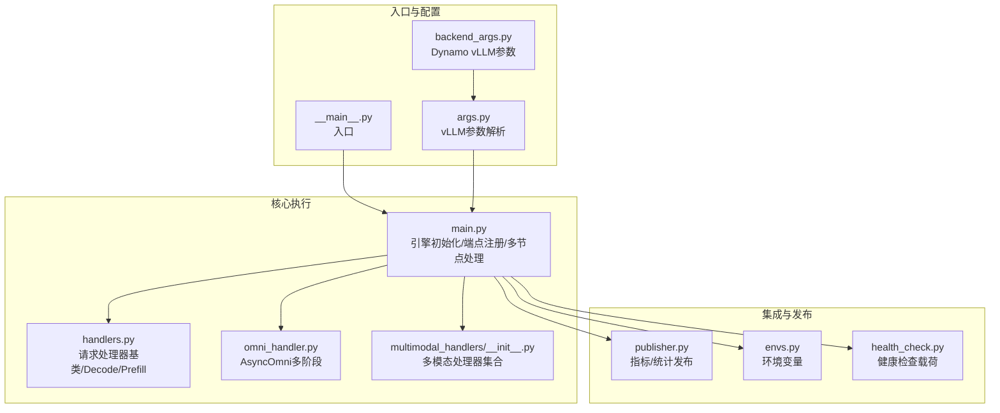
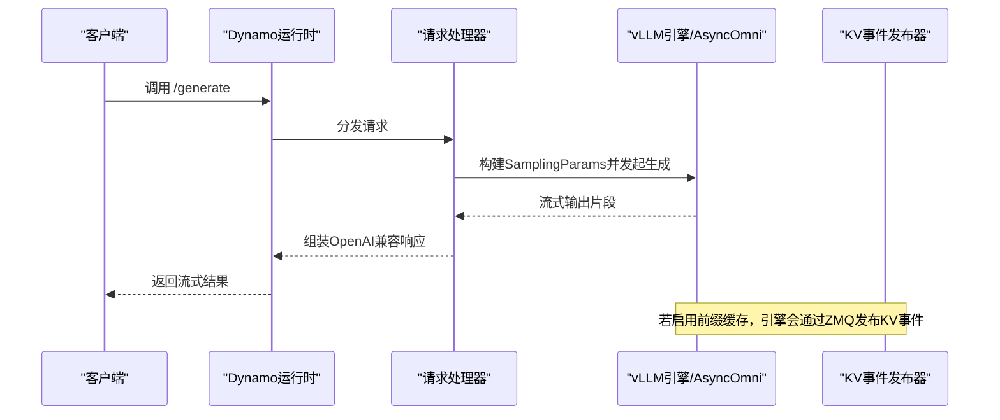
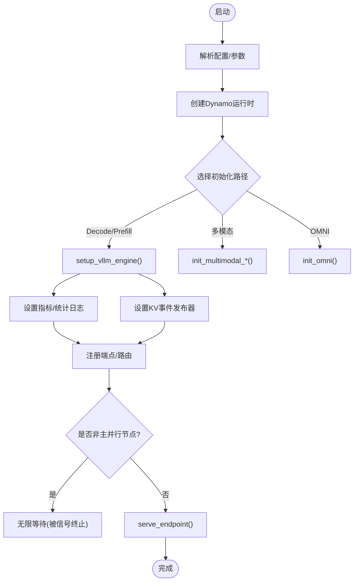
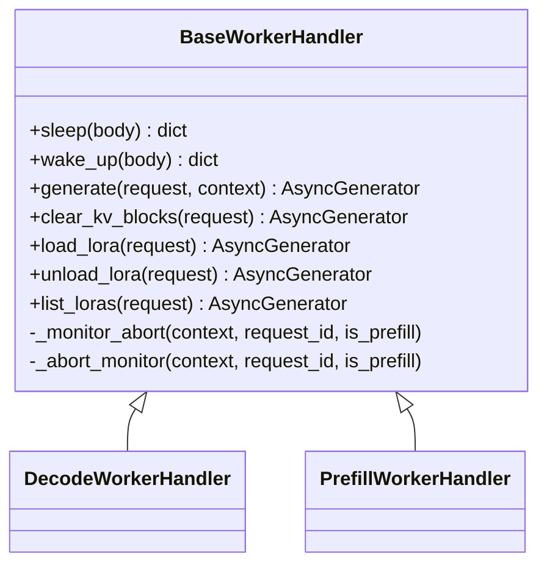
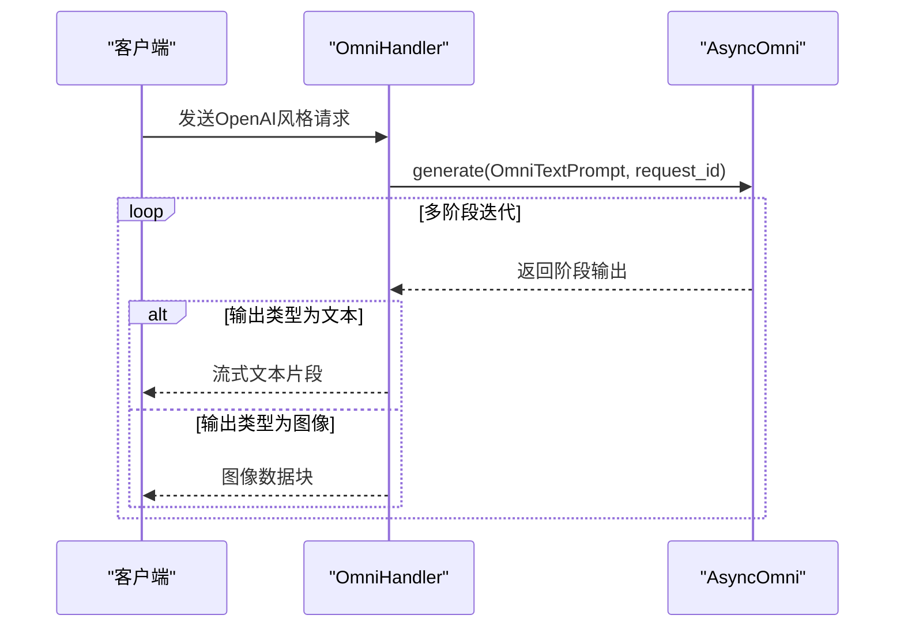
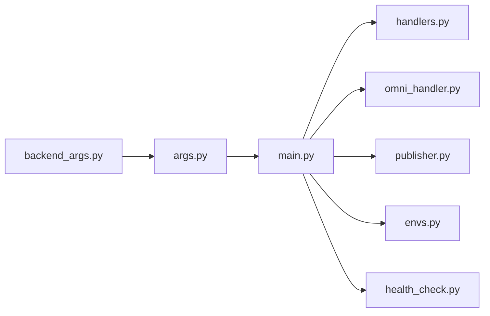

# vLLM后端引擎

<cite>
**本文引用的文件**
- [components/src/dynamo/vllm/main.py](file://components/src/dynamo/vllm/main.py)
- [components/src/dynamo/vllm/__main__.py](file://components/src/dynamo/vllm/__main__.py)
- [components/src/dynamo/vllm/args.py](file://components/src/dynamo/vllm/args.py)
- [components/src/dynamo/vllm/backend_args.py](file://components/src/dynamo/vllm/backend_args.py)
- [components/src/dynamo/vllm/handlers.py](file://components/src/dynamo/vllm/handlers.py)
- [components/src/dynamo/vllm/omni/omni_handler.py](file://components/src/dynamo/vllm/omni/omni_handler.py)
- [components/src/dynamo/vllm/multimodal_handlers/__init__.py](file://components/src/dynamo/vllm/multimodal_handlers/__init__.py)
- [components/src/dynamo/vllm/envs.py](file://components/src/dynamo/vllm/envs.py)
- [components/src/dynamo/vllm/health_check.py](file://components/src/dynamo/vllm/health_check.py)
- [components/src/dynamo/vllm/publisher.py](file://components/src/dynamo/vllm/publisher.py)
- [examples/backends/vllm/deploy/agg.yaml](file://examples/backends/vllm/deploy/agg.yaml)
- [examples/backends/vllm/deploy/disagg.yaml](file://examples/backends/vllm/deploy/disagg.yaml)
- [recipes/deepseek-r1/vllm/disagg/deploy_hopper_16gpu.yaml](file://recipes/deepseek-r1/vllm/disagg/deploy_hopper_16gpu.yaml)
</cite>

## 目录
1. [简介](#简介)
2. [项目结构](#项目结构)
3. [核心组件](#核心组件)
4. [架构总览](#架构总览)
5. [详细组件分析](#详细组件分析)
6. [依赖关系分析](#依赖关系分析)
7. [性能考量](#性能考量)
8. [故障排除指南](#故障排除指南)
9. [结论](#结论)
10. [附录](#附录)

## 简介
本文件系统性阐述Dynamo中vLLM后端引擎的设计与实现，覆盖以下关键主题：
- vLLM在Dynamo中的集成方式与职责边界
- vLLM Omni多阶段流水线能力与典型用法
- 多模态处理（图像/视频）与前端解码路径
- 提示嵌入（Prompt Embeddings）与LoRA动态加载
- 前缀KV缓存事件发布与与KVBM/LMCache/NIXL等连接器的协同
- 多节点与数据并行部署模式
- 参数配置、性能优化与内存管理策略
- 与Dynamo其他组件（路由、全局路由器、KVBM等）的深度集成
- 实际部署案例、性能基准与排障建议

## 项目结构
vLLM后端位于components/src/dynamo/vllm目录下，采用“运行时入口 + 配置解析 + 工作处理器 + 多模态/OMNI适配”的分层组织：
- 运行时入口：__main__.py负责设置环境变量并调用main.py的主流程
- 配置解析：args.py与backend_args.py分别负责Dynamo运行时参数与vLLM特定参数的合并与校验
- 核心逻辑：main.py负责引擎初始化、端点注册、健康检查、指标采集与多节点处理
- 处理器：handlers.py定义通用请求处理基类与具体Decode/Prefill处理器
- 多模态：multimodal_handlers导出编码/预处理/解码等处理器
- OMNI：omni_handler.py封装AsyncOmni多阶段生成
- 指标与发布：publisher.py提供统计日志工厂与指标发布；envs.py集中环境变量
- 健康检查：health_check.py提供不同工作角色的默认健康检查载荷
- 示例与配方：examples与recipes提供聚合/拆分部署样例及DeepSeek-R1多节点配方

图示来源
- [components/src/dynamo/vllm/__main__.py](file://components/src/dynamo/vllm/__main__.py#L1-L13)
- [components/src/dynamo/vllm/args.py](file://components/src/dynamo/vllm/args.py#L76-L127)
- [components/src/dynamo/vllm/backend_args.py](file://components/src/dynamo/vllm/backend_args.py#L15-L289)
- [components/src/dynamo/vllm/main.py](file://components/src/dynamo/vllm/main.py#L99-L191)
- [components/src/dynamo/vllm/handlers.py](file://components/src/dynamo/vllm/handlers.py#L233-L448)
- [components/src/dynamo/vllm/omni/omni_handler.py](file://components/src/dynamo/vllm/omni/omni_handler.py#L17-L53)
- [components/src/dynamo/vllm/multimodal_handlers/__init__.py](file://components/src/dynamo/vllm/multimodal_handlers/__init__.py#L1-L25)
- [components/src/dynamo/vllm/publisher.py](file://components/src/dynamo/vllm/publisher.py#L103-L148)
- [components/src/dynamo/vllm/envs.py](file://components/src/dynamo/vllm/envs.py#L25-L85)
- [components/src/dynamo/vllm/health_check.py](file://components/src/dynamo/vllm/health_check.py#L83-L197)

章节来源
- [components/src/dynamo/vllm/main.py](file://components/src/dynamo/vllm/main.py#L99-L191)
- [components/src/dynamo/vllm/args.py](file://components/src/dynamo/vllm/args.py#L76-L127)
- [components/src/dynamo/vllm/backend_args.py](file://components/src/dynamo/vllm/backend_args.py#L15-L289)

## 核心组件
- 引擎初始化与生命周期
  - 通过setup_vllm_engine创建AsyncLLM引擎，注入统计日志工厂与Prometheus指标
  - 支持睡眠/唤醒（sleep/wake_up）以释放/恢复GPU资源，配合发现服务进行优雅上下线
- 端点注册与健康检查
  - 注册generate与clear_kv_blocks端点，并提供针对不同角色的健康检查载荷
- 多节点与数据并行
  - 非主并行节点（data_parallel_rank > 0）仅运行工作进程不暴露端点
- 多模态与前端解码
  - 可启用前端解码（将图像解码与传输交由Rust前端，Python后端仅处理文本）
- KV事件与前缀缓存
  - 可按dp_rank为每个并行副本创建ZMQ事件发布器，向KVBM/LMCache/NIXL等连接器广播KV块变更
- OMNI多阶段流水线
  - 使用AsyncOmni编排多阶段（如文本到文本、文本到图像）生成，支持OpenAI兼容流式输出
- LoRA动态加载
  - 支持URI下载LoRA并动态注册到引擎，同时在发现服务中发布ModelDeploymentCard

章节来源
- [components/src/dynamo/vllm/main.py](file://components/src/dynamo/vllm/main.py#L361-L457)
- [components/src/dynamo/vllm/main.py](file://components/src/dynamo/vllm/main.py#L535-L674)
- [components/src/dynamo/vllm/main.py](file://components/src/dynamo/vllm/main.py#L676-L800)
- [components/src/dynamo/vllm/handlers.py](file://components/src/dynamo/vllm/handlers.py#L287-L348)
- [components/src/dynamo/vllm/handlers.py](file://components/src/dynamo/vllm/handlers.py#L440-L782)
- [components/src/dynamo/vllm/omni/omni_handler.py](file://components/src/dynamo/vllm/omni/omni_handler.py#L17-L53)

## 架构总览
vLLM后端在Dynamo中承担“分布式运行时”与“vLLM引擎”的双重角色：一方面通过Dynamo的命名空间/组件/端点模型对外暴露服务，另一方面内部以AsyncLLM或AsyncOmni作为推理引擎。

图示来源
- [components/src/dynamo/vllm/main.py](file://components/src/dynamo/vllm/main.py#L636-L670)
- [components/src/dynamo/vllm/handlers.py](file://components/src/dynamo/vllm/handlers.py#L353-L418)
- [components/src/dynamo/vllm/args.py](file://components/src/dynamo/vllm/args.py#L304-L343)

## 详细组件分析

### 引擎初始化与端点注册（main.py）
- 关键职责
  - 解析命令行与环境配置，准备模型与引擎参数
  - 创建Dynamo分布式运行时，按角色选择初始化路径（普通Decode/Prefill、多模态、OMNI等）
  - 初始化Prometheus指标与统计日志工厂，确保多进程/单进程场景下的指标一致性
  - 设置KV事件发布器（可选），用于前缀缓存事件广播
  - 注册睡眠/唤醒引擎路由，支持动态降级与恢复
  - 对非主并行节点进行特殊处理（仅运行工作进程）
- 性能与稳定性要点
  - 在多进程模式下正确设置PROMETHEUS_MULTIPROC_DIR并区分REGISTRY与MultiprocessCollector
  - 通过StatLoggerFactory将调度器统计映射为KV块占用与GPU缓存使用率指标
  - 严格校验connector与kv_transfer_config互斥，避免重复配置

图示来源
- [components/src/dynamo/vllm/main.py](file://components/src/dynamo/vllm/main.py#L99-L191)
- [components/src/dynamo/vllm/main.py](file://components/src/dynamo/vllm/main.py#L361-L457)
- [components/src/dynamo/vllm/main.py](file://components/src/dynamo/vllm/main.py#L535-L674)
- [components/src/dynamo/vllm/main.py](file://components/src/dynamo/vllm/main.py#L676-L800)

章节来源
- [components/src/dynamo/vllm/main.py](file://components/src/dynamo/vllm/main.py#L99-L191)
- [components/src/dynamo/vllm/main.py](file://components/src/dynamo/vllm/main.py#L361-L457)
- [components/src/dynamo/vllm/main.py](file://components/src/dynamo/vllm/main.py#L535-L674)
- [components/src/dynamo/vllm/main.py](file://components/src/dynamo/vllm/main.py#L676-L800)

### 请求处理器（handlers.py）
- 基类特性
  - 统一的睡眠/唤醒接口，先从发现服务注销再操作引擎，再重新注册
  - 中止监控机制：监听上下文取消与全局shutdown_event，及时abort请求
  - KV块清理接口reset_prefix_cache
  - LoRA动态加载/卸载/枚举，支持并发序列化与注册到发现服务
- 采样参数构建
  - 支持从Dynamo内部协议与OpenAI兼容格式构建SamplingParams
  - 动态max_tokens推断，结合模型最大长度与输入长度
- 多模态支持
  - 可选前端解码（图像/视频）与NIXL侧通道传输
  - 图像加载器与输入参数管理器

图示来源
- [components/src/dynamo/vllm/handlers.py](file://components/src/dynamo/vllm/handlers.py#L233-L448)
- [components/src/dynamo/vllm/handlers.py](file://components/src/dynamo/vllm/handlers.py#L440-L782)

章节来源
- [components/src/dynamo/vllm/handlers.py](file://components/src/dynamo/vllm/handlers.py#L233-L448)
- [components/src/dynamo/vllm/handlers.py](file://components/src/dynamo/vllm/handlers.py#L440-L782)

### vLLM-Omni多阶段流水线（omni_handler.py）
- 设计目标
  - 通过AsyncOmni编排多阶段生成（如文本到文本、文本到图像）
  - 支持OpenAI兼容流式输出，按阶段输出类型（text/image）进行差异化格式化
- 关键实现
  - 文本模式：基于OmniTextPrompt，逐阶段返回增量文本
  - 图像模式：接收阶段输出的图像数据并转换为响应块
  - 与BaseWorkerHandler一致的中止监控与错误处理

图示来源
- [components/src/dynamo/vllm/omni/omni_handler.py](file://components/src/dynamo/vllm/omni/omni_handler.py#L54-L189)

章节来源
- [components/src/dynamo/vllm/omni/omni_handler.py](file://components/src/dynamo/vllm/omni/omni_handler.py#L17-L53)
- [components/src/dynamo/vllm/omni/omni_handler.py](file://components/src/dynamo/vllm/omni/omni_handler.py#L54-L189)

### 多模态处理（multimodal_handlers）
- 角色划分
  - 处理器：ECProcessor/PreprocessedHandler，负责多模态请求的预处理与路由
  - 编码器：EncodeWorkerHandler/VLLMEncodeWorkerHandler，处理图像/视频编码
  - 解码器：MultimodalDecodeWorkerHandler/MultimodalPDWorkerHandler，执行LLM解码
- 集成点
  - 与前端解码开关配合，决定图像解码位置（前端/Rust或后端/Python）
  - 与NIXL侧通道协作，实现高性能媒体数据传输

章节来源
- [components/src/dynamo/vllm/multimodal_handlers/__init__.py](file://components/src/dynamo/vllm/multimodal_handlers/__init__.py#L1-L25)

### 参数配置与校验（args.py/backend_args.py）
- Dynamo运行时参数
  - 命名空间/组件/端点、请求平面/事件平面、KV存储、本地索引器开关等
- vLLM引擎参数
  - 通过AsyncEngineArgs透传，同时注入Dynamo默认值与约束
  - 自动设置distributed_executor_backend（NIXL场景避免GIL竞争）
  - 默认启用前缀缓存与合理block_size
- Dynamo vLLM专用参数
  - 角色标志：is-prefill-worker/is-decode-worker、多模态相关开关
  - OMNI：--omni与--stage-configs-path
  - 前端解码：--frontend-decoding
  - ECConnector：--vllm-native-encoder-worker及相关配置
  - 校验规则：角色互斥、多模态需开启enable-multimodal、ECExampleConnector需提供存储路径、OMNI需提供stage配置等

章节来源
- [components/src/dynamo/vllm/args.py](file://components/src/dynamo/vllm/args.py#L76-L127)
- [components/src/dynamo/vllm/args.py](file://components/src/dynamo/vllm/args.py#L220-L302)
- [components/src/dynamo/vllm/backend_args.py](file://components/src/dynamo/vllm/backend_args.py#L15-L289)

### KV事件与前缀缓存（main.py/envs.py/publisher.py）
- 事件发布
  - 按数据并行rank为每个副本创建ZMQ发布器，订阅端点由环境变量控制
  - decode worker跳过事件发布
- 连接器集成
  - 通过kv_transfer_config与kv_events_config对接LMCache/KVBM/NIXL
  - 支持KVBM Consolidator端点（当启用kvbm连接器时）
- 指标发布
  - 通过StatLoggerFactory与WorkerMetricsPublisher上报GPU缓存使用与块数

章节来源
- [components/src/dynamo/vllm/main.py](file://components/src/dynamo/vllm/main.py#L283-L358)
- [components/src/dynamo/vllm/envs.py](file://components/src/dynamo/vllm/envs.py#L25-L85)
- [components/src/dynamo/vllm/publisher.py](file://components/src/dynamo/vllm/publisher.py#L40-L101)

### 健康检查（health_check.py）
- vLLM健康检查载荷
  - 默认使用温度0与极短max_tokens，支持文本/Token两种输入模式
- vLLM-Omni健康检查载荷
  - 通过AsyncOmni异步获取BOS token，构造兼容的token_ids输入

章节来源
- [components/src/dynamo/vllm/health_check.py](file://components/src/dynamo/vllm/health_check.py#L83-L197)

## 依赖关系分析
- 组件耦合
  - main.py对handlers.py、omni_handler.py、publisher.py、envs.py、health_check.py存在直接依赖
  - args.py与backend_args.py共同决定engine_args与Dynamo运行时参数的最终形态
- 外部依赖
  - vLLM AsyncLLM/AsyncOmni、vllm.v1.metrics、vllm.distributed.kv_events
  - Prometheus multiprocess、NATS（指标发布）、ZMQ（KV事件）
- 潜在循环依赖
  - 当前模块间为单向依赖（入口->核心->处理器/OMNI/发布），未见循环

图示来源
- [components/src/dynamo/vllm/main.py](file://components/src/dynamo/vllm/main.py#L46-L67)
- [components/src/dynamo/vllm/args.py](file://components/src/dynamo/vllm/args.py#L19-L34)
- [components/src/dynamo/vllm/backend_args.py](file://components/src/dynamo/vllm/backend_args.py#L8-L34)

章节来源
- [components/src/dynamo/vllm/main.py](file://components/src/dynamo/vllm/main.py#L46-L67)
- [components/src/dynamo/vllm/args.py](file://components/src/dynamo/vllm/args.py#L19-L34)
- [components/src/dynamo/vllm/backend_args.py](file://components/src/dynamo/vllm/backend_args.py#L8-L34)

## 性能考量
- 引擎初始化与指标
  - 在setup_multiprocess_prometheus之后再构造指标Gauge，确保多进程模式下值类匹配
  - 通过StatLoggerFactory将调度器统计映射为GPU缓存使用率与总块数
- NIXL连接器与GIL
  - TP=1且使用UniProcExecutor时强制mp后端，避免GIL竞争导致的阻塞
- 前缀缓存与KV事件
  - 合理设置block_size与启用前缀缓存可显著降低重复计算
  - 使用KV事件发布器与KVBM/LMCache/NIXL协同，提升缓存命中与跨节点共享效率
- 多节点与数据并行
  - 通过数据并行rank为每个副本分配独立ZMQ端口，避免冲突
  - 非主并行节点仅运行工作进程，减少端点暴露带来的额外开销
- OMNI流水线
  - AsyncOmni按阶段生成，适合文本到图像等多阶段任务；注意阶段间采样参数传递与格式化

章节来源
- [components/src/dynamo/vllm/main.py](file://components/src/dynamo/vllm/main.py#L361-L457)
- [components/src/dynamo/vllm/args.py](file://components/src/dynamo/vllm/args.py#L220-L247)
- [components/src/dynamo/vllm/main.py](file://components/src/dynamo/vllm/main.py#L283-L358)
- [components/src/dynamo/vllm/publisher.py](file://components/src/dynamo/vllm/publisher.py#L71-L101)

## 故障排除指南
- 端点不可用或无法注册
  - 检查是否为非主并行节点（仅运行工作进程不暴露端点）
  - 确认generate_endpoint已正确注册，且健康检查载荷与输入模式匹配
- LoRA加载失败
  - 确保DYN_LORA_ENABLED已启用，URI可访问且路径正确
  - 并发加载同一LoRA会被序列化，若失败需检查下载与注册异常链路
- KV事件未生效
  - 确认启用前缀缓存且未标记decode worker
  - 检查kv_events_config与ZMQ端口分配（按dp_rank偏移）
- NIXL侧通道问题
  - 确认VLLM_NIXL_SIDE_CHANNEL_HOST自动设置或手动指定
  - TP=1时考虑切换distributed_executor_backend为mp
- OMNI健康检查
  - 使用异步方法从AsyncOmni提取BOS token，避免同步阻塞

章节来源
- [components/src/dynamo/vllm/main.py](file://components/src/dynamo/vllm/main.py#L73-L84)
- [components/src/dynamo/vllm/handlers.py](file://components/src/dynamo/vllm/handlers.py#L440-L782)
- [components/src/dynamo/vllm/main.py](file://components/src/dynamo/vllm/main.py#L283-L358)
- [components/src/dynamo/vllm/args.py](file://components/src/dynamo/vllm/args.py#L424-L437)
- [components/src/dynamo/vllm/health_check.py](file://components/src/dynamo/vllm/health_check.py#L184-L197)

## 结论
vLLM后端在Dynamo中实现了高内聚、低耦合的推理引擎抽象：既能利用vLLM的高性能推理能力，又能无缝接入Dynamo的分布式运行时、发现与路由体系。通过OMNI多阶段流水线、多模态前端解码、LoRA动态加载与KV事件发布等特性，vLLM后端在大规模语言模型推理方面具备了强大的扩展性与工程可用性。结合合理的参数配置与性能优化策略，可在多节点环境下稳定地支撑高吞吐、低延迟的生产级推理服务。

## 附录

### 部署案例与参考
- 聚合部署（单Decode Worker）
  - 参考：[examples/backends/vllm/deploy/agg.yaml](file://examples/backends/vllm/deploy/agg.yaml#L1-L35)
- 拆分部署（Prefill + Decode Worker）
  - 参考：[examples/backends/vllm/deploy/disagg.yaml](file://examples/backends/vllm/deploy/disagg.yaml#L1-L56)
- DeepSeek-R1多节点拆分部署（16卡）
  - 参考：[recipes/deepseek-r1/vllm/disagg/deploy_hopper_16gpu.yaml](file://recipes/deepseek-r1/vllm/disagg/deploy_hopper_16gpu.yaml#L1-L167)

章节来源
- [examples/backends/vllm/deploy/agg.yaml](file://examples/backends/vllm/deploy/agg.yaml#L1-L35)
- [examples/backends/vllm/deploy/disagg.yaml](file://examples/backends/vllm/deploy/disagg.yaml#L1-L56)
- [recipes/deepseek-r1/vllm/disagg/deploy_hopper_16gpu.yaml](file://recipes/deepseek-r1/vllm/disagg/deploy_hopper_16gpu.yaml#L1-L167)