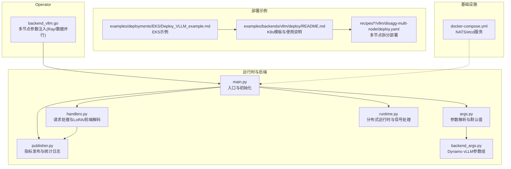
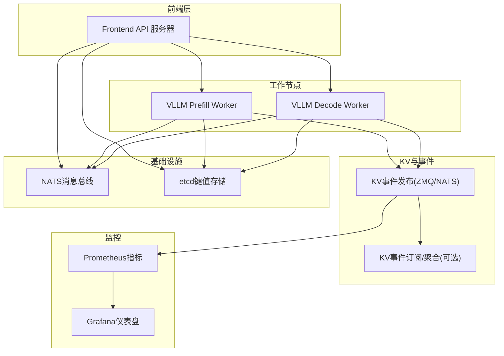
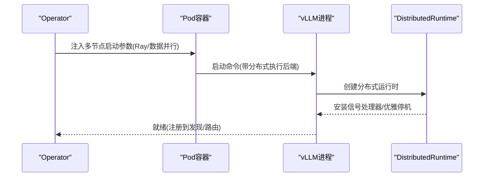
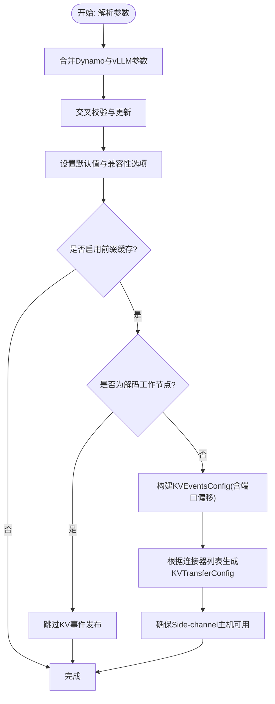
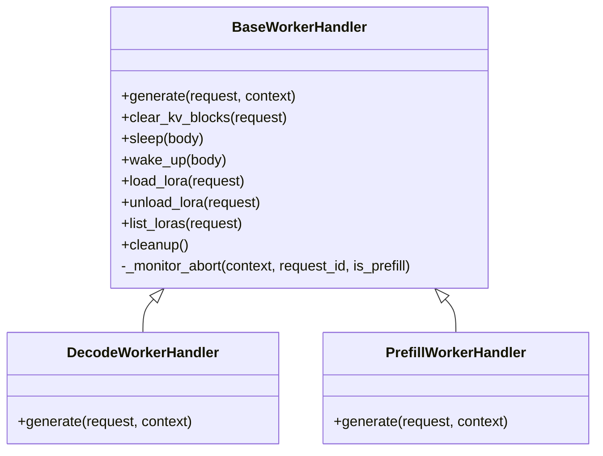
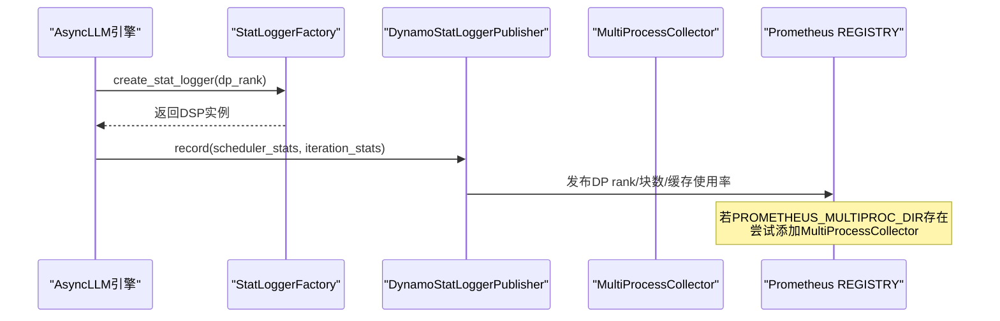
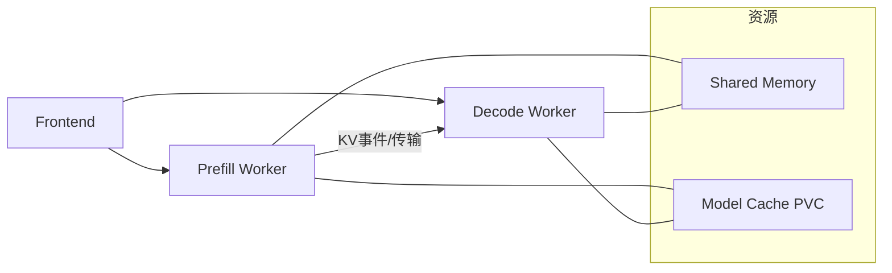
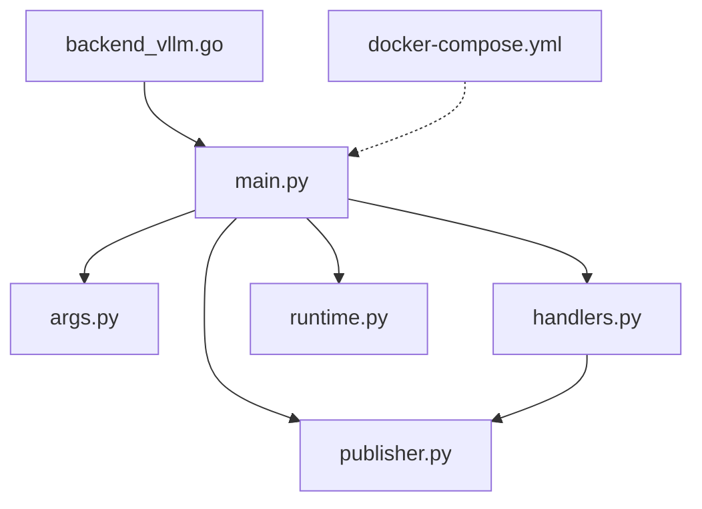

# 多节点部署

<cite>
**本文引用的文件**
- [components/src/dynamo/vllm/main.py](file://components/src/dynamo/vllm/main.py)
- [components/src/dynamo/vllm/args.py](file://components/src/dynamo/vllm/args.py)
- [components/src/dynamo/vllm/handlers.py](file://components/src/dynamo/vllm/handlers.py)
- [components/src/dynamo/vllm/publisher.py](file://components/src/dynamo/vllm/publisher.py)
- [components/src/dynamo/vllm/backend_args.py](file://components/src/dynamo/vllm/backend_args.py)
- [components/src/dynamo/common/utils/runtime.py](file://components/src/dynamo/common/utils/runtime.py)
- [deploy/docker-compose.yml](file://deploy/docker-compose.yml)
- [examples/backends/vllm/deploy/README.md](file://examples/backends/vllm/deploy/README.md)
- [examples/deployments/EKS/Deploy_VLLM_example.md](file://examples/deployments/EKS/Deploy_VLLM_example.md)
- [recipes/llama-3-70b/vllm/disagg-multi-node/deploy.yaml](file://recipes/llama-3-70b/vllm/disagg-multi-node/deploy.yaml)
- [deploy/operator/internal/dynamo/backend_vllm.go](file://deploy/operator/internal/dynamo/backend_vllm.go)
</cite>

## 目录
1. [简介](#简介)
2. [项目结构](#项目结构)
3. [核心组件](#核心组件)
4. [架构总览](#架构总览)
5. [详细组件分析](#详细组件分析)
6. [依赖关系分析](#依赖关系分析)
7. [性能考虑](#性能考虑)
8. [故障排查指南](#故障排查指南)
9. [结论](#结论)
10. [附录](#附录)

## 简介
本文件面向在多节点环境下部署 vLLM 的工程团队与平台工程师，系统性阐述基于 Dynamo 平台的多节点 vLLM 部署策略、分布式架构、节点间通信机制、负载均衡与资源分配、故障处理、性能基准与调优、以及监控方案。文档结合仓库中的实际实现与示例，提供可操作的部署步骤、参数说明与最佳实践。

## 项目结构
围绕 vLLM 多节点部署，本仓库的关键目录与文件如下：
- 组件实现：vLLM 后端适配器、参数解析、处理器、指标发布等位于 components/src/dynamo/vllm
- 运行时工具：统一的分布式运行时创建与优雅停机逻辑位于 components/src/dynamo/common/utils/runtime.py
- 部署示例：Kubernetes 资源模板与 Helm 使用说明位于 examples/backends/vllm/deploy 与 deploy/helm
- 多节点注入：Operator 层对 vLLM 多节点启动参数的注入逻辑位于 deploy/operator/internal/dynamo/backend_vllm.go
- 基础设施：本地开发用 docker-compose（NATS、etcd）位于 deploy/docker-compose.yml
- 示例部署：EKS 示例与多节点拆分部署样例位于 examples/deployments/EKS 与 recipes/*/vllm/disagg-multi-node

**图表来源**
- [components/src/dynamo/vllm/main.py](file://components/src/dynamo/vllm/main.py#L1-L120)
- [components/src/dynamo/vllm/args.py](file://components/src/dynamo/vllm/args.py#L76-L127)
- [components/src/dynamo/vllm/handlers.py](file://components/src/dynamo/vllm/handlers.py#L233-L448)
- [components/src/dynamo/vllm/publisher.py](file://components/src/dynamo/vllm/publisher.py#L1-L148)
- [components/src/dynamo/common/utils/runtime.py](file://components/src/dynamo/common/utils/runtime.py#L64-L103)
- [deploy/docker-compose.yml](file://deploy/docker-compose.yml#L7-L36)
- [examples/backends/vllm/deploy/README.md](file://examples/backends/vllm/deploy/README.md#L1-L266)
- [examples/deployments/EKS/Deploy_VLLM_example.md](file://examples/deployments/EKS/Deploy_VLLM_example.md#L1-L48)
- [recipes/llama-3-70b/vllm/disagg-multi-node/deploy.yaml](file://recipes/llama-3-70b/vllm/disagg-multi-node/deploy.yaml#L1-L87)
- [deploy/operator/internal/dynamo/backend_vllm.go](file://deploy/operator/internal/dynamo/backend_vllm.go#L72-L117)

**章节来源**
- [components/src/dynamo/vllm/main.py](file://components/src/dynamo/vllm/main.py#L1-L120)
- [components/src/dynamo/common/utils/runtime.py](file://components/src/dynamo/common/utils/runtime.py#L64-L103)
- [examples/backends/vllm/deploy/README.md](file://examples/backends/vllm/deploy/README.md#L1-L266)

## 核心组件
- 入口与初始化：负责解析参数、创建分布式运行时、按角色初始化引擎与处理器、注册健康检查与端点、处理非主节点（数据并行非领导节点）仅工作不对外提供服务的分支逻辑。
- 参数解析：将 Dynamo 运行时参数与 vLLM 引擎参数融合，设置默认值、校验连接器与 KV 事件配置、自动推导 side-channel 主机等。
- 请求处理器：封装生成、清空 KV 块、睡眠/唤醒引擎、LoRA 动态加载/卸载、前端解码支持等能力。
- 指标发布：通过专用 Prometheus 注册表与 NATS 发布通道，上报调度器与缓存使用情况等指标。
- 运行时工具：统一创建 DistributedRuntime、安装信号处理器、优雅停机流程。

**章节来源**
- [components/src/dynamo/vllm/main.py](file://components/src/dynamo/vllm/main.py#L73-L191)
- [components/src/dynamo/vllm/args.py](file://components/src/dynamo/vllm/args.py#L130-L302)
- [components/src/dynamo/vllm/handlers.py](file://components/src/dynamo/vllm/handlers.py#L233-L448)
- [components/src/dynamo/vllm/publisher.py](file://components/src/dynamo/vllm/publisher.py#L40-L148)
- [components/src/dynamo/common/utils/runtime.py](file://components/src/dynamo/common/utils/runtime.py#L46-L103)

## 架构总览
下图展示 vLLM 在多节点环境下的典型部署形态与组件交互：前端 API 服务器、预填充（Prefill）与解码（Decode）工作节点、KV 事件发布/订阅、指标发布、以及基础设施（NATS、etcd）。

**图表来源**
- [components/src/dynamo/vllm/main.py](file://components/src/dynamo/vllm/main.py#L283-L358)
- [components/src/dynamo/vllm/publisher.py](file://components/src/dynamo/vllm/publisher.py#L40-L101)
- [deploy/docker-compose.yml](file://deploy/docker-compose.yml#L12-L35)

**章节来源**
- [components/src/dynamo/vllm/main.py](file://components/src/dynamo/vllm/main.py#L283-L358)
- [components/src/dynamo/vllm/publisher.py](file://components/src/dynamo/vllm/publisher.py#L40-L101)
- [deploy/docker-compose.yml](file://deploy/docker-compose.yml#L12-L35)

## 详细组件分析

### 分布式初始化与多节点参数注入
- 初始化流程：解析命令行参数，创建分布式运行时，按角色选择初始化路径（预填充/解码/多模态/OMNI 等），在非领导数据并行节点上仅运行工作进程不暴露服务端点。
- 多节点参数注入：Operator 层根据是否需要 Ray 分布式或数据并行，向容器注入相应启动参数；Ray 模式由 Placement Group 管理跨节点分布，数据并行模式注入节点数与主节点主机名等。

**图表来源**
- [deploy/operator/internal/dynamo/backend_vllm.go](file://deploy/operator/internal/dynamo/backend_vllm.go#L72-L117)
- [components/src/dynamo/common/utils/runtime.py](file://components/src/dynamo/common/utils/runtime.py#L64-L103)
- [components/src/dynamo/vllm/main.py](file://components/src/dynamo/vllm/main.py#L73-L191)

**章节来源**
- [deploy/operator/internal/dynamo/backend_vllm.go](file://deploy/operator/internal/dynamo/backend_vllm.go#L72-L117)
- [components/src/dynamo/vllm/main.py](file://components/src/dynamo/vllm/main.py#L73-L191)
- [components/src/dynamo/common/utils/runtime.py](file://components/src/dynamo/common/utils/runtime.py#L64-L103)

### 参数解析与默认值（含 KV 事件与连接器）
- 参数来源：Dynamo 运行时参数组 + vLLM 引擎参数组，合并后交叉校验与更新。
- 默认行为：启用前缀缓存、设置合理的块大小、为 NIXL 连接器在 TP=1 场景强制使用多进程执行后端以避免 GIL 竞态。
- KV 事件：根据是否为解码工作节点、是否启用前缀缓存、是否提供用户配置，动态生成 KVEventsConfig，并计算每个数据并行 rank 的发布端口偏移。
- 连接器：支持单/多连接器组合（LMCache/NIXL/KVBM/PdConnector），并确保与 side-channel 主机一致。

**图表来源**
- [components/src/dynamo/vllm/args.py](file://components/src/dynamo/vllm/args.py#L130-L302)
- [components/src/dynamo/vllm/args.py](file://components/src/dynamo/vllm/args.py#L304-L393)
- [components/src/dynamo/vllm/args.py](file://components/src/dynamo/vllm/args.py#L424-L437)

**章节来源**
- [components/src/dynamo/vllm/args.py](file://components/src/dynamo/vllm/args.py#L130-L302)
- [components/src/dynamo/vllm/args.py](file://components/src/dynamo/vllm/args.py#L304-L393)
- [components/src/dynamo/vllm/args.py](file://components/src/dynamo/vllm/args.py#L424-L437)

### 请求处理与多模态/LoRA/前端解码
- 通用处理器基类：封装生成、清空 KV 块、睡眠/唤醒引擎、中止监控、LoRA 动态管理、前端解码支持等。
- LoRA 管理：支持按名称下载、去重锁、并发序列化、注册/注销模型部署卡片以便前端发现与路由。
- 前端解码：当启用时，图像在 Rust 前端解码并通过 NIXL RDMA 传输至后端，减少后端解码开销。

**图表来源**
- [components/src/dynamo/vllm/handlers.py](file://components/src/dynamo/vllm/handlers.py#L233-L448)
- [components/src/dynamo/vllm/handlers.py](file://components/src/dynamo/vllm/handlers.py#L440-L782)

**章节来源**
- [components/src/dynamo/vllm/handlers.py](file://components/src/dynamo/vllm/handlers.py#L233-L448)
- [components/src/dynamo/vllm/handlers.py](file://components/src/dynamo/vllm/handlers.py#L440-L782)

### 指标发布与 Prometheus 集成
- 专用注册表：为 Dynamo 组件指标创建独立 CollectorRegistry，避免与 vLLM 内部指标冲突。
- 多进程模式：在 PROMETHEUS_MULTIPROC_DIR 存在时，尝试添加 MultiProcessCollector；若冲突则使用分离注册表分别收集内存与磁盘指标。
- 统计日志工厂：在 vLLM 引擎初始化期间注入自定义 StatLogger，发布 KV 块使用与缓存占用率等指标。

**图表来源**
- [components/src/dynamo/vllm/publisher.py](file://components/src/dynamo/vllm/publisher.py#L40-L148)
- [components/src/dynamo/vllm/main.py](file://components/src/dynamo/vllm/main.py#L193-L281)

**章节来源**
- [components/src/dynamo/vllm/publisher.py](file://components/src/dynamo/vllm/publisher.py#L40-L148)
- [components/src/dynamo/vllm/main.py](file://components/src/dynamo/vllm/main.py#L193-L281)

### 多节点拆分部署示例
- 拆分形态：前端、预填充工作节点、解码工作节点三者分离，通过 NIXL 或其他 KV 传输后端进行通信。
- 资源分配：显存共享内存、GPU 资源限制与请求、模型缓存挂载 PVC。
- 可扩展性：通过增加解码工作节点副本实现水平扩展；预填充节点可独立扩缩容。

**图表来源**
- [recipes/llama-3-70b/vllm/disagg-multi-node/deploy.yaml](file://recipes/llama-3-70b/vllm/disagg-multi-node/deploy.yaml#L26-L87)
- [examples/backends/vllm/deploy/README.md](file://examples/backends/vllm/deploy/README.md#L21-L37)

**章节来源**
- [recipes/llama-3-70b/vllm/disagg-multi-node/deploy.yaml](file://recipes/llama-3-70b/vllm/disagg-multi-node/deploy.yaml#L1-L87)
- [examples/backends/vllm/deploy/README.md](file://examples/backends/vllm/deploy/README.md#L21-L37)

## 依赖关系分析
- 组件耦合：main.py 作为编排入口，依赖 args.py 提供的配置、runtime.py 创建运行时、handlers.py 提供请求处理、publisher.py 提供指标发布。
- 外部依赖：NATS（请求/事件平面）、etcd（键值存储）、ZMQ（KV 事件发布）、Prometheus（指标采集）。
- 多节点注入：Operator 层根据 vLLM 参数与资源需求注入 Ray 或数据并行启动参数，影响进程启动与节点分布。

**图表来源**
- [components/src/dynamo/vllm/main.py](file://components/src/dynamo/vllm/main.py#L58-L66)
- [components/src/dynamo/vllm/args.py](file://components/src/dynamo/vllm/args.py#L76-L127)
- [components/src/dynamo/vllm/handlers.py](file://components/src/dynamo/vllm/handlers.py#L233-L448)
- [components/src/dynamo/vllm/publisher.py](file://components/src/dynamo/vllm/publisher.py#L40-L101)
- [components/src/dynamo/common/utils/runtime.py](file://components/src/dynamo/common/utils/runtime.py#L64-L103)
- [deploy/operator/internal/dynamo/backend_vllm.go](file://deploy/operator/internal/dynamo/backend_vllm.go#L72-L117)
- [deploy/docker-compose.yml](file://deploy/docker-compose.yml#L12-L35)

**章节来源**
- [components/src/dynamo/vllm/main.py](file://components/src/dynamo/vllm/main.py#L58-L66)
- [components/src/dynamo/common/utils/runtime.py](file://components/src/dynamo/common/utils/runtime.py#L64-L103)
- [deploy/operator/internal/dynamo/backend_vllm.go](file://deploy/operator/internal/dynamo/backend_vllm.go#L72-L117)

## 性能考虑
- 模型加载与缓存：启用前缀缓存与合理的块大小（block_size）有助于降低重复计算；KV 事件发布端口按数据并行 rank 偏移，避免冲突。
- 执行后端：TP=1 且使用 NIXL 连接器时强制多进程执行后端，缓解 GIL 竞态；Ray 模式适合大规模多节点张量并行。
- 指标与可观测性：通过专用 Prometheus 注册表与 NATS 发布通道，持续监控 KV 块使用率与缓存占用，辅助容量规划与动态扩缩容。
- 多模态与前端解码：启用前端解码可减少后端解码开销，但需确保 NIXL side-channel 主机可达与网络带宽充足。

[本节为通用指导，无需具体文件分析]

## 故障排查指南
- 优雅停机：安装 SIGTERM/SIGINT 信号处理器，触发后先注销端点实例停止新请求接入，再睡眠引擎，最后关闭运行时。
- 非领导节点：数据并行 rank 非 0 的节点仅运行工作进程，不暴露服务端点，避免重复服务。
- 健康检查：为预填充与解码端点提供健康检查载荷，便于探活与自动恢复。
- 日志与告警：结合 Grafana 仪表盘与 Prometheus 抓取指标，定位异常（如 KV 缓存占用过高、请求延迟突增）。

**章节来源**
- [components/src/dynamo/common/utils/runtime.py](file://components/src/dynamo/common/utils/runtime.py#L46-L103)
- [components/src/dynamo/vllm/main.py](file://components/src/dynamo/vllm/main.py#L73-L97)
- [components/src/dynamo/vllm/main.py](file://components/src/dynamo/vllm/main.py#L632-L666)

## 结论
本仓库提供了从参数解析、运行时创建、请求处理、指标发布到多节点参数注入的完整链路，配合 Kubernetes 与 Helm 模板，能够快速落地 vLLM 多节点拆分部署。通过启用前缀缓存、合理设置块大小与执行后端、完善监控与健康检查，可在生产环境中获得稳定且高性能的服务能力。

[本节为总结，无需具体文件分析]

## 附录

### 部署步骤（Kubernetes）
- 准备：安装 Dynamo 平台、准备 HuggingFace Token Secret、选择部署模板（聚合/拆分/带路由）。
- 自定义：更新镜像、模型参数、资源限制与 PVC 挂载。
- 部署：应用 CRD 并等待 Pod 就绪。
- 测试：端口转发访问前端服务，发送测试请求验证。

**章节来源**
- [examples/backends/vllm/deploy/README.md](file://examples/backends/vllm/deploy/README.md#L115-L172)
- [examples/deployments/EKS/Deploy_VLLM_example.md](file://examples/deployments/EKS/Deploy_VLLM_example.md#L1-L48)

### 多节点参数注入要点
- Ray 模式：由 Placement Group 管理跨节点分布，避免手动传入 nnodes/node-rank。
- 数据并行模式：注入节点总数与主节点主机名，确保各节点正确识别角色。

**章节来源**
- [deploy/operator/internal/dynamo/backend_vllm.go](file://deploy/operator/internal/dynamo/backend_vllm.go#L72-L117)

### 基础设施与本地开发
- 本地开发可使用 docker-compose 启动 NATS 与 etcd，满足最小化基础设施需求。

**章节来源**
- [deploy/docker-compose.yml](file://deploy/docker-compose.yml#L7-L36)