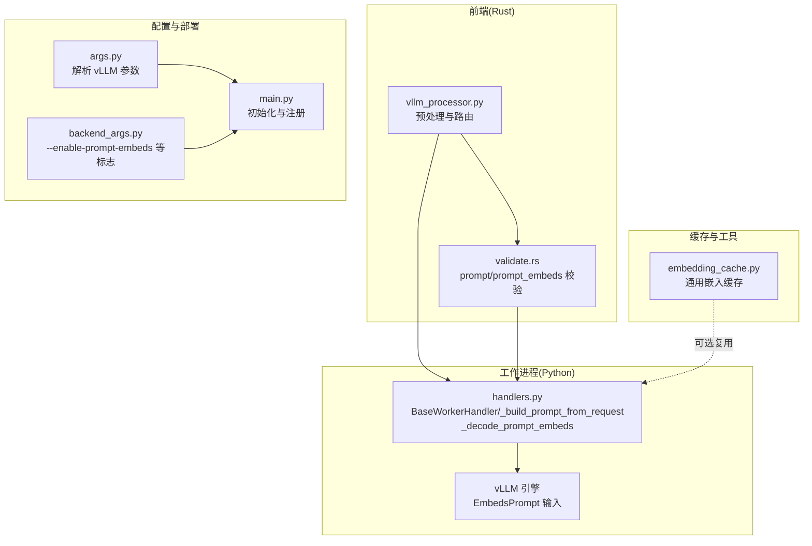
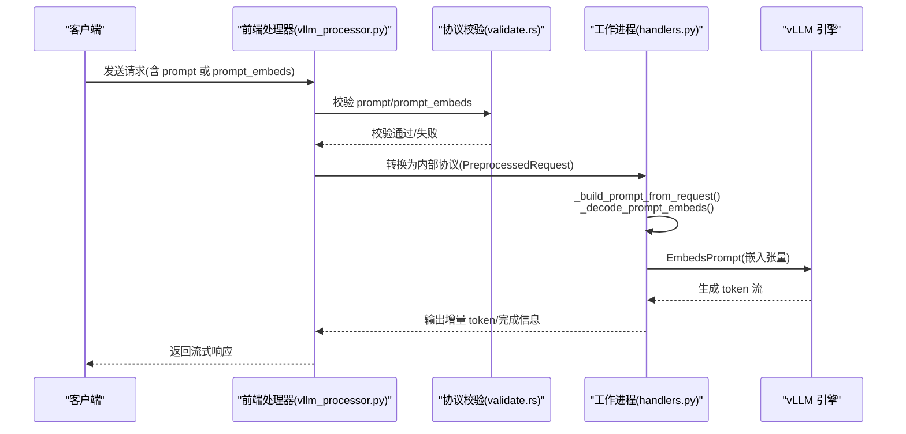
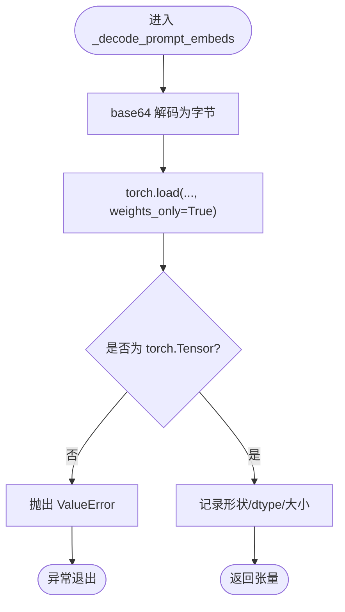
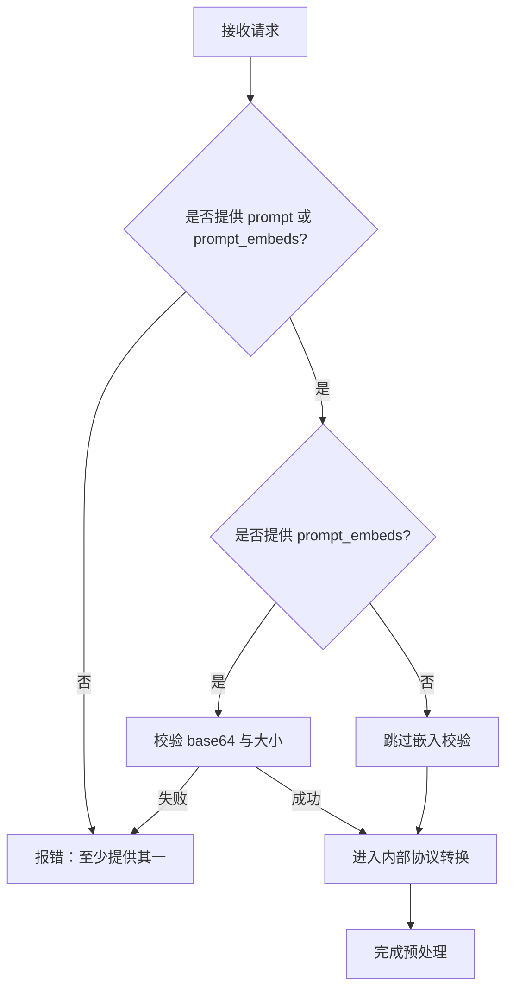
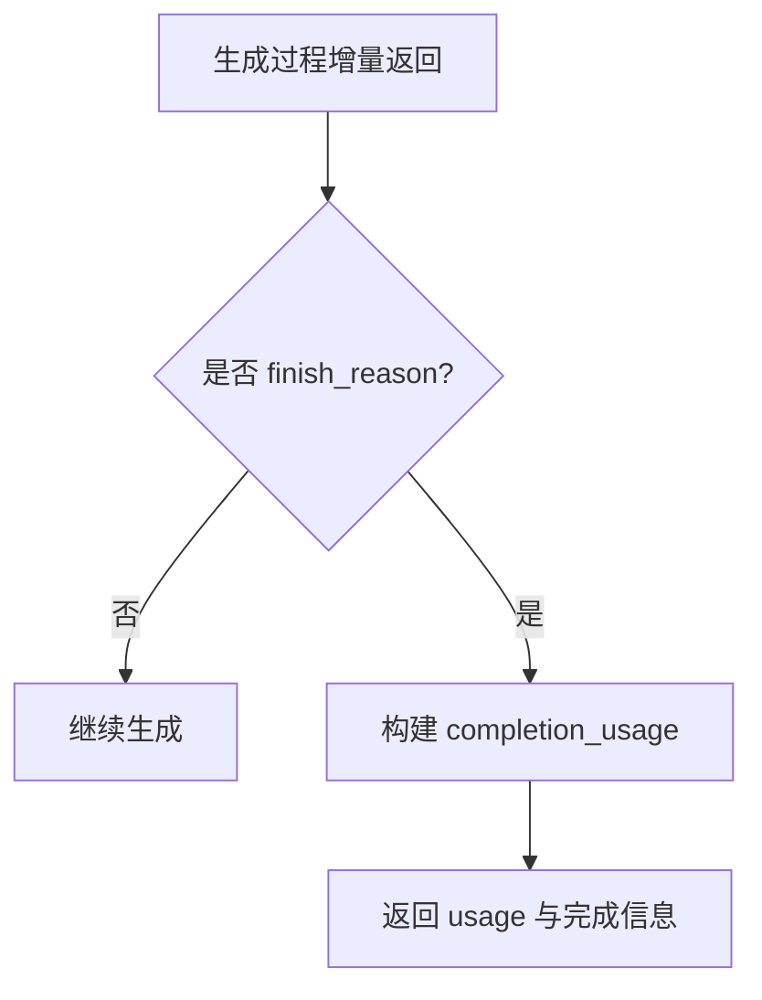
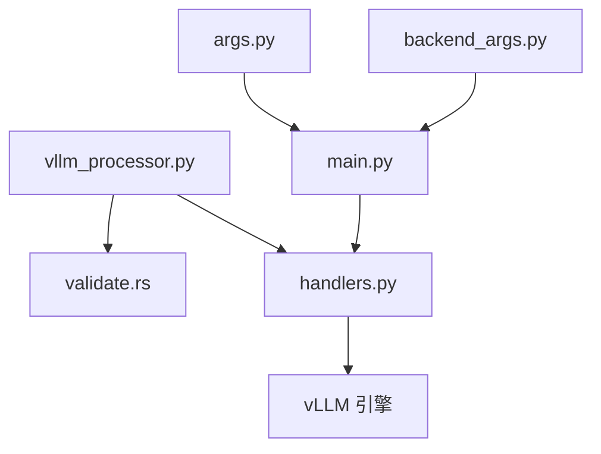

# 提示嵌入功能

<cite>
**本文引用的文件**
- [handlers.py](file://components/src/dynamo/vllm/handlers.py)
- [prompt-embeddings.md](file://docs/pages/backends/vllm/prompt-embeddings.md)
- [embedding_cache.py](file://components/src/dynamo/vllm/multimodal_utils/embedding_cache.py)
- [vllm_processor.py](file://components/src/dynamo/frontend/vllm_processor.py)
- [validate.rs](file://lib/llm/src/protocols/openai/validate.rs)
- [args.py](file://components/src/dynamo/vllm/args.py)
- [backend_args.py](file://components/src/dynamo/vllm/backend_args.py)
- [main.py](file://components/src/dynamo/vllm/main.py)
- [test_vllm_prompt_embeds.py](file://components/src/dynamo/vllm/tests/test_vllm_prompt_embeds.py)
</cite>

## 目录
1. [简介](#简介)
2. [项目结构](#项目结构)
3. [核心组件](#核心组件)
4. [架构总览](#架构总览)
5. [详细组件分析](#详细组件分析)
6. [依赖关系分析](#依赖关系分析)
7. [性能考量](#性能考量)
8. [故障排查指南](#故障排查指南)
9. [结论](#结论)
10. [附录](#附录)

## 简介
提示嵌入（Prompt Embeddings，简称 prompt embeds）是 vLLM 后端在 Dynamo 架构中的一个可选输入模式：允许直接向引擎提交预计算的嵌入张量，从而跳过传统的文本分词与嵌入层计算，直接进入 Transformer 解码阶段。该能力在以下场景尤为有用：
- 隐私敏感场景：避免将原始文本送入推理服务器，降低数据泄露风险；
- 性能优化：绕过 tokenization 和 embedding lookup，减少首 token 延迟；
- 多模态融合：将外部来源（如图像编码器）生成的语义向量无缝接入 LLM；
- 缓存与复用：对重复提示进行预计算并缓存，提升吞吐。

默认情况下该功能处于关闭状态，需要通过命令行参数显式启用。

## 项目结构
围绕提示嵌入功能的相关代码分布在以下模块：
- 前端（Rust）：请求预处理与协议校验，确保 prompt 或 prompt_embeds 至少提供其一，并对 prompt_embeds 的格式与大小进行基础校验。
- 工作进程（Python）：解析请求，解码 base64 的 PyTorch 张量，构建 vLLM 的 EmbedsPrompt 输入，驱动引擎生成 token 并统计用量。
- 文档与测试：官方文档说明启用方式、请求格式、错误处理与限制；单元与集成测试覆盖解码、格式、边界条件与用量统计。

图表来源
- [vllm_processor.py](file://components/src/dynamo/frontend/vllm_processor.py#L95-L363)
- [validate.rs](file://lib/llm/src/protocols/openai/validate.rs#L510-L577)
- [handlers.py](file://components/src/dynamo/vllm/handlers.py#L964-L1018)
- [args.py](file://components/src/dynamo/vllm/args.py#L76-L127)
- [backend_args.py](file://components/src/dynamo/vllm/backend_args.py#L15-L289)
- [main.py](file://components/src/dynamo/vllm/main.py#L676-L800)
- [embedding_cache.py](file://components/src/dynamo/vllm/multimodal_utils/embedding_cache.py#L1-L60)

章节来源
- [vllm_processor.py](file://components/src/dynamo/frontend/vllm_processor.py#L95-L363)
- [validate.rs](file://lib/llm/src/protocols/openai/validate.rs#L510-L577)
- [handlers.py](file://components/src/dynamo/vllm/handlers.py#L964-L1018)
- [args.py](file://components/src/dynamo/vllm/args.py#L76-L127)
- [backend_args.py](file://components/src/dynamo/vllm/backend_args.py#L15-L289)
- [main.py](file://components/src/dynamo/vllm/main.py#L676-L800)
- [embedding_cache.py](file://components/src/dynamo/vllm/multimodal_utils/embedding_cache.py#L1-L60)

## 核心组件
- 前端预处理与协议校验
  - 要求至少提供 prompt 或 prompt_embeds 其中之一；
  - 当提供 prompt_embeds 时，进行 base64 有效性与大小范围检查；
  - 支持 OpenAI 兼容格式的 extra_body 字段传入 prompt_embeds。
- 工作进程解码与输入构建
  - 解码 base64 为 PyTorch 张量，校验类型与形状；
  - 将张量封装为 vLLM 的 EmbedsPrompt，交由引擎执行；
  - 统计用量时优先使用嵌入序列长度，否则回退到 token 数量。
- 配置与部署
  - 通过 --enable-prompt-embeds 开启功能；
  - vLLM 参数解析与默认值设置；
  - 注册模型与端点，支持多进程与指标采集。

章节来源
- [validate.rs](file://lib/llm/src/protocols/openai/validate.rs#L510-L577)
- [handlers.py](file://components/src/dynamo/vllm/handlers.py#L791-L832)
- [handlers.py](file://components/src/dynamo/vllm/handlers.py#L834-L867)
- [handlers.py](file://components/src/dynamo/vllm/handlers.py#L964-L1018)
- [handlers.py](file://components/src/dynamo/vllm/handlers.py#L1020-L1059)
- [args.py](file://components/src/dynamo/vllm/args.py#L76-L127)
- [backend_args.py](file://components/src/dynamo/vllm/backend_args.py#L15-L289)
- [main.py](file://components/src/dynamo/vllm/main.py#L676-L800)

## 架构总览
提示嵌入的端到端流程如下：

图表来源
- [vllm_processor.py](file://components/src/dynamo/frontend/vllm_processor.py#L95-L363)
- [validate.rs](file://lib/llm/src/protocols/openai/validate.rs#L510-L577)
- [handlers.py](file://components/src/dynamo/vllm/handlers.py#L964-L1018)
- [handlers.py](file://components/src/dynamo/vllm/handlers.py#L791-L832)

章节来源
- [vllm_processor.py](file://components/src/dynamo/frontend/vllm_processor.py#L95-L363)
- [validate.rs](file://lib/llm/src/protocols/openai/validate.rs#L510-L577)
- [handlers.py](file://components/src/dynamo/vllm/handlers.py#L791-L832)
- [handlers.py](file://components/src/dynamo/vllm/handlers.py#L964-L1018)

## 详细组件分析

### 组件 A：提示嵌入解码与输入构建
- 解码流程
  - base64 解码 → 二进制字节 → 使用 torch.load(weights_only=True) 加载为张量；
  - 校验必须为 torch.Tensor 类型；
  - 记录日志：形状、dtype、大小等。
- 输入构建
  - 从嵌入张量提取序列长度（2D/3D 形状适配），用于用量统计；
  - 构造 vLLM 的 EmbedsPrompt，跳过传统 tokenization。
- 错误处理
  - base64 非法、解码失败、张量类型不符、尺寸越界等均抛出 ValueError 并返回错误信息。

图表来源
- [handlers.py](file://components/src/dynamo/vllm/handlers.py#L791-L832)

章节来源
- [handlers.py](file://components/src/dynamo/vllm/handlers.py#L791-L832)
- [handlers.py](file://components/src/dynamo/vllm/handlers.py#L834-L867)
- [handlers.py](file://components/src/dynamo/vllm/handlers.py#L964-L1018)

### 组件 B：前端协议校验与预处理
- 协议校验
  - 至少提供 prompt 或 prompt_embeds；
  - 若提供 prompt_embeds，则要求 base64 有效且解码后大小在 100 字节至 10MB 之间；
  - 支持 OpenAI 兼容格式的 extra_body 字段。
- 预处理
  - 将用户请求转换为 vLLM 内部的 EngineCoreRequest；
  - 传递 sampling_params、stop 条件、输出选项等。

图表来源
- [validate.rs](file://lib/llm/src/protocols/openai/validate.rs#L510-L577)
- [vllm_processor.py](file://components/src/dynamo/frontend/vllm_processor.py#L95-L363)

章节来源
- [validate.rs](file://lib/llm/src/protocols/openai/validate.rs#L510-L577)
- [vllm_processor.py](file://components/src/dynamo/frontend/vllm_processor.py#L95-L363)

### 组件 C：用量统计与完成回调
- 用量统计逻辑
  - 若使用嵌入输入：prompt_tokens 使用嵌入序列长度；
  - 若使用文本输入：prompt_tokens 使用 token 数量；
  - completion_tokens 使用实际生成 token 数；
  - total_tokens 为二者之和；
  - cached_tokens 可选上报。
- 完成回调
  - 在输出 finish_reason 到达时，统一构造 completion_usage 返回给前端。

图表来源
- [handlers.py](file://components/src/dynamo/vllm/handlers.py#L1020-L1059)

章节来源
- [handlers.py](file://components/src/dynamo/vllm/handlers.py#L1020-L1059)

### 组件 D：缓存机制与复用建议
- 通用嵌入缓存
  - 提供简单的键值缓存类，支持生成哈希键、查询、插入与获取；
  - 可用于缓存外部编码器（如图像编码器）的嵌入结果，避免重复计算。
- 注意事项
  - vLLM 本身未内置 prompt_embeds 级别的 KV 缓存；
  - 建议在应用层或边缘侧维护缓存，结合 cache_salt 控制缓存命中策略（若需要）。

章节来源
- [embedding_cache.py](file://components/src/dynamo/vllm/multimodal_utils/embedding_cache.py#L1-L60)

## 依赖关系分析
- 前端依赖
  - vllm_processor.py 依赖 vLLM 的 InputProcessor/OutputProcessor 进行预处理与后处理；
  - validate.rs 对 prompt_embeds 进行基础格式与大小校验。
- 工作进程依赖
  - BaseWorkerHandler._build_prompt_from_request 作为统一入口，根据是否存在 prompt_embeds 决定走嵌入路径还是文本路径；
  - _decode_prompt_embeds 与 _create_prompt_from_embeddings 实现嵌入解码与输入构建；
  - _build_completion_usage 统一用量统计。
- 部署与配置
  - args.py 与 backend_args.py 提供参数解析与默认值；
  - main.py 初始化引擎、注册端点与健康检查。

图表来源
- [vllm_processor.py](file://components/src/dynamo/frontend/vllm_processor.py#L95-L363)
- [validate.rs](file://lib/llm/src/protocols/openai/validate.rs#L510-L577)
- [handlers.py](file://components/src/dynamo/vllm/handlers.py#L964-L1018)
- [args.py](file://components/src/dynamo/vllm/args.py#L76-L127)
- [backend_args.py](file://components/src/dynamo/vllm/backend_args.py#L15-L289)
- [main.py](file://components/src/dynamo/vllm/main.py#L676-L800)

章节来源
- [vllm_processor.py](file://components/src/dynamo/frontend/vllm_processor.py#L95-L363)
- [validate.rs](file://lib/llm/src/protocols/openai/validate.rs#L510-L577)
- [handlers.py](file://components/src/dynamo/vllm/handlers.py#L964-L1018)
- [args.py](file://components/src/dynamo/vllm/args.py#L76-L127)
- [backend_args.py](file://components/src/dynamo/vllm/backend_args.py#L15-L289)
- [main.py](file://components/src/dynamo/vllm/main.py#L676-L800)

## 性能考量
- 减少首 token 延迟
  - 绕过 tokenization 与 embedding lookup，直接进入解码阶段；
  - 适合高频短提示、重复提示的场景。
- 内存与带宽
  - 嵌入张量需通过网络传输，注意 NATS 的 payload 上限（默认已配置为 15MB）；
  - 建议控制序列长度与隐藏维度，避免过大张量导致传输与反序列化开销。
- 用量统计准确性
  - 使用嵌入输入时，prompt_tokens 以嵌入序列长度为准，有助于更精确的成本核算。
- 并发与稳定性
  - 单元测试覆盖了多种形状、dtype 与边界情况，集成测试验证并发与性能表现。

章节来源
- [prompt-embeddings.md](file://docs/pages/backends/vllm/prompt-embeddings.md#L183-L249)
- [test_vllm_prompt_embeds.py](file://components/src/dynamo/vllm/tests/test_vllm_prompt_embeds.py#L1-L229)

## 故障排查指南
- 必须启用功能
  - 未设置 --enable-prompt-embeds 时，携带 prompt_embeds 的请求会失败；
  - 解决：启动时添加 --enable-prompt-embeds。
- base64 格式错误
  - 使用 base64.b64encode 后需 .decode('utf-8')；
  - 解决：确认编码与字符串化步骤正确。
- 张量格式不匹配
  - 仅支持 torch.save() 序列化的 PyTorch 张量，不支持 NumPy；
  - 解决：使用 torch.save() 保存张量。
- 尺寸限制
  - 最小 100 字节，最大 10MB（解码后）；
  - 解决：调整序列长度或隐藏维度，确保在限制范围内。
- 与多模态冲突
  - prompt_embeds 与图片/视频等多模态数据不可同时使用；
  - 解决：在单次请求中仅选择一种输入方式。

章节来源
- [prompt-embeddings.md](file://docs/pages/backends/vllm/prompt-embeddings.md#L183-L232)
- [handlers.py](file://components/src/dynamo/vllm/handlers.py#L791-L832)
- [handlers.py](file://components/src/dynamo/vllm/handlers.py#L987-L1018)

## 结论
提示嵌入功能为 vLLM 在 Dynamo 中提供了隐私友好、低延迟的替代输入路径。通过严格的前端校验、稳健的工作进程解码与统一的用量统计，它能够安全高效地接入预计算的语义向量。配合合理的缓存策略与部署配置，可在生产环境中显著提升推理性能与资源利用率。

## 附录

### 启用与配置
- 命令行参数
  - --enable-prompt-embeds：启用提示嵌入功能（默认关闭）
  - vLLM 其他参数通过 vllm serve 的标准参数传递
- Docker/Kubernetes
  - 在容器命令中追加 --enable-prompt-embeds
  - NATS 的 max_payload 默认已设为 15MB，满足嵌入张量传输需求

章节来源
- [prompt-embeddings.md](file://docs/pages/backends/vllm/prompt-embeddings.md#L103-L143)
- [backend_args.py](file://components/src/dynamo/vllm/backend_args.py#L15-L289)
- [args.py](file://components/src/dynamo/vllm/args.py#L76-L127)

### API 接口与示例
- 请求体字段
  - model、prompt（可为空）、prompt_embeds（base64 编码的 PyTorch 张量）、max_tokens 等
- 响应体
  - 标准 OpenAI 格式，usage 中包含 prompt_tokens、completion_tokens、total_tokens
- 示例
  - Python 客户端发送 base64 编码的嵌入张量
  - 支持流式与非流式两种模式

章节来源
- [prompt-embeddings.md](file://docs/pages/backends/vllm/prompt-embeddings.md#L145-L223)

### 测试与验证
- 单元测试
  - 覆盖不同形状、dtype、值域与错误场景
- 集成测试
  - 端到端验证功能、性能、并发与用量统计

章节来源
- [test_vllm_prompt_embeds.py](file://components/src/dynamo/vllm/tests/test_vllm_prompt_embeds.py#L1-L229)
- [prompt-embeddings.md](file://docs/pages/backends/vllm/prompt-embeddings.md#L233-L249)