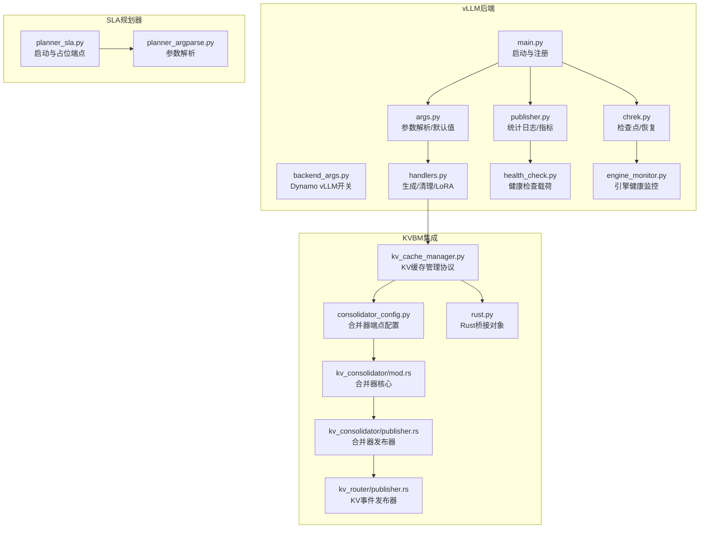
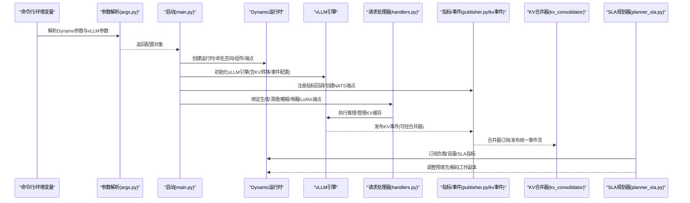
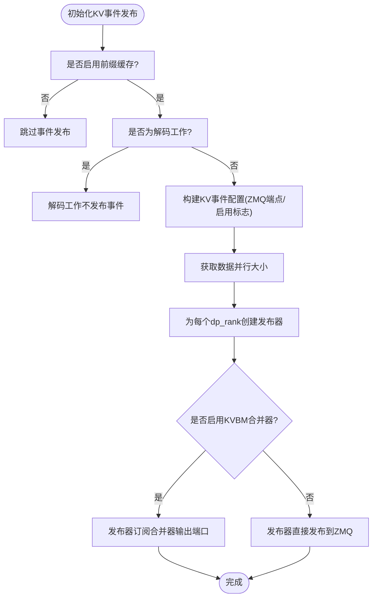
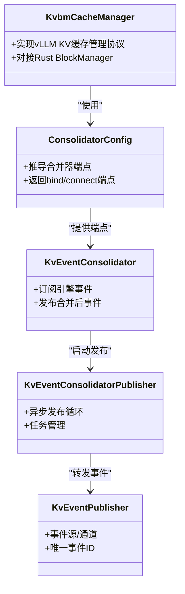
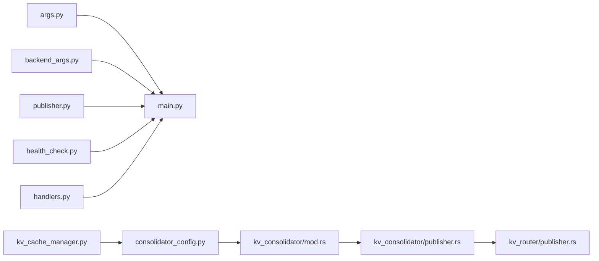

# 核心功能特性

<cite>
**本文引用的文件**   
- [components/src/dynamo/vllm/main.py](file://components/src/dynamo/vllm/main.py)
- [components/src/dynamo/vllm/args.py](file://components/src/dynamo/vllm/args.py)
- [components/src/dynamo/vllm/backend_args.py](file://components/src/dynamo/vllm/backend_args.py)
- [components/src/dynamo/vllm/handlers.py](file://components/src/dynamo/vllm/handlers.py)
- [components/src/dynamo/vllm/publisher.py](file://components/src/dynamo/vllm/publisher.py)
- [components/src/dynamo/vllm/health_check.py](file://components/src/dynamo/vllm/health_check.py)
- [components/src/dynamo/vllm/chrek.py](file://components/src/dynamo/vllm/chrek.py)
- [components/src/dynamo/vllm/engine_monitor.py](file://components/src/dynamo/vllm/engine_monitor.py)
- [lib/bindings/kvbm/python/kvbm/vllm_integration/consolidator_config.py](file://lib/bindings/kvbm/python/kvbm/vllm_integration/consolidator_config.py)
- [lib/bindings/kvbm/python/kvbm/vllm_integration/kv_cache_manager.py](file://lib/bindings/kvbm/python/kvbm/vllm_integration/kv_cache_manager.py)
- [lib/bindings/kvbm/python/kvbm/vllm_integration/rust.py](file://lib/bindings/kvbm/python/kvbm/vllm_integration/rust.py)
- [lib/llm/src/block_manager/kv_consolidator/mod.rs](file://lib/llm/src/block_manager/kv_consolidator/mod.rs)
- [lib/llm/src/block_manager/kv_consolidator/publisher.rs](file://lib/llm/src/block_manager/kv_consolidator/publisher.rs)
- [lib/llm/src/kv_router/publisher.rs](file://lib/llm/src/kv_router/publisher.rs)
- [components/src/dynamo/planner/planner_sla.py](file://components/src/dynamo/planner/planner_sla.py)
- [components/src/dynamo/planner/utils/planner_argparse.py](file://components/src/dynamo/planner/utils/planner_argparse.py)
- [tests/kvbm_integration/test_kvbm_vllm_integration.py](file://tests/kvbm_integration/test_kvbm_vllm_integration.py)
- [tests/kvbm_integration/test_determinism_agg.py](file://tests/kvbm_integration/test_determinism_agg.py)
</cite>

## 目录
1. [简介](#简介)
2. [项目结构](#项目结构)
3. [核心组件](#核心组件)
4. [架构总览](#架构总览)
5. [详细组件分析](#详细组件分析)
6. [依赖关系分析](#依赖关系分析)
7. [性能考量](#性能考量)
8. [故障排查指南](#故障排查指南)
9. [结论](#结论)
10. [附录](#附录)

## 简介
本文件面向Dynamo平台中vLLM后端的核心能力，系统性阐述以下关键特性与其实现机制：聚合服务、分割式服务（预填充/解码分离）、KV感知路由（前缀缓存事件发布与合并）、SLA规划器（按SLA自动扩缩容）以及KVBM集成（分布式KV缓存管理与事件合并）。文档提供各特性的配置要点、使用场景、部署建议、功能支持矩阵与最佳实践，并通过图示帮助读者快速理解端到端流程。

## 项目结构
vLLM后端位于components/src/dynamo/vllm目录，围绕“启动入口、参数解析、引擎初始化、请求处理、指标与健康检查、检查点/恢复、引擎监控”等模块组织；同时通过KVBM与KV事件合并器实现跨进程/跨节点的KV缓存共享与路由优化；SLA规划器作为独立组件与Dynamo运行时协同工作，实现基于SLA的动态调度。

图表来源
- [components/src/dynamo/vllm/main.py](file://components/src/dynamo/vllm/main.py#L1-L190)
- [components/src/dynamo/vllm/args.py](file://components/src/dynamo/vllm/args.py#L76-L127)
- [components/src/dynamo/vllm/backend_args.py](file://components/src/dynamo/vllm/backend_args.py#L15-L289)
- [components/src/dynamo/vllm/handlers.py](file://components/src/dynamo/vllm/handlers.py#L233-L425)
- [components/src/dynamo/vllm/publisher.py](file://components/src/dynamo/vllm/publisher.py#L103-L148)
- [components/src/dynamo/vllm/health_check.py](file://components/src/dynamo/vllm/health_check.py#L83-L196)
- [components/src/dynamo/vllm/chrek.py](file://components/src/dynamo/vllm/chrek.py#L39-L157)
- [components/src/dynamo/vllm/engine_monitor.py](file://components/src/dynamo/vllm/engine_monitor.py#L23-L120)
- [lib/bindings/kvbm/python/kvbm/vllm_integration/kv_cache_manager.py](file://lib/bindings/kvbm/python/kvbm/vllm_integration/kv_cache_manager.py#L35-L37)
- [lib/bindings/kvbm/python/kvbm/vllm_integration/consolidator_config.py](file://lib/bindings/kvbm/python/kvbm/vllm_integration/consolidator_config.py#L147-L169)
- [lib/llm/src/block_manager/kv_consolidator/mod.rs](file://lib/llm/src/block_manager/kv_consolidator/mod.rs#L77-L107)
- [lib/llm/src/block_manager/kv_consolidator/publisher.rs](file://lib/llm/src/block_manager/kv_consolidator/publisher.rs#L147-L191)
- [lib/llm/src/kv_router/publisher.rs](file://lib/llm/src/kv_router/publisher.rs#L112-L149)
- [lib/bindings/kvbm/python/kvbm/vllm_integration/rust.py](file://lib/bindings/kvbm/python/kvbm/vllm_integration/rust.py#L8-L36)
- [components/src/dynamo/planner/planner_sla.py](file://components/src/dynamo/planner/planner_sla.py#L36-L55)
- [components/src/dynamo/planner/utils/planner_argparse.py](file://components/src/dynamo/planner/utils/planner_argparse.py#L21-L66)

章节来源
- [components/src/dynamo/vllm/main.py](file://components/src/dynamo/vllm/main.py#L1-L190)
- [components/src/dynamo/vllm/args.py](file://components/src/dynamo/vllm/args.py#L76-L127)
- [components/src/dynamo/vllm/backend_args.py](file://components/src/dynamo/vllm/backend_args.py#L15-L289)

## 核心组件
- 启动与注册：负责解析参数、创建运行时、初始化vLLM引擎、注册端点、设置指标与健康检查、处理非主节点、以及可选的检查点/恢复生命周期。
- 参数系统：统一解析Dynamo运行时参数、Dynamo vLLM专用参数、以及vLLM引擎参数，并进行交叉校验与默认值注入。
- 请求处理器：封装生成、清理KV块、睡眠/唤醒引擎、LoRA动态加载/卸载/枚举等逻辑。
- 指标与健康：提供vLLM与Dynamo组件指标收集、多进程Prometheus兼容、健康检查载荷构建。
- 引擎监控：持续健康检查，异常时触发引擎与运行时关闭。
- 检查点/恢复：在容器级快照（如CRIU）场景下，按信号文件驱动的生命周期完成睡眠、就绪标记、等待信号或恢复标记、唤醒。
- KVBM集成：通过KV缓存管理器实现vLLM接口契约，结合合并器配置与发布器，实现跨进程/跨节点的KV事件合并与路由。

章节来源
- [components/src/dynamo/vllm/main.py](file://components/src/dynamo/vllm/main.py#L99-L190)
- [components/src/dynamo/vllm/args.py](file://components/src/dynamo/vllm/args.py#L130-L302)
- [components/src/dynamo/vllm/handlers.py](file://components/src/dynamo/vllm/handlers.py#L233-L425)
- [components/src/dynamo/vllm/publisher.py](file://components/src/dynamo/vllm/publisher.py#L103-L148)
- [components/src/dynamo/vllm/engine_monitor.py](file://components/src/dynamo/vllm/engine_monitor.py#L23-L120)
- [components/src/dynamo/vllm/chrek.py](file://components/src/dynamo/vllm/chrek.py#L93-L157)
- [lib/bindings/kvbm/python/kvbm/vllm_integration/kv_cache_manager.py](file://lib/bindings/kvbm/python/kvbm/vllm_integration/kv_cache_manager.py#L35-L37)

## 架构总览
下图展示了vLLM后端在Dynamo中的端到端交互：参数解析与默认注入、引擎初始化、端点注册、指标与健康检查、请求处理、KV事件发布与合并、以及SLA规划器的协同。

图表来源
- [components/src/dynamo/vllm/args.py](file://components/src/dynamo/vllm/args.py#L76-L127)
- [components/src/dynamo/vllm/main.py](file://components/src/dynamo/vllm/main.py#L146-L190)
- [components/src/dynamo/vllm/publisher.py](file://components/src/dynamo/vllm/publisher.py#L103-L148)
- [lib/llm/src/block_manager/kv_consolidator/publisher.rs](file://lib/llm/src/block_manager/kv_consolidator/publisher.rs#L147-L191)
- [components/src/dynamo/planner/planner_sla.py](file://components/src/dynamo/planner/planner_sla.py#L36-L55)

## 详细组件分析

### 聚合服务（单体后端）
- 功能概述：以“后端”组件提供统一的生成端点，支持文本/令牌输入、多模态、LoRA动态管理、睡眠/唤醒、KV缓存清理等。
- 实现要点：
  - 通过参数解析确定组件名与端点名，注册模型类型与运行时元数据（KV块数、最大序列数、批处理令牌上限、本地索引器开关等）。
  - 建立统计日志工厂与指标发布器，确保Prometheus多进程模式下的指标一致性。
  - 提供睡眠/唤醒引擎路由，先注销发现再执行睡眠/唤醒，保证流量平滑切换。
  - 支持前端解码（图像解码在Rust侧通过NIXL RDMA传输）与媒体解码器配置。
- 配置要点：
  - 使用Dynamo vLLM开关控制角色（如是否启用vLLM原生编码器、多模态组件等），并通过自定义Jinja模板扩展聊天格式。
  - 通过连接器列表选择KV转移策略（LMCache/NIXL/KVBM/PdConnector组合）。
- 典型用法：
  - 在聚合部署中，仅需启动一个后端实例即可承载所有推理需求，适合低延迟与简化运维场景。

章节来源
- [components/src/dynamo/vllm/main.py](file://components/src/dynamo/vllm/main.py#L676-L800)
- [components/src/dynamo/vllm/backend_args.py](file://components/src/dynamo/vllm/backend_args.py#L15-L289)
- [components/src/dynamo/vllm/args.py](file://components/src/dynamo/vllm/args.py#L143-L302)
- [components/src/dynamo/vllm/handlers.py](file://components/src/dynamo/vllm/handlers.py#L287-L347)

### 分割式服务（预填充/解码分离）
- 功能概述：将预填充（prefill）与解码（decode）阶段拆分到不同工作副本，降低峰值显存占用，提升整体吞吐。
- 实现要点：
  - 预填充工作：注册预填充端点与清理KV块端点，支持睡眠/唤醒引擎路由；健康检查载荷采用预处理请求格式。
  - 解码工作：注册解码端点与LoRA管理端点，支持动态加载/卸载/枚举LoRA适配器；健康检查载荷采用令牌ID格式。
  - 非主数据并行节点：自动跳过端点服务，仅运行工作进程。
- 配置要点：
  - 通过Dynamo vLLM开关分别启用预填充/解码工作副本。
  - 可选择使用vLLM内置分词器或Dynamo预处理器。
- 典型用法：
  - 在高并发/长上下文场景下，优先使用预填充/解码分离，配合SLA规划器动态调整副本数量。

章节来源
- [components/src/dynamo/vllm/main.py](file://components/src/dynamo/vllm/main.py#L535-L674)
- [components/src/dynamo/vllm/health_check.py](file://components/src/dynamo/vllm/health_check.py#L105-L196)
- [components/src/dynamo/vllm/backend_args.py](file://components/src/dynamo/vllm/backend_args.py#L15-L289)

### KV感知路由与前缀缓存事件发布
- 功能概述：通过vLLM的KV事件发布与Dynamo的KV事件合并器，实现跨进程/跨节点的KV块状态同步与路由优化，显著减少重复计算。
- 实现要点：
  - 参数层：根据连接器列表或用户提供的KV转移配置，生成KV事件配置（ZMQ发布端点、启用标志等）。
  - 初始化层：为每个数据并行rank创建独立的事件发布器；若启用KVBM合并器，则发布器订阅合并器输出端口。
  - 运行时层：事件发布器将KV块状态变化广播至合并器，合并器统一发布到ZMQ，供路由/索引器消费。
- 配置要点：
  - 当启用KVBM时，通过合并器配置推导绑定/连接端点，确保客户端能正确订阅。
  - 解码工作不发布KV事件，避免冗余。
- 典型用法：
  - 在多节点/多副本部署中，开启前缀缓存与事件合并，可显著降低重复KV计算与网络开销。

图表来源
- [components/src/dynamo/vllm/args.py](file://components/src/dynamo/vllm/args.py#L304-L343)
- [components/src/dynamo/vllm/main.py](file://components/src/dynamo/vllm/main.py#L283-L358)
- [lib/bindings/kvbm/python/kvbm/vllm_integration/consolidator_config.py](file://lib/bindings/kvbm/python/kvbm/vllm_integration/consolidator_config.py#L147-L169)
- [lib/llm/src/block_manager/kv_consolidator/mod.rs](file://lib/llm/src/block_manager/kv_consolidator/mod.rs#L77-L107)
- [lib/llm/src/block_manager/kv_consolidator/publisher.rs](file://lib/llm/src/block_manager/kv_consolidator/publisher.rs#L147-L191)
- [lib/llm/src/kv_router/publisher.rs](file://lib/llm/src/kv_router/publisher.rs#L112-L149)

章节来源
- [components/src/dynamo/vllm/args.py](file://components/src/dynamo/vllm/args.py#L304-L343)
- [components/src/dynamo/vllm/main.py](file://components/src/dynamo/vllm/main.py#L283-L358)
- [lib/bindings/kvbm/python/kvbm/vllm_integration/consolidator_config.py](file://lib/bindings/kvbm/python/kvbm/vllm_integration/consolidator_config.py#L147-L169)

### SLA规划器（按SLA自动扩缩容）
- 功能概述：基于TTFT/ITL等SLA指标，对预填充与解码工作副本进行动态调整，确保端到端性能满足业务SLA。
- 实现要点：
  - 作为Dynamo运行时的一个工作进程启动，延迟一段时间以确保其他组件可见。
  - 提供占位端点以满足组件必须具备端点的要求。
  - 通过参数解析器配置环境、命名空间、后端类型、模式（全量/仅预填充/仅解码）、调整周期等。
- 配置要点：
  - 选择后端类型（vLLm/sgLang/TensorRT LLM/mocker）与模式（disagg/prefill/decode）。
  - 设置调整间隔、日志目录、是否无操作模式等。
- 典型用法：
  - 在生产环境中，结合AIPerf/Trace数据，验证TTFT/ITL达标情况，并通过规划器自动调节副本数。

章节来源
- [components/src/dynamo/planner/planner_sla.py](file://components/src/dynamo/planner/planner_sla.py#L36-L55)
- [components/src/dynamo/planner/utils/planner_argparse.py](file://components/src/dynamo/planner/utils/planner_argparse.py#L21-L66)

### KVBM集成（分布式KV缓存管理与事件合并）
- 功能概述：通过KVBM的Rust桥接与Python适配，实现vLLM的KV缓存管理协议，支持分布式块管理、请求槽位更新、以及与合并器的协作。
- 实现要点：
  - KV缓存管理器实现vLLM的KV缓存管理协议，对接Rust侧BlockManager与调度输出。
  - 合并器配置根据KVBM端口推导合并器的绑定/连接端点，确保客户端可稳定订阅。
  - 合并器发布器异步运行，负责将事件序列化并发布到ZMQ。
- 配置要点：
  - 通过KV转移配置选择DynamoConnector并指定模块路径，启用KVBM。
  - 在测试中可通过命令行参数覆盖GPU块数等参数，验证确定性与性能。
- 典型用法：
  - 在大规模多节点部署中，启用KVBM可显著提升KV缓存复用率与路由效率。

图表来源
- [lib/bindings/kvbm/python/kvbm/vllm_integration/kv_cache_manager.py](file://lib/bindings/kvbm/python/kvbm/vllm_integration/kv_cache_manager.py#L35-L37)
- [lib/bindings/kvbm/python/kvbm/vllm_integration/consolidator_config.py](file://lib/bindings/kvbm/python/kvbm/vllm_integration/consolidator_config.py#L147-L169)
- [lib/llm/src/block_manager/kv_consolidator/mod.rs](file://lib/llm/src/block_manager/kv_consolidator/mod.rs#L77-L107)
- [lib/llm/src/block_manager/kv_consolidator/publisher.rs](file://lib/llm/src/block_manager/kv_consolidator/publisher.rs#L147-L191)
- [lib/llm/src/kv_router/publisher.rs](file://lib/llm/src/kv_router/publisher.rs#L112-L149)

章节来源
- [lib/bindings/kvbm/python/kvbm/vllm_integration/kv_cache_manager.py](file://lib/bindings/kvbm/python/kvbm/vllm_integration/kv_cache_manager.py#L35-L37)
- [lib/bindings/kvbm/python/kvbm/vllm_integration/consolidator_config.py](file://lib/bindings/kvbm/python/kvbm/vllm_integration/consolidator_config.py#L147-L169)
- [lib/bindings/kvbm/python/kvbm/vllm_integration/rust.py](file://lib/bindings/kvbm/python/kvbm/vllm_integration/rust.py#L8-L36)
- [tests/kvbm_integration/test_determinism_agg.py](file://tests/kvbm_integration/test_determinism_agg.py#L142-L162)

## 依赖关系分析
- 组件耦合：
  - main.py依赖args.py/backend_args.py进行参数解析与默认注入，依赖publisher.py进行指标与统计日志，依赖health_check.py提供健康检查载荷。
  - handlers.py依赖vLLM引擎API与Dynamo运行时API，实现生成、清理、睡眠/唤醒、LoRA管理。
  - KVBM集成通过kv_cache_manager.py与consolidator_config.py协调，最终由合并器发布器与KV事件发布器落地。
- 外部依赖：
  - vLLM引擎版本差异导致部分参数行为变化（如stream_interval、tokenizer初始化），需在参数解析阶段进行兼容处理。
  - Prometheus多进程模式下，需区分全局注册表与多进程注册表，避免重复时间序列冲突。

图表来源
- [components/src/dynamo/vllm/args.py](file://components/src/dynamo/vllm/args.py#L76-L127)
- [components/src/dynamo/vllm/backend_args.py](file://components/src/dynamo/vllm/backend_args.py#L15-L289)
- [components/src/dynamo/vllm/main.py](file://components/src/dynamo/vllm/main.py#L146-L190)
- [components/src/dynamo/vllm/publisher.py](file://components/src/dynamo/vllm/publisher.py#L103-L148)
- [components/src/dynamo/vllm/health_check.py](file://components/src/dynamo/vllm/health_check.py#L83-L196)
- [components/src/dynamo/vllm/handlers.py](file://components/src/dynamo/vllm/handlers.py#L233-L425)
- [lib/bindings/kvbm/python/kvbm/vllm_integration/kv_cache_manager.py](file://lib/bindings/kvbm/python/kvbm/vllm_integration/kv_cache_manager.py#L35-L37)
- [lib/bindings/kvbm/python/kvbm/vllm_integration/consolidator_config.py](file://lib/bindings/kvbm/python/kvbm/vllm_integration/consolidator_config.py#L147-L169)
- [lib/llm/src/block_manager/kv_consolidator/mod.rs](file://lib/llm/src/block_manager/kv_consolidator/mod.rs#L77-L107)
- [lib/llm/src/block_manager/kv_consolidator/publisher.rs](file://lib/llm/src/block_manager/kv_consolidator/publisher.rs#L147-L191)
- [lib/llm/src/kv_router/publisher.rs](file://lib/llm/src/kv_router/publisher.rs#L112-L149)

## 性能考量
- 前缀缓存与事件合并：在高重复率场景下，启用前缀缓存与KV事件合并可显著降低重复KV计算与网络传输。
- 多进程Prometheus：在Kubernetes环境下，注意多进程模式下的注册表冲突，必要时使用独立注册表以避免重复时间序列。
- 引擎睡眠/唤醒：在低负载时段，合理使用睡眠级别释放GPU内存，结合健康检查与运行时注销/重注册，确保流量平稳过渡。
- LoRA动态管理：并发加载同一LoRA会被串行化，避免重复下载与加载，提高资源利用率。
- NIXL连接器：当使用NIXL且TP=1时，强制使用多进程执行器以避免GIL竞争，保障连接器性能。

## 故障排查指南
- 引擎崩溃与健康监控：引擎监控器定期检查健康，若检测到死亡错误，将尝试关闭引擎并触发运行时关闭，随后退出进程。可通过日志定位具体异常。
- 检查点/恢复：在容器级快照场景下，若恢复标记存在则自动唤醒引擎；若信号文件成功则结束当前进程。请确认环境变量齐全与文件权限正确。
- 指标缺失或重复：若出现重复时间序列错误，检查是否已在全局注册表中存在指标，必要时使用独立注册表并分别注册。
- KV事件未到达：确认前缀缓存已启用、事件发布器端点正确、合并器端点推导无误，以及客户端连接到正确的输出端口。

章节来源
- [components/src/dynamo/vllm/engine_monitor.py](file://components/src/dynamo/vllm/engine_monitor.py#L55-L120)
- [components/src/dynamo/vllm/chrek.py](file://components/src/dynamo/vllm/chrek.py#L93-L157)
- [components/src/dynamo/vllm/publisher.py](file://components/src/dynamo/vllm/publisher.py#L193-L281)

## 结论
vLLM后端在Dynamo中通过参数系统、引擎初始化、请求处理、指标与健康检查、检查点/恢复、以及KVBM集成与SLA规划器，形成了完整的聚合/分割式推理服务框架。结合前缀缓存与事件合并，可在多节点/多副本场景下显著提升吞吐与资源利用率；通过SLA规划器实现按需扩缩容，确保端到端性能达标。建议在生产部署中优先启用前缀缓存与事件合并，并结合SLA规划器进行自动化运维。

## 附录

### 功能支持矩阵（基于当前代码实现）
- 聚合服务：支持文本/令牌输入、多模态、LoRA动态管理、睡眠/唤醒、KV清理、健康检查
- 分割式服务：支持预填充/解码分离、非主节点跳过端点、健康检查差异化
- KV感知路由：支持前缀缓存事件发布、合并器端点推导、解码工作不发布事件
- SLA规划器：支持TTFT/ITL目标、动态扩缩容、占位端点、参数化配置
- KVBM集成：支持分布式KV缓存管理、合并器端点配置、Rust桥接对象

章节来源
- [components/src/dynamo/vllm/backend_args.py](file://components/src/dynamo/vllm/backend_args.py#L15-L289)
- [components/src/dynamo/vllm/health_check.py](file://components/src/dynamo/vllm/health_check.py#L83-L196)
- [components/src/dynamo/vllm/publisher.py](file://components/src/dynamo/vllm/publisher.py#L103-L148)
- [components/src/dynamo/planner/planner_sla.py](file://components/src/dynamo/planner/planner_sla.py#L36-L55)
- [lib/bindings/kvbm/python/kvbm/vllm_integration/consolidator_config.py](file://lib/bindings/kvbm/python/kvbm/vllm_integration/consolidator_config.py#L147-L169)