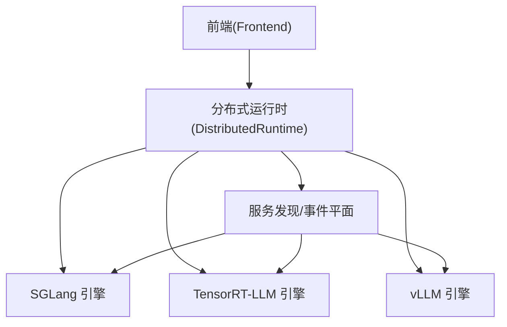
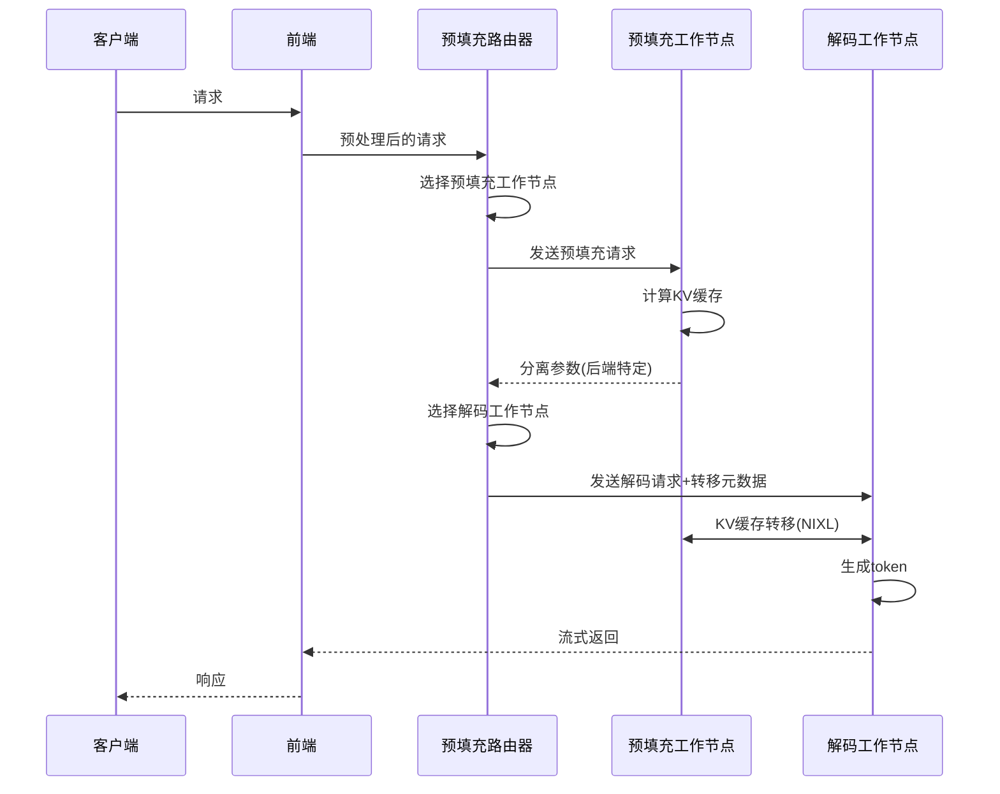
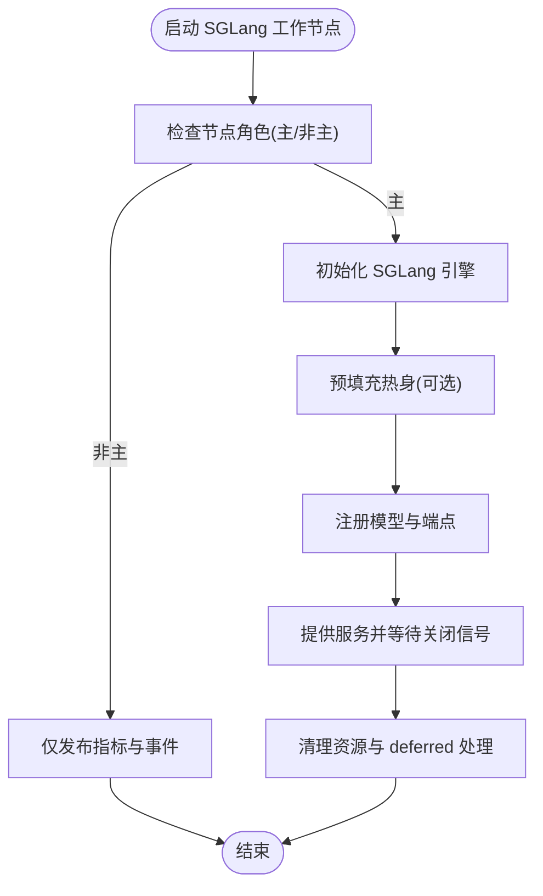
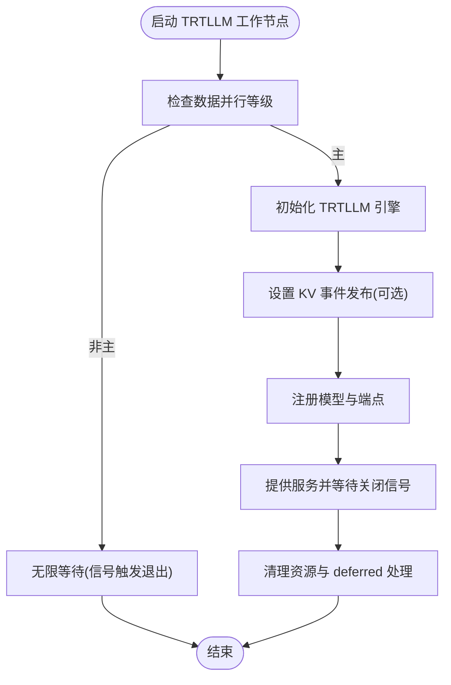
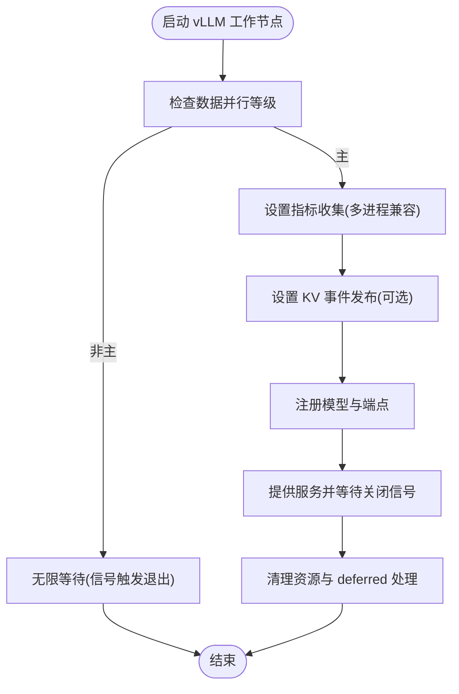
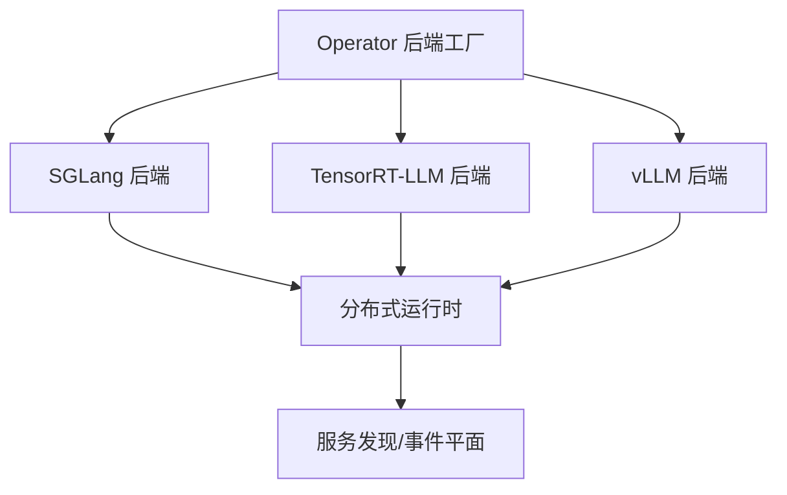
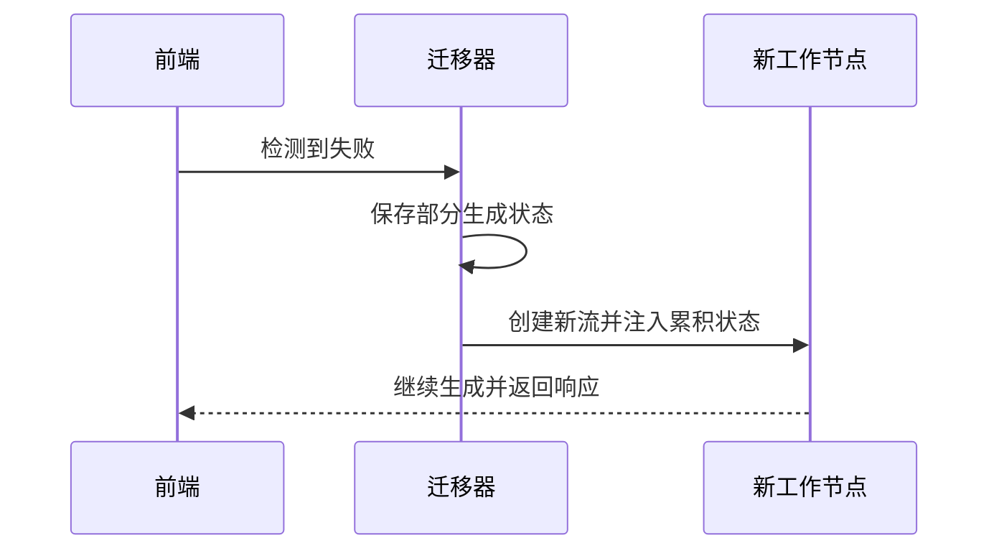
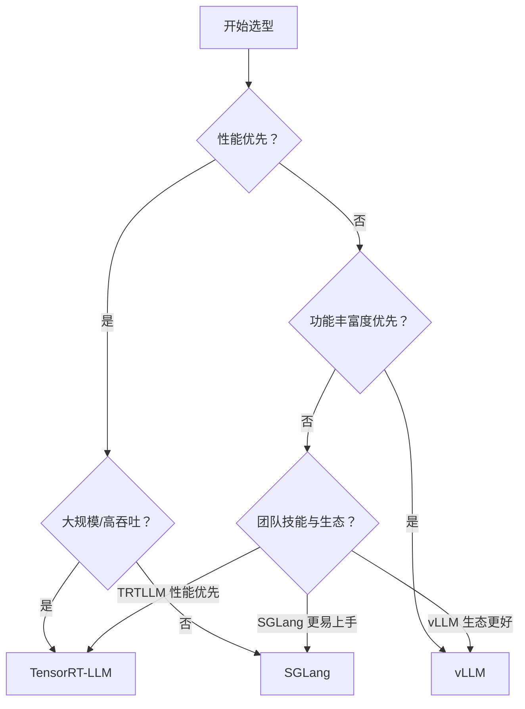

# 后端对比与选择指南

<cite>
**本文档引用的文件**
- [components/src/dynamo/sglang/main.py](file://components/src/dynamo/sglang/main.py)
- [components/src/dynamo/trtllm/main.py](file://components/src/dynamo/trtllm/main.py)
- [components/src/dynamo/vllm/main.py](file://components/src/dynamo/vllm/main.py)
- [docs/pages/reference/feature-matrix.md](file://docs/pages/reference/feature-matrix.md)
- [docs/pages/reference/support-matrix.md](file://docs/pages/reference/support-matrix.md)
- [docs/pages/backends/sglang/README.md](file://docs/pages/backends/sglang/README.md)
- [docs/pages/backends/trtllm/README.md](file://docs/pages/backends/trtllm/README.md)
- [docs/pages/backends/vllm/README.md](file://docs/pages/backends/vllm/README.md)
- [docs/pages/design-docs/disagg-serving.md](file://docs/pages/design-docs/disagg-serving.md)
- [docs/pages/fault-tolerance/request-migration.md](file://docs/pages/fault-tolerance/request-migration.md)
- [docs/pages/fault-tolerance/request-cancellation.md](file://docs/pages/fault-tolerance/request-cancellation.md)
- [deploy/operator/internal/dynamo/graph.go](file://deploy/operator/internal/dynamo/graph.go)
</cite>

## 目录
1. [简介](#简介)
2. [项目结构](#项目结构)
3. [核心组件](#核心组件)
4. [架构总览](#架构总览)
5. [详细组件分析](#详细组件分析)
6. [依赖关系分析](#依赖关系分析)
7. [性能考量](#性能考量)
8. [故障处理与迁移](#故障处理与迁移)
9. [迁移指南与最佳实践](#迁移指南与最佳实践)
10. [结论](#结论)
11. [附录：功能矩阵与决策树](#附录功能矩阵与决策树)

## 简介
本指南围绕 Dynamo 平台的三大后端引擎（SGLang、TensorRT-LLM、vLLM）进行系统性对比，覆盖性能特征、功能支持、部署复杂度与适用场景，并提供基于功能矩阵的对比表、后端选择决策树与迁移指南，帮助不同技术背景的读者快速做出适合自身需求的选型与实施决策。

## 项目结构
本仓库采用模块化分层组织，后端引擎以独立子模块形式集成到统一的分布式运行时中：
- 前端与路由：负责请求接入、预处理与路由协调
- 后端引擎：分别在 components/src/dynamo/{sglang,trtllm,vllm}/ 下实现
- 运行时与发现：通过分布式运行时统一管理组件生命周期与服务发现
- 文档与示例：docs/pages 提供设计文档、特性矩阵与后端使用说明；examples 提供部署与基准测试脚本

**图表来源**
- [components/src/dynamo/sglang/main.py](file://components/src/dynamo/sglang/main.py#L1-L888)
- [components/src/dynamo/trtllm/main.py](file://components/src/dynamo/trtllm/main.py#L1-L51)
- [components/src/dynamo/vllm/main.py](file://components/src/dynamo/vllm/main.py#L1-L1373)

**章节来源**
- [components/src/dynamo/sglang/main.py](file://components/src/dynamo/sglang/main.py#L1-L888)
- [components/src/dynamo/trtllm/main.py](file://components/src/dynamo/trtllm/main.py#L1-L51)
- [components/src/dynamo/vllm/main.py](file://components/src/dynamo/vllm/main.py#L1-L1373)

## 核心组件
- SGLang 后端：通过 SGLang Engine 集成，支持高吞吐、快速原语与多模态；在 KV 路由与请求迁移方面具备良好能力，但 KVBM 支持尚在规划阶段。
- TensorRT-LLM 后端：强调推理性能与优化，具备完整的 KVBM 集成与 KV 缓存转移能力，支持大规模 P/D 与 WideEP 场景。
- vLLM 后端：特性覆盖最广，支持 KVBM、LMCache、多模态视频/音频、LoRA、工具调用、推测式解码等，适配性强。

**章节来源**
- [docs/pages/backends/sglang/README.md](file://docs/pages/backends/sglang/README.md#L1-L264)
- [docs/pages/backends/trtllm/README.md](file://docs/pages/backends/trtllm/README.md#L1-L397)
- [docs/pages/backends/vllm/README.md](file://docs/pages/backends/vllm/README.md#L1-L201)

## 架构总览
Dynamo 的解耦合服务将预填充（Prefill）与解码（Decode）分离，通过 KV 缓存高效转移实现跨节点/进程的并行加速。三后端均支持该模式，但在传输元数据与路由策略上存在差异。

**图表来源**
- [docs/pages/design-docs/disagg-serving.md](file://docs/pages/design-docs/disagg-serving.md#L25-L64)

**章节来源**
- [docs/pages/design-docs/disagg-serving.md](file://docs/pages/design-docs/disagg-serving.md#L1-L75)

## 详细组件分析

### SGLang 后端
- 性能特点：高吞吐、快速原语，适合对延迟与吞吐敏感的场景；在预填充阶段支持热身以避免首 Token 时间（TTFT）尖刺。
- 功能支持：解耦合服务、KV 路由、SLA 规划器、多模态（图像/E/PD 模式）、工具调用；请求迁移支持良好，但取消支持在解耦合预填充阶段有限。
- 部署复杂度：相对较低，支持容器化与 Kubernetes 部署；可直接复用 SGLang 参数解析，便于扩展。
- 适用场景：需要高吞吐与稳定性的在线服务、多模态图像处理、工具调用密集型应用。

**图表来源**
- [components/src/dynamo/sglang/main.py](file://components/src/dynamo/sglang/main.py#L235-L407)

**章节来源**
- [components/src/dynamo/sglang/main.py](file://components/src/dynamo/sglang/main.py#L1-L888)
- [docs/pages/backends/sglang/README.md](file://docs/pages/backends/sglang/README.md#L1-L264)

### TensorRT-LLM 后端
- 性能特点：极致推理性能与优化，支持大规模 P/D 与 WideEP；具备完整的 KVBM 集成与 KV 缓存转移能力。
- 功能支持：解耦合服务、KV 路由、SLA 规划器、KVBM、多模态（图像/视频嵌入）、工具调用；请求迁移与取消支持良好。
- 部署复杂度：较高，需关注缓存转移配置与已知问题（如 KV 缓存耗尽导致死锁），建议在生产前完成性能与稳定性验证。
- 适用场景：对吞吐与延迟有极高要求的大规模推理集群、需要 KVBM 降低 TTFT 的长上下文对话场景。

**图表来源**
- [components/src/dynamo/trtllm/main.py](file://components/src/dynamo/trtllm/main.py#L29-L51)
- [components/src/dynamo/vllm/main.py](file://components/src/dynamo/vllm/main.py#L73-L84)

**章节来源**
- [components/src/dynamo/trtllm/main.py](file://components/src/dynamo/trtllm/main.py#L1-L51)
- [docs/pages/backends/trtllm/README.md](file://docs/pages/backends/trtllm/README.md#L1-L397)

### vLLM 后端
- 性能特点：特性覆盖最广，支持 KVBM、LMCache、多模态视频/音频、LoRA、工具调用、推测式解码；在多模态与生态集成方面优势明显。
- 功能支持：解耦合服务、KV 路由、SLA 规划器、KVBM、多模态（图像/视频/音频）、工具调用、推测式解码；请求迁移与取消支持良好。
- 部署复杂度：中等，支持容器化与 Kubernetes 部署；需注意哈希一致性与前缀缓存算法配置。
- 适用场景：多模态与工具调用密集型应用、需要灵活生态集成与可观测性的企业级部署。

**图表来源**
- [components/src/dynamo/vllm/main.py](file://components/src/dynamo/vllm/main.py#L73-L84)
- [components/src/dynamo/vllm/main.py](file://components/src/dynamo/vllm/main.py#L193-L281)

**章节来源**
- [components/src/dynamo/vllm/main.py](file://components/src/dynamo/vllm/main.py#L1-L1373)
- [docs/pages/backends/vllm/README.md](file://docs/pages/backends/vllm/README.md#L1-L201)

## 依赖关系分析
- 后端工厂与多节点部署：Operator 层通过后端工厂选择具体后端实现，并根据部署类型（Grove/LWS）生成多节点 Pod 集合。
- 组件发现与路由：后端通过分布式运行时注册端点与运行时配置，前端与路由器基于发现服务进行动态调度。

**图表来源**
- [deploy/operator/internal/dynamo/graph.go](file://deploy/operator/internal/dynamo/graph.go#L819-L835)

**章节来源**
- [deploy/operator/internal/dynamo/graph.go](file://deploy/operator/internal/dynamo/graph.go#L808-L1511)

## 性能考量
- 解耦合服务收益：通过将预填充与解码分离，可在不同 TP 设置下平衡内存与计算压力，提升整体吞吐与资源利用率。
- KV 缓存转移：NIXL 实现 GPU 到 GPU 的非阻塞转移，减少跨节点/进程的等待时间。
- 后端差异：TensorRT-LLM 在极致性能与大规模场景表现突出；vLLM 在特性覆盖与生态集成方面更优；SGLang 在高吞吐与快速原语方面具备优势。

**章节来源**
- [docs/pages/design-docs/disagg-serving.md](file://docs/pages/design-docs/disagg-serving.md#L17-L64)

## 故障处理与迁移
- 请求迁移：在工作节点失败时，迁移系统保留部分生成状态并在新节点继续，保证无中断体验。
- 请求取消：通过 AsyncEngineContext 提供的停止/杀死接口实现优雅或强制终止，支持父子请求链路的取消传播。

**图表来源**
- [docs/pages/fault-tolerance/request-migration.md](file://docs/pages/fault-tolerance/request-migration.md#L1-L137)

**章节来源**
- [docs/pages/fault-tolerance/request-migration.md](file://docs/pages/fault-tolerance/request-migration.md#L1-L137)
- [docs/pages/fault-tolerance/request-cancellation.md](file://docs/pages/fault-tolerance/request-cancellation.md#L1-L92)

## 迁移指南与最佳实践
- 从 SGLang 迁移到 vLLM
  - 优势：vLLM 在多模态、工具调用、LoRA、KVBM 等特性上覆盖更广，生态与可观测性更强。
  - 步骤：确认模型与参数映射、启用多模态标志、配置 KVBM 与前缀缓存、验证工具调用与推理指标。
  - 参考：后端 README 中的配置与示例脚本。

- 从 SGLang 迁移到 TensorRT-LLM
  - 优势：极致性能与大规模 P/D、WideEP 支持，适合高吞吐场景。
  - 步骤：关注 KV 缓存转移配置、避免已知问题（如 KV 缓存耗尽导致死锁）、验证大规模部署稳定性。
  - 参考：后端 README 中的 KV 缓存转移与已知问题章节。

- 从 vLLM 迁移到 TensorRT-LLM
  - 优势：追求极致吞吐与硬件利用率，结合 KVBM 降低 TTFT。
  - 步骤：调整模型加载格式、启用高性能路径、校验大规模部署与缓存策略。
  - 参考：后端 README 中的性能与 KVBM 集成章节。

- 从 TensorRT-LLM 迁移到 vLLM
  - 优势：特性丰富、生态完善、易于扩展与观测。
  - 步骤：迁移多模态与工具调用逻辑、启用 KVBM 与前缀缓存、验证指标与稳定性。
  - 参考：后端 README 中的配置与示例脚本。

- 通用最佳实践
  - 明确需求优先级：性能、功能、预算、团队技能与运维复杂度。
  - 验证 KV 路由一致性与前缀缓存算法，确保事件 ID 一致性。
  - 在生产前进行压力与稳定性测试，特别是大规模与长上下文场景。

**章节来源**
- [docs/pages/backends/sglang/README.md](file://docs/pages/backends/sglang/README.md#L1-L264)
- [docs/pages/backends/trtllm/README.md](file://docs/pages/backends/trtllm/README.md#L1-L397)
- [docs/pages/backends/vllm/README.md](file://docs/pages/backends/vllm/README.md#L1-L201)

## 结论
- 若追求极致性能与大规模场景：选择 TensorRT-LLM。
- 若需要广泛特性与生态集成：选择 vLLM。
- 若强调高吞吐与快速原语：选择 SGLang。
- 最终选型应综合考虑性能目标、功能需求、预算约束与团队技能，并通过基准测试与稳定性验证确定最终方案。

## 附录：功能矩阵与决策树

### 功能矩阵（基于官方特性矩阵）
- Legend：✅ 支持，🚧 进行中/实验/有限
- 详细矩阵参见参考页

**章节来源**
- [docs/pages/reference/feature-matrix.md](file://docs/pages/reference/feature-matrix.md#L1-L135)

### 后端选择决策树

[此图为概念流程图，不直接映射具体源文件]

### 决策评估标准
- 性能：吞吐、延迟、TTFT、资源利用率
- 功能：多模态、工具调用、LoRA、KVBM、前缀缓存、推测式解码
- 部署复杂度：容器化、Kubernetes、网络与存储配置
- 运维与可观测性：指标、日志、告警、迁移与取消能力
- 预算与硬件：GPU 架构、CUDA 版本、驱动兼容性

**章节来源**
- [docs/pages/reference/support-matrix.md](file://docs/pages/reference/support-matrix.md#L1-L178)