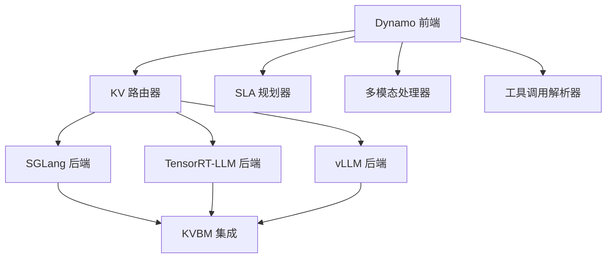
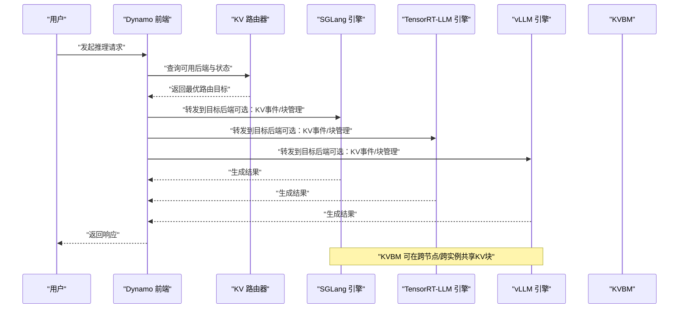
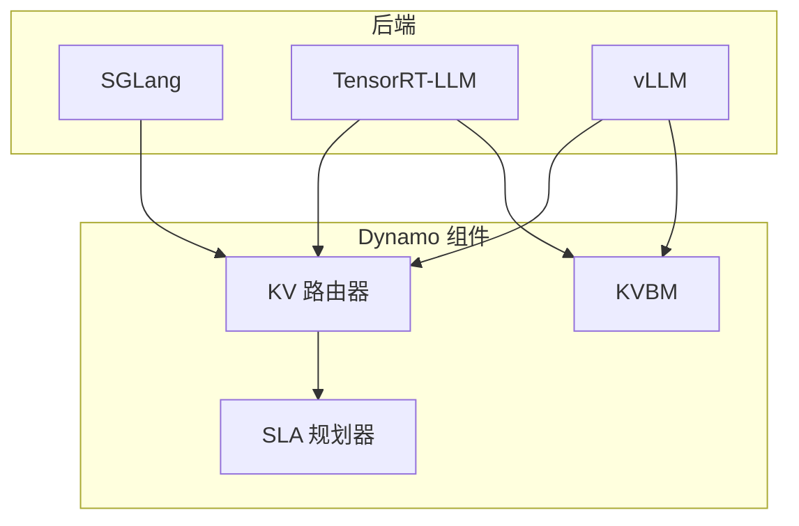
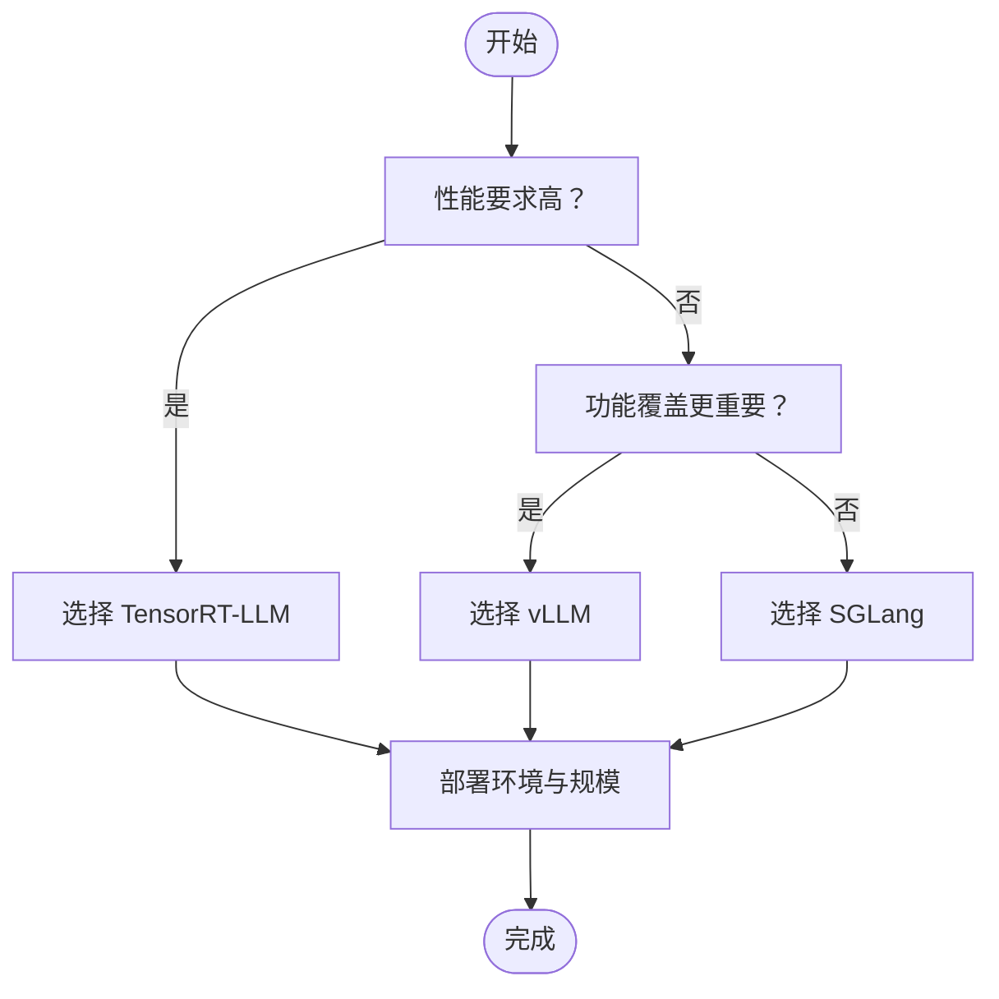

# 多后端支持

<cite>
**本文引用的文件**
- [README.md](file://README.md)
- [feature-matrix.md](file://docs/pages/reference/feature-matrix.md)
- [support-matrix.md](file://docs/pages/reference/support-matrix.md)
- [sglang/README.md](file://docs/pages/backends/sglang/README.md)
- [trtllm/README.md](file://docs/pages/backends/trtllm/README.md)
- [vllm/README.md](file://docs/pages/backends/vllm/README.md)
- [kvbm/README.md](file://docs/pages/components/kvbm/README.md)
- [multimodal/README.md](file://docs/pages/features/multimodal/README.md)
- [tool-calling.md](file://docs/pages/agents/tool-calling.md)
- [router/README.md](file://docs/pages/components/router/README.md)
- [planner-guide.md](file://docs/pages/components/planner/planner-guide.md)
- [sglang/main.py](file://components/src/dynamo/sglang/main.py)
- [trtllm/main.py](file://components/src/dynamo/trtllm/main.py)
- [vllm/main.py](file://components/src/dynamo/vllm/main.py)
</cite>

## 目录
1. [简介](#简介)
2. [项目结构](#项目结构)
3. [核心组件](#核心组件)
4. [架构总览](#架构总览)
5. [详细组件分析](#详细组件分析)
6. [依赖关系分析](#依赖关系分析)
7. [性能考量](#性能考量)
8. [故障排查指南](#故障排查指南)
9. [结论](#结论)
10. [附录](#附录)

## 简介
本文件面向需要在NVIDIA Dynamo平台上进行多后端推理部署的用户，系统性梳理SGLang、TensorRT-LLM、vLLM三大后端引擎在功能覆盖、性能特性、部署形态与运维复杂度方面的差异，并结合Dynamo的分布式能力（如拆分式服务、KV感知路由、SLA规划器、KV块管理器KVBM、多模态、工具调用等）给出选型建议与最佳实践。

## 项目结构
围绕“多后端支持”的主题，仓库中与后端相关的知识主要分布在以下区域：
- 后端文档：docs/pages/backends/{sglang,trtllm,vllm}/README.md
- 功能矩阵：docs/pages/reference/feature-matrix.md
- 支持矩阵：docs/pages/reference/support-matrix.md
- 组件设计：docs/pages/components/{router,kvbm,planner}/README.md
- 多模态：docs/pages/features/multimodal/README.md
- 工具调用：docs/pages/agents/tool-calling.md
- 后端实现入口：components/src/dynamo/{sglang,trtllm,vllm}/main.py

图示来源
- [router/README.md](file://docs/pages/components/router/README.md#L1-L104)
- [kvbm/README.md](file://docs/pages/components/kvbm/README.md#L1-L65)
- [planner-guide.md](file://docs/pages/components/planner/planner-guide.md#L1-L458)
- [multimodal/README.md](file://docs/pages/features/multimodal/README.md#L1-L194)
- [tool-calling.md](file://docs/pages/agents/tool-calling.md#L1-L188)

章节来源
- [README.md](file://README.md#L39-L61)
- [feature-matrix.md](file://docs/pages/reference/feature-matrix.md#L16-L31)

## 核心组件
- 拆分式服务（预填充/解码分离）：三后端均支持，便于最大化吞吐与灵活调度。
- KV感知路由：三后端均支持，通过KV事件与块管理降低重复计算。
- SLA规划器：三后端均支持，基于前端指标自动扩缩容。
- KV块管理器（KVBM）：vLLM与TRT-LLM已集成；SGLang当前未提供。
- 多模态：三后端均支持图像；视频与音频支持程度不同；KV感知路由对图像有效，其他模态暂不支持。
- 工具调用：三后端均支持，需在后端启动时指定解析器。

章节来源
- [feature-matrix.md](file://docs/pages/reference/feature-matrix.md#L18-L31)
- [README.md](file://README.md#L49-L61)
- [router/README.md](file://docs/pages/components/router/README.md#L82-L98)
- [multimodal/README.md](file://docs/pages/features/multimodal/README.md#L18-L37)
- [tool-calling.md](file://docs/pages/agents/tool-calling.md#L13-L30)

## 架构总览
下图展示Dynamo在多后端场景下的典型交互：前端负责接入与路由，后端负责推理执行，KVBM提供跨节点/跨实例的KV块共享与复用，SLA规划器依据指标动态调整资源。

图示来源
- [router/README.md](file://docs/pages/components/router/README.md#L10-L26)
- [kvbm/README.md](file://docs/pages/components/kvbm/README.md#L42-L55)
- [planner-guide.md](file://docs/pages/components/planner/planner-guide.md#L66-L90)

## 详细组件分析

### SGLang 后端
- 特点与优势
  - 高吞吐服务优化，原生参数透传，Arg解析与Dynamo保持一致。
  - 支持拆分式服务、KV感知路由、SLA规划器、多模态（图像）、工具调用。
  - KVBM当前未集成，但可通过KV事件与块管理配合使用。
- 功能矩阵摘要
  - 拆分式服务：✅
  - KV感知路由：✅
  - SLA规划器：✅
  - KVBM：🚧（计划中）
  - 多模态：✅（图像；注意KV感知路由对图像支持有限）
  - 工具调用：✅
  - 请求迁移：✅
  - 请求取消：部分阶段支持（聚合模式完整，拆分模式远程预填充阶段不支持）
- 配置要点
  - 参数透传：大部分SGLang参数可直接传递给dynamo.sglang。
  - 取消策略：拆分模式下远程预填充阶段不支持取消，需在聚合模式或解码阶段使用。
  - 多模态：需按文档启用相应标志位；KV感知路由对图像支持有限。
- 性能与最佳实践
  - 使用聚合模式以获得完整的请求取消能力。
  - 在高并发场景下，结合KV事件与块管理减少重复计算。
  - 对于需要最大吞吐的场景优先考虑SGLang。

章节来源
- [sglang/README.md](file://docs/pages/backends/sglang/README.md#L31-L85)
- [feature-matrix.md](file://docs/pages/reference/feature-matrix.md#L59-L83)
- [sglang/main.py](file://components/src/dynamo/sglang/main.py#L191-L328)

### TensorRT-LLM 后端
- 特点与优势
  - 追求极致性能与优化，KVBM已集成，支持拆分式服务、KV感知路由、SLA规划器、多模态（图像）。
  - 支持WideEP、数据并行注意力路由（DP Rank Routing），在大规模模型上具备优势。
  - 已知问题：在拆分式服务下可能出现缓存耗尽导致死锁，需调整缓存缓冲区配置。
- 功能矩阵摘要
  - 拆分式服务：✅
  - KV感知路由：✅
  - SLA规划器：✅
  - KVBM：✅
  - 多模态：✅（图像；EP/D模式支持传统拆分）
  - 工具调用：✅
  - 请求迁移：✅（部分阶段）
  - 请求取消：部分阶段支持（聚合/拆分模式均支持）
- 配置要点
  - KVBM：通过连接器启用，显著降低TTFT，提升长上下文与多轮对话体验。
  - 缓存缓冲区：当遇到高负载卡死问题时，确保max_tokens_in_buffer大于最大输入序列长度。
  - 多模态：EP/D模式无需Python处理器，由前端直连预填充工作节点。
- 性能与最佳实践
  - 在大规模模型与多节点部署中优先考虑TRT-LLM。
  - 结合KVBM与KV感知路由，优化长会话与高并发场景。
  - 注意已知问题的规避，避免缓存耗尽导致的死锁。

章节来源
- [trtllm/README.md](file://docs/pages/backends/trtllm/README.md#L39-L51)
- [feature-matrix.md](file://docs/pages/reference/feature-matrix.md#L84-L107)
- [trtllm/main.py](file://components/src/dynamo/trtllm/main.py#L29-L43)

### vLLM 后端
- 特点与优势
  - 功能覆盖面最广：拆分式服务、KV感知路由、SLA规划器、KVBM、LMCache、提示嵌入、多模态（图像/视频/音频实验性支持）。
  - 支持外部控制的数据并行（DP）路由，便于在单机或多机环境下扩展。
  - 已集成KV事件与NIXL传输机制，便于KV感知路由与P/D拆分。
- 功能矩阵摘要
  - 拆分式服务：✅
  - KV感知路由：✅
  - SLA规划器：✅
  - KVBM：✅
  - 多模态：✅（图像/视频/音频实验性支持）
  - 工具调用：✅
  - 请求迁移：✅
  - 请求取消：✅
- 配置要点
  - KV事件一致性：使用确定性哈希或设置PYTHONHASHSEED以避免前缀缓存不一致。
  - 提示嵌入：需显式开启相关标志位。
  - 多模态：根据模式选择EPD/E/PD/E/P/D/EP/D，注意不同后端的输入格式支持差异。
- 性能与最佳实践
  - 在需要最广泛功能覆盖与多模态支持时优先选择vLLM。
  - 结合KVBM与KV事件，优化长上下文与高并发场景。
  - 使用LMCache进一步降低重复计算成本。

章节来源
- [vllm/README.md](file://docs/pages/backends/vllm/README.md#L32-L54)
- [feature-matrix.md](file://docs/pages/reference/feature-matrix.md#L33-L57)
- [vllm/main.py](file://components/src/dynamo/vllm/main.py#L535-L674)

### KV感知路由与KVBM
- KV感知路由
  - 通过KV事件与块重叠评估，智能选择最优工作节点，减少重复计算。
  - vLLM/TRT-LLM支持图像多模态路由；SGLang当前不支持图像路由。
- KV块管理器（KVBM）
  - 提供统一内存API，支持本地/主机/远程RDMA/SSD/对象存储等多层级内存。
  - vLLM与TRT-LLM已集成；SGLang暂未集成。
  - 支持聚合与拆分式服务两种部署形态。

章节来源
- [router/README.md](file://docs/pages/components/router/README.md#L82-L98)
- [kvbm/README.md](file://docs/pages/components/kvbm/README.md#L30-L41)

### 工具调用与多模态
- 工具调用
  - 三后端均支持，需在后端启动时指定解析器（如hermes、mistral、llama3_json等）。
  - 若模型模板不支持，可通过自定义Jinja模板解决。
- 多模态
  - 图像：三后端均支持；TRT-LLM支持EP/D（传统拆分）与E/P/D（全拆分，需预计算嵌入）。
  - 视频/音频：vLLM提供视频与音频支持（实验性）；TRT-LLM提供图像与EP/D模式；SGLang提供图像与E/PD/E/P/D模式。

章节来源
- [tool-calling.md](file://docs/pages/agents/tool-calling.md#L13-L30)
- [multimodal/README.md](file://docs/pages/features/multimodal/README.md#L18-L37)

## 依赖关系分析
- 后端与Dynamo组件的耦合
  - 后端通过注册接口向Dynamo报告运行时信息与KV事件，KV路由器据此做路由决策。
  - SLA规划器通过Prometheus指标驱动扩缩容，与后端解耦。
  - KVBM作为独立组件，与vLLM/TRT-LLM通过连接器集成，SGLang暂未集成。
- 后端间差异
  - vLLM功能最全，TRT-LLM性能最强，SGLang吞吐优先且参数透传友好。
  - 多模态与KV感知路由在不同后端的支持范围存在差异。

图示来源
- [feature-matrix.md](file://docs/pages/reference/feature-matrix.md#L18-L31)
- [kvbm/README.md](file://docs/pages/components/kvbm/README.md#L30-L41)

章节来源
- [feature-matrix.md](file://docs/pages/reference/feature-matrix.md#L18-L31)

## 性能考量
- 吞吐与延迟权衡
  - SGLang：高吞吐、低延迟场景优先，适合大规模服务化部署。
  - TensorRT-LLM：极致性能与优化，适合追求最高吞吐与最低延迟的生产环境。
  - vLLM：功能最全，适合需要多模态、工具调用、KVBM等丰富能力的场景。
- KVBM与KV事件
  - 在长会话、高并发、重复内容场景下，KVBM可显著降低TTFT并提升吞吐。
  - KV事件一致性需保证（如确定性哈希），避免前缀缓存不一致。
- 多模态与拆分式服务
  - 多模态拆分式服务（EPD/E/PD/E/P/D/EP/D）可独立扩展编码、预填充与解码阶段，提升整体效率。

章节来源
- [kvbm/README.md](file://docs/pages/components/kvbm/README.md#L17-L29)
- [vllm/README.md](file://docs/pages/backends/vllm/README.md#L173-L183)
- [multimodal/README.md](file://docs/pages/features/multimodal/README.md#L47-L184)

## 故障排查指南
- 请求取消
  - SGLang：拆分模式远程预填充阶段不支持取消；聚合/解码阶段支持。
  - TRT-LLM：聚合/拆分模式均支持取消。
  - vLLM：聚合/拆分模式均支持取消。
- KV事件一致性
  - vLLM：设置PYTHONHASHSEED或启用确定性前缀缓存算法，避免事件ID不一致。
- 已知问题（TRT-LLM）
  - 拆分式服务高负载可能导致缓存耗尽而死锁，需增大max_tokens_in_buffer。
- SLA规划器
  - 确认Prometheus端点可达，检查前端指标暴露是否正常。

章节来源
- [sglang/README.md](file://docs/pages/backends/sglang/README.md#L71-L85)
- [trtllm/README.md](file://docs/pages/backends/trtllm/README.md#L184-L196)
- [vllm/README.md](file://docs/pages/backends/vllm/README.md#L189-L200)
- [router/README.md](file://docs/pages/components/router/README.md#L82-L98)
- [trtllm/README.md](file://docs/pages/backends/trtllm/README.md#L372-L397)

## 结论
- 选型建议
  - 追求极致性能与优化：TensorRT-LLM
  - 需要最广泛功能覆盖（含多模态、工具调用、KVBM）：vLLM
  - 高吞吐服务化与参数透传友好：SGLang
- 决策因素
  - 性能要求：TRT-LLM > vLLM ≈ SGLang（取决于部署拓扑与模型规模）
  - 功能需求：vLLM > TRT-LLM ≈ SGLang（多模态、工具调用、KVBM）
  - 部署环境：Kubernetes/Slurm/裸金属；TRT-LLM在多节点与大规模模型上更具优势；SGLang在参数透传与吞吐方面更友好；vLLM在功能与生态上覆盖最广
- 最佳实践
  - 启用KV感知路由与KVBM，优化长会话与高并发场景
  - 明确多模态模式与输入格式，避免不必要的转换开销
  - 正确配置KV事件一致性与SLA规划器，确保稳定运行

## 附录

### 功能矩阵（后端对比）
- 快速比较（摘自官方矩阵）

| 功能/后端 | vLLM | TensorRT-LLM | SGLang |
| --- | :---: | :---: | :---: |
| 拆分式服务 | ✅ | ✅ | ✅ |
| KV感知路由 | ✅ | ✅ | ✅ |
| SLA规划器 | ✅ | ✅ | ✅ |
| KV块管理器（KVBM） | ✅ | ✅ | 🚧 |
| 多模态（图像） | ✅ | ✅ | ✅ |
| 多模态（视频） | ✅ | 🚧 | ❌ |
| 多模态（音频） | 🚧 | ❌ | ❌ |
| 请求迁移 | ✅ | 🚧 | ✅ |
| 请求取消 | ✅ | ✅ | 🚧 |
| LoRA | ✅ | ❌ | ❌ |
| 工具调用 | ✅ | ✅ | ✅ |
| 推测式解码 | ✅ | ✅ | 🚧 |

章节来源
- [feature-matrix.md](file://docs/pages/reference/feature-matrix.md#L16-L31)
- [feature-matrix.md](file://docs/pages/reference/feature-matrix.md#L33-L57)
- [feature-matrix.md](file://docs/pages/reference/feature-matrix.md#L59-L83)
- [feature-matrix.md](file://docs/pages/reference/feature-matrix.md#L84-L107)

### 后端选择决策流程（概念图）

说明：该图为概念流程，用于帮助用户快速定位选型方向，不对应具体源码文件。