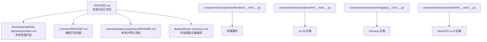
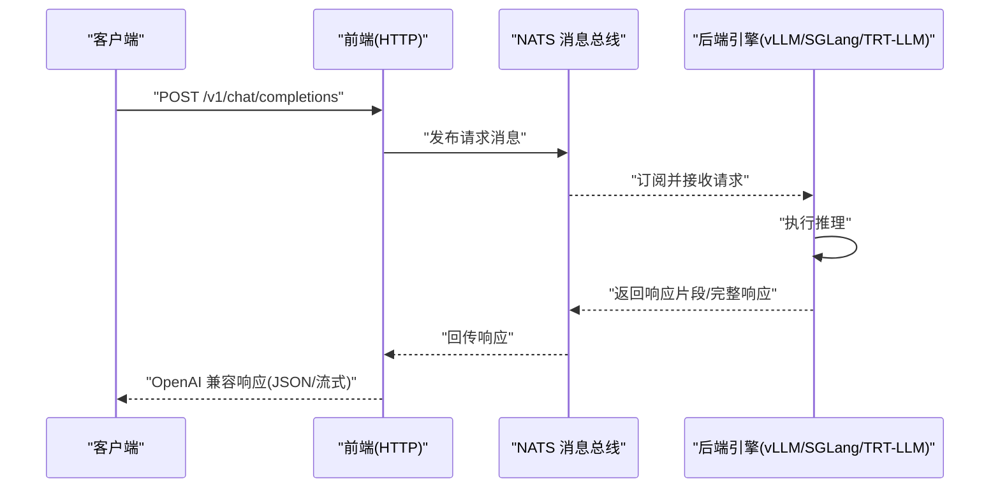
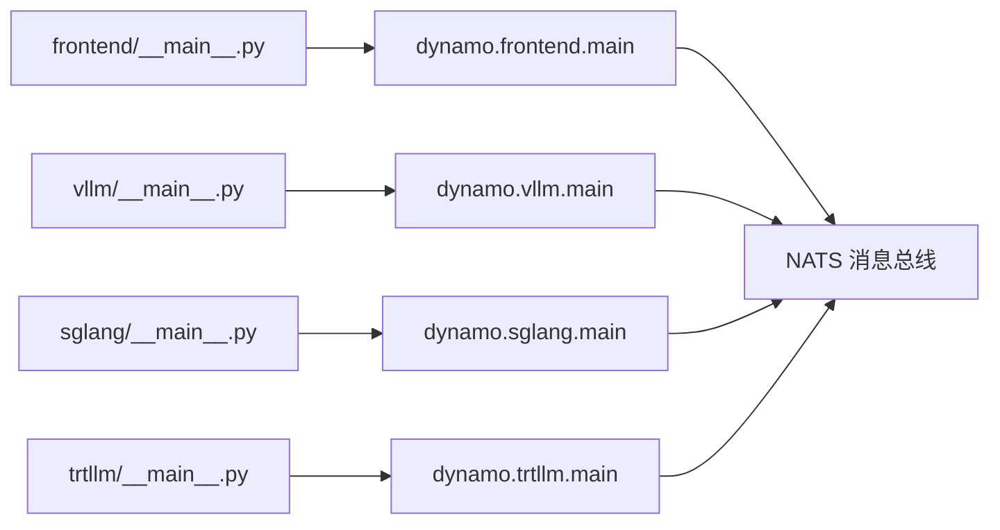

# 快速开始

<cite>
**本文引用的文件**
- [README.md](file://README.md)
- [docs/pages/getting-started/quickstart.md](file://docs/pages/getting-started/quickstart.md)
- [container/README.md](file://container/README.md)
- [examples/basics/quickstart/README.md](file://examples/basics/quickstart/README.md)
- [deploy/docker-compose.yml](file://deploy/docker-compose.yml)
- [components/src/dynamo/frontend/__main__.py](file://components/src/dynamo/frontend/__main__.py)
- [components/src/dynamo/vllm/__main__.py](file://components/src/dynamo/vllm/__main__.py)
- [components/src/dynamo/sglang/__main__.py](file://components/src/dynamo/sglang/__main__.py)
- [components/src/dynamo/trtllm/__main__.py](file://components/src/dynamo/trtllm/__main__.py)
</cite>

## 目录
1. [简介](#简介)
2. [项目结构](#项目结构)
3. [核心组件](#核心组件)
4. [架构总览](#架构总览)
5. [详细组件分析](#详细组件分析)
6. [依赖关系分析](#依赖关系分析)
7. [性能注意事项](#性能注意事项)
8. [故障排除指南](#故障排除指南)
9. [结论](#结论)
10. [附录](#附录)

## 简介
本指南面向首次接触 NVIDIA Dynamo 的用户，帮助你在 5–10 分钟内完成本地部署并成功运行第一个推理实例。你将学习三种安装方式：容器化安装（推荐用于本地开发）、从 PyPI 安装、从源码构建；并掌握如何启动前端服务、启动工作进程、发送测试请求；同时了解 OpenAI 兼容 API 的使用方法（聊天补全与流式响应），以及关键配置参数的作用与调优建议。

## 项目结构
Dynamo 提供多种安装与运行路径，核心目录与文件如下：
- 根级安装与运行说明：README.md、docs/pages/getting-started/quickstart.md
- 容器开发与运行指南：container/README.md
- 本地快速入门示例：examples/basics/quickstart/README.md
- 本地基础设施编排：deploy/docker-compose.yml
- 组件入口脚本：components/src/dynamo/frontend/__main__.py、components/src/dynamo/vllm/__main__.py、components/src/dynamo/sglang/__main__.py、components/src/dynamo/trtllm/__main__.py

**图示来源**
- [README.md](file://README.md#L77-L197)
- [docs/pages/getting-started/quickstart.md](file://docs/pages/getting-started/quickstart.md#L14-L151)
- [container/README.md](file://container/README.md#L1-L479)
- [examples/basics/quickstart/README.md](file://examples/basics/quickstart/README.md#L1-L162)
- [deploy/docker-compose.yml](file://deploy/docker-compose.yml#L1-L36)
- [components/src/dynamo/frontend/__main__.py](file://components/src/dynamo/frontend/__main__.py#L1-L8)
- [components/src/dynamo/vllm/__main__.py](file://components/src/dynamo/vllm/__main__.py#L1-L13)
- [components/src/dynamo/sglang/__main__.py](file://components/src/dynamo/sglang/__main__.py#L1-L13)
- [components/src/dynamo/trtllm/__main__.py](file://components/src/dynamo/trtllm/__main__.py#L1-L13)

**章节来源**
- [README.md](file://README.md#L77-L197)
- [docs/pages/getting-started/quickstart.md](file://docs/pages/getting-started/quickstart.md#L14-L151)
- [container/README.md](file://container/README.md#L1-L479)
- [examples/basics/quickstart/README.md](file://examples/basics/quickstart/README.md#L1-L162)
- [deploy/docker-compose.yml](file://deploy/docker-compose.yml#L1-L36)
- [components/src/dynamo/frontend/__main__.py](file://components/src/dynamo/frontend/__main__.py#L1-L8)
- [components/src/dynamo/vllm/__main__.py](file://components/src/dynamo/vllm/__main__.py#L1-L13)
- [components/src/dynamo/sglang/__main__.py](file://components/src/dynamo/sglang/__main__.py#L1-L13)
- [components/src/dynamo/trtllm/__main__.py](file://components/src/dynamo/trtllm/__main__.py#L1-L13)

## 核心组件
- 前端服务（OpenAI 兼容 HTTP API 网关）：负责接收 HTTP 请求、路由到后端引擎，并返回 OpenAI 风格的响应。
- 路由器（基础与 KV-Aware）：根据模型与负载情况将请求分发到合适的后端工作进程。
- 工作进程（后端引擎）：支持 vLLM、SGLang、TensorRT-LLM，作为实际执行推理的计算单元。
- 本地基础设施（可选）：etcd（服务发现）、NATS（消息总线）。

**章节来源**
- [README.md](file://README.md#L159-L164)
- [examples/basics/quickstart/README.md](file://examples/basics/quickstart/README.md#L18-L34)

## 架构总览
下图展示了本地快速开始中的典型请求流：客户端通过前端 HTTP 接口发起请求，前端经由 NATS 将请求投递到后端引擎，引擎执行推理并将结果回传至前端，最终以 OpenAI 兼容格式返回。

**图示来源**
- [examples/basics/quickstart/README.md](file://examples/basics/quickstart/README.md#L23-L34)
- [examples/basics/quickstart/README.md](file://examples/basics/quickstart/README.md#L144-L152)

**章节来源**
- [examples/basics/quickstart/README.md](file://examples/basics/quickstart/README.md#L23-L34)
- [examples/basics/quickstart/README.md](file://examples/basics/quickstart/README.md#L144-L152)

## 详细组件分析

### 安装方式一：容器化安装（推荐用于本地开发）
- 适用场景：本地单机/VM 开发与验证，无需手动安装系统依赖。
- 可用镜像版本与后端选择：见“发行制品”链接与容器镜像列表。
- 运行方式：使用宿主机网络模式，便于端口暴露与服务互通。
- 建议：在容器内分别启动前端与后端，或使用后台运行模式。

安装与运行要点
- 使用预构建容器镜像启动后端（任选其一）：SGLang、TensorRT-LLM、vLLM。
- 在同一容器中运行前端与后端时，可通过后台运行或 docker exec 打开第二终端。
- 如需在单终端后台运行，可参考“可选提示”中的后台运行方式。

**章节来源**
- [README.md](file://README.md#L94-L111)
- [docs/pages/getting-started/quickstart.md](file://docs/pages/getting-started/quickstart.md#L16-L41)

### 安装方式二：从 PyPI 安装
- 依赖管理：推荐使用 uv 创建虚拟环境并安装依赖。
- 系统依赖：不同后端需要不同的系统包（如 python3-dev、libxcb1 等）。
- 后端选择与安装命令：
  - SGLang：安装 ai-dynamo[sglang]，CUDA 13 场景建议使用容器。
  - TensorRT-LLM：安装 ai-dynamo[trtllm]，注意依赖限制，建议使用容器。
  - vLLM：安装 ai-dynamo[vllm]。
- 安装前准备：可先运行部署自检脚本以验证环境。

**章节来源**
- [README.md](file://README.md#L113-L154)
- [docs/pages/getting-started/quickstart.md](file://docs/pages/getting-started/quickstart.md#L42-L90)

### 安装方式三：从源码构建
- 系统要求：Ubuntu 或 macOS（含 Xcode、CMake、Protobuf 等工具）。
- Rust 工具链：安装 rustup 并初始化。
- Python 环境：使用 uv 创建并激活虚拟环境。
- 构建步骤：
  - 构建 Rust 绑定（maturin develop）。
  - 安装 GPU 内存服务（C++ 扩展）。
  - 安装 Dynamo 轮子（可编辑安装）。
- 运行前端：启动 OpenAI 兼容前端。
- 本地开发配置：使用 --store-kv file 避免外部依赖；通过 DYN_LOG 调整日志级别。

**章节来源**
- [README.md](file://README.md#L243-L342)
- [docs/pages/getting-started/quickstart.md](file://docs/pages/getting-started/quickstart.md#L90-L102)

### 本地部署示例：启动前端、启动工作进程、发送测试请求
- 启动前端（默认端口 8000，使用文件存储 KV 以避免 etcd）：
  - 前端入口脚本位于 components/src/dynamo/frontend/__main__.py。
- 启动工作进程（任选其一）：
  - vLLM：入口脚本 components/src/dynamo/vllm/__main__.py。
  - SGLang：入口脚本 components/src/dynamo/sglang/__main__.py。
  - TensorRT-LLM：入口脚本 components/src/dynamo/trtllm/__main__.py。
- 发送测试请求：使用 curl 访问 /v1/chat/completions，支持非流式与流式两种模式。

本地基础设施（可选）
- 若未使用容器或 Kubernetes，可在本地通过 docker compose 启动 etcd 与 NATS，用于服务发现与消息通信。

**章节来源**
- [README.md](file://README.md#L155-L215)
- [docs/pages/getting-started/quickstart.md](file://docs/pages/getting-started/quickstart.md#L90-L151)
- [examples/basics/quickstart/README.md](file://examples/basics/quickstart/README.md#L36-L106)
- [deploy/docker-compose.yml](file://deploy/docker-compose.yml#L1-L36)
- [components/src/dynamo/frontend/__main__.py](file://components/src/dynamo/frontend/__main__.py#L1-L8)
- [components/src/dynamo/vllm/__main__.py](file://components/src/dynamo/vllm/__main__.py#L1-L13)
- [components/src/dynamo/sglang/__main__.py](file://components/src/dynamo/sglang/__main__.py#L1-L13)
- [components/src/dynamo/trtllm/__main__.py](file://components/src/dynamo/trtllm/__main__.py#L1-L13)

### OpenAI 兼容 API 使用示例
- 路径：/v1/chat/completions
- 支持功能：聊天补全、流式响应（stream=true）。
- 示例请求：包含 model、messages、max_tokens 等字段。
- 流式输出：使用 curl -N 并将 stream 设为 true，即可实时接收响应片段。

**章节来源**
- [README.md](file://README.md#L198-L215)
- [docs/pages/getting-started/quickstart.md](file://docs/pages/getting-started/quickstart.md#L142-L151)
- [examples/basics/quickstart/README.md](file://examples/basics/quickstart/README.md#L74-L85)

### 关键配置参数与调优建议
- 存储与服务发现
  - --store-kv file：本地开发时避免 etcd，适合单机/容器环境。
  - NATS：用于 KV-Aware 路由与跨节点协调；本地可使用 docker compose 启动。
- 日志级别
  - DYN_LOG：设置日志级别（与 RUST_LOG 语法一致），便于调试与定位问题。
- 后端内存与并发
  - vLLM：gpu-memory-utilization、max-num-seqs、enable-prefix-caching 等。
  - SGLang：mem-fraction-static、max-running-requests 等。
  - TensorRT-LLM：free-gpu-memory-fraction、max-num-tokens、max-batch-size 等。
- 端口与网络
  - host 网络模式：最大化网络性能，但端口与宿主机共享。
  - bridge 网络模式：隔离性强，可通过 -p 显式映射端口。

**章节来源**
- [README.md](file://README.md#L336-L380)
- [container/README.md](file://container/README.md#L340-L418)
- [container/README.md](file://container/README.md#L475-L479)

## 依赖关系分析
- 组件入口脚本统一委托到各模块主程序，形成清晰的职责边界。
- 前端与后端通过 NATS 进行异步消息传递，实现解耦与横向扩展。
- 本地开发可使用 docker compose 启动 etcd 与 NATS，简化依赖管理。

**图示来源**
- [components/src/dynamo/frontend/__main__.py](file://components/src/dynamo/frontend/__main__.py#L1-L8)
- [components/src/dynamo/vllm/__main__.py](file://components/src/dynamo/vllm/__main__.py#L1-L13)
- [components/src/dynamo/sglang/__main__.py](file://components/src/dynamo/sglang/__main__.py#L1-L13)
- [components/src/dynamo/trtllm/__main__.py](file://components/src/dynamo/trtllm/__main__.py#L1-L13)

**章节来源**
- [components/src/dynamo/frontend/__main__.py](file://components/src/dynamo/frontend/__main__.py#L1-L8)
- [components/src/dynamo/vllm/__main__.py](file://components/src/dynamo/vllm/__main__.py#L1-L13)
- [components/src/dynamo/sglang/__main__.py](file://components/src/dynamo/sglang/__main__.py#L1-L13)
- [components/src/dynamo/trtllm/__main__.py](file://components/src/dynamo/trtllm/__main__.py#L1-L13)

## 性能注意事项
- 网络模式：本地开发优先使用 host 网络以获得最佳吞吐与低延迟。
- 内存与并发：根据 GPU 显存与任务特征调整后端内存利用率与并发上限。
- 前缀缓存：在需要 KV-Aware 路由时启用前缀缓存，提升多轮对话性能。
- 日志级别：生产环境建议降低日志级别，减少 I/O 影响。

[本节为通用指导，不直接分析具体文件]

## 故障排除指南
- 无法连接 NATS/etcd
  - 本地开发时可使用 docker compose 启动所需服务；确认端口映射与防火墙策略。
- TensorRT-LLM 下载警告
  - “无法连接 ModelExpress 服务器/传输错误”的提示可忽略，不影响推理。
- 端口冲突
  - host 网络模式下多个服务共享宿主机端口，仅允许单一实例运行相关服务。
- 无网络访问
  - --network none 会完全隔离网络，导致模型下载与外部 API 不可用；请改用 bridge 或 host 模式。
- 日志定位
  - 设置 DYN_LOG 调整日志级别，结合后端日志定位问题。

**章节来源**
- [README.md](file://README.md#L194-L196)
- [README.md](file://README.md#L373-L380)
- [container/README.md](file://container/README.md#L340-L418)
- [container/README.md](file://container/README.md#L371-L389)

## 结论
通过本指南，你已掌握三种安装方式、本地部署流程、OpenAI 兼容 API 的使用方法以及关键参数的调优建议。建议优先采用容器化安装进行本地开发与验证，再根据场景迁移到 Kubernetes 生产部署。

[本节为总结性内容，不直接分析具体文件]

## 附录

### A. 三种安装方式对比与选择建议
- 容器化安装（推荐本地开发）
  - 优点：零依赖、一致性高、便于端口与网络管理。
  - 适用：单机/VM、快速验证、演示。
- 从 PyPI 安装
  - 优点：轻量、可控性强。
  - 注意：需满足系统依赖与后端特定要求。
- 从源码构建
  - 优点：可参与贡献与深度定制。
  - 注意：构建工具链复杂度较高。

**章节来源**
- [README.md](file://README.md#L94-L154)
- [docs/pages/getting-started/quickstart.md](file://docs/pages/getting-started/quickstart.md#L16-L90)
- [README.md](file://README.md#L243-L342)

### B. 本地基础设施编排（可选）
- 使用 docker compose 启动 etcd 与 NATS，便于本地开发与多组件联调。
- 可按需关闭与清理，避免资源占用。

**章节来源**
- [deploy/docker-compose.yml](file://deploy/docker-compose.yml#L1-L36)
- [examples/basics/quickstart/README.md](file://examples/basics/quickstart/README.md#L87-L106)