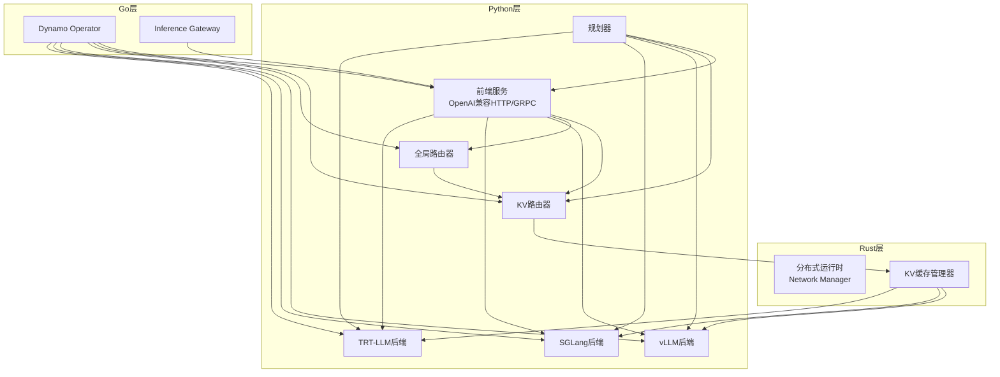
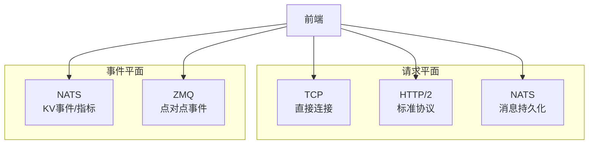
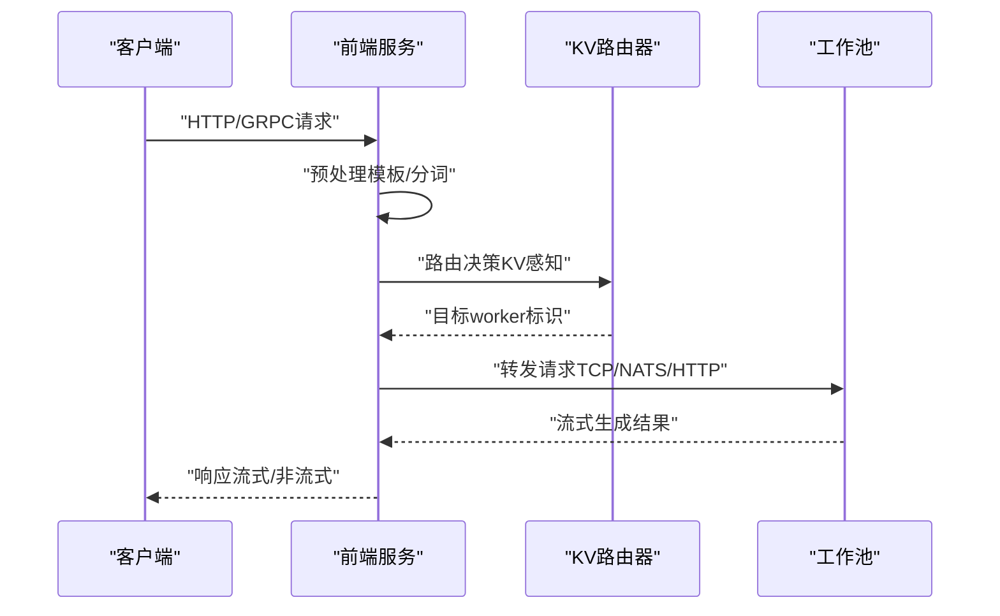
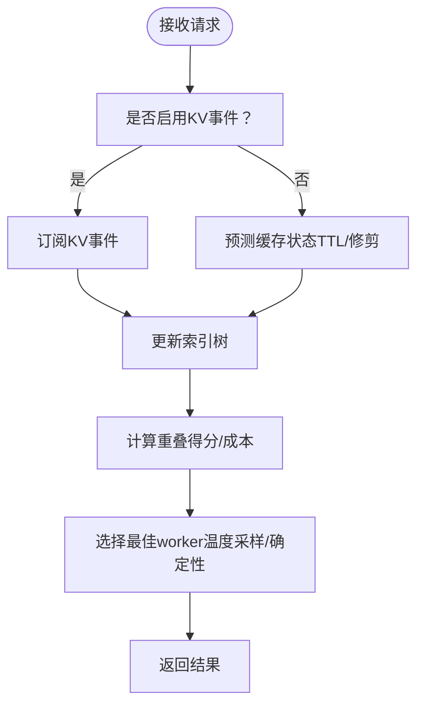
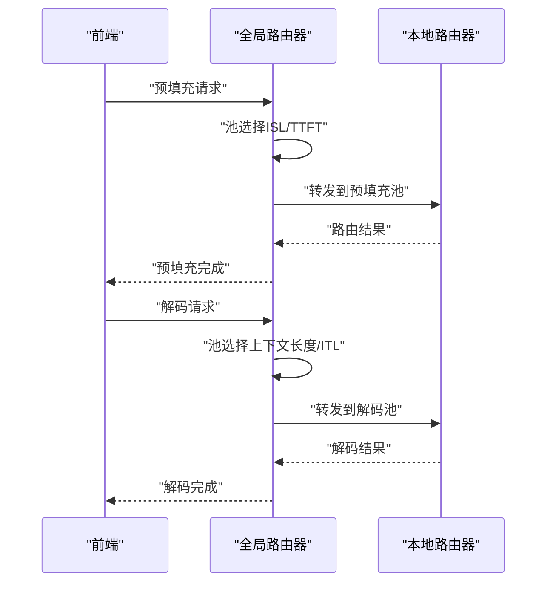
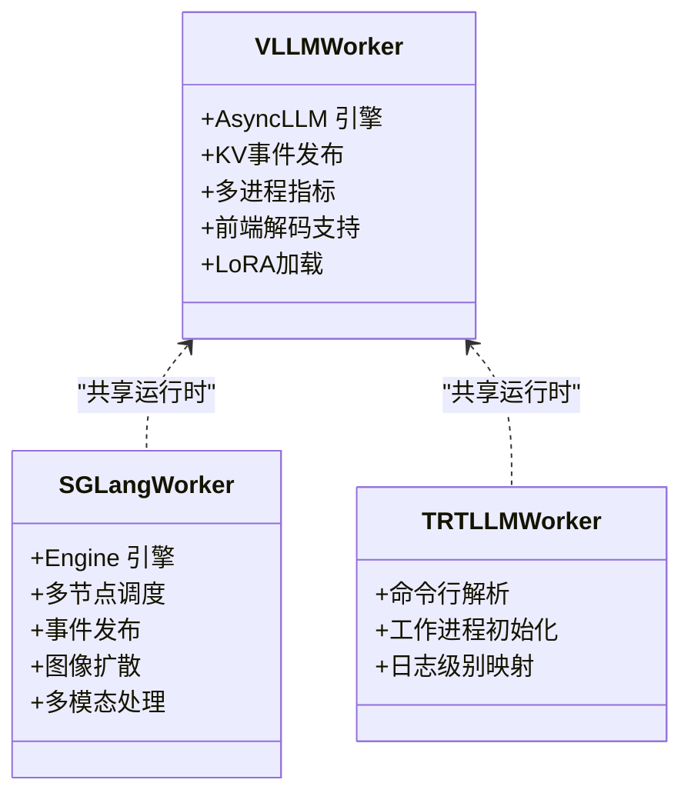
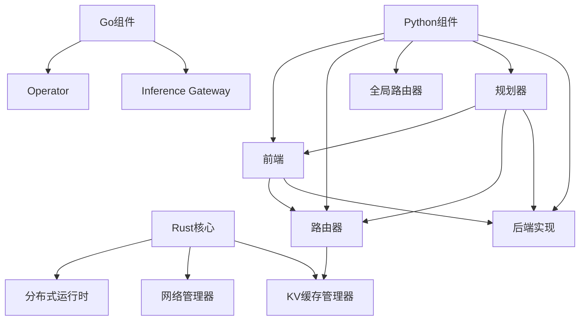

# 技术架构概览

<cite>
**本文档引用的文件**
- [README.md](file://README.md)
- [Cargo.toml](file://Cargo.toml)
- [pyproject.toml](file://pyproject.toml)
- [frontend/main.py](file://components/src/dynamo/frontend/main.py)
- [router/__main__.py](file://components/src/dynamo/router/__main__.py)
- [global_router/__main__.py](file://components/src/dynamo/global_router/__main__.py)
- [sglang/main.py](file://components/src/dynamo/sglang/main.py)
- [trtllm/main.py](file://components/src/dynamo/trtllm/main.py)
- [vllm/main.py](file://components/src/dynamo/vllm/main.py)
- [architecture.md](file://docs/pages/design-docs/architecture.md)
- [discovery-plane.md](file://docs/pages/design-docs/discovery-plane.md)
- [event-plane.md](file://docs/pages/design-docs/event-plane.md)
- [request-plane.md](file://docs/pages/design-docs/request-plane.md)
- [router/README.md](file://docs/pages/components/router/README.md)
</cite>

## 目录
1. [简介](#简介)
2. [项目结构](#项目结构)
3. [核心组件](#核心组件)
4. [架构总览](#架构总览)
5. [详细组件分析](#详细组件分析)
6. [依赖关系分析](#依赖关系分析)
7. [性能考量](#性能考量)
8. [故障排查指南](#故障排查指南)
9. [结论](#结论)

## 简介
本文件面向NVIDIA Dynamo分布式推理系统，提供多语言混合架构（Rust+Python+Go）的全面技术架构概览。文档聚焦以下目标：
- 解释多语言混合架构的设计理念与实现方式
- 描述核心组件之间的关系与数据流
- 阐述架构设计原则、组件边界划分、通信机制
- 说明服务发现与事件传播机制
- 给出前端服务、路由器、规划器、工作池、KV缓存管理器等核心组件的职责与协作方式
- 解释分布式推理的工作原理、负载均衡策略与容错机制
- 提供架构图与组件交互图，帮助初学者建立理解框架，同时为有经验的开发者提供深入的技术洞察

## 项目结构
Dynamo采用“Rust高性能内核 + Python高扩展性 + Go基础设施”的混合架构：
- Rust层：构建高性能运行时（分布式运行时、网络管理、请求/事件平面抽象）
- Python层：实现业务逻辑与可插拔后端（vLLM、SGLang、TRT-LLM），以及前端、路由器、全局路由器、规划器等组件
- Go层：用于平台与基础设施组件（如operator、网关等）

图表来源
- [architecture.md](file://docs/pages/design-docs/architecture.md#L40-L56)
- [Cargo.toml](file://Cargo.toml#L4-L35)
- [pyproject.toml](file://pyproject.toml#L4-L29)

章节来源
- [README.md](file://README.md#L31-L69)
- [architecture.md](file://docs/pages/design-docs/architecture.md#L6-L56)
- [Cargo.toml](file://Cargo.toml#L4-L35)
- [pyproject.toml](file://pyproject.toml#L4-L29)

## 核心组件
- 前端服务（Frontend）
  - 职责：提供OpenAI兼容HTTP/GRPC接口；预处理（提示模板、分词）；路由选择（轮询、随机、KV感知）
  - 关键特性：支持TLS、KServe gRPC、指标前缀配置、请求迁移限制
- 路由器（Router）
  - 职责：基于KV缓存重叠度进行智能路由；支持预测模式（无事件）、副本同步、快照阈值、活跃块跟踪
  - 关键特性：温度参数控制随机性；支持多事件线程并发索引树
- 全局路由器（Global Router）
  - 职责：在多池拓扑中进行层次化路由（按ISL/TTFT选择预填充池，按上下文长度/ITL选择解码池）
  - 关键特性：注册为预填充与解码双工worker；网格化池选择策略
- 工作池（Workers）
  - vLLM：异步LLM引擎、KV事件发布、多进程Prometheus指标、前端解码支持
  - SGLang：多节点调度、非领导节点仅发布事件、图像扩散、多模态编码/解码
  - TRT-LLM：命令行解析、工作进程初始化、日志级别映射
- 规划器（Planner）
  - 职责：SLA驱动的部署规划与动态调度；与事件平面协同进行零停机调整
- KV缓存管理器（KVBM）
  - 职责：跨内存层级（HBM、DDR、SSD、对象存储）的KV缓存离线与回收；加速数据传输与减少TTFT
- 服务发现与事件平面
  - 发现平面：etcd/Kubernetes CRD；租约保活自动清理
  - 事件平面：NATS/ZMQ；KV缓存事件、负载指标、序列跟踪

章节来源
- [frontend/main.py](file://components/src/dynamo/frontend/main.py#L1-L518)
- [router/__main__.py](file://components/src/dynamo/router/__main__.py#L1-L359)
- [global_router/__main__.py](file://components/src/dynamo/global_router/__main__.py#L1-L180)
- [vllm/main.py](file://components/src/dynamo/vllm/main.py#L1-L800)
- [sglang/main.py](file://components/src/dynamo/sglang/main.py#L1-L888)
- [trtllm/main.py](file://components/src/dynamo/trtllm/main.py#L1-L51)
- [architecture.md](file://docs/pages/design-docs/architecture.md#L40-L56)
- [discovery-plane.md](file://docs/pages/design-docs/discovery-plane.md#L6-L134)
- [event-plane.md](file://docs/pages/design-docs/event-plane.md#L6-L140)

## 架构总览
Dynamo通过“请求平面”和“事件平面”两条独立通信通道实现低延迟与高可用：
- 请求平面：支持TCP（默认）、HTTP、NATS三种模式，适配不同部署场景与调试需求
- 事件平面：支持NATS（默认）与ZMQ，用于KV缓存事件、负载指标与序列跟踪

图表来源
- [request-plane.md](file://docs/pages/design-docs/request-plane.md#L10-L43)
- [event-plane.md](file://docs/pages/design-docs/event-plane.md#L10-L42)

章节来源
- [request-plane.md](file://docs/pages/design-docs/request-plane.md#L6-L295)
- [event-plane.md](file://docs/pages/design-docs/event-plane.md#L6-L140)

## 详细组件分析

### 前端服务（Frontend）
- 设计要点
  - 使用DistributedRuntime统一管理请求/事件平面与KV存储
  - 支持多种路由模式：轮询、随机、KV感知
  - KV感知路由支持：事件订阅、副本同步、快照阈值、活跃块跟踪、输出块跟踪
- 数据流
  - 接收HTTP/GRPC请求 → 预处理（模板、分词）→ 路由决策（KV或普通）→ 发送到工作池 → 流式返回结果
- 关键参数
  - 路由模式、KV事件开关、温度、块大小、迁移限制、活跃块/令牌阈值

图表来源
- [frontend/main.py](file://components/src/dynamo/frontend/main.py#L368-L518)
- [request-plane.md](file://docs/pages/design-docs/request-plane.md#L195-L220)

章节来源
- [frontend/main.py](file://components/src/dynamo/frontend/main.py#L1-L518)
- [router/README.md](file://docs/pages/components/router/README.md#L10-L37)

### 路由器（Router）
- 设计要点
  - 基于KV缓存重叠度评估计算成本（解码活跃块 + 预填充新块）
  - 支持预测模式（无事件）与真实事件模式（NATS/ZMQ）
  - 多线程并发索引树提升吞吐
- 数据流
  - 订阅KV事件 → 维护全局索引树 → 选择最佳worker → 返回worker输出

图表来源
- [router/__main__.py](file://components/src/dynamo/router/__main__.py#L156-L267)
- [event-plane.md](file://docs/pages/design-docs/event-plane.md#L10-L42)

章节来源
- [router/__main__.py](file://components/src/dynamo/router/__main__.py#L1-L359)
- [event-plane.md](file://docs/pages/design-docs/event-plane.md#L6-L140)

### 全局路由器（Global Router）
- 设计要点
  - 层次化路由：预填充按ISL/TTFT，解码按上下文长度/ITL
  - 注册为预填充与解码双worker，内部连接本地路由器
- 数据流
  - 接收前端请求 → 判断阶段（预填充/解码）→ 池选择 → 转发到本地路由器

图表来源
- [global_router/__main__.py](file://components/src/dynamo/global_router/__main__.py#L91-L180)

章节来源
- [global_router/__main__.py](file://components/src/dynamo/global_router/__main__.py#L1-L180)

### 工作池（Workers）
- vLLM
  - 异步LLM引擎、KV事件发布（ZMQ/NATS JetStream）、多进程Prometheus指标
  - 支持前端解码、LoRA加载、检查点模式、多模态处理
- SGLang
  - 多节点调度、非领导节点仅发布事件、图像扩散、多模态编码/解码
- TRT-LLM
  - 命令行解析、工作进程初始化、日志级别映射

图表来源
- [vllm/main.py](file://components/src/dynamo/vllm/main.py#L1-L800)
- [sglang/main.py](file://components/src/dynamo/sglang/main.py#L1-L888)
- [trtllm/main.py](file://components/src/dynamo/trtllm/main.py#L1-L51)

章节来源
- [vllm/main.py](file://components/src/dynamo/vllm/main.py#L1-L800)
- [sglang/main.py](file://components/src/dynamo/sglang/main.py#L1-L888)
- [trtllm/main.py](file://components/src/dynamo/trtllm/main.py#L1-L51)

### 规划器（Planner）
- 设计要点
  - SLA驱动的部署规划与动态调度
  - 通过事件平面捕获信号（请求量、长输入序列）进行零停机扩缩容
- 数据流
  - 监听事件 → 分析负载趋势 → 生成调度决策 → 更新部署配置

章节来源
- [architecture.md](file://docs/pages/design-docs/architecture.md#L52-L56)

### KV缓存管理器（KVBM）
- 设计要点
  - 跨内存层级（HBM、CPU内存、SSD、对象存储）的KV缓存离线与回收
  - 加速数据传输（NIXL）以减少TTFT并提升吞吐
- 数据流
  - 缓存命中/未命中判断 → 选择最优存储层级 → 传输/回收策略执行

章节来源
- [architecture.md](file://docs/pages/design-docs/architecture.md#L80-L89)

## 依赖关系分析
- 语言与模块分工
  - Rust：分布式运行时、网络管理、请求/事件平面抽象、KVBM核心
  - Python：前端、路由器、全局路由器、规划器、各后端实现
  - Go：平台组件（operator、网关等）
- 外部依赖
  - NATS（事件平面）、etcd（服务发现）、ZMQ（事件平面备选）
  - 后端依赖：vLLM、SGLang、TRT-LLM及其相关生态

图表来源
- [Cargo.toml](file://Cargo.toml#L48-L58)
- [pyproject.toml](file://pyproject.toml#L50-L69)

章节来源
- [Cargo.toml](file://Cargo.toml#L48-L133)
- [pyproject.toml](file://pyproject.toml#L50-L69)

## 性能考量
- 请求平面选择
  - TCP：最低延迟，适合直接服务间通信
  - HTTP：便于调试与标准工具观测
  - NATS：需要持久化与消息回放能力
- 事件平面选择
  - NATS：默认，支持JetStream持久化与副本同步
  - ZMQ：无需外部服务器，动态发现与连接
- KV感知路由
  - 启用真实事件可获得更准确的缓存状态，降低TTFT与平均延迟
  - 无事件模式通过TTL与修剪维持近似状态，避免外部依赖
- 指标与监控
  - 多进程Prometheus指标收集，支持vLLM与KVBM指标统一采集

章节来源
- [request-plane.md](file://docs/pages/design-docs/request-plane.md#L281-L295)
- [event-plane.md](file://docs/pages/design-docs/event-plane.md#L102-L140)
- [vllm/main.py](file://components/src/dynamo/vllm/main.py#L193-L281)

## 故障排查指南
- 服务发现问题
  - Kubernetes：确认Operator已注入DYN_DISCOVERY_BACKEND=kubernetes
  - etcd：检查ETCD_ENDPOINTS、认证与CA配置；关注租约TTL与心跳
- 事件平面问题
  - NATS：确认NATS_SERVER可达；JetStream持久化需正确配置
  - ZMQ：确认端口绑定与动态发现；订阅者自动连接/断开
- 请求平面问题
  - NATS：注意16MB载荷限制；考虑切换TCP/HTTP
  - TCP/HTTP：检查主机/端口配置与防火墙策略
- 路由器问题
  - KV事件未启用时，确认预测模式参数（TTL、最大树大小、修剪比例）
  - 多副本同步：启用router_replica_sync并确保事件平面一致性

章节来源
- [discovery-plane.md](file://docs/pages/design-docs/discovery-plane.md#L13-L134)
- [event-plane.md](file://docs/pages/design-docs/event-plane.md#L61-L140)
- [request-plane.md](file://docs/pages/design-docs/request-plane.md#L252-L280)
- [frontend/main.py](file://components/src/dynamo/frontend/main.py#L404-L418)

## 结论
Dynamo通过“Rust高性能内核 + Python高扩展性 + Go基础设施”的多语言混合架构，在分布式推理场景下实现了高性能、低延迟与强可运维性。其核心优势包括：
- KV感知路由显著降低TTFT与平均延迟
- 可插拔后端（vLLM/SGLang/TRT-LLM）满足多样化部署需求
- 独立的请求/事件平面提供灵活的部署与调试能力
- 规划器与KVBM协同实现SLA驱动的动态调度与跨层级缓存优化

该架构既适合初学者快速上手，也为高级用户提供了深入定制与优化的空间。