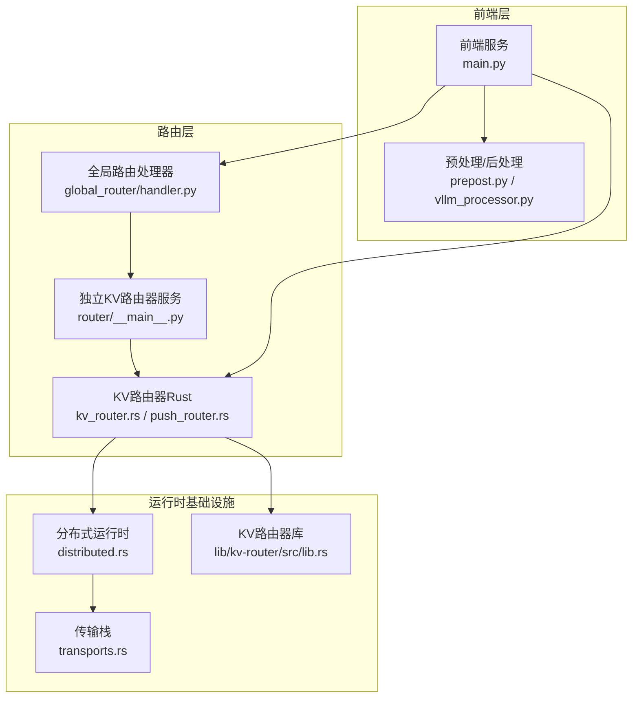
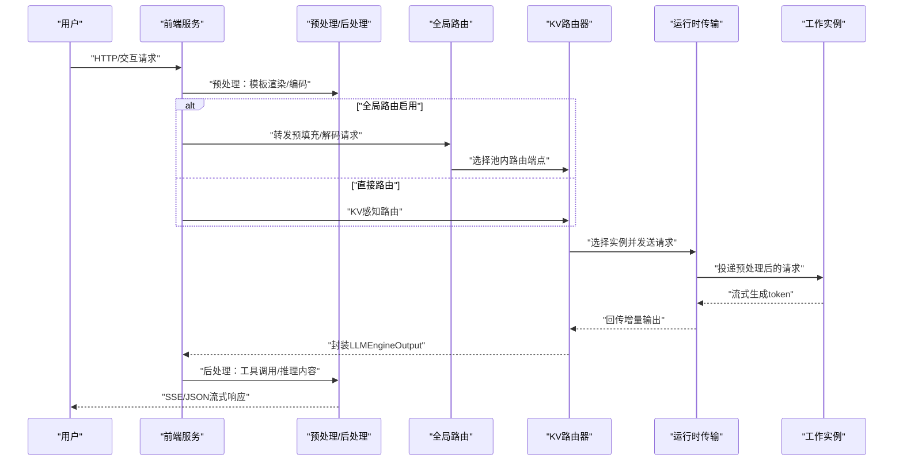
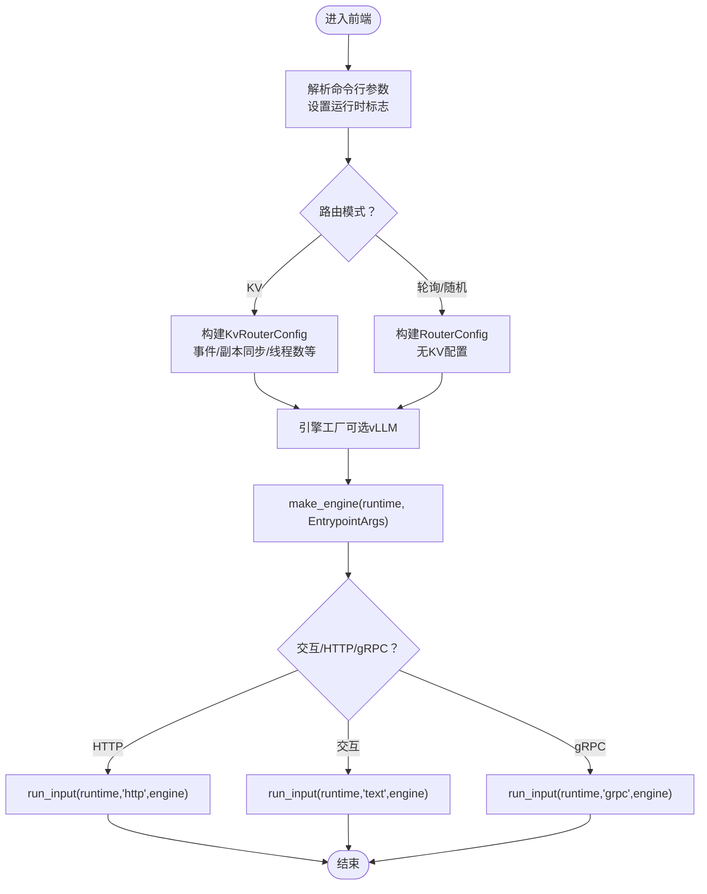
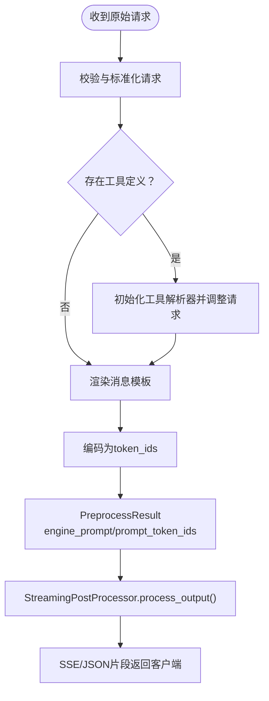
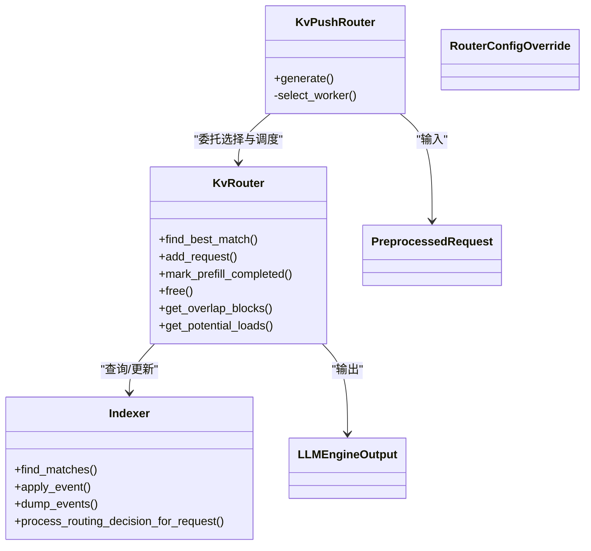
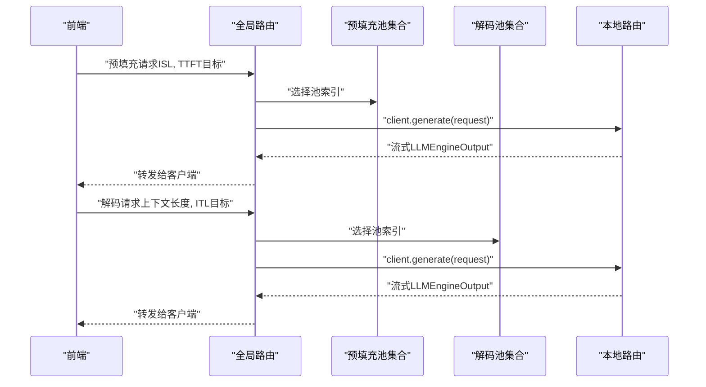
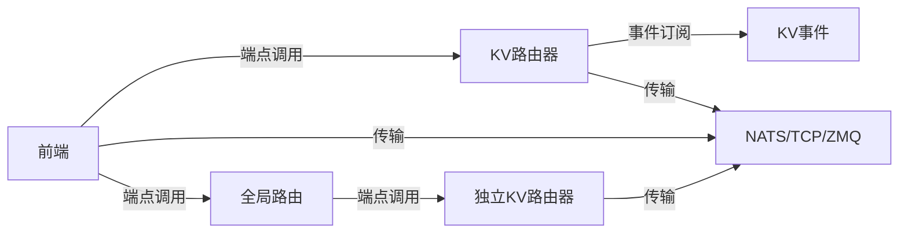

# 数据流设计

<cite>
**本文引用的文件**
- [components/src/dynamo/frontend/main.py](file://components/src/dynamo/frontend/main.py)
- [components/src/dynamo/frontend/prepost.py](file://components/src/dynamo/frontend/prepost.py)
- [components/src/dynamo/frontend/vllm_processor.py](file://components/src/dynamo/frontend/vllm_processor.py)
- [components/src/dynamo/router/__main__.py](file://components/src/dynamo/router/__main__.py)
- [components/src/dynamo/global_router/handler.py](file://components/src/dynamo/global_router/handler.py)
- [lib/llm/src/kv_router.rs](file://lib/llm/src/kv_router.rs)
- [lib/llm/src/kv_router/push_router.rs](file://lib/llm/src/kv_router/push_router.rs)
- [lib/runtime/src/distributed.rs](file://lib/runtime/src/distributed.rs)
- [lib/runtime/src/transports.rs](file://lib/runtime/src/transports.rs)
- [lib/kv-router/src/lib.rs](file://lib/kv-router/src/lib.rs)
- [components/src/dynamo/common/storage.py](file://components/src/dynamo/common/storage.py)
</cite>

## 目录
1. [引言](#引言)
2. [项目结构](#项目结构)
3. [核心组件](#核心组件)
4. [架构总览](#架构总览)
5. [详细组件分析](#详细组件分析)
6. [依赖关系分析](#依赖关系分析)
7. [性能考量](#性能考量)
8. [故障排查指南](#故障排查指南)
9. [结论](#结论)
10. [附录](#附录)

## 引言
本文件面向Dynamo的数据流设计，系统化阐述从用户请求进入前端服务到最终响应返回的完整数据流转过程。重点覆盖以下方面：
- 预填充阶段与解码阶段的数据处理流程
- KV缓存的生成、存储与复用机制
- 分布式环境下的数据传输策略与一致性保障
- 关键数据结构的转换与传递
- 缓存策略、内存管理与性能优化
- 错误处理与异常情况下的数据恢复机制

## 项目结构
Dynamo采用分层与模块化组织方式，核心由“前端服务”“路由层（含KV路由器）”“全局路由”“运行时基础设施”等组成。前端负责HTTP/交互入口与预处理；路由层负责工作池选择与KV感知路由；全局路由用于多池场景的高层调度；运行时提供命名空间、组件、端点与传输能力。

图表来源
- [components/src/dynamo/frontend/main.py](file://components/src/dynamo/frontend/main.py#L368-L518)
- [components/src/dynamo/frontend/prepost.py](file://components/src/dynamo/frontend/prepost.py#L56-L117)
- [components/src/dynamo/frontend/vllm_processor.py](file://components/src/dynamo/frontend/vllm_processor.py#L95-L364)
- [components/src/dynamo/global_router/handler.py](file://components/src/dynamo/global_router/handler.py#L23-L232)
- [components/src/dynamo/router/__main__.py](file://components/src/dynamo/router/__main__.py#L31-L359)
- [lib/llm/src/kv_router.rs](file://lib/llm/src/kv_router.rs#L267-L576)
- [lib/llm/src/kv_router/push_router.rs](file://lib/llm/src/kv_router/push_router.rs#L39-L402)
- [lib/runtime/src/distributed.rs](file://lib/runtime/src/distributed.rs#L42-L120)
- [lib/runtime/src/transports.rs](file://lib/runtime/src/transports.rs#L9-L14)
- [lib/kv-router/src/lib.rs](file://lib/kv-router/src/lib.rs#L1-L30)

章节来源
- [components/src/dynamo/frontend/main.py](file://components/src/dynamo/frontend/main.py#L1-L518)
- [components/src/dynamo/frontend/prepost.py](file://components/src/dynamo/frontend/prepost.py#L1-L318)
- [components/src/dynamo/frontend/vllm_processor.py](file://components/src/dynamo/frontend/vllm_processor.py#L1-L465)
- [components/src/dynamo/router/__main__.py](file://components/src/dynamo/router/__main__.py#L1-L359)
- [components/src/dynamo/global_router/handler.py](file://components/src/dynamo/global_router/handler.py#L1-L232)
- [lib/llm/src/kv_router.rs](file://lib/llm/src/kv_router.rs#L1-L576)
- [lib/llm/src/kv_router/push_router.rs](file://lib/llm/src/kv_router/push_router.rs#L1-L402)
- [lib/runtime/src/distributed.rs](file://lib/runtime/src/distributed.rs#L1-L120)
- [lib/runtime/src/transports.rs](file://lib/runtime/src/transports.rs#L1-L14)
- [lib/kv-router/src/lib.rs](file://lib/kv-router/src/lib.rs#L1-L30)

## 核心组件
- 前端服务：负责HTTP/交互入口、参数解析、路由模式配置、引擎工厂与运行输入循环。
- 预处理/后处理：将OpenAI风格请求渲染为模型可接受的提示与采样参数，并对输出进行流式后处理。
- KV路由器（Rust）：基于块哈希的重叠评分与调度器，支持事件订阅或近似TTL/修剪模式，维护索引树状态。
- 独立KV路由器服务：以独立进程提供KV感知路由端点，便于在不同部署形态中使用。
- 全局路由处理器：按ISL/TTFT或上下文长度/ITL目标选择预填充/解码池，连接本地路由端点。
- 运行时基础设施：提供命名空间、组件、端点发现与网络传输抽象（NATS/TCP/ZMQ等）。

章节来源
- [components/src/dynamo/frontend/main.py](file://components/src/dynamo/frontend/main.py#L82-L518)
- [components/src/dynamo/frontend/prepost.py](file://components/src/dynamo/frontend/prepost.py#L18-L117)
- [components/src/dynamo/frontend/vllm_processor.py](file://components/src/dynamo/frontend/vllm_processor.py#L74-L465)
- [components/src/dynamo/router/__main__.py](file://components/src/dynamo/router/__main__.py#L31-L359)
- [components/src/dynamo/global_router/handler.py](file://components/src/dynamo/global_router/handler.py#L23-L232)
- [lib/llm/src/kv_router.rs](file://lib/llm/src/kv_router.rs#L267-L576)
- [lib/llm/src/kv_router/push_router.rs](file://lib/llm/src/kv_router/push_router.rs#L39-L402)

## 架构总览
Dynamo的数据流自上而下分为三层：
- 请求接入层：前端服务接收请求，根据路由模式选择本地或KV路由器。
- 路由决策层：KV路由器计算块哈希、查询索引树、调度最佳工作实例；全局路由按策略选择池。
- 执行与回传层：通过运行时传输栈将请求投递至工作实例，流式回传结果并进行后处理。

图表来源
- [components/src/dynamo/frontend/main.py](file://components/src/dynamo/frontend/main.py#L368-L518)
- [components/src/dynamo/frontend/prepost.py](file://components/src/dynamo/frontend/prepost.py#L56-L117)
- [components/src/dynamo/frontend/vllm_processor.py](file://components/src/dynamo/frontend/vllm_processor.py#L95-L364)
- [components/src/dynamo/global_router/handler.py](file://components/src/dynamo/global_router/handler.py#L122-L214)
- [lib/llm/src/kv_router/push_router.rs](file://lib/llm/src/kv_router/push_router.rs#L135-L402)
- [lib/runtime/src/transports.rs](file://lib/runtime/src/transports.rs#L9-L14)

## 详细组件分析

### 前端服务与请求生命周期
- 参数解析与路由模式：支持轮询、随机、KV三种路由模式；KV模式下可启用事件订阅、副本同步、输出块跟踪等高级特性。
- 引擎工厂：当使用vLLM作为前后处理时，动态构建输入/输出处理器与工具/推理解析器。
- 运行输入循环：根据是否交互/HTTP/gRPC启动不同的输入循环，统一通过make_engine与run_input驱动。

图表来源
- [components/src/dynamo/frontend/main.py](file://components/src/dynamo/frontend/main.py#L82-L518)

章节来源
- [components/src/dynamo/frontend/main.py](file://components/src/dynamo/frontend/main.py#L82-L518)

### 预处理与后处理流程
- 预处理：校验请求、工具解析器适配、消息模板渲染、编码为token序列，产出用于路由与执行的结构化数据。
- 后处理：流式合并增量token，抽取推理内容与工具调用，处理控制标记与停用逻辑，组装SSE响应片段。

图表来源
- [components/src/dynamo/frontend/prepost.py](file://components/src/dynamo/frontend/prepost.py#L56-L117)
- [components/src/dynamo/frontend/prepost.py](file://components/src/dynamo/frontend/prepost.py#L120-L318)

章节来源
- [components/src/dynamo/frontend/prepost.py](file://components/src/dynamo/frontend/prepost.py#L18-L318)

### KV缓存与路由决策
- 块哈希计算：将token序列按block_size切分为本地块哈希，用于索引树匹配。
- 索引树与重叠评分：在事件模式下订阅KV事件更新索引树；在近似模式下基于路由决策记录与TTL/修剪维持状态。
- 调度与生命周期：记录ISL/TTFT/ITL等指标，跟踪活跃序列与输出块，完成前填充标记与释放。

图表来源
- [lib/llm/src/kv_router.rs](file://lib/llm/src/kv_router.rs#L267-L576)
- [lib/llm/src/kv_router/push_router.rs](file://lib/llm/src/kv_router/push_router.rs#L39-L402)
- [lib/kv-router/src/lib.rs](file://lib/kv-router/src/lib.rs#L1-L30)

章节来源
- [lib/llm/src/kv_router.rs](file://lib/llm/src/kv_router.rs#L137-L265)
- [lib/llm/src/kv_router.rs](file://lib/llm/src/kv_router.rs#L367-L436)
- [lib/llm/src/kv_router/push_router.rs](file://lib/llm/src/kv_router/push_router.rs#L47-L132)
- [lib/llm/src/kv_router/push_router.rs](file://lib/llm/src/kv_router/push_router.rs#L158-L402)

### 全局路由与池选择
- 池选择策略：基于ISL与TTFT目标选择预填充池，基于上下文长度与ITL目标选择解码池。
- 本地路由连接：在各池命名空间内连接router.generate端点，转发请求并回传流式结果。

图表来源
- [components/src/dynamo/global_router/handler.py](file://components/src/dynamo/global_router/handler.py#L122-L214)

章节来源
- [components/src/dynamo/global_router/handler.py](file://components/src/dynamo/global_router/handler.py#L23-L232)

### 独立KV路由器服务
- 提供standalone路由端点，支持block_size、权重、温度、事件线程等配置。
- 初始化时解析endpoint路径，创建KvPushRouter并暴露generate与best_worker_id端点。

章节来源
- [components/src/dynamo/router/__main__.py](file://components/src/dynamo/router/__main__.py#L31-L359)

## 依赖关系分析
- 组件耦合与内聚：前端与路由通过运行时端点解耦；KV路由器与索引树通过协议接口解耦；全局路由仅依赖本地路由端点。
- 外部依赖：NATS用于KV事件与请求平面（可选），TCP/HTTP/ZMQ用于传输；etcd用于服务发现（可选）。
- 循环依赖：未见直接循环依赖；KV事件订阅与索引树更新通过异步通道解耦。

图表来源
- [components/src/dynamo/frontend/main.py](file://components/src/dynamo/frontend/main.py#L420-L421)
- [components/src/dynamo/router/__main__.py](file://components/src/dynamo/router/__main__.py#L320-L344)
- [lib/runtime/src/transports.rs](file://lib/runtime/src/transports.rs#L9-L14)

章节来源
- [lib/runtime/src/distributed.rs](file://lib/runtime/src/distributed.rs#L42-L120)
- [lib/runtime/src/transports.rs](file://lib/runtime/src/transports.rs#L1-L14)

## 性能考量
- KV缓存命中与块大小：通过block_size与overlap_score_weight提升命中率；输出块跟踪按块边界衰减，降低无效占用。
- 事件处理并发：多线程索引器（router_event_threads>1）提升吞吐；事件订阅与TTL/修剪平衡一致性与开销。
- 流式处理：前端与后处理均采用流式，减少延迟与内存峰值。
- 传输选择：请求平面可选NATS/TCP/HTTP，优先使用TCP以获得更低延迟；事件平面可选NATS/ZMQ。

章节来源
- [components/src/dynamo/frontend/main.py](file://components/src/dynamo/frontend/main.py#L155-L258)
- [lib/llm/src/kv_router.rs](file://lib/llm/src/kv_router.rs#L137-L176)
- [lib/llm/src/kv_router/push_router.rs](file://lib/llm/src/kv_router/push_router.rs#L269-L373)

## 故障排查指南
- 路由初始化失败：检查endpoint格式与命名空间；确认本地路由端点可达。
- KV事件缺失：若禁用事件订阅，需合理设置TTL与修剪阈值；确保索引树容量与快照策略。
- 输出块跟踪异常：确认router_track_output_blocks开启且handle_local_updates为真；检查期望输出token与衰减逻辑。
- 传输问题：NATS/JetStream可用性、ZMQ连接、TCP端口冲突；查看运行时日志与健康检查。
- 存储后端：KV存储后端（etcd/file/mem）配置与权限；文件系统URL协议与根路径。

章节来源
- [components/src/dynamo/router/__main__.py](file://components/src/dynamo/router/__main__.py#L48-L79)
- [lib/llm/src/kv_router.rs](file://lib/llm/src/kv_router.rs#L321-L337)
- [components/src/dynamo/frontend/main.py](file://components/src/dynamo/frontend/main.py#L404-L418)
- [components/src/dynamo/common/storage.py](file://components/src/dynamo/common/storage.py#L39-L67)

## 结论
Dynamo通过清晰的分层与协议化设计，实现了从请求接入、KV感知路由、池级调度到执行回传的全链路数据流。KV路由器以块哈希与重叠评分为核心，结合事件订阅与近似模式，在一致性和性能之间取得平衡。运行时提供灵活的传输与发现能力，支撑多池与多节点部署。建议在生产环境中合理配置block_size、事件线程与TTL/修剪参数，并启用必要的监控与日志以便快速定位问题。

## 附录
- 关键数据结构转换路径
  - 原始请求 → 预处理结果（engine_prompt/prompt_token_ids）→ 预处理请求（包含采样/停止条件）→ KV路由器选择/调度 → 工作实例执行 → LLMEngineOutput → 后处理（工具/推理内容）→ 客户端响应
- 参考实现路径
  - [前端主流程](file://components/src/dynamo/frontend/main.py#L368-L518)
  - [预处理](file://components/src/dynamo/frontend/prepost.py#L56-L117)
  - [后处理](file://components/src/dynamo/frontend/prepost.py#L120-L318)
  - [vLLM处理器](file://components/src/dynamo/frontend/vllm_processor.py#L95-L364)
  - [KV路由器](file://lib/llm/src/kv_router.rs#L367-L436)
  - [KV推送路由器](file://lib/llm/src/kv_router/push_router.rs#L158-L402)
  - [全局路由处理器](file://components/src/dynamo/global_router/handler.py#L122-L214)
  - [独立KV路由器服务](file://components/src/dynamo/router/__main__.py#L320-L344)
  - [运行时基础设施](file://lib/runtime/src/distributed.rs#L42-L120)
  - [传输栈](file://lib/runtime/src/transports.rs#L9-L14)
  - [KV路由器库](file://lib/kv-router/src/lib.rs#L1-L30)
  - [通用存储](file://components/src/dynamo/common/storage.py#L39-L67)