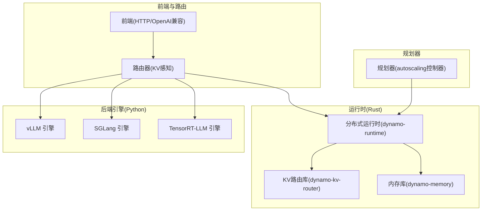
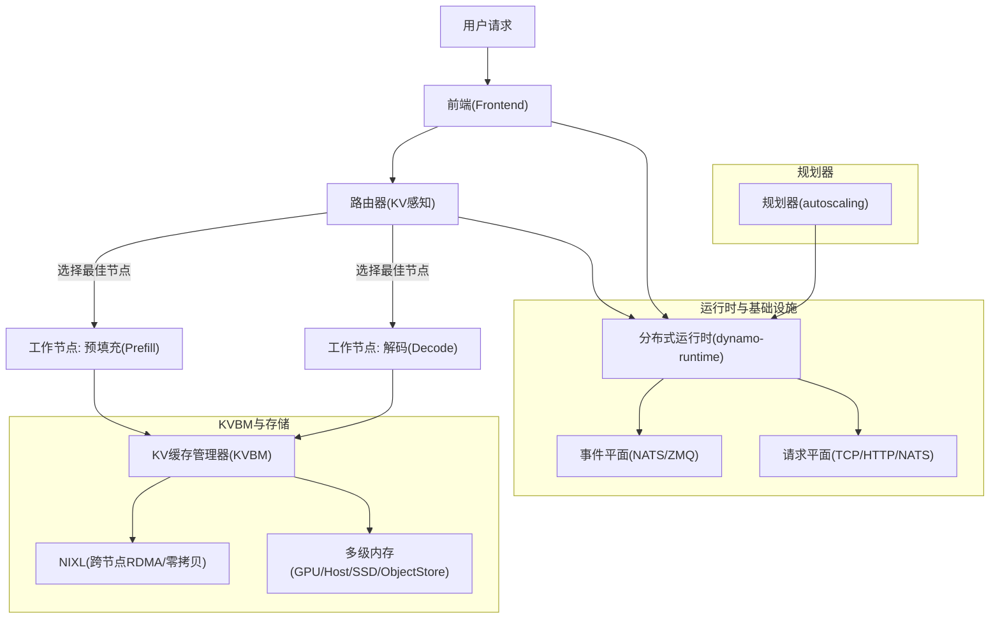
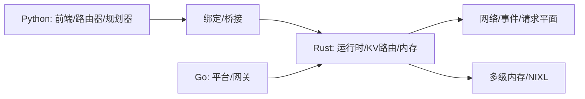
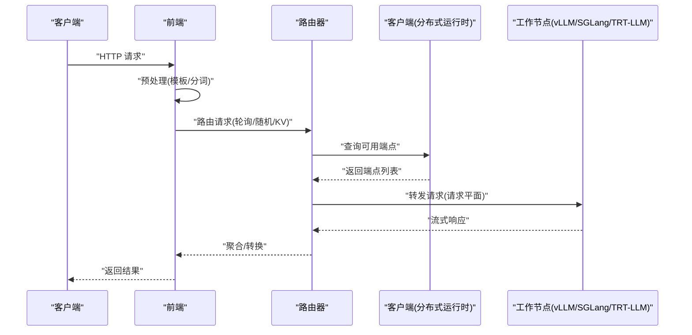
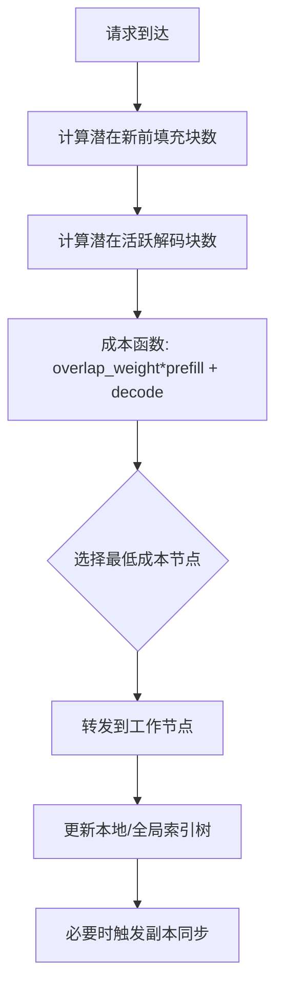
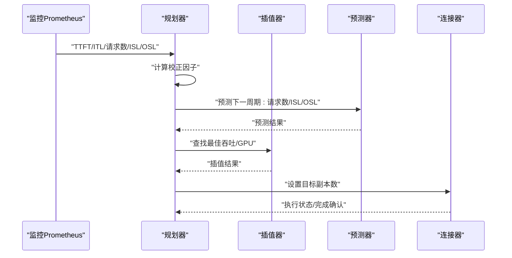
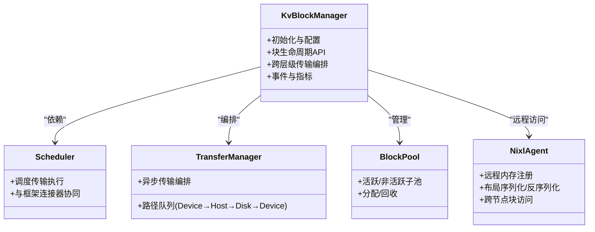
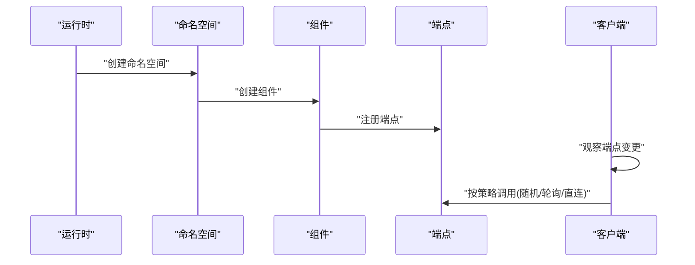
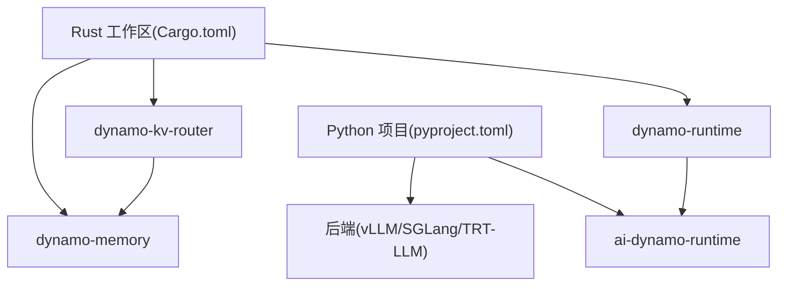

# 整体架构设计

<cite>
**本文引用的文件**
- [架构总览](file://docs/pages/design-docs/architecture.md)
- [分布式运行时](file://docs/pages/design-docs/distributed-runtime.md)
- [KV缓存管理器设计](file://docs/pages/design-docs/kvbm-design.md)
- [规划器设计](file://docs/pages/design-docs/planner-design.md)
- [路由器设计](file://docs/pages/design-docs/router-design.md)
- [项目根说明](file://README.md)
- [Rust 工作区配置](file://Cargo.toml)
- [Python 项目配置](file://pyproject.toml)
- [运行时库 Cargo.toml](file://lib/runtime/Cargo.toml)
- [KV 路由库 Cargo.toml](file://lib/kv-router/Cargo.toml)
- [内存库 Cargo.toml](file://lib/memory/Cargo.toml)
- [前端入口](file://components/src/dynamo/frontend/main.py)
- [路由器入口](file://components/src/dynamo/router/__main__.py)
- [规划器连接器接口](file://components/src/dynamo/planner/planner_connector.py)
</cite>

## 目录
1. [引言](#引言)
2. [项目结构](#项目结构)
3. [核心组件](#核心组件)
4. [架构总览](#架构总览)
5. [详细组件分析](#详细组件分析)
6. [依赖关系分析](#依赖关系分析)
7. [性能考量](#性能考量)
8. [故障排查指南](#故障排查指南)
9. [结论](#结论)
10. [附录](#附录)

## 引言
本文件面向希望理解 NVIDIA Dynamo 分布式推理系统整体架构的读者，重点阐述多语言混合架构（Rust + Python + Go）的设计理念与实现方式，明确各核心组件的职责边界与协作关系，并给出分布式推理系统在性能优先、可扩展性与容错性方面的设计原则。文中所有术语与组件名称均与代码库保持一致，帮助初学者快速建立对 Dynamo 架构的理解框架。

## 项目结构
Dynamo 采用模块化与分层结合的组织方式：
- 核心运行时与基础设施：以 Rust 实现，提供高性能、低延迟的分布式通信、服务发现与端点调用能力，位于 lib/runtime 及相关子库。
- 前端与路由：以 Python 实现，负责 HTTP/OpenAI 兼容 API、请求预处理、KV 路由与负载均衡，位于 components/src/dynamo/frontend 与 components/src/dynamo/router。
- 规划器：以 Python 实现，负责基于指标预测与性能插值的自动扩缩容控制，位于 components/src/dynamo/planner。
- KV 缓存管理器（KVBM）：以 Rust 实现，提供跨层级内存的 KV 块管理、异步传输编排与事件平面集成，位于 lib/kv-router 与 lib/memory 等。
- Go 组件：部署与可观测性相关，如 Operator、Inference Gateway 等，位于 deploy/operator、deploy/inference-gateway 等目录。

图表来源
- [分布式运行时](file://docs/pages/design-docs/distributed-runtime.md#L10-L31)
- [KV 路由库 Cargo.toml](file://lib/kv-router/Cargo.toml#L1-L70)
- [内存库 Cargo.toml](file://lib/memory/Cargo.toml#L1-L41)

章节来源
- [项目根说明](file://README.md#L63-L69)
- [Rust 工作区配置](file://Cargo.toml#L4-L36)

## 核心组件
- 前端（Frontend）
  - 职责：提供 OpenAI 兼容 HTTP API、请求预处理（模板化、分词）、路由选择与转发、可选的交互模式与 gRPC 支持。
  - 关键点：支持多种路由模式（轮询、随机、KV 感知），可配置请求平面（TCP/HTTP/NATS）与事件平面（NATS/ZMQ）。
- 路由器（Router）
  - 职责：基于 KV 缓存重叠度与解码负载进行成本计算，选择最优工作节点；维护全局/本地索引树，支持持久化事件流（JetStream）或本地索引恢复。
  - 关键点：支持多线程并发索引、副本间状态同步、主动块跟踪与输出块衰减。
- 规划器（Planner）
  - 职责：周期性采集指标，预测未来负载，通过性能插值与校正因子计算预填/解码副本数，驱动 Kubernetes 或虚拟连接器执行扩缩容。
  - 关键点：支持 ARIMA/Kalman/Prophet 等预测器，提供校正因子以适配真实行为偏差。
- 分布式运行时（DistributedRuntime）
  - 职责：统一的服务发现与端点调用抽象，支持 etcd 与 Kubernetes 两种后端；提供命名空间、组件、端点的层次化注册与发现；支持 TCP/HTTP/NATS 请求平面与 NATS 事件平面。
  - 关键点：生命周期管理、租约保活、客户端观察者模式、负载均衡策略（随机/轮询/直连）。
- KV 缓存管理器（KVBM）
  - 职责：跨层级内存（设备/主机/磁盘/远程存储）的 KV 块管理与异步传输编排；通过事件平面与 NIXL 实现跨节点共享与零拷贝访问。
  - 关键点：块布局与元数据、块状态机、事件发布/移除、远程内存注册协议、存储后端可插拔。

章节来源
- [前端入口](file://components/src/dynamo/frontend/main.py#L1-L518)
- [路由器入口](file://components/src/dynamo/router/__main__.py#L1-L359)
- [分布式运行时](file://docs/pages/design-docs/distributed-runtime.md#L10-L31)
- [KV缓存管理器设计](file://docs/pages/design-docs/kvbm-design.md#L10-L93)
- [规划器设计](file://docs/pages/design-docs/planner-design.md#L14-L31)

## 架构总览
Dynamo 的整体目标是实现“高吞吐、低延迟”的生成式 AI 推理，支持多节点分布式环境下的解耦前填充（prefill）与解码（decode）阶段，结合 KV 缓存感知路由、动态 GPU 调度、加速数据传输（NIXL）与多级内存分层（KVBM）来提升吞吐与 TTFT。

图表来源
- [架构总览](file://docs/pages/design-docs/architecture.md#L40-L56)
- [分布式运行时](file://docs/pages/design-docs/distributed-runtime.md#L10-L31)
- [KV缓存管理器设计](file://docs/pages/design-docs/kvbm-design.md#L244-L256)

章节来源
- [架构总览](file://docs/pages/design-docs/architecture.md#L8-L56)

## 详细组件分析

### 多语言混合架构设计
- Rust 层（高性能与并发）
  - 分布式运行时：提供统一的服务发现、端点注册与调用、租约保活、请求/事件平面抽象。
  - KV 路由库：实现前缀树索引、并发事件处理、成本函数与工作节点选择。
  - 内存库：封装 NIXL、CUDA、主机内存与文件系统访问，支撑 KVBM 的跨层级传输。
- Python 层（易用性与生态）
  - 前端：HTTP/OpenAI 兼容 API、请求预处理、路由配置与运行模式切换。
  - 路由器：独立服务入口，支持 KV 感知路由、事件模式（JetStream/本地索引）与副本同步。
  - 规划器：指标采集、负载预测、性能插值与扩缩容执行。
- Go 层（平台与运维）
  - Operator、Inference Gateway 等用于部署、发现与网关编排。

图表来源
- [分布式运行时](file://docs/pages/design-docs/distributed-runtime.md#L10-L31)
- [KV 路由库 Cargo.toml](file://lib/kv-router/Cargo.toml#L1-L70)
- [内存库 Cargo.toml](file://lib/memory/Cargo.toml#L1-L41)

章节来源
- [分布式运行时](file://docs/pages/design-docs/distributed-runtime.md#L10-L31)
- [项目根说明](file://README.md#L47-L48)

### 前端服务（Frontend）
- 职责边界
  - 对外：OpenAI 兼容 HTTP API、可选 gRPC/交互模式。
  - 对内：请求预处理（模板化、分词）、路由决策（轮询/随机/KV 感知）、与后端引擎通信。
- 关键配置
  - 路由模式、KV 重叠权重、温度参数、事件平面与请求平面、TLS、模型名/路径、迁移限制等。
- 交互流程
  - 初始化分布式运行时 → 构造引擎工厂 → 启动 HTTP/gRPC/交互模式 → 接收请求 → 预处理 → 路由 → 发送到工作节点 → 流式返回结果。

图表来源
- [前端入口](file://components/src/dynamo/frontend/main.py#L368-L518)
- [分布式运行时](file://docs/pages/design-docs/distributed-runtime.md#L65-L85)

章节来源
- [前端入口](file://components/src/dynamo/frontend/main.py#L1-L518)

### 路由器（Router）
- 职责边界
  - 计算成本函数：考虑 KV 重叠与解码负载，选择最优工作节点；支持 softmax 温度采样与确定性选择。
  - 事件处理：维护全局/本地索引树，支持 JetStream 持久化与本地索引恢复；副本间状态同步保证一致性。
- 数据流
  - 事件发布（KVPublisher）→ 事件订阅（KVIndexer）→ 成本计算 → 节点选择 → 转发请求。
- 事件平面
  - NATS Core（默认）：本地索引 + 事件恢复；JetStream（可选）：持久化流与快照，适合多副本一致性场景。

图表来源
- [路由器设计](file://docs/pages/design-docs/router-design.md#L56-L75)
- [路由器设计](file://docs/pages/design-docs/router-design.md#L139-L169)

章节来源
- [路由器设计](file://docs/pages/design-docs/router-design.md#L10-L75)
- [路由器入口](file://components/src/dynamo/router/__main__.py#L1-L359)

### 规划器（Planner）
- 职责边界
  - 指标采集：TTFT/ITL、请求数、平均输入/输出长度。
  - 校正因子：补偿突发流量、前缀缓存命中、小批次解码等现实偏差。
  - 负载预测：常量/ARIMA/Kalman/Prophet 四种预测器。
  - 性能插值：基于预部署剖析数据映射（吞吐/GPU, ISL/OSL/上下文长度）→（TTFT/ITL）。
  - 执行扩缩容：Kubernetes 连接器或虚拟连接器，非阻塞执行并持续监控。
- 关键流程
  - 初始化 → 连接器验证 → 加载剖析数据 → 构建插值器 → 初始化预测器 → 主循环。

图表来源
- [规划器设计](file://docs/pages/design-docs/planner-design.md#L20-L98)
- [规划器设计](file://docs/pages/design-docs/planner-design.md#L100-L137)

章节来源
- [规划器设计](file://docs/pages/design-docs/planner-design.md#L14-L98)
- [规划器连接器接口](file://components/src/dynamo/planner/planner_connector.py#L19-L30)

### KV 缓存管理器（KVBM）
- 职责边界
  - 跨层级内存池：设备（GPU）、主机（CPU）、磁盘（SSD）、远程存储（对象存储）。
  - 传输编排：Device→Host、Host→Disk、Host→Device、Disk→Device 的异步队列与批处理。
  - 事件与可观测：发布/订阅块生命周期事件，支持外部存储优化器构建内部索引。
  - 远程内存：通过 NIXL 实现 RDMA 描述符与布局同步，确保跨节点一致性。
- 内部架构
  - Facade：KvBlockManager 作为编排层，协调多后端池与事件钩子。
  - 布局与块：BlockLayout 抽象内存布局，块状态机管理生命周期。
  - 存储后端：Device/Pinned/System/NixlStorage，可插拔扩展。

图表来源
- [KV缓存管理器设计](file://docs/pages/design-docs/kvbm-design.md#L17-L93)
- [KV缓存管理器设计](file://docs/pages/design-docs/kvbm-design.md#L240-L267)

章节来源
- [KV缓存管理器设计](file://docs/pages/design-docs/kvbm-design.md#L74-L161)
- [KV缓存管理器设计](file://docs/pages/design-docs/kvbm-design.md#L162-L239)

### 分布式运行时（DistributedRuntime）
- 职责边界
  - 服务发现：etcd 或 Kubernetes（CRD/EndpointSlice）。
  - 端点调用：Client 观察端点变化，支持随机/轮询/直连负载均衡。
  - 请求平面：TCP/HTTP/NATS；事件平面：NATS/ZMQ。
  - 生命周期：租约保活、取消令牌、优雅关闭。
- 层次关系
  - DistributedRuntime → Namespace → Component → Endpoint。

图表来源
- [分布式运行时](file://docs/pages/design-docs/distributed-runtime.md#L32-L85)

章节来源
- [分布式运行时](file://docs/pages/design-docs/distributed-runtime.md#L10-L85)
- [运行时库 Cargo.toml](file://lib/runtime/Cargo.toml#L1-L113)

## 依赖关系分析
- 工作区与包依赖
  - Rust 工作区包含 runtime、llm、config、tokens、memory、kv-router、engines 等成员 crate，统一版本与特性。
  - Python 项目依赖 ai-dynamo-runtime（Rust 绑定）与后端生态（vLLM、SGLang、TRT-LLM）。
- 组件耦合
  - 前端/路由器依赖分布式运行时进行服务发现与端点调用。
  - 规划器通过连接器与运行时交互，间接影响组件副本数量。
  - KVBM 与 NIXL/事件平面深度耦合，支撑跨节点 KV 传输与一致性。

图表来源
- [Rust 工作区配置](file://Cargo.toml#L4-L36)
- [Python 项目配置](file://pyproject.toml#L14-L30)

章节来源
- [Rust 工作区配置](file://Cargo.toml#L4-L36)
- [Python 项目配置](file://pyproject.toml#L14-L30)

## 性能考量
- 性能优先
  - 解耦 prefill/decode：最大化 GPU 利用率，平衡 TTFT 与 ITL。
  - KV 感知路由：减少 KV 重算，显著降低 TTFT 并提升吞吐。
  - 多级内存分层与 NIXL：跨层级高效传输，减少重复计算。
- 可扩展性
  - 分布式运行时支持多后端发现与多请求/事件平面，便于横向扩展。
  - 规划器基于性能插值与预测器，动态调整副本数，适应波动需求。
- 容错性
  - 事件平面支持 JetStream 持久化与快照，保障多副本一致性与重启恢复。
  - 前端支持请求迁移限制与优雅关闭，降低中断风险。

## 故障排查指南
- 服务发现与消息
  - 本地开发：可通过 --store-kv=file 跳过 etcd；禁用 KV 事件可避免 NATS 依赖。
  - Kubernetes：使用原生资源（CRD/EndpointSlice）进行发现，无需 etcd。
- 路由器状态
  - JetStream 模式需在前端与所有工作节点同时启用 --durable-kv-events。
  - 本地索引模式下，若出现事件丢失，路由器会通过查询本地索引补全。
- 规划器执行
  - 若扩容未生效，检查连接器是否正确实现 set_component_replicas，以及超时配置。
- 日志与指标
  - 设置 DYN_LOG/RUST_LOG 调整日志级别；通过 Prometheus 暴露的 /metrics 端点采集指标。

章节来源
- [项目根说明](file://README.md#L362-L381)
- [路由器设计](file://docs/pages/design-docs/router-design.md#L159-L217)
- [规划器设计](file://docs/pages/design-docs/planner-design.md#L162-L176)

## 结论
Dynamo 通过 Rust + Python + Go 的多语言混合架构，在性能、可扩展性与容错性之间取得平衡：Rust 提供高性能与并发基础，Python 提供易用性与生态集成，Go 负责平台与运维。前端、路由器、规划器、分布式运行时与 KVBM 协同工作，形成从请求接入到跨节点 KV 传输的完整链路，满足大规模生成式 AI 推理的复杂需求。

## 附录
- 快速启动与示例
  - 容器镜像一键启动前端与工作节点，支持 SGLang/TensorRT-LLM/vLLM。
  - 本地开发建议使用 --store-kv=file 与禁用 KV 事件以简化依赖。
- 生态与集成
  - 支持 vLLM、SGLang、TensorRT-LLM 等后端；与 NIXL、事件平面、Prometheus 等工具无缝集成。

章节来源
- [项目根说明](file://README.md#L87-L215)