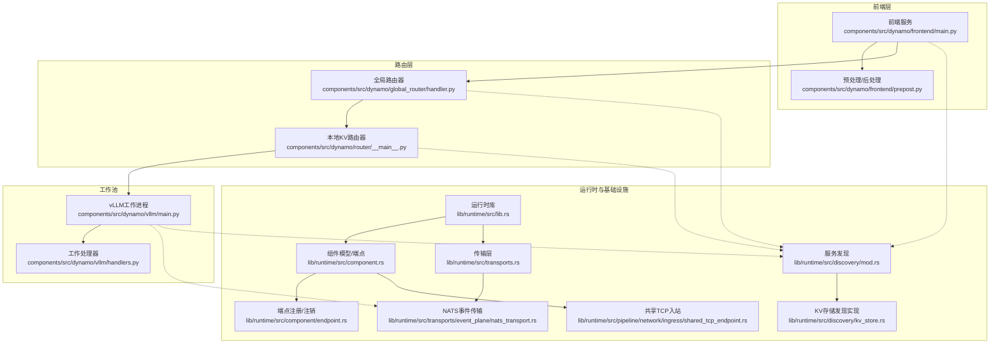
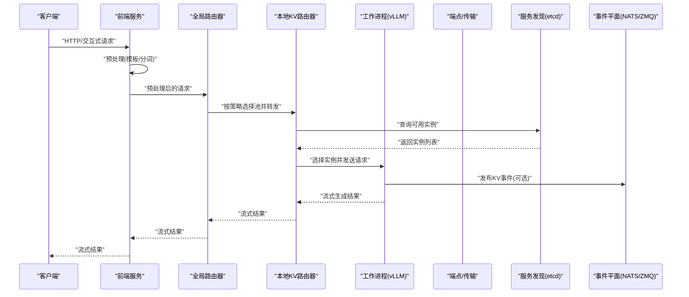
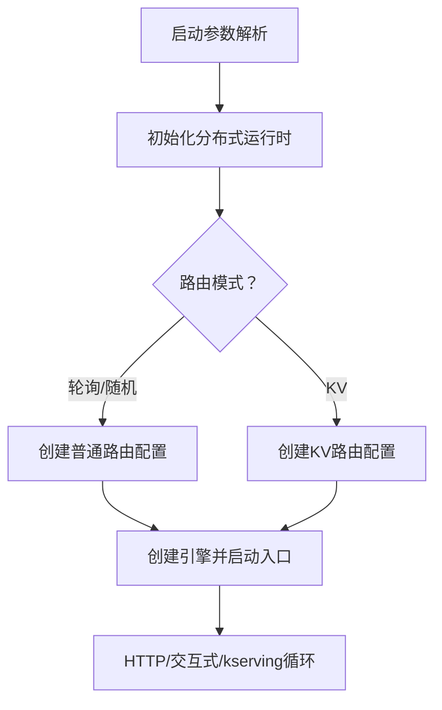
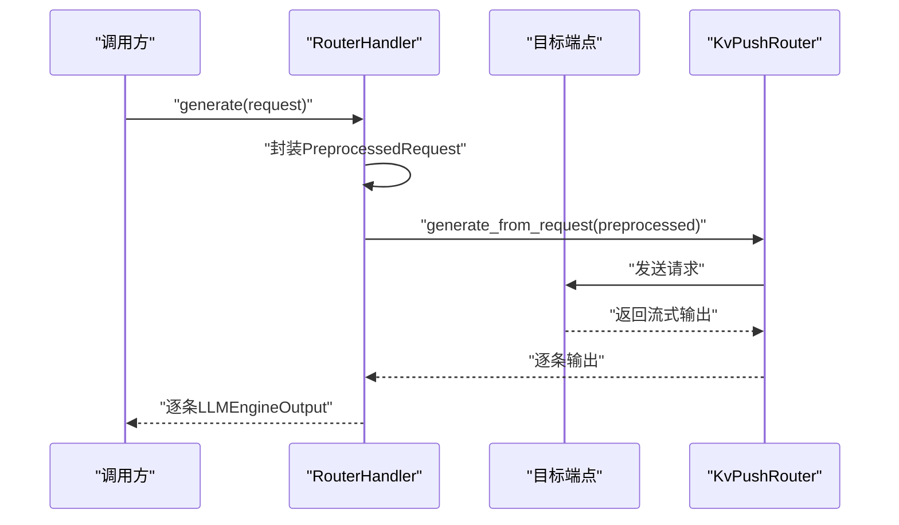
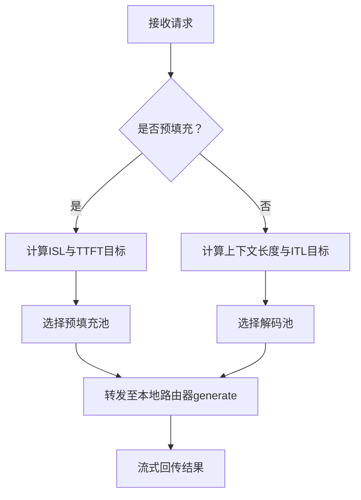
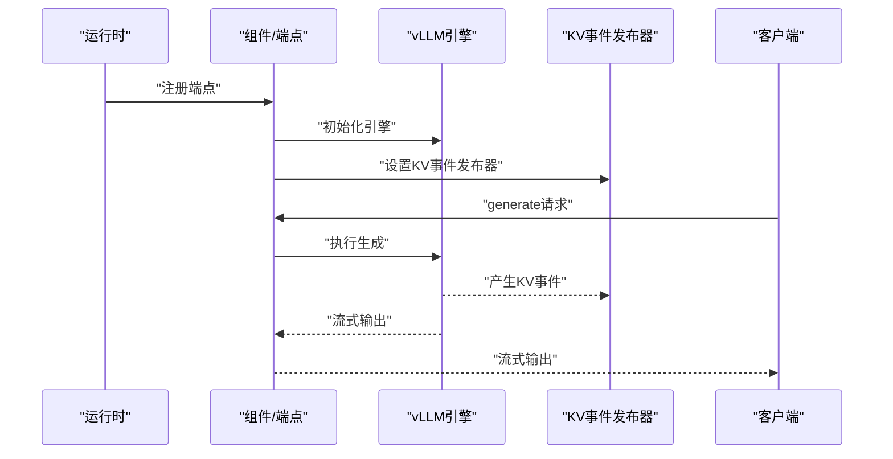
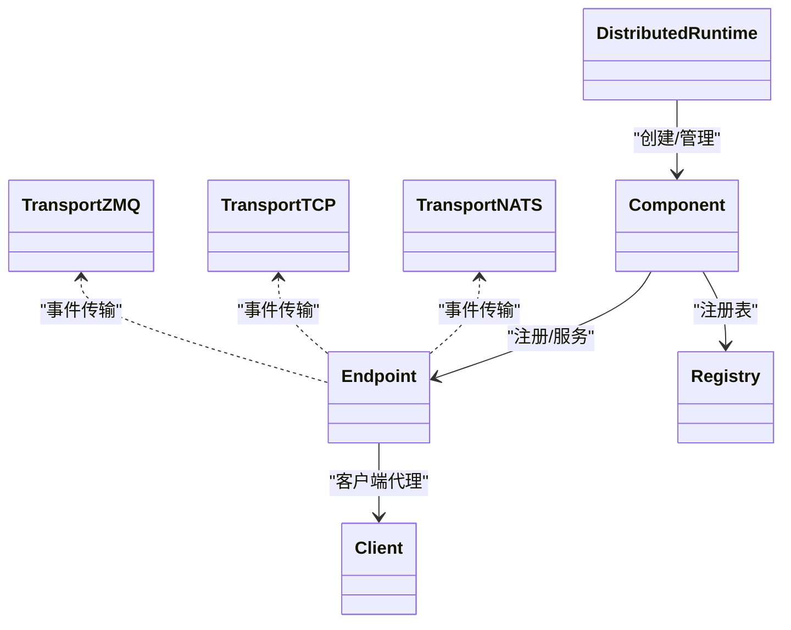
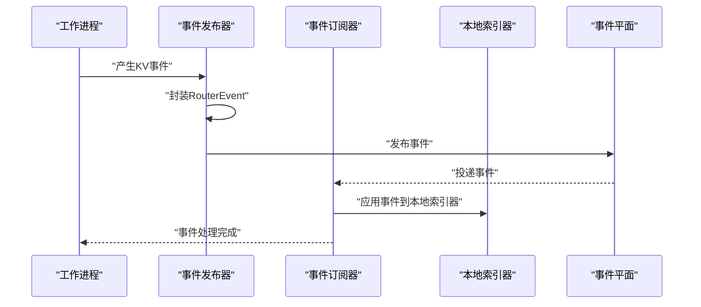
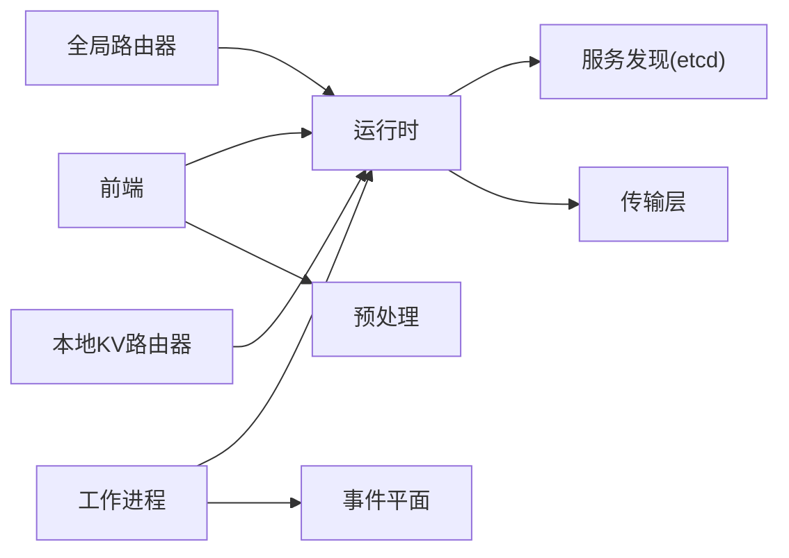

# 组件关系与交互

<cite>
**本文引用的文件**
- [components/src/dynamo/frontend/main.py](file://components/src/dynamo/frontend/main.py)
- [components/src/dynamo/router/__main__.py](file://components/src/dynamo/router/__main__.py)
- [components/src/dynamo/vllm/main.py](file://components/src/dynamo/vllm/main.py)
- [components/src/dynamo/vllm/handlers.py](file://components/src/dynamo/vllm/handlers.py)
- [components/src/dynamo/frontend/prepost.py](file://components/src/dynamo/frontend/prepost.py)
- [components/src/dynamo/global_router/handler.py](file://components/src/dynamo/global_router/handler.py)
- [components/src/dynamo/planner/kube.py](file://components/src/dynamo/planner/kube.py)
- [lib/runtime/src/lib.rs](file://lib/runtime/src/lib.rs)
- [lib/runtime/src/component.rs](file://lib/runtime/src/component.rs)
- [lib/runtime/src/transports.rs](file://lib/runtime/src/transports.rs)
- [lib/runtime/src/transports/event_plane/nats_transport.rs](file://lib/runtime/src/transports/event_plane/nats_transport.rs)
- [lib/runtime/src/discovery/mod.rs](file://lib/runtime/src/discovery/mod.rs)
- [lib/runtime/src/discovery/kv_store.rs](file://lib/runtime/src/discovery/kv_store.rs)
- [lib/runtime/src/component/endpoint.rs](file://lib/runtime/src/component/endpoint.rs)
- [lib/runtime/src/pipeline/network/ingress/shared_tcp_endpoint.rs](file://lib/runtime/src/pipeline/network/ingress/shared_tcp_endpoint.rs)
- [lib/llm/src/kv_router/publisher.rs](file://lib/llm/src/kv_router/publisher.rs)
- [lib/llm/src/kv_router/subscriber.rs](file://lib/llm/src/kv_router/subscriber.rs)
- [docs/pages/design-docs/discovery-plane.md](file://docs/pages/design-docs/discovery-plane.md)
</cite>

## 目录
1. [引言](#引言)
2. [项目结构](#项目结构)
3. [核心组件](#核心组件)
4. [架构总览](#架构总览)
5. [详细组件分析](#详细组件分析)
6. [依赖关系分析](#依赖关系分析)
7. [性能考量](#性能考量)
8. [故障排查指南](#故障排查指南)
9. [结论](#结论)
10. [附录](#附录)

## 引言
本文件聚焦Dynamo在分布式推理场景下的组件关系与交互机制，围绕前端服务（Frontend）、路由器（Router）、全局路由器（Global Router）、工作池（Worker）以及KV缓存管理器（KVBM/KV事件平面）展开，系统阐述服务发现、事件传播与消息传递协议，解释组件间通信协议、同步与异步处理方式，并给出端到端的数据流与交互序列图，帮助读者快速理解请求在系统中的完整流转过程。

## 项目结构
Dynamo采用多组件分层设计：前端负责HTTP/交互式入口与预处理；路由器负责路由决策（轮询/随机/KV感知）；后端工作进程（如vLLM）承载推理引擎；全局路由器用于跨命名空间的池化选择；运行时（runtime）提供统一的服务注册、发现、传输与健康检查能力；KV事件平面支撑KV缓存状态共享与一致性。

图表来源
- [components/src/dynamo/frontend/main.py](file://components/src/dynamo/frontend/main.py#L368-L518)
- [components/src/dynamo/router/__main__.py](file://components/src/dynamo/router/__main__.py#L270-L359)
- [components/src/dynamo/vllm/main.py](file://components/src/dynamo/vllm/main.py#L99-L191)
- [components/src/dynamo/vllm/handlers.py](file://components/src/dynamo/vllm/handlers.py#L233-L448)
- [components/src/dynamo/global_router/handler.py](file://components/src/dynamo/global_router/handler.py#L23-L121)
- [lib/runtime/src/lib.rs](file://lib/runtime/src/lib.rs#L1-L62)
- [lib/runtime/src/component.rs](file://lib/runtime/src/component.rs#L32-L85)
- [lib/runtime/src/transports.rs](file://lib/runtime/src/transports.rs#L1-L14)
- [lib/runtime/src/transports/event_plane/nats_transport.rs](file://lib/runtime/src/transports/event_plane/nats_transport.rs#L1-L54)
- [lib/runtime/src/discovery/mod.rs](file://lib/runtime/src/discovery/mod.rs#L674-L710)
- [lib/runtime/src/discovery/kv_store.rs](file://lib/runtime/src/discovery/kv_store.rs#L657-L695)
- [lib/runtime/src/component/endpoint.rs](file://lib/runtime/src/component/endpoint.rs#L347-L395)
- [lib/runtime/src/pipeline/network/ingress/shared_tcp_endpoint.rs](file://lib/runtime/src/pipeline/network/ingress/shared_tcp_endpoint.rs#L286-L323)

章节来源
- [components/src/dynamo/frontend/main.py](file://components/src/dynamo/frontend/main.py#L368-L518)
- [components/src/dynamo/router/__main__.py](file://components/src/dynamo/router/__main__.py#L270-L359)
- [components/src/dynamo/vllm/main.py](file://components/src/dynamo/vllm/main.py#L99-L191)
- [components/src/dynamo/vllm/handlers.py](file://components/src/dynamo/vllm/handlers.py#L233-L448)
- [components/src/dynamo/global_router/handler.py](file://components/src/dynamo/global_router/handler.py#L23-L121)
- [lib/runtime/src/lib.rs](file://lib/runtime/src/lib.rs#L1-L62)

## 核心组件
- 前端服务（Frontend）
  - 提供HTTP/交互式入口，内置预处理（提示模板化、分词）与路由策略（轮询/随机/KV）。
  - 支持TLS、指标前缀、KServe gRPC、请求平面（NATS/HTTP/TCP）与事件平面（NATS/ZMQ）配置。
- 本地KV路由器（Local KV Router）
  - 面向特定命名空间内的工作池，支持基于KV缓存重用的路由决策，可启用事件同步或TTL预测模式。
- 全局路由器（Global Router）
  - 在多命名空间/池化场景下，依据ISL/TTFT或上下文长度/ITL目标进行网格化选择，转发至本地路由器。
- 工作进程（Worker，以vLLM为例）
  - 初始化引擎、注册端点、发布KV事件、处理生成与清理、支持睡眠/唤醒与优雅停机。
- 运行时（Runtime）
  - 统一的服务注册、发现、健康检查、传输抽象（NATS/TCP/ZMQ），以及共享TCP入站与端点生命周期管理。
- KV事件平面与索引器
  - 通过NATS/ZMQ发布/订阅KV缓存事件，维护本地索引器与全局一致性，支持持久化与快照。

章节来源
- [components/src/dynamo/frontend/main.py](file://components/src/dynamo/frontend/main.py#L118-L365)
- [components/src/dynamo/router/__main__.py](file://components/src/dynamo/router/__main__.py#L156-L267)
- [components/src/dynamo/global_router/handler.py](file://components/src/dynamo/global_router/handler.py#L23-L121)
- [components/src/dynamo/vllm/main.py](file://components/src/dynamo/vllm/main.py#L535-L674)
- [lib/runtime/src/component.rs](file://lib/runtime/src/component.rs#L32-L85)
- [lib/runtime/src/transports/event_plane/nats_transport.rs](file://lib/runtime/src/transports/event_plane/nats_transport.rs#L1-L54)

## 架构总览
Dynamo采用“前端-路由器-工作池”的三层架构，结合运行时提供的服务发现与事件平面，实现跨节点的动态路由与状态同步。请求从前端进入，经由本地或全局路由器选择合适的工作池，再由工作进程执行推理并返回流式结果。KV事件平面保障不同实例对KV缓存状态的一致认知，提升路由准确性与负载均衡效果。

图表来源
- [components/src/dynamo/frontend/main.py](file://components/src/dynamo/frontend/main.py#L368-L518)
- [components/src/dynamo/global_router/handler.py](file://components/src/dynamo/global_router/handler.py#L122-L214)
- [components/src/dynamo/router/__main__.py](file://components/src/dynamo/router/__main__.py#L80-L153)
- [components/src/dynamo/vllm/main.py](file://components/src/dynamo/vllm/main.py#L636-L670)
- [lib/runtime/src/discovery/mod.rs](file://lib/runtime/src/discovery/mod.rs#L674-L710)
- [lib/runtime/src/transports/event_plane/nats_transport.rs](file://lib/runtime/src/transports/event_plane/nats_transport.rs#L1-L54)

## 详细组件分析

### 前端服务（Frontend）
- 职责
  - 启动HTTP/交互式/kserving入口，集成预处理（模板渲染、分词）与后处理（工具调用、推理解析）。
  - 选择路由模式（轮询/随机/KV），配置请求平面（NATS/HTTP/TCP）与事件平面（NATS/ZMQ）。
  - 管理优雅停机、TLS、指标前缀与模型参数注入。
- 关键流程
  - 解析参数与环境变量，初始化分布式运行时与路由配置。
  - 创建引擎工厂（可选vLLM处理器），启动HTTP/交互式/kserving循环。
  - 请求迁移限制控制与事件平面启用条件判定。
- 接口与调用
  - 入口函数：async_main、main
  - 路由配置：RouterConfig、KvRouterConfig
  - 引擎创建：make_engine、run_input

图表来源
- [components/src/dynamo/frontend/main.py](file://components/src/dynamo/frontend/main.py#L368-L518)

章节来源
- [components/src/dynamo/frontend/main.py](file://components/src/dynamo/frontend/main.py#L118-L365)
- [components/src/dynamo/frontend/prepost.py](file://components/src/dynamo/frontend/prepost.py#L56-L117)

### 本地KV路由器（Router）
- 职责
  - 为指定命名空间的工作端点提供KV感知路由，支持事件同步与TTL预测两种模式。
  - 暴露generate与best_worker_id两个端点，支持并发服务与指标标签。
- 关键流程
  - 解析endpoint路径，连接目标端点，构建KvPushRouter。
  - 将请求包装为PreprocessedRequest，调用generate_from_request，逐条产出LLMEngineOutput。
  - best_worker_id仅返回最佳实例ID，不实际路由。
- 接口与调用
  - StandaloneRouterHandler.initialize/generate/best_worker_id
  - 命令行参数解析与默认值设置

图表来源
- [components/src/dynamo/router/__main__.py](file://components/src/dynamo/router/__main__.py#L80-L153)

章节来源
- [components/src/dynamo/router/__main__.py](file://components/src/dynamo/router/__main__.py#L31-L153)

### 全局路由器（Global Router）
- 职责
  - 在多命名空间/池化部署中，根据ISL/TTFT或上下文长度/ITL目标选择合适的预填充/解码池。
  - 通过本地路由器端点（namespace.router.generate）进行转发，支持异步流式回传。
- 关键流程
  - 初始化：连接所有预填充/解码池的本地路由器客户端。
  - 预填充：提取ISL与TTFT目标，选择池并转发请求。
  - 解码：提取上下文长度与ITL目标，选择池并转发请求。
- 接口与调用
  - GlobalRouterHandler.initialize/handle_prefill/handle_decode/get_pool_info
  - 池选择策略由配置驱动

图表来源
- [components/src/dynamo/global_router/handler.py](file://components/src/dynamo/global_router/handler.py#L122-L214)

章节来源
- [components/src/dynamo/global_router/handler.py](file://components/src/dynamo/global_router/handler.py#L23-L231)

### 工作进程（vLLM）
- 职责
  - 初始化vLLM引擎、注册端点、发布KV事件、处理生成与清理、支持睡眠/唤醒与优雅停机。
  - 多模态支持、LoRA动态加载/卸载、前端解码（NIXL）等扩展能力。
- 关键流程
  - init/init_prefill：根据配置选择初始化路径，设置度量收集、KV事件发布器、健康检查载荷。
  - 注册模型与端点，启动serve_endpoint（支持优雅停机）。
  - 生成处理：构建SamplingParams、输入参数管理、多线程/锁保护的LoRA管理。
- 接口与调用
  - worker、init、init_prefill、register_vllm_model
  - BaseWorkerHandler.generate/_monitor_abort/clear_kv_blocks/sleep/wake_up/load_lora/unload_lora/list_loras

图表来源
- [components/src/dynamo/vllm/main.py](file://components/src/dynamo/vllm/main.py#L535-L674)
- [components/src/dynamo/vllm/handlers.py](file://components/src/dynamo/vllm/handlers.py#L233-L448)
- [lib/llm/src/kv_router/publisher.rs](file://lib/llm/src/kv_router/publisher.rs#L263-L366)

章节来源
- [components/src/dynamo/vllm/main.py](file://components/src/dynamo/vllm/main.py#L99-L191)
- [components/src/dynamo/vllm/handlers.py](file://components/src/dynamo/vllm/handlers.py#L233-L448)

### 运行时与传输层
- 服务发现
  - 支持etcd/Kubernetes等后端，提供注册、注销、列举与监听事件流。
  - 基于租约的心跳保活，异常断连自动清理。
- 传输层
  - 抽象NATS/TCP/ZMQ等事件平面传输，统一发布/订阅接口。
  - 共享TCP入站复用端口，端点注册/注销与健康状态联动。
- 组件与端点
  - Endpoint/Client/Registry提供端点生命周期管理与健康检查。
  - 支持重新注册以恢复路由池。

图表来源
- [lib/runtime/src/lib.rs](file://lib/runtime/src/lib.rs#L20-L56)
- [lib/runtime/src/component.rs](file://lib/runtime/src/component.rs#L32-L85)
- [lib/runtime/src/transports.rs](file://lib/runtime/src/transports.rs#L1-L14)
- [lib/runtime/src/transports/event_plane/nats_transport.rs](file://lib/runtime/src/transports/event_plane/nats_transport.rs#L1-L54)

章节来源
- [lib/runtime/src/discovery/mod.rs](file://lib/runtime/src/discovery/mod.rs#L674-L710)
- [lib/runtime/src/discovery/kv_store.rs](file://lib/runtime/src/discovery/kv_store.rs#L657-L695)
- [lib/runtime/src/component/endpoint.rs](file://lib/runtime/src/component/endpoint.rs#L347-L395)
- [lib/runtime/src/pipeline/network/ingress/shared_tcp_endpoint.rs](file://lib/runtime/src/pipeline/network/ingress/shared_tcp_endpoint.rs#L286-L323)

### KV事件平面与索引器
- 发布/订阅
  - 工作进程通过KvEventPublisher发布KV事件，事件封装为RouterEvent并通过NATS/ZMQ传输。
  - 路由器侧通过EventSubscriber订阅事件，应用到本地索引器并记录内部缓冲。
- 一致性与持久化
  - 支持NATS Core与ZMQ两种事件平面；可选JetStream持久化（Durable KV事件）。
  - 事件ID单调递增，按(WorkerId, dp_rank)跟踪gap检测，保证顺序性与完整性。

图表来源
- [lib/llm/src/kv_router/publisher.rs](file://lib/llm/src/kv_router/publisher.rs#L263-L366)
- [lib/llm/src/kv_router/subscriber.rs](file://lib/llm/src/kv_router/subscriber.rs#L459-L498)

章节来源
- [lib/llm/src/kv_router/publisher.rs](file://lib/llm/src/kv_router/publisher.rs#L263-L366)
- [lib/llm/src/kv_router/subscriber.rs](file://lib/llm/src/kv_router/subscriber.rs#L459-L498)

## 依赖关系分析
- 组件耦合
  - 前端依赖运行时的分布式能力与路由配置；与预处理模块耦合以完成提示模板与分词。
  - 路由器依赖运行时的服务发现与端点客户端；KV路由器依赖事件平面与本地索引器。
  - 工作进程依赖运行时的端点注册、健康检查与传输层；与KV事件发布器强耦合。
- 外部依赖
  - etcd用于服务发现（默认），Kubernetes元数据聚合（可选）。
  - NATS/ZMQ用于事件平面，NATS Core/JetStream支持持久化与多副本一致性。
- 循环依赖
  - 未见直接循环依赖；运行时作为基础设施被上层组件依赖。

图表来源
- [components/src/dynamo/frontend/main.py](file://components/src/dynamo/frontend/main.py#L368-L518)
- [components/src/dynamo/router/__main__.py](file://components/src/dynamo/router/__main__.py#L270-L359)
- [components/src/dynamo/vllm/main.py](file://components/src/dynamo/vllm/main.py#L146-L152)
- [lib/runtime/src/discovery/mod.rs](file://lib/runtime/src/discovery/mod.rs#L674-L710)
- [lib/runtime/src/transports/event_plane/nats_transport.rs](file://lib/runtime/src/transports/event_plane/nats_transport.rs#L1-L54)

章节来源
- [components/src/dynamo/planner/kube.py](file://components/src/dynamo/planner/kube.py#L40-L144)
- [docs/pages/design-docs/discovery-plane.md](file://docs/pages/design-docs/discovery-plane.md#L48-L96)

## 性能考量
- 路由决策
  - KV感知路由通过重用块与活跃块跟踪优化负载均衡；事件同步模式在高一致性需求下可能引入额外延迟，TTL模式适合低延迟场景。
- 事件平面
  - NATS Core适合低延迟事件传播；JetStream持久化可提升多副本一致性但增加开销。
- 端点与传输
  - 共享TCP入站减少端口占用与连接成本；传输类型（NATS/HTTP/TCP）影响请求分发吞吐。
- 度量与可观测性
  - 多进程Prometheus采集与自动标签注入，确保跨进程指标一致性；健康检查与系统状态服务器辅助故障定位。

## 故障排查指南
- 服务发现异常
  - 检查etcd连接参数与租约心跳；确认实例ID与端点路径正确；查看watch事件流是否正常。
- 路由失败
  - 核对路由模式与参数（权重、温度、TTL、树大小、修剪比例）；验证事件平面配置与订阅状态。
- 事件丢失或乱序
  - 检查事件ID单调性与gap检测日志；确认本地索引器应用成功与事件平面传输无丢包。
- 优雅停机与迁移
  - 确认端点注销/重新注册顺序；检查睡眠/唤醒流程与引擎状态；验证请求迁移限制与取消上下文传播。

章节来源
- [lib/runtime/src/discovery/mod.rs](file://lib/runtime/src/discovery/mod.rs#L674-L710)
- [lib/runtime/src/component/endpoint.rs](file://lib/runtime/src/component/endpoint.rs#L347-L395)
- [lib/llm/src/kv_router/subscriber.rs](file://lib/llm/src/kv_router/subscriber.rs#L459-L498)

## 结论
Dynamo通过清晰的分层与统一的运行时抽象，实现了从前端到工作池的高效协作与状态同步。KV事件平面与服务发现共同保障了路由决策的准确性与系统的弹性。合理配置请求/事件平面与路由参数，可在一致性和延迟之间取得平衡，满足多样化部署场景的需求。

## 附录
- 命名空间与组件约定
  - 命名空间.namespace.component.endpoint用于端点唯一标识，全局路由器通过namespace.router.generate访问本地路由器。
- 环境变量与配置要点
  - DYN_*系列环境变量用于控制路由、事件、存储与传输；ETCD_*用于etcd连接；Prometheus多进程目录用于指标采集。