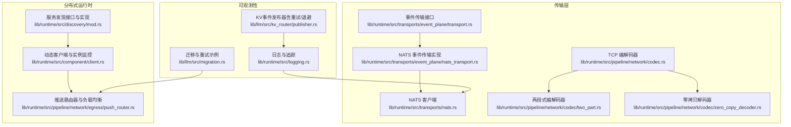
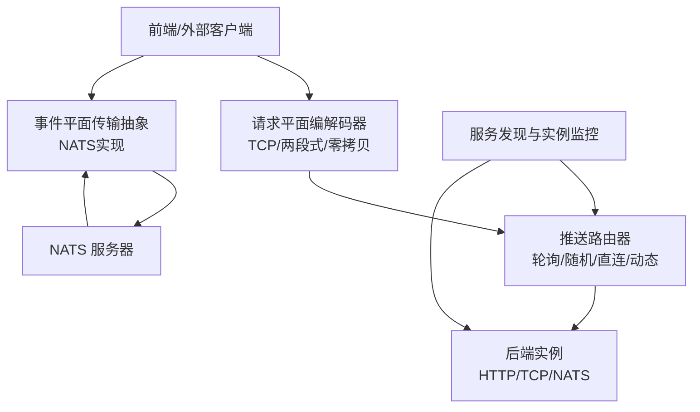
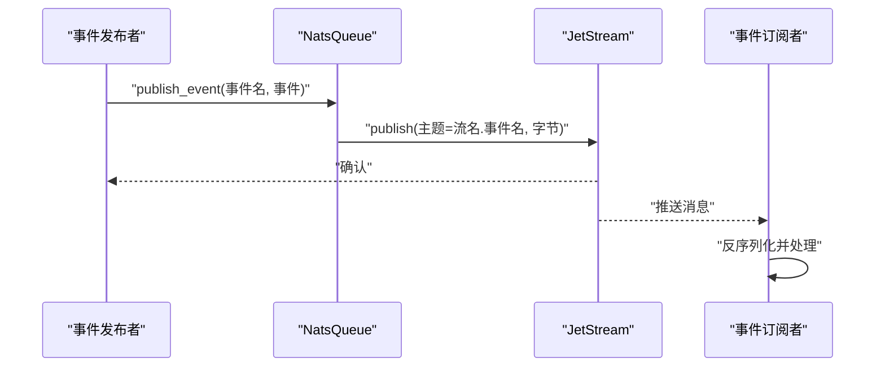
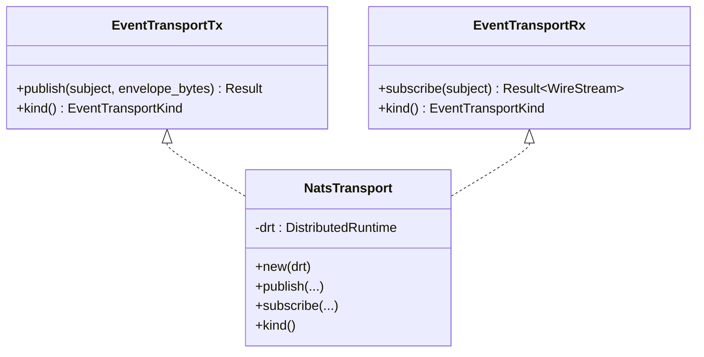
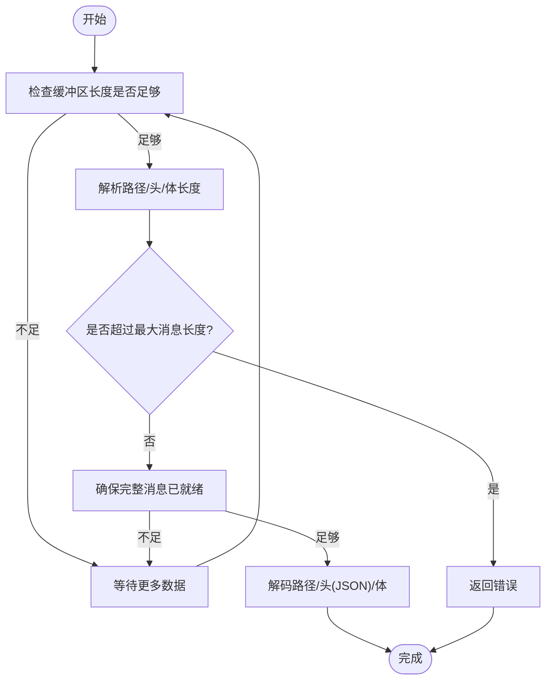
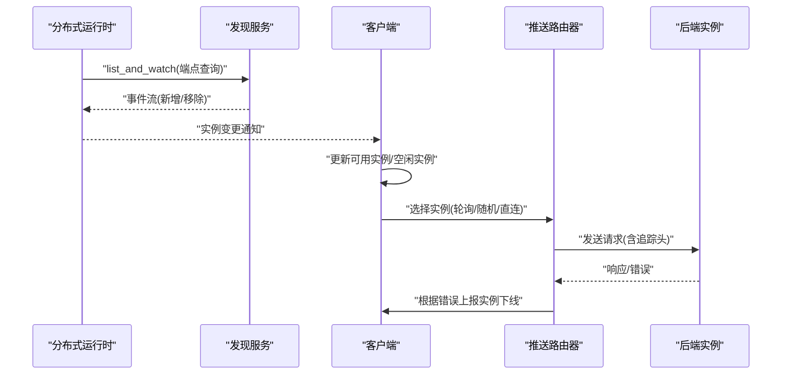
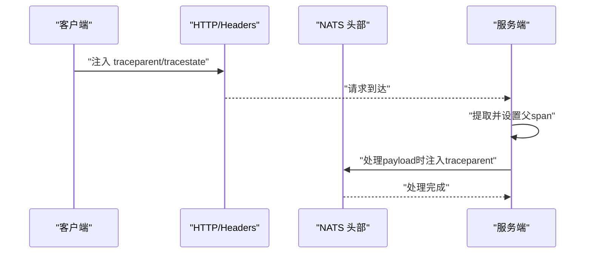
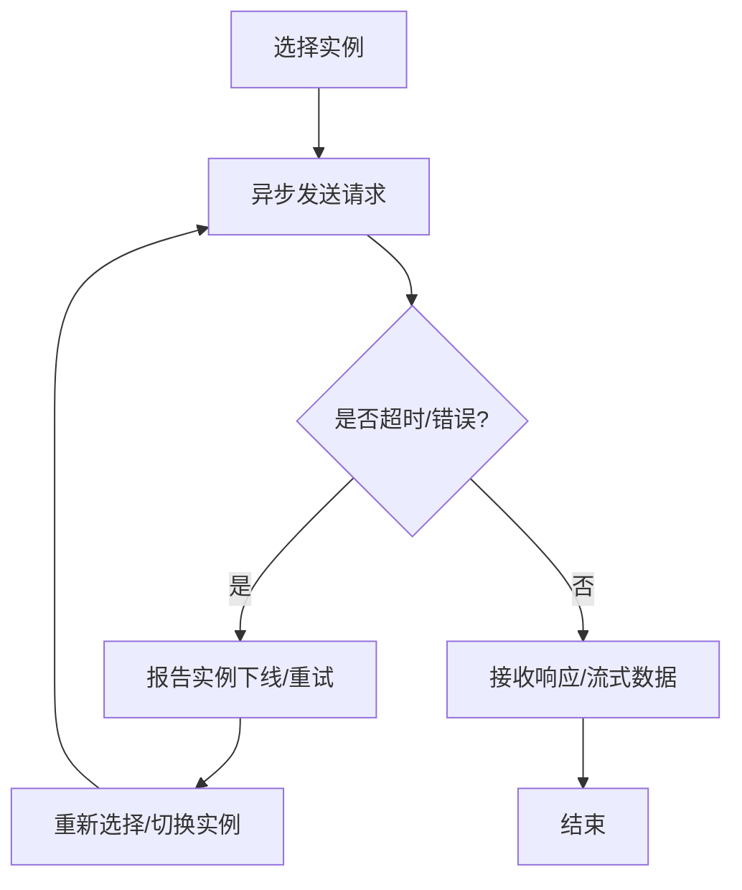
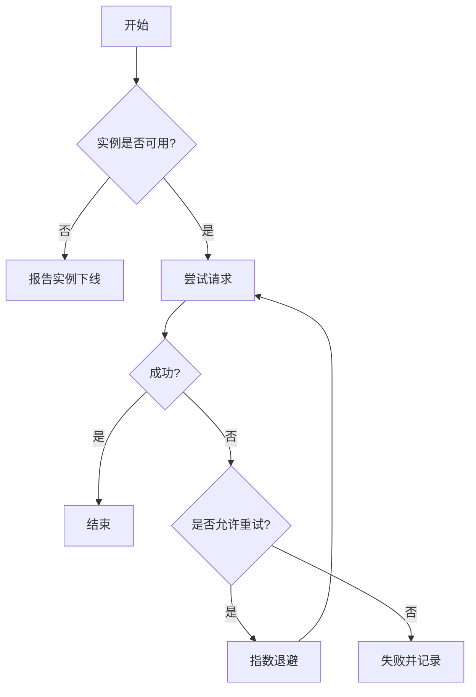
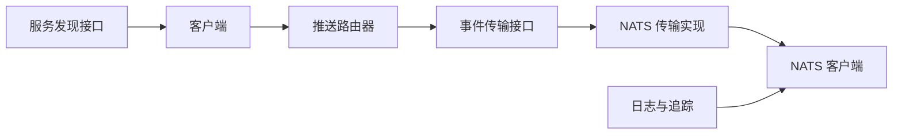

# 通信机制

<cite>
**本文引用的文件**   
- [lib/runtime/src/transports/nats.rs](file://lib/runtime/src/transports/nats.rs)
- [lib/runtime/src/transports/event_plane/nats_transport.rs](file://lib/runtime/src/transports/event_plane/nats_transport.rs)
- [lib/runtime/src/transports/event_plane/transport.rs](file://lib/runtime/src/transports/event_plane/transport.rs)
- [lib/runtime/src/logging.rs](file://lib/runtime/src/logging.rs)
- [lib/runtime/src/discovery/mod.rs](file://lib/runtime/src/discovery/mod.rs)
- [lib/runtime/src/pipeline/network/egress/push_router.rs](file://lib/runtime/src/pipeline/network/egress/push_router.rs)
- [lib/runtime/src/component/client.rs](file://lib/runtime/src/component/client.rs)
- [lib/runtime/src/pipeline/network/codec.rs](file://lib/runtime/src/pipeline/network/codec.rs)
- [lib/runtime/src/pipeline/network/codec/two_part.rs](file://lib/runtime/src/pipeline/network/codec/two_part.rs)
- [lib/runtime/src/pipeline/network/codec/zero_copy_decoder.rs](file://lib/runtime/src/pipeline/network/codec/zero_copy_decoder.rs)
- [lib/runtime/src/utils/tasks/tracker.rs](file://lib/runtime/src/utils/tasks/tracker.rs)
- [lib/runtime/src/transports/etcd/connector.rs](file://lib/runtime/src/transports/etcd/connector.rs)
- [lib/llm/src/kv_router/publisher.rs](file://lib/llm/src/kv_router/publisher.rs)
- [lib/llm/src/migration.rs](file://lib/llm/src/migration.rs)
</cite>

## 目录
1. [简介](#简介)
2. [项目结构](#项目结构)
3. [核心组件](#核心组件)
4. [架构总览](#架构总览)
5. [详细组件分析](#详细组件分析)
6. [依赖关系分析](#依赖关系分析)
7. [性能考量](#性能考量)
8. [故障排查指南](#故障排查指南)
9. [结论](#结论)
10. [附录](#附录)

## 简介
本文件系统化阐述Dynamo的通信机制，覆盖服务发现、事件平面（Event Plane）与请求平面（Request Plane）的消息传递、NATS消息队列的使用、OpenTelemetry链路追踪、异步与同步处理、超时与重试、负载均衡与故障转移等关键主题。文档以代码为依据，结合图示帮助读者快速理解组件间交互与数据流。

## 项目结构
Dynamo的通信相关代码主要分布在以下模块：
- 传输层：NATS客户端、事件平面传输抽象、TCP编解码器
- 分布式运行时：服务发现、实例监控、路由与负载均衡
- 追踪与日志：W3C Trace Context注入与提取、OpenTelemetry集成
- 可靠性：重试策略、指数退避、错误处理

**图表来源**
- [lib/runtime/src/transports/nats.rs](file://lib/runtime/src/transports/nats.rs#L1-L1195)
- [lib/runtime/src/transports/event_plane/transport.rs](file://lib/runtime/src/transports/event_plane/transport.rs#L1-L38)
- [lib/runtime/src/transports/event_plane/nats_transport.rs](file://lib/runtime/src/transports/event_plane/nats_transport.rs#L1-L54)
- [lib/runtime/src/pipeline/network/codec.rs](file://lib/runtime/src/pipeline/network/codec.rs#L1-L844)
- [lib/runtime/src/pipeline/network/codec/two_part.rs](file://lib/runtime/src/pipeline/network/codec/two_part.rs#L1-L765)
- [lib/runtime/src/pipeline/network/codec/zero_copy_decoder.rs](file://lib/runtime/src/pipeline/network/codec/zero_copy_decoder.rs#L128-L164)
- [lib/runtime/src/discovery/mod.rs](file://lib/runtime/src/discovery/mod.rs#L1-L711)
- [lib/runtime/src/component/client.rs](file://lib/runtime/src/component/client.rs#L1-L391)
- [lib/runtime/src/pipeline/network/egress/push_router.rs](file://lib/runtime/src/pipeline/network/egress/push_router.rs#L1-L429)
- [lib/runtime/src/logging.rs](file://lib/runtime/src/logging.rs#L1-L800)
- [lib/llm/src/kv_router/publisher.rs](file://lib/llm/src/kv_router/publisher.rs#L1901-L1937)
- [lib/llm/src/migration.rs](file://lib/llm/src/migration.rs#L354-L379)

**章节来源**
- [lib/runtime/src/transports/nats.rs](file://lib/runtime/src/transports/nats.rs#L1-L1195)
- [lib/runtime/src/transports/event_plane/transport.rs](file://lib/runtime/src/transports/event_plane/transport.rs#L1-L38)
- [lib/runtime/src/transports/event_plane/nats_transport.rs](file://lib/runtime/src/transports/event_plane/nats_transport.rs#L1-L54)
- [lib/runtime/src/pipeline/network/codec.rs](file://lib/runtime/src/pipeline/network/codec.rs#L1-L844)
- [lib/runtime/src/pipeline/network/codec/two_part.rs](file://lib/runtime/src/pipeline/network/codec/two_part.rs#L1-L765)
- [lib/runtime/src/pipeline/network/codec/zero_copy_decoder.rs](file://lib/runtime/src/pipeline/network/codec/zero_copy_decoder.rs#L128-L164)
- [lib/runtime/src/discovery/mod.rs](file://lib/runtime/src/discovery/mod.rs#L1-L711)
- [lib/runtime/src/component/client.rs](file://lib/runtime/src/component/client.rs#L1-L391)
- [lib/runtime/src/pipeline/network/egress/push_router.rs](file://lib/runtime/src/pipeline/network/egress/push_router.rs#L1-L429)
- [lib/runtime/src/logging.rs](file://lib/runtime/src/logging.rs#L1-L800)
- [lib/llm/src/kv_router/publisher.rs](file://lib/llm/src/kv_router/publisher.rs#L1901-L1937)
- [lib/llm/src/migration.rs](file://lib/llm/src/migration.rs#L354-L379)

## 核心组件
- NATS传输与队列
  - NATS客户端封装、JetStream流与消费者管理、对象存储上传下载、广播统计查询、队列入队出队与消费者计数、队列大小查询、消息清理等能力在NATS模块中集中实现。
- 事件平面传输抽象
  - 通过统一的事件传输接口定义发布/订阅行为，并提供NATS实现，便于扩展到其他传输（如ZMQ）。
- 请求平面编解码器
  - 提供TCP请求/响应编解码器、两段式消息编解码器（带校验）、零拷贝解码器，支持最大消息长度限制与校验，保障网络传输稳定性。
- 服务发现与实例监控
  - 发现接口抽象、端点/模型/事件通道注册与监听；客户端维护可用实例集合、空闲实例集合、周期性一致性恢复、实例下线报告与通知。
- 负载均衡与路由
  - 支持轮询、随机、直连与基于工作负载的动态选择；内置“忙碌阈值”与“故障检测”，在请求失败或流错误时自动隔离故障实例。
- 追踪与日志
  - 基于W3C Trace Context的跨进程/跨传输上下文传递；HTTP与NATS头部解析与注入；OpenTelemetry集成与导出配置。
- 可靠性与重试
  - 通用任务跟踪器与重试策略（指数退避、失败率控制）、ETCD连接退避、KV事件发布器的退避与重试逻辑、迁移场景中的断连重试。

**章节来源**
- [lib/runtime/src/transports/nats.rs](file://lib/runtime/src/transports/nats.rs#L412-L866)
- [lib/runtime/src/transports/event_plane/transport.rs](file://lib/runtime/src/transports/event_plane/transport.rs#L18-L37)
- [lib/runtime/src/transports/event_plane/nats_transport.rs](file://lib/runtime/src/transports/event_plane/nats_transport.rs#L15-L54)
- [lib/runtime/src/pipeline/network/codec.rs](file://lib/runtime/src/pipeline/network/codec.rs#L23-L486)
- [lib/runtime/src/pipeline/network/codec/two_part.rs](file://lib/runtime/src/pipeline/network/codec/two_part.rs#L10-L146)
- [lib/runtime/src/pipeline/network/codec/zero_copy_decoder.rs](file://lib/runtime/src/pipeline/network/codec/zero_copy_decoder.rs#L128-L164)
- [lib/runtime/src/discovery/mod.rs](file://lib/runtime/src/discovery/mod.rs#L686-L710)
- [lib/runtime/src/component/client.rs](file://lib/runtime/src/component/client.rs#L151-L195)
- [lib/runtime/src/pipeline/network/egress/push_router.rs](file://lib/runtime/src/pipeline/network/egress/push_router.rs#L170-L408)
- [lib/runtime/src/logging.rs](file://lib/runtime/src/logging.rs#L158-L800)
- [lib/runtime/src/utils/tasks/tracker.rs](file://lib/runtime/src/utils/tasks/tracker.rs#L3322-L6336)
- [lib/runtime/src/transports/etcd/connector.rs](file://lib/runtime/src/transports/etcd/connector.rs#L147-L167)
- [lib/llm/src/kv_router/publisher.rs](file://lib/llm/src/kv_router/publisher.rs#L1901-L1937)
- [lib/llm/src/migration.rs](file://lib/llm/src/migration.rs#L354-L379)

## 架构总览
Dynamo的通信架构分为三层：
- 事件平面（Event Plane）
  - 用于组件间事件广播与订阅，采用NATS作为默认传输，支持主题前缀与消费者组。
- 请求平面（Request Plane）
  - 面向端点的请求/响应，支持HTTP/TCP/NATS三种传输类型；TCP使用自定义编解码器，确保消息边界与完整性。
- 分布式运行时
  - 统一的服务发现、实例监控、路由与负载均衡，负责实例可用性与健康状态的维护。

**图表来源**
- [lib/runtime/src/transports/event_plane/transport.rs](file://lib/runtime/src/transports/event_plane/transport.rs#L18-L37)
- [lib/runtime/src/transports/event_plane/nats_transport.rs](file://lib/runtime/src/transports/event_plane/nats_transport.rs#L15-L54)
- [lib/runtime/src/pipeline/network/codec.rs](file://lib/runtime/src/pipeline/network/codec.rs#L23-L486)
- [lib/runtime/src/pipeline/network/codec/two_part.rs](file://lib/runtime/src/pipeline/network/codec/two_part.rs#L10-L146)
- [lib/runtime/src/pipeline/network/egress/push_router.rs](file://lib/runtime/src/pipeline/network/egress/push_router.rs#L170-L408)
- [lib/runtime/src/discovery/mod.rs](file://lib/runtime/src/discovery/mod.rs#L686-L710)
- [lib/runtime/src/transports/nats.rs](file://lib/runtime/src/transports/nats.rs#L412-L866)

## 详细组件分析

### NATS消息队列与事件传播
- 队列与消费者
  - 使用JetStream流与持久化消费者，支持广播模式（不同消费者名独立接收全量消息）与拉取消费；提供消费者数量统计、队列大小查询、按序列清理等运维能力。
- 事件发布
  - 事件主题命名遵循“流名.事件名”的约定；通过NATS JetStream发布原始字节，支持JSON序列化与二进制对象存储读写。
- 对象存储
  - 支持桶的创建/删除与键值读写，便于大对象或结构化数据的可靠传输与持久化。

**图表来源**
- [lib/runtime/src/transports/nats.rs](file://lib/runtime/src/transports/nats.rs#L841-L866)
- [lib/runtime/src/transports/nats.rs](file://lib/runtime/src/transports/nats.rs#L502-L567)

**章节来源**
- [lib/runtime/src/transports/nats.rs](file://lib/runtime/src/transports/nats.rs#L412-L866)

### 事件平面传输抽象与NATS实现
- 传输接口
  - 定义发布/订阅接口与传输类型枚举，屏蔽底层差异，便于扩展。
- NATS实现
  - 将分布式运行时的事件发布/订阅桥接到NATS，提供统一的事件通道能力。

**图表来源**
- [lib/runtime/src/transports/event_plane/transport.rs](file://lib/runtime/src/transports/event_plane/transport.rs#L18-L37)
- [lib/runtime/src/transports/event_plane/nats_transport.rs](file://lib/runtime/src/transports/event_plane/nats_transport.rs#L15-L54)

**章节来源**
- [lib/runtime/src/transports/event_plane/transport.rs](file://lib/runtime/src/transports/event_plane/transport.rs#L1-L38)
- [lib/runtime/src/transports/event_plane/nats_transport.rs](file://lib/runtime/src/transports/event_plane/nats_transport.rs#L1-L54)

### 请求平面编解码器与消息格式
- TCP请求消息
  - 格式：路径长度+路径+头长度+头(JSON)+体长度+体；支持最大消息长度限制与UTF-8校验。
- 两段式消息
  - 格式：头长度+体长度+校验和+头+体；调试模式下进行校验，发布模式下跳过校验以提升性能。
- 零拷贝解码器
  - 在保证安全的前提下尽量避免复制，提升大消息处理效率。

**图表来源**
- [lib/runtime/src/pipeline/network/codec.rs](file://lib/runtime/src/pipeline/network/codec.rs#L230-L324)
- [lib/runtime/src/pipeline/network/codec/two_part.rs](file://lib/runtime/src/pipeline/network/codec/two_part.rs#L41-L102)
- [lib/runtime/src/pipeline/network/codec/zero_copy_decoder.rs](file://lib/runtime/src/pipeline/network/codec/zero_copy_decoder.rs#L128-L164)

**章节来源**
- [lib/runtime/src/pipeline/network/codec.rs](file://lib/runtime/src/pipeline/network/codec.rs#L23-L486)
- [lib/runtime/src/pipeline/network/codec/two_part.rs](file://lib/runtime/src/pipeline/network/codec/two_part.rs#L1-L765)
- [lib/runtime/src/pipeline/network/codec/zero_copy_decoder.rs](file://lib/runtime/src/pipeline/network/codec/zero_copy_decoder.rs#L128-L164)

### 服务发现、实例监控与路由
- 服务发现
  - 抽象出端点/模型/事件通道三类发现对象，支持列表与持续监听；提供统一的查询与事件流。
- 实例监控
  - 客户端从发现源获取实例列表，周期性地与实际可用实例保持一致；支持实例下线报告与空闲实例更新。
- 路由与负载均衡
  - 支持轮询、随机、直连；可选“忙碌阈值”与“故障检测”，在NATS无响应或流错误时隔离实例。

**图表来源**
- [lib/runtime/src/discovery/mod.rs](file://lib/runtime/src/discovery/mod.rs#L686-L710)
- [lib/runtime/src/component/client.rs](file://lib/runtime/src/component/client.rs#L151-L195)
- [lib/runtime/src/pipeline/network/egress/push_router.rs](file://lib/runtime/src/pipeline/network/egress/push_router.rs#L170-L408)

**章节来源**
- [lib/runtime/src/discovery/mod.rs](file://lib/runtime/src/discovery/mod.rs#L1-L711)
- [lib/runtime/src/component/client.rs](file://lib/runtime/src/component/client.rs#L1-L391)
- [lib/runtime/src/pipeline/network/egress/push_router.rs](file://lib/runtime/src/pipeline/network/egress/push_router.rs#L1-L429)

### OpenTelemetry链路追踪与上下文传递
- 上下文注入与提取
  - 在HTTP与NATS头部中注入/提取W3C Trace Context；支持traceparent/tracestate/x-request-id/x-dynamo-request-id等关键字段。
- 追踪跨度
  - 为HTTP请求、NATS消息处理、客户端请求等创建span，并设置父级上下文，确保跨进程/跨传输的链路连贯。
- 日志与追踪层
  - 自定义追踪层记录span元数据，支持验证与继承父span ID，保证追踪一致性。

**图表来源**
- [lib/runtime/src/logging.rs](file://lib/runtime/src/logging.rs#L290-L394)
- [lib/runtime/src/logging.rs](file://lib/runtime/src/logging.rs#L525-L571)
- [lib/runtime/src/logging.rs](file://lib/runtime/src/logging.rs#L758-L800)

**章节来源**
- [lib/runtime/src/logging.rs](file://lib/runtime/src/logging.rs#L1-L800)

### 异步通信模式、同步阻塞与超时
- 异步与并发
  - 推送路由器在选择实例后通过AddressedPushRouter发起异步请求；支持流式响应与错误处理。
- 同步阻塞
  - TCP编解码器基于帧式读写，通过FramedRead/FramedWrite实现同步阻塞风格的读写，同时保持非阻塞语义。
- 超时机制
  - NATS队列出队支持超时；路由层在NATS无响应时触发实例下线；ETCD连接器支持退避与超时重试。

**图表来源**
- [lib/runtime/src/pipeline/network/egress/push_router.rs](file://lib/runtime/src/pipeline/network/egress/push_router.rs#L305-L408)
- [lib/runtime/src/transports/nats.rs](file://lib/runtime/src/transports/nats.rs#L674-L701)
- [lib/runtime/src/transports/etcd/connector.rs](file://lib/runtime/src/transports/etcd/connector.rs#L147-L167)

**章节来源**
- [lib/runtime/src/pipeline/network/egress/push_router.rs](file://lib/runtime/src/pipeline/network/egress/push_router.rs#L1-L429)
- [lib/runtime/src/transports/nats.rs](file://lib/runtime/src/transports/nats.rs#L674-L701)
- [lib/runtime/src/transports/etcd/connector.rs](file://lib/runtime/src/transports/etcd/connector.rs#L147-L167)

### 负载均衡策略、故障转移与重试
- 负载均衡
  - 轮询、随机、直连；可选“忙碌阈值”过滤繁忙实例；动态监控实例可用性与空闲状态。
- 故障转移
  - 在NATS无响应或流错误时，自动将实例标记为不可用并通知观察者；周期性恢复被隔离的实例。
- 重试与退避
  - 通用任务跟踪器支持失败率与时间窗口策略；ETCD连接器指数退避；KV事件发布器具备退避与重试常量；迁移场景中模拟断连后重试。

**图表来源**
- [lib/runtime/src/pipeline/network/egress/push_router.rs](file://lib/runtime/src/pipeline/network/egress/push_router.rs#L305-L408)
- [lib/runtime/src/utils/tasks/tracker.rs](file://lib/runtime/src/utils/tasks/tracker.rs#L3322-L6336)
- [lib/runtime/src/transports/etcd/connector.rs](file://lib/runtime/src/transports/etcd/connector.rs#L147-L167)
- [lib/llm/src/kv_router/publisher.rs](file://lib/llm/src/kv_router/publisher.rs#L1901-L1937)
- [lib/llm/src/migration.rs](file://lib/llm/src/migration.rs#L354-L379)

**章节来源**
- [lib/runtime/src/pipeline/network/egress/push_router.rs](file://lib/runtime/src/pipeline/network/egress/push_router.rs#L1-L429)
- [lib/runtime/src/utils/tasks/tracker.rs](file://lib/runtime/src/utils/tasks/tracker.rs#L3322-L6336)
- [lib/runtime/src/transports/etcd/connector.rs](file://lib/runtime/src/transports/etcd/connector.rs#L147-L167)
- [lib/llm/src/kv_router/publisher.rs](file://lib/llm/src/kv_router/publisher.rs#L1901-L1937)
- [lib/llm/src/migration.rs](file://lib/llm/src/migration.rs#L354-L379)

## 依赖关系分析
- 组件耦合
  - 事件平面传输抽象与NATS实现松耦合，便于替换；请求编解码器与传输类型解耦，支持多传输共存。
- 外部依赖
  - NATS/JetStream用于事件与队列；OpenTelemetry用于追踪导出；ETCD用于服务发现（在某些配置下）。
- 循环依赖
  - 当前设计未见循环导入；服务发现与客户端通过运行时接口解耦。

**图表来源**
- [lib/runtime/src/discovery/mod.rs](file://lib/runtime/src/discovery/mod.rs#L686-L710)
- [lib/runtime/src/component/client.rs](file://lib/runtime/src/component/client.rs#L1-L391)
- [lib/runtime/src/pipeline/network/egress/push_router.rs](file://lib/runtime/src/pipeline/network/egress/push_router.rs#L1-L429)
- [lib/runtime/src/transports/event_plane/transport.rs](file://lib/runtime/src/transports/event_plane/transport.rs#L18-L37)
- [lib/runtime/src/transports/event_plane/nats_transport.rs](file://lib/runtime/src/transports/event_plane/nats_transport.rs#L15-L54)
- [lib/runtime/src/transports/nats.rs](file://lib/runtime/src/transports/nats.rs#L1-L1195)
- [lib/runtime/src/logging.rs](file://lib/runtime/src/logging.rs#L1-L800)

**章节来源**
- [lib/runtime/src/discovery/mod.rs](file://lib/runtime/src/discovery/mod.rs#L1-L711)
- [lib/runtime/src/component/client.rs](file://lib/runtime/src/component/client.rs#L1-L391)
- [lib/runtime/src/pipeline/network/egress/push_router.rs](file://lib/runtime/src/pipeline/network/egress/push_router.rs#L1-L429)
- [lib/runtime/src/transports/event_plane/transport.rs](file://lib/runtime/src/transports/event_plane/transport.rs#L1-L38)
- [lib/runtime/src/transports/event_plane/nats_transport.rs](file://lib/runtime/src/transports/event_plane/nats_transport.rs#L1-L54)
- [lib/runtime/src/transports/nats.rs](file://lib/runtime/src/transports/nats.rs#L1-L1195)
- [lib/runtime/src/logging.rs](file://lib/runtime/src/logging.rs#L1-L800)

## 性能考量
- 消息编解码
  - 优先使用零拷贝与两段式编解码器减少内存复制；合理设置最大消息长度，避免内存峰值过高。
- NATS队列
  - 合理配置消费者组与流保留策略；定期清理历史消息，避免磁盘占用增长。
- 路由与负载
  - 结合“忙碌阈值”与“故障检测”避免将流量导向繁忙或故障实例；轮询/随机策略需配合实例健康度。
- 追踪开销
  - 在生产环境启用必要的采样策略，避免过多span影响吞吐；仅在必要路径注入/提取traceparent。

[本节为通用指导，不直接分析具体文件]

## 故障排查指南
- NATS连接问题
  - 检查NATS服务器可达性与认证配置；确认JetStream流与消费者存在且状态正常；查看队列大小与消费者计数。
- 事件订阅异常
  - 确认主题前缀与消费者名称正确；核对事件序列化格式；检查对象存储桶是否存在。
- 路由与实例
  - 查看实例可用列表与空闲列表变化；确认实例下线上报是否生效；核对轮询/随机选择逻辑。
- 追踪与日志
  - 检查traceparent/tracestate注入与提取是否正确；确认服务名与导出端点配置；关注无效span ID与父ID不一致的日志。
- 重试与退避
  - 观察失败率与时间窗口策略；检查ETCD连接退避参数；核对KV事件发布器的退避上限与最大连续错误数。

**章节来源**
- [lib/runtime/src/transports/nats.rs](file://lib/runtime/src/transports/nats.rs#L502-L567)
- [lib/runtime/src/transports/nats.rs](file://lib/runtime/src/transports/nats.rs#L636-L647)
- [lib/runtime/src/pipeline/network/egress/push_router.rs](file://lib/runtime/src/pipeline/network/egress/push_router.rs#L305-L408)
- [lib/runtime/src/logging.rs](file://lib/runtime/src/logging.rs#L158-L800)
- [lib/runtime/src/utils/tasks/tracker.rs](file://lib/runtime/src/utils/tasks/tracker.rs#L3322-L6336)
- [lib/runtime/src/transports/etcd/connector.rs](file://lib/runtime/src/transports/etcd/connector.rs#L147-L167)
- [lib/llm/src/kv_router/publisher.rs](file://lib/llm/src/kv_router/publisher.rs#L1901-L1937)

## 结论
Dynamo的通信机制通过清晰的分层设计实现了高可用、可观测与高性能的分布式通信：事件平面与请求平面分离、NATS与TCP编解码器并存、服务发现与动态路由协同、完善的追踪与重试策略。结合本文提供的图示与最佳实践，可在复杂环境中稳定地扩展与优化通信能力。

[本节为总结性内容，不直接分析具体文件]

## 附录
- 典型场景通信流程
  - 事件发布：发布者构造事件并发布到NATS；订阅者接收并处理；支持对象存储与广播模式。
  - 请求路由：客户端监听实例变化；路由器根据策略选择实例；请求通过编解码器封装并发送；响应流式返回并处理错误。
- 最佳实践
  - 明确主题命名规范与消费者组策略；合理设置最大消息长度与校验；在生产环境启用采样与限流；定期清理历史消息与对象存储；结合负载与健康度动态调整路由策略。

[本节为概念性内容，不直接分析具体文件]