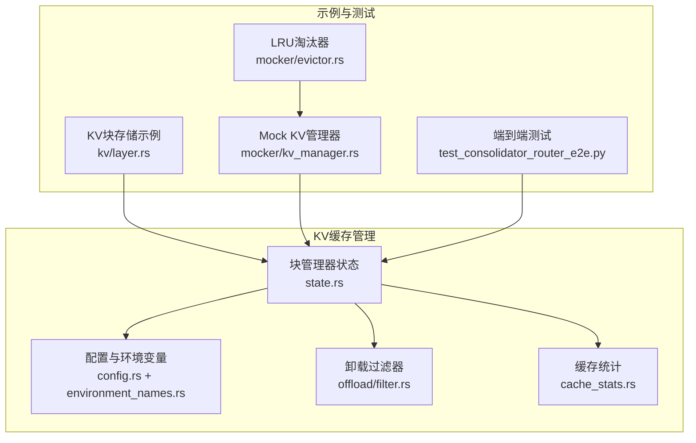
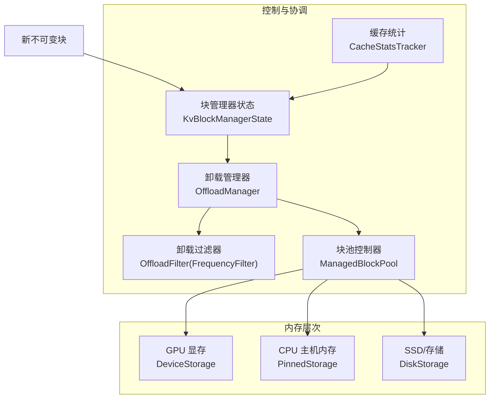
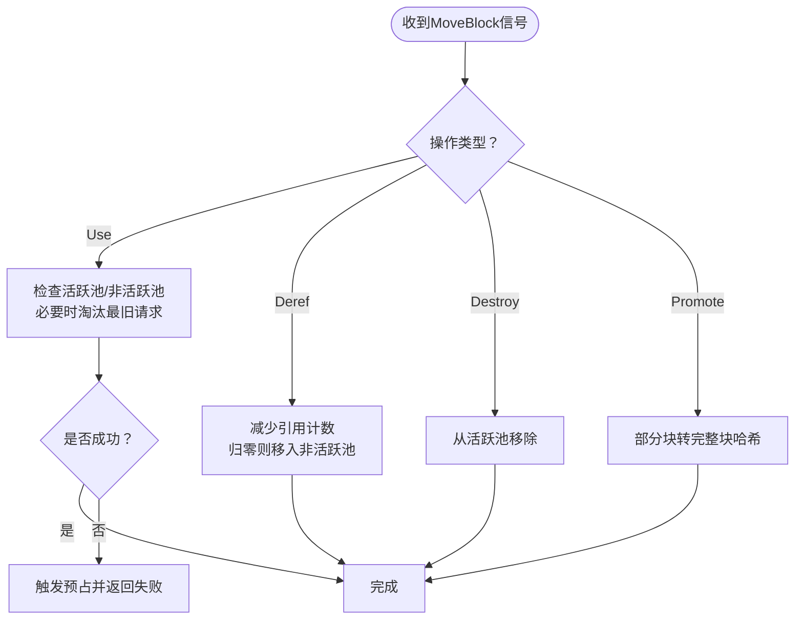
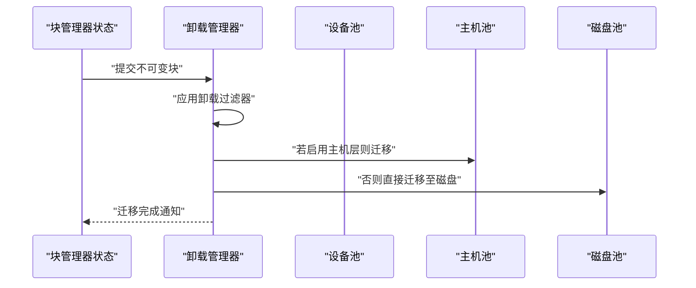
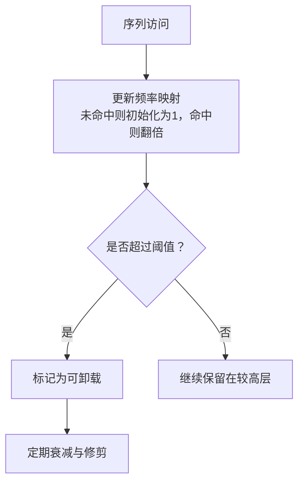
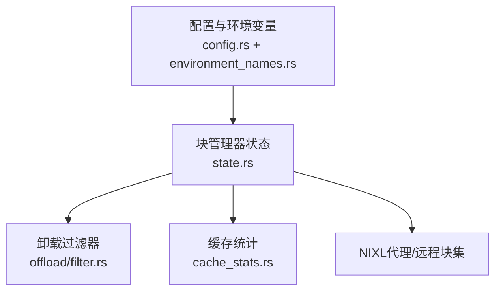

# KV缓存卸载

<cite>
**本文引用的文件**
- [lib/llm/src/block_manager/state.rs](file://lib/llm/src/block_manager/state.rs)
- [lib/llm/src/block_manager/config.rs](file://lib/llm/src/block_manager/config.rs)
- [lib/llm/src/block_manager/offload/filter.rs](file://lib/llm/src/block_manager/offload/filter.rs)
- [lib/bindings/kvbm/src/block_manager/cache_stats.rs](file://lib/bindings/kvbm/src/block_manager/cache_stats.rs)
- [lib/runtime/src/config/environment_names.rs](file://lib/runtime/src/config/environment_names.rs)
- [lib/bindings/kvbm/README.md](file://lib/bindings/kvbm/README.md)
- [lib/llm/src/block_manager.md](file://lib/llm/src/block_manager.md)
- [lib/llm/src/kv/layer.rs](file://lib/llm/src/kv/layer.rs)
- [lib/mocker/src/kv_manager.rs](file://lib/mocker/src/kv_manager.rs)
- [lib/mocker/src/evictor.rs](file://lib/mocker/src/evictor.rs)
- [tests/kvbm_integration/test_consolidator_router_e2e.py](file://tests/kvbm_integration/test_consolidator_router_e2e.py)
</cite>

## 目录
1. [简介](#简介)
2. [项目结构](#项目结构)
3. [核心组件](#核心组件)
4. [架构总览](#架构总览)
5. [详细组件分析](#详细组件分析)
6. [依赖关系分析](#依赖关系分析)
7. [性能考量](#性能考量)
8. [故障排查指南](#故障排查指南)
9. [结论](#结论)
10. [附录](#附录)

## 简介
本文件围绕NVIDIA Dynamo的KV缓存卸载能力，系统阐述其如何通过多级内存层次（GPU显存、主机内存、持久化存储）提升推理吞吐与资源利用率。文档覆盖缓存策略选择、内存层次管理、数据迁移算法、命中率优化、内存压力处理与数据一致性保障等主题，并结合代码库中的实现细节，给出配置参数详解与实操建议。

## 项目结构
与KV缓存卸载直接相关的核心模块分布于以下路径：
- LLM运行时与块管理：lib/llm/src/block_manager/*
- KV块布局与存储示例：lib/llm/src/kv/*
- KVBM统计与指标：lib/bindings/kvbm/src/block_manager/cache_stats.rs
- 环境变量与配置项：lib/runtime/src/config/environment_names.rs
- KVBM集成与部署说明：lib/bindings/kvbm/README.md
- Mock测试与淘汰策略：lib/mocker/src/kv_manager.rs、lib/mocker/src/evictor.rs
- 文档图示：lib/llm/src/block_manager.md

**图表来源**
- [lib/llm/src/block_manager/state.rs](file://lib/llm/src/block_manager/state.rs#L101-L213)
- [lib/llm/src/block_manager/config.rs](file://lib/llm/src/block_manager/config.rs#L162-L224)
- [lib/llm/src/block_manager/offload/filter.rs](file://lib/llm/src/block_manager/offload/filter.rs#L17-L125)
- [lib/bindings/kvbm/src/block_manager/cache_stats.rs](file://lib/bindings/kvbm/src/block_manager/cache_stats.rs#L1-L120)
- [lib/llm/src/kv/layer.rs](file://lib/llm/src/kv/layer.rs#L1268-L1437)
- [lib/mocker/src/kv_manager.rs](file://lib/mocker/src/kv_manager.rs#L1-L124)
- [lib/mocker/src/evictor.rs](file://lib/mocker/src/evictor.rs#L1-L51)
- [tests/kvbm_integration/test_consolidator_router_e2e.py](file://tests/kvbm_integration/test_consolidator_router_e2e.py#L759-L769)

**章节来源**
- [lib/llm/src/block_manager/state.rs](file://lib/llm/src/block_manager/state.rs#L101-L213)
- [lib/llm/src/block_manager/config.rs](file://lib/llm/src/block_manager/config.rs#L162-L224)
- [lib/llm/src/block_manager.md](file://lib/llm/src/block_manager.md#L90-L125)

## 核心组件
- 块管理器状态（KvBlockManagerState）
  - 负责在设备(G1)、主机(G2)、磁盘(G3)三类存储之间协调块池与卸载流程；支持本地与分布式两种模式。
  - 提供enqueue_offload_block/onboard_blocks等接口，驱动OffloadManager执行异步迁移。
- 配置与环境变量
  - 通过KvBlockManagerConfig定义模型与布局配置；通过环境变量控制CPU/GPU缓存大小、对象存储、传输批大小、领导者超时等。
  - 提供should_bypass_cpu_cache()用于判定是否跳过主机层直连磁盘卸载。
- 卸载过滤器（OffloadFilter）
  - 基于序列使用频率的动态过滤策略，支持定期衰减与容量修剪，决定哪些块应被卸载至更低层级。
- 缓存统计（CacheStatsTracker）
  - 滑动窗口统计主机与磁盘命中率，周期性输出日志，便于观测与调优。
- 示例与测试
  - kv/layer.rs展示不同布局（如KvFirst/BlockFirst）下的块分配与主机/设备间拷贝。
  - mocker模块提供同步KV管理器与LRU淘汰器，便于理解缓存生命周期与预占逻辑。

**章节来源**
- [lib/llm/src/block_manager/state.rs](file://lib/llm/src/block_manager/state.rs#L50-L96)
- [lib/llm/src/block_manager/config.rs](file://lib/llm/src/block_manager/config.rs#L162-L224)
- [lib/llm/src/block_manager/offload/filter.rs](file://lib/llm/src/block_manager/offload/filter.rs#L17-L125)
- [lib/bindings/kvbm/src/block_manager/cache_stats.rs](file://lib/bindings/kvbm/src/block_manager/cache_stats.rs#L1-L120)
- [lib/llm/src/kv/layer.rs](file://lib/llm/src/kv/layer.rs#L1268-L1437)
- [lib/mocker/src/kv_manager.rs](file://lib/mocker/src/kv_manager.rs#L1-L124)
- [lib/mocker/src/evictor.rs](file://lib/mocker/src/evictor.rs#L1-L51)

## 架构总览
下图展示了KV缓存卸载在多内存层次中的数据流与控制流，以及OffloadManager在其中的角色。

**图表来源**
- [lib/llm/src/block_manager/state.rs](file://lib/llm/src/block_manager/state.rs#L145-L169)
- [lib/llm/src/block_manager/offload/filter.rs](file://lib/llm/src/block_manager/offload/filter.rs#L17-L125)
- [lib/bindings/kvbm/src/block_manager/cache_stats.rs](file://lib/bindings/kvbm/src/block_manager/cache_stats.rs#L1-L120)

**章节来源**
- [lib/llm/src/block_manager.md](file://lib/llm/src/block_manager.md#L90-L125)

## 详细组件分析

### KV缓存管理器工作原理
- 生命周期与引用计数
  - 使用活跃/非活跃块集合跟踪引用计数；当引用降至零时，块进入非活跃池等待回收或迁移。
  - 支持Use/Deref/Destroy/Promote四种信号，分别对应使用、去引用、销毁与部分块到完整块的转换。
- 预占与水位控制
  - 在空间不足时触发预占（preemption），优先淘汰最旧的活跃请求以腾挪空间。
- 事件发布
  - 将存储/移除事件封装为KV缓存事件并经sink发布，便于路由与监控。

**图表来源**
- [lib/mocker/src/kv_manager.rs](file://lib/mocker/src/kv_manager.rs#L1-L124)
- [lib/mocker/src/evictor.rs](file://lib/mocker/src/evictor.rs#L1-L51)

**章节来源**
- [lib/mocker/src/kv_manager.rs](file://lib/mocker/src/kv_manager.rs#L1-L124)
- [lib/mocker/src/evictor.rs](file://lib/mocker/src/evictor.rs#L1-L51)

### 内存层次管理与数据迁移
- 层次划分与分配
  - 设备(G1)：通常为GPU显存，承载当前活跃解码所需的块。
  - 主机(G2)：CPU固定内存，作为中间层以缓解显存压力。
  - 磁盘(G3)：持久化存储，用于长期驻留与大容量缓存。
- 直接磁盘卸载
  - 当仅配置磁盘缓存且未配置CPU缓存时，系统可绕过主机层，直接进行GPU→磁盘卸载，降低延迟与带宽占用。
- 迁移与校验
  - 示例中展示了主机与设备之间的块拷贝与数据验证流程，体现跨层数据一致性保障。

**图表来源**
- [lib/llm/src/block_manager/state.rs](file://lib/llm/src/block_manager/state.rs#L145-L169)
- [lib/llm/src/kv/layer.rs](file://lib/llm/src/kv/layer.rs#L1268-L1286)

**章节来源**
- [lib/llm/src/block_manager/state.rs](file://lib/llm/src/block_manager/state.rs#L101-L213)
- [lib/llm/src/kv/layer.rs](file://lib/llm/src/kv/layer.rs#L1268-L1437)

### 缓存策略与命中率优化
- 频率过滤器（FrequencyFilter）
  - 基于序列使用频率动态决策是否卸载；采用“双倍增长+递减衰减”的策略，避免长期不活跃块占用低层缓存。
  - 支持最大条目数限制与超限时通知，确保内存占用可控。
- 缓存统计（滑动窗口）
  - 统计主机与磁盘命中块数量与总查询块数，计算命中率并周期性输出，辅助调参与容量规划。

**图表来源**
- [lib/llm/src/block_manager/offload/filter.rs](file://lib/llm/src/block_manager/offload/filter.rs#L28-L125)
- [lib/bindings/kvbm/src/block_manager/cache_stats.rs](file://lib/bindings/kvbm/src/block_manager/cache_stats.rs#L1-L120)

**章节来源**
- [lib/llm/src/block_manager/offload/filter.rs](file://lib/llm/src/block_manager/offload/filter.rs#L28-L125)
- [lib/bindings/kvbm/src/block_manager/cache_stats.rs](file://lib/bindings/kvbm/src/block_manager/cache_stats.rs#L1-L120)

### 内存压力处理与一致性保证
- 内存压力处理
  - 通过LRU淘汰器与预占机制，在空间不足时优先释放最久未使用的块；频率过滤器进一步抑制低价值块常驻。
- 数据一致性
  - 跨层迁移后进行数据校验（示例中对主机/设备拷贝后的数据进行断言），确保一致性。
  - 事件发布机制保证上层（如路由器）能感知到缓存状态变化，维持全局一致性视图。

**章节来源**
- [lib/mocker/src/evictor.rs](file://lib/mocker/src/evictor.rs#L1-L51)
- [lib/llm/src/kv/layer.rs](file://lib/llm/src/kv/layer.rs#L1268-L1286)
- [lib/mocker/src/kv_manager.rs](file://lib/mocker/src/kv_manager.rs#L110-L124)

## 依赖关系分析
- 组件耦合
  - KvBlockManagerState依赖OffloadManager与各层级块池；OffloadManager依赖过滤器与异步运行时。
  - 配置模块提供环境变量解析与策略判定（如绕过CPU缓存）。
- 外部依赖
  - NIXL代理用于跨节点块描述符注册与远程块访问；对象存储与传输批大小等由环境变量控制。

**图表来源**
- [lib/llm/src/block_manager/config.rs](file://lib/llm/src/block_manager/config.rs#L162-L224)
- [lib/llm/src/block_manager/state.rs](file://lib/llm/src/block_manager/state.rs#L101-L213)
- [lib/llm/src/block_manager/offload/filter.rs](file://lib/llm/src/block_manager/offload/filter.rs#L17-L125)
- [lib/bindings/kvbm/src/block_manager/cache_stats.rs](file://lib/bindings/kvbm/src/block_manager/cache_stats.rs#L1-L120)

**章节来源**
- [lib/llm/src/block_manager/config.rs](file://lib/llm/src/block_manager/config.rs#L162-L224)
- [lib/llm/src/block_manager/state.rs](file://lib/llm/src/block_manager/state.rs#L101-L213)

## 性能考量
- 层次选择
  - 仅配置磁盘缓存且未配置CPU缓存时，启用“直连磁盘”路径，减少一次跨层复制，降低延迟与带宽消耗。
- 批量传输
  - 通过传输批大小参数控制单次迁移块数，平衡吞吐与并发度。
- 对象存储
  - 可选启用对象存储作为额外缓存层，需配置桶名、端点、认证信息与块数上限。
- 统计与可观测性
  - 启用缓存统计滑动窗口与指标端点，持续监控命中率与迁移速率，指导容量与策略调优。

**章节来源**
- [lib/llm/src/block_manager/config.rs](file://lib/llm/src/block_manager/config.rs#L270-L305)
- [lib/runtime/src/config/environment_names.rs](file://lib/runtime/src/config/environment_names.rs#L174-L241)
- [lib/bindings/kvbm/README.md](file://lib/bindings/kvbm/README.md#L75-L96)
- [lib/bindings/kvbm/src/block_manager/cache_stats.rs](file://lib/bindings/kvbm/src/block_manager/cache_stats.rs#L1-L120)

## 故障排查指南
- 配置错误
  - 若未配置任一缓存层级（CPU/GPU任一），会触发配置错误提示，需至少配置一个层级。
- 磁盘对齐与O_DIRECT
  - 某些文件系统不支持fallocate或需要严格4096字节对齐，需开启零填充回退或禁用O_DIRECT以兼容。
- 领导者/工作者初始化超时
  - 分布式模式下，KVBM领导者与工作者初始化超时可通过环境变量调整，避免大规模内存/存储分配导致的超时。
- 命中率异常
  - 结合滑动窗口统计与日志，定位主机/磁盘命中率波动原因，调整频率过滤阈值与批大小。

**章节来源**
- [lib/llm/src/block_manager/distributed/leader.rs](file://lib/llm/src/block_manager/distributed/leader.rs#L73-L94)
- [lib/bindings/kvbm/README.md](file://lib/bindings/kvbm/README.md#L75-L96)
- [lib/runtime/src/config/environment_names.rs](file://lib/runtime/src/config/environment_names.rs#L234-L241)
- [lib/bindings/kvbm/src/block_manager/cache_stats.rs](file://lib/bindings/kvbm/src/block_manager/cache_stats.rs#L1-L120)

## 结论
Dynamo的KV缓存卸载通过明确的多级内存层次、可插拔的卸载过滤策略与完善的统计监控，实现了在高并发推理场景下的高效缓存管理。合理配置CPU/GPU/磁盘缓存与传输参数，结合频率过滤与滑动窗口统计，可在保证数据一致性的同时显著提升系统吞吐与资源利用率。

## 附录

### 配置参数详解（节选）
- CPU缓存
  - DYN_KVBM_CPU_CACHE_GB：主机固定内存缓存大小（GB）
  - DYN_KVBM_CPU_CACHE_OVERRIDE_NUM_BLOCKS：主机块数覆盖
- 磁盘缓存
  - DYN_KVBM_DISK_CACHE_GB：磁盘缓存大小（GB）
  - DYN_KVBM_DISK_CACHE_OVERRIDE_NUM_BLOCKS：磁盘块数覆盖
  - DYN_KVBM_DISK_CACHE_DIR：磁盘缓存目录
  - DYN_KVBM_DISK_ZEROFILL_FALLBACK：fallocate不支持时启用零填充
  - DYN_KVBM_DISK_DISABLE_O_DIRECT：禁用O_DIRECT（调试/兼容）
- 对象存储
  - DYN_KVBM_OBJECT_ENABLED：启用对象存储
  - DYN_KVBM_OBJECT_BUCKET：桶名（支持{worker_id}模板）
  - DYN_KVBM_OBJECT_ENDPOINT/REGION/ACCESS_KEY/SECRET_KEY：端点与认证
  - DYN_KVBM_OBJECT_NUM_BLOCKS：对象存储中缓存的块数
- 传输与领导者
  - DYN_KVBM_TRANSFER_BATCH_SIZE：单批迁移块数
  - DYN_KVBM_LEADER_WORKER_INIT_TIMEOUT_SECS：领导者/工作者初始化超时
  - DYN_KVBM_LEADER_ZMQ_HOST：ZMQ主机地址
- 指标与调试
  - DYN_KVBM_METRICS：启用指标端点
  - DYN_KVBM_METRICS_PORT：指标端口
  - DYN_KVBM_DISABLE_DISK_OFFLOAD_FILTER：禁用磁盘卸载过滤（移除SSD寿命保护）
  - DYN_KVBM_HOST_OFFLOAD_PREFIX_MIN_PRIORITY：主机卸载前缀最小优先级（0-100）

**章节来源**
- [lib/runtime/src/config/environment_names.rs](file://lib/runtime/src/config/environment_names.rs#L174-L241)
- [lib/bindings/kvbm/README.md](file://lib/bindings/kvbm/README.md#L75-L96)

### 实际使用案例
- 端到端合并器与路由器测试
  - 通过设置较小的GPU缓存与适中的CPU/磁盘缓存，验证重复前缀去重与缓存命中率的协同效果。
- 示例参数组合
  - G1: 10块（极小GPU缓存以强制驱逐）
  - G2: 5块（略小于GPU但足以保留热点）
  - G3: 5块（同上）
  - 基于上述配置计算最优测试参数，观察整体吞吐与命中率表现。

**章节来源**
- [tests/kvbm_integration/test_consolidator_router_e2e.py](file://tests/kvbm_integration/test_consolidator_router_e2e.py#L759-L769)