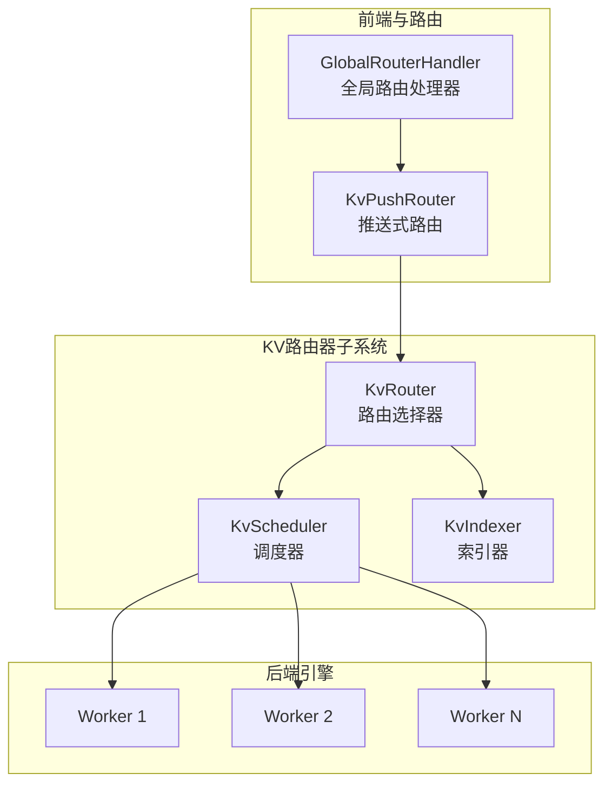
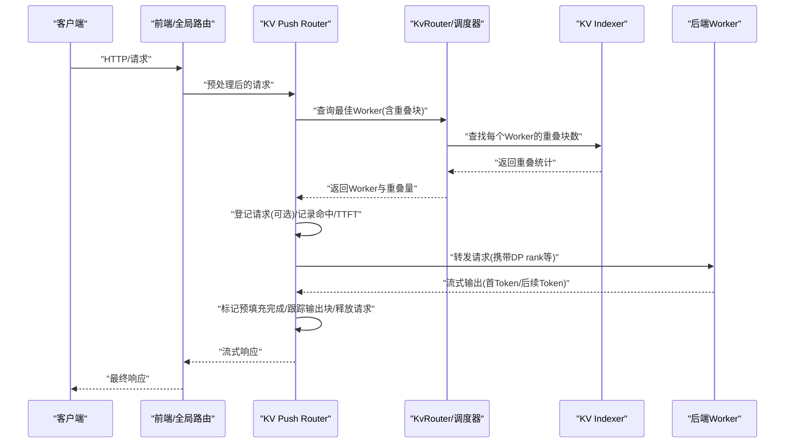
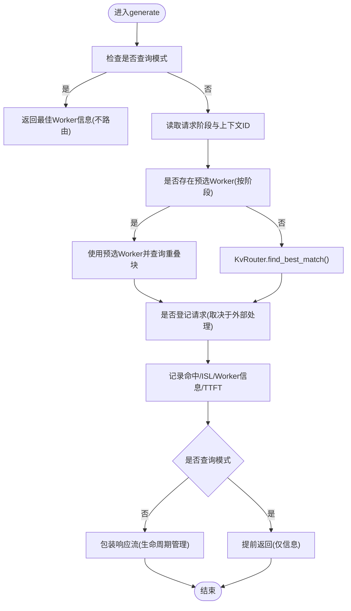
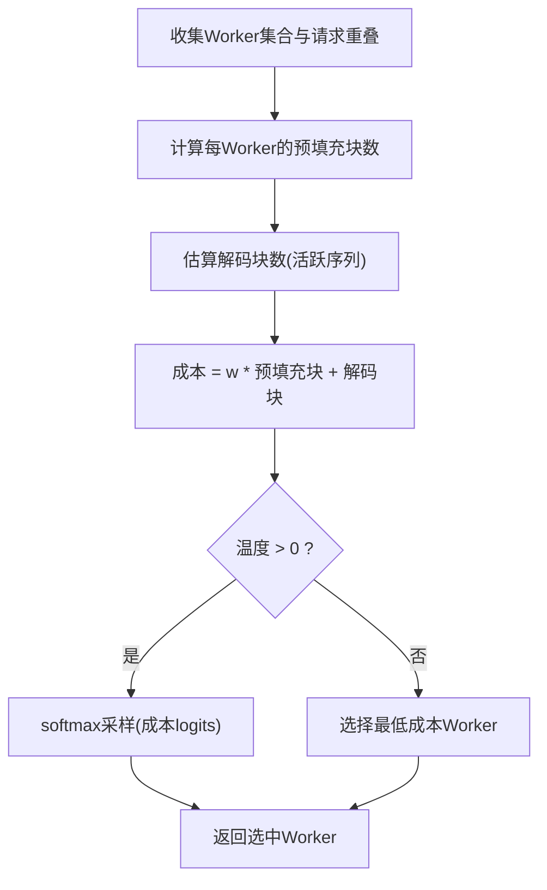
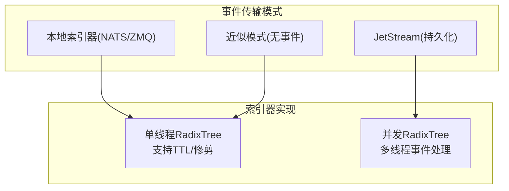
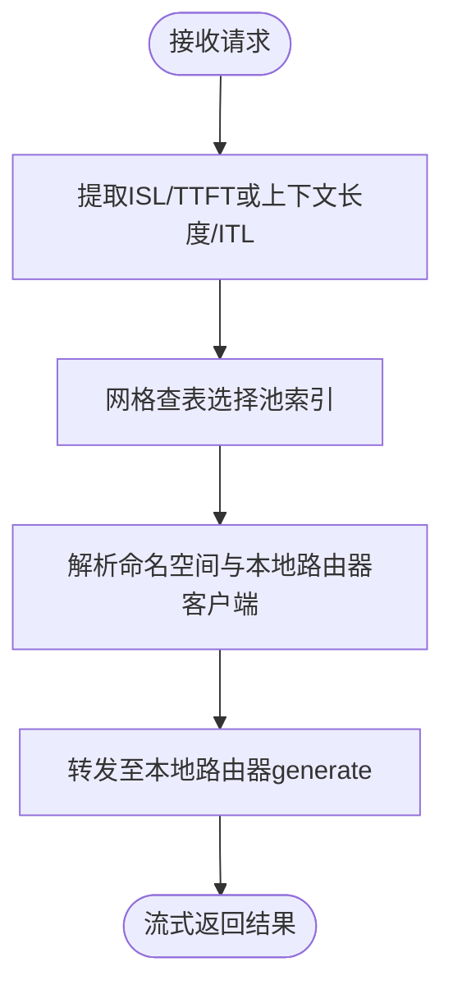
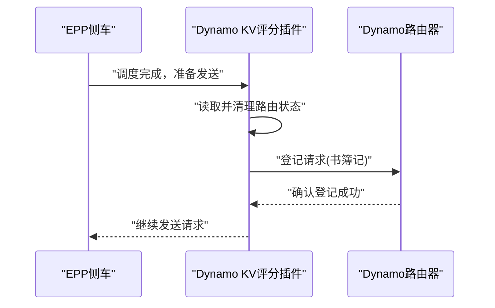
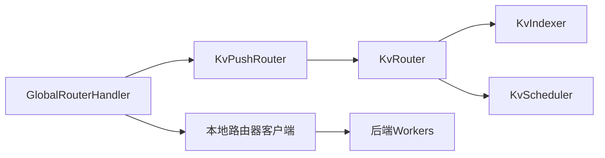

# LLM感知请求路由

<cite>
**本文引用的文件**
- [push_router.rs](file://lib/llm/src/kv_router/push_router.rs)
- [config.rs](file://lib/llm/src/kv_router/config.rs)
- [router-design.md](file://docs/pages/design-docs/router-design.md)
- [router-guide.md](file://docs/pages/components/router/router-guide.md)
- [pool_selection.py](file://components/src/dynamo/global_router/pool_selection.py)
- [handler.py](file://components/src/dynamo/global_router/handler.py)
- [global_router_config.json](file://examples/hierarchical_planner/global_router_config.json)
- [plugin.go](file://deploy/inference-gateway/epp/pkg/plugins/dynamo_kv_scorer/plugin.go)
- [lib.rs](file://lib/bindings/c/src/lib.rs)
- [model_manager.rs](file://lib/llm/src/discovery/model_manager.rs)
- [kv_router.rs](file://lib/llm/src/kv_router.rs)
- [scheduler.rs](file://lib/llm/src/kv_router/scheduler.rs)
- [indexer.rs](file://lib/kv-router/src/indexer.rs)
</cite>

## 目录
1. [简介](#简介)
2. [项目结构](#项目结构)
3. [核心组件](#核心组件)
4. [架构总览](#架构总览)
5. [详细组件分析](#详细组件分析)
6. [依赖关系分析](#依赖关系分析)
7. [性能考量](#性能考量)
8. [故障排查指南](#故障排查指南)
9. [结论](#结论)
10. [附录](#附录)

## 简介
本文件面向NVIDIA Dynamo的LLM感知请求路由能力，系统化阐述如何基于KV缓存状态信息进行智能请求分发，最大化KV缓存重用，减少重复计算，提升吞吐与延迟指标。文档覆盖路由算法原理、重用率计算方法、负载均衡与温度采样、事件传输模式（本地索引器与JetStream）、故障恢复与副本同步、以及配置参数与部署实践。

## 项目结构
围绕LLM感知路由的关键代码分布在以下模块：
- Rust核心：KV路由器、调度器、索引器、推送式路由封装
- 文档：设计文档与使用指南
- 全局路由器：分层路由到预填充/解码池
- 前端插件与绑定：与Inference Gateway集成的KV评分与书簿记

**图表来源**
- [push_router.rs](file://lib/llm/src/kv_router/push_router.rs#L135-L402)
- [kv_router.rs](file://lib/llm/src/kv_router.rs#L269-L337)
- [scheduler.rs](file://lib/llm/src/kv_router/scheduler.rs#L82-L482)
- [indexer.rs](file://lib/kv-router/src/indexer.rs#L597-L619)

**章节来源**
- [push_router.rs](file://lib/llm/src/kv_router/push_router.rs#L1-L402)
- [router-design.md](file://docs/pages/design-docs/router-design.md#L1-L321)

## 核心组件
- KV Push Router：在生成阶段根据请求上下文与阶段（预填充/解码/聚合）选择最佳工作节点，并在需要时登记请求生命周期（添加、标记预填充完成、释放），同时记录命中与延迟指标。
- KV Router：负责与索引器交互，查询各Worker的KV缓存重叠块数，计算成本并选择最优Worker；支持事件订阅与近似模式下的本地预测。
- 调度器与选择器：默认选择器以“重叠权重×预填充块数+解码块数”作为成本函数，可选温度采样引入随机性。
- 索引器：维护全局KV前缀树，支持单线程RadixTree与并发RadixTree两种实现，以及JetStream持久化与快照。
- 全局路由器：按网格策略将请求路由到预填充/解码池，支持多命名空间与动态阈值配置。

**章节来源**
- [push_router.rs](file://lib/llm/src/kv_router/push_router.rs#L27-L133)
- [kv_router.rs](file://lib/llm/src/kv_router.rs#L110-L135)
- [scheduler.rs](file://lib/llm/src/kv_router/scheduler.rs#L453-L482)
- [indexer.rs](file://lib/kv-router/src/indexer.rs#L597-L619)
- [pool_selection.py](file://components/src/dynamo/global_router/pool_selection.py#L22-L139)
- [handler.py](file://components/src/dynamo/global_router/handler.py#L23-L232)

## 架构总览
下图展示KV感知路由从请求进入前端到后端执行的关键路径，以及事件流与状态同步：

**图表来源**
- [push_router.rs](file://lib/llm/src/kv_router/push_router.rs#L158-L400)
- [router-design.md](file://docs/pages/design-docs/router-design.md#L110-L169)

## 详细组件分析

### KV Push Router：三类路由行为与生命周期管理
- 查询模式：当请求带有特定注解时，仅返回最佳Worker而不实际路由，不更新本地状态，用于外部编排查询。
- 指定实例路由：若请求显式指定后端实例ID，则直接路由到该实例，绕过常规KV匹配逻辑，但仍可登记请求（取决于是否为查询模式或外部处理）。
- 默认路由：基于KV缓存重叠计算成本，选择最低成本Worker，登记请求生命周期，跟踪命中与延迟，并在完成后释放资源。

关键流程要点：
- 阶段识别：根据Tracker推断当前阶段（预填充/解码/聚合），影响成本计算与登记行为。
- 近似模式：当未启用KV事件时，记录路由决策以便索引器基于路由推断缓存状态。
- 生命周期包装：对响应流进行包装，在收到首个实际Token时标记预填充完成，按需跟踪输出块并记录ITL；请求结束时释放资源。

**图表来源**
- [push_router.rs](file://lib/llm/src/kv_router/push_router.rs#L158-L400)

**章节来源**
- [push_router.rs](file://lib/llm/src/kv_router/push_router.rs#L135-L402)

### KV Router与调度器：成本函数与选择策略
- 成本函数：成本 = 重叠权重 × 预填充块数 + 解码块数。较低成本代表更优选择；重叠权重越高，越偏向缓存重用（改善TTFT），越低则更关注负载均衡（改善ITL）。
- 选择策略：默认选择器按成本排序；当温度参数大于0时，对成本logits做softmax采样，引入随机性以改善分布。
- 温度采样：通过归一化概率分布进行抽样，避免单一Worker被过度饱和。

**图表来源**
- [router-design.md](file://docs/pages/design-docs/router-design.md#L110-L126)
- [scheduler.rs](file://lib/llm/src/kv_router/scheduler.rs#L467-L482)

**章节来源**
- [router-design.md](file://docs/pages/design-docs/router-design.md#L54-L75)
- [scheduler.rs](file://lib/llm/src/kv_router/scheduler.rs#L453-L482)

### KV索引器与事件传输模式
- 本地索引器（默认）：Worker维护本地RadixTree并通过事件平面发布事件；路由器启动时查询Worker重建状态；支持TTL与修剪；适合低延迟与简单部署。
- JetStream（持久化）：KV事件写入JetStream，路由器作为持久消费者拉取；支持重启后状态恢复与快照；适合生产多副本一致性场景。
- 近似模式：禁用事件订阅时，路由器基于自身路由决策进行本地预测，带TTL与修剪，适用于无事件支持或事件不可靠场景。

**图表来源**
- [router-design.md](file://docs/pages/design-docs/router-design.md#L151-L265)
- [indexer.rs](file://lib/kv-router/src/indexer.rs#L597-L619)

**章节来源**
- [router-design.md](file://docs/pages/design-docs/router-design.md#L151-L265)
- [kv_router.rs](file://lib/llm/src/kv_router.rs#L137-L145)

### 全局路由器：分层池选择与网格策略
- 预填充池选择：基于输入序列长度(ISL)与目标TTFT，查表映射到预填充池。
- 解码池选择：基于上下文长度与目标ITL，查表映射到解码池。
- 配置驱动：通过JSON配置定义网格分辨率、范围与映射矩阵；运行时加载并校验一致性。

**图表来源**
- [handler.py](file://components/src/dynamo/global_router/handler.py#L122-L214)
- [pool_selection.py](file://components/src/dynamo/global_router/pool_selection.py#L22-L139)
- [global_router_config.json](file://examples/hierarchical_planner/global_router_config.json#L1-L24)

**章节来源**
- [handler.py](file://components/src/dynamo/global_router/handler.py#L23-L232)
- [pool_selection.py](file://components/src/dynamo/global_router/pool_selection.py#L141-L318)
- [global_router_config.json](file://examples/hierarchical_planner/global_router_config.json#L1-L24)

### 与Inference Gateway的集成：KV评分与书簿记
- EPP插件在调度后、请求发送前注册请求到Dynamo路由器的书簿记，确保已确定调度不会出现“幽灵登记”。
- C绑定提供从GAIE流水线中添加请求的接口，自动计算重叠块并登记，避免重复计算。

**图表来源**
- [plugin.go](file://deploy/inference-gateway/epp/pkg/plugins/dynamo_kv_scorer/plugin.go#L407-L433)
- [lib.rs](file://lib/bindings/c/src/lib.rs#L851-L884)

**章节来源**
- [plugin.go](file://deploy/inference-gateway/epp/pkg/plugins/dynamo_kv_scorer/plugin.go#L407-L433)
- [lib.rs](file://lib/bindings/c/src/lib.rs#L851-L884)

## 依赖关系分析
- 组件耦合：
  - KV Push Router依赖KvRouter进行Worker选择与登记。
  - KvRouter依赖KvIndexer进行全局KV重叠统计，依赖KvScheduler进行活跃序列与成本计算。
  - 全局路由器Handler依赖本地路由器客户端，按网格策略进行池间路由。
- 外部依赖：
  - NATS/JetStream事件平面用于KV事件与状态同步。
  - 后端引擎需发布KV事件或在禁用事件时支持近似模式。

**图表来源**
- [push_router.rs](file://lib/llm/src/kv_router/push_router.rs#L27-L45)
- [kv_router.rs](file://lib/llm/src/kv_router.rs#L269-L337)
- [handler.py](file://components/src/dynamo/global_router/handler.py#L57-L120)

**章节来源**
- [push_router.rs](file://lib/llm/src/kv_router/push_router.rs#L27-L45)
- [kv_router.rs](file://lib/llm/src/kv_router.rs#L269-L337)
- [handler.py](file://components/src/dynamo/global_router/handler.py#L57-L120)

## 性能考量
- 成本函数权衡：重叠权重越高，TTFT越优但可能牺牲ITL；建议根据工作负载特征迭代调整。
- 温度采样：适度随机性有助于缓解热点，但过高会增加抖动，应结合监控指标逐步调优。
- 事件传输模式：JetStream提供更强一致性与持久化，但存在额外延迟；本地索引器低延迟但依赖Worker可达性。
- 输出块跟踪：对长生成任务启用输出块跟踪并应用衰减，可更准确估计解码负载，提升负载均衡精度。
- 副本同步：启用路由器副本同步可快速收敛活跃块视图，降低因状态不一致导致的次优路由。

[本节为通用性能建议，无需具体文件分析]

## 故障排查指南
- 事件订阅未生效：
  - 检查是否启用了KV事件与重叠权重；当二者之一为0时，索引器不会订阅事件。
  - 在JetStream模式下，前后端需同时开启持久化标志。
- 状态不一致或重启后丢失：
  - 使用JetStream模式并在重启时加载快照；或在本地索引器模式下等待路由器重建状态。
- 请求未登记或提前释放：
  - 确认是否处于查询模式或外部已接管书簿记；检查生命周期包装逻辑是否正常触发首个Token标记与释放。
- 全局路由网格异常：
  - 校验配置文件中的网格分辨率、范围与映射矩阵维度一致性；确保命名空间与本地路由器可用。

**章节来源**
- [config.rs](file://lib/llm/src/kv_router/config.rs#L153-L164)
- [router-design.md](file://docs/pages/design-docs/router-design.md#L159-L169)
- [push_router.rs](file://lib/llm/src/kv_router/push_router.rs#L288-L398)
- [pool_selection.py](file://components/src/dynamo/global_router/pool_selection.py#L208-L253)

## 结论
通过将KV缓存重叠与活跃块负载纳入统一的成本函数，Dynamo的LLM感知路由能够在预填充与解码阶段实现高效、公平的请求分发。配合事件传输模式、副本同步与动态阈值配置，可在不同部署形态下获得稳定且可调的吞吐与延迟表现。建议以工作负载为目标指标，结合监控数据迭代优化重叠权重与温度参数，并根据基础设施选择合适的事件传输模式。

[本节为总结性内容，无需具体文件分析]

## 附录

### 路由决策逻辑与重用率计算
- 重叠块数：来自KV索引器对请求tokens的前缀匹配统计，反映可复用的KV缓存块数量。
- 重用率：重叠块数占输入序列块数的比例，用于记录命中与评估路由效果。
- 成本计算：预填充块数 = 输入tokens数 - 重叠块数×块大小；解码块数 = 当前活跃序列的块数；成本 = 重叠权重×预填充块 + 解码块。

**章节来源**
- [router-design.md](file://docs/pages/design-docs/router-design.md#L110-L126)
- [push_router.rs](file://lib/llm/src/kv_router/push_router.rs#L224-L234)

### 负载均衡策略与故障转移
- 负载均衡：默认按成本最小化选择Worker；温度采样引入随机性以改善分布。
- 故障转移：全局路由器按网格策略将请求路由到不同池，具备多命名空间与多副本能力；JetStream模式支持跨副本状态恢复。

**章节来源**
- [scheduler.rs](file://lib/llm/src/kv_router/scheduler.rs#L433-L451)
- [handler.py](file://components/src/dynamo/global_router/handler.py#L122-L214)
- [router-design.md](file://docs/pages/design-docs/router-design.md#L339-L387)

### 配置参数详解（节选）
- 重叠权重：平衡TTFT与ITL，越高越倾向缓存重用。
- 温度：控制选择随机性，0为确定性，>0引入采样。
- 事件模式：启用/禁用KV事件；JetStream持久化；副本同步；输出块跟踪；假设KV重用等。
- 近似模式参数：TTL、最大树大小、修剪目标比例等。

**章节来源**
- [router-guide.md](file://docs/pages/components/router/router-guide.md#L143-L199)
- [config.rs](file://lib/llm/src/kv_router/config.rs#L22-L99)

### 实际部署示例
- Python/CLI：启用KV路由模式并设置端口。
- Kubernetes：在前端服务中设置环境变量启用KV路由。
- 全局路由：通过JSON配置定义池数量、命名空间与网格映射，运行时加载并初始化本地路由器客户端。

**章节来源**
- [router-guide.md](file://docs/pages/components/router/router-guide.md#L14-L83)
- [global_router_config.json](file://examples/hierarchical_planner/global_router_config.json#L1-L24)
- [handler.py](file://components/src/dynamo/global_router/handler.py#L70-L121)