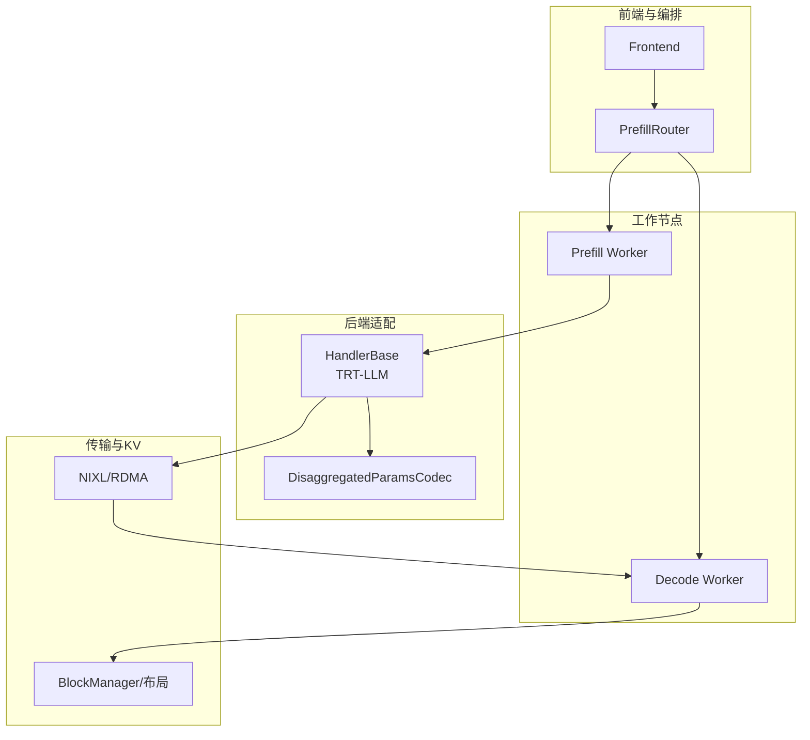
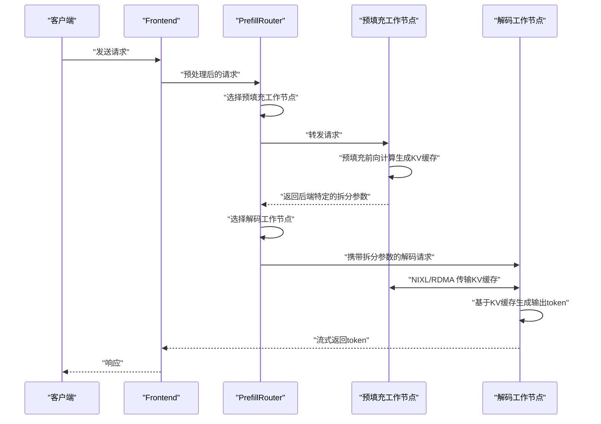
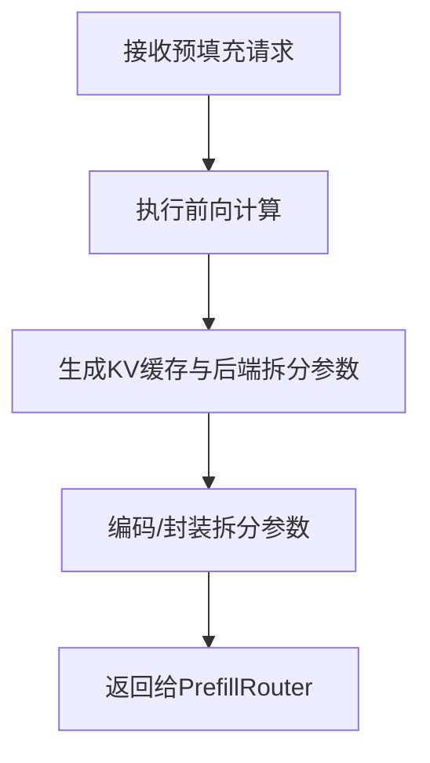
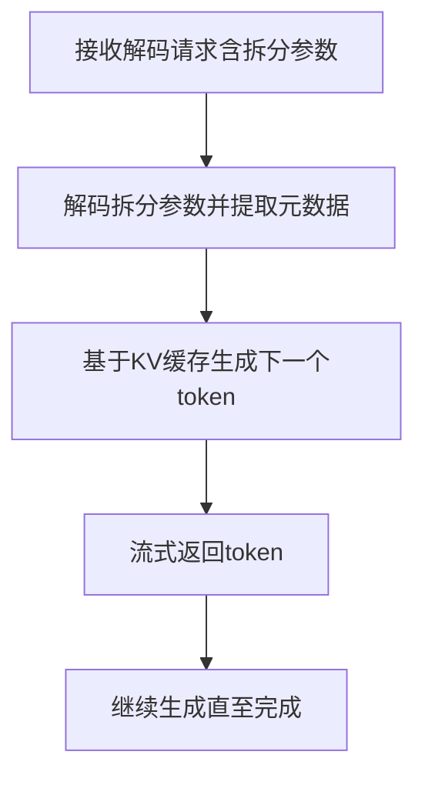
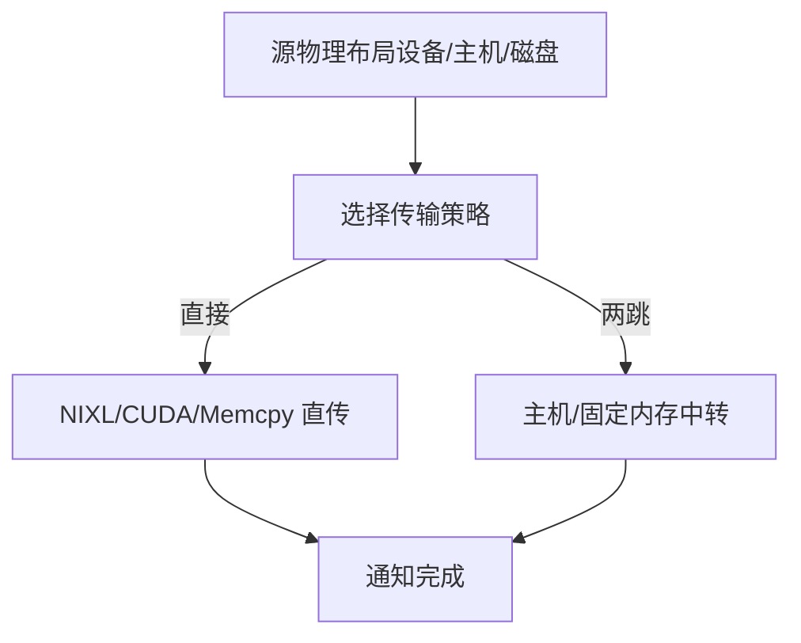
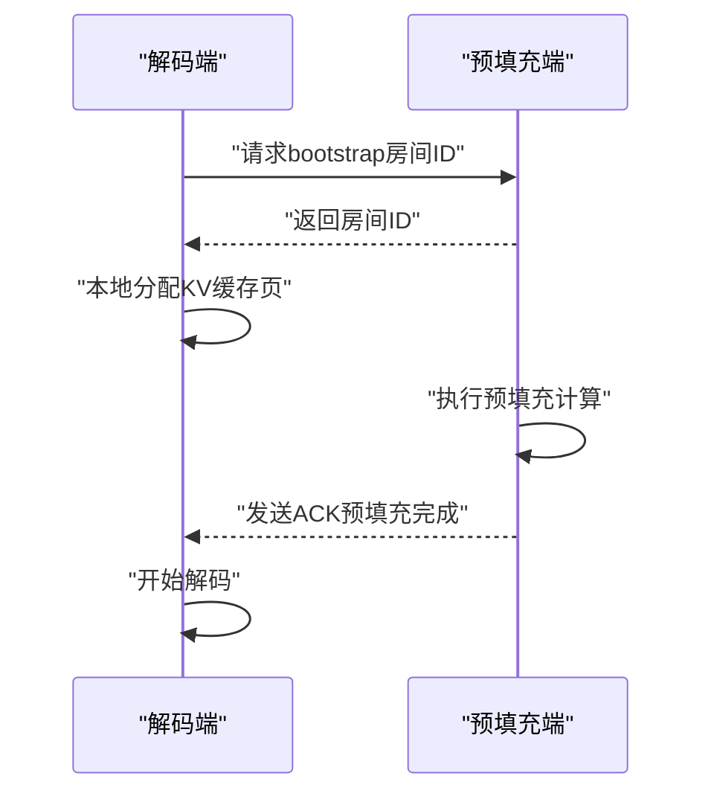
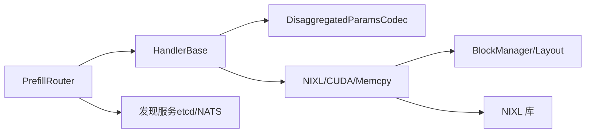

# 分割式预填充与解码

<cite>
**本文引用的文件**
- [disagg-serving.md](file://docs/pages/design-docs/disagg-serving.md)
- [sglang-disaggregation.md](file://docs/pages/backends/sglang/sglang-disaggregation.md)
- [prefill_router.rs](file://lib/llm/src/kv_router/prefill_router.rs)
- [handler_base.py](file://components/src/dynamo/trtllm/request_handlers/handler_base.py)
- [disagg_utils.py](file://components/src/dynamo/trtllm/utils/disagg_utils.py)
- [mod.rs](file://lib/llm/src/block_manager/v2/physical/transfer/executor/mod.rs)
- [strategy.rs](file://lib/llm/src/block_manager/v2/physical/transfer/strategy.rs)
- [kvbm-design.md](file://docs/pages/design-docs/kvbm-design.md)
- [media_nixl.py](file://components/src/dynamo/common/utils/media_nixl.py)
- [layer.rs](file://lib/llm/src/kv/layer.rs)
- [README.md](file://examples/basics/disaggregated_serving/README.md)
- [operation-status.md](file://docs/pages/api/nixl-connect/operation-status.md)
- [read-operation.md](file://docs/pages/api/nixl-connect/read-operation.md)
- [bootstrap.rs](file://lib/mocker/src/bootstrap.rs)
- [worker_monitor.rs](file://lib/llm/src/discovery/worker_monitor.rs)
</cite>

## 目录
1. [简介](#简介)
2. [项目结构](#项目结构)
3. [核心组件](#核心组件)
4. [架构总览](#架构总览)
5. [详细组件分析](#详细组件分析)
6. [依赖关系分析](#依赖关系分析)
7. [性能考量](#性能考量)
8. [故障排查指南](#故障排查指南)
9. [结论](#结论)
10. [附录：配置参数与部署示例](#附录配置参数与部署示例)

## 简介
本篇文档系统阐述 NVIDIA Dynamo 的“分割式预填充与解码”（Prefill/Decode Disaggregation）能力：将传统 LLM 推理中的预填充（Prefill，生成 KV 缓存）与解码（Decode，逐 token 生成）阶段拆分到不同工作节点上执行，以最大化 GPU 吞吐量并平衡延迟与吞吐的关系。该架构通过专用的预填充与解码工作节点、零拷贝的 GPU 到 GPU 数据传输（NIXL/NVLink/IB），以及路由与编排层，实现高并发、低阻塞与可扩展的推理服务。

## 项目结构
围绕分割式预填充与解码的关键模块与文件如下：
- 设计与流程文档：disagg-serving.md、sglang-disaggregation.md
- 路由与编排：prefill_router.rs
- 后端适配与参数编解码：handler_base.py、disagg_utils.py
- 传输执行与策略：executor/mod.rs、strategy.rs
- KV 布局与块管理：layer.rs、kvbm-design.md
- 示例与部署：README.md
- NIXL 运行时接口与状态：operation-status.md、read-operation.md、media_nixl.py
- 握手与引导：bootstrap.rs
- 发现与监控：worker_monitor.rs

图示来源
- [disagg-serving.md](file://docs/pages/design-docs/disagg-serving.md#L25-L45)
- [prefill_router.rs](file://lib/llm/src/kv_router/prefill_router.rs#L94-L111)
- [handler_base.py](file://components/src/dynamo/trtllm/request_handlers/handler_base.py#L314-L406)
- [mod.rs](file://lib/llm/src/block_manager/v2/physical/transfer/executor/mod.rs#L25-L78)

章节来源
- [disagg-serving.md](file://docs/pages/design-docs/disagg-serving.md#L1-L75)
- [README.md](file://examples/basics/disaggregated_serving/README.md#L1-L223)

## 核心组件
- 预填充路由器（PrefillRouter）
  - 在请求进入解码前，按需调用预填充工作节点，提取后端特定的“拆分参数”（disaggregated_params），注入到解码请求中，并协调后续 KV 传输。
  - 支持 KV 亲和路由与简单轮询/随机直连模式；在 KV 模式下具备每 worker 维度的活跃令牌/块统计。
- 后端适配器（TRT-LLM HandlerBase）
  - 将预填充结果中的“拆分参数”进行编码/解码，打包预填充元数据（如提示词、token ids），用于解码阶段跳过重复处理，提升吞吐。
- 传输执行器（NIXL/CUDA/Memcpy）
  - 根据源/目的位置与硬件能力选择直接或两跳传输策略，支持 NIXL 的 RDMA 读写、CUDA 异步/同步拷贝等。
- KV 布局与块管理
  - 采用大块设备/固定内存布局，便于高效映射到 RDMA 通道；提供跨节点共享内存注册协议与序列化布局，确保跨节点/跨 TP 的正确对齐与聚合。

章节来源
- [prefill_router.rs](file://lib/llm/src/kv_router/prefill_router.rs#L30-L111)
- [handler_base.py](file://components/src/dynamo/trtllm/request_handlers/handler_base.py#L314-L406)
- [mod.rs](file://lib/llm/src/block_manager/v2/physical/transfer/executor/mod.rs#L25-L130)
- [strategy.rs](file://lib/llm/src/block_manager/v2/physical/transfer/strategy.rs#L220-L262)
- [layer.rs](file://lib/llm/src/kv/layer.rs#L1-L33)
- [kvbm-design.md](file://docs/pages/design-docs/kvbm-design.md#L171-L206)

## 架构总览
下图展示从客户端到解码阶段的完整请求流，包括预填充、KV 传输与解码生成：

图示来源
- [disagg-serving.md](file://docs/pages/design-docs/disagg-serving.md#L25-L45)
- [sglang-disaggregation.md](file://docs/pages/backends/sglang/sglang-disaggregation.md#L37-L67)

章节来源
- [disagg-serving.md](file://docs/pages/design-docs/disagg-serving.md#L21-L54)
- [sglang-disaggregation.md](file://docs/pages/backends/sglang/sglang-disaggregation.md#L33-L89)

## 详细组件分析

### 预填充阶段（Prefill）
- 计算目标：对输入提示（prompt）执行前向计算，生成 KV 缓存（Key/Value blocks），并产出后端特定的“拆分参数”（disaggregated_params），其中包含传输所需的元数据（如 bootstrap 信息、块 ID、远程连接信息等）。
- 路由策略：支持 KV 亲和路由（基于缓存重叠评分与负载）与简单路由；在 KV 模式下，PrefillRouter 可记录 worker 占用情况，避免过度拥塞。
- 参数编解码：TRT-LLM 侧通过 DisaggregatedParamsCodec 对 opaque_state 等字段进行 base64 编解码，保证网络传输安全与一致性。

图示来源
- [prefill_router.rs](file://lib/llm/src/kv_router/prefill_router.rs#L345-L391)
- [handler_base.py](file://components/src/dynamo/trtllm/request_handlers/handler_base.py#L314-L406)
- [disagg_utils.py](file://components/src/dynamo/trtllm/utils/disagg_utils.py#L22-L49)

章节来源
- [prefill_router.rs](file://lib/llm/src/kv_router/prefill_router.rs#L345-L591)
- [handler_base.py](file://components/src/dynamo/trtllm/request_handlers/handler_base.py#L266-L406)
- [disagg_utils.py](file://components/src/dynamo/trtllm/utils/disagg_utils.py#L22-L49)

### 解码阶段（Decode）
- 输入准备：从预填充阶段获取“拆分参数”，并提取预填充元数据（如提示词、token ids），用于跳过重复的多模态/提示词处理，降低解码开销。
- 生成循环：基于已传输的 KV 缓存，逐 token 执行解码前向计算，流式返回输出 token。
- 多模态优化：在 TRT-LLM 中，解码阶段无需重新加载图像等多模态输入，因为 KV 缓存中已包含上下文。

图示来源
- [handler_base.py](file://components/src/dynamo/trtllm/request_handlers/handler_base.py#L408-L499)
- [handler_base.py](file://components/src/dynamo/trtllm/request_handlers/handler_base.py#L456-L499)

章节来源
- [handler_base.py](file://components/src/dynamo/trtllm/request_handlers/handler_base.py#L408-L499)

### 两个阶段之间的数据传输机制（NIXL/RDMA）
- 传输策略选择：根据源/目的存储类型（设备/主机/磁盘）与硬件能力（是否支持设备直连 RDMA），自动选择直接传输或两跳（经主机/固定内存）路径。
- 执行器：支持 NIXL 读/写、CUDA 异步/同步拷贝、memcpy 等策略；NIXL 通过传输构建器（NixlTransferBuilder）指定源/目的块、层范围与策略。
- 布局与注册：跨节点/跨 TP 的布局元数据通过序列化交换与重建，确保 RDMA 聚合/分散操作的正确性；建议使用大块设备/固定内存以提升 RDMA 效率。

图示来源
- [strategy.rs](file://lib/llm/src/block_manager/v2/physical/transfer/strategy.rs#L220-L262)
- [mod.rs](file://lib/llm/src/block_manager/v2/physical/transfer/executor/mod.rs#L80-L130)
- [kvbm-design.md](file://docs/pages/design-docs/kvbm-design.md#L171-L206)
- [layer.rs](file://lib/llm/src/kv/layer.rs#L1-L33)

章节来源
- [mod.rs](file://lib/llm/src/block_manager/v2/physical/transfer/executor/mod.rs#L25-L130)
- [strategy.rs](file://lib/llm/src/block_manager/v2/physical/transfer/strategy.rs#L220-L262)
- [kvbm-design.md](file://docs/pages/design-docs/kvbm-design.md#L171-L206)
- [layer.rs](file://lib/llm/src/kv/layer.rs#L1-L33)

### SGLang 的握手与引导（Bootstrap）
- 允许任一端（预填充或解码）先到达，通过 bootstrap 服务器建立“房间”（room），待双方就绪后开始传输。
- 预填充完成后发送 ACK，解码端收到后即可继续解码流程。

图示来源
- [sglang-disaggregation.md](file://docs/pages/backends/sglang/sglang-disaggregation.md#L37-L67)
- [bootstrap.rs](file://lib/mocker/src/bootstrap.rs#L1-L39)

章节来源
- [sglang-disaggregation.md](file://docs/pages/backends/sglang/sglang-disaggregation.md#L33-L89)
- [bootstrap.rs](file://lib/mocker/src/bootstrap.rs#L1-L39)

## 依赖关系分析
- 组件耦合与内聚
  - PrefillRouter 与后端适配器（HandlerBase）通过“拆分参数”解耦；后者负责具体后端的元数据格式与编码。
  - 传输层（NIXL/CUDA/Memcpy）与布局/块管理解耦，通过物理布局与传输策略选择器统一调度。
- 外部依赖与集成点
  - 与发现服务（etcd/NATS）协作，动态感知工作节点变化并更新路由决策。
  - 与 NIXL 库集成，实现 GPU 直通 RDMA 传输；媒体类数据也可通过 NIXL 进行零拷贝读取。

图示来源
- [prefill_router.rs](file://lib/llm/src/kv_router/prefill_router.rs#L94-L111)
- [handler_base.py](file://components/src/dynamo/trtllm/request_handlers/handler_base.py#L314-L406)
- [mod.rs](file://lib/llm/src/block_manager/v2/physical/transfer/executor/mod.rs#L25-L78)
- [worker_monitor.rs](file://lib/llm/src/discovery/worker_monitor.rs#L547-L575)

章节来源
- [worker_monitor.rs](file://lib/llm/src/discovery/worker_monitor.rs#L547-L575)

## 性能考量
- 吞吐与延迟权衡
  - 预填充阶段计算密集，适合更大张量并行（TP）与更高算力；解码阶段内存密集，适合更高带宽与更低延迟。
  - 通过拆分执行，避免长上下文预填充阻塞正在进行的解码任务，显著降低尾延迟。
- 传输效率
  - 使用 NIXL 实现 GPU 到 GPU 的零拷贝传输，减少 CPU 干预；自动选择最优传输（NVLink/IB/UCX）。
  - 建议使用大块设备/固定内存布局，减少注册区域数量，提高 RDMA 效率。
- 资源利用
  - 可根据负载动态增减预填充/解码工作节点；支持运行时热插拔与容量上报，提升资源利用率。

## 故障排查指南
- 拆分参数为空或解码失败
  - 检查预填充阶段是否成功编码“拆分参数”，并确认解码阶段正确解码与注入元数据。
- 传输未完成或超时
  - 关注传输策略选择是否合理（设备直连/两跳），检查 NIXL 描述符与布局元数据是否匹配。
- 工作节点不可用
  - 检查发现服务（etcd/NATS）状态与工作节点注册信息；确认路由是否正确感知到可用节点。
- 操作状态与日志
  - 通过 NIXL 操作状态（INITIALIZED/IN_PROGRESS/COMPLETE/ERRORED/CANCELLED）定位问题阶段；增加日志级别以获取更详细信息。

章节来源
- [handler_base.py](file://components/src/dynamo/trtllm/request_handlers/handler_base.py#L369-L371)
- [operation-status.md](file://docs/pages/api/nixl-connect/operation-status.md#L1-L48)
- [read-operation.md](file://docs/pages/api/nixl-connect/read-operation.md#L64-L77)

## 结论
分割式预填充与解码通过将计算密集的预填充与内存密集的解码解耦，结合高效的 GPU 直通传输与智能路由，实现了更高的整体吞吐与更低的尾延迟。配合运行时可扩展与自动拓扑选择，该架构在单机多卡与多节点环境下均具备良好的可扩展性与稳定性。

## 附录：配置参数与部署示例
- 关键环境变量与标志
  - DYN_LOG：增大日志级别以便观察拆分路径与传输状态
  - VLLM_NIXL_SIDE_CHANNEL_PORT：NIXL 辅助通道端口（示例中用于 vLLM）
  - CUDA_VISIBLE_DEVICES：显卡可见性控制（区分预填充与解码工作节点所在 GPU）
- 部署步骤（示例）
  - 启动基础设施（etcd/NATS）
  - 启动解码工作节点（接收请求并决定是否走远端预填充）
  - 启动预填充工作节点（执行预填充并传输 KV）
  - 启动前端（自动发现并路由请求）
  - 发送测试请求并观察流式输出
- 示例参考
  - 基础示例文档提供了端到端启动与清理流程，包含单机与多节点部署思路。

章节来源
- [README.md](file://examples/basics/disaggregated_serving/README.md#L63-L141)