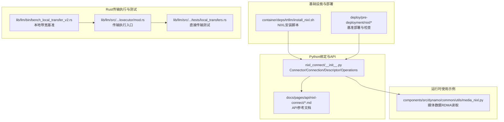
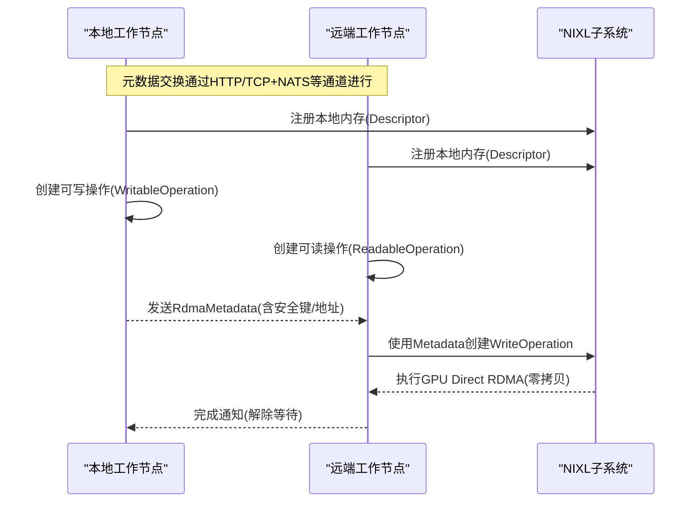
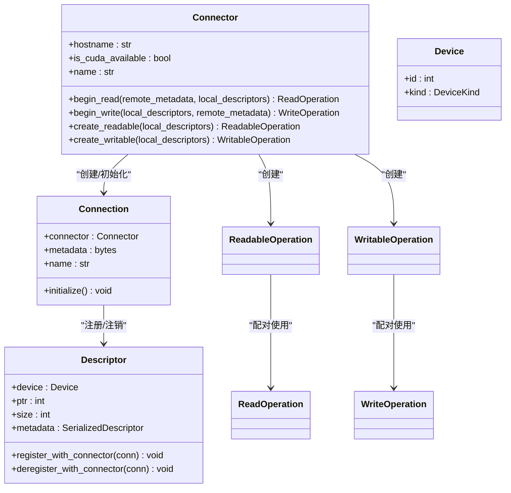
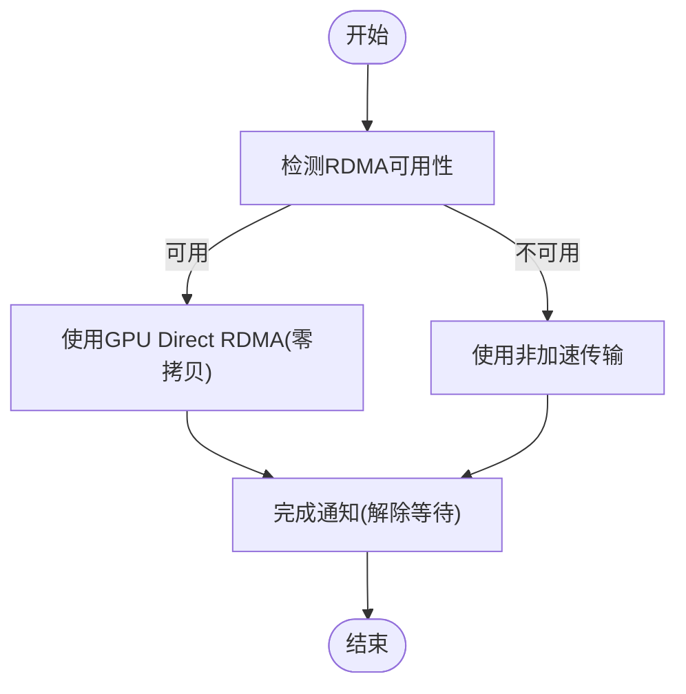
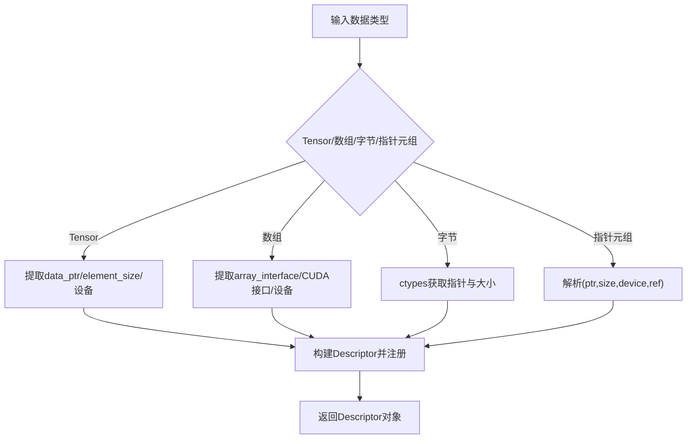
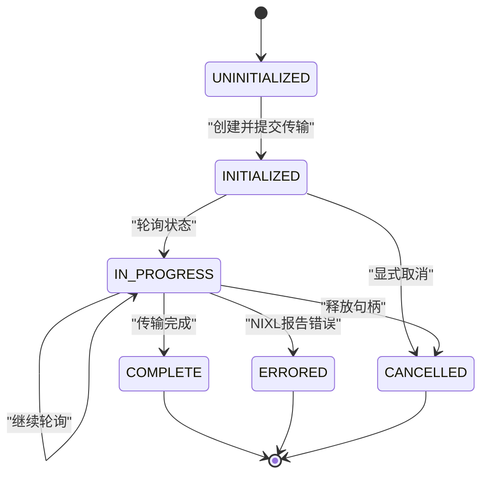
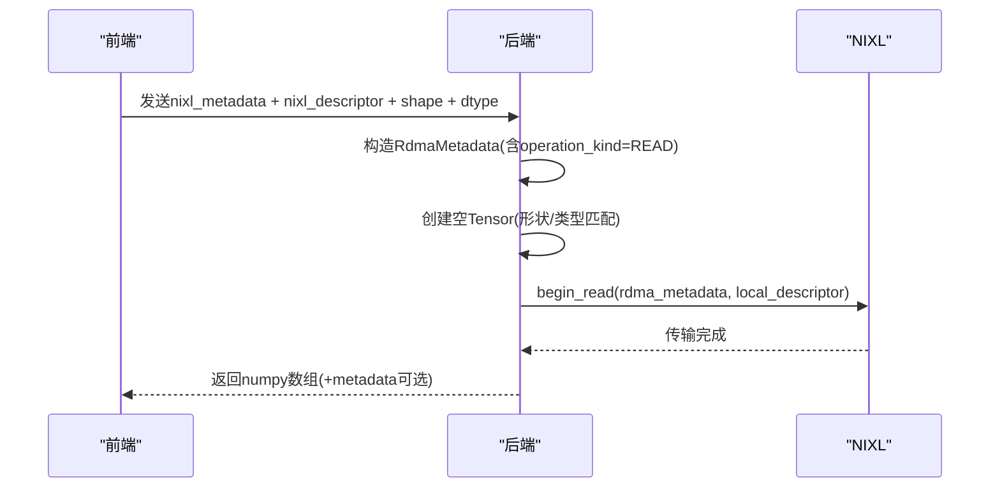
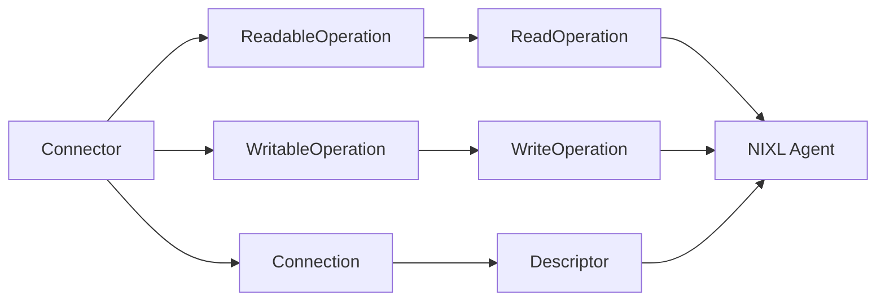

# 加速数据传输

<cite>
**本文引用的文件**
- [lib/bindings/python/src/dynamo/nixl_connect/__init__.py](file://lib/bindings/python/src/dynamo/nixl_connect/__init__.py)
- [docs/pages/api/nixl-connect/README.md](file://docs/pages/api/nixl-connect/README.md)
- [docs/pages/api/nixl-connect/connector.md](file://docs/pages/api/nixl-connect/connector.md)
- [docs/pages/api/nixl-connect/device.md](file://docs/pages/api/nixl-connect/device.md)
- [docs/pages/api/nixl-connect/rdma-metadata.md](file://docs/pages/api/nixl-connect/rdma-metadata.md)
- [docs/pages/api/nixl-connect/read-operation.md](file://docs/pages/api/nixl-connect/read-operation.md)
- [docs/pages/api/nixl-connect/write-operation.md](file://docs/pages/api/nixl-connect/write-operation.md)
- [components/src/dynamo/common/utils/media_nixl.py](file://components/src/dynamo/common/utils/media_nixl.py)
- [container/deps/trtllm/install_nixl.sh](file://container/deps/trtllm/install_nixl.sh)
- [deploy/pre-deployment/nixl/README.md](file://deploy/pre-deployment/nixl/README.md)
- [deploy/pre-deployment/nixl/nixlbench-deployment.yaml](file://deploy/pre-deployment/nixl/nixlbench-deployment.yaml)
- [lib/llm/bin/bench_local_transfer_v2.rs](file://lib/llm/bin/bench_local_transfer_v2.rs)
- [lib/llm/src/block_manager/v2/physical/transfer/executor/mod.rs](file://lib/llm/src/block_manager/v2/physical/transfer/executor/mod.rs)
- [lib/llm/src/block_manager/v2/physical/transfer/tests/local_transfers.rs](file://lib/llm/src/block_manager/v2/physical/transfer/tests/local_transfers.rs)
</cite>

## 目录
1. [简介](#简介)
2. [项目结构](#项目结构)
3. [核心组件](#核心组件)
4. [架构总览](#架构总览)
5. [详细组件分析](#详细组件分析)
6. [依赖关系分析](#依赖关系分析)
7. [性能考量](#性能考量)
8. [故障排查指南](#故障排查指南)
9. [结论](#结论)
10. [附录](#附录)

## 简介
本章节面向NVIDIA Dynamo平台的“加速数据传输”能力，系统阐述如何利用NIXL（NVIDIA InfiniBand eXpress Link）在分布式推理图中通过RDMA实现低延迟、高吞吐的数据传输。文档覆盖以下主题：
- RDMA传输机制与GPU Direct RDMA（零拷贝）路径
- 数据序列化与元数据传递（RdmaMetadata）
- 设备发现与注册（Descriptor/Device）、连接与会话管理（Connection/Connector）
- 操作状态管理与错误处理
- 网络拓扑适配与可用性降级策略
- 性能基准测试方法与结果解读
- 配置参数与部署实践
- 实际多模态场景中的应用案例

本指南既提供面向初学者的概念性理解，也提供面向高级开发者的实现细节与优化建议。

## 项目结构
围绕NIXL加速数据传输的相关代码与文档主要分布在如下位置：
- Python绑定与API：lib/bindings/python/src/dynamo/nixl_connect
- 文档API参考：docs/pages/api/nixl-connect
- 多媒体数据路径示例：components/src/dynamo/common/utils/media_nixl.py
- NIXL安装脚本：container/deps/trtllm/install_nixl.sh
- 预部署与基准测试：deploy/pre-deployment/nixl
- Rust侧传输执行器与基准：lib/llm/bin/bench_local_transfer_v2.rs、lib/llm/src/.../executor/mod.rs、lib/llm/src/.../tests/local_transfers.rs

**图表来源**
- [lib/bindings/python/src/dynamo/nixl_connect/__init__.py](file://lib/bindings/python/src/dynamo/nixl_connect/__init__.py#L613-L830)
- [docs/pages/api/nixl-connect/README.md](file://docs/pages/api/nixl-connect/README.md#L1-L171)
- [components/src/dynamo/common/utils/media_nixl.py](file://components/src/dynamo/common/utils/media_nixl.py#L18-L79)
- [container/deps/trtllm/install_nixl.sh](file://container/deps/trtllm/install_nixl.sh#L32-L80)
- [deploy/pre-deployment/nixl/README.md](file://deploy/pre-deployment/nixl/README.md#L1-L292)
- [lib/llm/bin/bench_local_transfer_v2.rs](file://lib/llm/bin/bench_local_transfer_v2.rs#L106-L196)
- [lib/llm/src/block_manager/v2/physical/transfer/executor/mod.rs](file://lib/llm/src/block_manager/v2/physical/transfer/executor/mod.rs#L22-L49)
- [lib/llm/src/block_manager/v2/physical/transfer/tests/local_transfers.rs](file://lib/llm/src/block_manager/v2/physical/transfer/tests/local_transfers.rs#L514-L976)

**章节来源**
- [lib/bindings/python/src/dynamo/nixl_connect/__init__.py](file://lib/bindings/python/src/dynamo/nixl_connect/__init__.py#L613-L830)
- [docs/pages/api/nixl-connect/README.md](file://docs/pages/api/nixl-connect/README.md#L1-L171)

## 核心组件
- Connector：工作节点间连接管理的核心类，负责创建可读/可写操作以及发起远端读/写。
- Connection：与NIXL Agent绑定的连接实例，封装底层通信句柄与元数据。
- Descriptor：内存描述符，负责将本地内存注册到NIXL，支持CPU/GPU两种设备类型。
- Device：设备抽象，区分主机与GPU，并支持多GPU场景下的设备选择。
- Readable/WritableOperation：本地内存注册为可被远端读/写的操作对象，生成RdmaMetadata供远端使用。
- Read/WriteOperation：基于远端提供的RdmaMetadata发起的实际传输操作，支持异步等待完成与取消。
- RdmaMetadata：JSON可序列化的元数据，包含远端访问所需的身份信息与内存区域键值。

这些组件共同构成“先注册、后元数据交换、再RDMA传输”的完整流程，确保在满足硬件条件时走GPU Direct RDMA，在不满足时自动降级为非加速路径。

**章节来源**
- [lib/bindings/python/src/dynamo/nixl_connect/__init__.py](file://lib/bindings/python/src/dynamo/nixl_connect/__init__.py#L529-L611)
- [lib/bindings/python/src/dynamo/nixl_connect/__init__.py](file://lib/bindings/python/src/dynamo/nixl_connect/__init__.py#L613-L830)
- [lib/bindings/python/src/dynamo/nixl_connect/__init__.py](file://lib/bindings/python/src/dynamo/nixl_connect/__init__.py#L832-L1176)
- [docs/pages/api/nixl-connect/connector.md](file://docs/pages/api/nixl-connect/connector.md#L1-L179)
- [docs/pages/api/nixl-connect/device.md](file://docs/pages/api/nixl-connect/device.md#L1-L52)
- [docs/pages/api/nixl-connect/rdma-metadata.md](file://docs/pages/api/nixl-connect/rdma-metadata.md#L1-L35)

## 架构总览
下图展示了典型“远端写入本地内存”（GPU Direct RDMA可用）的端到端流程，以及元数据交换与通知机制。

**图表来源**
- [docs/pages/api/nixl-connect/README.md](file://docs/pages/api/nixl-connect/README.md#L53-L66)
- [docs/pages/api/nixl-connect/README.md](file://docs/pages/api/nixl-connect/README.md#L76-L87)
- [docs/pages/api/nixl-connect/connector.md](file://docs/pages/api/nixl-connect/connector.md#L18-L25)

## 详细组件分析

### 组件A：NIXL连接器与操作模型
- 连接与会话
  - Connector负责创建Connection并初始化，Connection持有NIXL Agent句柄，用于后续注册与传输。
  - Connection提供元数据查询接口，便于将敏感信息通过安全通道传递给远端。
- 内存注册与描述符
  - Descriptor支持从Tensor、NumPy/CuPy数组、字节缓冲或指针+大小+设备元组构造。
  - 注册过程仅限本地描述符，避免远端无效地址导致的故障。
- 可读/可写操作
  - ReadableOperation/WritableOperation分别将本地内存暴露为可被远端读/写的资源，并生成RdmaMetadata。
  - ReadOperation/WriteOperation基于远端提供的RdmaMetadata发起传输，支持异步等待与取消。
- 状态管理与错误处理
  - 操作状态枚举用于跟踪INITIALIZED/IN_PROGRESS/COMPLETE/ERRORED/CANCELLED。
  - 超时轮询与指数退避策略降低事件循环阻塞；异常时记录日志并更新状态。

**图表来源**
- [lib/bindings/python/src/dynamo/nixl_connect/__init__.py](file://lib/bindings/python/src/dynamo/nixl_connect/__init__.py#L529-L611)
- [lib/bindings/python/src/dynamo/nixl_connect/__init__.py](file://lib/bindings/python/src/dynamo/nixl_connect/__init__.py#L613-L830)
- [lib/bindings/python/src/dynamo/nixl_connect/__init__.py](file://lib/bindings/python/src/dynamo/nixl_connect/__init__.py#L832-L1176)
- [docs/pages/api/nixl-connect/device.md](file://docs/pages/api/nixl-connect/device.md#L1-L52)

**章节来源**
- [lib/bindings/python/src/dynamo/nixl_connect/__init__.py](file://lib/bindings/python/src/dynamo/nixl_connect/__init__.py#L529-L611)
- [lib/bindings/python/src/dynamo/nixl_connect/__init__.py](file://lib/bindings/python/src/dynamo/nixl_connect/__init__.py#L613-L830)
- [lib/bindings/python/src/dynamo/nixl_connect/__init__.py](file://lib/bindings/python/src/dynamo/nixl_connect/__init__.py#L832-L1176)
- [docs/pages/api/nixl-connect/connector.md](file://docs/pages/api/nixl-connect/connector.md#L1-L179)
- [docs/pages/api/nixl-connect/device.md](file://docs/pages/api/nixl-connect/device.md#L1-L52)

### 组件B：RDMA传输机制与GPU Direct RDMA
- 传输路径选择
  - 在满足硬件与驱动要求时，优先采用GPU Direct RDMA实现零拷贝；否则自动降级为非加速路径。
- 元数据交换
  - RdmaMetadata包含远端访问所需的标识与密钥，必须通过受控通道传递，避免泄露。
- 传输执行
  - ReadOperation/WriteOperation在创建后立即开始传输，支持异步等待完成与取消。
- 错误处理
  - 状态机驱动的轮询与退避策略，异常时记录并更新状态，确保资源释放。

**图表来源**
- [docs/pages/api/nixl-connect/README.md](file://docs/pages/api/nixl-connect/README.md#L14-L23)
- [docs/pages/api/nixl-connect/rdma-metadata.md](file://docs/pages/api/nixl-connect/rdma-metadata.md#L12-L14)
- [docs/pages/api/nixl-connect/read-operation.md](file://docs/pages/api/nixl-connect/read-operation.md#L14-L16)
- [docs/pages/api/nixl-connect/write-operation.md](file://docs/pages/api/nixl-connect/write-operation.md#L14-L17)

**章节来源**
- [docs/pages/api/nixl-connect/README.md](file://docs/pages/api/nixl-connect/README.md#L14-L23)
- [docs/pages/api/nixl-connect/rdma-metadata.md](file://docs/pages/api/nixl-connect/rdma-metadata.md#L12-L14)
- [docs/pages/api/nixl-connect/read-operation.md](file://docs/pages/api/nixl-connect/read-operation.md#L14-L16)
- [docs/pages/api/nixl-connect/write-operation.md](file://docs/pages/api/nixl-connect/write-operation.md#L14-L17)

### 组件C：设备发现与配置
- 设备抽象
  - Device支持“cpu”与“cuda[:id]”，默认cuda表示第一个GPU。
- 描述符注册
  - Descriptor根据输入类型自动推断设备与尺寸，注册到对应Connection的NIXL Agent。
- CUDA可用性检测
  - Connector提供is_cuda_available属性，用于判断是否启用GPU路径。

**图表来源**
- [lib/bindings/python/src/dynamo/nixl_connect/__init__.py](file://lib/bindings/python/src/dynamo/nixl_connect/__init__.py#L832-L1176)
- [docs/pages/api/nixl-connect/device.md](file://docs/pages/api/nixl-connect/device.md#L11-L14)

**章节来源**
- [lib/bindings/python/src/dynamo/nixl_connect/__init__.py](file://lib/bindings/python/src/dynamo/nixl_connect/__init__.py#L832-L1176)
- [docs/pages/api/nixl-connect/device.md](file://docs/pages/api/nixl-connect/device.md#L11-L14)

### 组件D：操作状态管理与错误处理
- 状态机
  - INITIALIZED/IN_PROGRESS/COMPLETE/ERRORED/CANCELLED，状态变化伴随日志输出。
- 轮询与退避
  - 异步等待采用最小/最大轮询间隔与指数退避，平衡响应性与CPU占用。
- 资源释放
  - 通过析构与显式释放确保NIXL句柄与内存注册得到正确回收。

**图表来源**
- [lib/bindings/python/src/dynamo/nixl_connect/__init__.py](file://lib/bindings/python/src/dynamo/nixl_connect/__init__.py#L444-L526)

**章节来源**
- [lib/bindings/python/src/dynamo/nixl_connect/__init__.py](file://lib/bindings/python/src/dynamo/nixl_connect/__init__.py#L444-L526)

### 组件E：媒体数据的RDMA读取示例
- 场景
  - 前端将预解码的媒体数据以NIXL元数据与描述符形式传递给后端，后端通过begin_read完成RDMA读取。
- 关键点
  - 自动识别远端设备（DRAM/CUDA），构造RdmaMetadata与本地空张量，零拷贝转换为numpy数组。
  - 返回数据与可选元数据，便于上层继续处理。

**图表来源**
- [components/src/dynamo/common/utils/media_nixl.py](file://components/src/dynamo/common/utils/media_nixl.py#L18-L79)

**章节来源**
- [components/src/dynamo/common/utils/media_nixl.py](file://components/src/dynamo/common/utils/media_nixl.py#L18-L79)

## 依赖关系分析
- Python绑定依赖
  - Connector/Connection/Descriptor/Operation系列类相互协作，形成完整的传输生命周期。
  - Device与SerializedDescriptor作为跨组件的共享类型，贯穿注册、元数据序列化与反序列化。
- Rust传输执行器
  - 传输执行入口选择策略并调度具体执行器，底层仍依赖NIXL Agent与布局配置。
- 基准与测试
  - Rust基准程序验证不同存储类型间的带宽，测试用例覆盖直接传输与校验逻辑。

**图表来源**
- [lib/bindings/python/src/dynamo/nixl_connect/__init__.py](file://lib/bindings/python/src/dynamo/nixl_connect/__init__.py#L613-L830)
- [lib/llm/src/block_manager/v2/physical/transfer/executor/mod.rs](file://lib/llm/src/block_manager/v2/physical/transfer/executor/mod.rs#L22-L49)

**章节来源**
- [lib/bindings/python/src/dynamo/nixl_connect/__init__.py](file://lib/bindings/python/src/dynamo/nixl_connect/__init__.py#L613-L830)
- [lib/llm/src/block_manager/v2/physical/transfer/executor/mod.rs](file://lib/llm/src/block_manager/v2/physical/transfer/executor/mod.rs#L22-L49)

## 性能考量
- RDMA可用性与降级
  - 当硬件/驱动/网络不满足GPU Direct RDMA时，系统自动切换至非加速路径，保证功能可用但吞吐下降。
- 带宽与延迟
  - Rust基准程序通过计算总字节数与平均耗时估算带宽，可用于对比不同布局与后端的性能差异。
- 数据序列化开销
  - RdmaMetadata与Descriptor序列化开销通常较小，且在长距离传输中边际影响有限。
- 网络拓扑适配
  - 在多节点/多GPU场景中，优先在同一交换机/拓扑域内进行传输，减少跨节点延迟。

**章节来源**
- [docs/pages/api/nixl-connect/README.md](file://docs/pages/api/nixl-connect/README.md#L14-L23)
- [lib/llm/bin/bench_local_transfer_v2.rs](file://lib/llm/bin/bench_local_transfer_v2.rs#L106-L112)
- [lib/llm/src/block_manager/v2/physical/transfer/tests/local_transfers.rs](file://lib/llm/src/block_manager/v2/physical/transfer/tests/local_transfers.rs#L514-L543)

## 故障排查指南
- 环境与依赖
  - 确认NIXL与UCX已正确安装，环境变量已设置；容器镜像需包含NIXL运行时库。
- 集群与服务
  - 预部署检查脚本验证k8s连通性、GPU节点标签、GPU Operator状态；基准部署需要ETCD服务可达。
- 元数据安全
  - RdmaMetadata包含敏感信息，必须通过受控通道传递，避免泄露。
- 常见问题定位
  - 查看Pod日志与事件，确认NIXL Agent初始化成功、内存注册无异常、传输状态机推进正常。
  - 若出现ERRORED状态，检查NIXL后端支持与网络连通性。

**章节来源**
- [container/deps/trtllm/install_nixl.sh](file://container/deps/trtllm/install_nixl.sh#L32-L80)
- [deploy/pre-deployment/nixl/README.md](file://deploy/pre-deployment/nixl/README.md#L210-L258)
- [docs/pages/api/nixl-connect/rdma-metadata.md](file://docs/pages/api/nixl-connect/rdma-metadata.md#L12-L14)

## 结论
NIXL在Dynamo中提供了统一的、可扩展的加速数据传输框架：通过“注册—元数据交换—RDMA传输”的三段式流程，在满足条件时实现GPU Direct RDMA零拷贝，显著降低推理响应时间；在不满足条件时自动降级，确保系统稳定运行。结合完善的错误处理、状态管理与基准测试工具，开发者可以快速集成并优化跨节点/跨模型的数据传输路径。

## 附录
- 配置参数与部署要点
  - 安装脚本指定UCX版本与NIXL编译参数，按架构生成库路径；基准部署模板定义副本数、资源请求/限制与ETCD端点。
  - 在Kubernetes中部署前，务必执行预部署检查脚本，确保集群满足GPU与Operator要求。

**章节来源**
- [container/deps/trtllm/install_nixl.sh](file://container/deps/trtllm/install_nixl.sh#L32-L80)
- [deploy/pre-deployment/nixl/nixlbench-deployment.yaml](file://deploy/pre-deployment/nixl/nixlbench-deployment.yaml#L1-L35)
- [deploy/pre-deployment/nixl/README.md](file://deploy/pre-deployment/nixl/README.md#L1-L292)