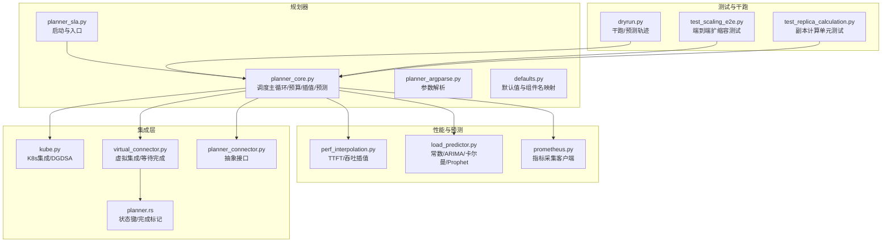
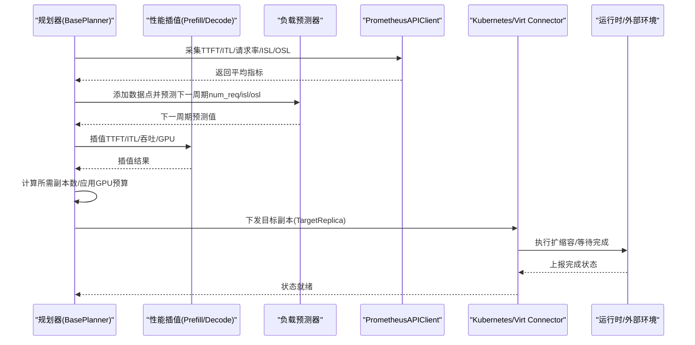
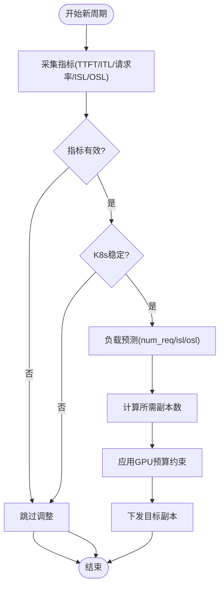
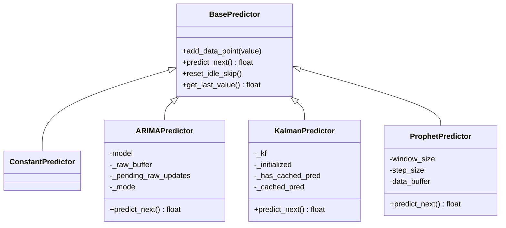
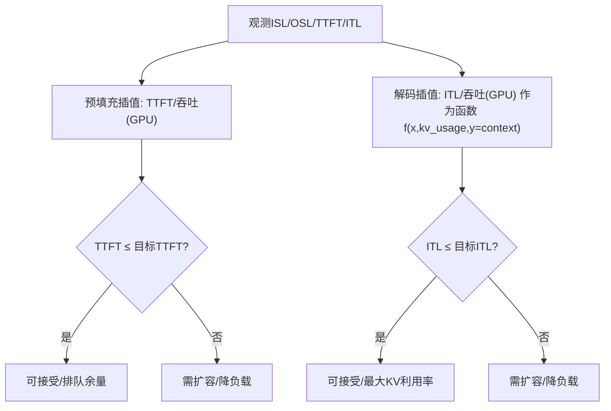
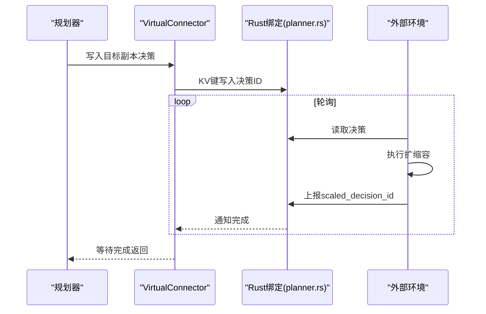
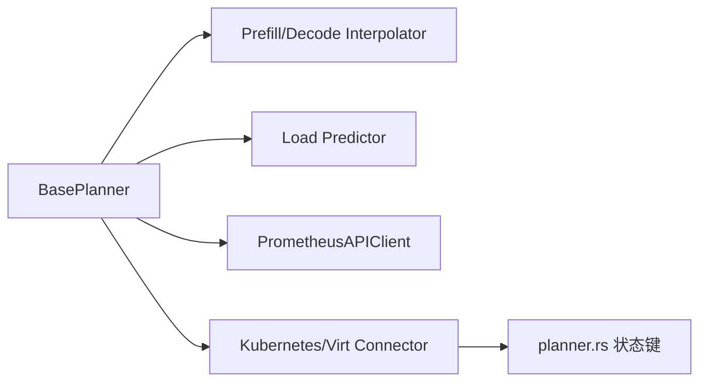

# 动态GPU调度

<cite>
**本文引用的文件**
- [planner_sla.py](file://components/src/dynamo/planner/planner_sla.py)
- [planner_core.py](file://components/src/dynamo/planner/utils/planner_core.py)
- [planner_argparse.py](file://components/src/dynamo/planner/utils/planner_argparse.py)
- [perf_interpolation.py](file://components/src/dynamo/planner/utils/perf_interpolation.py)
- [load_predictor.py](file://components/src/dynamo/planner/utils/load_predictor.py)
- [kube.py](file://components/src/dynamo/planner/kube.py)
- [virtual_connector.py](file://components/src/dynamo/planner/virtual_connector.py)
- [planner_connector.py](file://components/src/dynamo/planner/planner_connector.py)
- [defaults.py](file://components/src/dynamo/planner/defaults.py)
- [prometheus.py](file://components/src/dynamo/planner/utils/prometheus.py)
- [dryrun.py](file://components/src/dynamo/planner/utils/dryrun.py)
- [planner.rs](file://lib/bindings/python/rust/planner.rs)
- [planner-design.md](file://docs/pages/design-docs/planner-design.md)
- [test_scaling_e2e.py](file://tests/planner/test_scaling_e2e.py)
- [test_replica_calculation.py](file://tests/planner/test_replica_calculation.py)
</cite>

## 目录
1. [简介](#简介)
2. [项目结构](#项目结构)
3. [核心组件](#核心组件)
4. [架构总览](#架构总览)
5. [详细组件分析](#详细组件分析)
6. [依赖关系分析](#依赖关系分析)
7. [性能考量](#性能考量)
8. [故障排查指南](#故障排查指南)
9. [结论](#结论)
10. [附录](#附录)

## 简介
本文件系统化阐述NVIDIA Dynamo的动态GPU调度能力，聚焦“SLA驱动的规划器”。该规划器通过观测前端服务的关键性能指标（如首Token时间TTFT、单Token间隔ITL、请求速率、输入/输出序列长度），结合预部署性能剖析数据与在线负载预测模型，计算并下发扩缩容指令，以在满足SLA的前提下优化GPU资源分配与成本。规划器支持Kubernetes与虚拟环境两种模式，具备全局GPU预算约束、按需修正预测因子、以及可配置的负载预测算法。

## 项目结构
围绕动态GPU调度的核心代码主要位于components/src/dynamo/planner目录下，配合运行时与观测工具：
- 规划器入口与启动：planner_sla.py
- 核心调度逻辑与预算控制：planner_core.py
- 参数解析与默认值：planner_argparse.py、defaults.py
- 性能插值与SLA校验：perf_interpolation.py
- 负载预测算法：load_predictor.py
- 指标采集与查询：prometheus.py
- 集成K8s与虚拟环境：kube.py、virtual_connector.py、planner_connector.py
- 干跑与测试：dryrun.py、test_scaling_e2e.py、test_replica_calculation.py
- 运行时绑定与状态同步：planner.rs

图表来源
- [planner_sla.py](file://components/src/dynamo/planner/planner_sla.py#L1-L56)
- [planner_core.py](file://components/src/dynamo/planner/utils/planner_core.py#L1-L981)
- [planner_argparse.py](file://components/src/dynamo/planner/utils/planner_argparse.py#L1-L180)
- [defaults.py](file://components/src/dynamo/planner/defaults.py#L1-L271)
- [perf_interpolation.py](file://components/src/dynamo/planner/utils/perf_interpolation.py#L1-L309)
- [load_predictor.py](file://components/src/dynamo/planner/utils/load_predictor.py#L1-L406)
- [prometheus.py](file://components/src/dynamo/planner/utils/prometheus.py#L1-L183)
- [kube.py](file://components/src/dynamo/planner/kube.py#L1-L226)
- [virtual_connector.py](file://components/src/dynamo/planner/virtual_connector.py#L1-L149)
- [planner_connector.py](file://components/src/dynamo/planner/planner_connector.py#L1-L30)
- [planner.rs](file://lib/bindings/python/rust/planner.rs#L323-L516)
- [dryrun.py](file://components/src/dynamo/planner/utils/dryrun.py#L64-L135)
- [test_scaling_e2e.py](file://tests/planner/test_scaling_e2e.py#L288-L480)
- [test_replica_calculation.py](file://tests/planner/test_replica_calculation.py#L1-L48)

章节来源
- [planner_sla.py](file://components/src/dynamo/planner/planner_sla.py#L1-L56)
- [planner_core.py](file://components/src/dynamo/planner/utils/planner_core.py#L1-L981)
- [planner_argparse.py](file://components/src/dynamo/planner/utils/planner_argparse.py#L1-L180)
- [defaults.py](file://components/src/dynamo/planner/defaults.py#L1-L271)

## 核心组件
- SLA规划器入口与生命周期
  - 启动延时、组件注册、初始化与主循环入口由planner_sla.py负责。
- 基础规划器与调度主循环
  - BasePlanner封装指标采集、负载预测、插值与预算约束、扩缩容下发；PrefillPlanner/DecodePlanner分别计算预填充与解码阶段所需副本数。
- 性能插值与SLA校验
  - PrefillInterpolator/DecodeInterpolator基于预部署剖析数据进行插值，用于估计给定ISL/上下文长度下的TTFT与ITL、吞吐/GPU。
- 负载预测器
  - 支持常数、ARIMA、卡尔曼滤波、Prophet四种预测器，可配置平滑/窗口/噪声参数。
- 指标采集与查询
  - PrometheusAPIClient从Prometheus拉取平均TTFT、ITL、请求速率、请求时长、ISL/OSL等指标。
- 集成适配器
  - Kubernetes模式通过DGDSA/DGD更新副本；虚拟模式通过VirtualConnector协调外部环境完成扩缩容并上报状态。
- 默认值与组件命名
  - defaults.py定义默认参数、后端组件名映射、子组件类型枚举等。

章节来源
- [planner_sla.py](file://components/src/dynamo/planner/planner_sla.py#L27-L56)
- [planner_core.py](file://components/src/dynamo/planner/utils/planner_core.py#L258-L800)
- [perf_interpolation.py](file://components/src/dynamo/planner/utils/perf_interpolation.py#L37-L309)
- [load_predictor.py](file://components/src/dynamo/planner/utils/load_predictor.py#L55-L406)
- [prometheus.py](file://components/src/dynamo/planner/utils/prometheus.py#L45-L183)
- [kube.py](file://components/src/dynamo/planner/kube.py#L81-L145)
- [virtual_connector.py](file://components/src/dynamo/planner/virtual_connector.py#L28-L149)
- [defaults.py](file://components/src/dynamo/planner/defaults.py#L34-L134)

## 架构总览
动态GPU调度采用“观测—预测—插值—计算—预算—下发”的闭环流程。规划器周期性采集前端指标，预测下一周期负载，利用性能插值评估SLA满足度，计算所需副本数，应用GPU预算约束，最终通过集成适配器下发扩缩容指令。

图表来源
- [planner_core.py](file://components/src/dynamo/planner/utils/planner_core.py#L511-L761)
- [perf_interpolation.py](file://components/src/dynamo/planner/utils/perf_interpolation.py#L93-L247)
- [load_predictor.py](file://components/src/dynamo/planner/utils/load_predictor.py#L109-L397)
- [prometheus.py](file://components/src/dynamo/planner/utils/prometheus.py#L102-L169)
- [kube.py](file://components/src/dynamo/planner/kube.py#L81-L145)
- [virtual_connector.py](file://components/src/dynamo/planner/virtual_connector.py#L60-L128)
- [planner.rs](file://lib/bindings/python/rust/planner.rs#L338-L366)

## 详细组件分析

### 组件A：SLA规划器主循环与扩缩容触发
- 触发条件
  - 时间间隔到达：每adjustment_interval秒进入一次新的调整周期。
  - 指标有效性：TTFT/ITL/ISL/OSL非空且非NaN时才进行调整。
  - 稳定性检查：Kubernetes模式下若存在滚动或扩容未完成则跳过本次调整。
- 处理流程
  - 采集指标并更新共享状态。
  - 可选修正因子：基于插值TTFT与观测TTFT比值修正预测。
  - 负载预测：预测下一周期num_req/isl/osl。
  - 副本计算：按阶段（预填充/解码）计算所需副本数。
  - 预算约束：应用全局GPU预算与最小端点限制。
  - 下发扩容：通过连接器设置目标副本数。
- 关键实现路径
  - 主循环与指标采集：[planner_core.py](file://components/src/dynamo/planner/utils/planner_core.py#L511-L761)
  - 副本计算与预算：[planner_core.py](file://components/src/dynamo/planner/utils/planner_core.py#L668-L758)
  - 预算约束函数：[planner_core.py](file://components/src/dynamo/planner/utils/planner_core.py#L132-L207)

图表来源
- [planner_core.py](file://components/src/dynamo/planner/utils/planner_core.py#L511-L761)
- [planner_core.py](file://components/src/dynamo/planner/utils/planner_core.py#L132-L207)

章节来源
- [planner_core.py](file://components/src/dynamo/planner/utils/planner_core.py#L511-L761)
- [planner_core.py](file://components/src/dynamo/planner/utils/planner_core.py#L132-L207)

### 组件B：负载预测算法
- 支持算法
  - 常数预测：直接复用最近值。
  - ARIMA：自动选择阶数，支持原始/对数变换（log1p）以应对尖峰序列。
  - 卡尔曼滤波：局部线性趋势模型，适合低延迟平滑与短期预测。
  - Prophet：带时间戳的数据框，支持窗口大小限制与指数变换。
- 关键参数
  - 预测器类型：--load-predictor
  - Prophet窗口大小：--prophet-window-size
  - log1p开关：--load-predictor-log1p
  - 卡尔曼过程噪声/测量噪声/最小点数：--kalman-q-level/--kalman-q-trend/--kalman-r/--kalman-min-points
- 实现要点
  - 预测器基类统一处理空值、空闲期跳过、增量更新等。
  - ARIMA/Prophet在拟合失败时回退到最近值。
  - 卡尔曼滤波缓存一步预测结果，避免重复推进滤波器。

图表来源
- [load_predictor.py](file://components/src/dynamo/planner/utils/load_predictor.py#L55-L406)

章节来源
- [load_predictor.py](file://components/src/dynamo/planner/utils/load_predictor.py#L55-L406)

### 组件C：性能插值与SLA校验
- 预填充插值
  - 输入：ISL集合；输出：TTFT曲线、吞吐/GPU曲线；用于估计给定ISL下的TTFT与吞吐能力。
- 解码插值
  - 输入：KV缓存占用比例x、上下文长度y；输出：ITL网格、吞吐/GPU网格；用于估计在目标ITL下最大可用KV利用率与吞吐。
- SLA校验
  - 预填充：比较观测TTFT与插值TTFT，计算可排队等待以满足SLA的时间余量。
  - 解码：在目标ITL下寻找最大吞吐对应的KV利用率，确保ITL不超限。
- 关键实现路径
  - 预填充插值器：[perf_interpolation.py](file://components/src/dynamo/planner/utils/perf_interpolation.py#L37-L100)
  - 解码插值器与最佳吞吐搜索：[perf_interpolation.py](file://components/src/dynamo/planner/utils/perf_interpolation.py#L102-L247)

图表来源
- [perf_interpolation.py](file://components/src/dynamo/planner/utils/perf_interpolation.py#L93-L247)

章节来源
- [perf_interpolation.py](file://components/src/dynamo/planner/utils/perf_interpolation.py#L37-L247)

### 组件D：指标采集与查询
- 指标来源
  - 平均TTFT、平均ITL、平均请求时长、平均请求速率、平均ISL、平均OSL。
- 查询方式
  - 使用PrometheusAPIClient基于increase求平均，按模型名与命名空间过滤。
- 关键实现路径
  - 指标查询客户端：[prometheus.py](file://components/src/dynamo/planner/utils/prometheus.py#L45-L183)

章节来源
- [prometheus.py](file://components/src/dynamo/planner/utils/prometheus.py#L45-L183)

### 组件E：集成适配器（K8s与虚拟）
- Kubernetes模式
  - 优先使用DGDSA Scale子资源更新副本；若不存在则回退至DGD补丁。
  - 提供部署就绪等待、服务副本状态查询（可用/就绪/更新一致性）。
- 虚拟模式
  - 通过VirtualConnectorCoordinator写入决策，外部环境使用VirtualConnectorClient轮询并上报完成状态。
  - 内置等待超时与重试上限，保障规划器不会无限阻塞。
- 关键实现路径
  - K8s集成：[kube.py](file://components/src/dynamo/planner/kube.py#L81-L226)
  - 虚拟集成：[virtual_connector.py](file://components/src/dynamo/planner/virtual_connector.py#L28-L149)
  - 状态键与完成标记：[planner.rs](file://lib/bindings/python/rust/planner.rs#L338-L516)

图表来源
- [virtual_connector.py](file://components/src/dynamo/planner/virtual_connector.py#L60-L128)
- [planner.rs](file://lib/bindings/python/rust/planner.rs#L338-L516)

章节来源
- [kube.py](file://components/src/dynamo/planner/kube.py#L81-L226)
- [virtual_connector.py](file://components/src/dynamo/planner/virtual_connector.py#L28-L149)
- [planner.rs](file://lib/bindings/python/rust/planner.rs#L338-L516)

### 组件F：参数与默认值
- 关键参数
  - 环境/命名空间/后端/模式、是否仅预填充/仅解码/联合调度。
  - 调整间隔、最大GPU预算、最小端点、每引擎GPU数。
  - TTFT/ITL目标、负载预测器类型及参数、指标采集端点、是否禁用修正因子。
- 默认值来源
  - SLAPlannerDefaults集中定义默认值与Prometheus端点、剖析结果目录等。
- 关键实现路径
  - 参数解析器：[planner_argparse.py](file://components/src/dynamo/planner/utils/planner_argparse.py#L21-L180)
  - 默认值与组件名映射：[defaults.py](file://components/src/dynamo/planner/defaults.py#L34-L134)

章节来源
- [planner_argparse.py](file://components/src/dynamo/planner/utils/planner_argparse.py#L21-L180)
- [defaults.py](file://components/src/dynamo/planner/defaults.py#L34-L134)

## 依赖关系分析
- 组件耦合
  - BasePlanner聚合了性能插值器、负载预测器、Prometheus客户端与连接器，形成高内聚的调度核心。
  - 连接器抽象（PlannerConnector）隔离K8s与虚拟实现差异。
- 外部依赖
  - Prometheus API客户端、scipy插值、pmdarima/Prophet/Kalman等第三方库。
- 潜在风险
  - 调整间隔与扩缩容延迟不匹配可能导致决策堆积。
  - 平均插值可能无法准确反映重尾分布。

图表来源
- [planner_core.py](file://components/src/dynamo/planner/utils/planner_core.py#L258-L400)
- [perf_interpolation.py](file://components/src/dynamo/planner/utils/perf_interpolation.py#L37-L247)
- [load_predictor.py](file://components/src/dynamo/planner/utils/load_predictor.py#L55-L397)
- [prometheus.py](file://components/src/dynamo/planner/utils/prometheus.py#L45-L183)
- [kube.py](file://components/src/dynamo/planner/kube.py#L81-L145)
- [virtual_connector.py](file://components/src/dynamo/planner/virtual_connector.py#L28-L128)
- [planner.rs](file://lib/bindings/python/rust/planner.rs#L338-L516)

章节来源
- [planner_core.py](file://components/src/dynamo/planner/utils/planner_core.py#L258-L400)
- [planner.rs](file://lib/bindings/python/rust/planner.rs#L338-L516)

## 性能考量
- 调整间隔与稳定性
  - 调整间隔过短会增加指标抖动影响；过长会导致响应滞后。建议结合后端扩缩容延迟调优。
- 预算约束与成本
  - 全局GPU预算可防止资源过度消耗；最小端点保证基本SLA与吞吐。
- 预测器选择
  - 突发/尖峰场景推荐Kalman或Prophet；平稳场景常数/ARIMA即可。
- 插值精度
  - ISL/OSL范围外裁剪插值；解码插值网格存在NaN时以邻近插值填充，降低异常传播。

## 故障排查指南
- 无指标或指标为0
  - 检查Prometheus端点与命名空间过滤；确认前端已产生流量。
  - 参考：[prometheus.py](file://components/src/dynamo/planner/utils/prometheus.py#L50-L101)
- 扩缩容未生效
  - Kubernetes模式检查DGDSA是否存在；虚拟模式检查外部环境是否正确上报scaled_decision_id。
  - 参考：[kube.py](file://components/src/dynamo/planner/kube.py#L81-L145)、[planner.rs](file://lib/bindings/python/rust/planner.rs#L338-L516)
- 预测失败回退
  - ARIMA/Prophet/Kalman在拟合失败时回退到最近值；可调整log1p与窗口参数。
  - 参考：[load_predictor.py](file://components/src/dynamo/planner/utils/load_predictor.py#L149-L247)
- 端到端扩缩容验证
  - 使用e2e测试脚本模拟负载变化并记录Pod历史与性能指标。
  - 参考：[test_scaling_e2e.py](file://tests/planner/test_scaling_e2e.py#L288-L480)

章节来源
- [prometheus.py](file://components/src/dynamo/planner/utils/prometheus.py#L50-L101)
- [kube.py](file://components/src/dynamo/planner/kube.py#L81-L145)
- [planner.rs](file://lib/bindings/python/rust/planner.rs#L338-L516)
- [load_predictor.py](file://components/src/dynamo/planner/utils/load_predictor.py#L149-L247)
- [test_scaling_e2e.py](file://tests/planner/test_scaling_e2e.py#L288-L480)

## 结论
NVIDIA Dynamo的动态GPU调度通过“指标观测—负载预测—性能插值—预算约束—扩缩容下发”的闭环，实现了对SLA的自适应保障。其设计兼顾Kubernetes与虚拟环境，支持多种预测算法与插值策略，并提供了完善的测试与可观测性支撑。实践中应结合业务负载特征选择合适的预测器与参数，合理设置调整间隔与GPU预算，以获得更优的性能与成本平衡。

## 附录
- 设计文档中的已知限制与未来工作
  - 规划器启动延迟、调整间隔与扩缩容延迟不匹配、平均插值对重尾分布的局限、单DGD作用域、弃用的负载驱动规划器等。
  - 参考：[planner-design.md](file://docs/pages/design-docs/planner-design.md#L169-L182)
- 干跑与单元测试
  - 干跑脚本可生成预测轨迹与安全吞吐估计；单元测试覆盖副本计算公式。
  - 参考：[dryrun.py](file://components/src/dynamo/planner/utils/dryrun.py#L64-L135)、[test_replica_calculation.py](file://tests/planner/test_replica_calculation.py#L1-L48)