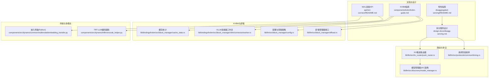
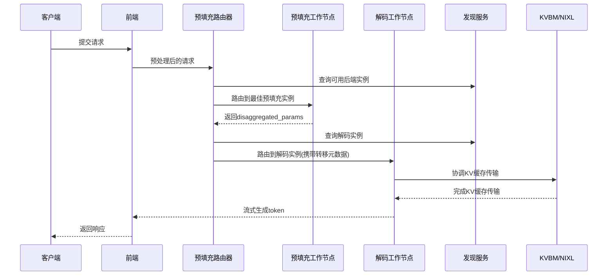
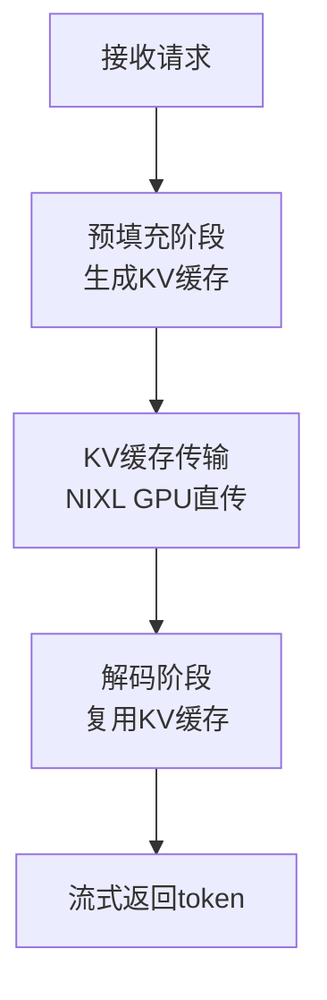
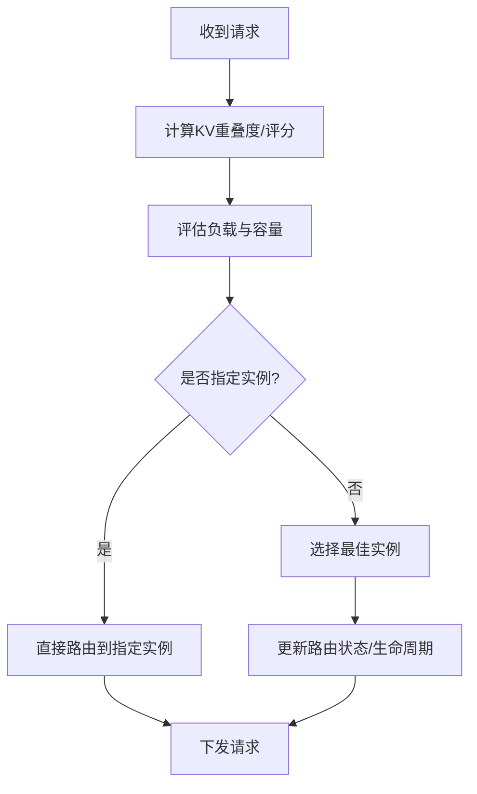
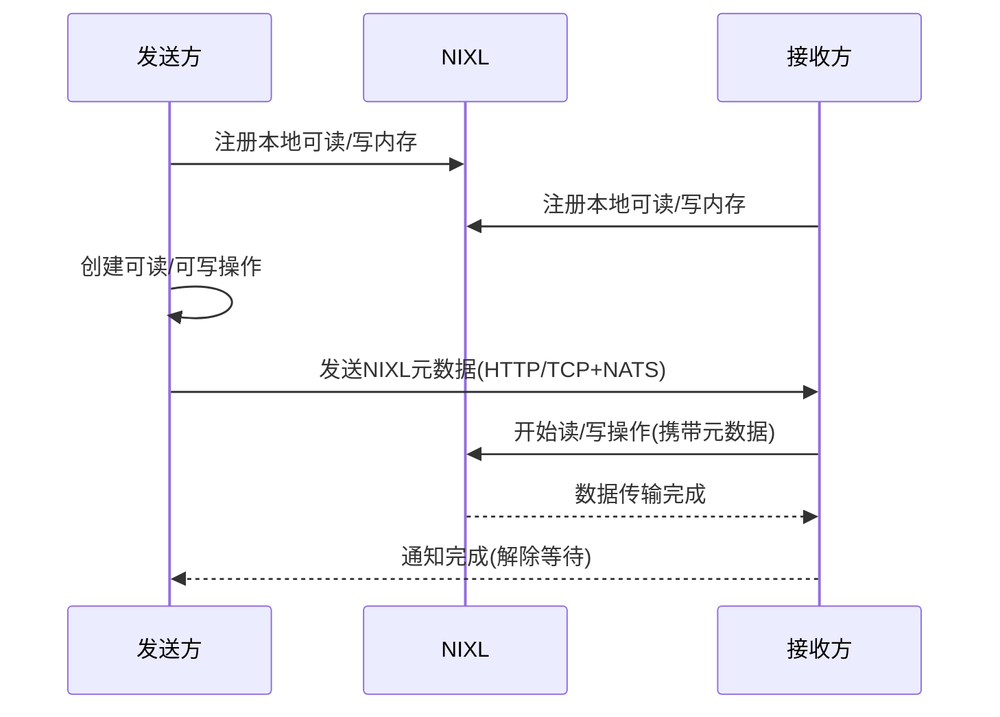
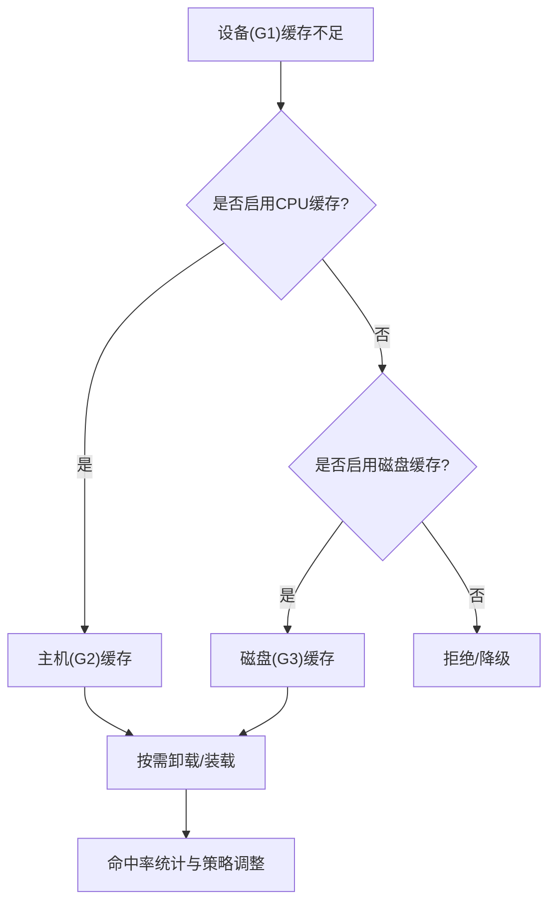
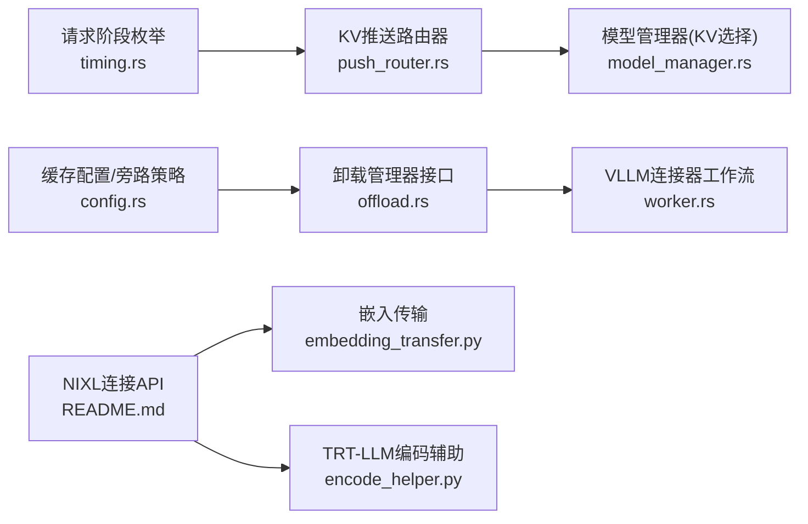

# 核心特性

<cite>
**本文引用的文件**
- [disaggregated-serving/README.md](file://docs/pages/features/disaggregated-serving/README.md)
- [disagg-serving.md](file://docs/pages/design-docs/disagg-serving.md)
- [kvbm-guide.md](file://docs/pages/components/kvbm/kvbm-guide.md)
- [README.md](file://docs/pages/api/nixl-connect/README.md)
- [timing.rs](file://lib/llm/src/protocols/common/timing.rs)
- [push_router.rs](file://lib/llm/src/kv_router/push_router.rs)
- [kv.rs](file://lib/bindings/python/rust/llm/kv.rs)
- [embedding_transfer.py](file://components/src/dynamo/common/multimodal/embedding_transfer.py)
- [encode_helper.py](file://components/src/dynamo/trtllm/encode_helper.py)
- [cache_stats.rs](file://lib/bindings/kvbm/src/block_manager/cache_stats.rs)
- [worker.rs](file://lib/bindings/kvbm/src/block_manager/vllm/connector/worker.rs)
- [config.rs](file://lib/llm/src/block_manager/config.rs)
- [offload.rs](file://lib/llm/src/block_manager/offload.rs)
- [test_router.py](file://examples/deployments/router_standalone_trtllm/test_router.py)
- [model_manager.rs](file://lib/llm/src/discovery/model_manager.rs)
</cite>

## 目录
1. [引言](#引言)
2. [项目结构](#项目结构)
3. [核心组件](#核心组件)
4. [架构总览](#架构总览)
5. [详细组件分析](#详细组件分析)
6. [依赖关系分析](#依赖关系分析)
7. [性能考量](#性能考量)
8. [故障排查指南](#故障排查指南)
9. [结论](#结论)
10. [附录](#附录)

## 引言
本章节面向NVIDIA Dynamo的核心能力，系统阐述以下五大特性：分割式预填充与解码（Disaggregated Prefill & Decode）、动态GPU调度（Dynamic GPU Scheduling）、LLM感知请求路由（LLM-Aware Request Routing）、加速数据传输（Accelerated Data Transfer）、KV缓存卸载（KV Cache Offloading）。我们将从技术原理、性能收益、适用场景与配置示例四个维度展开，并结合代码库中的设计文档与实现文件进行溯源说明，既帮助初学者建立概念理解，也为有经验的开发者提供深入的技术细节。

## 项目结构
围绕上述特性，代码库中与之直接相关的关键位置包括：
- 设计文档与用户指南：features/disaggregated-serving、design-docs/disagg-serving、components/kvbm/kvbm-guide、api/nixl-connect
- 路由与协议：lib/llm/src/kv_router、lib/llm/src/protocols/common/timing.rs
- KVBM运行时与卸载：lib/llm/src/block_manager、lib/bindings/kvbm
- 多模态与NIXL传输：components/src/dynamo/common/multimodal、components/src/dynamo/trtllm
- 示例与测试：examples/deployments/router_standalone_trtllm

**图表来源**
- [disaggregated-serving/README.md](file://docs/pages/features/disaggregated-serving/README.md#L1-L755)
- [disagg-serving.md](file://docs/pages/design-docs/disagg-serving.md#L1-L75)
- [kvbm-guide.md](file://docs/pages/components/kvbm/kvbm-guide.md#L1-L434)
- [README.md](file://docs/pages/api/nixl-connect/README.md#L1-L171)
- [push_router.rs](file://lib/llm/src/kv_router/push_router.rs#L135-L163)
- [timing.rs](file://lib/llm/src/protocols/common/timing.rs#L36-L58)
- [model_manager.rs](file://lib/llm/src/discovery/model_manager.rs#L357-L384)
- [cache_stats.rs](file://lib/bindings/kvbm/src/block_manager/cache_stats.rs#L1-L31)
- [worker.rs](file://lib/bindings/kvbm/src/block_manager/vllm/connector/worker.rs#L290-L319)
- [config.rs](file://lib/llm/src/block_manager/config.rs#L270-L305)
- [offload.rs](file://lib/llm/src/block_manager/offload.rs#L72-L100)
- [embedding_transfer.py](file://components/src/dynamo/common/multimodal/embedding_transfer.py#L216-L245)
- [encode_helper.py](file://components/src/dynamo/trtllm/encode_helper.py#L191-L221)

**章节来源**
- [disaggregated-serving/README.md](file://docs/pages/features/disaggregated-serving/README.md#L1-L755)
- [disagg-serving.md](file://docs/pages/design-docs/disagg-serving.md#L1-L75)
- [kvbm-guide.md](file://docs/pages/components/kvbm/kvbm-guide.md#L1-L434)
- [README.md](file://docs/pages/api/nixl-connect/README.md#L1-L171)

## 核心组件
- 分割式预填充与解码：通过将预填充（prefill）与解码（decode）阶段分离到不同工作节点，配合KV缓存的高效传输，最大化吞吐并平衡延迟。
- 动态GPU调度：在运行时根据负载与资源可用性动态增删工作节点，提升弹性与资源利用率。
- LLM感知请求路由：基于KV缓存重叠度与后端实例信息进行智能路由，避免重复计算。
- 加速数据传输：利用NIXL在GPU间进行零拷贝或近似零拷贝的数据传输，显著降低推理响应时间。
- KV缓存卸载：通过多层级内存（设备/GPU、主机/页锁定、磁盘）的协同管理，提升系统整体吞吐。

**章节来源**
- [disaggregated-serving/README.md](file://docs/pages/features/disaggregated-serving/README.md#L1-L755)
- [disagg-serving.md](file://docs/pages/design-docs/disagg-serving.md#L1-L75)
- [kvbm-guide.md](file://docs/pages/components/kvbm/kvbm-guide.md#L1-L434)
- [README.md](file://docs/pages/api/nixl-connect/README.md#L1-L171)

## 架构总览
下图展示了分割式服务的端到端流程，以及关键组件之间的交互关系。

**图表来源**
- [disagg-serving.md](file://docs/pages/design-docs/disagg-serving.md#L25-L54)
- [model_manager.rs](file://lib/llm/src/discovery/model_manager.rs#L357-L384)

**章节来源**
- [disagg-serving.md](file://docs/pages/design-docs/disagg-serving.md#L1-L75)

## 详细组件分析

### 分割式预填充与解码（Disaggregated Prefill & Decode）
- 技术原理
  - 将请求分为预填充与解码两个阶段，分别由专用工作节点执行，允许针对不同阶段的计算/内存特征进行独立优化。
  - 预填充阶段生成KV缓存；解码阶段复用该缓存继续生成token。
  - 通过NIXL在预填充与解码工作节点之间进行非阻塞的GPU直传，保证其他请求可继续前向。
- 性能收益
  - 在长上下文场景下，可让正在进行的解码请求不受长预填充阻塞，提升并发吞吐。
  - 独立的并行度配置（如prefill/decode的张量并行度）可使两阶段均达到高利用率。
- 适用场景
  - 长输入/短输出、需要独立扩展预填充与解码能力的工作负载。
  - 需要低TTFT与高TPOT平衡的实时应用。
- 配置示例
  - 使用AIConfigurator生成最优配置，参考“快速开始”与“部署示例”章节，确保启用RDMA并正确设置UCX参数与资源请求。
  - 参考Disaggregated DGD示例，为预填充与解码工作节点分别配置资源与网络参数。

**图表来源**
- [disagg-serving.md](file://docs/pages/design-docs/disagg-serving.md#L10-L15)
- [disaggregated-serving/README.md](file://docs/pages/features/disaggregated-serving/README.md#L425-L556)

**章节来源**
- [disagg-serving.md](file://docs/pages/design-docs/disagg-serving.md#L1-L75)
- [disaggregated-serving/README.md](file://docs/pages/features/disaggregated-serving/README.md#L1-L755)

### 动态GPU调度（Dynamic GPU Scheduling）
- 技术原理
  - 支持在运行时添加/移除工作节点，节点通过发现服务注册自身运行时配置（含KV容量），路由自动纳入决策。
  - 工作节点在移除前会进行请求引流与清理，保障服务连续性。
- 性能收益
  - 提升资源弹性与利用率，按需扩容/缩容以应对流量波动。
- 适用场景
  - 弹性伸缩需求强、流量高峰低谷明显的在线服务。
- 配置示例
  - 在DynamoGraphDeployment中定义组件类型与副本数，结合发现服务与资源声明（如RDMA资源）完成动态编排。

**章节来源**
- [disagg-serving.md](file://docs/pages/design-docs/disagg-serving.md#L66-L75)

### LLM感知请求路由（LLM-Aware Request Routing）
- 技术原理
  - 路由器根据KV缓存重叠度与负载选择最佳预填充/解码实例；支持直接指定后端实例或仅查询实例ID用于后续决策。
  - Python绑定层将worker_id等路由信息注入到响应参数中，便于上层追踪与展示。
- 性能收益
  - 消除不必要的KV缓存重新计算，减少重复开销，提升整体吞吐。
- 适用场景
  - 多轮对话、相似前缀重复出现的场景。
- 配置示例
  - 通过KV树状态与事件观察验证缓存命中情况；确保KV路由器块大小与后端一致，避免静默失败。

**图表来源**
- [push_router.rs](file://lib/llm/src/kv_router/push_router.rs#L135-L163)
- [kv.rs](file://lib/bindings/python/rust/llm/kv.rs#L729-L749)
- [test_router.py](file://examples/deployments/router_standalone_trtllm/test_router.py#L205-L782)

**章节来源**
- [push_router.rs](file://lib/llm/src/kv_router/push_router.rs#L135-L163)
- [kv.rs](file://lib/bindings/python/rust/llm/kv.rs#L729-L749)
- [test_router.py](file://examples/deployments/router_standalone_trtllm/test_router.py#L205-L782)

### 加速数据传输（Accelerated Data Transfer）
- 技术原理
  - NIXL在两端具备RDMA能力时，可实现GPU直连的零拷贝或近似零拷贝传输；若不可用则回退至非加速路径，确保功能可用。
  - 多模态场景中，嵌入向量可通过NIXL在编码器与预填充工作节点之间高效传递。
- 性能收益
  - 显著降低KV缓存传输与多模态嵌入传输的延迟，提升端到端响应速度。
- 适用场景
  - 需要跨节点/跨进程进行大块张量传输的分布式推理。
- 配置示例
  - 启用RDMA与UCX参数，确保两端驱动与网络满足要求；在容器中正确挂载RDMA资源与安全能力。

**图表来源**
- [README.md](file://docs/pages/api/nixl-connect/README.md#L53-L66)
- [embedding_transfer.py](file://components/src/dynamo/common/multimodal/embedding_transfer.py#L216-L245)
- [encode_helper.py](file://components/src/dynamo/trtllm/encode_helper.py#L191-L221)

**章节来源**
- [README.md](file://docs/pages/api/nixl-connect/README.md#L1-L171)
- [embedding_transfer.py](file://components/src/dynamo/common/multimodal/embedding_transfer.py#L216-L245)
- [encode_helper.py](file://components/src/dynamo/trtllm/encode_helper.py#L191-L221)

### KV缓存卸载（KV Cache Offloading）
- 技术原理
  - 通过多层级内存（设备/GPU、主机/页锁定、磁盘）协同管理KV块，实现跨层级的按需卸载与装载。
  - 支持旁路CPU缓存的直通磁盘卸载策略，以满足特定硬件/存储环境。
  - 运行时统计滑动窗口内的命中率，指导缓存策略与容量规划。
- 性能收益
  - 在GPU显存受限时，通过主机/磁盘缓存扩大有效KV缓存容量，提升吞吐与稳定性。
- 适用场景
  - 高并发、长序列、显存紧张的在线服务。
- 配置示例
  - 通过环境变量配置CPU与磁盘缓存容量；启用指标观测与Grafana看板；必要时调整SSD寿命保护策略。

**图表来源**
- [config.rs](file://lib/llm/src/block_manager/config.rs#L270-L305)
- [offload.rs](file://lib/llm/src/block_manager/offload.rs#L72-L100)
- [cache_stats.rs](file://lib/bindings/kvbm/src/block_manager/cache_stats.rs#L1-L31)
- [worker.rs](file://lib/bindings/kvbm/src/block_manager/vllm/connector/worker.rs#L290-L319)
- [kvbm-guide.md](file://docs/pages/components/kvbm/kvbm-guide.md#L237-L270)

**章节来源**
- [config.rs](file://lib/llm/src/block_manager/config.rs#L270-L305)
- [offload.rs](file://lib/llm/src/block_manager/offload.rs#L72-L100)
- [cache_stats.rs](file://lib/bindings/kvbm/src/block_manager/cache_stats.rs#L1-L31)
- [worker.rs](file://lib/bindings/kvbm/src/block_manager/vllm/connector/worker.rs#L290-L319)
- [kvbm-guide.md](file://docs/pages/components/kvbm/kvbm-guide.md#L237-L270)

## 依赖关系分析
- 路由与协议
  - 请求阶段枚举用于区分prefill/decode/aggregated，影响路由与跟踪。
  - KV推送路由器在生成阶段根据注解与后端实例信息决定路由行为。
- KVBM与卸载
  - 配置模块判断是否旁路CPU缓存，决定直通磁盘的策略。
  - 卸载管理器抽象了设备/主机/磁盘间的传输队列与并发控制。
  - VLLM连接器在每层保存完成后触发卸载操作，形成流水线。
- 传输与多模态
  - NIXL连接API提供统一的读写操作配对，支持GPU直传与回退路径。
  - TRT-LLM编码辅助定义了嵌入路径与全EPD路径两种工作流。

**图表来源**
- [timing.rs](file://lib/llm/src/protocols/common/timing.rs#L36-L58)
- [push_router.rs](file://lib/llm/src/kv_router/push_router.rs#L135-L163)
- [model_manager.rs](file://lib/llm/src/discovery/model_manager.rs#L357-L384)
- [config.rs](file://lib/llm/src/block_manager/config.rs#L270-L305)
- [offload.rs](file://lib/llm/src/block_manager/offload.rs#L72-L100)
- [worker.rs](file://lib/bindings/kvbm/src/block_manager/vllm/connector/worker.rs#L290-L319)
- [README.md](file://docs/pages/api/nixl-connect/README.md#L1-L171)
- [embedding_transfer.py](file://components/src/dynamo/common/multimodal/embedding_transfer.py#L216-L245)
- [encode_helper.py](file://components/src/dynamo/trtllm/encode_helper.py#L191-L221)

**章节来源**
- [timing.rs](file://lib/llm/src/protocols/common/timing.rs#L36-L58)
- [push_router.rs](file://lib/llm/src/kv_router/push_router.rs#L135-L163)
- [model_manager.rs](file://lib/llm/src/discovery/model_manager.rs#L357-L384)
- [config.rs](file://lib/llm/src/block_manager/config.rs#L270-L305)
- [offload.rs](file://lib/llm/src/block_manager/offload.rs#L72-L100)
- [worker.rs](file://lib/bindings/kvbm/src/block_manager/vllm/connector/worker.rs#L290-L319)
- [README.md](file://docs/pages/api/nixl-connect/README.md#L1-L171)
- [embedding_transfer.py](file://components/src/dynamo/common/multimodal/embedding_transfer.py#L216-L245)
- [encode_helper.py](file://components/src/dynamo/trtllm/encode_helper.py#L191-L221)

## 性能考量
- 分割式服务
  - RDMA缺失会导致KV传输退化为TCP瓶颈，TTFT显著上升；务必启用UCX与RDMA资源。
- 动态调度
  - 节点注册与发现需考虑初始化超时与资源匹配，避免启动竞争导致的抖动。
- 路由策略
  - KV重叠度与负载均衡需协同；块大小一致性至关重要，不一致可能导致静默失败。
- 传输效率
  - RDMA可用性取决于硬件/驱动/网络；在不可用时仍可工作但性能下降。
- 卸载策略
  - SSD寿命保护策略与直通磁盘旁路需结合业务特征权衡；通过指标观测命中率与卸载/装载比例。

[本节为通用性能建议，无需特定文件分析]

## 故障排查指南
- RDMA未激活
  - 现象：日志仅显示TCP传输，TTFT异常升高。
  - 排查：检查rdma/ib资源请求、IPC_LOCK能力、UCX_TLS/RNDV参数。
- KV传输失败
  - 现象：解码阶段等待预填充传输超时或失败。
  - 排查：确认disaggregated_params与后端元数据格式一致；检查NATS/ETCD协调服务可用性。
- KV命中率低
  - 现象：启用KVBM后TTFT无明显改善。
  - 排查：开启指标并观察主机/磁盘onboard/offload比例；增加前缀命中场景或启用前缀缓存。
- 节点初始化超时
  - 现象：KVBM或工作节点启动卡住。
  - 排查：增大初始化超时；检查磁盘zerofill回退与O_DIRECT设置。

**章节来源**
- [disaggregated-serving/README.md](file://docs/pages/features/disaggregated-serving/README.md#L688-L755)
- [kvbm-guide.md](file://docs/pages/components/kvbm/kvbm-guide.md#L376-L415)

## 结论
NVIDIA Dynamo通过分割式预填充与解码、动态GPU调度、LLM感知路由、加速数据传输与KV缓存卸载五大特性，实现了在多样化工作负载下的高性能与高弹性。结合AIConfigurator与可视化监控，可在真实集群环境中稳定地获得吞吐与延迟的平衡。建议在生产部署中优先启用RDMA与KVBM，并持续通过指标反馈优化缓存策略与路由参数。

[本节为总结性内容，无需特定文件分析]

## 附录
- 快速参考
  - 分割式服务：参考“Disaggregated Deployment”与“AIConfigurator”章节，确保RDMA与UCX配置正确。
  - KVBM：参考“KVBM指南”的配置与指标章节，结合Grafana看板观测命中率与卸载活动。
  - NIXL：参考“NIXL Connect”API文档，理解读写操作配对与回退机制。

**章节来源**
- [disaggregated-serving/README.md](file://docs/pages/features/disaggregated-serving/README.md#L425-L556)
- [kvbm-guide.md](file://docs/pages/components/kvbm/kvbm-guide.md#L237-L325)
- [README.md](file://docs/pages/api/nixl-connect/README.md#L1-L171)